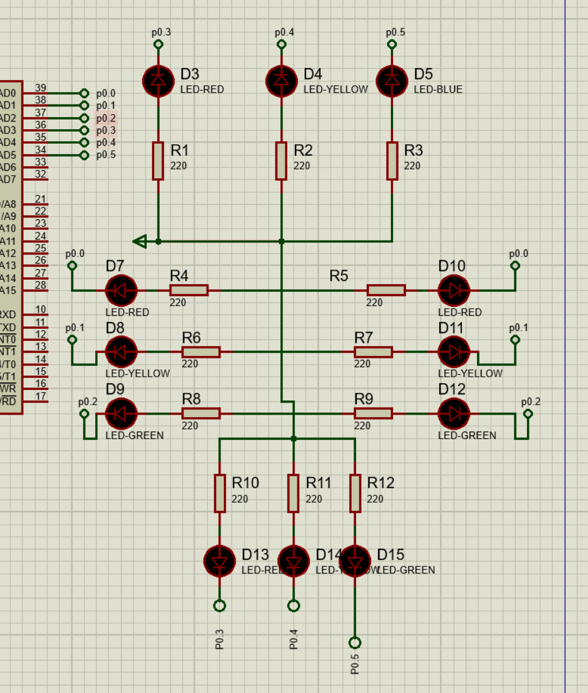

# 红绿灯



东西向

P0.0 红灯

P0.1 黄灯

P0.2 绿灯

南北向

P0.3 红

P0.4 黄

P0.5 绿

都是给个低电平就亮

操作控制：

1. 东西向绿灯亮，南北向红灯亮 P0.2=0;P0.3=0;
2. 东西向黄灯闪5次 for(int i=0;i<5;i++) {P0.1=0;   delay_ms(1000);   P0.1=1;   delay_ms(1000);}
3. 东西向红灯亮，南北向绿灯亮 P0.0=0;    P0.5=0;
4. 南北向黄灯闪5次   for(int i=0;i<5;i++){P0.4=0; delay_ms(1000);  P0.4=1; delay_ms(1000);}

```c
#include<reg51.h>
#include <intrins.h>

#define uint unsigned int
#define uchar unsigned char
#define ON 0
#define OFF 1
sbit dong_xi_red=P0^0;
sbit dong_xi_yellow=P0^1;
sbit dong_xi_green=P0^2;

sbit nan_bei_red=P0^3;
sbit nan_bei_yellow=P0^4;
sbit nan_bei_green=P0^5;

int i;

void delay10us(){ 
_nop_();_nop_();_nop_();_nop_();_nop_();
_nop_();_nop_();_nop_();_nop_();_nop_();
}


void delay1ms(uint i){
uchar t;
while(i--)
for(t=100;t>0;t--)
delay10us();
}

void light_all_off()
{
	P0=0XFF;
	
}
void operation_1()
{
	light_all_off();
	
	dong_xi_green=ON;
	nan_bei_red=ON;
	delay1ms(1000);
	
	
}


void operation_2()
{
	light_all_off();
	
	
	 
	
	for( i=0;i<5;i++){
	dong_xi_yellow=ON;
		delay1ms(500);
	dong_xi_yellow=OFF;
		delay1ms(500);
		
	
		
	}
}

void operation_3()
{
	
	light_all_off();
	
	
	dong_xi_red=ON;
	nan_bei_green=ON;
	delay1ms(1000);
}


void operation_4()
{
	light_all_off();
	
	for(i=0;i<5;i++){
	nan_bei_yellow=ON;
		delay1ms(500);
	nan_bei_yellow=OFF;
		delay1ms(500);
		
	}
} 

int main(){
	
	
	
	
	
	while(1){
		
		operation_1();
		operation_2();
		operation_3();
		operation_4();
		
		
		
	}
	
	
	return 0;
}
```


# 8只数码管显示多个不同字符


## 代码

```c
#include <reg51.h>

#define uchar unsigned char

uchar i;
unsigned char code seg_tab[10] =
{
    0xC0, // 0
    0xF9, // 1
    0xA4, // 2
    0xB0, // 3
    0x99, // 4
    0x92, // 5
    0x82, // 6
    0xF8, // 7
    0x80, // 8
    0x90  // 9
};

void DelayUs(uchar t)
{
    while(t--);
}

void main(void)
{
    P0 = 0xFF;   
    P2 = 0x00;  

    while(1)
    {
        for(i = 0; i < 8; i++)
        {
            P2 = 0x00;              
            P0 = seg_tab[i];       
            P2 = (1 << i);         
            DelayUs(200);          
        }
    }
}

```


## 代码

```c
#include <reg51.h>

#define uchar unsigned char

unsigned char code seg_char[] =
{
    0x88, // A
    0x83, // b
    0xC6, // C
    0xA1, // d
    0x86, // E
    0x8E  // F
};

void DelayUs(uchar t)
{
    while(t--);
}

void main(void)
{
    uchar i;

    while(1)
    {
        for(i = 0; i < 8; i++)
        {
            P2 = 0x00;   
            
            P0 = seg_char[i % 6];          
            P2 = (1 << i);                
            DelayUs(200);
        }
    }
}

```


# 基本I/O口实验


## 流水灯

```c
#include<reg51.h>
#include <intrins.h>

#define uint unsigned int
#define uchar unsigned char


void delay10us(){ 
    _nop_();_nop_();_nop_();_nop_();_nop_();
    _nop_();_nop_();_nop_();_nop_();_nop_();
}


void delay1ms(uint i){
    uchar t;
    while(i--){
        for(t=100;t>0;t--){
            delay10us();
        }
    }
}

int main(){
    uint i;
    while(1){
        
        for(i=0;i<8;i++){
            P1 = ~(1 << i);  
            delay1ms(500);   
        }
    }
    return 0;
}
```


## 按键控制

```c
#include <reg51.h>
#include <intrins.h>

#define uchar unsigned char
#define uint unsigned int


void main(){
    uchar state;  
    
    while(1){
        state = P3;  
        
       
        P1 = 0xFF;  
        
        switch(state){
           
            case 0xFE:  
                P1 &= 0xFE;  
                break;
            
            
            case 0xFD:  
                P1 &= 0xFD;  
                break;
            
            
            case 0xFB:  
                P1 &= 0xFB;  
                break;
            
            
            case 0xF7:  
                P1 &= 0xF7;  
                break;
            
            
            default:
                P1 = 0xFF;  
                break;
        }
    }
}
```


# 中断，定时器


## 外部中断

```c
#include <reg51.h>
#include <intrins.h>  // 需包含_crol_函数头文件
unsigned char a;

void main(){
    EA = 1;         // 总中断允许（设置总中断允许位）
    EX0 = 1;        // 外中断0允许（设置外中断0允许位）
    PX0 = 1;        // 外中断0高优先级（设定外中断0的优先级）
    IT0 = 1;        // 外中断0触发方式：下降沿触发（按键按下时电平从高到低变化）
    a = 0xfe;       // 初始状态：P1.0点亮（0xfe=11111110）
    P1 = a;         // 初始显示
    while(1);       // 主循环等待中断
}

void exint0_isr() interrupt 0{  // 外中断0中断服务函数（中断号0）
    // 按键消抖（避免机械抖动导致多次触发）
    unsigned int i;
    for(i=0;i<10000;i++);  // 约10ms延时
    
    P1 = a;                 // 当前值输出到P1口
    a = _crol_(a, 1);       // a循环左移一位（流水灯移动）
}
```


## 定时器


```c


#include <reg51.h>
#include <intrins.h>  // 包含循环左移函数_crol_
unsigned char a;

void main(){
    TMOD = 0x01;        // 定时器0工作在方式1（16位定时模式）
    TH0 = 0x3c;         
    TL0 = 0xb0;         // 初值计算：定时50ms（晶振12MHz时）
                        // 12MHz晶振，机器周期=1us，50ms=50000us
                        // 初值=65536 - 50000 = 15536 = 0x3cB0
    
    EA = 1;             // 总中断允许
    ET0 = 1;            // 定时器0中断允许
    TR0 = 1;            // 启动定时器0
    a = 0xfe;           // 初始状态：P1.0点亮
    P1 = a;             // 初始显示
    while(1);           // 主循环等待中断
}

void Timer0() interrupt 1{  // 定时器0中断服务函数（中断号1）
    TH0 = 0x3c;             // 重置定时器高8位
    TL0 = 0xb0;             // 重置定时器低8位（避免下次定时不准）
    a = _crol_(a, 1);       // 循环左移一位
    P1 = a;                 // 更新LED显示
}
```


## 定时器长定时

```c
#include <reg51.h>
#include <intrins.h>

unsigned char a;
unsigned int count = 0;  // 中断次数计数器

void main(){
    TMOD = 0x01;        // 定时器0工作在方式1（16位定时模式）
    TH0 = 0x3c;         
    TL0 = 0xb0;         // 初值计算：定时50ms（晶振12MHz时）
    
    EA = 1;             // 总中断允许
    ET0 = 1;            // 定时器0中断允许
    TR0 = 1;            // 启动定时器0
    a = 0xfe;           // 初始状态：P1.0点亮
    P1 = a;             // 初始显示
    while(1);           // 主循环等待中断
}

void Timer0() interrupt 1{  // 定时器0中断服务函数
    TH0 = 0x3c;             // 重置定时器高8位
    TL0 = 0xb0;             // 重置定时器低8位
    
    count++;                // 中断次数加1
    
    if(count == 20){        // 50ms × 20 = 1000ms = 1秒
        count = 0;          // 计数器清零
        a = _crol_(a, 1);   // 循环左移一位
        P1 = a;             // 更新LED显示
    }
}
```

## 用外部中断控制定时器

```c
#include <reg51.h>
#include <intrins.h>

unsigned char a;
unsigned int count = 0;
bit run_flag = 0;           // 运行标志：0-停止，1-运行

void main(){
    // 定时器0初始化
    TMOD = 0x01;            // 定时器0工作在方式1
    TH0 = 0x3c;         
    TL0 = 0xb0;             // 定时50ms
    
    // 中断系统初始化
    EA = 1;                 // 总中断允许
    ET0 = 1;                // 定时器0中断允许
    EX0 = 1;                // 外中断0允许
    IT0 = 1;                // 外中断0下降沿触发
    
    
    // 初始状态
    a = 0xfe;               // 初始LED状态
    P1 = a;                 // 显示初始状态
    TR0 = 0;                // 定时器初始为停止状态
    
    
    while(1);               // 主循环等待中断
    
}

// 定时器0中断服务函数 - 实现1秒定时
void Timer0() interrupt 1{
    TH0 = 0x3c;
    TL0 = 0xb0;
    
    count++;
    if(count == 20){        // 1秒到
        count = 0;
        a = _crol_(a, 1);   // LED移动
        P1 = a;
    }
}

// 外部中断0服务函数 - 控制启动/停止
void exint0_isr() interrupt 0{
    unsigned int i;
    
    // 按键消抖
    for(i=0;i<10000;i++);
    
    // 切换运行状态
    run_flag = ~run_flag;
    
    // 根据运行标志控制定时器
    if(run_flag){
        TR0 = 1;            // 启动定时器
    }
    else{
        TR0 = 0;            // 停止定时器
    }
    
    // 等待按键释放
    while(!P3_2);           // P3.2是INT0引脚
    
    // 释放消抖
    for(i=0;i<10000;i++);
}
```

## 问题

1、在上边的外中断程序中，INT0 的触发方式应如何选择才能达效果？如果选择了另一种触发方式，会产

生什么现象？简单解释这种现象。

当前采用

```c
IT0 = 1;  // 下降沿触发：当P3.2引脚从高电平变为低电平时触发中断
```

另一种

```c
IT0 = 0;  // 低电平触发：只要P3.2引脚为低电平就持续触发中断
```

### 会产生什么现象：

- **重复触发问题**：按键按下期间会持续产生中断，导致中断服务程序被重复执行
- **状态混乱**：流水灯的启动/停止状态会快速切换，失去控制效果
- **程序异常**：可能导致LED显示异常或程序死锁

### 现象解释：

下降沿触发只在按键按下的瞬间（电平从高到低变化时）触发一次中断，符合"按一次键执行一次操作"的需求。而低电平触发在按键保持按下的整个期间都会不断触发中断，机械按键的抖动和长时间按压会导致多次误触发。


2、假设外部晶振为 12MHz，若不采用长定时程序结构，8051 定时器的最长理论定时时间是多少？

```
// 12MHz晶振，机器周期 = 12 / 12MHz = 1μs
// 定时器为16位，最大计数值 = 65536
// 最长定时时间 = 65536 × 1μs = 65536μs = 65.536ms
//实际应用中通常采用软件计数的方式实现更长定时
```


3、上述定时器程序均采用了中断的方式来处理定时时间到时的用户程序，若不用定时器中断，而采用查询

的方式来处理用户程序，应该如何改写步骤 2 中的程序？

```c
#include <reg51.h>
#include <intrins.h>

unsigned char a;
unsigned int count = 0;

void main(){
    TMOD = 0x01;        // 定时器0工作在方式1
    TH0 = 0x3c;         
    TL0 = 0xb0;         // 定时50ms
    
    TR0 = 1;            // 启动定时器0
    a = 0xfe;           // 初始状态
    P1 = a;             // 初始显示
    
    while(1){           // 主循环中查询
        if(TF0 == 1){   // 查询定时器溢出标志
            TF0 = 0;    // 必须软件清除溢出标志
            
            // 重新装载初值
            TH0 = 0x3c;
            TL0 = 0xb0;
            
            count++;    // 计数加1
            
            if(count == 20){    // 1秒到
                count = 0;
                a = _crol_(a, 1);   // LED移动
                P1 = a;
            }
        }
        
    }
}
```

# 数码管的显示

## 单个数码管的显示


```c
#include <reg51.h>
#define uchar unsigned char

// 共阳数码管段码表 (0-9)
uchar code seg_ca[] = {0xc0,0xf9,0xa4,0xb0,0x99,0x92,0x82,0xf8,0x80,0x90};

uchar i; // 数码管显示计数 (0-9)
uchar n; // 长定时计数 (50ms计数)

void main(){
    // 定时器1初始化，实现50毫秒的定时
    TMOD = 0x10;        // 定时器1工作在方式1(16位定时模式)
    TH1 = (65536-50000)/256;    // 50ms定时初值高8位
    TL1 = (65536-50000)%256;    // 50ms定时初值低8位
    TR1 = 1;            // 启动定时器1
    
    // 中断设置
    EA = 1;             // 开总中断
    ET1 = 1;            // 开定时器1中断
    
    i = 0;              // 初始显示数字0
    n = 0;              // 定时计数器清零
    
    P2 = seg_ca[i];     // 初始显示数字0
    
    while(1);           // 主循环等待中断
}

void Timer1() interrupt 3 {  // 定时器1中断服务函数(中断号3)
    // 重新装载初值
    TH1 = (65536-50000)/256;
    TL1 = (65536-50000)%256;
    
    n++;                // 50ms计数加1
    
    if(n == 5){         // 5 × 50ms = 250ms
        n = 0;          // 计数器清零
        
        i++;            // 显示下一个数字
        if(i == 10){    // 如果超过9
            i = 0;      // 回到0
        }
        
        P2 = seg_ca[i]; // 更新数码管显示
    }
}
```

## **利用串口方式** **0** **扩展数码管**


```c
#include <reg51.h>
#include <string.h>
#define uchar unsigned char
#define uint unsigned int

// 字符串 "HELLO" 的段码（共阳极数码管）
// 注意：要逆序发送，因为最左边的数码管需要最后显示
// 实际顺序是：O L L E H
uchar code ch[] = {0xC0, 0xC7, 0xC7, 0x86, 0x89}; // O L L E H 的段码

uchar i;

void delayms(uint j){ // 延时函数
    uchar i;
    for(;j>0;j--){
        i = 250; while(--i);
        i = 249; while(--i);
    }
}

void main(){
    SCON = 0x00; // 串口方式0：SM0=0, SM1=0
    
    
    while(1) {
        for(i=0; i<strlen(ch); i++){ 
            SBUF = ch[i];  
            while(!TI);    
            TI = 0;      
            delayms(5);
        }
        
        
        SBUF = 0xFF;  
        while(!TI);
        TI = 0;
        
        delayms(1000);  
    }
		
		
		
}
```


## 多数码管动态扫描


### 方案一


```c
#include <reg51.h>
#include <intrins.h>
#define uchar unsigned char
#define uint unsigned int
uchar code seg_ca[] = {0xc0,0xf9,0xa4,0xb0,0x99,0x92,0x82,0xf8,0x80,0x90};//0~9 共阳极段码
//uchar code seg_ca[] = {0x89,0x86,0xc7,0xc7,0xc0,0xff}; //字符串 Hello 段码
void delayms(uint j){
uchar i;
for(;j>0;j--){
i = 250;
while(--i);
i = 249;
while(--i);
}
}
void main(){
uchar i, j = 0x01;
while(1){
for(i=0; i<6; i++){
P2 = j;
P0 = seg_ca[i];
j = _crol_(j,1);
if(j==0x40)
j=0x01;
delayms(200); 
P0 = 0xff;
}
}
}
```


### 方案二


```c
#include <reg51.h>
#include <intrins.h>
#define uchar unsigned char
#define uint unsigned int
uchar code seg_ca[] = {0xc0,0xf9,0xa4,0xb0,0x99,0x92,0x82,0xf8,0x80,0x90};//0~9 ?????
//uchar code seg_ca[] = {0x89,0x86,0xc7,0xc7,0xc0,0xff}; //??? Hello ??
sbit DULA = P2^0;
sbit WELA = P2^1;
void delayms(uint i){
uchar t;
while(i--)
for(t=0;t<120;t++);
}
void main(){
uchar i;
uchar j = 0x01;
while(1){
for(i=0;i<6;i++){
DULA = 0;
WELA = 1;
P0 = j;
DULA = 1;
WELA = 0;
P0 = seg_ca[i];
delayms(200);
P0 = 0xff;

j = _crol_(j,1);
if(j==0x40)
j=0x01;
}
}
}
```


## 思考问题

### 为什么没有设定串口波特率？

在教材图5-2的串口实验中，很可能使用了**工作方式0**（同步移位寄存器模式）。在这种模式下：

- **不需要设置波特率**：方式0的波特率固定为**fosc/12**
- 对于12MHz晶振，波特率 = 12MHz/12 = 1MHz
- 数据传输是同步的，使用移位脉冲

### 该显示方式属于静态显示还是动态显示？

**属于静态显示**

**原因：**

- 每个数码管都有独立的锁存器（如74LS164）
- 数据发送完成后，数码管会保持显示直到新数据到来
- 不需要不断刷新显示
- 显示稳定无闪烁


### 发送

```c
#include <reg51.h>
#define uchar unsigned char

// 共阳数码管段码表
uchar code seg_ca[] = {0xc0,0xf9,0xa4,0xb0,0x99,0x92,0x82,0xf8,0x80,0x90};

uchar i = 0;        // 显示数字计数
uchar count = 0;    // 定时计数

void main(){
    // 定时器1初始化 - 用于串口波特率
    TMOD = 0x21;    // 定时器1方式2(8位自动重装)，定时器0方式1(16位)
    
    // 定时器0初始化 - 500ms定时
    TH0 = (65536-50000)/256;    // 50ms初值
    TL0 = (65536-50000)%256;
    
    // 串口初始化 - 方式1，波特率9600
    SCON = 0x50;    // 方式1，允许接收
    PCON = 0x00;    // SMOD=0
    TH1 = 0xFD;     // 9600波特率初值
    TL1 = 0xFD;
    
    // 启动
    TR0 = 1;        // 启动定时器0
    TR1 = 1;        // 启动定时器1
    ET0 = 1;        // 开启定时器0中断
    EA = 1;         // 开总中断
    
    // 初始显示
    P2 = seg_ca[i];
    while(1);
}

void Timer0() interrupt 1{
    TH0 = (65536-50000)/256;
    TL0 = (65536-50000)%256;
    
    count++;
    if(count == 10){    // 10 × 50ms = 500ms
        count = 0;
        
        i++;
        if(i == 10) i = 0;
        
        // 更新本地显示
        P2 = seg_ca[i];
        
        // 通过串口发送给U2
        TI = 0;         // 清除发送中断标志
        SBUF = seg_ca[i]; // 发送段码数据
        while(!TI);     // 等待发送完成
        TI = 0;         // 清除标志
    }
}
```


```c
#include <reg51.h>
#define uchar unsigned char

uchar received_data;    // 接收到的数据

void main(){
    // 串口初始化
    TMOD = 0x20;        // 定时器1方式2
    SCON = 0x50;        // 方式1，允许接收
    PCON = 0x00;        // SMOD=0
    TH1 = 0xFD;         // 9600波特率
    TL1 = 0xFD;
    
    // 启动
    TR1 = 1;            // 启动定时器1
    ES = 1;             // 开启串口中断
    EA = 1;             // 开总中断
    
    // 初始显示
    P2 = 0xFF;          // 初始不显示
    while(1);
}

// 串口中断服务函数
void Serial() interrupt 4{
    if(RI == 1){        // 如果是接收中断
        RI = 0;         // 清除接收中断标志
        received_data = SBUF; // 读取接收到的数据
        P2 = received_data; // 在数码管上显示
    }
}
```


# 串口通信


## 接收端

```c
#include <reg51.h>

void main(){
    // 波特率设定 - 2400bps @ 11.0592MHz
    TMOD = 0x20;        // 定时器1工作方式2
    TH1 = 0xF4;         // 2400波特率初值
    TL1 = 0xF4;         // 重装值
    PCON = 0x00;        // SMOD=0，波特率不倍增
    SCON = 0x50;        // 000000000000000串口方式1，允许接收
    
    TR1 = 1;            // 启动定时器1
    
    // 中断设置
    EA = 1;             // 打开总中断允许位
    ES = 1;             // 打开串口中断允许位
    
    while(1);           // 主循环等待中断
}

// 串口中断服务函数
void Serial_ISR() interrupt 4 {  // 串口中断号是4
    unsigned char a;
    
    if(RI == 1){                // 如果是接收中断
        RI = 0;                 // 将串口接收标志位RI清零
        a = SBUF;               // 将收到的数据存入变量a
        
        // 将接收到的数据发送到虚拟终端显示
        SBUF = a;               // 收到数据的同时把该数据在TXD脚上输出
        while(TI == 0);         // 等待发送完成
        TI = 0;                 // 清除发送标志
    }
}
```

## 发送端

```c
#include <reg51.h>
#include <string.h>

// 要发送的字符串
unsigned char code ch[] = "Hello Boy!";

void Send_string(unsigned char *str){
    unsigned char i;
    for(i=0; i<strlen(str); i++){
        SBUF = str[i];          // 将待发的字节送入发送缓冲区
        while(TI == 0);         // 查询发送标志位TI，等待传送完成
        TI = 0;                 // 将发送标志位TI清零
    }
}

void main(){
    // 波特率设定 - 2400bps @ 11.0592MHz
    TMOD = 0x20;        // 定时器1工作方式2
    TH1 = 0xF4;         // 2400波特率初值
    TL1 = 0xF4;         // 重装值
    PCON = 0x00;        // SMOD=0，波特率不倍增
    SCON = 0x40;        // 串口方式1，不允许接收
    
    TR1 = 1;            // 启动定时器1
    
    Send_string(ch);    // 调用发送函数
    
    while(1);
}
```

## 思考

接收2端查询方式

```c
#include <reg51.h>

void main(){
    unsigned char received_char;
    
    // 波特率设定 - 2400bps @ 11.0592MHz
    TMOD = 0x20;        // 定时器1工作方式2
    TH1 = 0xF4;         // 2400波特率初值
    TL1 = 0xF4;         // 重装值
    PCON = 0x00;        // SMOD=0，波特率不倍增
    SCON = 0x50;        // 串口方式1，允许接收
    
    TR1 = 1;            // 启动定时器1
    
    // 不需要中断设置（查询方式）
    
    while(1){
        // 查询接收标志位RI
        if(RI == 1){                // 如果收到数据
            RI = 0;                 // 清除接收标志位
            received_char = SBUF;   // 读取接收到的数据
            
            // 将接收到的数据发送到虚拟终端显示
            SBUF = received_char;   // 发送到虚拟终端
            while(TI == 0);         // 等待发送完成
            TI = 0;                 // 清除发送标志
        }
    }
}


```


# RAM6264


```c
#include <reg51.h>
#include <string.h>

#define uchar unsigned char


uchar code str[] = "HelloWorld123456"; 

void main(){
    uchar i;
    
    
    uchar xdata *p; 

    p = (uchar xdata *)0x8000; 
    
   
    for(i = 0; i < strlen(str); i++){
        *p = str[i]; 
        p++;
    }
    
    while(1);
}
```

在上述程序的基础上添加代码，如何实现将 6264 存储器的地址 0000H 开始的连续 10 个字节的内

容，写入到 6264 的地址 0020H 开始的连续 10 个字节单元中?


```c
#include <reg51.h>
#define uchar unsigned char

void main(){
    uchar i;
    
    uchar xdata *src_p = (uchar xdata *)0x8000; 
    
   
    uchar xdata *dst_p = (uchar xdata *)0x8020; 

   
    for(i = 0; i < 10; i++){
        *dst_p = *src_p;  
        src_p++;          
        dst_p++;         
    }

    while(1); 
}
```


6264 的片选信号 CS 连接到了 8051 单片机的地址总线的最高位 A15。如果将 CS 连

接到 A14，程序应如何修改，整个设计才能正常工作？

答：将地址改为0X4000,无关位是0


# 8255A

## 原理图


## 代码


```c
#include <reg51.h>
#include <absacc.h>
#include <intrins.h>

#define uchar unsigned char

uchar x;


void DelayMS(uchar ms)
{
    uchar i;
    while(ms--)
        for(i=0;i<120;i++);
}

void main(void)
{
    
    XBYTE[0x7FFF] = 0x80;   

    x = 0xFE;              

    while(1)
    {
        XBYTE[0x7FFC] = x; 
        XBYTE[0x7FFD] = x;

        x = _crol_(x,1);  
        DelayMS(1000);
    }
}

```


1、在图 7-1 中，锁存器 74HC573 的 Q1,Q0 引脚连接到了 8255A 的 A1,A0 引脚。如果把连接到 A1,A0

的锁存器引脚由 Q1,Q0 改为 Q7,Q6，程序应如何修改，才能正常工作？


原A 0111 1111 1111 11<font color='red'>00</font> 7FFC

现A 0111 1111 <font color='red'>00</font>11 1111      7F3F

原B 0111 1111 1111 11<font color='red'>01</font> 7FFD

现B 0111 1111 <font color='red'>01</font>11 1111 7F7F


在此基础上，再把连接片选信号 CS

的单片机引脚由 P2.7 改为 P2.5，程序应如何修改，才能正常工作？


原A <font color='red'>0</font>111 1111 1111 1100 7FFC

现A 11<font color='red'>0</font>1 1111 0011 1111 EF3F

原B <font color='red'>0</font>111 1111 1111 1101 7FFD

现B 11<font color='red'>0</font>1 1111 0111 1111 EF7F


2、在图 7-1 中，如果把第二组 8 位流水灯接到 PC 口上，程序应如何修改，才能正常工作？

 XBYTE[0x7FFE] = x;


# 单总线控制 **DS18B20**


## 代码

```c
#include <reg51.h>
#include <absacc.h>
#include <intrins.h>

#define uchar unsigned char
#define uint unsigned int

// 定义 DS18B20 数据引脚，对应电路图 P1.0
sbit DQ = P1^0;

// 定义数码管片选地址 (根据题目提供的定义)
#define LED0 XBYTE[0xfeff] // 小数位
#define LED1 XBYTE[0xfdff] // 个位
#define LED2 XBYTE[0xfbff] // 十位
#define LED3 XBYTE[0xf7ff] // 百位
#define LED4 XBYTE[0xefff] // 符号位

// 共阳极数码管段码表 (0-9, 无小数点)
// 0:0xC0, 1:0xF9, 2:0xA4, 3:0xB0, 4:0x99, 
// 5:0x92, 6:0x82, 7:0xF8, 8:0x80, 9:0x90
uchar code DSPCODE_CA[] = {0xC0, 0xF9, 0xA4, 0xB0, 0x99, 0x92, 0x82, 0xF8, 0x80, 0x90};

// 简单的毫秒延时函数
void Delay_ms(uint ms) {
    uint i, j;
    for(i = 0; i < ms; i++)
        for(j = 0; j < 110; j++);
}

/**********************************************************
 * DS18B20 复位及存在检测
 **********************************************************/
bit DS18B20_Reset() {
    uchar delay;
    bit flag = 0;
    
    DQ = 1;         // 总线高电平
    _nop_(); _nop_();
    DQ = 0;         // 拉低总线
    delay = 250; while(--delay); // 延时约 500us (复位脉冲 > 480us)
    DQ = 1;         // 释放总线
    delay = 30;  while(--delay); // 等待 15-60us
    
    // 采样存在脉冲
    if(DQ == 0) {
        flag = 1;   // 检测到低电平，说明从机存在
    } else {
        flag = 0;   // 未检测到
    }
    
    // 等待时隙结束 (存在脉冲 60-240us)
    delay = 120; while(--delay); 
    
    DQ = 1; // 确保总线拉高
    return flag;
}

/**********************************************************
 * 写一个字节到 DS18B20
 **********************************************************/
void DS18B20_WrByte(uchar wdata) {
    uchar i, delay;
    for(i = 8; i > 0; i--) {
        DQ = 0;                 // 拉低产生写时隙
        delay = 6; while(--delay); // 延时 >1us (这里约 12us)
        
        DQ = (bit)(wdata & 0x01); // 发送最低位
        
        delay = 20; while(--delay); // 保持数据位 (约 40us，满足 15-60us 采样)
        DQ = 1;                 // 释放总线
        wdata = wdata >> 1;     // 准备下一位
    }
}

/**********************************************************
 * 从 DS18B20 读一个字节
 **********************************************************/
uchar DS18B20_RdByte() {
    uchar i, delay, rdata = 0;
    for(i = 8; i > 0; i--) {
        rdata = rdata >> 1;     // 腾出最高位
        DQ = 0;                 // 拉低产生读时隙
        _nop_(); _nop_();       // 保持低电平 > 1us
        DQ = 1;                 // 释放总线
        
        delay = 4; while(--delay); // 延时等待从机数据有效 (约 8us，需在 15us 内读取)
        
        if(DQ) {
            rdata = rdata | 0x80; // 如果读到 1，置最高位
        }
        
        delay = 23; while(--delay); // 延时完成读时隙 (>60us)
        DQ = 1;
    }
    return rdata;
}

/**********************************************************
 * LED 温度显示函数 (根据题目提供的逻辑)
 **********************************************************/
void Disp(uchar Th, uchar Tl) {
    uchar Tint, Tfp;
    
    // 判断温度正负 (高 5 位为 1 则为负，为 0 则为正)
    if((Th & 0xf8) == 0x00) { 
        // --- 正温度 ---
        Tint = (Th << 4) | (Tl >> 4); // 整数部分
        Tfp = Tl & 0x0f;              // 小数部分 (低 4 位)
        
        // 小数处理 (DS18B20 默认 12 位精度，0.0625 分辨率)
        // 题目逻辑简化为：大于等于 0.5 显示 5，否则显示 0
        if(Tfp >= 8) Tfp = 5; 
        else Tfp = 0;
        
        LED4 = 0xff; // 符号位关闭 (0xFF 全灭，因为共阳)
        LED3 = DSPCODE_CA[Tint / 100];       // 百位
        LED2 = DSPCODE_CA[Tint / 10 % 10];   // 十位
        LED1 = DSPCODE_CA[Tint % 10];        // 个位
        LED0 = DSPCODE_CA[Tfp];              // 小数位
    } 
    else { 
        // --- 负温度 ---
        // 取反加一求补码得到绝对值
        Th = ~Th;
        Tl = ~Tl;
        Tl = Tl + 1; 
        if(Tl == 0x00) Th++; 
        
        Tint = (Th << 4) | (Tl >> 4);
        Tfp = Tl & 0x0f;
        
        if(Tfp >= 8) Tfp = 5; 
        else Tfp = 0;
        
        LED4 = 0xbf; // 符号位打开 (显示负号 '-', 0xBF = 1011 1111)
        LED3 = DSPCODE_CA[Tint / 100];
        LED2 = DSPCODE_CA[Tint / 10 % 10];
        LED1 = DSPCODE_CA[Tint % 10];
        LED0 = DSPCODE_CA[Tfp];
    }
}

/**********************************************************
 * 主函数
 **********************************************************/
void main() {
    uchar TL, TH; // 存储温度的低字节和高字节

    while(1) {
        // --- 第一步：启动温度转换 ---
        DS18B20_Reset();        // 1. 初始化
        DS18B20_WrByte(0xCC);   // 2. 跳过 ROM 指令
        DS18B20_WrByte(0x44);   // 3. 启动温度转换
        
        // 4. 等待转换完成
        // 12 位精度转换时间最长需要 750ms
        // 由于使用的是锁存器(74HC273)，显示不需要循环扫描，可以直接延时等待
        Delay_ms(800); 
        
        // --- 第二步：读取温度数据 ---
        DS18B20_Reset();        // 5. 初始化
        DS18B20_WrByte(0xCC);   // 6. 跳过 ROM 指令
        DS18B20_WrByte(0xBE);   // 7. 读取暂存器指令
        
        TL = DS18B20_RdByte();  // 8. 读低字节
        TH = DS18B20_RdByte();  // 9. 读高字节
        
        // --- 第三步：显示温度 ---
        Disp(TH, TL);
    }
}
```


# IIC

## **8051** **单片机对** **AT24Cxx** **系列** E2PROM **的访问**

U2


```c
#include <reg51.h>
#include <intrins.h>

#define uchar unsigned char
#define uint  unsigned int

sbit SDA = P2^1;
sbit SCL = P2^0;

// U2: A2A1A0=000 => 写0xA0, 读0xA1
// U3: A2A1A0=100 => 写0xA8, 读0xA9
#define U2_WRITE 0xA0
#define U2_READ  0xA1
#define U3_WRITE 0xA8
#define U3_READ  0xA9

// 共阳极段码表 0~F
uchar code seg_table[16] = {
  0xC0, 0xF9, 0xA4, 0xB0, 0x99, 0x92, 0x82, 0xF8,
  0x80, 0x90, 0x88, 0x83, 0xC6, 0xA1, 0x86, 0x8E
};

// 简易延时
void delay_ms(uint ms) {
  uint i, j;
  for(i = 0; i < ms; i++)
    for(j = 0; j < 123; j++);
}

// I2C 起始
void I2C_Start() {
  SDA = 1;
  SCL = 1;
  _nop_(); _nop_();
  SDA = 0;
  _nop_(); _nop_();
  SCL = 0;
}

// I2C 停止
void I2C_Stop() {
  SDA = 0;
  SCL = 1;
  _nop_(); _nop_();
  SDA = 1;
  _nop_(); _nop_();
}

// 发送一个字节
bit I2C_SendByte(uchar dat) {
  uchar i;
  bit ack;
  for(i = 0; i < 8; i++) {
    SDA = (dat & 0x80) ? 1 : 0;
    dat <<= 1;
    SCL = 1;
    _nop_(); _nop_();
    SCL = 0;
  }
  SDA = 1;  // 释放SDA线
  SCL = 1;
  _nop_(); _nop_();
  ack = SDA;  // 读取ACK
  SCL = 0;
  return ack;  // 0:ACK, 1:NACK
}

// 接收一个字节
uchar I2C_RecvByte(bit ack) {
  uchar i, dat = 0;
  SDA = 1;  // 释放数据线
  for(i = 0; i < 8; i++) {
    SCL = 1;
    _nop_(); _nop_();
    dat <<= 1;
    if(SDA) dat |= 0x01;
    SCL = 0;
    _nop_(); _nop_();
  }
  // 发送ACK/NACK
  SDA = ack ? 1 : 0;  // ack=0:发送ACK, ack=1:发送NACK
  SCL = 1;
  _nop_(); _nop_();
  SCL = 0;
  SDA = 1;  // 释放SDA
  return dat;
}

// 向 EEPROM 指定地址写入一个字节
void EEPROM_Write(uchar dev_addr, uchar mem_addr, uchar dat) {
  I2C_Start();
  I2C_SendByte(dev_addr);     // 发送设备地址+写
  I2C_SendByte(mem_addr);     // 发送内存地址
  I2C_SendByte(dat);          // 发送数据
  I2C_Stop();
  delay_ms(5);                // 等待EEPROM内部写完成
}

// 从 EEPROM 指定地址读取一个字节
uchar EEPROM_Read(uchar dev_addr, uchar mem_addr) {
  uchar dat;
  I2C_Start();
  I2C_SendByte(dev_addr);     // 发送设备地址+写（用于发送内存地址）
  I2C_SendByte(mem_addr);     // 发送内存地址
  
  I2C_Start();                // 重复起始条件
  I2C_SendByte(dev_addr | 1); // 发送设备地址+读
  dat = I2C_RecvByte(1);      // 读一个字节，发送NACK表示结束
  I2C_Stop();
  return dat;
}

// 连续读多个字节
void EEPROM_Read_Buffer(uchar dev_addr, uchar mem_addr, uchar *buf, uchar len) {
  uchar i;
  I2C_Start();
  I2C_SendByte(dev_addr);           // 发送设备地址+写
  I2C_SendByte(mem_addr);           // 发送内存地址
  
  I2C_Start();                      // 重复起始条件
  I2C_SendByte(dev_addr | 1);       // 发送设备地址+读
  for(i = 0; i < len - 1; i++) {
    buf[i] = I2C_RecvByte(0);       // 发送ACK继续读
  }
  buf[len - 1] = I2C_RecvByte(1);   // 最后一个字节发NACK
  I2C_Stop();
}

// 连续写多个字节（页写，24C02页大小为8字节）
void EEPROM_Write_Buffer(uchar dev_addr, uchar mem_addr, uchar *buf, uchar len) {
  uchar i;
  for(i = 0; i < len; i++) {
    EEPROM_Write(dev_addr, mem_addr + i, buf[i]);
  }
}

void main() {
  uchar i;
  uchar buffer[16];
  
  // 步骤 b: 向U2的0x00写入段码表
  EEPROM_Write_Buffer(U2_WRITE, 0x00, seg_table, 16);
  
  // 步骤 c: 从U2读出16字节，写入U3的0x10
  EEPROM_Read_Buffer(U2_READ, 0x00, buffer, 16);
  EEPROM_Write_Buffer(U3_WRITE, 0x10, buffer, 16);
  
  // 步骤 d: 循环显示这16个段码到P1口
  while(1) {
    for(i = 0; i < 16; i++) {
      P1 = buffer[i];
      delay_ms(500);
    }
  }
}
```


## **8051** **单片机对** **ADC** **器件** **PCF8591** **的访问**


```c
#include <reg51.h>
#include <absacc.h>
#include <intrins.h>

#define uchar unsigned char
#define uint unsigned int

// --- 外部总线数码管地址定义 (根据题目要求) ---
#define LED0 XBYTE[0xf7ff]  // 个位 (最低位)
#define LED1 XBYTE[0xefff]  // 十位
#define LED2 XBYTE[0xdfff]  // 百位
#define LED3 XBYTE[0xbfff]  // 千位 (最高位)

// --- I2C 引脚定义 (根据你的电路图连接修改) ---
sbit SDA = P2^0; 
sbit SCL = P2^1;

// --- 共阳极段码表 (0-9) ---
uchar code DSPCODE_CA[] = {
    0xC0, 0xF9, 0xA4, 0xB0, 0x99, 
    0x92, 0x82, 0xF8, 0x80, 0x90
};

// --- 延时函数 ---
void Delay10us() {
    _nop_(); _nop_(); _nop_(); _nop_(); _nop_();
}

void DelayMS(uint ms) {
    uint i, j;
    for(i = 0; i < ms; i++)
        for(j = 0; j < 110; j++);
}

// --- I2C 底层驱动 ---
void I2C_Start() {
    SDA = 1; SCL = 1; Delay10us();
    SDA = 0; Delay10us();
    SCL = 0;
}

void I2C_Stop() {
    SDA = 0; SCL = 1; Delay10us();
    SDA = 1; Delay10us();
}

// 等待应答
bit I2C_WaitAck() {
    bit ack;
    SDA = 1; Delay10us();
    SCL = 1; Delay10us();
    ack = SDA;
    SCL = 0; Delay10us();
    return ack;
}

// 发送非应答 (读取最后一个字节时使用)
void I2C_SendNoAck() {
    SDA = 1; Delay10us();
    SCL = 1; Delay10us();
    SCL = 0; Delay10us();
}

// 写一个字节
void I2C_WriteByte(uchar dat) {
    uchar i;
    for(i=0; i<8; i++) {
        SDA = (dat & 0x80);
        dat <<= 1;
        Delay10us();
        SCL = 1; Delay10us();
        SCL = 0; Delay10us();
    }
}

// 读一个字节
uchar I2C_ReadByte() {
    uchar i, dat=0;
    SDA = 1; // 释放总线
    for(i=0; i<8; i++) {
        SCL = 1; Delay10us();
        dat <<= 1;
        if(SDA) dat |= 0x01;
        SCL = 0; Delay10us();
    }
    return dat;
}

// --- PCF8591 操作函数 ---
// 功能：发送控制字并读取 AD 转换结果
uchar Rd_PCF8591(uchar CMD) {
    uchar dat;

    // 1. 启动并发送写地址
    I2C_Start();
    I2C_WriteByte(0x90); // 地址：1001 + A2A1A0(000) + W(0)
    if(I2C_WaitAck()) { I2C_Stop(); return 0; } // 如果无应答则退出

    // 2. 发送控制字节 (CMD)
    I2C_WriteByte(CMD);
    I2C_WaitAck();

    // 3. 重复启动并发送读地址
    I2C_Start();
    I2C_WriteByte(0x91); // 地址：1001 + A2A1A0(000) + R(1)
    I2C_WaitAck();

    // 4. 读取数据
    dat = I2C_ReadByte();
    
    // 5. 发送非应答并停止
    I2C_SendNoAck();
    I2C_Stop();

    return dat;
}

// --- 显示函数 ---
void Display(uint x) {
    // x 是 0~5000 的数值 (代表 0.000V ~ 5.000V)
    
    // 千位 (LED3) - 对应整数部分 V
    // 为了显示小数点，我们可以给这一位加上小数点 (共阳极是减去 0x80，或逻辑与 0x7F)
    // 这里暂时只显示数字，若需小数点可写成：DSPCODE_CA[x/1000] & 0x7F
    LED3 = DSPCODE_CA[x / 1000] & 0x7F; // 加上小数点
    
    // 百位 (LED2)
    LED2 = DSPCODE_CA[x / 100 % 10];
    
    // 十位 (LED1)
    LED1 = DSPCODE_CA[x % 100 / 10];
    
    // 个位 (LED0)
    LED0 = DSPCODE_CA[x % 10];
}

// --- 主函数 ---
void main() {
    uchar adc_val;
    uint v2; // 用于存储换算后的电压值 (mV)
    unsigned long tmp; // 中间变量，防止乘法溢出

    while(1) {
       
        adc_val = Rd_PCF8591(0x02); 

       
        tmp = (unsigned long)adc_val * 5000;
        v2 = tmp / 255;

        // 显示电压
        Display(v2);

        // 延时
        DelayMS(100);
    }
}
```


## **8051** **单片机对温度传感器** **DS1621** **的访问**


```c
#include <reg51.h>
#include <absacc.h>
#include <intrins.h>

#define DELAY_4OPS() {_nop_();_nop_();_nop_();_nop_();}
#define DISP_DIG0   XBYTE[0xfeff]
#define DISP_DIG1   XBYTE[0xfdff]
#define DISP_DIG2   XBYTE[0xfbff]
#define DISP_DIG3   XBYTE[0xf7ff]
#define DISP_SIGN   XBYTE[0xefff]

typedef unsigned char u8;
typedef unsigned int  u16;

sbit I2C_CLK = P3^0;
sbit I2C_DAT = P3^1;

code u8 SegTable[] = {0xc0,0xf9,0xa4,0xb0,0x99,0x92,0x82,0xf8,0x80,0x90};

void SysDelay(u8 val)
{
    u8 n;
    while(val--)
        for(n=0; n<120; n++);
}

void UpdateDisplay(u8 high_byte, u8 low_byte)
{
    if((high_byte & 0x80) == 0x00)
    {
        DISP_SIGN = 0xff;
        DISP_DIG3 = SegTable[high_byte/100];
        DISP_DIG2 = SegTable[high_byte/10%10];
        DISP_DIG1 = SegTable[high_byte%10];
        
        if(low_byte == 0x80)
            DISP_DIG0 = SegTable[5];
        else
            DISP_DIG0 = SegTable[0];
    }
    else
    {
        DISP_SIGN = 0xbf;
        if(low_byte == 0x80)
        {
            DISP_DIG3 = SegTable[~high_byte/100];
            DISP_DIG2 = SegTable[~high_byte/10%10];
            DISP_DIG1 = SegTable[~high_byte%10];
            DISP_DIG0 = SegTable[5];
        }
        else
        {
            high_byte = ~high_byte + 1;
            DISP_DIG3 = SegTable[high_byte/100];
            DISP_DIG2 = SegTable[high_byte/10%10];
            DISP_DIG1 = SegTable[high_byte%10];
            DISP_DIG0 = SegTable[0];
        }
    }
}

void I2C_Start(void)
{
    I2C_DAT = 1;
    I2C_CLK = 1;
    DELAY_4OPS();
    I2C_DAT = 0;
    DELAY_4OPS();
    I2C_CLK = 0;
}

void I2C_Stop(void)
{
    I2C_DAT = 0;
    I2C_CLK = 1;
    DELAY_4OPS();
    I2C_DAT = 1;
    DELAY_4OPS();
    I2C_CLK = 0;
}

void I2C_SendAck(bit do_ack)
{
    if(do_ack)
        I2C_DAT = 0;
    else
        I2C_DAT = 1;
        
    DELAY_4OPS();
    I2C_CLK = 1;
    DELAY_4OPS();
    I2C_CLK = 0;
    I2C_DAT = 1;
    DELAY_4OPS();
}

bit I2C_CheckAck(void)
{
    I2C_DAT = 1;
    DELAY_4OPS();
    I2C_CLK = 1;
    DELAY_4OPS();
    
    if(I2C_DAT)
    {
        I2C_CLK = 0;
        I2C_Stop();
        return 0;
    }
    else
    {
        I2C_CLK = 0;
        return 1;
    }
}

void I2C_WriteByte(u8 dat)
{
    u8 i;
    for(i=0; i<8; i++)
    {
        dat <<= 1;
        I2C_CLK = 0;
        I2C_DAT = CY;
        _nop_();
        I2C_CLK = 1;
        DELAY_4OPS();
        I2C_CLK = 0;
    }
}

u8 I2C_ReadByte(void)
{
    u8 i, res = 0;
    I2C_CLK = 0;
    DELAY_4OPS();
    I2C_DAT = 1;
    
    for(i=0; i<8; i++)
    {
        I2C_CLK = 1;
        DELAY_4OPS();
        res = (res << 1) | I2C_DAT;
        I2C_CLK = 0;
        DELAY_4OPS();
    }
    return res;
}

void Sensor_Config(u8 dev_addr, u8 cmd, u8 cfg_val)
{
    I2C_Start();
    I2C_WriteByte(dev_addr);
    I2C_CheckAck();
    I2C_WriteByte(cmd);
    I2C_CheckAck();
    I2C_WriteByte(cfg_val);
    I2C_CheckAck();
    I2C_Stop();
}

void Sensor_Start(u8 dev_addr, u8 cmd)
{
    I2C_Start();
    I2C_WriteByte(dev_addr);
    I2C_CheckAck();
    I2C_WriteByte(cmd);
    I2C_CheckAck();
    I2C_Stop();
}

u16 Sensor_ReadTemp(u8 dev_addr, u8 cmd)
{
    u16 raw_temp = 0;
    
    I2C_Start();
    I2C_WriteByte(dev_addr);
    I2C_CheckAck();
    I2C_WriteByte(cmd);
    I2C_CheckAck();
    
    I2C_Start();
    I2C_WriteByte(dev_addr + 1);
    I2C_CheckAck();
    
    raw_temp = I2C_ReadByte();
    raw_temp <<= 8;
    I2C_SendAck(1);
    
    raw_temp |= (u16)I2C_ReadByte();
    I2C_SendAck(0);
    
    I2C_Stop();
    return raw_temp;
}

void main()
{
    u16 temp_val = 0;
    u8 h_byte, l_byte;
    
    Sensor_Config(0x90, 0xac, 0x08);
    Sensor_Start(0x90, 0xee);

    while(1)
    {
        temp_val = Sensor_ReadTemp(0x90, 0xaa);
        h_byte = temp_val >> 8;
        l_byte = temp_val & 0x00ff;
        
        UpdateDisplay(h_byte, l_byte);
        SysDelay(50);
    }
}
```


# DAC


```c
#include<reg51.h>
#include<absacc.h>
#include<intrins.h>
#define uchar unsigned char
uchar x=0;
uchar xdata* p = 0x7fff;
void main(){
	while(1){
		*p = x;
//		XBYTE[0x7fff] = x;
		x++;
		_nop_();
		_nop_();
		_nop_();
	}
}

```


图 10-2 的单缓冲连接是 DAC 寄存器直通方式还是输入寄存器直通方式？确定是其中某一种之后，

另一种方式的电路连接是什么样的？

1. 它是 **DAC 寄存器直通方式** (DAC Register Pass-Through)

**判断依据：**
观察电路图中的 **U3 (DAC0832)** 芯片的引脚连接：

*   **$\overline{WR2}$ (18脚)** 和 **$\overline{XFER}$ (17脚)** 都直接连接到了 **GND (地)**。
*   **$ILE$ (19脚)** 接 +5V。
*   **$\overline{CS}$ (1脚)** 和 **$\overline{WR1}$ (2脚)** 分别连接了单片机的地址线和写信号（P2.7 和 WR）。

**原理分析：**
DAC0832 内部有两级缓冲器（寄存器）：第一级是**输入寄存器**，第二级是**DAC寄存器**。

*   当 $\overline{WR2}$ 和 $\overline{XFER}$ 为低电平时，第二级（DAC寄存器）处于**直通（透明）状态**。
*   这意味着，单片机只要把数据写入第一级（输入寄存器），数据就会立刻穿过第二级直接进入 D/A 转换器输出模拟电压。
*   此时电路表现为**单缓冲**工作模式，且透传的是DAC寄存器。

---

2. 另一种方式（输入寄存器直通方式）的电路连接

如果要是改为“输入寄存器直通方式”（即第一级直通，控制第二级），电路连接需要做如下修改：

1.  **让输入寄存器常开（直通）：**
    *   将 **$\overline{CS}$ (1脚)** 接 **GND**。
    *   将 **$\overline{WR1}$ (2脚)** 接 **GND**。
    *   将 **$ILE$ (19脚)** 接 **+5V**。
    *   *注：这样设置后，数据总线上的任何数据都会直接进入输入寄存器，通常不推荐这种接法，因为总线上的噪声会直接影响DAC，除非是专用总线。*

2.  **由单片机控制 DAC 寄存器：**
    *   将 **$\overline{WR2}$ (18脚)** 连接到单片机的 **$\overline{WR}$ (P3.6)** 引脚。
    *   将 **$\overline{XFER}$ (17脚)** 连接到单片机的 **片选信号** (如本图中的 P2.7 或经过译码后的地址线)。


# ADC

## 1


```c
#include<reg51.h>
#define uchar unsigned char
#define uint unsigned int
#define adcdata P0
uchar code DSP_CODE[]={0x3f,0x06,0x5b,0x4f,0x66,0x6d,0x7d,0x07,0x7f,0x6f};//共阴极段码
sbit CLK=P2^3;
sbit ST =P2^2;
sbit EOC=P2^1;
sbit OE =P2^0;
float v;
uint v2;
void DelayMS(uint ms){
uchar i;
while(ms--)
for(i=0;i<120;i++); 
}
void Display_Result(uint x){ //实现”一轮”动态扫描的函数
P3=0xf7; //选中千位
P1= DSP_CODE [x/1000];
DelayMS(1);
P1=0x00; //消除显示残影
P3=0xfb; //选中百位
P1= DSP_CODE [x/100%10];
DelayMS(1);
P1=0x00;
P3=0xfd; //选中十位

P1= DSP_CODE [x%100/10];
DelayMS(1);
P1=0x00;
P3=0xfe; //选中个位
P1= DSP_CODE [x%10]; 
DelayMS(1);
P1=0x00;
}
void main(){
P2=0x8f;
TMOD=0x02;
TH0=0xfe;
TL0=0xfe;
EA=1;ET0=1;TR0=1;
while(1){
ST=0;
ST=1;
ST=0; //利用 ST 的上升沿起动一次 AD 转换
while(EOC==0); //等待转换完成
OE=1; //允许输出
v=adcdata*1.0/255*5000;
v2=v;
Display_Result(v2);
OE=0;
}
}
void Timer0_INT()interrupt 1{
CLK=~CLK;
}
```

该电路连接中，经由 CLOCK 引脚输入的 ADC0808 的工作频率是多少？这个频率是如何生成的？


- **工作频率：** 250 kHz (假设单片机晶振频率为 12MHz)。
- **计算过程：**单片机的定时器 T0 被配置为模式 2（8位自动重装载模式 TMOD=0x02）。初值 TH0=0xfe，即十进制的 254。定时器溢出一次需要的机器周期数为 `256−254=2256−254=2` 个机器周期。一个机器周期 = `12/fosc12/fosc`。在中断服务程序 Timer0_INT 中，执行了 CLK=~CLK，即每发生一次溢出中断，CLK 引脚电平翻转一次。产生一个完整的方波周期（高电平+低电平）需要翻转两次，因此 CLK 的周期为 `2×2=42×2=4` 个机器周期。频率 `fCLK=fosc/(12×4)=fosc/48fCLK=fosc/(12×4)=fosc/48`。如果晶振 `fosc=12 MHzfosc=12 MHz`，则 `fCLK=12000000/48=250,000 Hz=250 kHzfCLK=12000000/48=250,000 Hz=250 kHz`。
- **生成方式：** 通过单片机内部的**定时器 T0 中断**产生。定时器不断溢出触发中断，在中断服务程序中对 P2.3 (CLK) 引脚进行取反操作，从而模拟出时钟信号。


该电路连接中，由 ADC0808 转换并经 OUT8~OUT1 输往 P0 口的值，是数字电压么？如果不是，

简单解释它是什么，以及最终的数字电压是如何得到的。

​	

不是,它是**A/D 转换后的数字量（量化值）**。ADC0808 是一个 8 位的 A/D 转换器

```
V=adcdata255×VrefV=255adcdata×Vref

代码中的 v=adcdata*1.0/255*5000; 正是在执行这一步计算（结果单位为 mV）
```


该电路连接中，如果由电位器 RV1 生成的模拟电压经由 ADC0808 的模拟输入通道 IN3 输入，那

么以上参考程序应做什么修改？

将 P2=0x8f 修改为 **P2=0xbf**


## 2.

中断


```c
//------总线式连接，由EOC产生外部中断读取转换结果---------
//------由定时器0生成ADC0808的外部时钟--------------------
#include <reg51.h>
#include <absacc.h>
#define ADC_CH0 XBYTE[0x7ff8]
#define LED0	XBYTE[0xf7ff]
#define LED1	XBYTE[0xefff]
#define LED2	XBYTE[0xdfff]
#define LED3	XBYTE[0xbfff]
#define uchar	unsigned char
#define uint	unsigned int
uchar code DSYCODE_CA[]={0xc0,0xf9,0xa4,0xb0,0x99,0x92,0x82,0xf8,0x80,0x90};
//uchar code DSYCODE_CC[]={0x3f,0x06,0x5b,0x4f,0x66,0x6d,0x7d,0x07,0x7f,0x6f};
sbit CLK=P1^0;
uchar adc;		//AD转换结果为一个0-255间的量化间隔
float v;		//电压的数字量,单位毫伏
uint v2;		//v取整，用于LED显示

void DelayMS(uint ms){
	uchar i;
	while(ms--)
		for(i=0;i<120;i++); 
}
void Disp(uint x){
	LED3=DSYCODE_CA[x/1000];
	LED2=DSYCODE_CA[x/100%10];
	LED1=DSYCODE_CA[x%100/10];
	LED0=DSYCODE_CA[x%10];
}
void main(){
	TMOD=0x02;
	TH0=0xfe;
	TL0=0xfe;			//设置AD时钟为500kHz
	EA=1;
	ET0=1;TR0=1;		//定时器0中断允许
	EX0=1;IT0=1;		//外中断0允许,设置触发方式
	while(1){
		ADC_CH0=0x00;
		DelayMS(1);
	}
}
void EX_INT0()interrupt 0{
	adc = ADC_CH0;
	v = adc *1.0/255*5000;	//将0~255的量化间隔转换成真正的数字电压
	v2= v;					//对数字电压v取整，用于显示
	Disp(v2);
}
void Timer0()interrupt 1{
	CLK=~CLK;
}
```

1.该种电路连接中，若由电位器 RV1 生成的模拟电压经由 ADC0808 的模拟输入通道 IN4 输入，那

么以上参考程序应做什么修改？

将代码中的宏定义：
\#define ADC_CH0 XBYTE[0x7ff8]
修改为：
\#define ADC_CH0 XBYTE[0x7ffc]


2.ADC0808 的工作模式规定：需要在其 START 引脚上产生一个上升沿来启动一次 AD 转换（参考

前一个直接控制方式的例子），那么在该例程中，是如何实现这一上升沿的？

​		通过执行语句 **ADC_CH0 = 0x00;** 来实现。


3.注释**//(\*2)**处的语句中所赋的值一定要是 0x00 么？可否是其他某个值？

**不一定要是 0x00，可以是任意 8 位数值（0x00~0xFF 均可）。**


4.该例程中采取了利用 ADC0808 的转换结束标志 EOC 来向单片机产生外中断标志的方式来读取数

据和进行 AD 转换；若要采用查询的方式，通过自己编程来查询转换结束标志引脚 EOC 的状态，从而实现

AD 转换，程序应如何修改？

轮询

```c
//------总线式连接，查询EOC读取转换结果---------
//------由定时器0生成ADC0808的外部时钟----------
#include <reg51.h>
#include <absacc.h>
#define ADC_CH0 XBYTE[0x7ff8]	//通道0地址
#define LED0	XBYTE[0xf7ff]
#define LED1	XBYTE[0xefff]
#define LED2	XBYTE[0xdfff]
#define LED3	XBYTE[0xbfff]
#define uchar	unsigned char
#define uint	unsigned int
uchar code DSYCODE_CA[]={0xc0,0xf9,0xa4,0xb0,0x99,0x92,0x82,0xf8,0x80,0x90};//共阳极段码
//uchar code DSYCODE_CC[]={0x3f,0x06,0x5b,0x4f,0x66,0x6d,0x7d,0x07,0x7f,0x6f};
sbit CLK=P1^0;
sbit EOC_Rvs=P3^2;

uchar adc;		//AD转换结果adc是一个0-255间的量化间隔
float v;		//电压的数字量,单位毫伏
uint v2;		//v取整，用于LED显示

void Disp(uint x){
	LED3=DSYCODE_CA[x/1000];
	LED2=DSYCODE_CA[x/100%10];
	LED1=DSYCODE_CA[x%100/10];
	LED0=DSYCODE_CA[x%10];
}
void main(){
	TMOD=0x02;
	TH0=0xfe;
	TL0=0xfe;			//设置AD时钟为250kHz
	EA=1;ET0=1;TR0=1;	//定时器0允许
	while(1){
		ADC_CH0=0x00;	//此处可以赋任意值，该句作用为启动一次AD转换
		while(EOC_Rvs==1);//查询ADC0808的EOC引脚:为0时等待;变为1时继续往下执行
						//由于中间加入了非门,此处的查询条件变为:P3^2为1时等待;为0时继续
		adc = ADC_CH0;
		v = adc *1.0/255*5000;//将0~255的量化间隔转换成真正的数字电压
		v2= v;		//对数字电压v取整，用于显示
		Disp(v2);
	}
}
void Timer0()interrupt 1{
	CLK=~CLK;
}
```


