# 四选一多路选择器设计

## 实验目的

1. 熟悉Quartus II的Verilog HDL文本设计流程
2. 掌握组合电路的设计、仿真和硬件测试方法
3. 学习4选1多路选择器的设计与实现

## 程序设计

###  设计思路

4选1多路选择器有4个数据输入端(a,b,c,d)，2个选择控制端(s0,s1)和1个输出端(y)。根据选择信号的不同组合，选择相应的输入信号输出。

## 代码

```verilog
module MUX41a(a,b,c,d,s0,s1,y);
	input a,b,c,d,s0,s1;
	output y;
	wire[1:0] SEL;
	wire AT,BT,CT,DT;
	assign SEL={s1,s0};
	assign AT=(SEL==0);
	assign BT=(SEL==1);
	assign CT=(SEL==2);
	assign DT=(SEL==3);
	assign y=(a&AT)|(b&BT)|(c&CT)|(d&DT);
endmodule
```

## 仿真图

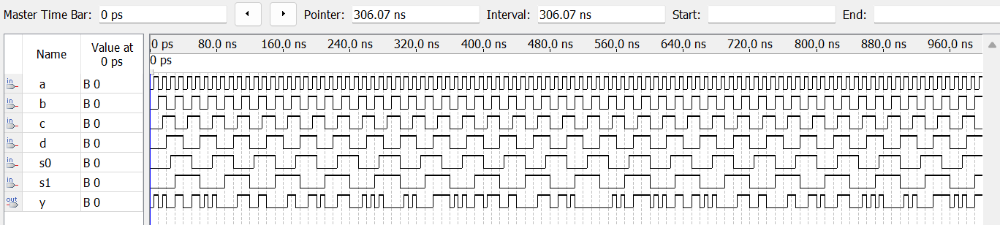

从仿真波形可以看出：

1. 当s1s0=00时，输出y始终等于输入a
2. 当s1s0=01时，输出y始终等于输入b
3. 当s1s0=10时，输出y始终等于输入c
4. 当s1s0=11时，输出y始终等于输入d
5. 电路响应及时，无延迟问题
6. 所有功能均按预期工作，设计正确

## 硬件连接

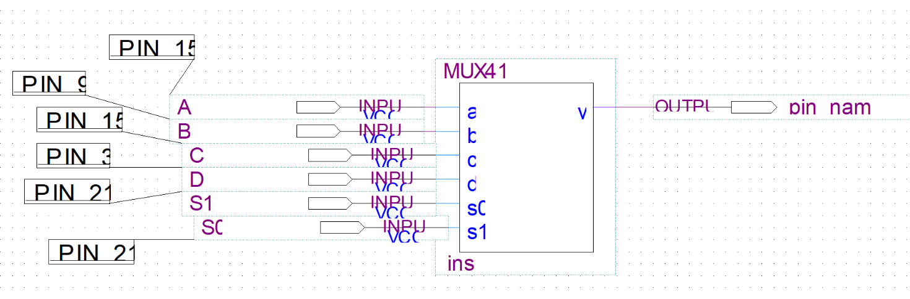

## 实验结果

本次实验成功设计并实现了一个4选1多路选择器，通过软件仿真和硬件测试验证了其功能的正确性。电路能够根据选择信号的不同组合，正确选择相应的输入信号输出。


# 8位加法器设计实验


## 仿真 

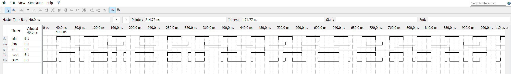

## 封装

### 全加器

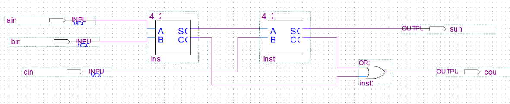

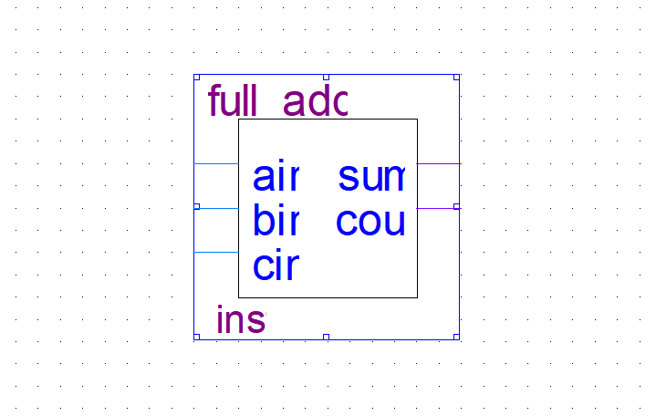

### 半加器

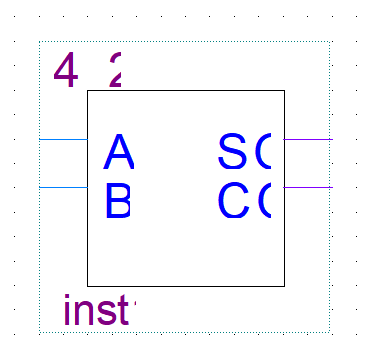

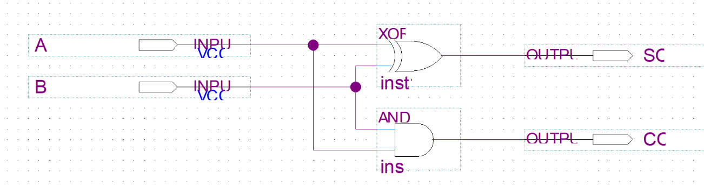

# 8位硬件乘法器

### 实验目的

1. 掌握不同乘法器架构的设计方法
2. 理解行为级、结构级和算法级设计的区别
3. 学习流水线技术和性能优化方法
4. 掌握乘法器的仿真验证和性能分析

### 实验原理

**乘法器基本算法**：

1. **行为级乘法**：直接使用运算符 `p = a * b`

2. **移位相加乘法**：通过移位和累加实现

   ```
   for i=0 to n-1
       if b[i]==1 then p = p + (a << i)
   ```

   

3. **阵列乘法器**：用与门阵列生成部分积，再用加法器阵列求和

4. **Booth算法**：优化有符号数乘法，减少部分积数量

5. **流水线乘法器**：将计算分成多个阶段，提高吞吐量


## 4位

```verilog
module Verilog2(
    input [3:0] a,      // 被乘数
    input [3:0] b,      // 乘数
    output reg [7:0] p  // 乘积
);
    
    always @(*) begin
        p = a * b;  // 直接使用乘法运算符
    end
    
endmodule
```

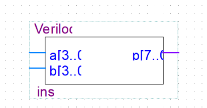


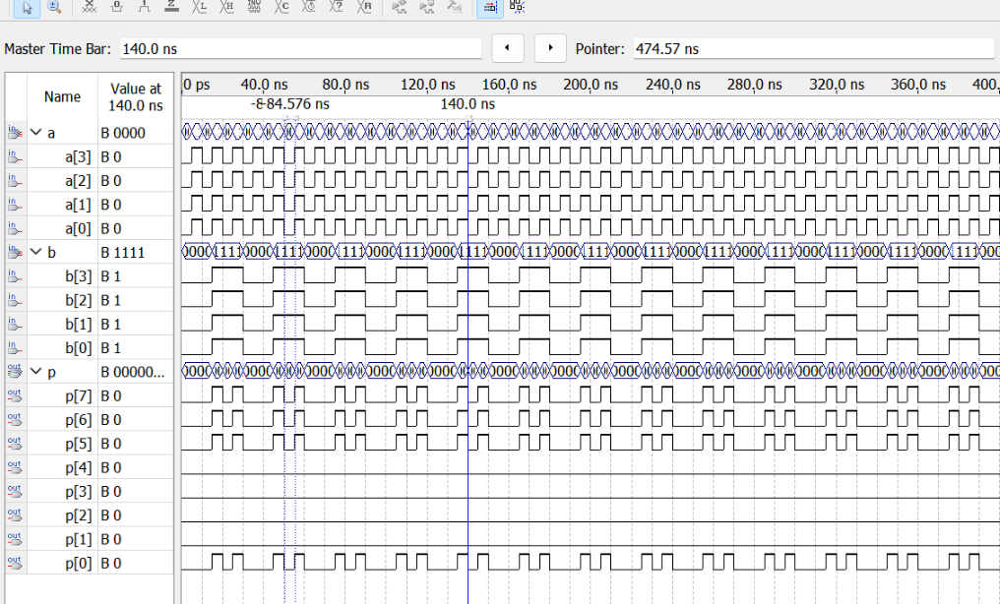


## 8位

```verilog
module Verilog2(
    input [3:0] a,      // 被乘数
    input [3:0] b,      // 乘数
    output reg [7:0] p  // 乘积
);
    
    always @(*) begin
        p = a * b;  // 直接使用乘法运算符
    end
    
endmodule
```


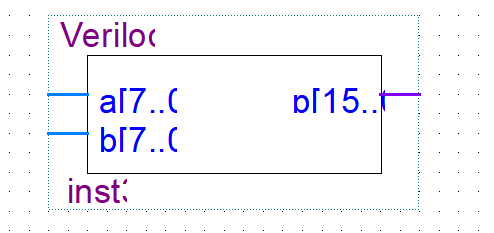


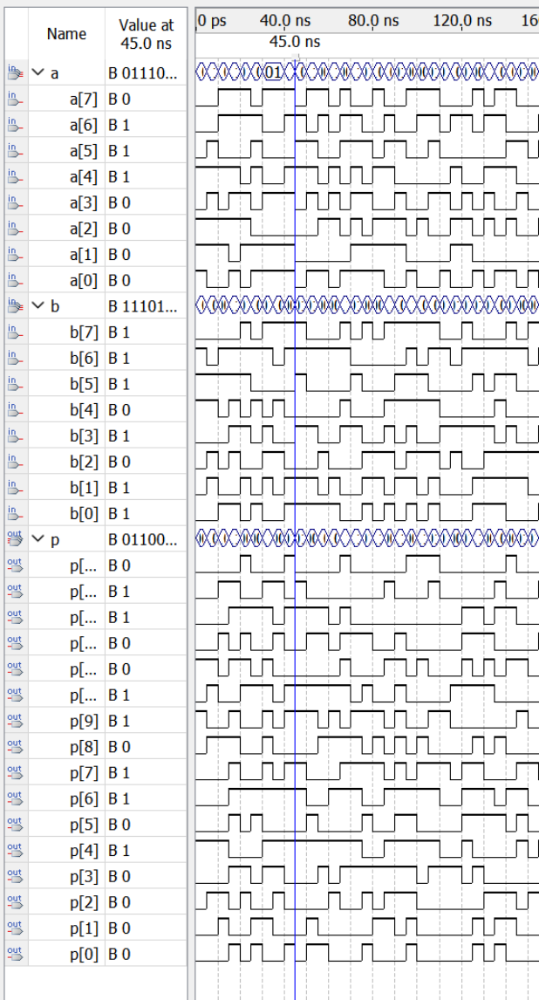

# 实现七段数码管译码器的设计

### 实验目的

1. 掌握硬件扫描显示电路的设计原理
2. 学习动态扫描技术和视觉暂留效应应用
3. 理解数码管和点阵显示器的工作原理
4. 掌握FPGA控制外设显示的方法

### 实验原理

**动态扫描显示原理**：

1. **共用段信号**：所有数码管的段信号(a-h)并联
2. **位选控制**：通过位选信号(k1-k8)轮流点亮数码管
3. **扫描频率**：>60Hz利用人眼视觉暂留效应
4. **消隐处理**：防止数码管间串扰

**工作流程**：

```
循环扫描8个数码管：
  设置段信号 → 打开对应位选 → 保持短暂时间 → 关闭所有 → 下一个
```


**点阵显示器原理**：

- 8×8点阵 = 8行 × 8列LED
- 行扫描 + 列数据驱动
- 字符点阵ROM存储显示模式

## 设计模块

```verilog
module test5(num,a_g);
input[3:0]				num;
output[6:0]				a_g;  // a_g -->{a,b,c,d,e,f,g}
reg[6:0]				a_g;  // always赋值需要定义为reg变量
always@(num)begin  
	case(num)  
	 
	4'd0:	begin a_g <= 7'b111_1110; end  
	4'd1:	begin a_g <= 7'b011_0000; end
	4'd2:	begin a_g <= 7'b110_1101; end
	4'd3:	begin a_g <= 7'b111_1001; end
	4'd4:	begin a_g <= 7'b011_0011; end
	4'd5:	begin a_g <= 7'b101_1011; end
	4'd6:	begin a_g <= 7'b101_1111; end
	4'd7:	begin a_g <= 7'b111_0000; end
	4'd8:	begin a_g <= 7'b111_1111; end
	4'd9:	begin a_g <= 7'b111_1011; end
	default:begin a_g <= 7'b000_0001;  end // 输入超过9，输出“中杠”
	endcase
end
endmodule
```


## 测试文件

```verilog
`timescale 1ns/10ps
module tb_test5;
reg[3:0]			num_in;
wire[6:0]			a_g_out;
test5 my_test5(.num(num_in),.a_g(a_g_out));
initial begin 
				num_in = 0; // 初始化输入
				#3000 $stop; // 4位输入_ _ _ _,16种变化,10ns一个变化，200ns即可
end
always  #10 num_in <= num_in+1;  // 10ns变化一次
endmodule
```


## 仿真结果

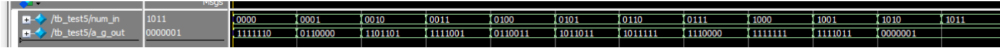

# 计数器设计实验

## 实验目的


1. **掌握时序逻辑电路的设计方法** - 学习基于时钟信号的同步电路设计
2. **理解计数器的工作原理和应用** - 掌握十进制计数器的实现原理
3. **学习多功能计数器的设计** - 集成计数、加载、使能、复位等多种功能
4. **熟悉异步复位和同步使能技术** - 掌握不同控制信号的处理方法
5. **掌握组合逻辑和时序逻辑的混合设计** - 理解两种逻辑的配合使用

## 实验原理

#### 输入信号：

- `CLK`：时钟信号 - 状态变化的同步基准
- `RST`：异步复位 - 高电平有效，立即清零
- `EN`：同步使能 - 高电平有效，允许计数/加载
- `LOAD`：加载控制 - 低电平有效，并行加载数据
- `DATA[3:0]`：并行数据输入 - 加载时的预设值

#### 输出信号：

- `DOUT[3:0]`：计数输出 - 当前计数值
- `COUT`：进位输出 - 计数值为9时产生高电平

## 代码

```verilog
module F5_1 (CLK,RST,EN,LOAD,COUT,DOUT,DATA);
    input CLK,EN,RST,LOAD;      
    input [3:0] DATA;         
    output [3:0] DOUT;          
    output COUT;               
    reg [3:0] Q1;   reg COUT;
    assign DOUT = Q1;           // 将内部寄存器的计数结果输出至 DOUT
    always @(posedge CLK or negedge RST)  // 时序过程
    begin
        if (!RST) Q1 <= 0;      
        else if (EN) begin     
            if (!LOAD) Q1<=DATA; 
            else if (Q1<9) Q1 <= Q1+1;  
            else Q1 <= 4'b0000; end    
    end
    always @(Q1)                 
        if (Q1==4'h9) COUT = 1'b1; else COUT = 1'b0;
endmodule
```


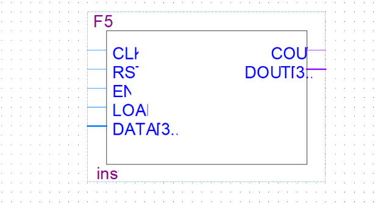


## 仿真结果

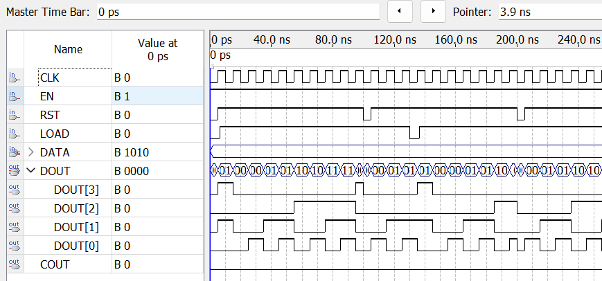

### 功能特点（基于时序仿真波形）

该计数器是**带异步复位、同步使能、数据加载的十进制可预置计数器**，各信号功能如下：

- **CLK（时钟）**：上升沿触发计数 / 加载操作；
- **RST（异步复位）**：低电平时直接将计数器清零（`DOUT` 变为 `0000`），不受时钟约束；
- **EN（使能）**：高电平时允许计数或加载操作；
- **LOAD（加载控制）**：低电平时将 `DATA`（图中为 `1010`）并行加载到计数器，高电平时执行计数；
- **DATA（预置数据）**：4 位并行输入，用于预置计数初始值；
- **DOUT（计数输出）**：4 位计数结果输出，呈现计数过程（如从预置值、0 开始递增）；
- **COUT（进位输出）**：当计数到 `9`（即 `1001`）时输出高电平，实现十进制进位。

从波形可见，其工作流程为：

1. 异步复位 `RST` 有效时，`DOUT` 立即清零；
2. 加载阶段：`LOAD` 有效时，`DOUT` 被预置为 `DATA`（`1010`）；
3. 计数阶段：`LOAD` 无效且 `EN` 有效时，计数器从当前值递增（如从 `1010` 开始，或从 `0` 开始），计到 `9` 后返回 `0` 并产生进位 `COUT`。


# 数码显示扫描电路设计

## 任务一

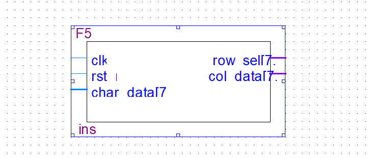


```verilog
module F5_2(
    input clk,
    input rst_n,
    input [7:0] char_data,
    output reg [7:0] row_sel,
    output reg [7:0] col_data
);
    

    
    reg [2:0] scan_counter;
    reg [4:0] div_cnt;  
    wire scan_pulse = (div_cnt == 5'd19);
    
    always @(posedge clk or negedge rst_n) begin
        if (!rst_n) begin
            div_cnt <= 5'b0;
            scan_counter <= 3'b0;
        end else begin
            div_cnt <= div_cnt + 1'b1;
            if (scan_pulse)
                scan_counter <= scan_counter + 1'b1;
        end
    end
    
   
    
    always @(*) begin
        row_sel = 8'b00000000;
        row_sel[scan_counter] = 1'b1;
    end
    
   
    reg [7:0] char_rom [0:7];
    
   
    always @(*) begin
        col_data = char_rom[scan_counter];
    end
    
    
    always @(*) begin
        case (char_data)
            
            8'h30: begin 
                char_rom[0] = 8'b00111100;
                char_rom[1] = 8'b01100110;
                char_rom[2] = 8'b01100110;
                char_rom[3] = 8'b01100110;
                char_rom[4] = 8'b01100110;
                char_rom[5] = 8'b01100110;
                char_rom[6] = 8'b01100110;
                char_rom[7] = 8'b00111100;
            end
            
            8'h31: begin 
                char_rom[0] = 8'b00011000;
                char_rom[1] = 8'b00111000;
                char_rom[2] = 8'b00011000;
                char_rom[3] = 8'b00011000;
                char_rom[4] = 8'b00011000;
                char_rom[5] = 8'b00011000;
                char_rom[6] = 8'b00011000;
                char_rom[7] = 8'b00111100;
            end
            
           
            8'h41: begin 
                char_rom[0] = 8'b00011000;
                char_rom[1] = 8'b00111100;
                char_rom[2] = 8'b01100110;
                char_rom[3] = 8'b01100110;
                char_rom[4] = 8'b01111110;
                char_rom[5] = 8'b01100110;
                char_rom[6] = 8'b01100110;
                char_rom[7] = 8'b01100110;
            end
            
            8'h42: begin // 'B'
                char_rom[0] = 8'b01111100;
                char_rom[1] = 8'b01100110;
                char_rom[2] = 8'b01100110;
                char_rom[3] = 8'b01111100;
                char_rom[4] = 8'b01100110;
                char_rom[5] = 8'b01100110;
                char_rom[6] = 8'b01100110;
                char_rom[7] = 8'b01111100;
            end
            
            
            
            default: begin 
                char_rom[0] = 8'b00000000;
                char_rom[1] = 8'b00000000;
                char_rom[2] = 8'b00000000;
                char_rom[3] = 8'b00000000;
                char_rom[4] = 8'b00000000;
                char_rom[5] = 8'b00000000;
                char_rom[6] = 8'b00000000;
                char_rom[7] = 8'b00000000;
            end
        endcase
    end
    endmodule


```


### 仿真

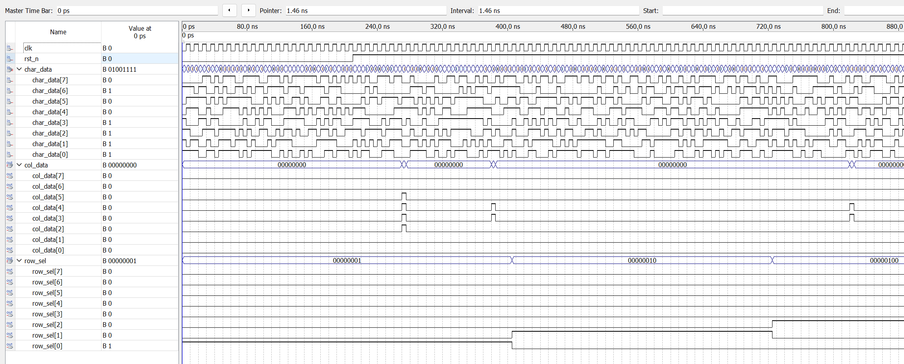


## 任务二

```verilog
module F5_2(
    input clk,
    input rst_n,
    input [7:0] char_data,
    output reg [7:0] row_sel,
    output reg [7:0] col_data
);

    // ===============================
    // 仿真模式选择
    // ===============================
    parameter SIMULATION_MODE = 1;  // 1=仿真模式，0=实际硬件模式
    
    // 根据模式选择参数 - 使用条件运算符
    localparam DIVIDER = (SIMULATION_MODE == 1) ? 24 : (50_000_000 / (2500 * 8) - 1);
    
    // 扫描脉冲生成
    wire scan_pulse = (div_cnt == DIVIDER);
    
    // 扫描计数器
    reg [15:0] div_cnt;
    reg [2:0] scan_counter;
    
    // 分频计数器
    always @(posedge clk or negedge rst_n) begin
        if (!rst_n) begin
            div_cnt <= 16'b0;
        end else begin
            if (div_cnt == DIVIDER)
                div_cnt <= 16'b0;
            else
                div_cnt <= div_cnt + 1'b1;
        end
    end
    
    // 扫描计数器 (0-7循环)
    always @(posedge clk or negedge rst_n) begin
        if (!rst_n) begin
            scan_counter <= 3'b0;
        end else begin
            if (scan_pulse) begin
                if (scan_counter == 3'd7)
                    scan_counter <= 3'b0;
                else
                    scan_counter <= scan_counter + 1'b1;
            end
        end
    end
    
   
    always @(*) begin
        row_sel = 8'b00000000;
        case (scan_counter)
            3'd0: row_sel = 8'b00000001;
            3'd1: row_sel = 8'b00000010;
            3'd2: row_sel = 8'b00000100;
            3'd3: row_sel = 8'b00001000;
            3'd4: row_sel = 8'b00010000;
            3'd5: row_sel = 8'b00100000;
            3'd6: row_sel = 8'b01000000;
            3'd7: row_sel = 8'b10000000;
            default: row_sel = 8'b00000000;
        endcase
    end
    
    
    reg [7:0] char_rom [0:7]; 
    always @(*) begin
        col_data = char_rom[scan_counter];
    end
    
    always @(*) begin
        case (char_data)
           
            8'h30: begin // '0'
                char_rom[0] = 8'b00111100; // 行0
                char_rom[1] = 8'b01100110; // 行1
                char_rom[2] = 8'b01100110; // 行2
                char_rom[3] = 8'b01100110; // 行3
                char_rom[4] = 8'b01100110; // 行4
                char_rom[5] = 8'b01100110; // 行5
                char_rom[6] = 8'b01100110; // 行6
                char_rom[7] = 8'b00111100; // 行7
            end
            
            8'h31: begin // '1'
                char_rom[0] = 8'b00011000;
                char_rom[1] = 8'b00111000;
                char_rom[2] = 8'b00011000;
                char_rom[3] = 8'b00011000;
                char_rom[4] = 8'b00011000;
                char_rom[5] = 8'b00011000;
                char_rom[6] = 8'b00011000;
                char_rom[7] = 8'b00111100;
            end
            
            // ... 其他字符定义保持不变
            8'h32: begin // '2'
                char_rom[0] = 8'b00111100;
                char_rom[1] = 8'b01100110;
                char_rom[2] = 8'b00000110;
                char_rom[3] = 8'b00011100;
                char_rom[4] = 8'b00110000;
                char_rom[5] = 8'b01100000;
                char_rom[6] = 8'b01100000;
                char_rom[7] = 8'b01111110;
            end
            8'h33: begin // '3'
                char_rom[0] = 8'b00111100;
                char_rom[1] = 8'b01100110;
                char_rom[2] = 8'b00000110;
                char_rom[3] = 8'b00011100;
                char_rom[4] = 8'b00000110;
                char_rom[5] = 8'b00000110;
                char_rom[6] = 8'b01100110;
                char_rom[7] = 8'b00111100;
            end
            
            8'h34: begin // '4'
                char_rom[0] = 8'b00001100;
                char_rom[1] = 8'b00011100;
                char_rom[2] = 8'b00111100;
                char_rom[3] = 8'b01101100;
                char_rom[4] = 8'b11001100;
                char_rom[5] = 8'b11111110;
                char_rom[6] = 8'b00001100;
                char_rom[7] = 8'b00001100;
            end
            
            8'h35: begin // '5'
                char_rom[0] = 8'b01111110;
                char_rom[1] = 8'b01100000;
                char_rom[2] = 8'b01100000;
                char_rom[3] = 8'b01111100;
                char_rom[4] = 8'b00000110;
                char_rom[5] = 8'b00000110;
                char_rom[6] = 8'b01100110;
                char_rom[7] = 8'b00111100;
            end
            
            8'h36: begin // '6'
                char_rom[0] = 8'b00011100;
                char_rom[1] = 8'b00110000;
                char_rom[2] = 8'b01100000;
                char_rom[3] = 8'b01111100;
                char_rom[4] = 8'b01100110;
                char_rom[5] = 8'b01100110;
                char_rom[6] = 8'b01100110;
                char_rom[7] = 8'b00111100;
            end
            
            8'h37: begin // '7'
                char_rom[0] = 8'b01111110;
                char_rom[1] = 8'b00000110;
                char_rom[2] = 8'b00001100;
                char_rom[3] = 8'b00011000;
                char_rom[4] = 8'b00011000;
                char_rom[5] = 8'b00110000;
                char_rom[6] = 8'b00110000;
                char_rom[7] = 8'b00110000;
            end
            
            8'h38: begin // '8'
                char_rom[0] = 8'b00111100;
                char_rom[1] = 8'b01100110;
                char_rom[2] = 8'b01100110;
                char_rom[3] = 8'b00111100;
                char_rom[4] = 8'b01100110;
                char_rom[5] = 8'b01100110;
                char_rom[6] = 8'b01100110;
                char_rom[7] = 8'b00111100;
            end
            
            8'h39: begin // '9'
                char_rom[0] = 8'b00111100;
                char_rom[1] = 8'b01100110;
                char_rom[2] = 8'b01100110;
                char_rom[3] = 8'b01100110;
                char_rom[4] = 8'b00111110;
                char_rom[5] = 8'b00000110;
                char_rom[6] = 8'b00001100;
                char_rom[7] = 8'b00111000;
            end
            
            // 字母 A-Z
            8'h41: begin // 'A'
                char_rom[0] = 8'b00011000;
                char_rom[1] = 8'b00111100;
                char_rom[2] = 8'b01100110;
                char_rom[3] = 8'b01100110;
                char_rom[4] = 8'b01111110;
                char_rom[5] = 8'b01100110;
                char_rom[6] = 8'b01100110;
                char_rom[7] = 8'b01100110;
            end
            
            8'h42: begin // 'B'
                char_rom[0] = 8'b01111100;
                char_rom[1] = 8'b01100110;
                char_rom[2] = 8'b01100110;
                char_rom[3] = 8'b01111100;
                char_rom[4] = 8'b01100110;
                char_rom[5] = 8'b01100110;
                char_rom[6] = 8'b01100110;
                char_rom[7] = 8'b01111100;
            end
            
            8'h43: begin // 'C'
                char_rom[0] = 8'b00111100;
                char_rom[1] = 8'b01100110;
                char_rom[2] = 8'b01100000;
                char_rom[3] = 8'b01100000;
                char_rom[4] = 8'b01100000;
                char_rom[5] = 8'b01100000;
                char_rom[6] = 8'b01100110;
                char_rom[7] = 8'b00111100;
            end
            
            8'h44: begin // 'D'
                char_rom[0] = 8'b01111000;
                char_rom[1] = 8'b01101100;
                char_rom[2] = 8'b01100110;
                char_rom[3] = 8'b01100110;
                char_rom[4] = 8'b01100110;
                char_rom[5] = 8'b01100110;
                char_rom[6] = 8'b01101100;
                char_rom[7] = 8'b01111000;
            end
            
            8'h45: begin // 'E'
                char_rom[0] = 8'b01111110;
                char_rom[1] = 8'b01100000;
                char_rom[2] = 8'b01100000;
                char_rom[3] = 8'b01111100;
                char_rom[4] = 8'b01100000;
                char_rom[5] = 8'b01100000;
                char_rom[6] = 8'b01100000;
                char_rom[7] = 8'b01111110;
            end
            
            8'h46: begin // 'F'
                char_rom[0] = 8'b01111110;
                char_rom[1] = 8'b01100000;
                char_rom[2] = 8'b01100000;
                char_rom[3] = 8'b01111100;
                char_rom[4] = 8'b01100000;
                char_rom[5] = 8'b01100000;
                char_rom[6] = 8'b01100000;
                char_rom[7] = 8'b01100000;
            end
            
            // 特殊字符
            8'h20: begin // 空格
                char_rom[0] = 8'b00000000;
                char_rom[1] = 8'b00000000;
                char_rom[2] = 8'b00000000;
                char_rom[3] = 8'b00000000;
                char_rom[4] = 8'b00000000;
                char_rom[5] = 8'b00000000;
                char_rom[6] = 8'b00000000;
                char_rom[7] = 8'b00000000;
            end
            
            8'h2D: begin // 减号 '-'
                char_rom[0] = 8'b00000000;
                char_rom[1] = 8'b00000000;
                char_rom[2] = 8'b00000000;
                char_rom[3] = 8'b01111110;
                char_rom[4] = 8'b01111110;
                char_rom[5] = 8'b00000000;
                char_rom[6] = 8'b00000000;
                char_rom[7] = 8'b00000000;
            end
            
            default: begin // 默认显示全黑
                char_rom[0] = 8'b00000000;
                char_rom[1] = 8'b00000000;
                char_rom[2] = 8'b00000000;
                char_rom[3] = 8'b00000000;
                char_rom[4] = 8'b00000000;
                char_rom[5] = 8'b00000000;
                char_rom[6] = 8'b00000000;
                char_rom[7] = 8'b00000000;
            end
        endcase
    end

endmodule
```

### 仿真

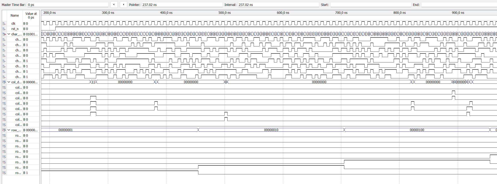

# 不同类型的移位寄存器设计

## 任务一

### 含同步预置功能的移位寄存器设计

```verilog
module F5_4(
    input CLK,
    input LOAD, 
    input [7:0] DIN,
    output QB,
    output [7:0] DEBUG_REG  // 调试输出
);

    (* keep *) reg [7:0] REG8;
    
    always @(posedge CLK) begin
        if (LOAD) 
            REG8 <= DIN;
        else 
            REG8[6:0] <= REG8[7:1];
    end
    
    assign QB = REG8[0];
    assign DEBUG_REG = REG8;  // 调试输出

endmodule
```


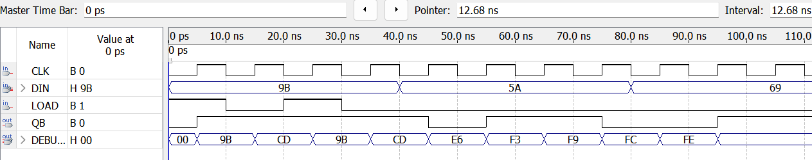


### 使用移位操作符设计移位寄存器


```verilog
module F5_4(DIN, CLK, RST, DOUT);
    input CLK, DIN, RST;
    output DOUT;
    
    reg [3:0] SHFT;
    
    always @(posedge CLK or posedge RST) begin
        if (RST) 
            SHFT <= 4'b0;
        else 
            SHFT <= {DIN, SHFT[3:1]};  // 正确：DIN作为最高位，其余右移
    end
    
    assign DOUT = SHFT[0];
endmodule
```


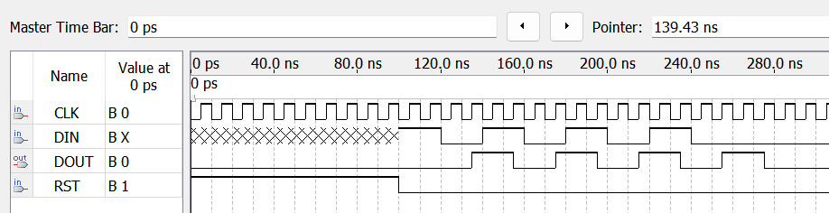


## 任务二

### 串入并出

```verilog
module F5_4(
    input clk,             
    input rst_n,            
    input load,             
    input [7:0] data_in,    
    input serial_in,        
    output serial_out,     
    output [7:0] data_out   
);

    reg [7:0] shift_reg;
    
    always @(posedge clk or negedge rst_n) begin
        if (!rst_n) begin
            shift_reg <= 8'b0;  // 复位时清零
        end else if (load) begin
            shift_reg <= data_in;  // 并行加载
        end else begin
            
            shift_reg <= {serial_in, shift_reg[7:1]};
        end
    end
    
    assign serial_out = shift_reg[0]; 
    assign data_out = shift_reg;       

endmodule
```

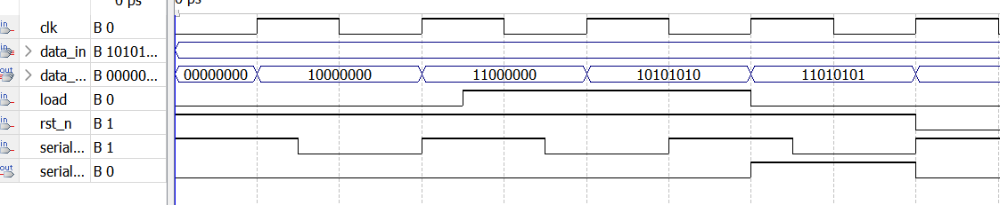


### 串进串出

```verilog
module serial_serial_shift_register(
    input clk,              
    input rst_n,            
    input serial_in,        
    output serial_out,      
    output [7:0] data_out  
);

    reg [7:0] shift_reg;
    
    always @(posedge clk or negedge rst_n) begin
        if (!rst_n) begin
            shift_reg <= 8'b0;  
        end else begin
        
            shift_reg <= {serial_in, shift_reg[7:1]};
        end
    end
    
    assign serial_out = shift_reg[0];  
    assign data_out = shift_reg;       // 并行输出

endmodule
```


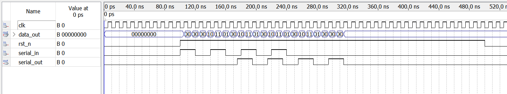


## 任务三

### 代码

```verilog
module F5_4(
    input [7:0] data_in,        
    input direction,            
    input [2:0] shift_amount,  
    input [1:0] fill_mode,    
    output reg [7:0] data_out   
);


wire [2:0] actual_shift = 8 - shift_amount;

always @(*) begin
    case (fill_mode)
       
        2'b00: begin
            if (direction == 1'b1)  
                data_out = data_in >> actual_shift;
            else                    
                data_out = data_in << actual_shift;
        end
        
       
        2'b01: begin
            if (direction == 1'b1) begin
                
                data_out = (data_in >> actual_shift) | (data_in << shift_amount);
            end else begin
               
                data_out = (data_in << actual_shift) | (data_in >> shift_amount);
            end
        end
        
       
        2'b10: begin
            if (direction == 1'b1) begin
               
                data_out = $signed(data_in) >>> actual_shift;
            end else begin
               
                data_out = data_in << actual_shift;
            end
        end
        
       
        2'b11: begin
            if (direction == 1'b1) begin
                
                data_out = (data_in >> actual_shift) | ({8{1'b1}} << shift_amount);
            end else begin
                ）
                data_out = (data_in << actual_shift) | ({8{1'b1}} >> actual_shift);
            end
        end
        
        default: data_out = data_in; 
    endcase
end

endmodule
```


### 仿真结果

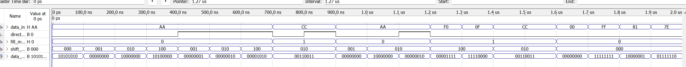


AT+CMD?

busy p...
+CMD:0,"AT",0,0,0,1
+CMD:1,"ATE0",0,0,0,1
+CMD:2,"ATE1",0,0,0,1
+CMD:3,"AT+RST",0,0,0,1
+CMD:4,"AT+GMR",0,0,0,1
+CMD:5,"AT+CMD",0,1,0,0
+CMD:6,"AT+GSLP",0,0,1,0
+CMD:7,"AT+SYSTIMESTAMP",0,1,1,0
+CMD:8,"AT+SLEEP",0,1,1,0
+CMD:9,"AT+RESTORE",0,0,0,1
+CMD:10,"AT+SYSRAM",0,1,0,0
+CMD:11,"AT+SYSFLASH",0,1,1,0
+CMD:12,"AT+RFPOWER",0,1,1,0
+CMD:13,"AT+SYSMSG",0,1,1,0
+CMD:14,"AT+SYSROLLBACK",0,0,0,1
+CMD:15,"AT+SYSLOG",0,1,1,0
+CMD:16,"AT+SYSSTORE",0,1,1,0
+CMD:17,"AT+SLEEPWKCFG",0,0,1,0
+CMD:18,"AT+SYSREG",0,0,1,0
+CMD:19,"AT+USERRAM",0,1,1,0
+CMD:20,"AT+USEROTA",0,0,1,0
+CMD:21,"AT+USERWKMCUCFG",0,0,1,0
+CMD:22,"AT+USERMCUSLEEP",0,0,1,0
+CMD:23,"AT+CWMODE",0,1,1,0
+CMD:24,"AT+CWSTATE",0,1,0,0
+CMD:25,"AT+CWJAP",0,1,1,1
+CMD:26,"AT+CWRECONNCFG",0,1,1,0
+CMD:27,"AT+CWLAP",0,0,1,1
+CMD:28,"AT+CWLAPOPT",0,0,1,0
+CMD:29,"AT+CWQAP",0,0,0,1
+CMD:30,"AT+CWSAP",0,1,1,0
+CMD:31,"AT+CWLIF",0,0,0,1
+CMD:32,"AT+CWQIF",0,0,1,1
+CMD:33,"AT+CWDHCP",0,1,1,0
+CMD:34,"AT+CWDHCPS",0,1,1,0
+CMD:35,"AT+CWSTAPROTO",0,1,1,0
+CMD:36,"AT+CWAPPROTO",0,1,1,0
+CMD:37,"AT+CWAUTOCONN",0,1,1,0
+CMD:38,"AT+CWHOSTNAME",0,1,1,0
+CMD:39,"AT+CWCOUNTRY",0,1,1,0
+CMD:40,"AT+CIFSR",0,0,0,1
+CMD:41,"AT+CIPSTAMAC",0,1,1,0
+CMD:42,"AT+CIPAPMAC",0,1,1,0
+CMD:43,"AT+CIPSTA",0,1,1,0
+CMD:44,"AT+CIPAP",0,1,1,0
+CMD:45,"AT+CIPV6",0,1,1,0
+CMD:46,"AT+CIPDNS",0,1,1,0
+CMD:47,"AT+CIPDOMAIN",0,0,1,0
+CMD:48,"AT+CIPSTATUS",0,0,0,1
+CMD:49,"AT+CIPSTART",0,0,1,0
+CMD:50,"AT+CIPSTARTEX",0,0,1,0
+CMD:51,"AT+CIPTCPOPT",0,1,1,0
+CMD:52,"AT+CIPCLOSE",0,0,1,1
+CMD:53,"AT+CIPSEND",0,0,1,1
+CMD:54,"AT+CIPSENDEX",0,0,1,0
+CMD:55,"AT+CIPDINFO",0,1,1,0
+CMD:56,"AT+CIPMUX",0,1,1,0
+CMD:57,"AT+CIPRECVMODE",0,1,1,0
+CMD:58,"AT+CIPRECVDATA",0,0,1,0
+CMD:59,"AT+CIPRECVLEN",0,1,0,0
+CMD:60,"AT+CIPSERVER",0,1,1,0
+CMD:61,"AT+CIPSERVERMAXCONN",0,1,1,0
+CMD:62,"AT+CIPSSLCCONF",0,1,1,0
+CMD:63,"AT+CIPSSLCCN",0,1,1,0
+CMD:64,"AT+CIPSSLCSNI",0,1,1,0
+CMD:65,"AT+CIPSSLCALPN",0,1,1,0
+CMD:66,"AT+CIPSSLCPSK",0,1,1,0
+CMD:67,"AT+CIPMODE",0,1,1,0
+CMD:68,"AT+CIPSTO",0,1,1,0
+CMD:69,"AT+SAVETRANSLINK",0,0,1,0
+CMD:70,"AT+CIPSNTPCFG",0,1,1,0
+CMD:71,"AT+CIPSNTPTIME",0,1,0,0
+CMD:72,"AT+CIPRECONNINTV",0,1,1,0
+CMD:73,"AT+MQTTUSERCFG",0,0,1,0
+CMD:74,"AT+MQTTCLIENTID",0,0,1,0
+CMD:75,"AT+MQTTUSERNAME",0,0,1,0
+CMD:76,"AT+MQTTPASSWORD",0,0,1,0
+CMD:77,"AT+MQTTLONGCLIENTID",0,0,1,0
+CMD:78,"AT+MQTTLONGUSERNAME",0,0,1,0
+CMD:79,"AT+MQTTLONGPASSWORD",0,0,1,0
+CMD:80,"AT+MQTTCONNCFG",0,0,1,0
+CMD:81,"AT+MQTTCONN",0,1,1,0
+CMD:82,"AT+MQTTPUB",0,0,1,0
+CMD:83,"AT+MQTTPUBRAW",0,0,1,0
+CMD:84,"AT+MQTTSUB",0,1,1,0
+CMD:85,"AT+MQTTUNSUB",0,0,1,0
+CMD:86,"AT+MQTTCLEAN",0,0,1,0
+CMD:87,"AT+MDNS",0,0,1,0
+CMD:88,"AT+WPS",0,0,1,0
+CMD:89,"AT+CWSTARTSMART",0,0,1,1
+CMD:90,"AT+CWSTOPSMART",0,0,0,1
+CMD:91,"AT+PING",0,0,1,0
+CMD:92,"AT+CIUPDATE",0,1,1,1
+CMD:93,"AT+FACTPLCP",0,0,1,0
+CMD:94,"AT+ATKCLDSTA",0,0,1,0
+CMD:95,"AT+UART",0,1,1,0
+CMD:96,"AT+UART_CUR",0,1,1,0
+CMD:97,"AT+UART_DEF",0,1,1,0


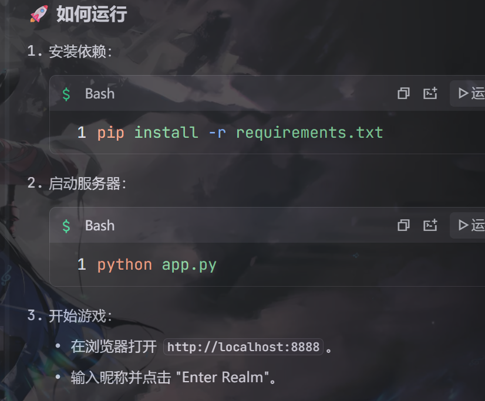
