# 通信原理

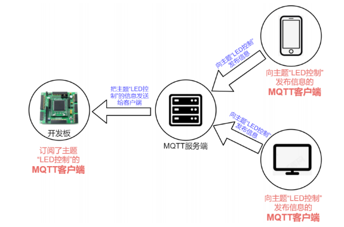

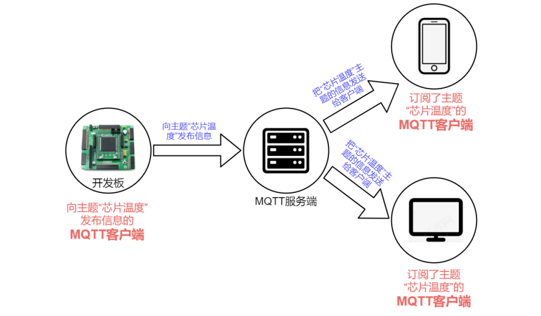

MQTT 是一种基于**客户端****-****服务端**架构的消息传输协议，所以在 MQTT 协议通信中，有两个最为重要的

角色，它们便是**服务端**和**客户端**。

服务端是一台服务器（broker），负责转发客户端的消息

客户端之间通信要经过服务端，客户端发送信息叫做发布消息，客户端接收信息，要先订阅信息，从而引出主题

## 主题

客户端发送消息的时候要指定一个主题，将消息发送到该主题。接受消息的时候一样需要一个主题，表示从这个主题接收消息。

当有客户端向这个主题发布消息的时候，服务端就会把这个主题的信息发送给订阅了这个主题的客户端

一个客户端可以同时接收某个主题的消息和向某个主题发送

# **连接** **MQTT** 服务端

首先客户端需要向服务端发送连接请求，这个连接请求实际上就是向服务端发送一个 CONNECT报文，也就是发送了一个 CONNECT 数据包

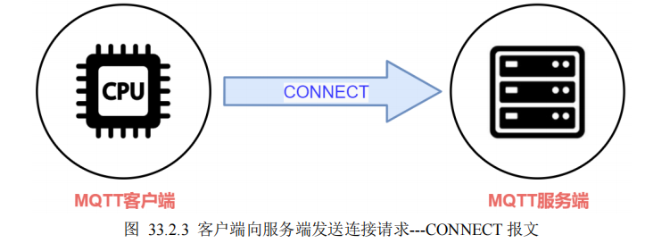

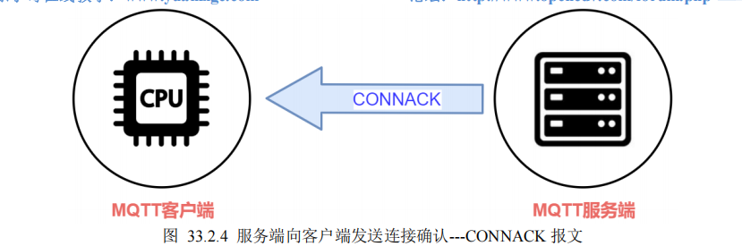

MQTT 服务端收到连接请求后，会向客户端发送连接确认。连接确认实际上是向客户端发送一个CONNACK 报文，也就是 CONNACK 数据包


## MQTT报文结构

### 1. 固定头（Fixed Header）

每个MQTT报文都包含一个固定头，其结构如下：

| 比特     | 7-4      | 3-0    |
| :------- | :------- | :----- |
| 字节1    | 报文类型 | 标志位 |
| 字节2... | 剩余长度 |        |

- **报文类型**：CONNECT报文的类型值为1，所以字节1的高4位为0x1。
- **标志位**：对于CONNECT报文，固定头的低4位是保留的，必须设置为0。所以整个固定头的第一个字节是0x10。
- **剩余长度**：表示可变头和有效载荷的总长度。这个字段使用变长编码，最多4个字节。

### 2. 可变头（Variable Header）

CONNECT报文的可变头按顺序包含以下内容：

- **协议名**（Protocol Name）：是一个UTF-8编码的字符串。对于MQTT 3.1.1，协议名为"MQTT"，长度为4，所以先写两字节的长度0x00,0x04，然后写'M','Q','T','T'。
- **协议级别**（Protocol Level）：对于MQTT 3.1.1，这个值为4，即0x04。
- **连接标志**（Connect Flags）：一个字节，包含多个标志，如下：

| 比特 | 标志          | 描述                        |
| :--- | :------------ | :-------------------------- |
| 7    | User Name     | 为1表示有效载荷中包含用户名 |
| 6    | Password      | 为1表示有效载荷中包含密码   |
| 5    | Will Retain   | 遗嘱保留标志                |
| 4-3  | Will QoS      | 遗嘱QoS等级                 |
| 2    | Will Flag     | 为1表示有效载荷中包含遗嘱   |
| 1    | Clean Session | 清理会话标志                |
| 0    | 保留          | 必须为0                     |

- **保持连接**（Keep Alive）：两个字节，表示客户端传输控制报文的最大时间间隔（秒）。图中为60，即0x00,0x3C。

### 3. 有效载荷（Payload）

CONNECT报文的有效载荷包含一个或多个以UTF-8编码的字符串，具体包括：

- **客户端标识符**（Client ID）：必须存在，除非客户端标识符长度为0且清理会话为0（不允许），但通常都会有。
- **遗嘱主题**（Will Topic）：如果遗嘱标志为1，则存在。
- **遗嘱消息**（Will Message）：如果遗嘱标志为1，则存在。
- **用户名**（User Name）：如果用户名标志为1，则存在。
- **密码**（Password）：如果密码标志为1，则存在。

每个字符串的前面是两个字节的长度（MSB, LSB），然后是对应长度的UTF-8字符串。

## CONNECT报文

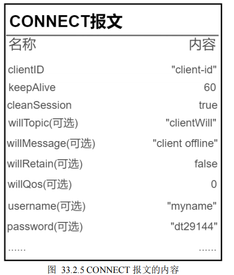

如果不符合MQTT规范，服务器会拒绝连接

固定头：不包括表格中列出的任何字段，固定头是固定的格式，用于标识报文类型和剩余长度。

可变头：包括keepAlive、cleanSession（以及willRetain、willQos，这些是连接标志的一部分）等字段。

有效载荷：包括clientID、willTopic、willMessage、username、password等字段。

## clientID-**客户端** **id**

clientId 是 MQTT 客户端的标识，也就是 MQTT 客户端的名字，MQTT 服务端可通过 clientId 来区分不

同的客户端，MQTT 服务端用该标识来识别客户端。

如果两个 MQTT 客户端使用相同 clientId 标识，服务端会把它们当成同一个客户端来处理。

## **keepAlive--**心跳时间间隔

客户端在没有向服务端发送信息时（空闲时），可以定时向服务端发送一个心跳数据包，这个心跳包也被称作心跳

请求，心跳请求的作用正是用于告知服务端，当前客户端依然在线，服务端在收到客户端的心跳请求后，会回复一条消息，这条回复消息被称作心跳响应。

譬如 keepAlive=60，表示告诉

服务端，客户端将会每隔 60 秒左右向服务端发送心跳包。

## **cleanSession--**清除会话

它是一个布尔值，如果连接服务端时 cleanSession=0，当 MQTT 客户端由离线（与服务端断开连接）再次上线时，离线期间发给客户端的所有 QoS>0 的消息仍然可以接收到；

如果连接服务端时 cleanSession=1，当 MQTT 客户端由离线（与服务端断开连接）再次上线时，离线期间发给客户端的所有消息一律接收不到。

假设当前你的 QQ 账号没有登录或者说当前处于离线状态，与服务器断开了连接；而在离线期间，你的 QQ 好友给你发了几条信息；由于当前你的 QQ 处于离线状态，自然是接收不到好友发送过来的信息，但是，当你的 QQ 恢复连接状态时，立马会接收到好友在离线期间所发给你的信息。

总的来说：cleanSession 设置为 1，表示此次连接将创建一个新的临时会话，在客户端断开后，这个会话会自动销毁。而 cleanSession 设置为 0，表示创建一个持久性会话，在客户端断开连接时，会话仍然保持并保存离线消息，直到会话超时注销。

## CONNACK报文

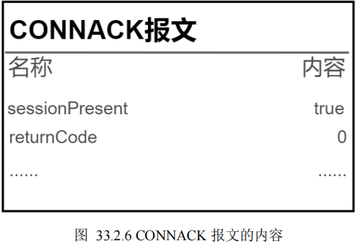

## **returnCode--**连接返回码

当服务端收到了客户端（esp8266）的连接请求后，会向客户端发送 returnCode(连接返回码)，用来说明连接情况。

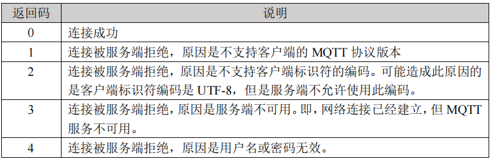

## sessionPresent

在 cleanSession=0 的情况下，当客户端连接到服务器之后，可通过 CONNACK 报文中返回的

sessionPresent 来查询服务端是否为客户端保存了会话状态（客户端上一次连接时的会话状态信息），如果

服务端已为客户端保存了上一次连接时的会话状态，则 sessionPresent=1，如果没有保存会话状态，则

sessionPresent=0。

如果 cleanSession=1，在这种情况下，客户端是不需要服务端保存会话状态的，那么服务端发送的确认

连接 CONNACK 报文中，sessionPresent 肯定是 false（sessionPresent=0），也就是说，服务端没有保存客户端的会话状态信息。

简言之，CONNACK 报文的 sessionPresent 与 CONNECT 报文的 cleanSession 相互配合。

# 断开连接

向服务器发送DISCONNECT报文

# 发布消息

## PUBLISH报文

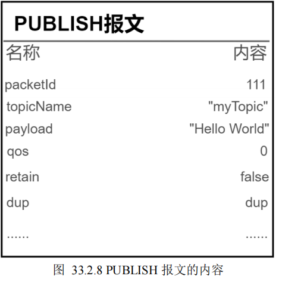

当客户端连接到服务端之后，就可以向服务端发布消息了，每条发布的消息必须指定一个“主题”，表示向某主题发布消息；MQTT 服务端可以通过主题来确定将消息转发给哪些客户端（订阅了该主题的客户端）。

MQTT 客户端向服务端发布消息其实就是向服务端发送一个 PUBLISH 报文，服务端收到客户端发送过来的 PUBLISH 报文之后，会向发送发回复一个报文。根据 QoS 的不同，回复的报文类型也是不同的，并且整个发布消息的过程也将会有所区别；譬如对于 QoS=1 时，客户端向服务端发送 PUBLISH 报文，服务端收到 PUBLISH 报文之后会向发送方回复 PUBACK 报文

## **packetId--**报文标识符

报文标识符可用于对 MQTT 报文进行标识（识别不同的报文）。不同的 MQTT 报文所拥有的标识符不同。

报文标识符的内容与 QoS 级别有密不可分的关系。只有 QoS 级别大于 0 时，报文标识符才是非零数值。如果 QoS 等于 0，报文标识符为 0

## **topicName--**主题名字

这个就是发布消息时对应的主题的名字，这是一个字符串，譬如上图中 topicName=“myTopic”，表示会将消息发布到“myTopic”这个主题。

## **payload--**有效载荷

有效载荷是我们希望通过 MQTT 所发送的实际内容。我们可以使用 MQTT 协议发送字符串文本，图像等格式的内容。这些内容都是通过有效载荷所发送的。

## **qos--**服务质量等级

QoS（Quality of Service）表示 MQTT 消息的服务质量等级。QoS 有三个级别：0、1 和 2，QoS 决定MQTT 通信有什么样的服务保证。

## **retain--**保留标志

客户端订阅了一条主题后，马上接收一条来自该主题的消息，而不管这时有没有其他该主题的客户端发送信息

## **dup--**重发标志

dup 标志指示此消息是否重复。

当 MQTT 报文的接收方没有及时向报文发送发0回复**确认收到报文**时，发送方会以为对方没有收到信息，

会再次重复发送 MQTT 报文（譬如客户端向服务端发送 PUBLISH 报文，服务端收到 PUBLISH 报文之后需要向客户端回复一个 PUBACK 报文，如果客户端没收到 PUBACK 报文，则会认为服务端可能没接收到自己发送的报文，将会再次发送 PUBLISH 报文）

会将这个标志置为ture

# 订阅主题

## **SUBSCRIBE--**订阅主题

<font color='red'>SUBACK 报文包含有“订阅返回码”和“报文标识符”这两个信息。</font>


作为接收时就要订阅。客户端可订阅多个主题，实现接收多个消息

客户端是通过向服务端发送 SUBSCRIBE 报文来实现这一请求的。该报文包含有一系列“订阅主题名”。请留意，一个 SUBSCRIBE 报文可以包含有单个或者多个订阅主题名。也就是说，一个 SUBSCRIBE 报文可以用于订阅一个或者多个主题。

## **returnCode--**订阅返回码

客户端向服务端发送订阅请求后，服务端会给客户端返回一个订阅返回码。

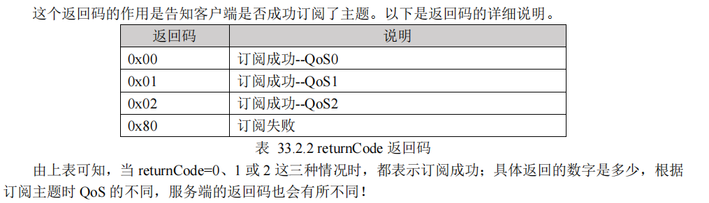

# 取消订阅

订阅的主题可以随时取消订阅

客户端通过向服务端发送一个 UNSUBSCRIBE 报文来取消订阅主题，当服务端接收到 UNSUBSCRIBE报文后，会向发送发回复一个 UNSUBACK 报文（取消订阅确认报文）

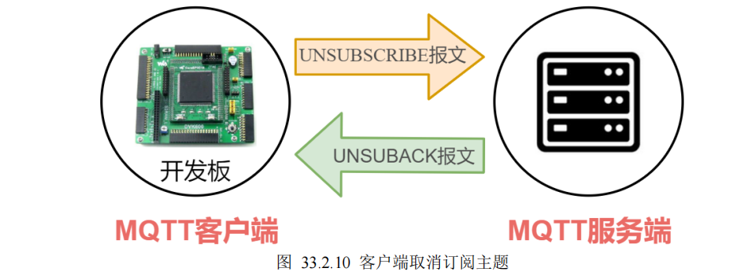

# 主题

## 基本形式

**主题是区分大小写的。**所以"LEDControl"和"ledControl"是两个不同的主题。

**主题可以使用空格。**譬如"LED Control"，虽然主题允许使用空格，但是笔者建议大家尽量不要使用空格。

**不要使用中文主题。**虽然有些 MQTT 服务器支持中文主题，但是绝大部分 MQTT 服务器是不支持中文主题的，所以大家不要使用中文主题，而是使用 ASCII 字符来作为 MQTT 主题。

## 主题分级

home/sensor/led/brightness"

在以上示例中一共有四级主题，分别是第 1 级 home、第 2 级 sensor、第三级 led、第 4 级 brightness。

主题的每一级至少需要一个字符；而只有一个简单字符串的主题，譬如"myTopic"、"currentTemp"、"LEDControl"，这些都是单一级别的主题。

可以向文件路径那样命名

"home/sensor/kitchen/temperature"

"home/sensor/kitchen/brightness"

"home/sensor/bedroom/temperature"

"home/sensor/bedroom/brightness"

需要注意的是，主题名称不要使用" / "开头，譬如：

"/home/sensor/led/brightness"

## 主题通配符

当客户端订阅主题时，可以使用通配符同时订阅多个主题。通配符只能在订阅主题时使用，下面我们将

介绍两种通配符：单级通配符和多级通配符。

## **单级通配符：**+

单级通配符可以匹配任意一个主题级别，注意是一个主题级别，譬如示例如下：

"home/sensor/+/status"

当客户端订阅了上述主题之后，将会收到以下主题的信息内容：

"home/sensor/led/status"

"home/sensor/key/status"

"home/sensor/beeper/status"

......

相反，而以下这些主题的信息是无法接收到的：

"**dt**/sensor/led/status"

"home/**kash**/key/status"

"home/sensor/led/**brightness**"

......

以上这些注意将无法接收到，原因在于这些主题无法与"home/sensor/+/status"相匹配。


## **多级通配符：**#

"**home/sensor/#**"

当客户端订阅了上面这个主题之后，便可以收到如下注意的信息：

"home/sensor/led"

"home/sensor/key"

"home/sensor/beeper"

"home/sensor/led/status"

"home/sensor/led/brightness"

"home/sensor/key/status"

"home/sensor/beeper/status"

......

相反，如下主题的信息是无法接收到的：

"home/**kash**/led"

"**dt**/sensor/led"

"**dt**/**kash**/led"

......

这就是多级通配符的概念。

## **以**$**开头的主题**

以$号开头的主题是 MQTT 服务端系统保留的特殊主题，客户端不可随意订阅或向其发布信息

"$SYS/monitor/Clients"

"$SYS/monitor/+"

"$SYS/#"

## 注意

**不要使用“/”作为主题开头**

前面就给大家提到过了，我们尽量不要使用“/”作为主题的开头，这样做没有什么意义，而且额外产生一个没有用处的主题级别。

**主题中不要使用空格**

虽然，MQTT 支持在主题中使用空格，但是我们应该尽量避免使用空格。因为空格在编程当中是一个

比较特殊的字符，除了空格之外的其它特殊字符也应该不要使用。

**保持主题简洁明了**

MQTT 是一种轻量级的通讯协议，它常用于网络带宽受限的环境，因此我们应尽量让主题简洁明了，

从而让设备间交互的内容更加简洁，以更好的适应网络带宽受限的环境。

**主题中尽量使用** **ASCII** **字符**

虽然有些 MQTT 设备支持 UTF-8 字符作为 MQTT 主题，但是笔者建议您在主题中尽量使用 ASCII 字符

# **QoS**

MQTT 设计了一套保证消息稳定传输的机制，包括消息应答、存储和重传。在这套机制下，提供了三种

不同级别的 QoS（Quality of Service），也就是 MQTT 协议有三种服务质量等级：

**QoS = 0****：最多发一次；**

**QoS = 1****：最少发一次；**

**QoS = 2****：保证收一次。**

## QoS是0

服务质量是0的时候，MQTT服务器和客户端不会对消息的传输成功进行确认和检查。全看环境是否稳定。

发送一次之后就不管了，不管发送和失败   

## Qos是1

服务质量是1的时候，在消息发送完成之后，会检查接收端是否接收到了信息

<font color='red'>QoS是1的时候，在发送报文的时候，会收到一个回复报文，接收端会检测这个报文</font>，但不能保证接收端一次数据只接收一次，可能会出现多次接收


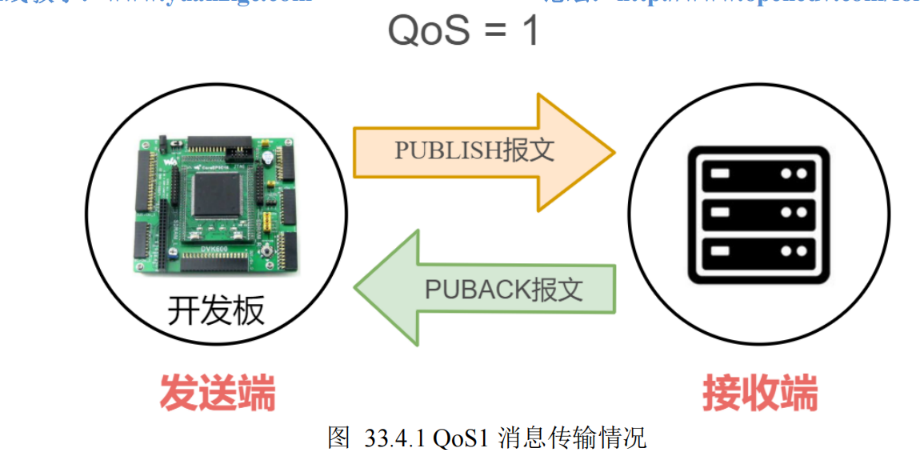


发送端向接收端发送 PUBLISH 报文，当接收端收到 PUBLISH 报文后会向发送端回复一个 PUBACK 报

文，如果发送端收到 PUBACK 报文，那么它就知道消息已经被接收端成功接收！

假如过了一段时间后，发送端没有收到 PUBACK 报文，那么发送端会再次发送消息（发送 PUBLISH报文），然后再次等待接收端的 PUBACK 确认报文，并且会将dup标志设置为true。因此，当 QoS=1 时，发送端在一定时间内没有收到接收端的 PUBACK 确认报文，会重复发送同一条消息。

注意：即使接收方真的接收到了，如果向发送方发送的反馈信号丢失，也会启动重新发送。这样的话就会出现接收端接收同一条消息多次


## Qos是2

<font color='red'>QoS=2 可以保证接收端只收一次消息。</font>

在种情况下，可以保证接收端只接受一次消息，不会出现QoS是1的那种情况。

为了确保接收端只接收到一次消息，PUBLISH 报文的收发过程相对更加复杂。发送端需要接收端进行两次消息确认，因此，2 级 MQTT 服务质量是最安全的服务级别，也是最慢的服务级别


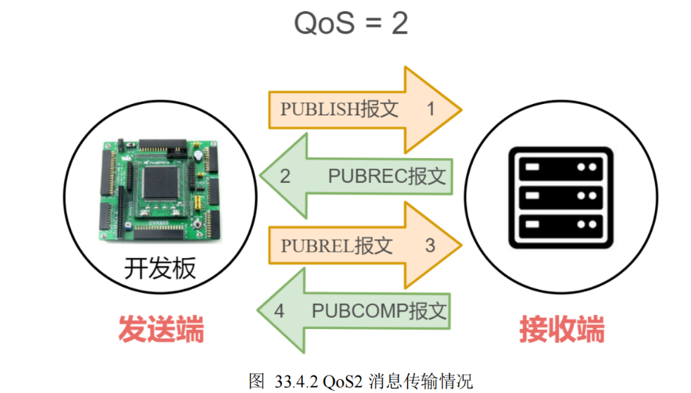


①、首先发送端向接收端发送 PUBLISH 报文；

②、接收端接收到 PUBLISH 报文后，向发送端回复一个 PUBREC 报文（官方称其为--发布收到）；

③、发送端接收到 PUBREC 报文后，会再次向接收端发送 PUBREL 报文（官方称其为--发布释放）；

④、接收端接收到 PUBREL 报文后，会再次向发送端回复一个 PUBCOMP 报文（官方称其为--发布完

成），如果发送端接收到 PUBCOMP 报文表示消息传输成功，它确认接收端已经成功接收到消息，整个过

程结束！


发送一次消息，本来双方都只需要一个操作箭头就行了

<font color='red'>在这种等级下，双方都需要2个操作箭头</font>


# 心跳机制

客户端空闲时向服务端发送心跳包判断服务器是否还在线，本质就是PINGREQ报文，收到后回复PINGRESP报文，叫做心跳响应

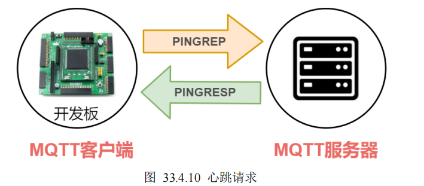

# 遗嘱机制

MQTT 协议中，死亡指的是“客户端掉线”、“与服务端断开了连接”这种意思。

掉线的两种方式：

客户端主动向服务端发送 DISCONNECT 报文，请求断开连接，自然服务端也就知道了客户端要离线了；

客户端**意外掉线**。被动与服务端断开了连接。

MQTT 从诞生之初就是专为低带宽、高延迟或不可靠网络等环境而设计的；所以针对这种意外掉线的情况，MQTT 协议使用了遗嘱机制来服务客户端、管理客户端。

MQTT 协议允许客户端在“活着”的时候就写好遗嘱，这样一旦客户端**意外断线**，服务端就可以将客户端的遗嘱公之于众。正常主动掉线的话就不会有这种情况

## 设置遗嘱


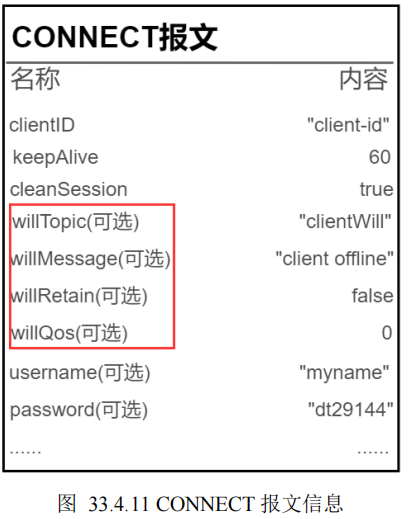

遗嘱消息和MQTT消息很相似，都有主题和正文内容

只有订阅了主题“clientWill”的客户端，才会收到这台客户端的遗嘱消息

遗嘱消息定义了遗嘱的内容。在本示例中，那些订阅了主题“clientWill”的客户端会在客户端意外断线时，收到服务端发布的“client offline”这样的信息。

**willRetain --** **遗嘱消息的保留标志**

遗嘱消息也可以设置为保留标志，用于告诉服务端是否需要对遗嘱消息进行保留处理。


/**
****************************************************************************************************
 * @file        demo.c
 * @author      正点原子团队(ALIENTEK)
 * @version     V1.0
 * @date        2022-06-21
 * @brief       ATK-MW8266D模块TCP透传实验
 * @license     Copyright (c) 2020-2032, 广州市星翼电子科技有限公司
****************************************************************************************************
 * @attention
 *
 * 实验平台:正点原子 阿波罗 F429开发板
 * 在线视频:www.yuanzige.com
 * 技术论坛:www.openedv.com
 * 公司网址:www.alientek.com
 * 购买地址:openedv.taobao.com
 *
****************************************************************************************************
 */

#include "demo.h"
#include "./BSP/ATK_MW8266D/atk_mw8266d.h"
#include "./SYSTEM/usart/usart.h"
#include "./SYSTEM/delay/delay.h"
#include "./BSP/LED/led.h"
#include "./BSP/KEY/key.h"
#include "./BSP/LCD/lcd.h"

#define DEMO_WIFI_SSID          "ari"
#define DEMO_WIFI_PWD           "zhanglanxiong"
#define DEMO_TCP_SERVER_IP      "192.168.48.133"
#define DEMO_TCP_SERVER_PORT    "1883"

/**
 * @brief       显示IP地址
 * @param       无
 * @retval      无
 */
    static void demo_show_ip(char *buf)
    {
    printf("IP: %s\r\n", buf);
    lcd_show_string(60, 151, 128, 16, 16, buf, BLUE);
    }

/**
 * @brief       按键0功能，功能测试
 * @param       is_unvarnished: 0，未进入透传
 *                              1，已进入透传
 * @retval      无
 */
    static void demo_key0_fun(uint8_t is_unvarnished)
    {
    uint8_t ret;
    
    if (is_unvarnished == 0)
    {
        /* 进行AT指令测试 */
            
        ret = atk_mw8266d_at_test();
        if (ret == 0)
        {
            printf("AT test success!\r\n");
        }
        else
        {
            printf("AT test failed!\r\n");
        }
    }
    else
    {
        /* 通过透传，发送信息至TCP Server */
        atk_mw8266d_uart_printf("This ATK-MW8266D TCP Connect Test.\r\n");
    }
    }

/**
 * @brief       按键1功能，切换透传模式
 * @param       is_unvarnished: 0，未进入透传
 *                              1，已进入透传
 * @retval      无
 */
    static void demo_key1_fun(uint8_t *is_unvarnished)
    {
    uint8_t ret;
    
    if (*is_unvarnished == 0)
    {
        /* 进入透传 */
        ret = atk_mw8266d_enter_unvarnished();
        if (ret == 0)
        {
            *is_unvarnished = 1;
            printf("Enter unvarnished!\r\n");
        }
        else
        {
            printf("Enter unvarnished failed!\r\n");
        }
    }
    else
    {
        /* 退出透传 */
        atk_mw8266d_exit_unvarnished();
        *is_unvarnished = 0;
        printf("Exit unvarnished!\r\n");
    }
    }

/**
 * @brief       进入透传时，将接收自TCP Server的数据发送到串口调试助手
 * @param       is_unvarnished: 0，未进入透传
 *                              1，已进入透传
 * @retval      无
 */
    static void demo_upload_data(uint8_t is_unvarnished)
    {
    uint8_t *buf;
    
    if (is_unvarnished == 1)
    {
        /* 接收来自ATK-MW8266D UART的一帧数据 */
        buf = atk_mw8266d_uart_rx_get_frame();
        if (buf != NULL)
        {
            printf("%s", buf);
            /* 重开开始接收来自ATK-MW8266D UART的数据 */
            atk_mw8266d_uart_rx_restart();
        }
    }
    }

// /**
//  * @brief       例程演示入口函数
//  * @param       无
//  * @retval      无
//  */
// void demo_run(void)
// {
//     uint8_t ret;
//     char ip_buf[16];
//     uint8_t key;
//     uint8_t is_unvarnished = 0;
    
//     /* 初始化ATK-MW8266D */
//     ret = atk_mw8266d_init(115200);
//     if (ret != 0)
//     {
//         printf("ATK-MW8266D init failed!\r\n");
//         while (1)
//         {
//             LED0_TOGGLE();
//             delay_ms(200);
//         }
//     }
    
//     printf("Joining to AP...\r\n");
//     ret  = atk_mw8266d_restore();                               /* 恢复出厂设置 */
//     ret += atk_mw8266d_at_test();                               /* AT测试 */
//     ret += atk_mw8266d_set_mode(1);                             /* Station模式 */
//     ret += atk_mw8266d_sw_reset();                              /* 软件复位 */
//     ret += atk_mw8266d_ate_config(0);                           /* 关闭回显功能 */
//     ret += atk_mw8266d_join_ap(DEMO_WIFI_SSID, DEMO_WIFI_PWD);  /* 连接WIFI */
//     ret += atk_mw8266d_get_ip(ip_buf);                          /* 获取IP地址 */
//     if (ret != 0)
//     {
//         printf("Error to join ap!\r\n");
//         while (1)
//         {
//             LED0_TOGGLE();
//             delay_ms(200);
//         }
//     }
//     demo_show_ip(ip_buf);
    
//     /* 连接TCP服务器 */
//     ret = atk_mw8266d_connect_tcp_server(DEMO_TCP_SERVER_IP, DEMO_TCP_SERVER_PORT);
//     if (ret != 0)
//     {
//         printf("Error to connect tcp server!\r\n");
//         while (1)
//         {
//             LED0_TOGGLE();
//             delay_ms(200);
//         }
//     }
    
//     /* 重新开始接收新的一帧数据 */
//     atk_mw8266d_uart_rx_restart();
    
//     while (1)
//     {
//         key = key_scan(0);
        
//         switch (key)
//         {
//             case KEY0_PRES:
//             {
//                 /* 功能测试 */
//                 demo_key0_fun(is_unvarnished);
//                 break;
//             }
//             case KEY1_PRES:
//             {
//                 /* 透传模式切换 */
//                 demo_key1_fun(&is_unvarnished);
//                 break;
//             }
//             default:
//             {
//                 break;
//             }
//         }
        
//         /* 发送透传接收自TCP Server的数据到串口调试助手 */
//         demo_upload_data(is_unvarnished);
        
//         delay_ms(10);
//     }
// }


//原子云
void demo_run(void)
{
    uint8_t ret;
    char ip_buf[16];
    uint8_t key;
    uint8_t is_atkcld = 0;
    
    /* 初始化ATK-MW8266D */
    ret = atk_mw8266d_init(115200);
    if (ret != 0)
    {
        printf("ATK-MW8266D init failed!\r\n");
        while (1)
        {
            LED0_TOGGLE();
            delay_ms(200);
        }
    }
    
    printf("Joining to AP...\r\n");
    ret  = atk_mw8266d_restore();                               /* 恢复出厂设置 */
    ret += atk_mw8266d_at_test();                               /* AT测试 */
    ret += atk_mw8266d_set_mode(1);                             /* Station模式 */
    ret += atk_mw8266d_sw_reset();                              /* 软件复位 */
    ret += atk_mw8266d_ate_config(0);                           /* 关闭回显功能 */
    ret += atk_mw8266d_join_ap(DEMO_WIFI_SSID, DEMO_WIFI_PWD);  /* 连接WIFI */
    ret += atk_mw8266d_get_ip(ip_buf);                          /* 获取IP地址 */
    if (ret != 0)
    {
        printf("Error to join ap!\r\n");
        while (1)
        {
            LED0_TOGGLE();
            delay_ms(200);
        }
    }
    demo_show_ip(ip_buf);
    
    /* 重新开始接收新的一帧数据 */
    atk_mw8266d_uart_rx_restart();
    
    while (1)
    {
        key = key_scan(0);
        
        switch (key)
        {
            case KEY0_PRES:
            {
                /* 功能测试 */
                demo_key0_fun(is_atkcld);
                break;
            }
            case KEY1_PRES:
            {
                /* 切换原子云连接状态 */
                demo_key1_fun(&is_atkcld);
                break;
            }
            default:
            {
                break;
            }
        }
        
        /* 发送接收自原子云的数据到串口调试助手 */
        demo_upload_data(is_atkcld);
        
        delay_ms(10);
    }
}


# esp

```

busy p...
+CMD:0,"AT",0,0,0,1
+CMD:1,"ATE0",0,0,0,1
+CMD:2,"ATE1",0,0,0,1
+CMD:3,"AT+RST",0,0,0,1
+CMD:4,"AT+GMR",0,0,0,1
+CMD:5,"AT+CMD",0,1,0,0
+CMD:6,"AT+GSLP",0,0,1,0
+CMD:7,"AT+SYSTIMESTAMP",0,1,1,0
+CMD:8,"AT+SLEEP",0,1,1,0
+CMD:9,"AT+RESTORE",0,0,0,1
+CMD:10,"AT+SYSRAM",0,1,0,0
+CMD:11,"AT+SYSFLASH",0,1,1,0
+CMD:12,"AT+RFPOWER",0,1,1,0
+CMD:13,"AT+SYSMSG",0,1,1,0
+CMD:14,"AT+SYSROLLBACK",0,0,0,1
+CMD:15,"AT+SYSLOG",0,1,1,0
+CMD:16,"AT+SYSSTORE",0,1,1,0
+CMD:17,"AT+SLEEPWKCFG",0,0,1,0
+CMD:18,"AT+SYSREG",0,0,1,0
+CMD:19,"AT+USERRAM",0,1,1,0
+CMD:20,"AT+USEROTA",0,0,1,0
+CMD:21,"AT+USERWKMCUCFG",0,0,1,0
+CMD:22,"AT+USERMCUSLEEP",0,0,1,0
+CMD:23,"AT+CWMODE",0,1,1,0
+CMD:24,"AT+CWSTATE",0,1,0,0
+CMD:25,"AT+CWJAP",0,1,1,1
+CMD:26,"AT+CWRECONNCFG",0,1,1,0
+CMD:27,"AT+CWLAP",0,0,1,1
+CMD:28,"AT+CWLAPOPT",0,0,1,0
+CMD:29,"AT+CWQAP",0,0,0,1
+CMD:30,"AT+CWSAP",0,1,1,0
+CMD:31,"AT+CWLIF",0,0,0,1
+CMD:32,"AT+CWQIF",0,0,1,1
+CMD:33,"AT+CWDHCP",0,1,1,0
+CMD:34,"AT+CWDHCPS",0,1,1,0
+CMD:35,"AT+CWSTAPROTO",0,1,1,0
+CMD:36,"AT+CWAPPROTO",0,1,1,0
+CMD:37,"AT+CWAUTOCONN",0,1,1,0
+CMD:38,"AT+CWHOSTNAME",0,1,1,0
+CMD:39,"AT+CWCOUNTRY",0,1,1,0
+CMD:40,"AT+CIFSR",0,0,0,1
+CMD:41,"AT+CIPSTAMAC",0,1,1,0
+CMD:42,"AT+CIPAPMAC",0,1,1,0
+CMD:43,"AT+CIPSTA",0,1,1,0
+CMD:44,"AT+CIPAP",0,1,1,0
+CMD:45,"AT+CIPV6",0,1,1,0
+CMD:46,"AT+CIPDNS",0,1,1,0
+CMD:47,"AT+CIPDOMAIN",0,0,1,0
+CMD:48,"AT+CIPSTATUS",0,0,0,1
+CMD:49,"AT+CIPSTART",0,0,1,0
+CMD:50,"AT+CIPSTARTEX",0,0,1,0
+CMD:51,"AT+CIPTCPOPT",0,1,1,0
+CMD:52,"AT+CIPCLOSE",0,0,1,1
+CMD:53,"AT+CIPSEND",0,0,1,1
+CMD:54,"AT+CIPSENDEX",0,0,1,0
+CMD:55,"AT+CIPDINFO",0,1,1,0
+CMD:56,"AT+CIPMUX",0,1,1,0
+CMD:57,"AT+CIPRECVMODE",0,1,1,0
+CMD:58,"AT+CIPRECVDATA",0,0,1,0
+CMD:59,"AT+CIPRECVLEN",0,1,0,0
+CMD:60,"AT+CIPSERVER",0,1,1,0
+CMD:61,"AT+CIPSERVERMAXCONN",0,1,1,0
+CMD:62,"AT+CIPSSLCCONF",0,1,1,0
+CMD:63,"AT+CIPSSLCCN",0,1,1,0
+CMD:64,"AT+CIPSSLCSNI",0,1,1,0
+CMD:65,"AT+CIPSSLCALPN",0,1,1,0
+CMD:66,"AT+CIPSSLCPSK",0,1,1,0
+CMD:67,"AT+CIPMODE",0,1,1,0
+CMD:68,"AT+CIPSTO",0,1,1,0
+CMD:69,"AT+SAVETRANSLINK",0,0,1,0
+CMD:70,"AT+CIPSNTPCFG",0,1,1,0
+CMD:71,"AT+CIPSNTPTIME",0,1,0,0
+CMD:72,"AT+CIPRECONNINTV",0,1,1,0
+CMD:73,"AT+MQTTUSERCFG",0,0,1,0
+CMD:74,"AT+MQTTCLIENTID",0,0,1,0
+CMD:75,"AT+MQTTUSERNAME",0,0,1,0
+CMD:76,"AT+MQTTPASSWORD",0,0,1,0
+CMD:77,"AT+MQTTLONGCLIENTID",0,0,1,0
+CMD:78,"AT+MQTTLONGUSERNAME",0,0,1,0
+CMD:79,"AT+MQTTLONGPASSWORD",0,0,1,0
+CMD:80,"AT+MQTTCONNCFG",0,0,1,0
+CMD:81,"AT+MQTTCONN",0,1,1,0
+CMD:82,"AT+MQTTPUB",0,0,1,0
+CMD:83,"AT+MQTTPUBRAW",0,0,1,0
+CMD:84,"AT+MQTTSUB",0,1,1,0
+CMD:85,"AT+MQTTUNSUB",0,0,1,0
+CMD:86,"AT+MQTTCLEAN",0,0,1,0
+CMD:87,"AT+MDNS",0,0,1,0
+CMD:88,"AT+WPS",0,0,1,0
+CMD:89,"AT+CWSTARTSMART",0,0,1,1
+CMD:90,"AT+CWSTOPSMART",0,0,0,1
+CMD:91,"AT+PING",0,0,1,0
+CMD:92,"AT+CIUPDATE",0,1,1,1
+CMD:93,"AT+FACTPLCP",0,0,1,0
+CMD:94,"AT+ATKCLDSTA",0,0,1,0
+CMD:95,"AT+UART",0,1,1,0
+CMD:96,"AT+UART_CUR",0,1,1,0
+CMD:97,"AT+UART_DEF",0,1,1,0

OK
```


