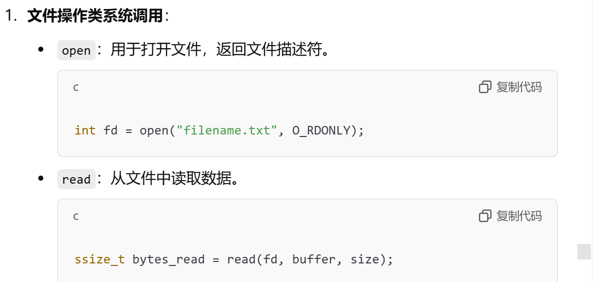
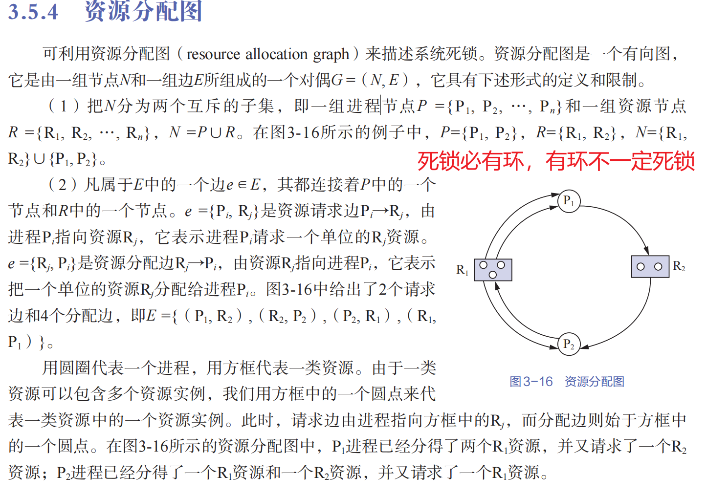
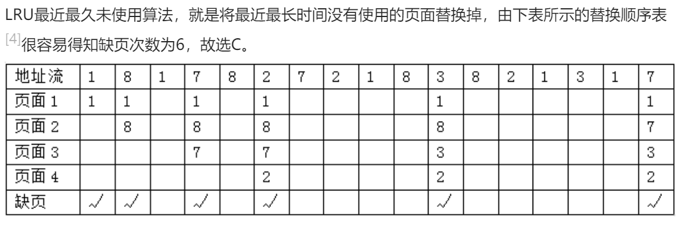
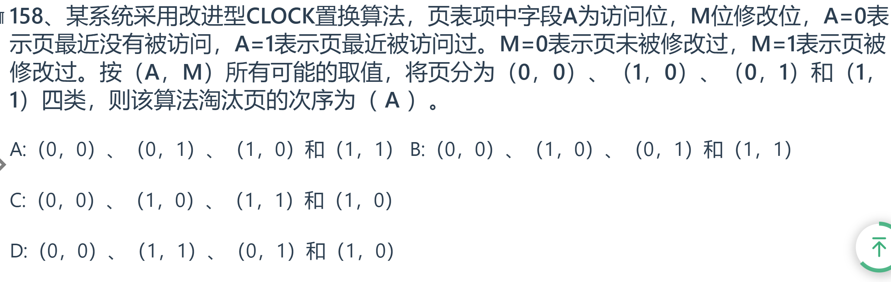
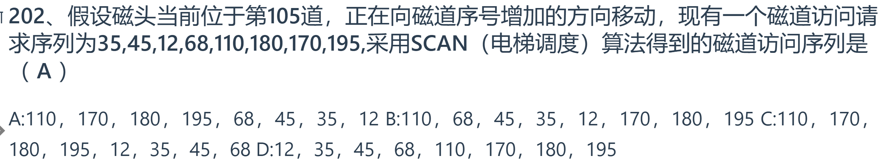
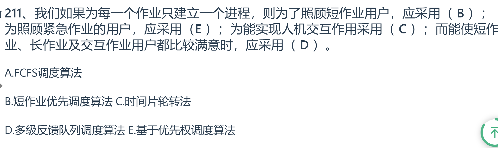
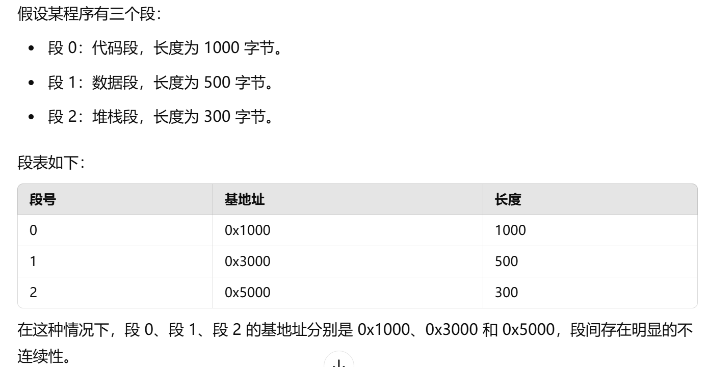

# 1.管理内容

管理属于计算机本身的资源（自带的软件和硬件）

# 2.命令接口和系统调用

命令接口是操作系统提供给用户的一种交互方式，允许用户通过输入特定的命令来请求系统服务。在命令行界面（CLI）中，用户通过键盘输入文本命令，系统解析并执行相应操作

**交互层次**：命令接口是用户与操作系统之间的交互方式，而系统调用是用户程序与操作系统内核之间的交互方式。

**使用者**：命令接口主要供用户直接使用，而系统调用是供程序员在编写程序时使用的接口。

**功能**：命令接口用于执行系统命令和管理系统资源，而系统调用用于程序请求操作系统提供的服务。

# 3.系统调用

例子

# 4.命令接口

命令接口是用户与操作系统之间进行交互的一种方式，用户通过命令接口可以控制和管理自己的作业。

根据命令控制方式的不同，命令接口可以分为以下两类：

1. **联机用户接口**：用户通过键盘或鼠标直接输入命令与系统进行交互。这种方式是即时的，用户输入命令后系统立即执行。
2. **脱机用户接口**：用户先将一组命令写入一个作业文件，然后由系统批量处理这些命令。这种方式是非即时的，用户需要事先准备好命令，系统一次性处理。

# 5.进程状态

选项A：从运行状态到阻塞状态

- 当进程在运行过程中需要等待某些事件（如I/O操作）时，进程会主动进入阻塞状态，等待事件完成。因此，这是由进程自身决定的。

选项B：从运行状态到就绪状态

- 当进程的时间片用完时，操作系统会强制将进程从运行状态切换到就绪状态，以让其他进程获得CPU时间。这是由操作系统调度机制决定的，而不是由进程自身决定的。

选项C：从就绪状态到运行状态

- 调度程序根据一定的调度算法从就绪队列中选择一个进程，并将其状态转换为运行状态。这是由操作系统调度机制决定的，而不是由进程自身决定的。

选项D：从阻塞状态到就绪状态

- 当进程等待的事件完成时，相关的协作进程或操作系统会将该进程从阻塞状态转移到就绪状态。这也不是由进程自身决定的。

综上所述，只有从运行状态到阻塞状态的转换是由进程自身决定的。

故答案为: A

# 6.进程管理

选项A：指令

- 普通指令用于执行简单的操作，但不具备原语的特殊功能，故A不正确。

## 选项B：原语

- 原语是操作系统中用于管理和控制进程的基本操作指令，能够保证操作的原子性和完整性，故B正确。

## 选项C：信号量

- 信号量用于进程同步和互斥的实现，但不是直接用于进程的管理和控制，故C不正确。

## 选项D：信箱

- 信箱机制用于进程间通信，而不是直接用于进程的管理和控制，故D不正确。

经过分析，只有选项B符合题意，是正确的答案。
故答案为: B

# 7.新进程创建

创建新进程的操作通常包括以下几种情况：

1. 提交一个批处理作业。
2. 用户在终端上登录成功。
3. 操作系统创建一个服务进程。
4. 现有的进程创建新的进程（即父进程创建子进程）。

根据题目所给的选项：

- Ⅰ. 用户登录成功：用户登录成功后，操作系统通常会创建一个新的进程来处理用户会话，故此操作会导致创建新进程。
- Ⅱ. 设备分配：设备分配是指将计算机的硬件资源分配给进程使用，这个操作本身不会导致创建新进程。
- Ⅲ. 启动程序执行：当一个程序启动执行时，操作系统会为该程序创建一个新的进程，故此操作会导致创建新进程。

综上所述，能导致创建新进程的操作是用户登录成功和启动程序执行，即选项Ⅰ和Ⅲ。

# 8.进程与线程

1. **进程是资源分配的基本单位**：
   - 在所有操作系统中，进程是资源分配的基本单位，即使系统不支持线程，进程依然是资源分配的基本单位。
   - 资源包括内存、文件描述符等。
2. **线程是调度的基本单位**：
   - 在支持线程的操作系统中，线程是调度的基本单位，即CPU调度的是线程而不是进程。
   - 一个进程可以包含多个线程，这些线程共享进程的资源。
3. **系统级线程和用户级线程的切换**：
   - 系统级线程的切换需要内核的支持，因为涉及到CPU的调度和资源的管理。
   - 用户级线程的切换不需要内核的支持，线程管理在用户空间完成。
4. **同一进程中的线程共享地址空间**：
   - 同一进程中的各个线程共享进程的地址空间，它们可以访问相同的物理内存。

根据上述分析，可以得出以下结论：

- 选项A正确，因为无论系统是否支持线程，进程都是资源分配的基本单位。
- 选项B错误，因为进程是资源分配的基本单位，线程是调度的基本单位。
- 选项C错误，因为只有系统级线程的切换需要内核的支持，用户级线程的切换不需要内核的支持。
- 选项D错误，因为同一进程中的各个线程共享同一个地址空间。

故答案为: A

# 9.进程切换

进程切换是指CPU调度不同的进程执行。在操作系统中，进程切换通常发生在以下几种情况下：

1. 当一个进程创建后，进入就绪状态。这种情况下，系统需要选择一个进程运行，这可能会引起进程切换，但并不是必然引起。
2. 当一个进程从运行状态变为就绪状态。这意味着当前正在执行的进程由于某种原因（如时间片用完）不再继续执行，CPU需要选择另一个就绪进程来运行，这必然会引起进程切换。
3. 当一个进程从阻塞状态变为就绪状态。这种情况下，阻塞进程变为就绪，只是说明它现在可以被调度，但并不会立即引起进程切换。

因此，只有当一个进程从运行状态变为就绪状态时，必然会引起进程切换。

故答案为: B

# 10.进程创建

在操作系统中，进程的创建是一个重要且复杂的过程。创建一个新进程时，系统需要完成以下几个主要步骤：

1. **填写进程表项**：系统需要为新进程创建一个进程控制块（PCB），并在其中填写必要的信息。
2. **分配内存**：系统需要为新进程分配适当的内存空间，以便其运行时使用。
3. **插入就绪队列**：新进程被创建后，需要将其***插入到就绪队列***中，等待CPU的调度。
4. **分配CPU**：这一步并不是在进程创建时完成的，而是由调度程序根据一定的调度算法，为就绪队列中的进程分配CPU。

通过分析，可以得出，进程创建过程中并不包括为进程分配CPU的操作，这是调度程序的工作，而不是进程创建的一部分。因此，选项D是进程创建时不需要做的事情。

故答案为: D

# 11.进程通信

在计算机系统中，进程间通信（Inter-Process Communication, IPC）是指不同进程之间相互交换数据或信息。常见的进程间通信方式包括：

1. **共享内存（Shared Memory）**：通过共享内存区域，多个进程可以直接读写同一块内存，从而实现数据交换。
2. **消息传递机制（Message Passing Mechanism）**：通过消息队列、信号、邮箱等机制进行进程间通信。
3. **管道（Pipe）**：是一种半双工的通信方式，通常用于父子进程之间的数据传递。

而数据库（Database）主要用于持久化存储和检索数据，不是设计用于进程间通信的工具。因此，数据库不能用来进行进程间通信。

综上所述，数据库不能用于进程间通信，而其他选项（共享内存、消息传递机制、管道）都是常见的进程间通信方式。

故答案为: A

# 12.管道

管道（Pipe）通信是一种进程间通信机制，通常用于在具有亲缘关系的进程之间进行数据传递。以下是对各选项的分析：

选项A：一个管道可实现双向数据传输

- 管道是一种半双工的通信机制，即数据传输可以双向进行，但不能同时进行。**一个管道可以实现双向的数据传输，但在同一时刻只能在一个方向上传输数据**。因此，A选项正确。

选项B：管道的容量仅受磁盘容量大小限制

- **管道的容量大小通常固定为内存中的一页，而不是由磁盘容量决定**。因此，B选项错误。

选项C：进程对管道进行读操作和写操作都可能被阻塞

- 当管道**满时，进程在写管道时会被阻塞**；当管道**空时，进程在读管道时会被阻塞**。因此，C选项正确。

选项D：一个管道只能有一个读进程或一个写进程对其操作

- 一个管道可以同时有一个读进程**和**一个写进程对其进行操作，但不能同时进行读写操作。因此，D选项错误。

综合分析，只有选项C是正确的。

故答案为: C

# 13.进程转变

进程的状态转换是操作系统中的一个重要概念，主要包括执行态、就绪态和阻塞态。进程从一种状态转换到另一种状态通常是由特定的事件触发的。具体来说：

- **执行态**：进程正在CPU上运行。
- **就绪态**：进程***已获得除CPU以外的所有资源***，等待CPU调度。
- **阻塞态**：进程等待某些事件（如I/O操作完成或资源可用）而无法继续执行。

选项A：执行P(wait)操作

- P操作（也称为等待操作）通常用于信号量，用于等待一个资源。如果资源不可用，进程会从执行态变为阻塞态，而不是就绪态。

选项B：申请内存失败

- 申请内存失败会导致进程进入阻塞态，等待资源可用。

选项C：启动I/O设备

- 启动I/O设备操作会使进程进入阻塞态，因为进程需要等待I/O操作完成。

选项D：被高优先级进程抢占

- 当一个高优先级进程出现时，当前正在运行的进程会被迫让出CPU，进入就绪态，等待重新调度。

因此，只有选项D会导致进程从执行态变为就绪态。

# 14.临界资源

1. **进程申请临界资源**：
   - 当一个进程申请临界资源时，如果该资源正被其他进程占用，则申请该资源的进程将进入阻塞状态，直到资源可用。因此，Ⅰ可能导致进程P阻塞。
2. **进程从磁盘读数据**：
   - 当一个进程从磁盘读取数据时，它必须等待数据传输的完成。在此期间，进程将进入阻塞状态，直到数据读取完成。因此，Ⅱ可能导致进程P阻塞。
3. **系统将CPU分配给高优先权的进程**：
   - 当系统将CPU分配给高优先权的进程时，当前正在运行的进程将会被暂停并进入就绪状态，而不是阻塞状态。因此，Ⅲ不会导致进程P阻塞。

**临界资源是指在某一时间内只允许一个进程访问的资源**。这种资源可能是硬件设备，如打印机、磁带机，也可能是软件资源，如变量、表格等。为了确保数据的完整性和一致性，多个进程在访问临界资源时需要遵循互斥原则，即一次只有一个进程可以访问该资源。

在操作系统中，进程访问临界资源的代码段被称为临界区。为了确保临界资源的正确访问，通常将访问过程分为四个部分：进入区（检查是否可以进入临界区），临界区（访问临界资源的代码），退出区（释放临界资源的占用标志），以及剩余区（其他非临界资源的处理代码）。

# 15.进程转变

唤醒是从阻塞到执行

# 16.父子进程

在操作系统中，父进程和子进程是通过系统调用 `fork()` 函数创建的。以下是对各选项的分析：

选项A：父进程与子进程可以并发执行

- 父进程和子进程是两个独立的进程，它们可以在操作系统的调度下并发执行，因此A选项正确。

选项B：父进程与子进程共享虚拟地址空间

- 子进程在被创建时，会复制父进程的地址空间，但此后它们是独立的地址空间，不共享虚拟地址空间。子进程可以有独立的内存和文件系统资源，因此B选项错误。

选项C：父进程与子进程有不同的进程控制块

- 父进程和子进程有不同的进程控制块（PCB），它们有各自独立的标识符（如PID），因此C选项正确。

选项D：父进程与子进程不能同时使用同一临界资源

- 父进程和子进程作为独立的进程，在访问临界资源时需要进行同步机制的协调，因此D选项正确。

综上所述，只有选项B的描述是错误的。

# 17.信号量

信号量是一种用于管理系统中共享资源的同步机制。信号量的初值表示资源的总数，而当前值表示当前可用的资源数量。

在题目中，设信号量的初值为3，表示该资源总共有3个。当前值为1，表示当前可用资源个数为1，即M=1。

接着分析等待资源的进程数N。由于当前信号量的值为1，说明还有1个资源可用，因此没有进程在等待资源，否则如果有等待资源的进程，那么当前可用资源数量应当为0。因此，N=0。

综上所述，M表示可用的资源个数，N表示等待该资源的进程数，分别为1和0。

# 同步机制

1. **让权等待**：当一个进程无法继续执行时（例如等待某个资源），它应该释放处理器的使用权，避免占用CPU资源。
2. **空闲让进**：当一个进程空闲时，其他需要使用资源的进程可以占用该资源。
3. **忙则等待**：当一个进程正在使用某个资源时，其他需要该资源的进程应等待该资源的释放。

# 18.PV

- 选项A：机器指令。机器指令是硬件能够直接执行的低级指令，P、V操作不是机器指令。
- 选项B：系统调用命令。系统调用命令是操作系统提供给用户程序的接口，但P、V操作更低级，是实现系统调用和进程管理的基础。
- 选项C：作业控制命令。作业控制命令用于管理作业的运行，P、V操作与此无关。
- 选项D：低级进程通信原语。P、V操作属于信号量机制，是用于进程同步和互斥的低级通信原语。

因此，P、V操作是一种低级进程通信原语。

# 19.进程制约关系

在多进程系统中，并发进程因为共享资源而产生相互之间的制约关系，这些制约关系可以分为两类：

1. **互斥关系**：指进程之间因相互竞争使用独占型资源（互斥资源）所产生的制约关系。当一个进程占用了某个资源，其他进程必须等待该资源被释放后才能使用。
2. **同步关系**：指进程之间为协同工作需要交换信息、相互等待而产生的制约关系。一个进程的执行需要依赖另一个进程的状态或结果。

# 20.管程

管程”（Monitor）是一种用于实现进程间同步的高级抽象数据类型。管程将共享的数据结构和对这些数据结构的操作封装在一起，并提供互斥访问的机制，以确保多个进程并发操作时的数据一致性和正确性。

其他选项分析如下：

- **类程**：C++语言中没有“类程”这一概念，显然错误。
- **线程**：线程是操作系统中执行的基本单位，它与进程的区别在于线程是进程的一部分，多个线程可以共享进程的资源。但线程不定义对共享数据结构的操作。
- **程序**：程序是一组指令的集合，用于实现某个任务或功能，但不具体定义对共享数据结构的操作。

# 21.信号量

1. **互斥信号量**：通常用于实现进程间的互斥访问，其初值一般设为1，表示资源可供一个进程使用。

2. **同步信号量**

   ：用于进程间的同步，初值需根据具体应用场景确定。

   - 若期望的消息或资源尚未产生或准备好，初值设为0。
   - 若期望的消息或资源已经准备好，初值设为一个非0的整数。

因此，用P、V操作实现进程同步时，信号量的初值应根据具体的同步需求由用户确定，而不是固定值。

# 22.进程映像

进程映像由程序、数据和进程控制块（PCB）组成。在操作系统中，某些程序段可能需要被多个进程同时使用，这就引出了“可重入”的概念。可重入代码（Reentrant Code）是指**可以在多线程或多进程环境下安全运行的代码**，不会因多个执行流的交互而产生不可预知的错误。

选项A：PCB（Process Control Block，进程控制块）

- PCB 是操作系统用于管理进程的信息集合，不涉及可重入性问题，故A错误。

选项B：程序

- 整个程序不一定需要可重入编码，只有特定的共享段才需要，故B错误。

选项C：数据

- 数据本身不具有执行的特性，是否可重入取决于如何被访问和操作，故C错误。

选项D：共享程序段

- 共享程序段必须用可重入编码编写，因为这段代码可能被多个进程同时调用和执行，确保其在并发环境下的正确性和安全性，故D正确。

经过分析，只有共享程序段需要采用可重入编码，以保证在多进程环境下的正确性和安全性。

# 23.信箱通信

**信箱通信是一种间接通信方式**。信箱通信是借助于收发双方进程之外的共享数据结构作为通信中转，发送方和接受方不必直接建立联系，没有处理时间上的限制。发送方可以在任何时间发送信息，接收方也可以在任何时间收信。

# 24.信号量

在操作系统中，信号量（Semaphore）是一种用于控制对共享资源访问的同步机制。在本题中，有4个进程共享同一程序段，每次允许最多3个进程进入该程序段。我们需要确定信号量的取值范围。

1. **信号量初值**：表示资源的总量。在本题中，表示允许进入临界区的最大进程数，因此初值为3。

2. 信号量变化情况

   ：

   - 当一个进程进入临界区时，信号量减1。
   - 当一个进程退出临界区时，信号量加1。

因此，信号量的取值范围从初值3开始，减到最小值-1，加到最大值3。考虑到允许进入的进程数为3，并且有4个进程共享，当所有进程都尝试进入时，会有1个进程被阻塞在临界区外，所以信号量的最小值为-1。

具体计算如下：

- 最大值：3（表示3个进程可以同时进入临界区）
- 最小值：-1（表示有一个进程被阻塞）

信号量的取值范围从3到-1，包括3和-1，即：3，2，1，0，-1。

# 25.PV

信号量（Semaphore）是一种用于多进程间同步的机制。信号量的值可以被两个原子操作P（wait）和V（signal）所改变。

1. **P操作**：对信号量进行-1操作，如果信号量值小于0，则进程进入等待队列。
2. **V操作**：对信号量进行+1操作，如果信号量值不小于0，则唤醒一个在等待队列中的进程。

根据题目，首先对信号量S进行了28次P操作和18次V操作，因此信号量S的变化为：
*S*−28+18=0
解得：
*S*=10

然后，再对信号量S进行了15次P操作和2次V操作，因此信号量S的变化为：
*S*−15+2=10−15+2=−3

信号量S的负值绝对值表示等待队列中的进程数，即：
∣−3∣=3

因此，有3个进程在信号量S的等待队列中。

故答案为: B

# 26.临界

1. **临界区**（Critical Section）：是指一段访问共享资源的代码，这段代码需要确保在同一时间只有一个进程能够执行，以避免多个进程同时操作共享资源而导致数据不一致或竞争条件。为了保证多个进程能安全地访问共享资源，需要实现进程互斥，即在任何时刻只有一个进程能够进入临界区。
2. **临界资源**：是指那些一次只能被一个进程访问的资源，以防止多个进程同时访问引起的问题。
3. **银行家算法**：是一种用于避免死锁的算法，而不是用于解决临界区问题。它主要用于资源分配和死锁避免。
4. **公用队列**：是一种临界资源，因为它是共享的，但一次只能有一个进程访问。
5. **私用数据**：是每个进程独有的资源，不会引起竞争条件，因此不属于临界资源。

具体分析如下：

- Ⅰ. 银行家算法是用于死锁避免的算法，而不是用于解决临界区问题，故Ⅰ错误。
- Ⅱ. 临界区是指进程中访问共享资源的那段代码，而不是实现进程互斥的代码，故Ⅱ错误。
- Ⅲ. 公用队列是共享资源，一次只能有一个进程访问，属于临界资源，故Ⅲ正确。
- Ⅳ. 私用数据是每个进程独有的，不存在临界区问题，故Ⅳ错误。

综上所述，只有选项Ⅲ是正确的。

# 27.PV

# 28.调度算法

在操作系统中，调度算法决定了系统资源如何在多个作业或进程之间进行分配。对于不同的调度算法，其适用性和优缺点各不相同。

- 时间片轮转调度算法：每个进程被分配一个固定的时间片，轮流获得CPU使用权，适合时间敏感的交互式系统。
- 先来先服务调度算法（FCFS）：按照作业到达的先后顺序进行调度，有利于长作业，而不利于短作业。
- 短作业（进程）优先算法：优先调度短作业或短进程，可能导致长作业的等待时间增加。
- 优先权调度算法：根据进程的优先级进行调度，优先级高的进程先获得CPU。

题目中提到的**CPU繁忙型作业指的是需要大量CPU时间进行计算而很少请求I/O操作的作业，这类作业更接近于长作业**。而I/O繁忙型作业则指在CPU处理时需频繁请求I/O操作的作业。因此，先来先服务调度算法（FCFS）有利于CPU繁忙型的长作业，而不利于需要频繁I/O操作的短作业。

故答案为: B

# 29.调度算法

在选择进程调度算法时，应考虑以下几个主要准则：

1. **公平性**：确保每个进程获得合理的CPU时间份额，避免某些进程长期得不到调度。
2. **有效性**：使CPU尽可能地忙碌，减少处理器空闲时间，提高处理器利用率。
3. **响应时间**：使交互式用户的响应时间尽可能短，以提高用户体验。
4. **周转时间**：使批处理用户等待输出的时间尽可能短，提高任务完成效率。
5. **吞吐量**：使单位时间内处理的进程数尽可能最多，提高系统的整体处理能力。

从上述准则可以看出，选择进程调度算法时需要考虑系统性能和用户体验的多个方面，而增长进程就绪队列的等待时间显然与这些准则相悖，因此是不正确的。

故答案为: D

# 30.周转时间

在计算平均周转时间时，我们首先需要理解周转时间的定义，***即从作业到达开始到作业完成所用的时间。***对于每个作业，周转时间等于其完成时间减去其到达时间。在单道式运行模式下，作业按顺序执行，每个作业的执行时间是固定的。

题目中提到4个作业同时到达，并且每个作业的执行时间为2小时。因此，所有作业的完成时间分别为：

- 第一个作业：2小时
- 第二个作业：4小时
- 第三个作业：6小时
- 第四个作业：8小时

为了计算平均周转时间，我们需要将所有作业的完成时间相加，然后除以作业的总数。

计算如下：
总完成时间为：2+4+6+8=20小时
平均周转时间为：420​=5小时

因此，平均周转时间为5小时。

故答案为: B

# 31.响应比

响应比是用于评价作业在调度策略中的优先级的一种方式，其计算公式为：
响应比=要求服务时间等待时间+要求服务时间​

1. 等待时间：作业从到达系统到开始执行的时间间隔。
2. 要求服务时间：作业完成所需的时间。

根据题目：

- 作业到达系统的时间是8:00。
- 作业的估计运行时间（要求服务时间）是1小时。
- 作业开始执行的时间是10:00。

计算等待时间：

- 作业从8:00到达系统，到10:00开始执行，等待了2小时。

套用公式：

- 等待时间 = 2小时
- 要求服务时间 = 1小时

响应比=12+1=3

因此，该作业的响应比为3。

# 32.优先权

在操作系统中，优先权的设置是为了优化资源的分配和提高系统的整体性能。以下是对各选项的分析：

选项A：计算型作业的优先权应高于I/O型作业的优先权

- 通常情况下，I/O型作业的优先权高于计算型作业，因为I/O操作需要及时完成，长时间等待可能会导致数据丢失或性能下降。故A错误。

选项B：用户进程的优先权应高于系统进程的优先权

- 系统进程的优先权通常高于用户进程的优先权，因为系统进程执行的是核心任务，需要优先得到资源。故B错误。

选项C：在动态优先权中，随着作业等待时间的增加，其优先权将随之下降

- 实际上，随着作业等待时间的增加，其优先权会随之上升，以确保长时间等待的作业能够得到执行。故C错误。

选项D：在动态优先权中，随着进程执行时间的增加，其优先权降低

- 随着进程执行时间的增加，其优先权确实会降低，这是为了防止某个进程长期占用CPU资源，从而保证系统的公平性和响应能力。故D正确。

经过分析，只有选项D是正确的。

故答案为: D

# 33.调度算法

在操作系统中，调度算法决定了系统如何在多个进程之间分配CPU时间。不同的调度算法有不同的特点和适用场景。其中，“绝对可抢占”是指进程在**任何时候都可以被更高优先级的进程抢占或中断**。

- 先来先服务（FCFS, First-Come, First-Served）：这种算法按照进程到达的顺序进行调度，不支持抢占。
- 时间片轮转（Round Robin）：这种算法为每个进程分配一个固定的时间片，当时间片用完后，进程会被强制中断并调度下一个进程，因此是绝对可抢占的。
- 优先级调度（Priority Scheduling）：这种算法根据进程的优先级进行调度，通常高优先级的进程可以抢占低优先级的进程，但不一定是绝对可抢占的。（非抢占式优先级调度）
- 短进程优先（Shortest Job Next, SJN）：这种算法按照进程的执行时间长短进行调度，不支持抢占。

因此，只有时间片轮转调度算法是绝对可抢占的。

# 34.时间片轮转

时间片轮转调度算法是一种常见的进程调度算法，主要用于时间共享系统。该算法将CPU时间划分为多个固定长度的时间片，每个进程在其分配的时间片内运行。如果在一个时间片结束后进程还未完成，则将其放到队列末尾等待下一个时间片。

当时间片过大时，时间片轮转调度算法的特性会发生变化。具体来说，如果时间片大于或等于进程所需的运行时间，那么每个进程在其分配的时间片内都能完成，这样就导致调度算法退化为先来先服务（FCFS）调度算法。这是因为在这种情况下，进程按照到达的顺序依次获得CPU时间，直到完成。

# 35.计算时间

# 36.周转时间

# 37.多级反馈队列

多级反馈队列调度算法是一种综合了时间片轮转调度和优先级调度的算法。其设计中考虑的因素包括：

1. **就绪队列的数量**：多级反馈队列调度算法中，存在多个优先级不同的就绪队列。因此，确定队列的数量是设计该算法的重要部分。
2. **就绪队列的优先级**：不同队列有不同的优先级，高优先级的队列中的进程会优先得到调度。
3. **各就绪队列的调度算法**：每个队列内部可以采用不同的调度算法，例如时间片轮转调度或优先级调度，以提高系统的效率和公平性。
4. **进程在就绪队列间的迁移条件**：进程在不同队列间的迁移条件是该算法的重要部分，例如，当一个进程在一个队列中运行超过一定时间片后，可能被迁移到下一个队列。

综上所述，设计多级反馈队列调度算法时，需要综合考虑上述四个因素。

故答案为: D

# 多级反馈队列

### 工作原理：

1. **多级队列**：
   - MLFQ 算法将系统中的所有进程分配到多个队列中，每个队列有不同的优先级。一般来说，队列的优先级从上到下逐级降低。较高优先级的队列拥有较短的时间片，而较低优先级的队列拥有较长的时间片。
   - 每个队列的调度策略可以不同，例如，较高优先级的队列使用**抢占式优先级调度**，而较低优先级的队列使用**时间片轮转**（Round Robin）。
2. **进程调度**：
   - 当一个新进程到达时，它通常被放入优先级最高的队列（即最前面的队列）。
   - 每个队列中的进程都按队列中的顺序进行调度。较高优先级的队列先被调度，低优先级队列只有在高优先级队列为空时才会执行。
3. **进程行为的反馈**：
   - **时间片用完后，进程降级**：如果一个进程在当前队列的时间片用尽，但仍未完成，它将被降到一个较低优先级的队列。这样，CPU资源会更多地分配给需要更多时间的进程，而对短期任务进行快速响应。
   - **未用完时间片的进程升级**：如果一个进程在其队列的时间片内完成了它的任务，它会被提升到一个优先级更高的队列。这样，已经表现得较高效的进程能获得更少的等待时间。
4. **队列的调整**：
   - 进程可能会在不同的队列之间移动，依据其执行时的行为（是否使用了全部时间片、是否能快速完成任务等）来动态调整优先级。这种动态调整机制使得调度系统能够自适应地管理不同类型的进程，平衡响应时间和公平性。

# 38.破坏循环等待

死锁预防是通过破坏产生死锁的四个必要条件之一，从而保证系统不进入死锁状态的一种静态策略。产生死锁的四个必要条件是：

1. **互斥条件**：资源不能被共享，只能由一个进程使用。
2. **占有并等待条件**：一个进程已经持有至少一个资源，并且还在等待获取其他资源。
3. **不剥夺条件**：进程所获得的资源在未使用完之前不能被剥夺，只能在使用完时由进程释放。
4. **循环等待条件**：存在一个进程集合{*P*1,*P*2,...,*P**n*}，其中*P*1在等待*P*2占用的资源，*P*2在等待*P*3占用的资源，……，*P**n*在等待*P*1占用的资源，形成一个循环等待链。

我们需要判断哪种方法破坏了“循环等待”条件：

选项A：银行家算法

- 银行家算法通过资源分配图来避免死锁，但它并不直接破坏“循环等待”条件。

选项B：一次性分配策略

- 一次性分配策略通过要求进程在开始时就请求所有需要的资源，从而避免占有并等待条件，但并不直接破坏“循环等待”条件。

选项C：剥夺资源法

- 剥夺资源法允许在必要时剥夺进程所占有的资源，从而避免死锁，但并不直接破坏“循环等待”条件。

选项D：资源有序分配策略

- 资源有序分配策略通过要求所有进程按照相同的顺序请求资源，从而避免形成循环等待链，直接破坏了“循环等待”条件。

因此，破坏“循环等待”条件的方法是资源有序分配策略。

故答案为: D

# 39.不会发生死锁最小资源数

在操作系统中，为了避免死锁，我们需要确保系统中存在足够的资源供所有进程完成其任务。在本题中，我们有三个并发进程，每个进程需要四个同类资源。

根据银行家算法，如果系统能保证至少有一个进程可以完成其任务并释放资源，那么系统就不会发生死锁。具体来说，假设每个进程已经占用了尽可能多的资源，我们需要计算这种情况下剩余的资源是否足以让至少一个进程完成任务。

假设每个进程已经占用了3个资源：

- 总共占用的资源数为 3×3=9
- 剩余的资源数为 10−9=1

在这种情况下，如果系统中还有1个剩余资源，那么任何一个进程都可以获得这1个资源，完成其任务并释放出4个资源。这样，其他进程就可以继续完成任务。因此，系统中至少需要10个资源才能避免死锁。

通过上述分析，我们可以得出，当资源数为10时，必然存在一个进程能够拿到4个资源，从而顺利执行完毕，并释放资源供其他进程使用。

# 40.不会发生死锁最大进程数

2X+1=11

# 41.会发生死锁最大进程数

42.

- **中断功能**：中断功能是多道程序技术的基础。通过中断，当前正在执行的程序可以被暂停，CPU转而执行其他任务或处理其他事件，从而实现多道程序的交替执行。

# 42.判断资源

必然无死锁

注意是同类资源

# 死锁与安全状态

死锁与安全状态的关系是**死锁状态一定是不安全状态**。具体来说：

- 死锁状态是指两个或两个以上的进程在执行过程中，因争夺资源而造成的一种互相等待的现象，若无外力作用，它们都将无法推进下去。
- 安全状态是指系统能按某种进程顺序（**安全序列**）为每个进程分配其所需的资源，直至满足每个进程的最大需求，使每个进程都能顺利完成。
- 不安全状态则是指系统无法找到这样一个安全序列，使得所有进程都能顺利完成。

因此，如果系统处于死锁状态，那么它一定是不安全的，因为至少有一个进程序列无法顺利完成。但是不安全状态并不一定意味着系统已经进入了死锁状态，因为它可能只是暂时无法找到安全序列，而通过调整资源分配策略，系统仍然有可能恢复到安全状态。

# 43.资源分配图

# 44.检测死锁

1. **预防死锁**：通过设置某些条件，确保系统永远不会进入死锁状态。
2. **避免死锁**：在资源分配过程中，使用安全状态的概念，确保每次资源分配不会导致系统进入不安全状态。
3. **检测死锁**：允许系统进入死锁状态，但通过算法检测出死锁并采取措施解除。
4. **解除死锁**：当检测到死锁后，采取措施解除死锁，如撤销部分进程或预先分配资源。

死锁定理是用于检测系统中是否存在死锁的理论基础。通过死锁定理，可以判断系统是否已经进入死锁状态。因此，死锁定理属于检测死锁的方法。

故答案为: C

# 45.计算

老规矩

# 46.死锁进程数

在操作系统中，死锁是指多个进程互相等待其他进程释放资源，从而导致所有进程都无法继续执行的状态。对于本题，我们需要分析在共享系统资源的情况下，最少几个进程会进入死锁状态。

假设系统中有3个不同的临界资源 *R*1,*R*2, 和 *R*3，被4个进程 *P*1,*P*2,*P*3, 和 *P*4 共享。各个进程对资源的需求如下：

- *P*1 申请 *R*1 和 *R*2
- *P*2 申请 *R*2 和 *R*3
- *P*3 申请 *R*1 和 *R*3
- *P*4 申请 *R*2

为了分析最少几个进程会进入死锁状态，我们可以通过资源分配图来进行分析。假设初始状态下：

- *P*1 已获得 *R*1，等待 *R*2
- *P*2 已获得 *R*2，等待 *R*3
- *P*3 已获得 *R*3，等待 *R*1
- *P*4 已获得 *R*2，等待 *R*3

根据上述情况，我们可以得出如下的资源分配和等待关系：

- *P*1 等待 *R*2，而 *R*2 被 *P*4 占用
- *P*2 等待 *R*3，而 *R*3 被 *P*3 占用
- *P*3 等待 *R*1，而 *R*1 被 *P*1 占用
- *P*4 等待 *R*3，而 *R*3 被 *P*3 占用

由此可见，进程 *P*1,*P*2, 和 *P*3 之间形成了一个闭环，即 *P*1→*P*2→*P*3→*P*1。这说明至少有3个进程会进入死锁状态

# 47.死锁

------

死锁是指多个进程在执行过程中因争夺资源而产生的一种互相等待的现象，若无外力作用，这些进程都将无法推进。以下是对各个选项的分析：

选项I：可以通过剥夺进程资源解除死锁

- 这是正确的。死锁解除的一种方法是通过剥夺某些进程的资源，使得其他进程能够继续执行，从而打破死锁状态。

选项II：死锁的预防方法能确保系统不发生死锁

- 这是正确的。死锁的预防方法是通过破坏死锁的四个必要条件之一来防止死锁的发生，从而确保系统不发生死锁。

选项III：银行家算法可以判断系统是否处于死锁状态

- 这是错误的。**银行家算法是一种死锁避免算法，而不是死锁检测算法**。银行家算法用于确保系统不会进入不安全状态，从而避免死锁，而不是用于判断系统是否已经处于死锁状态。

选项IV：当系统出现死锁时，必然有两个或两个以上的进程处于阻塞态

- 这是正确的。当系统发生死锁时，至少有两个进程会互相等待对方释放资源，因此这些进程会处于阻塞状态。

根据上述分析，选项I、II、IV是正确的，而选项III是错误的。

故答案为: B

# 48.存储管理

存储管理是操作系统的重要功能之一，涉及内存的分配、保护和虚拟化等多个方面。对于给定的选项，逐一分析如下：

选项A：存储保护的目的是限制内存的分配

- 存储保护的主要目的是防止一个进程非法访问另一个进程的内存空间，确保各个进程在自己的内存空间内运行，而不是限制内存的分配。因此，A选项错误。

选项B：在内存为M、有N个用户的分时系统中，每个用户占用M/N的内存空间

- 分时系统中，内存分配给各个用户是动态的，不是固定的。每个用户实际占用的内存空间取决于其进程的需求和系统的调度策略，不是简单地均分内存。因此，B选项错误。

选项C：在虚拟内存系统中，只要磁盘空间无限大，作业就能拥有任意大的编址空间

- 虚拟内存的大小受限于硬件的地址总线宽度，而不是磁盘空间。即使磁盘空间无限大，编址空间也不能超过地址总线所能表示的范围。因此，C选项错误。

选项D：实现虚拟内存管理必须有相应硬件的支持

- 虚拟内存的实现确实需要硬件支持，例如内存管理单元（MMU）来完成地址转换和访问控制。因此，D选项正确。

综上所述，只有选项D是正确的。

故答案为: D

# 49.可变分区

画图

每个分区只能分配一次

# 50.覆盖技术

覆盖技术是一种在早期计算机系统中使用的技术，用于在有限的内存中运行较大的程序。它通过将程序分成多个部分（称为覆盖块），在需要时动态加载和替换这些部分，从而有效地利用内存空间。这种技术主要应用于单一连续存储管理中，因为这种存储管理方案通常只能提供一个连续的内存区域。

选项A：单一连续存储管理

- 这是最简单的存储管理方案，只提供一个连续的内存区域。由于其内存管理的局限性，适合采用覆盖技术来扩大存储容量。

选项B：可变分区存储管理

- 这种管理方案允许将内存划分为大小可变的分区，以适应不同程序的需求，因此不需要使用覆盖技术。

选项C：段式存储管理

- 这种管理方案将程序分为多个段（如代码段、数据段等），每个段独立管理，不需要覆盖技术。

选项D：段页式存储管理

- 这是一种结合段式和页式存储管理的方案，内存被分成固定大小的页，每个段再分成若干页，管理更加灵活，不需要覆盖技术。

因此，覆盖技术适用于单一连续存储管理方案。

故答案为: A

# 51.空闲分区合并

在动态分区分配方案中，当一个作业完成后，系统会收回其主存空间，并与相邻的空闲区合并，以减少内存碎片并优化内存使用。在这种情况下，如果回收的分区既有上邻空闲区也有下邻空闲区，那么这三个区域将合并成一个更大的空闲区。因此，空闲区表中的项数会减少一个，因为原先记录上、下邻空闲区的两个表项现在只需要合并为一个表项来记录新的大空闲区。这种合并操作有助于减少外部碎片，提高内存利用率。

原来有两个，现在执行完了多了一个，但是表还没更新，记录的还是2个，有上有下就可以合并为1，减一.

两个合并不变

# 52.动态和静态重定位

在计算机系统中，**重定位**（Relocation）是指将程序的逻辑地址转换为物理地址的过程。根据重定位发生的时机，主要分为**静态重定位**和**动态重定位**。

**静态重定位**：

- **定义**：**在程序装入内存时**，由装入程序对目标程序中的指令和数据的地址进行修改，将程序的逻辑地址转换为实际的物理地址。这种地址变换在装入时一次完成，程序运行期间不再进行重定位。
- **特点**：
  - **无需额外硬件支持**：静态重定位主要依赖软件实现，不需要增加硬件地址转换机构。
  - **内存空间要求连续**：程序必须装入连续的内存区域，且装入后不能再移动，这可能导致内存碎片，降低内存利用率。
  - **程序共享困难**：各个用户进程很难共享内存中的同一程序副本。

**动态重定位**：

- **定义**：**在程序执行期间**，每次访问内存之前进行地址重定位。这通常由硬件的地址变换机构（如内存管理单元，MMU）实现，通过将逻辑地址动态映射到物理地址。
- **特点**：
  - **需要硬件支持**：动态重定位依赖于硬件支持，如重定位寄存器和地址变换机构。
  - **内存空间灵活**：程序可装入任意内存区域，不要求占用连续的内存区，甚至只需装入部分代码即可运行，提高了内存利用率。
  - **程序可移动**：程序在内存中可以移动，只需更新重定位寄存器的值即可，不影响程序的正确执行。
  - **易于共享**：多个进程可以方便地共享同一程序的副本。

**主要区别**：

1. **地址转换时机**：
   - 静态重定位在程序装入内存时完成地址转换。
   - 动态重定位在程序执行期间，每次访问内存时进行地址转换。
2. **所需支持**：
   - 静态重定位主要依赖软件支持。
   - 动态重定位需要硬件支持，如重定位寄存器和地址变换机构。
3. **内存利用率**：
   - 静态重定位要求程序占用连续的内存空间，可能导致内存碎片。
   - 动态重定位允许程序占用非连续的内存空间，提高内存利用率。
4. **程序移动性**：
   - 静态重定位后，程序在内存中的位置固定，不能移动。
   - 动态重定位允许程序在内存中移动，只需更新重定位寄存器。

现代计算机系统通常采用动态重定位方法，以提高内存利用率和系统灵活性。

# 53.内存保护

在操作系统中，多进程的执行需要在主存中彼此互不干扰，这主要通过内存保护机制来实现。内存保护的目的是确保每个进程只能访问其合法的内存空间，而不会干扰其他进程的内存空间。

1. **内存分配**：这是操作系统管理内存资源的一部分，但它本身并不直接提供进程间的互不干扰。
2. **内存保护**：这是确保多进程在执行过程中不互相干扰的核心机制。通过内存保护，每个进程只能访问被授权的内存区域，防止非法访问。例如，在页式管理中有页地址越界保护，在段式管理中有段地址越界保护。
3. **内存扩充**：指的是通过技术手段（如虚拟内存）来扩展内存使用，以应对内存不足的情况，这与进程间的互不干扰无直接关系。
4. **地址映射**：这是将虚拟地址转换为物理地址的过程，虽然涉及内存管理，但主要是为了确保程序正确运行，而不是直接用于进程间的互不干扰。

综合上述分析，只有内存保护机制能够确保多进程在主存中彼此互不干扰。

54.

**最佳**适应算法要求将空闲区按长度递增的次序登记在空闲区表中。这样做的优点是可以快速找到最小的满足要求的空闲分区，减少内存空间的浪费。

具体步骤如下：

1. 将所有空闲分区按长度从小到大的顺序登记在空闲区表中。
2. 当有内存分配请求时，从空闲区表中选择第一个能满足请求的分区进行分配。
3. 分配后，如果剩余部分仍然是空闲分区，则继续按长度递增的顺序插入到空闲区表中。

**最差**适应分配算法（Worst Fit）是一种内存分配策略，其核心思想是选择最大的空闲分区来满足内存分配请求。这种算法的具体实现和特点如下：

1. **空闲分区排序**：最差适应算法要求空闲分区表（空闲区链）中的空闲分区按大小从大到小进行排序。
2. **分配过程**：当有内存分配请求时，算法从空闲分区表的表头开始查找，找到第一个满足要求的空闲分区进行分配。
3. **分割空闲区**：如果选择的空闲分区大小大于所需大小，算法将该分区进行分割，将剩余部分保留在空闲分区表中。
4. **分配效率**：由于总是选择最大的空闲分区，最差适应算法的查找效率较高，因为它只需要检查第一个分区是否满足要求。
5. **碎片问题**：这种算法倾向于保留较小的空闲分区，从而减少小碎片的产生。然而，它也可能导致较大的剩余碎片，因为经常分割大的空闲区。
6. **适用场景**：最差适应算法适用于请求分配的内存大小范围较窄的系统。

综上所述，最差适应分配算法通过优先使用最大的空闲分区来减少小碎片的产生，但可能需要更频繁地进行内存碎片整理操作以应对较大的剩余碎片。

# 54.分页段式管理

因为系统给进程提供的是虚拟地址，而虚拟地址对应的物理地址可以由系统修改，进程对此无感知，也不需要关心对应的物理地址是什么。此外，页表和段表本身也要占用一定的存储空间，而它们的具体大小不能确定，因此影响了用户可用的物理地址空间的大小。

# 55.分段时间

段式存储管理是一种内存管理方式，在这种方式中，程序在编写时就被划分为若干个逻辑段。每个逻辑段代表一个独立的逻辑单元，如主程序段、子程序段、数据段等。这种划分是在用户编写程序时完成的，而不是在程序运行时动态决定的。

选项A：分配主存

- 这是指在程序执行时为各个段分配实际的内存空间，而不是决定程序如何分段。

选项B：用户编程

- 程序分段是在用户编写程序时完成的，此时程序被逻辑上划分为若干段。故B正确。

选项C：装作业

- 这是指将程序装入内存，但此时分段已经由编程时决定，不再改变。

选项D：程序执行

- 在程序执行过程中，分段已经固定，不会再做更改。

综上所述，程序分段是在用户编程时决定的。

# 56.动态链接

程序的动态链接指的是在程序运行时，根据需要将不同的模块或段动态地链接到内存中。因此，内存管理方式应该支持程序按照逻辑段进行划分和管理，这样才有利于程序的动态链接。

选项A：分段存储管理

- 分段存储管理将程序按照逻辑段进行划分，例如代码段、数据段等，这样可以更好地支持程序的动态链接，故A正确。

选项B：分页存储管理

- 分页存储管理将内存划分为固定大小的页，与程序的逻辑结构无关，不利于程序的动态链接，故B错误。

选项C：可变式分区管理

- 可变式分区管理根据需求动态调整内存分区大小，与程序的逻辑结构无关，不利于程序的动态链接，故C错误。

选项D：固定式分区管理

- 固定式分区管理将内存划分为固定大小的分区，与程序的逻辑结构无关，不利于程序的动态链接，故D错误。

经过分析，只有分段存储管理方式有利于程序的动态链接。

早期：固定分区和固定可变分区（无法换入换出）

现在：分页分段实现虚拟存储（比物理内存更大的内存）

# 57.存储管理

1. **分区存储管理**：这是最简单的存储管理方式，主要通过将内存划分为若干个分区来管理程序的内存需求。由于其设计简单，不需要复杂的数据结构和硬件支持，因而实现代价最小，特别适合嵌入式等微型设备。
2. **分页存储管理**：这种方式将内存划分为固定大小的页和页框，并使用页表进行地址转换。虽然分页管理提高了内存利用率和访问速度，但需要维护页表，并可能需要硬件支持（如TLB），实现代价较高。
3. **分段存储管理**：分段管理将内存划分为逻辑段，每个段有不同的长度和用途。为了实现分段管理，需要维护段表，并且可能需要硬件支持，实现代价较高。
4. **段页式存储管理**：这是分页和分段管理的结合，兼具两者的优点，但实现起来更加复杂，需要维护段表和页表，并需要更多的硬件支持，如页表和段表的硬件管理单元。实现代价最高。

# 58.动态分区

1. 在系统启动时，除了操作系统占用的一部分内存外，其余的内存空间形成一个大的空闲区，称为自由空间。
2. 当有作业申请内存时，系统从自由空间中划分出一个与作业需求量相适应的分区，并将该分区分配给作业。这个过程发生在作业装入时。
3. 作业运行完毕后，系统会收回释放的分区，并将其重新合并到自由空间中。

# 59.访问内存次数

在段页式分配中，当CPU需要从内存中取一次数据时，涉及到多次内存访问。具体步骤如下：

1. **访问段表**：段表存储在内存中，CPU首先需要查找段表，以确定段描述符的位置。
2. **访问页表**：根据段描述符中的信息，CPU再查找相应的页表，页表也存储在内存中。
3. **访问物理内存**：通过页表中的页帧号和页内偏移的结合，CPU计算出数据的物理地址，并最终访问物理内存中的数据。

综上所述，段页式分配中每次取数据需要进行3次内存访问：一次访问段表，一次访问页表，一次访问实际数据所在的物理内存。

# 60.地址结构维度

1. **分页（Paging）**：
   - 分页存储管理将作业的地址空间划分为固定大小的页和页框，地址空间是一维的，即单一的线性地址空间。程序员只需要一个记忆符来表示地址。
2. **分段（Segmentation）**：
   - 分段存储管理将作业的地址空间划分为若干个段，每个段有独立的地址空间，段长可以不相同。因此，地址空间是二维的，程序员在标识一个地址时，既需给出段名又需给出段内地址。
3. **段页式（Segmented Paging）**：
   - 段页式存储管理结合了分页和分段的特点，地址空间既划分为段，又在段内划分为页。因此，地址空间也是二维的。

通过对比，我们可以看出，只有分页存储管理方式提供一维地址结构。

# 61.页表

# 62.段页式管理

1. **段式管理**：段式管理是将一个程序按照逻辑结构划分为若干个段，每个段有其逻辑意义，比如代码段、数据段等。段式管理便于模块化和信息保护。
2. **页式管理**：页式管理是将内存划分为固定大小的页框，程序的逻辑地址空间也被划分为同样大小的页。页式管理便于内存分配和虚拟内存的实现。

段页式存储管理结合了上述两种管理方式的优点，其具体实现步骤如下：

1. **分段**：首先将用户程序按照逻辑结构划分为若干个段，每个段有一个段号（段名）。
2. **分页**：然后将每个段划分为若干个固定大小的页。这样，用户地址空间就被划分为页。
3. **地址转换**：在地址转换过程中，通过段号找到段表，由段表找到物理内存中的段起始地址，再通过页号找到页表，由页表找到物理内存中的页框地址。最终，将段起始地址和页框地址组合起来，得到实际的物理地址。

# 63.碎片

在存储管理中，碎片可以分为内部碎片和外部碎片。内部碎片是指由于分配的内存块比实际需要的大而导致的未使用空间，而外部碎片是指由于空闲的内存块散落在不同的位置而无法满足新的内存分配请求。

1. 分段虚拟存储管理：每一段的长度可以不同，因此段之间可能会产生外部碎片，但不会产生内部碎片。
2. 分页虚拟存储管理：每一页的长度都相同（通常为固定大小），因此会产生内部碎片，因为分配的内存块可能比实际需求的大。
3. 段页式分区管理：地址空间首先被分成逻辑段，每段再分成固定大小的页。虽然段可以变长，但物理存储是以固定页为单位，因此会产生内部碎片。
4. 固定式分区管理：内存被划分为固定大小的分区，分配时按照固定大小进行，因此会产生内部碎片。

综上所述，分页虚拟存储管理、段页式分区管理和固定式分区管理这三种方式会产生内部碎片，而分段虚拟存储管理会产生外部碎片。

故答案为: D

# 64.页式存储

1. **Ⅰ. 在页式存储管理中，若关闭TLB，则每当访问一条指令或存取一个操作数时都要访问两次内存**
   - **分析**：TLB（Translation Lookaside Buffer）是用于加速地址转换的缓存。当TLB关闭时，每次访问指令或操作数都需要先访问页表以获取物理地址，然后再访问实际的内存地址。因此，确实需要两次内存访问。故Ⅰ正确。
2. **Ⅱ. 页式存储管理不会产生内部碎片**
   - **分析**：页式存储管理虽然不会产生外部碎片，但由于每个页框的大小是固定的，当一个进程所需的内存不是页框大小的整数倍时，最后一页会有未被使用的空间，从而产生内部碎片。故Ⅱ错误。
3. **Ⅲ. 页式存储管理当中的页面是为用户所感知的**
   - **分析**：页式存储管理对用户和应用程序是透明的，即用户在编程时无需关心具体的页表操作和地址转换过程。故Ⅲ错误。
4. **Ⅳ. 页式存储方式可以采用静态重定位**
   - **分析**：静态重定位是在程序加载到内存之前完成的，而页式存储管理可能在程序运行过程中动态调整内存布局，因此静态重定位不能满足页式存储管理的要求。故Ⅳ错误。

综上所述，只有Ⅰ是正确的。

# 65.碎片

1. **首次适应算法（First Fit）**：
   - 从头开始查找空闲分区表，找到第一个能满足要求的空闲分区进行分配。
   - 容易产生外部碎片，但不会产生内部碎片。
2. **最佳适应算法（Best Fit）**：
   - 查找空闲分区表，找到能满足要求的最小空闲分区进行分配。
   - 容易产生内部碎片，因为分配的内存可能只使用了一部分，剩余部分变成新的小空闲分区。
3. **最坏适应算法（Worst Fit）**：
   - 查找空闲分区表，找到能满足要求的最大空闲分区进行分配。
   - 同样容易产生内部碎片，但相比最佳适应算法，***产生的碎片相对较大，可能更容易再利用。***
4. **循环首次适应算法（Next Fit）**：
   - 从上次找到的空闲分区开始继续查找，找到第一个能满足要求的空闲分区进行分配。
   - 与首次适应算法类似，主要产生外部碎片。

综上所述，最佳适应算法（Best Fit）是最容易产生内存碎片的算法，因为它频繁产生小的空闲分区，导致内部碎片严重。

# 66.缺页中断

在计算机系统中，缺页中断是指在执行访存指令时，所需要的页面不在内存中，从而引发的中断。缺页中断处理过程通常包括以下几个步骤：

1. 操作系统检测到缺页中断。
2. 操作系统将所需的页面从磁盘调入内存。
3. 重新执行导致缺页中断的访存指令。

由于缺页中断是由访存指令引起的，因此在操作系统处理完缺页中断后，应该重新执行导致缺页中断的那条指令。这样才能确保程序的正确执行。

# 67.缺页处理

1. **分配页框**：当发生缺页中断时，操作系统需要在内存中找到一个空闲的页框来加载所需页面。如果内存已满，则需要调用页面置换算法，将某个页面换出到磁盘，腾出空间，以便为新的页面分配页框。
2. **磁盘I/O**：将所需页面从磁盘读入内存。这一步需要通过设备驱动程序进行磁盘I/O操作，将页面数据从外存（通常是磁盘）读取到内存中。
3. **修改页表**：将页表中的相应表项更新，以反映页面已经加载到内存中的事实。这包括将页表中的存在位（或有效位）设置为“真”，并将物理页框号填入页表中对应的位置。

# 68.缺页

B吧

# 69.请求分页和基本分页

请求分页存储管理方式采用虚拟技术，允许作业在开始运行时不必将全部数据一次性装入内存，而是根据需要动态加载页面。这种方式有效地提高了内存利用率，减少了内存占用。而基本分页存储管理方式则通常需要一次性将作业的所有页面装入内存。

# 70.页面调度算法

通过链表或红黑树等数据结构维护页面的访问情况，并利用时钟策略进行页面置换。该算法并不是直接调出被访问次数多的页面，而是通过时钟策略决定页面的访问位状态，从而进行页面置换。因此，D选项描述错误。

#### 基本CLOCK算法

1. 算法描述
   - 维护一个页面队列，类似于一个环形链表。
   - 使用一个指针（类似于时钟的指针）指向队列中的某个页面。
   - 当需要置换页面时，指针开始移动，检查每个页面的访问位（refer bit）。
   - 如果页面的访问位为1，则将其清零，并跳过该页面，继续移动指针。
   - 如果页面的访问位为0，则选择该页面进行置换，并将其从队列中移除。
   - 指针继续移动，直到找到合适的页面进行置换。
2. 算法特点
   - 简单易实现。
   - 考虑了页面的最近访问情况。
   - 可能会产生较多的磁盘I/O操作，因为可能会置换出最近被访问过的页面。

#### 改进的CLOCK算法

1. 算法描述
   - 在基本CLOCK算法的基础上，增加了一个修改位（modify bit）。
   - 当指针移动到某个页面时，不仅检查访问位，还检查修改位。
   - 如果页面的访问位和修改位均为0，则直接选择该页面进行置换。
   - 如果页面的访问位为1或修改位为1，则将其访问位清零，修改位保持不变，并跳过该页面，继续移动指针。
   - 如果所有页面的访问位均为0，但修改位为1，则选择修改位为1的页面进行置换。
2. 算法特点
   - 在基本CLOCK算法的基础上，进一步减少了磁盘I/O操作。
   - 考虑了页面的修改情况，避免置换出最近被修改过的页面。

CLOCK算法及其改进版本在操作系统和数据库系统中有着广泛的应用，它们通过有效的页面置换策略，提高了系统的整体性能。

# 71.缺页次数

根据页面置换算法的基本原理，每种页面第一次访问时不可能在内存中，必然会发生缺页

初始时，内存为空

# 72.缺页次数

对于某些程序，增加分配的物理块数可能导致更多的缺页中断，因为程序可能会访问更多之前未加载的页面。而对于其他程序，增加分配的物理块数可能减少缺页中断，因为更多的页面可以常驻内存

# 73.缺页次数

换7不换2

# 74.抖动

**抖动（也称为颠簸）是一种现象，指的是页面在内存和磁盘之间频繁地交换**。这种现象通常发生在系统内存不足，或者内存管理策略不当的情况下。以下是几种可能引起抖动的策略：

1. ***\*先进先出（FIFO）页面置换策略\****：FIFO策略会根据页面进入内存的先后顺序来决定替换哪个页面。这种策略在某些情况下可能导致抖动，特别是当最近进入内存的页面实际上是频繁访问的页面时。
2. ***\*最近最久未使用（LRU）页面置换策略\****：LRU策略替换最近最久未使用的页面。理论上，这种策略应该减少抖动，因为它倾向于保留最近频繁使用的页面。

在页面置换策略中，不同的策略对页面的处理方式不同，因此可能导致不同的效果。抖动现象是指系统频繁发生页面置换，导致性能下降的现象。

- FIFO（First-In, First-Out，先进先出）：这种策略将最早进入内存的页面最先替换出去，不考虑页面的使用情况，因此可能会导致抖动。
- LRU（Least Recently Used，最近最少使用）：这种策略是根据页面最近的使用情况来决定替换哪个页面，它属于堆栈型页面置换策略，不会引起抖动。
- 没有一种策略会引起抖动：显然与实际情况不符，因为某些策略确实可能引起抖动。
- 所有策略都会引起抖动：也不符合实际情况，因为LRU等策略不会引起抖动。

综上所述，只有FIFO策略可能引起抖动。

# 75.请求分页

在请求分页存储管理中，页表用于记录虚拟地址到物理地址的映射关系。为了更好地管理和优化内存使用，页表中通常会增加一些附加信息，例如修改位和访问位。

- **修改位（Modified Bit）**：用于指示该页是否被修改过。如果某页被修改过，其修改位会被设置，否则为未修改。
- **访问位（Accessed Bit）**：用于记录该页是否被访问过。如果某页被访问过，其访问位会被设置，否则为未访问。

这些信息对于页面置换算法尤为重要。当系统需要将某些页面调出内存时，置换算法会参考这些附加信息来决定哪些页面优先被替换。例如，可以使用LRU（Least Recently Used）算法，结合访问位来判断最近最少使用的页面；也可以使用LFU（Least Frequently Used）算法，结合修改位和访问位来判断最少使用的页面。

因此，修改位和访问位主要供置换算法参考，用于选择调出内存的页面。

# 76.抖动原因

# 77.虚拟技术

其核心思想是利用磁盘空间来扩展物理内存，使得程序可以使用比实际物理内存更多的地址空间。常见的虚拟存储技术包括页式存储管理和段式存储管理。

- 页式存储管理：将内存分成固定大小的页，程序的地址空间也分成相同大小的页，通过页表将逻辑地址映射到物理地址，实现内存的分页存储和调度。
- 段式存储管理：将内存和程序的地址空间分成若干段，每段有独立的逻辑意义，通过段表进行管理，实现内存的分段存储和调度。
- 请求段式存储管理：是一种特殊的段式存储管理，通过请求机制动态加载和调度段，实现虚拟存储。
- 动态分区存储管理：是一种内存分配方式，但不涉及虚拟存储。
- 存储覆盖技术：是一种通过覆盖技术在有限内存中运行较大程序的方法，但不属于虚拟存储技术。

根据虚拟存储技术的定义和特点，只有请求段式存储管理（C选项）是提供虚拟存储技术的存储管理方法。

**实现虚拟要请求**

# 78.虚实地址转换

虚实地址转换是指逻辑地址和物理地址之间的转换。这个过程通常涉及页表的使用，页表存储在内存中，用于将逻辑地址映射到物理地址。在进行虚实地址转换时，以下措施可以加快转换速度：

1. 增大快表（TLB）容量：
   - TLB（Translation Lookaside Buffer）是用于存储最近使用的页表项的高速缓存。增大TLB容量可以存储更多的页表项，从而减少查找页表的次数，提高转换速度。
2. 让页表常驻内存：
   - 页表是用于映射逻辑地址到物理地址的表格。如果页表常驻内存，可以避免在页表不在内存时从磁盘调入页表的过程，从而加快转换速度。
3. 增大交换区（swap）：
   - 交换区是用于存储交换出去的内存页的磁盘区域。增大交换区主要影响内存与磁盘间的交换操作，对虚实地址转换的速度没有直接影响。

因此，增大快表容量和让页表常驻内存可以加快虚实地址转换的速度，而增大交换区对转换速度无影响。

故答案为: C

# 79.CLOCK淘汰

访问和修改独立  访问>修改

# 80.全局置换固定分配

**全局置换会影响其他进程**：

- 如果一个进程需要更多内存，它会置换掉其他进程的页，从而降低其他进程的性能。
- 对于实时系统或性能敏感的应用程序，这种行为会导致响应时间不可控。

**固定分配无法动态调整内存需求**：

- 固定分配不允许进程根据当前的内存需求动态获得更多页框。
- 这导致内存需求大的进程无法正常运行，而内存需求小的进程可能浪费资源。

**局部置换**：

- 进程只能置换自己的页，避免了全局置换导致的进程间干扰。

# 81.设备属性

在计算机系统中，设备属性的相关概念如下：

- 字符设备：通常是不可寻址的，即不能指定输入的源地址或输出的目标地址，数据的输入输出是以顺序处理的方式进行。
- 共享设备：指在一段时间内允许多个进程共享使用的设备，但不一定是同时访问。典型的共享设备包括硬盘、光驱等。
- 独占设备：指在使用期间只能被一个进程独占的设备，如打印机。
- 死锁：指进程在竞争资源时，处于一种互相等待的状态，导致无法继续执行。

根据上述概念，逐一分析选项：

选项A：字符设备的基本特征是不可寻址，因此该选项错误。

选项B：共享设备必须是可寻址的和可随机访问的设备，这一点是正确的。

选项C：共享设备指的是在一段时间内允许多个进程共享使用的设备，不是指在同一时间内同时访问，因此该选项错误。

选项D：分配共享设备和独占设备时不会引起进程死锁，因此该选项错误。

综上所述，只有选项B是正确的。

# 82.设备控制器

# 83.DMA

DMA（Direct Memory Access，直接存储器访问）是一种数据交换模式，它允许I/O设备直接从主存储器中存取数据，而不需要经过CPU。这种方式的主要目的是减轻CPU的负担，提高系统的整体性能和数据传输效率。具体来说，DMA控制器（DMAC）负责在I/O设备和主存储器之间建立一条直接的数据通路，从而实现数据的高速传输。

根据题意，DMA方式是在I/O设备和主存之间建立直接数据通路，因此选项A是正确的。

选项B：两个I/O设备之间的数据传输并不涉及DMA的主要功能。
选项C：DMA不直接在I/O设备和CPU之间建立数据通路，而是绕过CPU。
选项D：CPU和主存之间的数据传输不通过DMA方式进行，DMA主要负责I/O设备与主存之间的数据传输。

# 84.通道

通道，又称为I/O处理机，是计算机系统中用于管理输入输出操作的专门硬件组件。其主要功能是通过执行通道程序，实现内存与外设之间的信息传输。这样可以减轻中央处理器（CPU）的负担，使其专注于处理核心计算任务。

# 85.硬件机制

- 通道技术：通道是一种独立于CPU之外的硬件装置，能够负责数据在内存与外设之间的传输，是典型的硬件机制。
- 缓冲池：缓冲池是内存中的一块区域，通过软件管理用于数据的临时存储，是软件机制。
- SPOOLING技术：SPOOLING（Simultaneous Peripheral Operations On-Line）技术是一种通过预先存储数据到中间存储设备（如磁盘）以提高I/O效率的技术，主要依赖软件实现。
- 内存覆盖技术：内存覆盖技术是一种通过操作系统管理内存使用，允许程序在需要时动态加载或替换内存段的技术，是软件机制。

# 86.DMA控制器

DMA控制器通常包含以下寄存器：

1. **命令/状态寄存器**：用于控制DMA的工作模式，并向CPU反映其当前状态。
2. **内存地址寄存器**：用于存储DMA操作时的源地址和目标地址。
3. **数据寄存器**：用于存储需要通过DMA传输的数据。

而**堆栈指针寄存器**则主要用于存储堆栈的当前位置，通常在计算机内存中开辟有统一的区域，不属于DMA控制器的一部分。

通过分析，我们可以得出，只有堆栈指针寄存器（选项D）不属于DMA控制器的组成部分。

故答案为: D

# 87.数据传输方式

主要包括数据选择通道、字节多路通道、数据多路通道和I/O处理机。

- 数据选择通道：通常用于连接高速设备，以并行方式进行数据传输。
- 字节多路通道：用于连接大量的低速或中速I/O设备，通过分时复用方式将多个设备的数据传输通道合并为一个高速传输通道。
- 数据多路通道：适用于连接多个高速设备，通过分时复用技术实现并行数据传输。
- I/O处理机：通常用于处理复杂的I/O任务，具有独立的处理能力，可以管理和控制多个I/O设备。

## 数据开头是高速

# 88.设备分配问题

1. **设备的固有属性**：每种设备都有其特定的属性和使用方式。例如，打印机和硬盘的使用方式完全不同。因此，在分配设备时，必须考虑设备的固有属性，以确保正确使用。
2. **设备独立性**：设备独立性是指操作系统能够灵活地分配和管理设备，而不依赖于特定的硬件。这提高了系统的灵活性和设备的利用率。
3. **安全性**：在分配设备时，必须确保安全性，以防止设备的滥用或误用。例如，确保设备分配不会导致系统崩溃或永久阻塞。
4. **及时性**：虽然及时性在某些系统中是一个重要因素，但在设备分配问题中，及时性通常不是首要考虑的问题。设备分配更多关注的是资源的有效管理和安全性，而不是速度。

综上所述，设备分配中一般不需要特别考虑及时性，而更多关注设备的固有属性、设备独立性和安全性。

故答案为: A

# 89.通道，设备控制器，设备

# 90.键盘中断

当本地用户通过键盘登录系统时，键盘作为一种外部设备，是通过中断I/O方式工作的。这意味着每当用户按键时，键盘会生成一个中断信号，计算机会响应这个中断信号。为了处理这个中断信号，系统会调用中断处理程序。中断处理程序是一段专门用于处理硬件中断的代码，它会在中断发生时执行，以读取并处理用户的输入信息。因此，首先获得键盘输入信息的程序是中断处理程序。

选项A：命令解释程序

- 命令解释程序用于解释和执行用户输入的命令，而不是直接处理键盘输入的中断信号。

选项B：中断处理程序

- 中断处理程序是用于处理硬件中断的，当键盘产生中断信号时，由它来读取和处理输入信息，故B正确。

选项C：系统调用服务程序

- 系统调用服务程序处理的是系统调用请求，而不是直接处理硬件中断。

选项D：用户登录程序

- 用户登录程序是用于验证用户身份的，而不是直接处理键盘输入的中断信号。

经过分析，只有选项B符合题意，是正确的答案。

# 91.中断

I/O中断是CPU与通道之间协调工作的一种机制，其目的是在通道完成特定任务时通知CPU。具体来说，当CPU启动通道执行数据传输任务时，通道会独立运行并执行通道程序。通道程序的执行过程是独立于CPU的，因此在通道执行通道程序的过程中，CPU可以继续执行其他任务。

一旦通道完成通道程序的执行，即数据传输结束时，通道会产生一个I/O中断信号，通知CPU数据传输任务已经完成。CPU接收到中断信号后，会暂停当前执行的任务，转而处理与该中断相关的操作。

选项分析：

- 选项A：CPU执行“启动I/O”指令而被通道拒绝接收，这种情况并不会直接导致I/O中断的产生。
- 选项B：通道接收了CPU的启动请求，这也不会直接导致I/O中断的产生，因为此时通道刚接收到请求，还未完成任务。
- 选项C：通道完成了通道程序的执行，此时通道会向CPU产生I/O中断，通知任务完成。
- 选项D：通道在执行通道程序的过程中，不会产生I/O中断，因为任务还未完成。

因此，只有选项C符合I/O中断产生的条件。

# 92.IO数据处理流程

# 93.IO系统层次

1. **用户级I/O软件**：这是与用户直接交互的层次，提供用户接口和系统调用，用于发出I/O请求。
2. **设备无关软件**：这一层次将用户的I/O请求转化为设备无关的操作，使其与具体设备的驱动程序无关。
3. **设备驱动程序**：这一层次负责与具体的硬件设备交互，执行实际的I/O操作。
4. **中断处理程序**：这一层次用于处理设备发出的中断信号，以保证I/O操作的及时响应和处理。

# 94.设备独立性

# 95.设备标识

# 96.缓冲池

缓冲技术主要包括以下几种：

1. **单缓冲**：在设备和处理机之间设置一个缓冲区。虽然可以解决数据传输速率不一致的问题，但只有一个缓冲区，无法在理论和实际操作上实现并发。
2. **双缓冲**：设置两个缓冲区，可以在处理一个缓冲区的数据时准备另一个缓冲区，从而提高处理效率，但对于并发进程而言，仍然存在缓冲区竞争的问题。
3. **循环缓冲**：适用于数据传输速率相近的设备，但在处理并发进程时存在同样的缓冲区竞争问题。
4. **缓冲池**：包含多个缓冲区，供多个进程共享，并可以动态分配和管理。它能够有效解决并发进程的输入输出问题，因为多个缓冲区可以同时供多个进程使用，避免了竞争。

# 97.假脱机技术

用户的输出数据不会直接送到打印机，而是先存储到一个特殊的区域，这个区域称为输出井。输出井是在磁盘上开辟的固定存储区域，用于临时存放用户的输出数据，之后再由系统按照一定的顺序将数据发送到打印机进行实际打印。

具体步骤如下：

1. 用户进程发出打印请求；
2. 打印请求的数据被送入输出井（磁盘上的固定区域）；
3. 系统按照顺序从输出井中读取数据，并发送到打印机进行打印。

SPOOLing技术的主要目的是将独占设备（如打印机）改造成共享设备，提高设备的利用率，并减少用户进程的等待时间。

因此，用户的打印结果首先被送到磁盘上的固定区域（输出井）。

# 98.缓冲池

主存中选A

# 99.缓冲区

缓冲区（Buffer）在计算机系统中用于在输入/输出设备与CPU之间暂存数据，以解决两者速度不匹配的问题。当I/O设备的数据传输速度与CPU的处理速度不一致时，通过缓冲区可以有效提高整体系统效率。如果I/O设备的处理时间比CPU的处理时间短得多，即I/O设备能够快速完成数据传输，那么缓冲区的存在将不会显著提升性能，甚至可能因为额外的缓冲区管理开销而导致效率下降。因此，在这种情况下，缓冲区的作用几乎无效。

具体来说：

- 缓冲区的主要目的是缓解I/O设备与CPU之间的速度差异，如果I/O设备的速度已经远快于CPU，那么通过缓冲区传输数据并不能带来显著的性能提升。
- 当I/O设备的速度远快于CPU时，缓冲区的使用反而会增加额外的延迟和管理开销，导致整体效率降低。

举例：

IO慢，1h才传输完，若无缓冲区。来一个数据CPU就中断一次，要中断很多次；有缓冲区，等传输完了CPU在缓冲区一次性处理

IO快，瞬间把数据传完，CPU再中断一次去处理，缓冲区没用

# 100.缓冲池/区

缓冲池管理的主要目标是提高进程运行效率。在多进程环境中，当多个进程需要同时访问缓冲池时，系统必须确保对缓冲池的访问是同步的，以防止数据竞争和不一致性。因此，实现进程访问缓冲池的同步是缓冲池管理中的关键问题。

选项A：选择缓冲区的大小

- 虽然缓冲区大小的选择会影响性能，但它不是缓冲池管理中的核心问题。

选项B：决定缓冲区的数量

- 决定缓冲区的数量也是性能优化的一部分，但不是缓冲池管理中的首要问题。

选项C：实现进程访问缓冲池的同步

- 当多进程访问缓冲池时，确保同步是防止资源争用和数据不一致的关键问题，故C正确。

选项D：限制进程的数量

- 限制进程的数量并不是缓冲池管理的核心问题，管理缓冲池的关键在于同步访问。

经过分析，实现进程访问缓冲池的同步是缓冲池管理中着重考虑的问题。

故答案为: C

# 101.假脱机

SPOOLing（Simultaneous Peripheral Operations On-Line，同时外围设备联机操作）技术是一种将外围设备的输入输出操作排队，并通过缓冲区来实现同时操作的技术。其主要目的是提高计算机系统的运行效率，特别是在处理输入和输出操作时。

SPOOLing技术的核心思想是利用磁盘空间（输入井和输出井）和内存空间（输入/输出缓冲区）来暂存数据，从而实现外围设备与主机的并行操作。因此，SPOOLing技术并不依赖于外围计算机的数量。

具体来说：

- **磁盘空间**：用于存储输入和输出数据的临时文件（输入井和输出井）。
- **内存空间**：用于缓冲输入和输出数据，以确保数据传输的效率和可靠性。

由此可见，SPOOLing技术并不需要外围计算机的支持，因此采用SPOOLing技术的计算机系统，外围计算机的需求为0台。

# 102.假脱机组成

# 103.假脱机

在Spooling系统中,用户进程实际分配到的是()

A、用户所要求的外设

B、外存区,即虚拟设备

C、设备的一部分存储区

D、设备的一部分空间

在Spooling（Simultaneous Peripheral Operations On-Line）系统中，通过利用磁盘作为中间存储来模拟外设，从而实现对外设的管理。具体来说，用户进程在请求外设时，实际上并不是直接分配到物理外设，而是分配到磁盘上的一部分存储区域，即虚拟设备。这是因为通过虚拟设备可以更高效地管理和调度外设的使用，提高系统的并发性和资源利用率。

选项A：用户所要求的外设

- 用户请求的外设并不是直接分配给用户进程的，故A错误。

选项B：外存区，即虚拟设备

- 用户进程实际分配到的是磁盘上的一部分存储区域，即虚拟设备，故B正确。

选项C：设备的一部分存储区

- 设备的一部分存储区并不是直接分配给用户进程的，故C错误。

选项D：设备的一部分空间

- 设备的一部分空间并不是直接分配给用户进程的，故D错误。

经过分析，只有选项B符合Spooling系统的工作原理。
故答案为: B

# 104.磁道

- 选项A：减少磁盘I/O次数。由于内存的访问速度远高于磁盘，通过在内存中设置缓冲区，可以减少频繁的磁盘访问，显著减少磁盘I/O次数，这是设置磁盘缓冲区的主要目的。
- 选项B：减少平均寻道时间。虽然缓冲区能减少磁盘I/O次数，但对平均寻道时间的减少没有直接影响，因为**寻道时间是磁盘本身的物理特性决定的。**
- 选项C：提高磁盘数据可靠性。磁盘缓冲区主要目的是提高性能，而非提高数据可靠性，数据可靠性通常通过冗余存储、校验码等手段实现。
- 选项D：实现设备无关性。设备无关性通常是通过操作系统的抽象层来实现的，与磁盘缓冲区无直接关系。

综上所述，设置磁盘缓冲区的主要目的是减少磁盘I/O次数。

# 105.设备独立性

1. **使用逻辑设备名**：用户程序通过逻辑设备名来访问物理设备，而不是直接使用物理设备名。
2. **映射关系**：操作系统内部需要建立逻辑设备与物理设备之间的映射关系，这样用户程序才能正确访问实际的物理设备。
3. **文件名访问**：在某些操作系统中，可以使用文件名来访问设备，这是一种抽象的方式，使用户将设备视为文件。
4. **设备独立性**：设备独立性意味着更换物理设备后，操作系统和应用程序不需要进行修改，仍然可以正常工作。

# 106.读取时间

1. **处理时间**：这是指磁盘控制器处理数据的时间，主要由硬件决定，因此对调度的影响较小。
2. **延迟时间**：这是指磁盘旋转到合适位置以读取或写入数据的时间。虽然可以通过提高磁盘转速来减少延迟时间，但它并不是调度的主要考虑因素。
3. **传送时间**：这是指数据从磁盘传输到内存或从内存传输到磁盘的时间。传送时间主要与总线的申请和速度有关，与磁盘调度的关系不大。
4. **寻道时间**：这是指磁盘驱动器将磁头移动到合适轨道以读取或写入数据的时间。寻道时间是磁盘调度中影响最大的因素，因为移动磁头需要时间，特别是在频繁访问不同轨道时。

# 107.饥饿

# 108.电梯调度（SCAN）

在本题中，我们需要确定在使用SCAN（电梯）调度算法时，磁头访问磁道的顺序。SCAN算法的**基本思想是磁头从一个方向一直移动到尽头，然后反向移动，类似于电梯直到最顶层或最底层再反向运行。**

具体步骤如下：

1. 磁头从当前位置105道向序号增加的方向移动。
2. 当磁头到达最大请求道（195）时，开始反向移动。
3. 磁头在反向移动过程中依次处理剩余的请求。

根据题目提供的磁道请求序列：35，45，12，68，110，180，170，195。

按照SCAN算法：

- 磁头从105道开始向增大方向移动。
- 磁头依次访问道：110，170，180，195（到达最大请求道）。
- 然后磁头反向移动，依次访问道：68，45，35，12。

因此，最终的访问顺序为：110，170，180，195，68，45，35，12。

故答案为: A

# 109.最短寻道时间优先

SSTF（Shortest Seek Time First，最短寻道时间优先）算法是一种磁盘调度算法，**它总是优先选择与当前磁头位置最近的磁道进行访问**，从而减少磁头的移动距离。

题目中给出的磁道访问请求序列为：55, 58, 39, 18, 90, 160, 150, 38, 184。磁头的起始位置为100。

根据SSTF算法，我们需要按照以下步骤计算磁头的移动距离：

1. 从起始位置100开始，选择最近的磁道。
2. 计算从当前磁道到下一个最近磁道的移动距离，累加到总移动距离中。
3. 重复步骤1和步骤2，直到所有磁道都已访问。

具体步骤如下：

1. 从100开始，选择最近的磁道：
   - 最近的是90，移动距离为100 - 90 = 10。
2. 下一个最近的磁道是58，移动距离为90 - 58 = 32。
3. 下一个最近的磁道是55，移动距离为58 - 55 = 3。
4. 下一个最近的磁道是39，移动距离为55 - 39 = 16。
5. 下一个最近的磁道是38，移动距离为39 - 38 = 1。
6. 下一个最近的磁道是18，移动距离为38 - 18 = 20。
7. 下一个最近的磁道是150，移动距离为18 - 150 = 132。
8. 下一个最近的磁道是160，移动距离为150 - 160 = 10。
9. 下一个最近的磁道是184，移动距离为160 - 184 = 24。

将这些移动距离累加，得到总移动距离为：10 + 32 + 3 + 16 + 1 + 20 + 132 + 10 + 24 = 248。

因此，磁头移动的总数为248。

故答案为: D

# 110.SCAN

SCAN算法，也称为电梯调度算法，其工作原理类似于电梯运行：磁头从当前位置开始向一个方向一直移动到最远端，然后再反向移动至另一端。具体步骤如下：

(199−58)+(199−15)=141+184=325

故答案为: C

# 111.磁道粘着

磁盘调度算法的设计旨在优化磁盘访问时间，并尽量避免磁臂粘着现象。**磁臂粘着是指磁盘总是访问某个磁道而不响应对其他磁道的访问请求**。以下是对各选项的分析：

- 选项A：先来先服务（FCFS）
  - FCFS算法根据请求到达的顺序进行处理，不会导致磁臂粘着，因为它不考虑磁道距离，完全依赖于请求到达的顺序。
- 选项B：最短寻道时间优先（SSTF）
  - SSTF算法每次选择与当前磁臂位置最近的请求进行处理，虽然优化了寻道时间，但可能导致磁臂粘着，因为总是选择最近的请求，可能忽略了其他磁道的请求。
- 选项C：扫描算法（SCAN）
  - SCAN算法也称为电梯算法，磁臂在磁盘上不断来回移动，处理所有沿途的请求。尽管它能有效避免长时间停留在一个磁道，但仍可能在某些情况下导致磁臂粘着。
- 选项D：循环扫描算法（CSCAN）
  - CSCAN算法类似于SCAN，但磁臂在到达一端后立即返回另一端，不处理沿途的请求。这可能导致磁臂粘着，特别是在磁臂返回起点时。

综上所述，只有先来先服务（FCFS）算法不会导致磁臂粘着。

故答案为: A

# 112.分区分页管理

在本题中，我们需要了解分区管理和分页管理的主要区别。

1. **分区存储管理**：

   - 固定分区

     ：

     - 优点：易于实现、开销小。
     - 缺点：存在内部碎片（分区内未被利用空间）、分区总数固定，限制了并发执行的程序数量。

   - 动态分区

     ：

     - 优点：没有内部碎片。
     - 缺点：有外部碎片（难以利用的小空闲分区）。

   - **共同点**：分区管理要求程序存放在一块连续的存储空间中。

2. **分页存储管理**：

   - 优点：没有外部碎片，最后一页可能有内碎片但不大；程序不必连续存放，便于改变程序占用空间大小。
   - 缺点：程序仍需要全部装入内存。
   - 分页管理中，程序的逻辑地址空间被分成固定大小的页，物理地址空间被分成相同大小的页框，程序可以不连续地存放在物理内存中。

通过对比，可以看出分区管理和分页管理的主要区别在于程序存放的连续性要求：

- 分区管理要求程序存放在连续的存储空间中。
- 分页管理不要求程序连续存放。

因此，选项D“分区要求一道程序存放在连续的空间内而分页没有这种要求”是正确的。

故答案为: D

# 113.分时系统特征

分时系统是一种在多个用户之间共享计算机资源的操作系统，其主要特征包括以下几点：

1. **多路性**：分时系统能够同时处理多个用户的任务，每个用户的任务在系统中都占有一定的时间片。
2. **交互性**：用户可以通过终端与系统进行交互，系统能够及时响应用户的输入。
3. **独立性**：每个用户的任务互相独立，系统为每个用户提供专用的时间片，使用户感觉像是独占计算机。
4. **及时性**：系统能够在规定的时间内完成对用户请求的响应。

根据上述特征分析，选项A、B、C都符合分时系统的特征，而选项D“成批性”与分时系统的特征不符。成批性通常是指任务成批处理，而不是即时交互，因此它不是分时系统的特征。

故答案为: D

# 114.消息缓冲

在消息缓冲队列通信中，临界资源是指在多个进程并发访问时需要进行互斥访问的资源。消息缓冲队列通信是一种进程间通信的机制，主要用于进程间的消息传递。在这种机制中，消息被存储在消息缓冲区中，这些缓冲区被链接成一个队列。

- 选项A：队列中的某个消息缓冲区。虽然单个消息缓冲区是需要互斥访问的对象，但不代表整个临界资源。
- 选项B：整个消息缓冲区队列。消息缓冲区队列作为一个整体，需要防止多个进程同时对其进行操作，以避免数据不一致或竞争条件的发生，因此是临界资源。
- 选项C：信箱。信箱是一种高级的消息传递机制，不特指消息缓冲队列。
- 选项D：管道。管道是另一种进程间通信的机制，与消息缓冲队列通信不同。

根据上述分析，消息缓冲队列通信中的临界资源应是整个消息缓冲区队列，即选项B。

# 115.作业调度

1. **短作业优先调度算法（SJF）**：该算法优先调度短作业，能够有效减少短作业的等待时间，提高系统的吞吐量，但可能会导致长作业的等待时间过长，因此适合照顾短作业用户。
2. **基于优先权的剥夺调度算法**：该算法根据作业的优先级进行调度，高优先级的作业会优先得到处理，适合照顾紧急作业用户。
3. **时间片轮转法**：该算法通过将CPU时间划分为多个时间片，并轮流分配给各个进程，保证每个进程都能得到公平的执行机会，适合实现人机交互作用，因为每个进程都能在一定时间内得到响应。
4. **多级反馈队列调度算法**：该算法结合了多种调度策略，能够兼顾短作业、长作业和交互作业用户，使各类用户都比较满意。

# 116.固定分区存储管理

固定分区存储管理是一种内存管理方式，其中内存被划分为若干个固定大小的分区，每个分区只能装入一个作业。

# 117.段式

段式存储管理是一种内存管理方式，在这种方式中，用户程序被划分为若干个段，每个段代表一个逻辑单元，例如代码段、数据段等。每个段的长度可以不一致，因此段与段之间在内存中的分布可以是不连续的。然而，在一个段内部，地址是连续的，这样可以方便地进行内存访问和操作。

# 118.页面大小与中断

当页面大小增大时，每个页面能够容纳的数据量也增加，因此程序执行过程中需要的页面总数减少，从而减少了缺页中断的次数。反之，当页面大小减小时，每个页面能够容纳的数据量减少，所需的页面总数增加，从而增加了缺页中断的次数。因此，页面大小与缺页中断次数成反比关系。

选B

# 119.文件系统

文件系统的主要组成部分通常包括两个方面：***文件和管理文件的软件***。文件是存储数据的基本单位，而管理文件的软件则负责对文件进行创建、删除、读取、写入等操作。

选项A：文件控制块及文件

- 文件控制块（FCB）是文件系统中用于描述和控制文件的数据结构，但它并不是文件系统的主要组成部分。

选项B：I/O文件及块设备文件

- I/O文件和块设备文件是文件类型的具体实例，但并不是文件系统的组成部分。

选项C：系统文件及用户文件

- 系统文件和用户文件是文件的分类，但并不能涵盖文件系统的整体组成部分。

选项D：文件及管理文件的软件

- 文件是数据存储的基本单位，而管理文件的软件则是实现文件操作的核心软件，这两者共同构成了文件系统的主要组成部分。

因此，通过对各选项的分析，选项D是正确的。

# 就绪：只差CPU

#  阻塞：还差CPU以外的

# 120.死锁计算

n个资源，再来一个，有一个进程能释放2个资源

# 121.系统调用

系统调用是操作系统提供给用户程序的接口，用于请求操作系统执行特定的服务。以下是对各选项的分析：

1. 页⾯置换：页⾯置换是内存管理的一部分，通常由操作系统内核自动管理，不需要通过系统调用完成。
2. 进程调度：进程调度是操作系统内核的任务，负责决定哪个进程在某个时刻使用CPU，不需要通过系统调用完成。
3. 创建新进程：创建新进程是通过系统调用实现的。在UNIX系统中，使用`fork()`系统调用创建新进程；在Windows系统中，使用`CreateProcess()`函数创建新进程。
4. ⽣成随机整数：生成随机整数可以通过系统调用实现，但不是主要的系统调用功能。

因此，系统调用主要用于创建新进程，例如在UNIX系统中使用`fork()`，在Windows系统中使用`CreateProcess()`。

因此答案是：C. 创建新进程。

# 122.必不可少的调度

1. **高级调度（作业调度）**：
   - 用于从外存的后备队列中选择作业，并将其调入内存，创建进程，分配资源。
   - 主要用于批处理系统，而在分时系统和实时系统中通常不需要。
   - 因此，高级调度不是所有操作系统中必不可少的。
2. **中级调度**：
   - 用于将具备运行条件的进程从外存调入内存，或将处于阻塞状态的进程从内存调出至外存。
   - 主要用于解决内存紧张问题，常见于分时系统和具有虚拟存储器的系统中。
   - 中级调度也不是必不可少的。
3. **低级调度（进程调度）**：
   - 决定哪个进程应该先获得处理机，并将处理机分配给选中的进程。
   - 是操作系统中最基本的调度，几乎所有的操作系统都必须配置进程调度。

综上所述，进程调度是一般操作系统中必不可少的调度。

# 123.周转时间

1. **周转时间**：指一个作业从提交给系统到作业完成所花费的总时间。这包括作业在队列中等待的时间、作业被调度执行的时间以及作业实际运行的时间。
2. **响应时间**：指从用户提交请求到系统开始响应请求所花费的时间。通常用于衡量交互式系统的性能。
3. **等待时间**：指作业在队列中等待调度或资源的时间。
4. **运行时间**：指作业实际运行所花费的时间，不包括等待时间和调度时间。

# 124.PV

记录型信号量是一种用于解决进程同步和互斥问题的机制。信号量是一个整型变量，它与一个初始状态为空的队列相联系。在信号量上定义两个操作：P操作和V操作，它们分别代表等待和释放资源。

- **P操作**：对信号量进行减1操作。如果结果大于零，则进程继续执行；如果结果小于等于零，则将进程置为等待状态，并将其插入到信号量的等待队列中等待资源。
- **V操作**：对信号量进行加1操作。如果信号量的值小于等于零，则唤醒在该信号量上等待的进程。

在执行P操作时，信号量的值应当减1；在执行V操作时，信号量的值应当加1。

# 125.临界区

临界区是指在多进程系统中，多个进程可能并发**访问的共享资源**或共享变量**的**那段**代码区域**。为了保证数据的一致性和避免竞争条件，需要确保在任何时刻，最多只有一个进程能进入临界区进行操作。临界区问题的核心是通过适当的同步机制，使得多个进程在访问共享资源时不会相互干扰。在本题中，变量A是一个共享资源，每个进程在访问变量A时都需要进入临界区。因此，每个涉及变量A的进程都会有自己的临界区代码段，以确保对A的访问是互斥的。由于系统中总共有五个并发进程，每个进程都有自己的临界区，因此，变量A的相关临界区由这五个进程的临界区构成。

具体来说：

- 每个进程在访问变量A时，都需要进入一个临界区以确保其他进程不能同时访问A，从而保证数据的一致性和正确性。
- 由于有五个并发进程都涉及变量A，因此每个进程都会有一个临界区，用于控制对变量A的访问。

因此，变量A的相关临界区是由这五个进程的临界区构成的。

# 126.死锁计算

# 127.进程状态转换

- **就绪状态**：进程已准备好运行，但因CPU忙碌而暂时不能获得CPU资源。
- **运行状态**：进程正在占用CPU资源执行任务。
- **阻塞状态**：进程因等待某些事件（如I/O操作完成）而暂停执行，即使CPU空闲也不能运行。

当一个进程在运行过程中遇到需要等待的事件（如打印结束）时，操作系统会将该进程从运行状态转换为阻塞状态。当等待的事件发生后，操作系统会将该进程从阻塞状态转换为就绪状态，等待被调度再次运行。

# 128.文件系统作用

文件系统是操作系统中的一个重要组成部分，其主要目的是方便用户对文件进行管理和操作。从用户的角度来看，文件系统引入的主要目的是实现对文件的按名存取。这意味着用户只需要提供文件名，文件系统就能够从存储设备中找到并读取或存储文件，而不需要用户关心文件的具体存储位置和存储细节。

选项A：保护用户数据

- 虽然文件系统确实有保护用户数据的功能，但这主要是从系统角度考虑的，而不是用户的直接需求。

选项B：实现对文件的按名存取

- 这是文件系统最主要的功能，用户通过文件名直接访问文件，而不需要关心文件存储的具体位置，这是用户最关心的功能，故B正确。

选项C：实现虚拟存储

- 虚拟存储是操作系统内存管理的一部分，与文件系统无直接关系。

选项D：保存用户和系统文档及数据

- 这虽然是文件系统的一个功能，但并不是从用户角度引入文件系统的主要目的，更多的是系统管理的需求。

经过分析，只有选项B符合从用户角度引入文件系统的主要目的。

