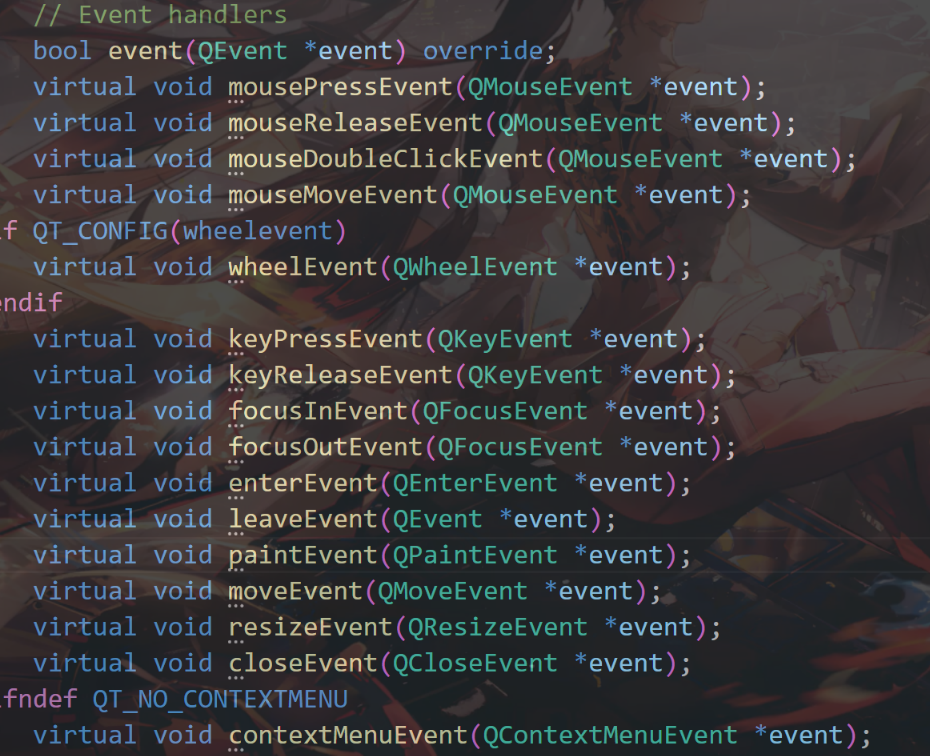
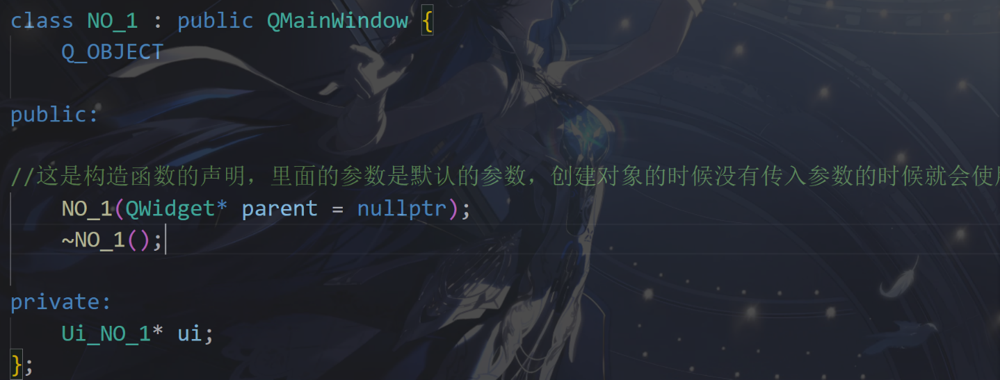
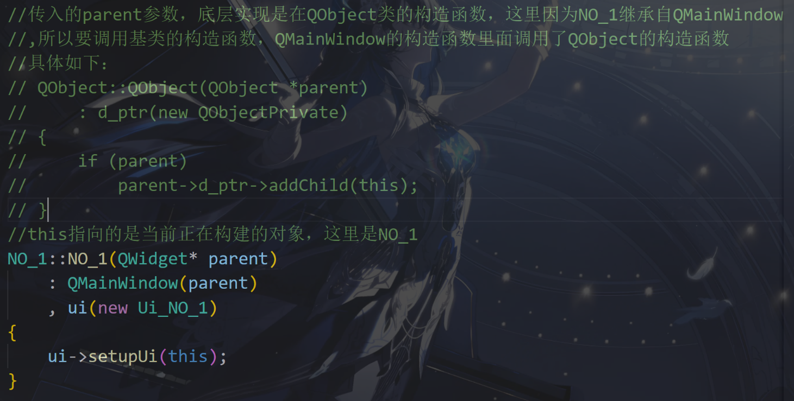
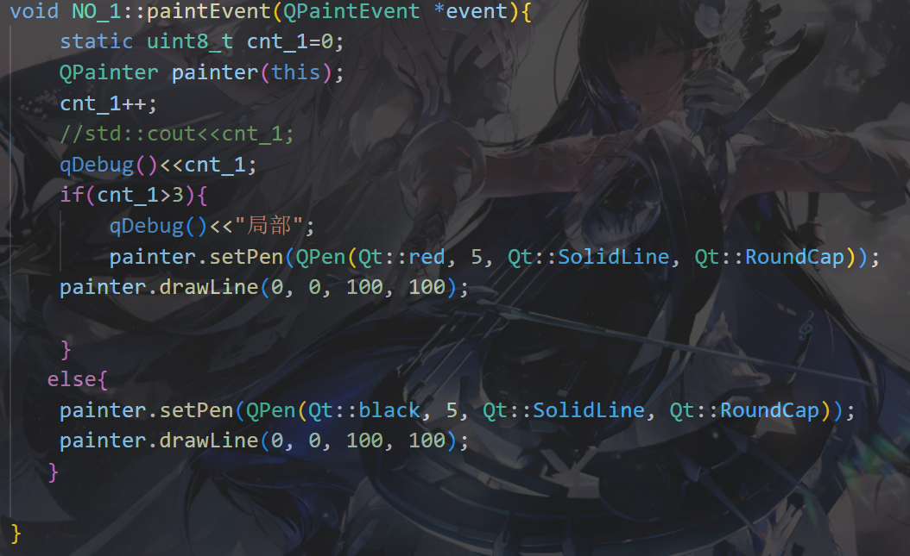

# update()


```c++
#include <QApplication>
#include <QWidget>
#include <QPushButton>
#include <QPainter>

class MyWidget : public QWidget {
    Q_OBJECT

public:
    MyWidget(QWidget *parent = nullptr) : QWidget(parent), displayText("Hello, World!") {
        // 创建一个按钮并连接槽函数
        QPushButton *button = new QPushButton("Change Text", this);
        button->setGeometry(50, 150, 100, 30);
        connect(button, &QPushButton::clicked, this, &MyWidget::changeText);
    }

protected:
    void paintEvent(QPaintEvent *event) override {
        QPainter painter(this);

        // 设置字体大小
        painter.setFont(QFont("Arial", 24));
    
        // 在窗口中央绘制当前文本
        painter.drawText(rect(), Qt::AlignCenter, displayText);
    }

private slots:
    void changeText() {
        // 改变要显示的文本
        displayText = "Text Changed!";

        // 请求重绘，触发 paintEvent()
        update();
    }

private:
    QString displayText;  // 显示的文本
};

int main(int argc, char *argv[]) {
    QApplication app(argc, argv);

    MyWidget widget;
    widget.resize(400, 300);
    widget.show();
    
    return app.exec();

}

#include "main.moc"
```


# exec()


## 什么是**主事件循环**？

1. **事件**：在Qt程序中，"事件"可以是用户操作（如点击、按键、移动鼠标等）、窗口操作（如最小化、关闭、调整大小等）、或是系统定时器等。
2. **主事件循环**：主事件循环是Qt应用程序的核心，***它不断监听和等待事件的发生***。***一旦有事件发生，它会将事件分发给适当的对象或槽函数进行处理***。例如，当用户点击按钮时，事件循环会捕捉到这个事件并触发相应的信号与槽函数。
3. **启动事件循环**：在Qt应用程序中，调用 `QApplication::exec()` 函数来启动主事件循环。这个函数会阻塞主线程，并进入一个循环，直到应用程序退出。

## 在应用程序中的用法（`QApplication::exec()`）

```c++
#include <QApplication>
#include <QPushButton>

int main(int argc, char *argv[]) {
    QApplication app(argc, argv);

    QPushButton button("Hello, World!");
    button.show();
    
    // 启动事件循环
    return app.exec();

}
```

**`app.exec()`**：这个函数启动了Qt应用程序的主事件循环。该循环持续运行，直到用户关闭应用程序。在此期间，应用程序可以处理各种事件（如鼠标点击、键盘输入等）。

程序将在 `exec()` 处阻塞，直到主窗口关闭。关闭后，`exec()` 返回一个整数值（通常是 `0`），表示应用程序的退出状态。

##  在模态对话框中的用法（`QDialog::exec()`）

```c++
#include <QApplication>
#include <QDialog>
#include <QPushButton>
#include <QVBoxLayout>

int main(int argc, char *argv[]) {
    QApplication app(argc, argv);

    QDialog dialog;
    dialog.setWindowTitle("Modal Dialog");
    
    QPushButton *okButton = new QPushButton("OK", &dialog);
    QPushButton *cancelButton = new QPushButton("Cancel", &dialog);
    
    QVBoxLayout *layout = new QVBoxLayout();
    layout->addWidget(okButton);
    layout->addWidget(cancelButton);
    dialog.setLayout(layout);
    
    // 当用户点击 "OK" 按钮时关闭对话框
    QObject::connect(okButton, &QPushButton::clicked, &dialog, &QDialog::accept);
    // 当用户点击 "Cancel" 按钮时关闭对话框
    QObject::connect(cancelButton, &QPushButton::clicked, &dialog, &QDialog::reject);
    
    // 启动模态对话框，阻塞主事件循环
    int result = dialog.exec();
    
    // 根据对话框的返回值决定后续操作
    if (result == QDialog::Accepted) {
        // 用户点击了OK
        qDebug("Dialog accepted");
    } else {
        // 用户点击了Cancel
        qDebug("Dialog rejected");
    }
    
    return app.exec();

}
```

**`dialog.exec()`**：启动了模态对话框的局部事件循环。此时，用户只能与对话框交互，其他窗口将不可用（模态）。程序将在 `exec()` 处阻塞，直到用户关闭对话框（通过点击“OK”或“Cancel”）。

`exec()` 的返回值：

- 如果用户点击“OK”，则返回 `QDialog::Accepted`。
- 如果用户点击“Cancel”，则返回 `QDialog::Rejected`。

**主事件循环是Qt应用程序的心脏，负责监听、捕捉和处理所有用户的交互事件，保持程序的持续运行与响应。**

```c++
# int main(int argc, char *argv[])

#include <QApplication>
#include <QPushButton>

int main(int argc, char *argv[]) {
    // 创建应用程序对象
    QApplication app(argc, argv);

    // 创建一个按钮
    QPushButton button("Hello, World!");
    button.show();
    
    // 启动事件循环
    return app.exec();

}
```

在Qt应用程序中用于初始化 `QApplication` 或 `QCoreApplication` 对象，进而启动事件循环。`QApplication` 负责处理所有与GUI（图形用户界面）相关的事件，如窗口、控件、按钮等。


# QButtonGroup

在 Qt 中，`QButtonGroup` 是一个非可视化的类，用来管理一组按钮（例如 `QRadioButton` 或 `QCheckBox`）。它的作用是将多个按钮组合在一起，方便对它们的状态进行管理和处理。通过 `QButtonGroup`，你可以知道哪个按钮被选中，以及对按钮的选择事件做出响应。

### 主要功能：

- **分组管理按钮**：`QButtonGroup` 允许将多个按钮归为一组，这样你就可以对它们进行集体管理。
- **管理互斥按钮**：对于一组 `QRadioButton`，你可以让它们具有互斥性，保证在同一时间内只有一个按钮被选中。
- **信号与槽机制**：当按钮状态发生改变时，`QButtonGroup` 会发出信号，便于在程序中处理这些事件。

### 常见用法：

1. **单选按钮组（`QRadioButton`）**：例如一组单选按钮，只允许用户在其中选择一个。
2. **多选按钮组（`QCheckBox`）**：例如一组复选框，允许用户选择多个。

### 主要方法：	

- **`addButton(QAbstractButton \*button, int id = -1)`**：将按钮添加到组中。每个按钮可以分配一个唯一的 `id`。
- **`button(int id)`**：根据按钮的 `id` 返回对应的按钮。
- **`checkedButton()`**：返回当前选中的按钮。
- **`checkedId()`**：返回当前选中按钮的 `id`。
- **`buttonClicked(int id)` 信号**：当按钮被点击时，发出该信号，传递点击按钮的 `id`。


# QGroupBox


QGroupBox为构建分组框提供了支持。分组框通常带有一个边框和一个标题栏，作为容器部件来使用，在其中可以布置各种窗口部件。分组框的标题通常在上方显示，其位置可以设置为靠左、居中、靠右、自动调整这几种方式之一。位于分组框之中的窗口部件可以获得应用程序的焦点，位于分组框之内的窗口部件是分组框的子窗口，通常使用addWidget()方法把子窗口部件加入到分组框之中。


```c++
// 构造函数
QGroupBox::QGroupBox(QWidget *parent = Q_NULLPTR);
QGroupBox::QGroupBox(const QString &title, QWidget *parent = Q_NULLPTR);

// 公共成员函数
bool QGroupBox::isCheckable() const;
// 设置是否在组框中显示一个复选框
void QGroupBox::setCheckable(bool checkable);

/*
关于对齐方式需要使用枚举类型 Qt::Alignment, 其可选项为:
    - Qt::AlignLeft: 左对齐(水平方向)
    - Qt::AlignRight: 右对齐(水平方向)
    - Qt::AlignHCenter: 水平居中
    - Qt::AlignJustify: 在可用的空间内调整文本(水平方向)
	

    - Qt::AlignTop: 上对齐(垂直方向)
    - Qt::AlignBottom: 下对齐(垂直方向)
    - Qt::AlignVCenter: 垂直居中

*/
Qt::Alignment QGroupBox::alignment() const;
// 设置组框标题的对其方式
void QGroupBox::setAlignment(int alignment);

QString QGroupBox::title() const;
// 设置组框的标题
void QGroupBox::setTitle(const QString &title);

bool QGroupBox::isChecked() const;
// 设置组框中复选框的选中状态
[slot] void QGroupBox::setChecked(bool checked);
```

拓展:


```c++
QGroupBox *groupBox = new QGroupBox("Options");
QRadioButton *radioButton1 = new QRadioButton("Option 1", groupBox);
QRadioButton *radioButton2 = new QRadioButton("Option 2", groupBox);
QRadioButton *radioButton3 = new QRadioButton("Option 3", groupBox);
```

在这个例子中，`groupBox` 是一个组框，包含三个单选按钮，每个按钮有不同的标签（"Option 1"、"Option 2" 和 "Option 3"）。这些按钮将被放置在 `groupBox` 中，成为它的子控件。

# QMenuBar,QMenu,QAction


一个QMenuBar可以有多个QMenu，一个QMenu可以有多个QAction，每个QAction可以对应多个类成员函数（图中只画出了对应一个函数的情况）


```c++
#include <QApplication>
#include <QMainWindow>
#include <QMenuBar>
#include <QMenu>
#include <QAction>
#include <QMessageBox>

class MainWindow : public QMainWindow {
    Q_OBJECT

public:
    MainWindow(QWidget *parent = nullptr) : QMainWindow(parent) {
        // 创建菜单栏
        QMenuBar *menuBar = new QMenuBar(this);
        setMenuBar(menuBar);

        // 创建“文件”菜单
        QMenu *fileMenu = new QMenu("File", this);
        menuBar->addMenu(fileMenu);  // 将“File”菜单添加到菜单栏
    
        // 创建“新建”动作并添加到“文件”菜单
        QAction *newAction = new QAction("New", this);
        fileMenu->addAction(newAction);
    
        // 创建“打开”动作并添加到“文件”菜单
        QAction *openAction = new QAction("Open", this);
        fileMenu->addAction(openAction);
    
        // 创建分隔符和“退出”动作
        fileMenu->addSeparator();  // 添加分隔符
        QAction *exitAction = new QAction("Exit", this);
        fileMenu->addAction(exitAction);
    
        // 创建“帮助”菜单和“关于”动作
        QMenu *helpMenu = new QMenu("Help", this);
        menuBar->addMenu(helpMenu);  // 将“Help”菜单添加到菜单栏
        QAction *aboutAction = new QAction("About", this);
        helpMenu->addAction(aboutAction);
    
        // 连接信号与槽
        connect(exitAction, &QAction::triggered, this, &MainWindow::close);
        connect(aboutAction, &QAction::triggered, this, []() {
            QMessageBox::information(nullptr, "About", "This is a basic Qt app.");
        });
    }

};

int main(int argc, char *argv[]) {
    QApplication app(argc, argv);

    MainWindow window;
    window.setWindowTitle("QMenuBar, QMenu, QAction Example");
    window.show();
    
    return app.exec();

}

#include "main.moc"
```


```c++
// save_action 是某个菜单项对象名, 点击这个菜单项会弹出一个对话框
connect(ui->save_action, &QAction::triggered, this, [=]()
{
      QMessageBox::information(this, "Triggered", "我是菜单项, 你不要调戏我...");
});


//发送者，信号，接收者，槽函数
```

# Lambda 表达式

Lambda 表达式是一个匿名函数，它定义在 `[]` 中并且可以捕获外部变量。在 Qt 中，它可以作为槽函数传递给 `connect`，非常简洁。

```c++
[=]() {
    QMessageBox::information(this, "Triggered", "我是菜单项, 你不要调戏我...");
}


```

**`[=]`**：表示捕获外部作用域中的所有变量（包括 `this` 指针）**以值捕获**的方式传递给 Lambda 函数。通过这种方式，Lambda 表达式内部可以使用外部的变量（如 `this` 指针来调用 `QMessageBox`）。

通过使用 Lambda 表达式，你**可以在 `connect()` 中直接编写槽函数，简化代码**。这种方法特别适合一些简单的、一次性的信号处理逻辑。

# QRadioButton

QRadioButton部件提供了一个带有文本标签的单选框（单选按钮）。

QRadioButton是一个可以切换选中（checked）或未选中（unchecked）状态的选项按钮。单选框通常呈现给用户一个“多选一”的选择。也就是说，在一组单选框中，一次只能选中一个单选框。

详细描述
单选框默认开启自动互斥（autoExclusive）。如果启用了自动互斥，属于同一个父部件的单选框的行为就和属于一个互斥按钮组的一样。如果你需要为属于同一父部件的单选框设置多个互斥按钮组，把它们加入QButtonGroup中。

每当一个按钮切换选中或未选中状态时，会发出的toggled()信号。如果希望每个按钮切换状态时触发一个动作，连接到这个信号。使用isChecked()来查看特定按钮是否被选中。

就像QPushButton一样，单选框可以显示文本，以及可选的小图标。图标使用setIcon()来设置，文本可以在构造函数或通过setText()来设置。可以指定快捷键，通过在文本中的特定字符前指定一个&。
————————————————

                            版权声明：本文为博主原创文章，遵循 CC 4.0 BY-SA 版权协议，转载请附上原文出处链接和本声明。

原文链接：https://blog.csdn.net/liang19890820/article/details/52015023


```c++
QHBoxLayout *pLayout = new QHBoxLayout();
m_pButtonGroup = new QButtonGroup(this);

// 设置互斥
m_pButtonGroup->setExclusive(true);
for (int i = 0; i < 3; ++i)
{
    QRadioButton *pButton = new QRadioButton(this);

    // 设置文本
    pButton->setText(QString::fromLocal8Bit("切换%1").arg(i + 1));
    
    pLayout->addWidget(pButton);
    m_pButtonGroup->addButton(pButton);

}
pLayout->setSpacing(10);
pLayout->setContentsMargins(10, 10, 10, 10);

setLayout(pLayout);

// 连接信号槽
connect(m_pButtonGroup, SIGNAL(buttonClicked(QAbstractButton*)), this, SLOT(onButtonClicked(QAbstractButton*)));
```

**`pLayout->addWidget(pButton);`**

- 将每个 `QRadioButton` 添加到 `QHBoxLayout` 布局管理器中，使其在界面上水平排列。

**`m_pButtonGroup->addButton(pButton);`**

- 将每个按钮添加到 `QButtonGroup` 中，以便管理其互斥性。

- **`pLayout->setSpacing(10);`**

  设置按钮之间的间距为10个像素。

  **`pLayout->setContentsMargins(10, 10, 10, 10);`**

  设置布局的边距，即按钮与窗口四边的距离都为10个像素。

  **`setLayout(pLayout);`**

  将这个水平布局应用到当前的窗口或控件，使得 `QHBoxLayout` 成为该窗口或控件的布局管理器。

  

  

  


# Qt的对象树机制的核心概念

`this` 是指当前类的实例。比如它在 `new QButtonGroup(this)` 中的作用是：

## **父子关系（Parent-Child Relationship）**：

- 在 Qt 中，所有的 `QObject`（如 `QButtonGroup`、`QPushButton` 等）都有一个可选的父对象参数，构造函数的最后一个参数就是父对象（父控件）。
- 当你传入 `this` 时，当前创建的对象（`QButtonGroup`）就会被设置为当前类（`this`）的子对象。`this` 通常是一个窗口或控件的类，如 `QWidget` 或 `QMainWindow` 的实例。
- 这种父子关系会形成一个对象树，父对象负责管理子对象的生命周期。

## **自动内存管理**：

- 当一个对象（如 `QButtonGroup`）设置了父对象后，父对象会负责销毁它的所有子对象。这意味着，当 `this`（窗口或控件）被销毁时，`QButtonGroup` 也会自动被销毁，不需要手动删除。这是 Qt 内存管理的一大优势，避免了内存泄漏。
- 如果没有指定父对象（即 `QButtonGroup(nullptr)`），则必须手动管理该对象的内存（需要在适当的时候使用 `delete` 来释放内存）。

##     事件传播：

子对象的某些事件（如信号）可以向父对象传播。将 `QButtonGroup` 的父对象设置为 `this`，意味着父对象可以更方便地处理 `QButtonGroup` 的事件，例如通过信号与槽机制处理按钮的状态变化。


## 辨析

Qt中的父子对象关系并不是继承关系，而是一种组合关系。在Qt中，父对象和子对象之间的关系主要体现在以下几个方面：

1. **对象管理**：父对象负责管理子对象的生命周期。当父对象被销毁时，所有的子对象也会被自动销毁。这种机制有助于避免内存泄漏。
2. **事件传递**：在Qt中，事件首先由父对象接收，然后再传递给子对象。这意味着父对象可以拦截和处理事件。
3. **信号和槽机制**：父对象和子对象可以通过信号和槽进行通信，父对象可以连接子对象的信号，并在子对象状态改变时做出响应。

虽然父子关系并不是继承关系，但在Qt的对象模型中，父对象可以看作是对其子对象的一个“拥有者”或“管理者”，而不是一种类型上的继承。

#     QLabel


# QLineEdit

QLineEdit是一个单行文本编辑控件。

使用者可以通过很多函数，输入和编辑单行文本，比如撤销、恢复、剪切、粘贴以及拖放等。

通过改变QLineEdit的 echoMode() ，可以设置其属性，比如以密码的形式输入。

文本的长度可以由 maxLength() 限制，可以通过使用 validator() 或者 inputMask() 可以限制它只能输入数字。在对同一个QLineEdit的validator或者input mask进行转换时，最好先将它的validator或者input mask清除，以避免错误发生。

与QLineEdit相关的一个类是QTextEdit，它允许多行文字以及富文本编辑。

我们可以使用 setText() 或者 insert() 改变其中的文本，通过 text() 获得文本，通过 displayText() 获得显示的文本，使用 setSelection() 或者 selectAll() 选中文本，选中的文本可以通过cut()、copy()、paste()进行剪切、复制和粘贴，使用 setAlignment() 设置文本的位置。

文本改变时会发出 textChanged() 信号；如果不是由setText()造成文本的改变，那么会发出textEdit()信号；鼠标光标改变时会发出cursorPostionChanged()信号；当返回键或者回车键按下时，会发出returnPressed()信号。

当编辑结束，或者LineEdit失去了焦点，或者当返回/回车键按下时，editFinished()信号将会发出。


详见https://www.cnblogs.com/hellovenus/p/5183593.html

# QMainWindow和QWidget


关于这些属性大部分都有对应的API函数, 在属性名前加 set即可, 大家可以自己从 QWidget这个类里边搜索， 并仔细阅读关于这些函数的参数介绍。
链接: https://subingwen.cn/qt/qt-containers/#1-QWidget


# QTabWidget


# QDialog


对话框有模态、非模态两种情况。

**模态对话框：**

对于参数选择的对话框，一般用模态对话框；

显示后不能够和父窗口进行交互

是一种阻塞式对话框调用

 模态对话框通过调用**exec()**函数实现，使用模态对话框时，事件就在对话框内部循环，必须将对话框关闭才能继续执行主界面的操作。

点格棋项目中就是模态对话框

**非模态：**

对于显示或查看某些内容的对话框，一般用非模态对话框。

显示后独立存在可以同时与父窗口进行交互

非阻塞式对话框调用

 非模态对话框调用**show()**函数实现


链接: https://subingwen.cn/qt/qt-base-window/#3-2-QFileDialog
来源: 爱编程的大丙

# QGraphicsPolygonItem


# QGraphicsScene


```c++
#include <QGraphicsScene>
#include <QGraphicsRectItem>

// 创建一个 QGraphicsScene 对象
QGraphicsScene *scene = new QGraphicsScene();

// 在场景中添加一个矩形图形项
QGraphicsRectItem *rect = scene->addRect(0, 0, 100, 100, QPen(Qt::black), QBrush(Qt::blue));

// 设置场景为 QGraphicsView 的可视内容
QGraphicsView *view = new QGraphicsView();
view->setScene(scene);

// 显示视图
view->show();
```

# QPolygonF


```c++
QPolygonF polygon; // 创建一个 QPolygonF 多边形对象

// 向多边形中添加顶点，定义一个三角形
polygon << QPointF(0, 0) << QPointF(100, 0) << QPointF(50, 100);
```


```c++
#include <QApplication>
#include <QGraphicsScene>
#include <QGraphicsView>
#include <QGraphicsPolygonItem>
#include <QPolygonF>
#include <QBrush>

int main(int argc, char *argv[]) {
    QApplication app(argc, argv);

    // 创建一个场景
    QGraphicsScene scene;
    
    // 创建一个 QPolygonF 并定义三角形的顶点
    QPolygonF polygon;
    polygon << QPointF(0, 0) << QPointF(100, 0) << QPointF(50, 100);
    
    // 创建一个 QGraphicsPolygonItem 并将多边形设置为三角形
    QGraphicsPolygonItem *polygonItem = new QGraphicsPolygonItem(polygon);
    
    // 设置填充颜色和边框
    polygonItem->setBrush(QBrush(Qt::yellow));  // 设置三角形的填充颜色为黄色
    polygonItem->setPen(QPen(Qt::black));       // 设置三角形的边框颜色为黑色
    
    // 将三角形项添加到场景中
    scene.addItem(polygonItem);
    
    // 创建一个视图，并将场景设置为该视图的内容
    QGraphicsView view(&scene);
    view.setRenderHint(QPainter::Antialiasing);  // 启用抗锯齿效果
    view.show();
    
    return app.exec();

}
```


# QBrush(画刷)

画刷，用来填充封闭图形，以及定义填充的颜色、样式和属性；

**`QBrush` 的主要功能：**

1. **纯色填充**：使用一种单一颜色来填充图形项的内部。
2. **渐变填充**：使用渐变色（如线性渐变、径向渐变）填充图形项。
3. **纹理填充**：使用一张图像来填充图形项。
4. **图案填充**：使用内置的图案（如网格、斜线等）来填充图形项。

**典型用途：**

`QBrush` 通常用于和 `QPainter`、`QGraphicsItem` 等一起使用，来设置形状的内部填充。`QBrush` 和 `QPen` 一起被用于图形项的绘制，其中 `QPen` 定义边框，`QBrush` 定义填充。


```c++
#include <QApplication>
#include <QGraphicsScene>
#include <QGraphicsView>
#include <QGraphicsRectItem>
#include <QLinearGradient>
#include <QBrush>

int main(int argc, char *argv[]) {
    QApplication app(argc, argv);

    QGraphicsScene scene;
    
    // 创建一个矩形，并使用纯色填充
    QGraphicsRectItem *rect = new QGraphicsRectItem(0, 0, 100, 100);
    QBrush solidBrush(Qt::yellow);  // 创建一个黄色的填充
    rect->setBrush(solidBrush);     // 设置矩形的填充
    scene.addItem(rect);
    
    // 创建一个椭圆，并使用渐变填充
    QGraphicsEllipseItem *ellipse = new QGraphicsEllipseItem(150, 0, 100, 50);
    QLinearGradient gradient(150, 0, 250, 50);
    gradient.setColorAt(0, Qt::blue);
    gradient.setColorAt(1, Qt::green);
    QBrush gradientBrush(gradient);  // 创建一个渐变填充
    ellipse->setBrush(gradientBrush);  // 设置椭圆的填充
    scene.addItem(ellipse);
    
    // 创建一个矩形，并使用图片纹理填充
    QGraphicsRectItem *rectWithTexture = new QGraphicsRectItem(0, 150, 100, 100);
    QBrush textureBrush(QPixmap(":/images/texture.png"));  // 使用图片作为纹理
    rectWithTexture->setBrush(textureBrush);               // 设置矩形的填充
    scene.addItem(rectWithTexture);
    
    // 创建视图并显示场景
    QGraphicsView view(&scene);
    view.show();
    
    return app.exec();

}
```

# QPen(画笔)

画笔,用来绘制图形的轮廓线，以及定义轮廓线的颜色、样式和属性


# QPainter(画家)

**画家**，他要使用画笔QPen和画刷QBrush，在画布（[QPaintDevice](https://blog.csdn.net/qq_31073871/article/qtgui/qpaintdevice.html)）上画文字、图形、图片等。


```c++
#include <QApplication>
#include <QWidget>
#include <QPainter>

class MyWidget : public QWidget {
protected:
    void paintEvent(QPaintEvent *) override {
        QPainter painter(this);  // 创建一个QPainter对象，并绑定到当前窗口
        painter.setRenderHint(QPainter::Antialiasing);  // 启用抗锯齿

        // 设置画笔
        QPen pen(Qt::blue, 2);  // 蓝色的画笔，线宽为2
        painter.setPen(pen);
    
        // 设置填充刷
        QBrush brush(Qt::yellow);  // 黄色填充
        painter.setBrush(brush);
    
        // 绘制一个矩形
        painter.drawRect(10, 10, 100, 100);
    
        // 绘制文本
        painter.drawText(120, 60, "Hello, Qt!");
    
        // 绘制一条直线
        painter.drawLine(10, 120, 200, 120);
    }

};

int main(int argc, char *argv[]) {
    QApplication app(argc, argv);

    MyWidget widget;
    widget.show();
    
    return app.exec();

}
```


# QPixmap(画布)


```c++
#include <QApplication>
#include <QLabel>
#include <QPixmap>

int main(int argc, char *argv[]) {
    QApplication app(argc, argv);

    QLabel label;
    
    // 加载图片
    QPixmap pixmap(":/images/example.png");
    
    // 设置到 QLabel 上显示
    label.setPixmap(pixmap);
    
    // 调整 QLabel 的大小以适应图片
    label.resize(pixmap.size());
    
    label.show();
    return app.exec();

}
```

# qreal


# setRotation()


# boundingRect()

`boundingRect()` 是 Qt 中的一个方法，广泛应用于 `QGraphicsItem` 及其子类（如 `QGraphicsPixmapItem`、`QGraphicsPolygonItem` 等）。它返回图形项的**边界矩形**，该矩形用于描述图形项所占用的空间。边界矩形是一个`QRectF`对象，包含了图形项在局部坐标系中的尺寸和位置。

```c++
QPixmap pixmap(":/images/star.png");
QGraphicsPixmapItem *item = new QGraphicsPixmapItem(pixmap);

// 获取图片的边界矩形
QRectF rect = item->boundingRect();
```

在上面的代码中，`boundingRect()` 会返回一个矩形，这个矩形的宽度和高度与图片的实际尺寸相同，比如图片是100x100像素，那么返回的矩形可能是 `QRectF(0, 0, 100, 100)`。


```c++
QPolygonF star;
// 构建一个五角星
for (int i = 0; i < 5; ++i) {
    double angle = i * 2 * M_PI / 5 - M_PI / 2;
    double outerRadius = 50.0;
    double innerRadius = 25.0;
    star << QPointF(outerRadius * cos(angle), outerRadius * sin(angle));
    angle += M_PI / 5;
    star << QPointF(innerRadius * cos(angle), innerRadius * sin(angle));
}

QGraphicsPolygonItem *item = new QGraphicsPolygonItem(star);
QRectF rect = item->boundingRect();  // 获取五角星的包围框
```

# setPos()


# Qt重构

## 框架

qt的核心是QApplication函数，在main函数里面调用exec()，实现对事件的监听功能和循环

QObject类是一切之基类，但是不可见（不像其他的GUI类可以看到），提供的是信号与槽，事件处理等逻辑功能

Qwidget类是最基本的可视化控件，所有能看到的控件都要继承它，可以当作小窗体，自定义界面，包含了

mainwindow类是图形化界面的整体，继承了Qwidget类,在它的基础上拓展了菜单栏等很多功能，适合当作主窗口

运行完main函数后，启用了QApplication的监听功能，可以监听检测各种事件，Qwidget类包含了这种事件的虚函数，一旦监听到对应事件就会调用重写后的函数



event函数就是来驱动对应事件的，将事件发给对应的事件函数处理

## 机制

### 对象树机制

父对象是根节点，子对象是子节点

new操作符是先分配内存，然后再调用构造函数初始化对象，然后返回对象指针

Q_OBJECT是一个宏，该类经过moc编译后会生成额外的代码来支持信号与槽等功能



构造函数初始化成员列表，先列基类构造函数，在根据声明顺序初始化成员变量，ui在这里是成员指针，指针要初始化防止野指针

Ui_NO_1是一个类，里面是常见的UI组件

格式：

参数：初始化列表（调用构造函数，初始化变量)



注册到对象树最终是靠QObject类的构造函数

在窗口构造函数执行btn=new QPushbutton(“ok”,this);

函数里面的this是父对象，指的是窗口，而QObject函数里面的this指向的是QPushbutton这个类

为什么不直接实例化QPushbutton btn?

因为实例化是在栈上分配的内存，在构造函数完了生命就结束了，一闪就没了，留个空窗口运行

new是在堆上开辟的内存，会一直存在直到父对象死亡或手动结束生命

## paintEvent调用时机剖析



1.在首次启动时会进行多次调用初始化（依据：首次cnt_1的值打印的是1 2 3）

2.自动调用更新脏区域，不是全局区域（依据：鼠标滑倒button控件上，cnt_1的值会增加，但是颜色不变红，因为绘图只更新按钮区域）

3.手动调用更新全局区域（依据：cnt_1的值是1000颜色也没变，我一点槽函数的update()颜色就变了


在设计UI时，要先把主窗口布局，这样控件才会随着鼠标拖动窗口而改变大小

其他配件也尽量布局
