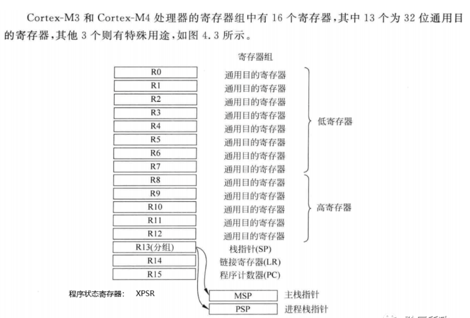

高优先级任务 **本来就能抢占**，但要靠调度点，调度点默认是**SysTick 中断（1ms）**，如果你在低优先级任务中主动 `taskYIELD()`，就是把调度点变得更密集了，**相当于“更快地释放 CPU 控制权”**


## 👇我们来一条一条看清楚：

### ✅ 互斥信号量（Mutex）有：

- **优先级继承机制**：当低优先级任务持有 Mutex，导致高优先级任务阻塞时，调度器会临时把低优先级任务的优先级“抬高”到高优先级任务的级别，让它尽快完成并释放资源。
- 设计目标就是用来**保护临界资源**，防止 **优先级翻转**。

### ❌ 二值信号量（Binary Semaphore）没有：

- 它只是个“通知机制”：一个任务释放，另一个任务去接收。
- **不会处理优先级翻转的问题**，因为它不是为“资源保护”设计的。
- 所以如果用它来保护资源，遇到优先级翻转就真的会卡住。


# HAL库和FreeRtos的时基

这个问题问得非常关键！很多人刚用 HAL + RTOS 时会搞混「HAL库的时间基准」和「FreeRTOS 的时间基准」，我来帮你直观解释一下👇

------

## 🧱 一、HAL 库的 Timebase 是什么？

### 👉 定义：

HAL 库中很多函数（例如 `HAL_Delay()`）需要一个“时间基准”，也就是一个「每 1ms 递增一次的全局时间计数器」。

默认情况下，这个时间基准是由 **SysTick** 定时器每 1ms 产生一次中断，通过回调函数 `HAL_IncTick()` 让 `uwTick` 变量自增。

### 🧩 作用：

- 给 HAL 库里的 `HAL_Delay()` 提供基础
- 提供给你访问时间的 `HAL_GetTick()`（返回 `uwTick`）

------

## 🔄 二、FreeRTOS 的 Timebase 是什么？

### 👉 定义：

FreeRTOS 也使用一个时基（Tick），这个 Tick 是 RTOS 的“心跳”。

- 通过 `vTaskDelay()`、`xSemaphoreTake(timeout)` 等函数控制任务的时间行为。
- RTOS 会通过 **SysTick 中断** 或别的定时器，每 1ms 触发一次中断，执行 `xPortSysTickHandler()`，更新调度器的时间。

------

## ⚠️ 三、两者的冲突与融合

当你用 **FreeRTOS + HAL** 一起时：

### 默认冲突：

- HAL 也想用 SysTick 定时中断；
- FreeRTOS 也要用它调度任务；
- 两个系统都想“抢 SysTick”，所以会打架。

### ✅ 解决方式：让 **FreeRTOS 负责 SysTick**，HAL 借用它！

HAL 提供了一个**适配方式**，允许你重定向 HAL 的 Tick 实现，让它使用 FreeRTOS 的 tick（即 `xTaskGetTickCount()`）。

你只需要在 `stm32f4xx_hal_timebase_tim.c` 或自定义的时间基准文件中，做如下处理（通常是 HAL 自带）：

```c
uint32_t HAL_GetTick(void)
{
    return (uint32_t)xTaskGetTickCount();  // 使用 FreeRTOS 的 tick 计数
}
```

这样，HAL 就不再用自己的 SysTick，而是“蹭用”FreeRTOS 的 Timebase。

------

## 🧠 总结对比表：

| 项目     | HAL Timebase                                  | FreeRTOS Timebase                      |
| -------- | --------------------------------------------- | -------------------------------------- |
| 作用     | 支撑 HAL 延时和 `HAL_GetTick()`               | 控制任务调度和时间行为                 |
| 默认来源 | SysTick 中断 + `HAL_IncTick()`                | SysTick 中断 + `xPortSysTickHandler()` |
| 单位     | 毫秒（通常 1ms）                              | 毫秒（取决于 configTICK_RATE_HZ）      |
| 兼容方式 | 重写 `HAL_GetTick()` 为 `xTaskGetTickCount()` | FreeRTOS 管控 Tick，HAL 借用           |

------

如果你想用 `HAL_Delay()`，记得确保 HAL 的 tick 已经和 RTOS 的 tick 联动，否则会卡死。

但是共有会存在风险，选择一个定时器作为HAL库的时基

# 时基

时基就是延时函数实现的计数器

正点原子的中断函数里面让uwtick和rtos的计数值都增加

```c
//systick中断服务函数,使用OS时用到
void SysTick_Handler(void)

{  

  if(xTaskGetSchedulerState()!=taskSCHEDULER_NOT_STARTED)//系统已经运行

  {

​    xPortSysTickHandler();  //RTOS计数值++

  }

  HAL_IncTick();//uwTick++;

}


```

```c
//初始化延迟函数

//当使用ucos的时候,此函数会初始化ucos的时钟节拍

//SYSTICK的时钟固定为AHB时钟

//SYSCLK:系统时钟频率

void delay_init(u8 SYSCLK)

{

  u32 reload;

  HAL_SYSTICK_CLKSourceConfig(SYSTICK_CLKSOURCE_HCLK);//SysTick频率为HCLK

  fac_us=SYSCLK;              //不论是否使用OS,fac_us都需要使用

  reload=SYSCLK;              //每秒钟的计数次数 单位为K   

  reload*=1000000/configTICK_RATE_HZ;   //根据configTICK_RATE_HZ设定溢出时间

    //reload为24位寄存器,最大值:16777216,在180M下,约合0.745s左右  

  fac_ms=1000/configTICK_RATE_HZ;     //代表OS可以延时的最少单位   

  SysTick->CTRL|=SysTick_CTRL_TICKINT_Msk;//开启SYSTICK中断

  SysTick->LOAD=reload;          //每1/configTICK_RATE_HZ断一次  

  SysTick->CTRL|=SysTick_CTRL_ENABLE_Msk; //开启SYSTICK

}       
```

HAL和RTOS的延时本质上是定时器产生固定周期的中断，在中断里面对两个Tick计数，根据Tick延时

正点原子的延时函数是根据systick的硬件计数值实现的

在启用了RTOS的情况下，在正点原子的延时函数初始化里会根据定义的configTICK_RATE_HZ（滴答中断的频率）来设置SYSTICk定时器。

默认情况下是1ms SYSTICK发生一次中断，在中断里面uwtick和RTOS计数值加1，rtos里面的延时是基于RTOS计数值的，不是uwTick。

HAL库的延时是基于uwTick的。所以，如果初始化SYSTICK的中断不为1ms，那么uwTick的增加就不是1ms一次，HAL_Delay(1)也不是1ms；

RTOS计数值加就不是1ms一次，rtos里面的延时函数也不会是1ms

总结：

在移植时会把SYSTICK的频率改为RTOS要的，不改变HAL时基的话（改变时基在TIM定时器中断里增加uwtick)，HAL的延时时间会和RTOS一样

如果RTOS里面规定10ms一次中断，HAL_Delay(1)一次10ms，所以要改变HAL的时基，防止HAL错乱，比如 `HAL_Delay(1)` 实际就是 10ms，会影响 HAL 驱动（USB、UART DMA 超时之类的，驱动函数里面调用HAL_Delay()）。这种情况 **必须把 HAL 的时基迁到 TIM**。

# 优先级

## Cortex-M 硬件中断优先级

cortex-m处理器有   每个中断    都有8位的优先级寄存器，这些寄存器可以每4个看作一个32位的寄存器来访问

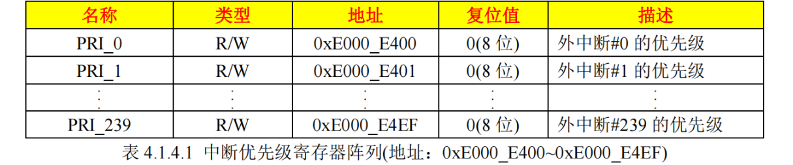


特殊例子

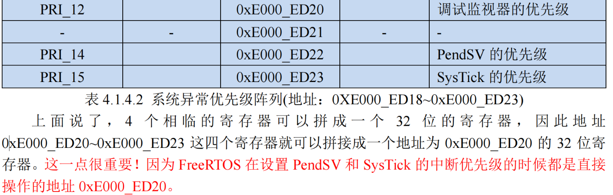

根据SCB里面的AIRCR寄存器，可以将8位优先级进行分组，也就是划分抢占优先级和子优先级

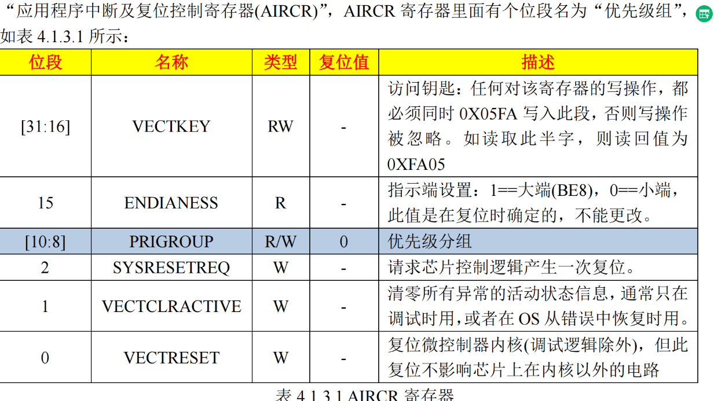

可以看见，抢占优先级最多是7位，子优先级最少有1位，bit0是子优先级	

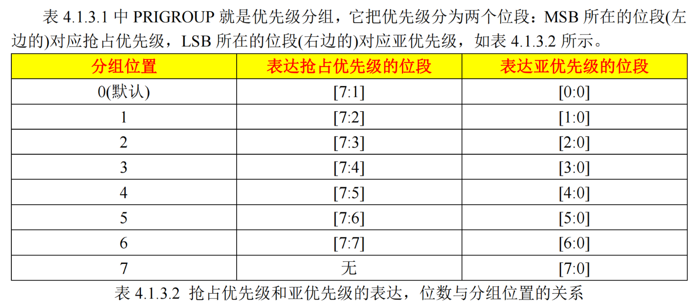

芯片厂家不会全部用，8位优先级只会用一部分，比如用3位

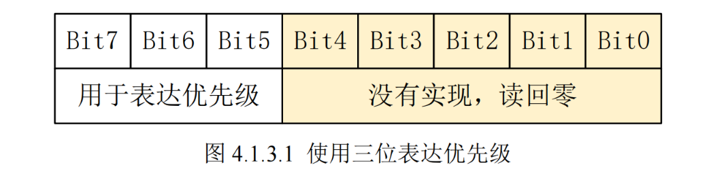

STM32使用的是4位优先级，是高位，bit7-4，可以全为抢占或者 子优先级，一共有5组，0-4；第四组全是抢占优先级，是freeRTOS要的

第四组一共有16位抢占优先级，使用起来简单

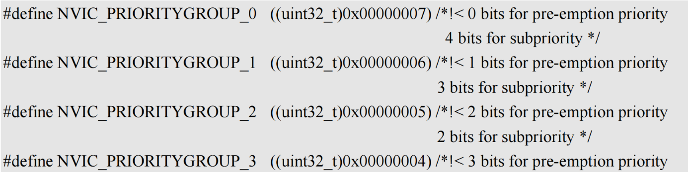

## FreeRTOS 任务优先级

```
//任务优先级
#define INTERRUPT_TASK_PRIO   2
```

范围：`0 ~ (configMAX_PRIORITIES-1)`，纯粹是软件定义的整数。

含义：谁能先占 CPU 时间片。

内核调度器用 **数字大小** 直接比较决定：大 → 优先级高。

和硬件中断没有直接关系。

# 中断屏蔽

## PRIMASK寄存器

禁止除了NMI和HardFalut外的所有中断

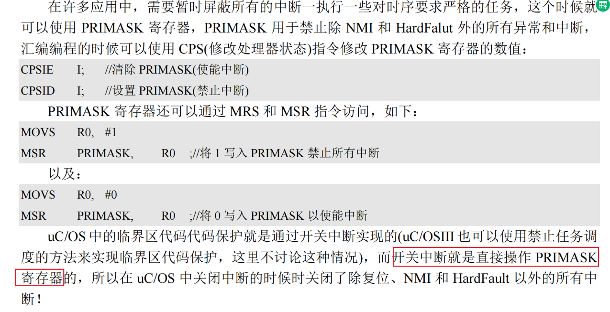

## FAULTMASK寄存器

在PEIMASK寄存器的基础上屏蔽掉HardFault中断，写0使能，1禁止

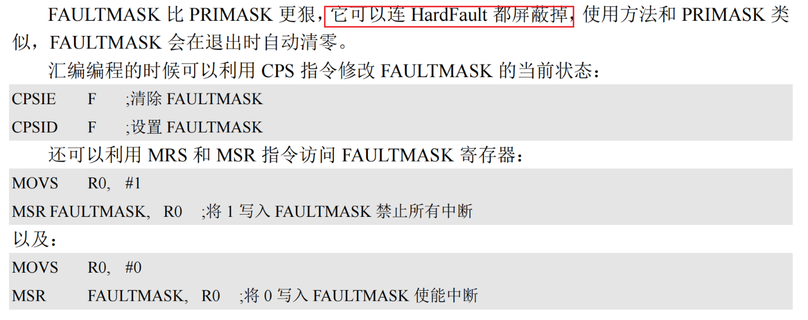

## BASEPRI寄存器

屏蔽中断，低于设定的优先级，写1使能，0禁止	  

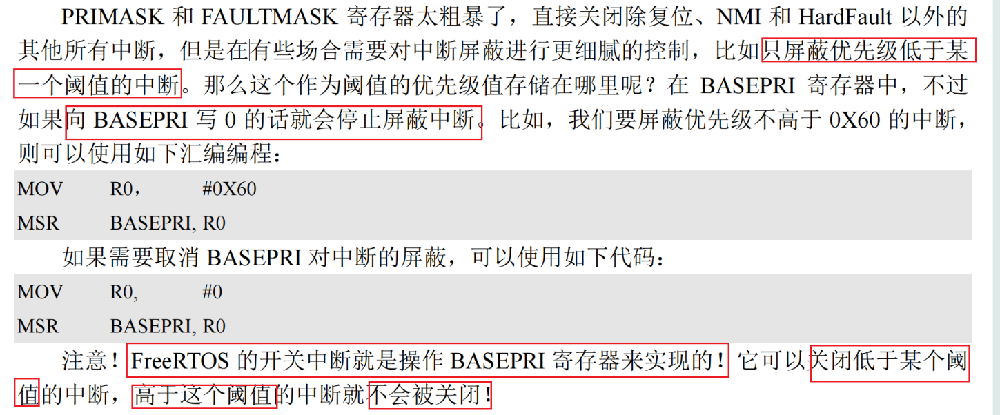

## freertos中断配置宏

在 **Cortex-M 内核** 里：

- **数字越小，优先级越高**。
   例如：
  - 优先级 0 → 最高
  - 优先级 5 → 比较低
  - 优先级 15 → 最低

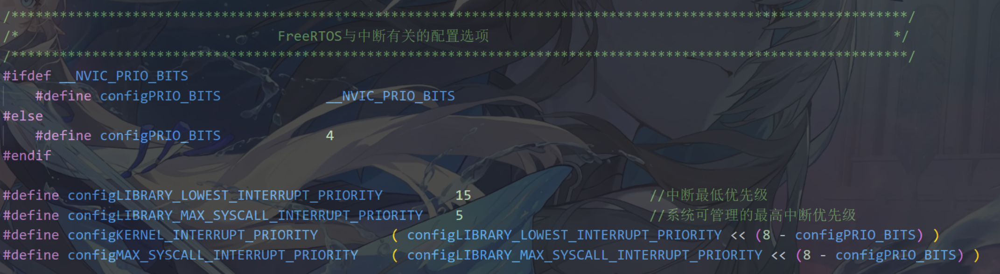

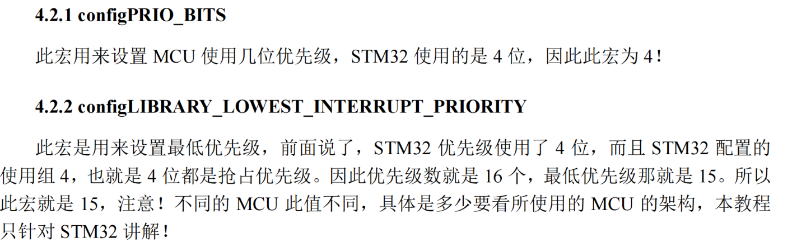

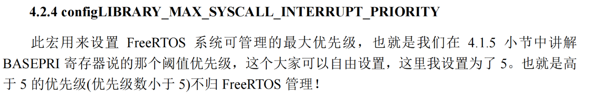

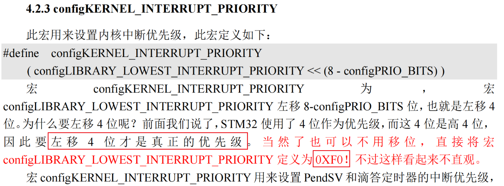

config_MAX_SYSCALL_INTERRUPT_PRIORITY左移的原因和上面一样，STM32用高4位来表示，现在的值是低4位的

这是一个“分界线”：

- **优先级数字 ≥ 这个值的中断** → 允许调用 FreeRTOS 的 ISR API（带 `FromISR` 后缀的）。
- **优先级数字 < 这个值的中断** → 不允许调用 FreeRTOS API。

FreeRTOS 把能在中断里调用的函数都加了 `FromISR` 后缀：

- 例如：
  - `xQueueSendFromISR()`：在中断里往队列发数据。
  - `xSemaphoreGiveFromISR()`：在中断里释放信号量。
  - `xTaskNotifyFromISR()`：在中断里发任务通知。

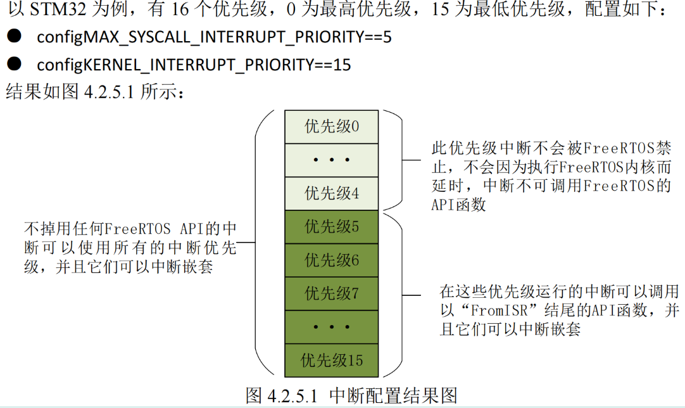

当进入临界段的时候，我们不希望当前干的事被打扰，会开启中断屏蔽，5以下的优先级会被屏蔽，也就是不会响应。正因为如此，也就是说这些函数里面可以调用RTOS的API，反正进入临界段后会被屏蔽。

而5以上的中断不会被屏蔽，为了保证进入临界区发生这些中断时RTOS不会被打断：在RTOS的任务里面发生中断，中断再次调用RTOS来改变他自己的状态。所以5以上的中断函数里面不能有RTOS的API


> **RTOS 的临界区不是“禁止所有中断”，
>  而是：
>  “我只保证我管得住的中断不会来捣乱。”**

> **你让“我管不住的中断”来调用我，
>  那我只能崩给你看。**

## 开关中断

BASEPRI寄存器关键点：
 👉 只要 `BASEPRI != 0`，它就生效了，不需要什么“额外使能”。

一个写入0，关闭BASEPRI,不再屏蔽中断

一个写入config_MAX_SYSCALL_INTERRUPT_PRIORITY屏蔽分界线（经过移位过的）,STM32的优先级8位寄存器是高4位有效，要左移4位

<font color='red'>进入和退出临界区函数也会调用这两个函数，只不过多了点内容</font>，所以临界区函数是开关中断函数的再封装，支持嵌套

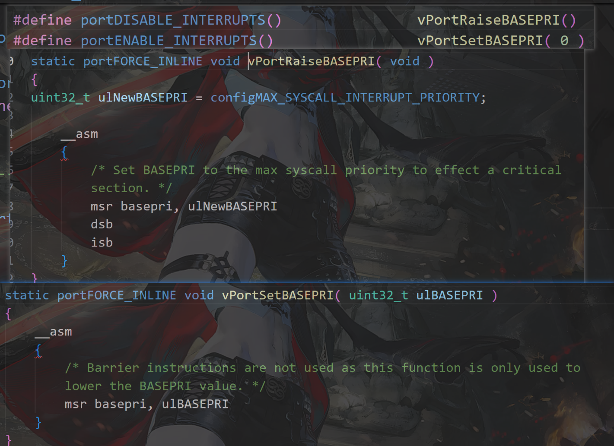

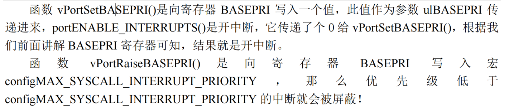

## 普通任务临界区保护

定义的宏最终会调用下面两个函数

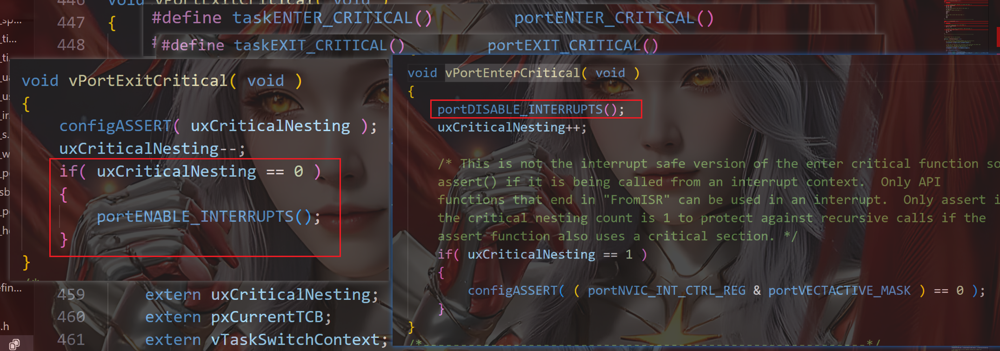

进入临界区会先使用BASEPRI寄存器关闭中断，然后计数当前嵌套进入的临界区数量。

退出的时候会判断退出后是不是完全脱离临界区，完全出来才会开屏蔽中断

临界区的代码不要太多，不然被屏蔽的中断得不到及时响应

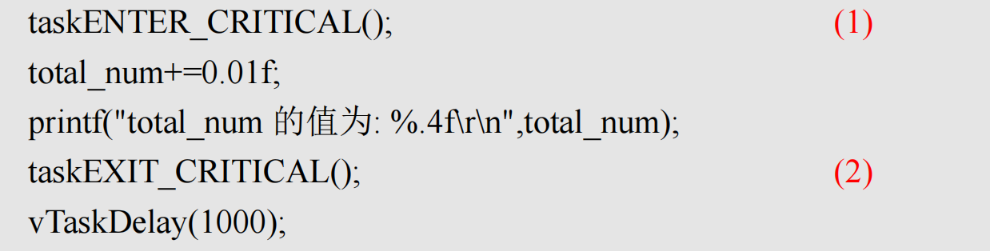

## 中断临界区保护

首先明确一点，在中断里面调用了rtos临界区保护的API，那么它的优先级一定是可被屏蔽的

进入临界区，保存BASEPRI的现场，并且重新给BASEPRI寄存器设置分界值，返回的是保存的BASEPRI寄存器的现场

退出临界区，BASEPRI恢复到保存的值


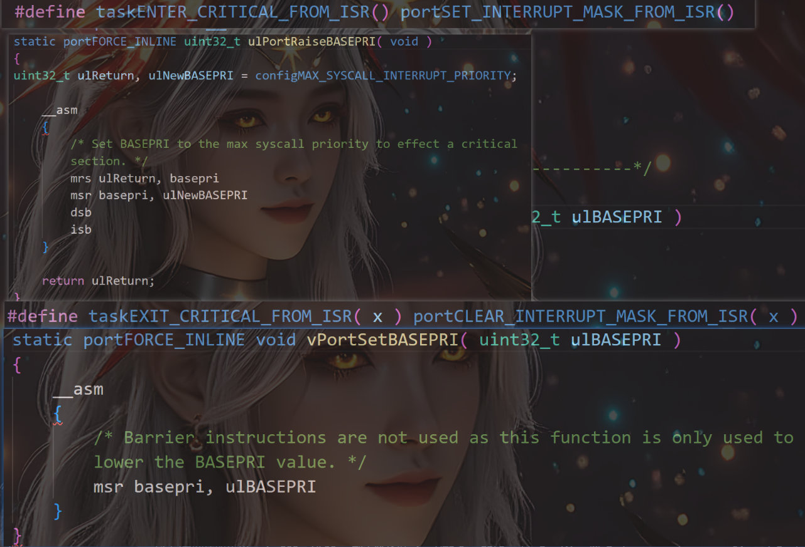


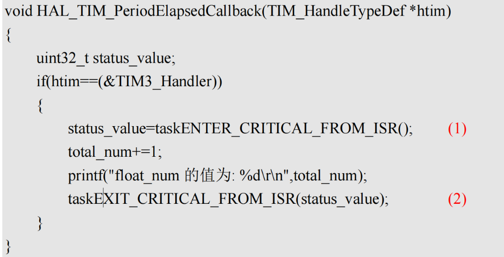

## 对比两种临界区退出

```TXT
FreeRTOS 的设计哲学是：
内核假设：FreeRTOS 规定，所有常规任务在正常运行时，BASEPRI 必须为 0（即中断全开）。

- 任务上下文：完全由内核管理，假设它进入临界区之前 BASEPRI=0（即中断全开）。
  - 所以退出时只需要恢复到 `0`，不需要保存/恢复。
  - 如果有人在任务里直接乱动 `BASEPRI`，那就是用户错误（破坏了内核假设）。
- 中断上下文：FreeRTOS 不敢假设 ISR 里 BASEPRI 一定是 0，可能用户或别的库动过。
  - 所以必须保存现场并恢复。
  
```

普通函数退出临界区时直接清零BASEPRI恢复中断

任务是 FreeRTOS 控制的执行环境，不会有人在任务里乱改 `BASEPRI`。

所以进入前，`BASEPRI` 要么就是 `0`，要么就是 FreeRTOS 自己设置的。

退出时直接清零 = 把系统还原到“正常任务运行环境”。


中断函数退出临界区时保存现场恢复BASEPRI旧值

中断里不受 FreeRTOS 完全管控，应用代码可能自己写了

```C
__set_BASEPRI(0x60); // 自己屏蔽某些中断
```

例子

```c
//任务
void Task(void *pvParameters)
{
    taskENTER_CRITICAL(); // BASEPRI=0x40
    {
        // 操作关键数据
    }
    taskEXIT_CRITICAL();  // BASEPRI=0 （因为任务环境本来就是全开）
}

//中断
void MyISR_Handler(void)
{
    __set_BASEPRI(0x60);       // 屏蔽了比0x60代表的优先级还在后面的中断，即优先级数比0X60大的中断。
    uint32_t old = ulPortRaiseBASEPRI(); // FreeRTOS 提升到 0x40
    {
        // 内核临界区操作
    }
    vPortSetBASEPRI(old);      // 恢复=0x60，尊重用户的设定
}

```

思考：当前中断任务的优先级是怎样的？

假设当前优先级是0X80（优先级数越小越先执行），设置了一个比当前大的优先级0x60

当前 ISR（0x80）已经在执行，不会被自己屏蔽掉。

但是其他优先级在后面的中断（例如 0x70）会被屏蔽。

更前面优先级的 ISR（例如 0x40）还是能打断它。

如果优先级是0x50,比手动设置的屏蔽优先级0x60高， 就只有下面的作用 

__set_BASEPRI(0x60);这个的目的是在当中断结束后不希望0x60以下的中断来占用

# 任务基础

## 前后台系统（单任务系统）

在使用单片机裸机开发的时候，无限循环里面的函数就相当于后台，中断就相当于前台。

前后台系统相当于所有任务优先级都是相同的，都排队轮流执行，但是简单，资源消耗少

## 多任务系统

freertos的任务调度器

先执行中断，再执行优先级高的任务

RTOS里面并不是并发执行任务，即同一时刻执行多个任务，每一时刻只能有一个任务执行，每个任务时间都很短，看起来像并发执行

每个任务都有自己的运行环境，不依赖于其他任务和调度器。

所以<span style="color: red;">每次退出任务时候</span>，调度器都要保证退出这个任务的时候将堆栈内容，寄存器值等上下文环境保存好，由此引出了每个任务都有的堆栈。这样子的话<font color='red'>当再次执行这个任务的时候</font>就从堆栈里面取出环境，恢复运行	

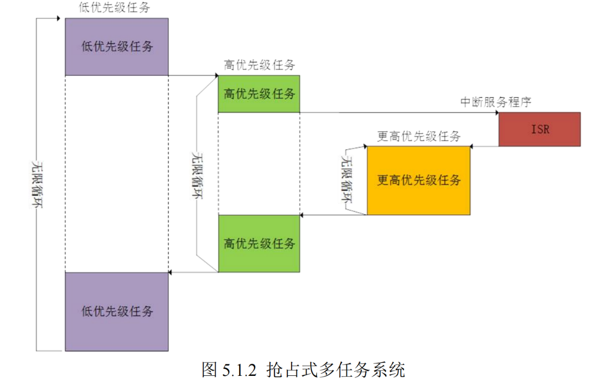

## 任务状态

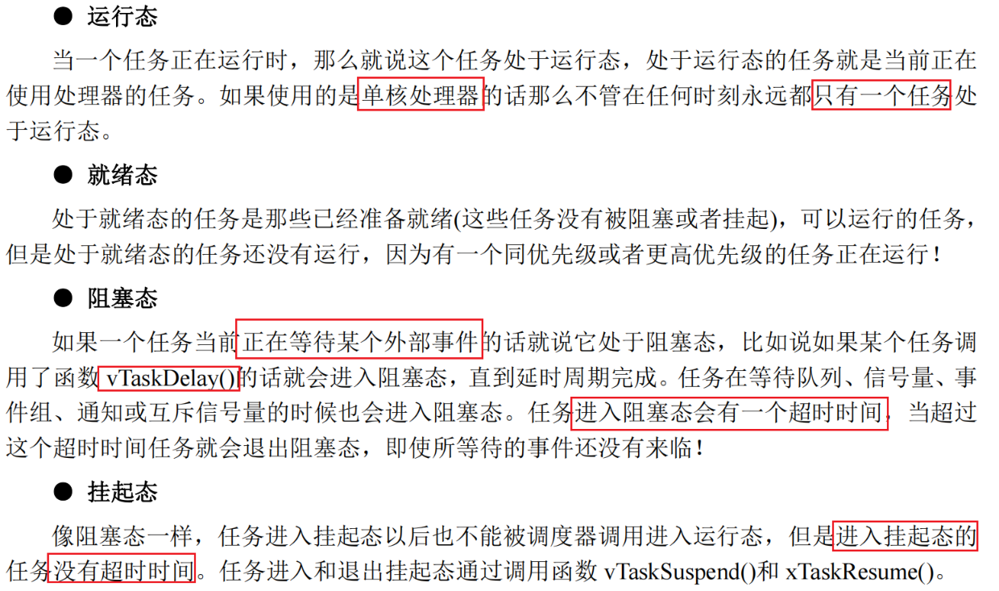

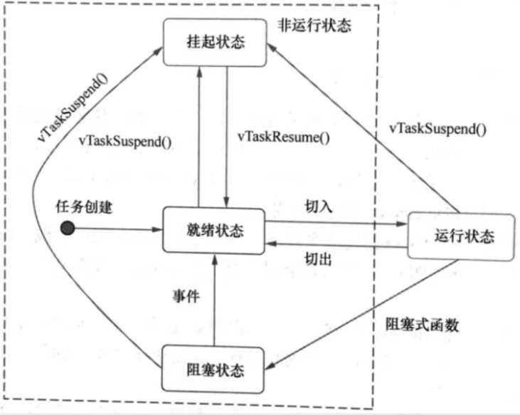

## 任务优先级

从0到configMAX_PRIORITIES-1，数字越高，优先级越高，和中断优先级相反

下面的设置为1之后configMAX_PRIORITIES不能超过32，但是最好不要设置32，会增大开销，根据需求来设置

```c
#define configUSE_PORT_OPTIMISED_TASK_SELECTION 1            
//1启用特殊方法来选择下一个要运行的任务

//一般是硬件计算前导零指令，如果所使用的

//MCU没有这些硬件指令的话此宏应该设置为0！
```

开启<font color='orange'>时间片</font>之后可以定义<font color='green'>多个优先级一样</font>的任务，就绪态任务按照<font color='cyan'>时间片轮转来公平得到CPU</font>，不然的话相同优先级下的任务得到CPU时间不一样

```c
#define configUSE_TIME_SLICING          1            //1使能时间片调度(默认式使能的)
#define configUSE_PREEMPTION					1                       //1使用抢占式内核，0使用协程
```

## 任务控制块

任务控制块中<font color='red'>包含了指向任务堆栈的指针</font>

每个任务都有一些属性要存储，freertos把这些属性一起用一个结构体来表示，在创建任务的时候就会分配给任务

pxTopOfStack：栈顶指针，<font color='red'>任务切换</font>时用于保存/恢复上下文

pxStack：栈起始地址，用于<font color='red'>内存管理</font>

xStateListItem：将任务连接到状态列表（就绪、阻塞、挂起）

xEventListItem：将任务连接到事件列表（如队列、信号量）

uxPriority：任务优先级，决定调度顺序

pcTaskName：任务名称，便于调试识别

```c

/*

 * 任务控制块。每个任务都会分配一个任务控制块（TCB），

 * 用于存储任务状态信息，包括指向任务上下文（任务的运行时环境，包括寄存器值）的指针
   */
   typedef struct tskTaskControlBlock
   {
   volatile StackType_t	*pxTopOfStack;	/*< 指向任务栈中最后放置项的位置。这必须是TCB结构体的第一个成员。*/

   #if ( portUSING_MPU_WRAPPERS == 1 )
   	xMPU_SETTINGS	xMPUSettings;		/*< MPU设置由端口层定义。这必须是TCB结构体的第二个成员。*/
   #endif

   ListItem_t			xStateListItem;	/*< 状态列表项，用于表示任务的状态（就绪、阻塞、挂起）。*/
   ListItem_t			xEventListItem;		/*< 用于从事件列表中引用任务。*/
   UBaseType_t			uxPriority;			/*< 任务的优先级。0是最低优先级。*/
   StackType_t			*pxStack;			/*< 指向堆栈的起始位置。*/
   char				pcTaskName[ configMAX_TASK_NAME_LEN ];/*< 创建任务时给出的描述性名称。仅用于调试。*/

   #if ( portSTACK_GROWTH > 0 )
   	StackType_t		*pxEndOfStack;		/*< 在堆栈从低内存向上增长架构中，指向堆栈的末端。*/
   #endif

   #if ( portCRITICAL_NESTING_IN_TCB == 1 )
   	UBaseType_t		uxCriticalNesting;	/*< 保存关键段嵌套深度，用于不在端口层维护自己计数的端口。*/
   #endif

   #if ( configUSE_TRACE_FACILITY == 1 )
   	UBaseType_t		uxTCBNumber;		/*< 存储一个数字，每次创建TCB时递增。允许调试器确定任务何时被删除并重新创建。*/
   	UBaseType_t		uxTaskNumber;		/*< 专门供第三方跟踪代码使用的数字。*/
   #endif

   #if ( configUSE_MUTEXES == 1 )
   	UBaseType_t		uxBasePriority;		/*< 最后分配给任务的优先级 - 用于优先级继承机制。*/
   	UBaseType_t		uxMutexesHeld;		/*< 持有的互斥锁数量。*/
   #endif

   #if ( configUSE_APPLICATION_TASK_TAG == 1 )
   	TaskHookFunction_t pxTaskTag;		/*< 任务标签函数指针。*/
   #endif

   #if( configNUM_THREAD_LOCAL_STORAGE_POINTERS > 0 )
   	void *pvThreadLocalStoragePointers[ configNUM_THREAD_LOCAL_STORAGE_POINTERS ]; /*< 线程本地存储指针数组。*/
   #endif

   #if( configGENERATE_RUN_TIME_STATS == 1 )
   	uint32_t		ulRunTimeCounter;	/*< 存储任务在运行状态下花费的时间量。*/
   #endif

   #if ( configUSE_NEWLIB_REENTRANT == 1 )
   	/* 为此任务分配特定的Newlib可重入结构。
   	注意：Newlib支持因大众需求而被包含，但FreeRTOS维护者自己并不使用。
   	FreeRTOS不对由此产生的newlib操作负责。用户必须熟悉newlib
   	并提供必要存根的系统级实现。请注意（在撰写本文时）
   	当前的newlib设计实现了必须提供锁的系统级malloc()。*/
   	struct	_reent xNewLib_reent;		/*< Newlib可重入结构。*/
   #endif

   #if( configUSE_TASK_NOTIFICATIONS == 1 )
   	volatile uint32_t ulNotifiedValue;	/*< 任务通知值。*/
   	volatile uint8_t ucNotifyState;		/*< 任务通知状态。*/
   #endif

   /* 参见tskSTATIC_AND_DYNAMIC_ALLOCATION_POSSIBLE定义上方的注释。*/
   #if( tskSTATIC_AND_DYNAMIC_ALLOCATION_POSSIBLE != 0 )
   	uint8_t	ucStaticallyAllocated; 		/*< 如果任务是静态分配的，则设置为pdTRUE，以确保不会尝试释放内存。*/
   #endif

   #if( INCLUDE_xTaskAbortDelay == 1 )
   	uint8_t ucDelayAborted;				/*< 延迟是否被中止的标志。*/
   #endif

} tskTCB;

/* 旧的tskTCB名称在上面维护，然后在下面typedef为新的TCB_t名称，
以便使用较旧的内核感知调试器。*/
typedef tskTCB TCB_t;
```

## 任务堆栈

freertos能<font color='red'>恢复任务的运行</font>就是因为有任务堆栈，无论是任务调度还是中断，恢复任务的时候从堆栈中获取保存的变量，<font color='red'>接着上次离开的地方运行</font>

xTaskCreateStatic()和xTaskCreate()在创建任务时会创建堆栈，一个手动创建，一个自动创建

任务堆栈的数据类型，创建堆栈时在函数中传入的是堆栈的指针StackType_t*

```c
#define portSTACK_TYPE  uint32_t

typedef portSTACK_TYPE StackType_t;
```


注意：实际分配的堆栈大小是我们手动设置数值的<font color='red'>4倍</font>,<font color='red'>StackType_t是4字节</font>

```c


// 在 tasks.c 中的 xTaskCreate 函数内部
StackType_t *pxStack;

/* 为任务堆栈分配内存 */
pxStack = pvPortMalloc( ( ( ( size_t ) usStackDepth ) * sizeof( StackType_t ) ) );

```

## 任务创建

### 动态创建

```c
BaseType_t xTaskCreate(
    TaskFunction_t pxTaskCode,    // 【任务函数指针】任务要执行的函数
    const char * const pcName,    // 【任务名称】用于调试识别的字符串
    const uint16_t usStackDepth,  // 【堆栈深度】以字(word)为单位的堆栈大小
    void * const pvParameters,    // 【任务参数】传递给任务函数的参数指针
    UBaseType_t uxPriority,       // 【任务优先级】数值越大优先级越高
    TaskHandle_t * const pxCreatedTask // 【任务句柄】用于引用和管理任务的指针
)
    
// 创建LED闪烁任务
xTaskCreate(ledTask,          // 任务函数
           "LED Controller",  // 任务名
           128,               // 堆栈大小128字 = 512字节
           NULL,              // 无参数
           2,                 // 优先级2
           &ledHandle);       // 保存任务句柄
```

1. **pxTaskCode**：任务入口函数，任务实际要执行的代码，传入函数指针类型参数
2. **pcName**：任务标识名，调试时便于区分不同任务
3. **usStackDepth**：任务堆栈大小（单位是4字节的字）
4. **pvParameters**：传递给任务的参数，任务函数通过此参数接收数据
5. **uxPriority**：优先级（0 = 最低，configMAX_PRIORITIES-1 = 最高
6. **pxCreatedTask**：输出参数，返回创建的任务句柄，用于后续操作该任务,这个<font color='orange'>句柄就是指向任务控制块的指针</font>，其他API可能会用到
7. 创建成功返回pdpass，值是1；失败就返回其他值

参数<font color='red'>址传递</font>

这里传入的是句柄的地址，是二重指针，是为了在函数中对指针的地址进行取值（*），改变这个指针的指向

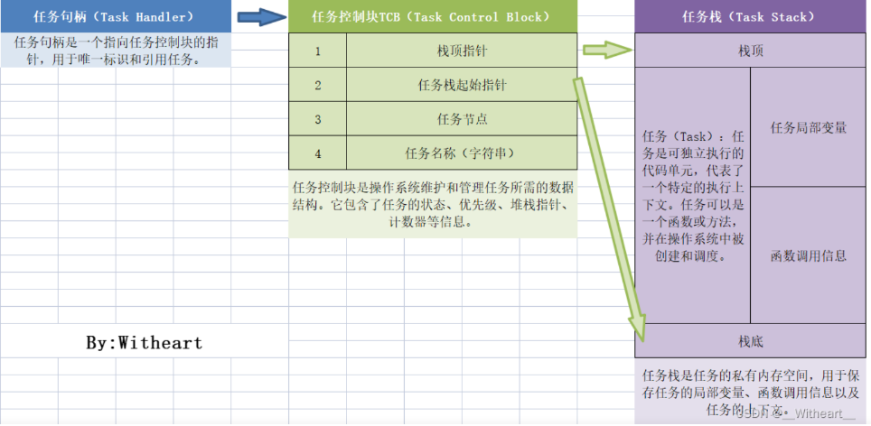

问题：怎么没看见TCB？TCB和任务堆栈是什么关系

TCB和任务堆栈在函数内部自动<font color='red'>分别</font>被分配内存，只不过任务堆栈要用户显式指定大小

### 静态创建

使用之前要

```c
// 必须在 FreeRTOSConfig.h 中启用：
// 场景1：无动态内存的系统（禁用heap）
#define configSUPPORT_STATIC_ALLOCATION 1
#define configSUPPORT_DYNAMIC_ALLOCATION 0

// 场景2：硬实时要求，避免malloc不确定性
// 场景3：内存受限，需要精确控制内存布局
// 场景4：安全关键系统，避免内存碎片
```

```c
TaskHandle_t xTaskCreateStatic(
    TaskFunction_t pxTaskCode,          // 【任务函数】任务要执行的函数
    const char * const pcName,          // 【任务名称】用于调试的任务名
    const uint32_t ulStackDepth,        // 【堆栈深度】堆栈大小（以字为单位）
    void * const pvParameters,          // 【任务参数】传递给任务函数的参数
    UBaseType_t uxPriority,             // 【任务优先级】数值越大优先级越高
    StackType_t * const puxStackBuffer, // 【堆栈缓冲区】用户提供的堆栈内存
    StaticTask_t * const pxTaskBuffer   // 【TCB缓冲区】用户提供的TCB内存
)
```

前5个和动态创建一样，后面两个不一样，并且返回值是任务句柄


## 任务删除

参数是句柄，如果<font color='red'>任务是动态创建</font>的，删除后任务的堆栈和内存控制块会在<font color='red'>空闲任务中被删除</font>，所以要给空闲任务一点时间

任务是<font color='red'>静态创建</font>的或者用户在任务中<font color='red'>手动pvPortMalloc()申请</font>了内存，需要用户<font color='red'>调用vPortFree()函数</font>手动释放

静态创建的也要吗？你确定？

```c
vTaskDelete( TaskHandle_t xTaskToDelete )
```

## 空闲任务和定时器任务

这两个任务会被<font color='red'>内核调度器创建</font>，用户不用创建

如果静态的，configSUPPORT_STATIC_ALLOCATION==1，那么用户需要在main.c里面实现vApplicationGetIdleTaskMemory和vApplicationGetTimerTaskMemory，最后创建这两个任务的API会调用这个函数来获取内存

```c
//空闲任务任务堆栈

static StackType_t IdleTaskStack[configMINIMAL_STACK_SIZE];

//空闲任务控制块

static StaticTask_t IdleTaskTCB;

//定时器服务任务堆栈

static StackType_t TimerTaskStack[configTIMER_TASK_STACK_DEPTH];

//定时器服务任务控制块

static StaticTask_t TimerTaskTCB;

//获取空闲任务地任务堆栈和任务控制块内存，因为本例程使用的

//静态内存，因此空闲任务的任务堆栈和任务控制块的内存就应该

//有用户来提供，FreeRTOS提供了接口函数vApplicationGetIdleTaskMemory()

//实现此函数即可。

//ppxIdleTaskTCBBuffer:任务控制块内存

//ppxIdleTaskStackBuffer:任务堆栈内存

//pulIdleTaskStackSize:任务堆栈大小

void vApplicationGetIdleTaskMemory(StaticTask_t **ppxIdleTaskTCBBuffer, 

                  StackType_t **ppxIdleTaskStackBuffer, 

​                  uint32_t *pulIdleTaskStackSize)

{

  *ppxIdleTaskTCBBuffer=&IdleTaskTCB;

  *ppxIdleTaskStackBuffer=IdleTaskStack;

  *pulIdleTaskStackSize=configMINIMAL_STACK_SIZE;

}

//获取定时器服务任务的任务堆栈和任务控制块内存

//ppxTimerTaskTCBBuffer:任务控制块内存

//ppxTimerTaskStackBuffer:任务堆栈内存

//pulTimerTaskStackSize:任务堆栈大小

void vApplicationGetTimerTaskMemory(StaticTask_t **ppxTimerTaskTCBBuffer, 

                  StackType_t **ppxTimerTaskStackBuffer, 

                  uint32_t *pulTimerTaskStackSize)

{

  *ppxTimerTaskTCBBuffer=&TimerTaskTCB;

  *ppxTimerTaskStackBuffer=TimerTaskStack;

  *pulTimerTaskStackSize=configTIMER_TASK_STACK_DEPTH;

}
```

`vTaskStartScheduler()` 的任务是：

> 初始化系统 → 创建空闲任务和定时器任务 → 设置第一个运行任务 → 启动系统时钟中断 → 进入多任务调度状态。

**空闲任务（Idle Task）**

- 优先级最低，用来回收已删除任务的堆栈、执行低功耗钩子函数等。

**可选的定时器任务（Timer Service Task）**（如果启用了软件定时器）

- 优先级比较高，负责处理延时任务、超时事件。

### 思考

2个简单任务都是10ms执行一次，比起裸机开发是不是太慢了？大多数时间都在执行空闲任务？

```c
0ms: A 运行 → 延时 → 切换到 B
1ms~9ms: 其他任务就绪？没有 → Idle
10ms: Tick唤醒A（执行一次任务时间非常短,可忽略)
11ms~19ms: Idle
20ms: B唤醒...
void TaskA(void *p)
{
    for(;;)
    {
        printf("A\r\n");
        vTaskDelay(10); // 10ms
    }
}

void TaskB(void *p)
{
    for(;;)
    {
        printf("B\r\n");
        vTaskDelay(10);
    }
}


```

在 FreeRTOS 里：

- 当任务都在延时 (`vTaskDelay(10)`) 时，调度器不会空转；
- 它会切回 **Idle Task**；
- Idle 任务内部可以执行：
  - 系统维护（删除任务栈回收）；
  - 用户的 `vApplicationIdleHook()`；
  - 甚至让 MCU 进入低功耗（比如 `__WFI()`）。

也就是说：

> **FreeRTOS 并不是慢，而是让 CPU 在“有事干时全速干，没事时休眠”。**

```C
while (1)
{
    taskA();
    taskB();
}
```

如果主循环只花几十微秒，那它们每秒可能被执行 **几万次甚至几十万次**。

也就是说：

> 裸机循环“什么都干不了太多事”，但调用频率极高
>
> 裸机那种“疯狂轮询”的方式虽然次数多，但 CPU 一直忙、难扩展、功耗高。

## 任务挂起与恢复

vTaskSuspend

vTaskResume

xTaskResumeFromISR：在中断中恢复任务

```c
//key任务函数

void key_task(void *pvParameters)

{

  u8 key;

  while(1)

  {

​    key=KEY_Scan(0);

​    switch(key)

​    {

​      case WKUP_PRES:

​        vTaskSuspend(Task1Task_Handler);//挂起任务1

​        printf("挂起任务1的运行!\r\n");

​        break;

​      case KEY1_PRES:

​        vTaskResume(Task1Task_Handler); //恢复任务1

​        printf("恢复任务1的运行!\r\n");

​        break;

​      case KEY2_PRES:

​        vTaskSuspend(Task2Task_Handler);//挂起任务2

​        printf("挂起任务2的运行!\r\n");

​        break;

​    }

​    vTaskDelay(10);     //延时10ms 

  }

}


void EXTI3_IRQHandler(void)
{
	BaseType_t YieldRequired;
	
	delay_xms(50);						//消抖
	if(KEY0==0)
	{
		YieldRequired=xTaskResumeFromISR(Task2Task_Handler);//恢复任务2
		printf("恢复任务2的运行!\r\n");
		if(YieldRequired==pdTRUE)
		{
			/*如果函数xTaskResumeFromISR()返回值为pdTRUE，那么说明要恢复的这个
			任务的任务优先级等于或者高于正在运行的任务(被中断打断的任务),所以在
			退出中断的时候一定要进行上下文切换！*/
			portYIELD_FROM_ISR(YieldRequired);
		}
	}
	__HAL_GPIO_EXTI_CLEAR_IT(GPIO_PIN_3);	//清除中断标志位
}


```


```c
#define portYIELD_FROM_ISR(x) if(x != pdFALSE) portNVIC_INT_CTRL_REG = portNVIC_PENDSVSET_BIT
最终等价于
if (x != pdFALSE)
{
    SCB->ICSR |= SCB_ICSR_PENDSVSET_Msk;
}
手动触发一次 PendSV 异常（即“系统请求一次任务切换”）

```

也就是说：

> `portYIELD_FROM_ISR()` → 触发 PendSV → FreeRTOS 切换任务

PendSV（**Pendable Service Call**）是 ARM Cortex-M 专门留给操作系统做上下文切换的中断。
 FreeRTOS 的 `xPortPendSVHandler()` 里实现了**保存当前任务栈、切换任务栈、恢复新任务**的逻辑。

### 思考

 这里为什么要手动切换任务？RTOS检测不到有高优先级的任务激活了吗？<font color='red'>中断结束后为了快一点执行激活的高优先级任务</font>，而不是等待任务调度点位

在 **任务模式** 下，FreeRTOS 会自动检测并切换任务。<font color='red'>本质是PendSV中断</font>，详见任务切换
 自动调度通常发生在：

1. **任务主动让出 CPU**：比如调用 `vTaskDelay()`、`vTaskSuspend()`；
2. **Tick 中断到来**：FreeRTOS 的 SysTick 定时器每 1ms 触发调度检查。<font color='red'>1ms可以执行很多代码了</font>

> ✅ 在这两种情况下，内核有“控制权”，它能主动判断哪个任 务优先级高，然后切换。


中断（ISR）是 **硬件打断 CPU 流程** 的，
 FreeRTOS **不会、也不能**去自动感知中断里发生了什么。

> 因为中断是“裸奔”的，CPU 硬件直接跳过去执行 ISR，
>  RTOS 的调度器在中断期间是暂停的。


RTOS 只是“知道”Task2 应该运行，但 **此时还在中断上下文中**，
 它不能立刻执行任务切换（因为中断还没退出）。

所以，RTOS 把决定权交给你：
 **你来决定是否在中断退出时立刻触发调度。**


portYIELD_FROM_ISR()这个函数，就是说

> “中断一退出，赶紧切换到高优先级任务！”

如果你不调用它，

> 那就会等到 **下一个 Tick 中断** 才触发任务切换。
>  也就是说高优先级任务要“晚一点”才运行。

# 表

## 列表

列表和列表项作为数据结构，都是结构体封装，<font color='red'>列表里面包含列表项</font>这个类型的变量而已

列表被用来跟踪FreeRTOS中的任务

用户可以在f`reeRTOSConfig.h` 中自定义：configLIST_VOLATILE

正点原子给的是空

```c


// 选项1：使用 volatile（推荐用于多数情况）
#define configLIST_VOLATILE volatile


// 选项2：空定义（如果确认不需要或编译器足够智能）
#define configLIST_VOLATILE 


// 选项3：针对特定编译器的扩展
#define configLIST_VOLATILE __volatile__
```

列表结构体

```c
typedef struct xLIST
{
  listFIRST_LIST_INTEGRITY_CHECK_VALUE         /*< 如果 configUSE_LIST_DATA_INTEGRITY_CHECK_BYTES 设为 1，则设置为已知值，用于数据完整性检查。 */

  configLIST_VOLATILE UBaseType_t uxNumberOfItems;  /*< 列表中当前包含的列表项数量 */

  ListItem_t * configLIST_VOLATILE pxIndex;      /*< 用于遍历列表的指针。指向最后一次调用 		  listGET_OWNER_OF_NEXT_ENTRY() 返回的列表项。 */

  MiniListItem_t xListEnd;               /*< 包含最大可能值的迷你列表项，意味着它始终位于列表末尾，因此用作结束标记。 */
    
  listSECOND_LIST_INTEGRITY_CHECK_VALUE        /*< 如果 configUSE_LIST_DATA_INTEGRITY_CHECK_BYTES 设为 1，则设置为已知值，用于数据完整性检查。 */

} List_t;
```

1. uxNumberOfItems

- **作用**：记录列表中当前有效的列表项数量
- **示例**：如果有3个任务在就绪列表中，这个值就是3

2. **pxIndex**  ：列表遍历指针，用于实现轮询调度         <font color='red'>列表项</font>类型

- **工作机制**：指向下一个将被执行的列表任务，当该任务被执行时，指向再下一个任务，到达列表底部后会

从头开始

```c
// 当调度器需要选择下一个任务时：
ListItem_t *pxNextItem = listGET_OWNER_OF_NEXT_ENTRY(pxList);
// pxIndex 会指向上次选择的项，下次从它的下一项开始
```

3. xListEnd            <font color='red'>迷你列表项</font>类型

- **作用**：列表的结束标记，是一个特殊的"哨兵"节点
- **特点**：
  - 值设置为最大可能值（portMAX_DELAY）
  - 始终位于列表末尾
  - 确保列表遍历能够正确终止

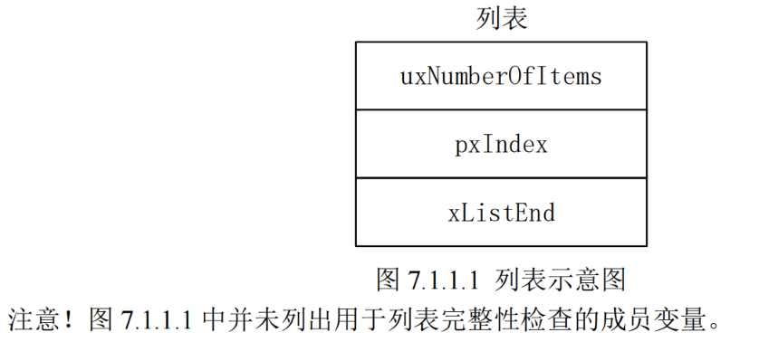


## 列表项

```c
/*

 * 定义列表能够包含的唯一对象类型。
   */
   struct xLIST_ITEM
   {
   listFIRST_LIST_ITEM_INTEGRITY_CHECK_VALUE			/*< 如果 configUSE_LIST_DATA_INTEGRITY_CHECK_BYTES 设为 1，则设置为已知值，用于数据完整性检查。 */

   configLIST_VOLATILE TickType_t xItemValue;			/*< 列表项的值。在大多数情况下，这个值用于按降序对列表进行排序。 */

   struct xLIST_ITEM * configLIST_VOLATILE pxNext;		/*< 指向列表中下一个 ListItem_t 的指针。 */

   struct xLIST_ITEM * configLIST_VOLATILE pxPrevious;	/*< 指向列表中前一个 ListItem_t 的指针。 */

   void * pvOwner;										/*< 指向包含此列表项的对象（通常是 TCB）的指针。因此，在包含列表项的对象和列表项本身之间存在双向链接。 */

   void * configLIST_VOLATILE pvContainer;				/*< 指向此列表项所在列表的指针（如果有的话）。 */

   listSECOND_LIST_ITEM_INTEGRITY_CHECK_VALUE			/*< 如果 configUSE_LIST_DATA_INTEGRITY_CHECK_BYTES 设为 1，则设置为已知值，用于数据完整性检查。 */
   };

typedef struct xLIST_ITEM ListItem_t;					/* 由于某些原因，lint 希望这是两个独立的定义。 */
```

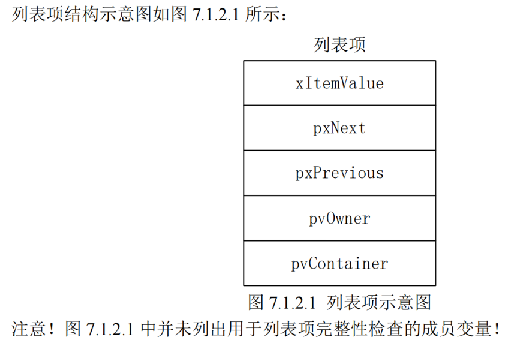


## 迷你列表项

```c
struct xMINI_LIST_ITEM

{

  listFIRST_LIST_ITEM_INTEGRITY_CHECK_VALUE      /*< Set to a known value if configUSE_LIST_DATA_INTEGRITY_CHECK_BYTES is set to 1. */

  configLIST_VOLATILE TickType_t xItemValue;

  struct xLIST_ITEM * configLIST_VOLATILE pxNext;

  struct xLIST_ITEM * configLIST_VOLATILE pxPrevious;

};

typedef struct xMINI_LIST_ITEM MiniListItem_t;
```

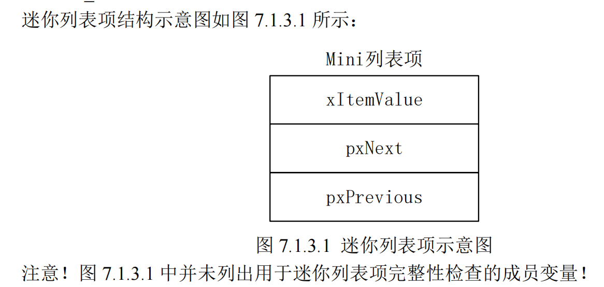

## 列表初始化


```c
/*
 * 初始化一个列表结构
 * pxList: 要初始化的列表指针
 */
void vListInitialise( List_t * const pxList )
{
  /* 列表结构包含一个用于标记列表结束的列表项（xListEnd）。
     初始化列表时，将列表结束项作为唯一的列表条目插入。 */

  /* 将 pxIndex 指向列表结束项 */
  pxList->pxIndex = ( ListItem_t * ) &( pxList->xListEnd );      /*lint !e826 !e740 使用迷你列表结构作为列表结束以节省RAM。这是经过检查且有效的。 */

  /* 列表结束项的值为列表中可能的最高值，确保它始终位于列表的末尾。
     在 FreeRTOS 中，portMAX_DELAY 通常是最大的 TickType_t 值 */
  pxList->xListEnd.xItemValue = portMAX_DELAY;

  /* 列表结束项的前向和后向指针都指向自身，这样我们就知道列表是空的。
     这是一个经典的空双向链表设计： */
  pxList->xListEnd.pxNext = ( ListItem_t * ) &( pxList->xListEnd );  /*lint !e826 !e740 使用迷你列表结构作为列表结束以节省RAM。这是经过检查且有效的。 */
  pxList->xListEnd.pxPrevious = ( ListItem_t * ) &( pxList->xListEnd );/*lint !e826 !e740 使用迷你列表结构作为列表结束以节省RAM。这是经过检查且有效的。 */

  /* 初始化列表项数量为 0 */
  pxList->uxNumberOfItems = ( UBaseType_t ) 0U;

  /* 如果 configUSE_LIST_DATA_INTEGRITY_CHECK_BYTES 设为 1，
     则向列表写入已知值用于数据完整性检查 */
  listSET_LIST_INTEGRITY_CHECK_1_VALUE( pxList );
  listSET_LIST_INTEGRITY_CHECK_2_VALUE( pxList );
}


```

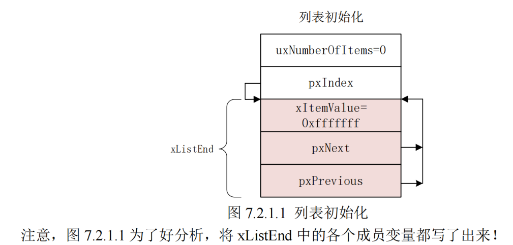

## 列表项初始化

```c
/*-----------------------------------------------------------*/

/*

 * 初始化一个列表项
 * pxItem: 要初始化的列表项指针
   */
   void vListInitialiseItem( ListItem_t * const pxItem )
   {
     /* 确保列表项没有被记录为在任何列表中（pvContainer 为 NULL） */
     pxItem->pvContainer = NULL;

  /* 如果 configUSE_LIST_DATA_INTEGRITY_CHECK_BYTES 设为 1，
     则向列表项写入已知值用于数据完整性检查 */
  listSET_FIRST_LIST_ITEM_INTEGRITY_CHECK_VALUE( pxItem );
  listSET_SECOND_LIST_ITEM_INTEGRITY_CHECK_VALUE( pxItem );
}
```

列表项要根据实际情况来初始化，比如在创建任务函数中


## 插入列表项

xListEnd是一个虚拟节点，不存储数据，永远在列表末尾

列表： [A] ⇄ [B] ⇄ [xListEnd]
        ↑
   pxIterator 找到位置（在 B 之后）

列表： [A] ⇄ [B] ⇄ [New] ⇄ [xListEnd]

```c

/*

 * 向列表中插入一个新的列表项（按 xItemValue 值排序插入）

 * pxList: 要插入的目标列表

 * pxNewListItem: 要插入的新列表项
   */
   void vListInsert( List_t * const pxList, ListItem_t * const pxNewListItem )
   {
   ListItem_t *pxIterator;
   const TickType_t xValueOfInsertion = pxNewListItem->xItemValue;

   /* 仅当定义了 configASSERT() 时有效，这些测试可以捕获内存中列表数据结构被覆盖的情况。
      它们不会捕获由于 FreeRTOS 错误配置或使用导致的数据错误。 */
   listTEST_LIST_INTEGRITY( pxList );
   listTEST_LIST_ITEM_INTEGRITY( pxNewListItem );

   /* 将新列表项按 xItemValue 值顺序插入到列表中。

      如果列表中已存在具有相同项值的列表项，则新列表项应放在它之后。
      这确保了存储在就绪列表中的 TCB（都具有相同的 xItemValue 值）能够公平分享 CPU。
      但是，如果 xItemValue 与尾部标记值相同，下面的迭代循环将不会结束。
      因此首先检查该值，并在必要时稍微修改算法。 */

   if( xValueOfInsertion == portMAX_DELAY )
   {
       /* 如果插入值等于最大值，直接插入到列表末尾（xListEnd 之前） */
       pxIterator = pxList->xListEnd.pxPrevious;
   }
   else
   { 
       /* 遍历列表，找到正确的插入位置 */
       /* 从列表结束项开始，向后遍历直到找到第一个 xItemValue 大于插入值的位置 */
       for( pxIterator = ( ListItem_t * ) &( pxList->xListEnd ); 
            pxIterator->pxNext->xItemValue <= xValueOfInsertion; 
            pxIterator = pxIterator->pxNext ) 
       {
           /* 这里不需要做任何操作，只是迭代到想要的插入位置 */
       }
   }

   /* 执行双向链表的标准插入操作 */

   /* 1. 新项的 next 指向迭代器后面的项 */
   pxNewListItem->pxNext = pxIterator->pxNext;

   /* 2. 新项后面的项的前向指针指向新项 */
   pxNewListItem->pxNext->pxPrevious = pxNewListItem;

   /* 3. 新项的前向指针指向迭代器 */
   pxNewListItem->pxPrevious = pxIterator;

   /* 4. 迭代器的后向指针指向新项 */
   pxIterator->pxNext = pxNewListItem;

   /* 记录该项所在的列表。这允许以后快速移除该项。 */
   pxNewListItem->pvContainer = ( void * ) pxList;

   /* 增加列表中的项数计数 */
   ( pxList->uxNumberOfItems )++;
   }
```


先看序号值xItemValue是不是最大的，不是的话就从尾节点开始<font color='red'>遍历节点</font>序号值，找到<font color='red'>比要插入的节点序号值大</font>的位置就返回这个位置的<font color='red'>节点指针</font>

最后将新节点插入这个节点前面

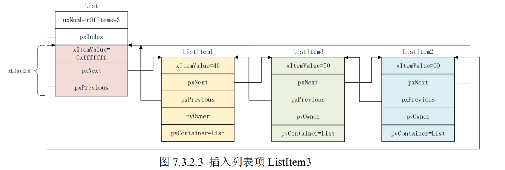

列表是环形的，只有一个列表项的时候，这个列表项的前指针和后指针都指向虚拟尾节点，虚拟尾节点也是这样


## 列表末尾插 [B] ⇄ [C] ⇄ [xListEnd]
                 ↑
            pxIndex (当前指向 C)

列表： [A] ⇄ [B] ⇄ [New] ⇄ [C] ⇄ [xListEnd]
                 ↑
            pxIndex (仍然指向 C)	 

```c
/*

 * 将新列表项插入到列表的"逻辑末尾"

 * 注意：这不是按值排序插入，而是基于当前 pxIndex 位置的插入

 * 这种插入方式使得新项成为通过 listGET_OWNER_OF_NEXT_ENTRY() 调用时最后被移除的项

 * 

 * pxList: 要插入的目标列表

 * pxNewListItem: 要插入的新列表项
   */
   void vListInsertEnd( List_t * const pxList, ListItem_t * const pxNewListItem )
   {
   /* 获取列表当前的遍历指针位置 */
   ListItem_t * const pxIndex = pxList->pxIndex;

   /* 仅当定义了 configASSERT() 时有效，这些测试可以捕获内存中列表数据结构被覆盖的情况。
      它们不会捕获由于 FreeRTOS 错误配置或使用导致的数据错误。 */
   listTEST_LIST_INTEGRITY( pxList );
   listTEST_LIST_ITEM_INTEGRITY( pxNewListItem );

   /* 将新列表项插入到 pxList 中，但不是按值排序列表，
      而是使新列表项成为调用 listGET_OWNER_OF_NEXT_ENTRY() 时最后被移除的项。

      这种插入方式实现了"向后插入"，新项插入在 pxIndex 的前面位置。 */

   /* 新项的后向指针指向当前遍历位置 */
   pxNewListItem->pxNext = pxIndex;

   /* 新项的前向指针指向当前遍历位置的前一个项 */
   pxNewListItem->pxPrevious = pxIndex->pxPrevious;

   /* 仅用于决策覆盖测试（某些测试工具使用） */
   mtCOVERAGE_TEST_DELAY();

   /* 更新前后节点的指针，完成插入操作 */
   pxIndex->pxPrevious->pxNext = pxNewListItem;
   pxIndex->pxPrevious = pxNewListItem;

   /* 记录该项所在的列表，便于后续快速移除 */
   pxNewListItem->pvContainer = ( void * ) pxList;

   /* 增加列表中的项数计数 */
   ( pxList->uxNumberOfItems )++;
   }
```

这里末尾并不是虚拟尾节点，pxIndex是遍历指针，遍历从pxIndex开始，也就是说pxIndex就是列表头，列表是环形的，所以尾部是在pxIndex前面的位置

这样新插入的项在轮询调度中会比较晚被选中

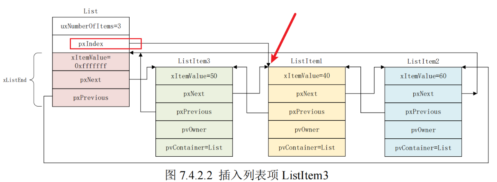

注意pxIndex和前面一个图的区并自己定好位置，相当于这个<font color='red'>任务被插入到多个</font>将来要来管理它的<font color='red'>活动</font>

```c
typedef struct tskTaskControlBlock {
    ListItem_t xStateListItem;   /* "状态分身" - 负责任务的生命周期管理 */
    ListItem_t xEventListItem;   /* "事件分身" - 负责任务的通信交互管理 */
    
    // 关键：两个分身都指向同一个本体
    // ListItem_t结构中有: void *pvOwner; 指向所属的TCB
} tskTCB;
```


```c
// "状态分身"可以同时出现在：
- 就绪列表（准备运行）
- 延时列表（等待时间到期）  
- 挂起列表（被主动暂停）

// "事件分身"可以同时出现在：
- 队列等待列表（等待数据）
- 信号量等待列表（等待信号）
- 事件组等待列表（等待事件位）

// 但注意：同一个分身在某一时刻只能在一个列表中！
    
```

```c
// 场景：任务同时等待延时和队列数据
void vExampleTask( void *pvParameters )
{
    for( ;; )
    {
        // "状态分身"插入延时列表
        vTaskDelay( 1000 );           // → xStateListItem 进入 xDelayedTaskList
        
        // "事件分身"插入队列等待列表  
        xQueueReceive( xQueue, &data, portMAX_DELAY ); // → xEventListItem 进入 xQueue.xTasksWaitingToReceive
    }
}

/* 此时任务的状况：
   本体：TCB
   分身1(xStateListItem)：在延时列表中，等待1000个tick
   分身2(xEventListItem)：在队列等待列表中，等待数据到达
*/
```

```c
// 当延时到期时：
- 系统扫描延时列表找到 xStateListItem
- 通过 pvOwner 找到所属TCB
- 将 xStateListItem 从延时列表移到就绪列表

// 当队列有数据时：
- 系统扫描队列等待列表找到 xEventListItem  
- 通过 pvOwner 找到所属TCB
- 如果该任务还在等待（状态分身可能在延时列表），将其唤醒
```


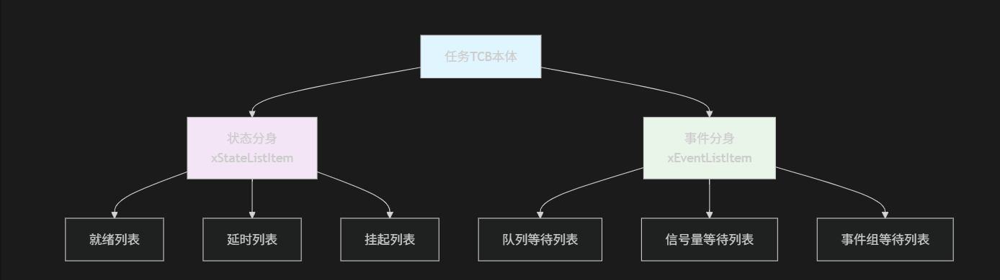


# 调度器开启

## vTaskStartScheduler

```c
void vTaskStartScheduler(void)
{
    BaseType_t xReturn;

/* 静态方法创建空闲任务 */
#if (configSUPPORT_STATIC_ALLOCATION == 1)
    {
        StaticTask_t *pxIdleTaskTCBBuffer = NULL;
        StackType_t *pxIdleTaskStackBuffer = NULL;
        uint32_t ulIdleTaskStackSize;

        /* 以静态方式创建任务用户需自定义空闲任务的内存分配函数 */
        vApplicationGetIdleTaskMemory(&pxIdleTaskTCBBuffer, &pxIdleTaskStackBuffer, &ulIdleTaskStackSize);
        xIdleTaskHandle = xTaskCreateStatic(prvIdleTask,
                                            "IDLE",
                                            ulIdleTaskStackSize,
                                            (void *)NULL,
                                            (tskIDLE_PRIORITY | portPRIVILEGE_BIT),
                                            pxIdleTaskStackBuffer,
                                            pxIdleTaskTCBBuffer);
    
        if (xIdleTaskHandle != NULL)
        {
            xReturn = pdPASS;
        }
        else
        {
            xReturn = pdFAIL;
        }
    }

#else
    { /* 动态方法创建空闲任务 */
        xReturn = xTaskCreate(prvIdleTask,
                              "IDLE", configMINIMAL_STACK_SIZE,
                              (void *)NULL,
                              (tskIDLE_PRIORITY | portPRIVILEGE_BIT),
                              &xIdleTaskHandle);
    }
#endif /* configSUPPORT_STATIC_ALLOCATION */
/* 如果启用软件定时器 */
#if (configUSE_TIMERS == 1)
    {
        if (xReturn == pdPASS)
        {
            /* 创建空闲任务成功，且启用软件定时器，就创建定时器任务 */
            xReturn = xTimerCreateTimerTask();
        }
        else
        {
            mtCOVERAGE_TEST_MARKER();
        }
    }
#endif /* configUSE_TIMERS */
    /* 任务创建成功或定时器任务创建成功（如果使能定时器任务创建的话）*/
    if (xReturn == pdPASS)
    {
        /* 关中断，确保开启调度器之前或过程中，SysTick 不会产生中断
           在第一个任务开始运行时，会重新打开中断 */
        portDISABLE_INTERRUPTS();

#if (configUSE_NEWLIB_REENTRANT == 1)
        {
            _impure_ptr = &(pxCurrentTCB->xNewLib_reent);
        }
#endif /* configUSE_NEWLIB_REENTRANT */
        /* 设置下一个任务的解锁时间为最大，这样可以避免在启动调度器之前不会因为任务解锁而引起任务调度 */
        xNextTaskUnblockTime = portMAX_DELAY;
        /* 置 xSchedulerRunning 标志为真，这指示这调度器即将进行运行 */
        xSchedulerRunning = pdTRUE;
        /* 将计数值初始化为0，确保在启动调度器时开始计数，使所有任务的时钟节拍一致 */
        xTickCount = (TickType_t)0U;

/* 如果定义了configGENERATE_RUN_TIME_STATS，
则必须定义以下宏来配置用于生成运行时计数器时基的定时器/计数器。
运行时间统计功能 */
portCONFIGURE_TIMER_FOR_RUN_TIME_STATS();

/* 用于完成启动任务调度器中与硬件架构相关的配置部分，以及启动第一个任务
调用这个函数以后，就不会再回来了*/
if (xPortStartScheduler() != pdFALSE)
{
/* 调度器正在运行函数不会返回到这里执行 */
}
else
{
/* 只有当任务调用 xTaskEndScheduler() 时才会到达这里
如果调度器没有成功启动，或者某个任务调用了 xTaskEndScheduler() 函数以结束调度器的运行，
则程序将会执行到这里。因此，在这里放置的代码可能会处理一些特殊情况或进行清理工作 */
}
}
/* 可能是因为没有足够的堆空间来创建空闲任务或定时器任务
通过断言来检查内核是否能成功分配所需的内存 */
else
{
configASSERT(xReturn != errCOULD_NOT_ALLOCATE_REQUIRED_MEMORY);
}

/* 防止编译器警告 */
(void)xIdleTaskHandle;

}
```


先明确一点，<font color='red'>任务调度发生在调用vTaskDelay()函数和sysTick中断发生时</font>

1. `xNextTaskUnblockTime` 是什么？

这是一个全局变量，用来记录：

> “下一个**延时任务**（处于阻塞态的任务）**最早要被唤醒的时间点**（tick 值）”。

FreeRTOS 每次进入 `Tick` 中断（比如每 1ms）时，
 会比较当前系统时间 `xTickCount` 和这个变量：

```c
if (xTickCount >= xNextTaskUnblockTime)
{
    // 有任务该被唤醒了
}
```

所以这个变量是用来**快速判断是否有任务需要唤醒**的，
 避免每次都去遍历整个任务列表，提高效率。

2. 那为什么一开始要设成 `portMAX_DELAY`？

因为在刚启动调度器的时候：

- 所有任务都还没开始运行；
- 也就是说 **还没有任何任务处于延时状态**；
- 所以“下一个任务要被唤醒的时间”是——**不存在**。

而 `portMAX_DELAY`（通常是 `0xFFFFFFFF`）
 代表“一个永远到不了的时间点”。

就相当于说：

> “现在系统里没有等待唤醒的任务，暂时不用考虑谁该被唤醒。”


这个宏需要自己实现 

```C
portCONFIGURE_TIMER_FOR_RUN_TIME_STATS();
```


## **xPortStartScheduler**

```C
/*
 * 启动 FreeRTOS 调度器
 * 返回值: 正常情况下不应该返回，如果返回则表示错误
 */
BaseType_t xPortStartScheduler( void )
{
  /* configMAX_SYSCALL_INTERRUPT_PRIORITY 不能设置为 0。
     参见 http://www.FreeRTOS.org/RTOS-Cortex-M3-M4.html */
  configASSERT( ( configMAX_SYSCALL_INTERRUPT_PRIORITY ) );

  /* 如果启用了断言检查，执行优先级位检测 */
  #if( configASSERT_DEFINED == 1 )
  {
    volatile uint32_t ulOriginalPriority;
    /* 获取第一个用户中断优先级寄存器的地址 */
    volatile uint8_t * const pucFirstUserPriorityRegister = ( volatile uint8_t * ) ( portNVIC_IP_REGISTERS_OFFSET_16 + portFIRST_USER_INTERRUPT_NUMBER );
    volatile uint8_t ucMaxPriorityValue;

    /* 确定可以从中调用 FreeRTOS ISR 安全 API 函数的最高优先级。
       ISR 安全函数是以 "FromISR" 结尾的函数。FreeRTOS 维护独立的线程和 ISR API 函数，
       以确保中断入口尽可能快速和简单。
       保存即将被覆盖的中断优先级值。 */
    ulOriginalPriority = *pucFirstUserPriorityRegister;

    /* 确定可用的优先级位数。首先向所有可能的位写入1。 */
    *pucFirstUserPriorityRegister = portMAX_8_BIT_VALUE;

    /* 读回该值以查看有多少位保持不变（实际实现的位数）。 */
    ucMaxPriorityValue = *pucFirstUserPriorityRegister;

    /* 对系统调用最大优先级使用相同的掩码。 */
    ucMaxSysCallPriority = configMAX_SYSCALL_INTERRUPT_PRIORITY & ucMaxPriorityValue;

    /* 根据读回的位数计算可接受的最大优先级组值。 */
    ulMaxPRIGROUPValue = portMAX_PRIGROUP_BITS;
    while( ( ucMaxPriorityValue & portTOP_BIT_OF_BYTE ) == portTOP_BIT_OF_BYTE )
    {
      ulMaxPRIGROUPValue--;
      ucMaxPriorityValue <<= ( uint8_t ) 0x01;
    }

    /* 将优先级组值移回其在 AIRCR 寄存器中的位置。 */
    ulMaxPRIGROUPValue <<= portPRIGROUP_SHIFT;
    ulMaxPRIGROUPValue &= portPRIORITY_GROUP_MASK;

    /* 恢复被覆盖的中断优先级寄存器到其原始值。 */
    *pucFirstUserPriorityRegister = ulOriginalPriority;
  }
  #endif /* configASSERT_DEFINED */

  /* 将 PendSV 和 SysTick 设置为与内核相同的优先级，
     并将 SVC 处理程序设置为更高优先级，以便它可以用于退出临界区
     （在临界区中较低优先级被屏蔽）。 */
  portNVIC_SYSPRI2_REG |= portNVIC_PENDSV_PRI;
  portNVIC_SYSPRI2_REG |= portNVIC_SYSTICK_PRI;

  /* 配置 MPU 中所有任务共用的区域（如果使用 MPU）。 */
  prvSetupMPU();

  /* 启动生成 tick 中断的定时器。此时中断已被禁用。 */
  prvSetupTimerInterrupt();

  /* 初始化临界区嵌套计数，为第一个任务做好准备。 */
  uxCriticalNesting = 0;

  /* 确保 VFP（向量浮点单元）已启用 - 本来就应该启用。 */
  vPortEnableVFP();

  /* 始终启用惰性保存（lazy saving）。 */
  *( portFPCCR ) |= portASPEN_AND_LSPEN_BITS;

  /* 启动第一个任务。此函数不会返回。 */
  prvStartFirstTask();

  /* 不应该执行到这里！如果执行到这里说明调度器启动失败。 */
  return 0;
}
```

## FPU

FPU（Floating Point Unit）就是浮点运算单元，一般<font color='red'>将浮点运算称作VFP</font>
 用于加速 `float`、`double` 的加减乘除、平方根、乘加等运算。

> 没 FPU 的 MCU，执行浮点运算要用软件模拟，慢十几倍；
>  有 FPU（如 STM32F4/F7/G4 系列），就可以用硬件直接算，快很多


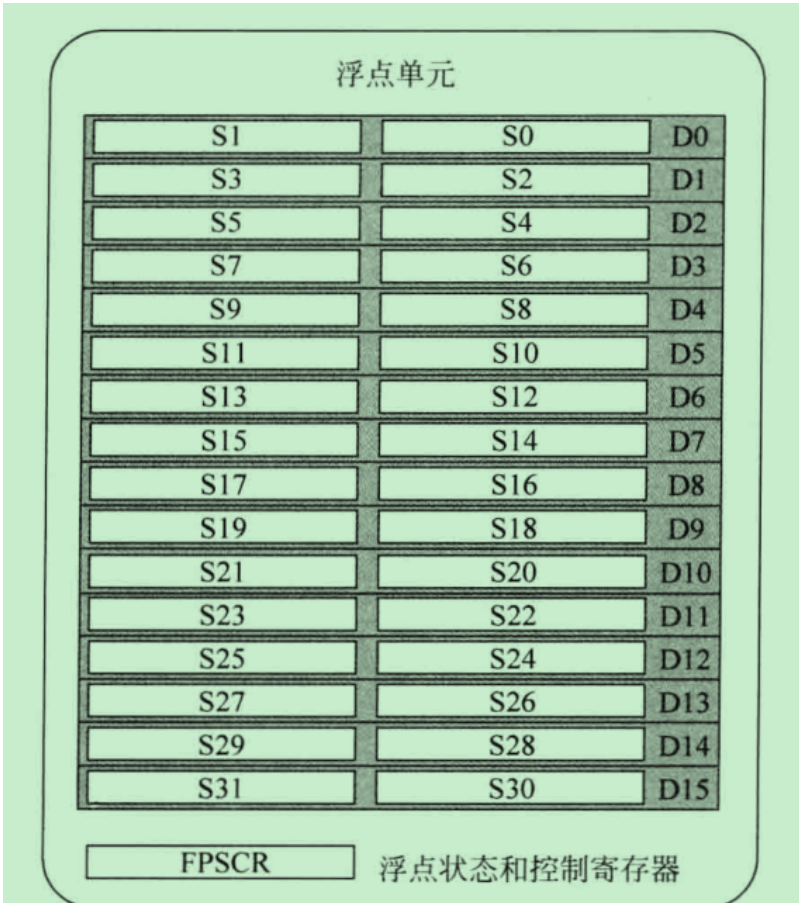

前16个叫做调用者保存-寄存器，意思是如果函数A调用了函数B，在调用之前会根据FPCCR寄存器的31-30位来决定是自动还是手动把这些寄存器的值放进栈里保存，当这两位都被使能时，会<font color='red'>自动并且惰性压栈</font>。

后16个叫做被调用者保存-寄存器，意思是如果函数A调用了函数B，函数b要手动保存后面的寄存器

想象一下：
 任务 A 正在跑浮点计算 → 中断切换到任务 B → 任务 B 也用浮点运算。
 如果不保存 S16–S31，那任务 B 改了寄存器，任务 A 的浮点结果就全乱了。
 这就是为什么 FreeRTOS 要补保存那一半寄存器

最终结果：

当任务切换时，<font color='red'>S0–S31 + FPSCR 都会被保存，但前半部分自动，后半部分手动。</font>

## 惰性压栈

当 MCU 进入中断时，**硬件会自动把一组寄存器得值压入当前任务的栈**，以便之后恢复。
 普通 Cortex-M4（无 FPU）会保存这些：

```
R0–R3, R12, LR, PC, xPSR   （共8个寄存器）
```

但带 FPU 的 Cortex-M4F 还需要保存额外的浮点寄存器：

```
S0–S15, FPSCR   （16+1个浮点寄存器）
```

如果每次中断都保存这些浮点寄存器，
 就会多压 **17 × 4 = 68 字节**，
 即使中断根本没用到 FPU 也要花时间去压栈 → 太浪费！


ARM 的聪明设计：

```c
FPU->FPCCR |= (1 << 31) | (1 << 30);  // ASPEN = 1, LSPEN = 1
```


> 只有**当中断或异常实际用到了浮点运算**，
>  才真正把 FPU 的寄存器（S0–S15、FPSCR）压栈。

也就是说：

- 进入中断时，**先不保存 FPU 上下文**；
- 如果中断里 **没有使用浮点指令**，那就什么都不干；
- 如果中断执行过程中 **第一次执行了浮点指令**，
   硬件才“临时”去补压栈（这就是“惰性”的意思）。

这样就能极大减少不必要的栈操作，提高响应速度。

## vPortEnableVFP

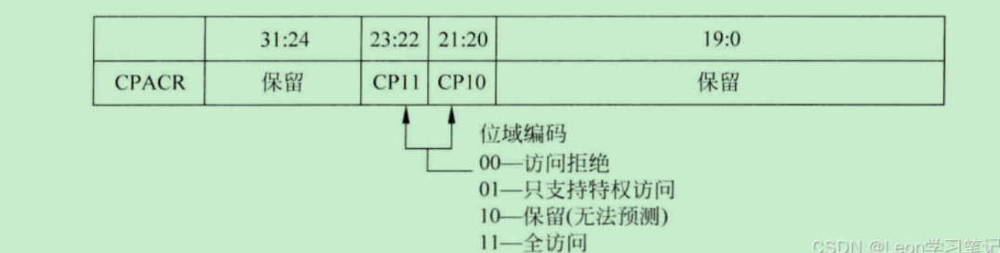

使能FPU，将这个寄存器的bit20-23置为1

r14是链接寄存器（LR),用于函数调用时返回地址的保存

```assembly
__asm void vPortEnableVFP( void )

{

  PRESERVE8

  

  ldr.w r0, =0xE000ED88    /* The FPU enable bits are in the CPACR. */

  ldr r1, [r0]

  orr r1, r1, #( 0xf << 20 )  /* Enable CP10 and CP11 coprocessors, then save back. */

  str r1, [r0]

  bx r14

  nop

  nop

}
```


## prvStartFirstTask

```assembly
__asm void prvStartFirstTask( void )

{

  PRESERVE8

  

  ldr r0, =0xE000ED08 /* Use the NVIC offset register to locate the stack. */

  ldr r0, [r0]    /* 将0xE000ED08对应的值给r0,它的值是向量表的首地址*/

  ldr r0, [r0]		/*将向量表首地址对应的值给r0,向量值首地址的值也就是主栈指针的指向   */

  msr msp, r0     /* Set the msp back to the start of the stack. */

  cpsie i       /* Globally enable interrupts. */

  cpsie f

  dsb

  isb

  svc portSVC_START_SCHEDULER /* System call to start first task. */

  nop

  nop

}
```

| 步骤 | 操作                          | 目的                      |
| ---- | ----------------------------- | ------------------------- |
| 1    | 从 `VTOR` 取出当前向量表地址  | 获取中断表位置            |
| 2    | 取出向量表首项                | 得到初始 MSP              |
| 3    | `msr msp, r0`                 | 恢复主栈指针              |
| 4    | `cpsie i/f`                   | 打开中断                  |
| 5    | `svc portSVC_START_SCHEDULER` | 触发 SVC → 启动第一个任务 |

| 汇编指令                      | 中文解释     | 作用                                 |
| ----------------------------- | ------------ | ------------------------------------ |
| `cpsie i`                     | 打开普通中断 | 允许外设中断                         |
| `cpsie f`                     | 打开故障中断 | 允许硬错误中断                       |
| `dsb`                         | 数据屏障     | 等待所有内存操作完成                 |
| `isb`                         | 指令屏障     | 刷新流水线，保证状态立即生效         |
| `svc portSVC_START_SCHEDULER` | 系统调用     | 跳入 FreeRTOS 调度器，启动第一个任务 |
| `nop nop`                     | 空指令       | 调试/延迟用                          |

要理解上面的汇编，需要下面的前置知识

## MSP和PSP

1. **主栈指针（MSP）**

- 用于：**异常处理程序**（中断、系统异常）
- 特权级别：始终在**特权模式**下使用
- 用途：操作系统内核、异常处理

2. **进程栈指针（PSP）**

- 用于：**用户任务**（普通应用程序代码）
- 特权级别：可以在**用户模式**或**特权模式**下使用
- 用途：用户任务、应用程序

 用户任务运行在非特权模式，只能访问自己的PSP
 操作系统运行在特权模式，可以访问MSP和所有PSP


 用户任务<font color='red'>错误不会破坏操作系统内核栈</font>
 异常处理有独立的、受保护的栈空间

 如果<font color='red'>没有分离</font>： 任务栈溢出 → 破坏异常处理栈 → 系统完全崩溃 

<font color='red'>有分离</font>时： 任务栈溢出 → 只影响该任务 → 操作系统仍可恢复

内存地址
    ↑
    │   MSP 栈区 (主栈)
    │   ├─────────────────┤
    │   │ 异常处理栈帧    │ ← MSP 指向这里
    │   │ 内核函数调用    │
    │   │ 临时数据        │
    │   └─────────────────┤
    │
    │   Task1 栈区 (PSP)
    │   ├─────────────────┤
    │   │ 局部变量        │ ← PSP 指向这里（当运行 Task1 时）
    │   │ 函数调用记录    │
    │   │ 保存的寄存器    │
    │   └─────────────────┤
    │
    │   Task2 栈区 (PSP) 
    │   ├─────────────────┤
    │   │ 局部变量        │ ← PSP 指向这里（当运行 Task2 时）
    │   │ 函数调用记录    │
    │   └─────────────────┤
    │
    ↓


## VTOR

SCB->VTOR 向量表偏移寄存器

这个寄存器里面存放的是向量表的地址，是.s启动文件里面的向量表地址

向量表的首地址存放的是主栈指针的地址

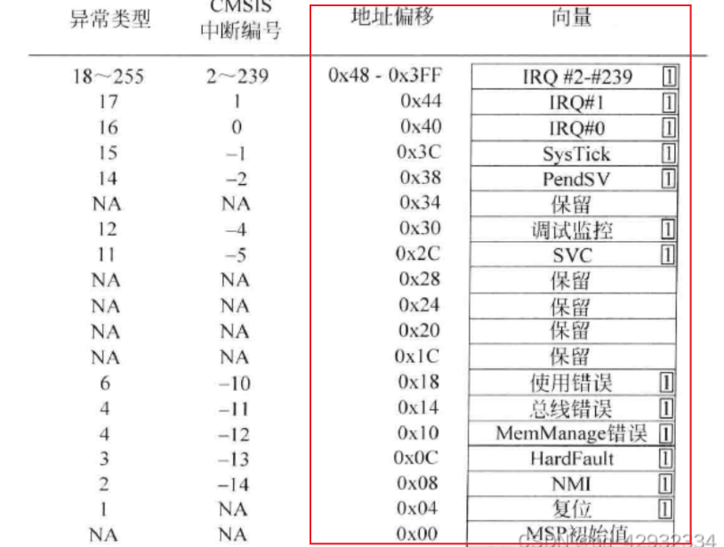


## 拓展：向量表重定位

从上面的图片可以看见，0x00000000处可以作为Flash和ROM，在运行时不能对这张表进行修改，所以有需要可以<font color='red'>改变这个表的位置</font>，也就是重定位

```c
// Cortex-M 的 VTOR 寄存器地址：0xE000ED08
// 用于指定向量表的新位置

// 将向量表重定向到 RAM 中的新位置：
uint32_t *vtor = (uint32_t*)0xE000ED08;
*vtor = 0x20000000;  // 新的向量表地址

// 现在所有异常都会使用 RAM 中的向量表

// 针对不同内存类型的优化：
// - 将 MSP 栈放在快速 RAM (CCM RAM)
// - 将任务栈放在普通 RAM
// - 提高异常响应速度

// STM32F4 示例：
// CCM RAM: 0x10000000 (64KB，最快，无 DMA)
// 普通 RAM: 0x20000000 (128KB，较快，支持 DMA)

// 将 MSP 栈放在 CCM RAM 提高性能主栈
```

```
编译阶段：
链接脚本 → 定义 _estack = 0x20020000 (RAM末尾)
          ↓
启动文件 → 向量表[0] = _estack
          ↓
烧录到Flash → [0x08000000: 0x20020000] [0x08000004: Reset_Handler] ...

启动阶段：
复位 → 硬件自动从 0x08000000 加载 MSP = 0x20020000
     → 从 0x08000004 加载 PC = Reset_Handler
     ↓
Reset_Handler → 可选的向量表重定向
                  → 调用 SystemInit()
              → 调用 main()

FreeRTOS启动：
prvStartFirstTask → 读取 VTOR = 0x08000000 (或重定向后的地址)
                  → 读取 [VTOR] = 0x20020000 (MSP初始值)
                  → msr msp, r0 (重置MSP)
                  → 启动第一个任务
```


## SVC中断

// Cortex-M的两种模式：
// - 线程模式(Thread Mode)：任务运行在此
// - 处理器模式(Handler Mode)：异常/中断运行在此

// 每种模式又可以分特权等级：
CONTROL寄存器：
bit[0]: 0 = 特权模式, 1 = 非特权模式

// FreeRTOS任务通常运行在非特权模式
void vTaskSwitchContext(void) {
    // 创建新任务时设置CONTROL寄存器
    __set_CONTROL( 0x01 );  // 任务运行在非特权模式
}

SVC异常：CPU在用户模式下，用户程序不允许直接访问硬件，操作系统可以通过SVC提供对硬件的访问。


```c
// 用户任务代码（用户模式）
void vUserTask( void *pvParameters )
{
    // 用户想要创建互斥锁，但不能直接访问内核函数
    SemaphoreHandle_t xMutex;
    
    // 直接调用内核函数？不允许！
    // xMutex = xQueueCreateMutex();  // 错误：用户不能直接调用内核函数
    
    // 通过SVC机制请求系统服务
    xMutex = xTaskCreateMutex_SVC();  // 这个函数内部使用SVC指令
}


// 系统服务编号定义
#define SVC_CREATE_MUTEX    0
#define SVC_GIVE_MUTEX      1  
#define SVC_TAKE_MUTEX      2
#define SVC_MALLOC          3
#define SVC_FREE            4

// 用户可见的SVC封装函数
SemaphoreHandle_t xTaskCreateMutex_SVC( void )
{
    SemaphoreHandle_t xResult;
    
    __asm volatile (
        "mov r0, %1\n"          // 将系统调用号放入R0
        "svc %0\n"              // 触发SVC异常，%0替换为SVC_CREATE_MUTEX,会调用真正的SVC异常函数
        "mov %0, r0\n"          // 从R0获取返回值
        : "=r" (xResult)        // 输出操作数
        : "I" (SVC_CREATE_MUTEX) // 输入操作数
        : "r0"                  // 破坏的寄存器
    );
    
    return xResult;
}
                                                                                     
// 类似的还有其他系统调用封装
void *pvPortMalloc_SVC( size_t xSize )
{
    void *pvReturn;
    
    __asm volatile (
        "mov r0, %1\n"          // 参数：要分配的大小
        "svc %0\n"              // 触发SVC异常
        "mov %0, r0\n"          // 获取返回的指针
        : "=r" (pvReturn)
        : "r" (xSize), "I" (SVC_MALLOC)
        : "r0"
    );
    
    return pvReturn;
}
```


```c
// 用户任务可能直接操作硬件寄存器
void vDangerousTask( void *pvParameters )
{
    // 直接配置定时器 - 危险！
    TIM1->CR1 = 0x01;  // 可能破坏其他任务的时间基准
    
    // 直接操作内存管理单元
    MPU->RNR = 0;      // 可能破坏内存保护
    
    // 直接修改中断控制器  
    NVIC->ISER[0] = 0xFFFFFFFF;  // 启用所有中断，导致系统混乱
}


// 用户只能通过SVC请求服务
void vSafeTask( void *pvParameters )
{
    // 只能通过受控的接口访问硬件
    xTimerCreate_SVC();     // 通过SVC创建定时器
    vTaskDelay_SVC( 100 );  // 通过SVC请求延时
    
    // 无法直接访问硬件寄存器
    // TIM1->CR1 = 0x01;    // 编译错误或内存保护错误
}
```


```assembly
__asm void vPortSVCHandler( void )
{
    PRESERVE8  /* 指示编译器保持8字节栈对齐 */

    /* 恢复任务上下文 */
    ldr r3, =pxCurrentTCB  /* 加载当前任务控制块(TCB)的地址到r3 */
    ldr r1, [r3]           /* 通过pxCurrentTCBConst获取pxCurrentTCB指针的值 */
    ldr r0, [r1]           /* TCB中的第一个项是任务的栈顶指针 */

    /* 弹出在异常入 口时没有自动保存的寄存器和临界区嵌套计数 */
    ldmia r0!, {r4-r11}    /* 从任务栈中恢复寄存器r4-r11 */

    msr psp, r0            /* 恢复任务栈指针到PSP（进程栈指针） psp指向r0 */
    isb                    /* 指令同步屏障 */

    mov r0, #0             
    msr basepri, r0        /* 将basepri设为0，启用所有中断 */

    orr r14, #0xd          /* 设置EXC_RETURN值：使用PSP、返回到线程模式 */
    bx r14                 /* 异常返回，开始执行任务 自动恢复其他寄存器 */
}
```

| 汇编                          | 含义                                      | 功能                 |
| ----------------------------- | ----------------------------------------- | -------------------- |
| `ldr r3, =pxCurrentTCB`       | 取全局任务指针地址                        | 找到当前任务         |
| `ldr r1, [r3]`                | 取出 TCB 地址                             | 定位任务控制块       |
| `ldr r0, [r1]`                | 取出任务栈顶地址                          | 定位任务栈           |
| `ldmia r0!, {r4-r11}`         | 恢复寄存器 r4–r11，其他寄存器硬件自动恢复 | 恢复上下文一部分     |
| `msr psp, r0`                 | 设置 PSP                                  | 切换到任务栈         |
| `isb`                         | 指令同步                                  | 确保状态立即生效     |
| `mov r0, #0; msr basepri, r0` | 打开中断                                  | 准备进入任务         |
| `orr r14, #0xd; bx r14`       | 异常返回（使用 PSP）                      | 真正跳到任务入口执行 |


| 恢复步骤               | 寄存器                              | 数据来源                               | 谁来恢复                       |
| ---------------------- | ----------------------------------- | -------------------------------------- | ------------------------------ |
| 进入 SVC 异常时        | R0–R3, R12, LR, PC, xPSR            | 当前环境(main)                         | 硬件自动保存到 **MSP**         |
| 在 SVC 处理函数里      | R4–R11                              | 从 任务栈 里取出来（伪造的任务上下文） | 软件手动 `ldmia r0!, {r4-r11}` |
| 设置 PSP               | 让 PSP 指向任务栈伪造现场的中间位置 | 任务自己的 TCB                         | 软件 `msr psp, r0`             |
| 执行 `bx r14` 异常返回 | R0–R3, R12, LR, PC, xPSR            | 从 **PSP** 中自动恢复                  | 硬件自动完成                   |

在创建任务时就已经伪造了任务栈


# 伪造好的任务现场

就是：
 RTOS 在创建任务时，提前在任务栈里“假装”压入了一次中断现场，让 CPU 以后能像“从中断返回一样”直接开始执行这个任务,这样开始就不必要再多设置一次专门的任务转换了

```markdown
===================== FreeRTOS 启动全过程 =====================

(1) 还在裸机环境（main函数内）
--------------------------------------------------------------
  main()
   │
   ├─ xTaskCreate()   → 创建任务结构体TCB，伪造任务栈（任务栈内假装中断现场）
   │
   ├─ vTaskStartScheduler()
   │     │
   │     ├─ 创建空闲任务、定时器任务
   │     └─ 调用 xPortStartScheduler()
   │             │
   │             └─ prvStartFirstTask()   ← 汇编启动
   │                     │
   │                     ├─ 从向量表取出栈顶地址，设置 MSP
   │                     ├─ 开中断 (CPSIE i, f)
   │                     └─ 触发 SVC 软中断 (svc 0)
   │
   ▼
--------------------------------------------------------------
(2) CPU 进入 SVC 异常
--------------------------------------------------------------
  CPU 自动做的事：
   - 切换到 MSP
   - 把 LR、xPSR、PC、R0~R3 等压栈（保存 main() 的上下文）
   - 跳转到 vPortSVCHandler()

--------------------------------------------------------------
(3) vPortSVCHandler() 执行
--------------------------------------------------------------
  ldr r3, =pxCurrentTCB       ; 当前任务TCB
  ldr r1, [r3]
  ldr r0, [r1]                ; 取出任务栈顶（伪造现场）
  ldmia r0!, {r4-r11}         ; 恢复部分寄存器
  msr psp, r0                 ; 设置 PSP = 任务栈
  mov r0, #0
  msr basepri, r0             ; 开中断
  orr r14, #0xd
  bx r14                      ; 异常返回，CPU自动用PSP恢复剩余寄存器

--------------------------------------------------------------
(4) CPU 从异常返回 → 切换完成
--------------------------------------------------------------
  此时：
    MSP → 用于中断
    PSP → 指向当前任务栈顶
    PC  → 任务函数地址
    xPSR → 设置为线程模式

  CPU 正式开始执行：
    Task1_Function();

--------------------------------------------------------------
(5) 后续如果发生任务切换（PendSV）
--------------------------------------------------------------
  保存当前任务的寄存器 → 切换 pxCurrentTCB → 恢复新任务寄存器
  整个流程跟上面 SVC 的切换类似
--------------------------------------------------------------

```

*`ldmia r0!, {r4-r11}` 是从 PSP 指向的任务栈中恢复寄存器！**

关键点在于：**在执行这条指令之前，`r0` 已经被设置为指向任务栈顶**，而这个栈顶值是从任务的 TCB 中获取的

总结：SVC中断实现的是操作的堆栈从MSP到PSP转化，也就是从裸机到操作系统


# 任务相关函数

## 创建任务详解

```c
#if( configSUPPORT_DYNAMIC_ALLOCATION == 1 )

/**
 * @brief 动态创建任务（自动分配栈和TCB内存）
 * @param pxTaskCode 任务函数入口地址
 * @param pcName 任务名称（字符串）
 * @param usStackDepth 栈深度（单位：栈元素大小）
 * @param pvParameters 传递给任务函数的参数
 * @param uxPriority 任务优先级（0为最低）
 * @param pxCreatedTask 输出参数，返回创建的任务句柄
 * @return pdPASS（成功）或errCOULD_NOT_ALLOCATE_REQUIRED_MEMORY（失败）
 */
BaseType_t xTaskCreate(	TaskFunction_t pxTaskCode,
						const char * const pcName,
						const uint16_t usStackDepth,
						void * const pvParameters,
						UBaseType_t uxPriority,
						TaskHandle_t * const pxCreatedTask )
{
	TCB_t *pxNewTCB;
	BaseType_t xReturn;

	// 根据栈增长方向（向上/向下）分配内存
	#if( portSTACK_GROWTH > 0 )
	{
		// 栈向上增长：先分配TCB，再分配栈
		pxNewTCB = ( TCB_t * ) pvPortMalloc( sizeof( TCB_t ) );

		if( pxNewTCB != NULL )
		{
			pxNewTCB->pxStack = ( StackType_t * ) pvPortMalloc( ( ( size_t ) usStackDepth ) * sizeof( StackType_t ) );

			if( pxNewTCB->pxStack == NULL )
			{
				// 栈分配失败，释放已分配的TCB
				vPortFree( pxNewTCB );
				pxNewTCB = NULL;
			}
		}
	}
	#else /* portSTACK_GROWTH */
	{
		// 栈向下增长：先分配栈，再分配TCB
		StackType_t *pxStack;
		pxStack = ( StackType_t * ) pvPortMalloc( ( ( size_t ) usStackDepth ) * sizeof( StackType_t ) );

		if( pxStack != NULL )
		{
			pxNewTCB = ( TCB_t * ) pvPortMalloc( sizeof( TCB_t ) );

			if( pxNewTCB != NULL )
			{
				pxNewTCB->pxStack = pxStack;
			}
			else
			{
				// TCB分配失败，释放已分配的栈
				vPortFree( pxStack );
			}
		}
		else
		{
			pxNewTCB = NULL;
		}
	}
	#endif /* portSTACK_GROWTH */

	if( pxNewTCB != NULL )
	{
		// 标记任务为动态分配（栈和TCB均为动态内存）
		#if( tskSTATIC_AND_DYNAMIC_ALLOCATION_POSSIBLE != 0 )
		{
			pxNewTCB->ucStaticallyAllocated = tskDYNAMICALLY_ALLOCATED_STACK_AND_TCB;
		}
		#endif

		// 初始化任务信息
		prvInitialiseNewTask( pxTaskCode, pcName, ( uint32_t ) usStackDepth, pvParameters, uxPriority, pxCreatedTask, pxNewTCB, NULL );
		// 将任务添加到就绪列表
		prvAddNewTaskToReadyList( pxNewTCB );
		xReturn = pdPASS;
	}
	else
	{
		xReturn = errCOULD_NOT_ALLOCATE_REQUIRED_MEMORY;
	}

	return xReturn;
}

#endif /* configSUPPORT_DYNAMIC_ALLOCATION */
```

pvPortMalloc()给任务堆栈来申请内存，申请得时候会作字节对齐处理

根据栈是向上增长还是向下增长来决定先分配栈还是TCB，如果有一个分配失败，另一个会被释放掉内存


执行 `prvInitialiseNewTask()` **之前**：
 👉 TCB 只是“分配出来的空壳”。只分配了内存空间和（任务栈指针）栈底指针-栈向下生长，栈地址最高处

执行完之后：
 👉 TCB 就变成“完整的任务档案”，
 既有名字、入口、优先级、栈指针、参数，也有链表节点等。

创建任务的过程就是填补任务对应的TCB的过程

## 初始化任务

```c
/*
 * 初始化新任务的函数
 * 参数说明：
 * - pxTaskCode: 任务函数指针，指向任务要执行的函数
 * - pcName: 任务名称字符串
 * - ulStackDepth: 栈深度（以StackType_t为单位）
 * - pvParameters: 传递给任务函数的参数指针
 * - uxPriority: 任务优先级
 * - pxCreatedTask: 输出参数，用于返回创建的任务句柄
 * - pxNewTCB: 指向新任务的TCB（任务控制块）结构体
 * - xRegions: 内存区域配置（用于MPU相关，通常为NULL）
 */
static void prvInitialiseNewTask( 	TaskFunction_t pxTaskCode,
									const char * const pcName,
									const uint32_t ulStackDepth,
									void * const pvParameters,
									UBaseType_t uxPriority,
									TaskHandle_t * const pxCreatedTask,
									TCB_t *pxNewTCB,
									const MemoryRegion_t * const xRegions ) /*lint !e971 允许使用未限定的char类型用于字符串和单个字符 */
{
StackType_t *pxTopOfStack;  // 栈顶指针
UBaseType_t x;  // 循环计数器

	#if( portUSING_MPU_WRAPPERS == 1 )
		/* 判断任务是否应以特权模式运行 */
		BaseType_t xRunPrivileged;
		if( ( uxPriority & portPRIVILEGE_BIT ) != 0U )
		{
			xRunPrivileged = pdTRUE;  // 特权模式
		}
		else
		{
			xRunPrivileged = pdFALSE;  // 非特权模式
		}
		uxPriority &= ~portPRIVILEGE_BIT;  // 清除优先级中的特权位
	#endif /* portUSING_MPU_WRAPPERS == 1 */

	/* 仅在需要时使用memset()，避免不必要的依赖 */
	#if( ( configCHECK_FOR_STACK_OVERFLOW > 1 ) || ( configUSE_TRACE_FACILITY == 1 ) || ( INCLUDE_uxTaskGetStackHighWaterMark == 1 ) )
	{
		/* 用已知值填充栈，便于调试（如栈溢出检测、栈高水位标记） */
		( void ) memset( pxNewTCB->pxStack, ( int ) tskSTACK_FILL_BYTE, ( size_t ) ulStackDepth * sizeof( StackType_t ) );
	}
	#endif /* ( ( 栈溢出检测 > 1 ) || ( 跟踪功能启用 ) || ( 栈高水位获取启用 ) ) */

	/* 计算栈顶地址，依赖于栈的增长方向（从高地址到低地址或反之）
	portSTACK_GROWTH用于根据端口需求调整结果为正或负值 */
	#if( portSTACK_GROWTH < 0 )
	{
		// 栈从高地址向低地址增长（如80x86）
		pxTopOfStack = pxNewTCB->pxStack + ( ulStackDepth - ( uint32_t ) 1 );
		// 确保栈顶地址按portBYTE_ALIGNMENT_MASK对齐
		pxTopOfStack = ( StackType_t * ) ( ( ( portPOINTER_SIZE_TYPE ) pxTopOfStack ) & ( ~( ( portPOINTER_SIZE_TYPE ) portBYTE_ALIGNMENT_MASK ) ) ); /*lint !e923 MISRA例外：指针与整数转换在实际应用中不可避免，使用portPOINTER_SIZE_TYPE确保尺寸匹配 */

		/* 验证计算出的栈顶地址对齐是否正确 */
		configASSERT( ( ( ( portPOINTER_SIZE_TYPE ) pxTopOfStack & ( portPOINTER_SIZE_TYPE ) portBYTE_ALIGNMENT_MASK ) == 0UL ) );
	}
	#else /* portSTACK_GROWTH */
	{
		// 栈从低地址向高地址增长
		pxTopOfStack = pxNewTCB->pxStack;

		/* 验证栈缓冲区的对齐是否正确 */
		configASSERT( ( ( ( portPOINTER_SIZE_TYPE ) pxNewTCB->pxStack & ( portPOINTER_SIZE_TYPE ) portBYTE_ALIGNMENT_MASK ) == 0UL ) );

		/* 如果启用栈检查，需要记录栈的另一端（栈底） */
		pxNewTCB->pxEndOfStack = pxNewTCB->pxStack + ( ulStackDepth - ( uint32_t ) 1 );
	}
	#endif /* portSTACK_GROWTH */

	/* 将任务名称存储到TCB中 */
	for( x = ( UBaseType_t ) 0; x < ( UBaseType_t ) configMAX_TASK_NAME_LEN; x++ )
	{
		pxNewTCB->pcTaskName[ x ] = pcName[ x ];

		/* 如果字符串长度小于configMAX_TASK_NAME_LEN，无需复制全部，避免访问字符串后的内存（可能性极低） */
		if( pcName[ x ] == 0x00 )
		{
			break;
		}
		else
		{
			mtCOVERAGE_TEST_MARKER();  // 覆盖率测试标记
		}
	}

	/* 确保任务名称字符串终止，即使原字符串长度大于或等于configMAX_TASK_NAME_LEN */
	pxNewTCB->pcTaskName[ configMAX_TASK_NAME_LEN - 1 ] = '\0';

	/* 优先级将用作数组索引，确保其不超出范围。首先移除可能存在的特权位 */
	if( uxPriority >= ( UBaseType_t ) configMAX_PRIORITIES )
	{
		uxPriority = ( UBaseType_t ) configMAX_PRIORITIES - ( UBaseType_t ) 1U;
	}
	else
	{
		mtCOVERAGE_TEST_MARKER();  // 覆盖率测试标记
	}

	pxNewTCB->uxPriority = uxPriority;  // 存储任务优先级到TCB
	#if ( configUSE_MUTEXES == 1 )
	{
		pxNewTCB->uxBasePriority = uxPriority;  // 基础优先级（用于优先级继承）
		pxNewTCB->uxMutexesHeld = 0;  // 初始化持有的互斥锁数量为0
	}
	#endif /* configUSE_MUTEXES */

	/* 初始化TCB中的状态列表项和事件列表项 */
	vListInitialiseItem( &( pxNewTCB->xStateListItem ) );
	vListInitialiseItem( &( pxNewTCB->xEventListItem ) );

	/* 将pxNewTCB设置为ListItem_t的回指，这样可以通过列表项获取对应的TCB */
	// （代码片段未完整显示后续内容）
   
    
    //但下面有一个这样的函数-初始化堆栈
    #else /* portUSING_MPU_WRAPPERS */
	{
		pxNewTCB->pxTopOfStack = pxPortInitialiseStack( pxTopOfStack, pxTaskCode, pvParameters );
	}
	#endif /* portUSING_MPU_WRAPPERS */
    
    
```

1. **MPU 特权模式处理**（可选）：若启用 MPU，判断任务是否以特权模式运行，并清除优先级中的特权位。
2. **栈初始化**：当启用栈溢出检测、跟踪功能或栈高水位获取时，用特定值（`tskSTACK_FILL_BYTE`）填充栈空间，便于调试。
3. **栈顶地址计算**：根据栈的增长方向（`portSTACK_GROWTH`）计算栈顶地址，并确保地址对齐。
4. **任务名称设置**：将任务名称复制到 TCB 的`pcTaskName`数组中，确保字符串终止符正确。
5. **优先级调整**：确保任务优先级不超过`configMAX_PRIORITIES`范围，作为数组索引使用。
6. **TCB 优先级初始化**：存储任务优先级，若启用互斥锁，同时初始化基础优先级和持有的互斥锁数量。
7. **列表项初始化**：初始化 TCB 中的状态列表项（`xStateListItem`）和事件列表项（`xEventListItem`），为任务加入调度器列表做准备。

## 初始化堆栈

在堆栈里模拟内核寄存器，把任务有关的数据放在里面，后面在SVC中断里把这些值给真正的内核寄存器，先手动恢复一些，自动恢复的在bx r14（pc寄存器）这一步恢复

```c
StackType_t *pxPortInitialiseStack( StackType_t *pxTopOfStack, TaskFunction_t pxCode, void *pvParameters )
{
	/* 初始化任务的堆栈。堆栈的设置必须与portRESTORE_CONTEXT()宏的预期完全匹配。
	
	堆栈中第一个实际的值是状态寄存器，设置为系统模式，并启用中断。
	首先添加几个NULL以确保GDB不会尝试解码不存在的返回地址。 */
	
	*pxTopOfStack = NULL;		/* 第一个NULL占位 */
	pxTopOfStack--;
	*pxTopOfStack = NULL;		/* 第二个NULL占位 */
	pxTopOfStack--;
	*pxTopOfStack = NULL;		/* 第三个NULL占位 */
	pxTopOfStack--;
	*pxTopOfStack = ( StackType_t ) portINITIAL_SPSR;	/* 程序状态寄存器 */

	/* 检查任务是否以THUMB模式启动 */
	if( ( ( uint32_t ) pxCode & portTHUMB_MODE_ADDRESS ) != 0x00UL )
	{
		/* 任务将以THUMB模式启动 */
		*pxTopOfStack |= portTHUMB_MODE_BIT;	/* 设置THUMB模式位 */
	}

	pxTopOfStack--;

	/* 接下来是返回地址，这里就是任务的入口点 */
	*pxTopOfStack = ( StackType_t ) pxCode;		/* 任务函数指针 */
	pxTopOfStack--;

	/* 接下来是所有除了堆栈指针之外的寄存器 */
	*pxTopOfStack = ( StackType_t ) prvTaskExitError;	/* R14 (LR) - 链接寄存器，任务退出时调用错误处理函数 */
	pxTopOfStack--;
	*pxTopOfStack = ( StackType_t ) 0x12121212;	/* R12 */
	pxTopOfStack--;
	*pxTopOfStack = ( StackType_t ) 0x11111111;	/* R11 */
	pxTopOfStack--;
	*pxTopOfStack = ( StackType_t ) 0x10101010;	/* R10 */
	pxTopOfStack--;
	*pxTopOfStack = ( StackType_t ) 0x09090909;	/* R9 */
	pxTopOfStack--;
	*pxTopOfStack = ( StackType_t ) 0x08080808;	/* R8 */
	pxTopOfStack--;
	*pxTopOfStack = ( StackType_t ) 0x07070707;	/* R7 */
	pxTopOfStack--;
	*pxTopOfStack = ( StackType_t ) 0x06060606;	/* R6 */
	pxTopOfStack--;
	*pxTopOfStack = ( StackType_t ) 0x05050505;	/* R5 */
	pxTopOfStack--;
	*pxTopOfStack = ( StackType_t ) 0x04040404;	/* R4 */
	pxTopOfStack--;
	*pxTopOfStack = ( StackType_t ) 0x03030303;	/* R3 */
	pxTopOfStack--;
	*pxTopOfStack = ( StackType_t ) 0x02020202;	/* R2 */
	pxTopOfStack--;
	*pxTopOfStack = ( StackType_t ) 0x01010101;	/* R1 */
	pxTopOfStack--;
	*pxTopOfStack = ( StackType_t ) pvParameters; 	/* R0 - 任务参数 */
	pxTopOfStack--;

	/* 任务启动时临界区嵌套计数为0，因为中断是启用的 */
	*pxTopOfStack = portNO_CRITICAL_NESTING;	/* 临界区嵌套计数 */
	pxTopOfStack--;

	/* 任务启动时不包含浮点上下文。使用浮点硬件的任务必须在执行任何浮点指令前调用vPortTaskUsesFPU() */
	*pxTopOfStack = portNO_FLOATING_POINT_CONTEXT;	/* 浮点上下文标志 */

	return pxTopOfStack;	/* 返回初始化后的堆栈指针位置 */
}
```


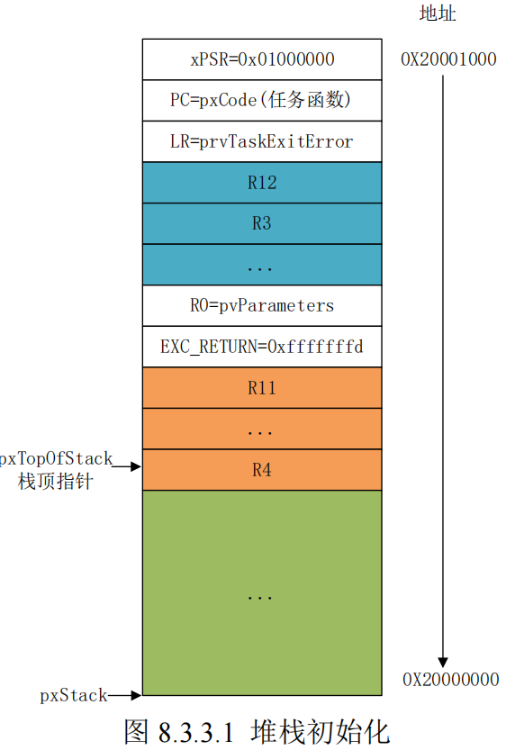

## 添加任务到就序列表

`prvAddNewTaskToReadyList()` 的作用就是
 “安全地把新任务登记进系统、放入就绪表、更新当前任务指针、并在必要时触发任务切换”。

```c


/* 将新创建的任务加入就绪列表 */
static void prvAddNewTaskToReadyList( TCB_t *pxNewTCB )
{
    /* 进入临界区，防止在修改任务链表时被中断打断 */
    taskENTER_CRITICAL();
    {
        /* 系统中的任务总数 +1 */
        uxCurrentNumberOfTasks++;

        /* 如果当前还没有任务（第一次创建任务） */
        if( pxCurrentTCB == NULL )
        {
            /* 把这个新任务设为当前任务 */
            pxCurrentTCB = pxNewTCB;
    
            if( uxCurrentNumberOfTasks == ( UBaseType_t ) 1 )
            {
                /* 如果这是系统创建的第一个任务，
                   初始化所有任务链表（就绪、延时、挂起等） */
                prvInitialiseTaskLists();
            }
            else
            {
                mtCOVERAGE_TEST_MARKER();
            }
        }
        else
        {
            /* 如果调度器还没启动 */
            if( xSchedulerRunning == pdFALSE )
            {
                /* 如果新任务优先级 ≥ 当前任务优先级，
                   则将当前任务切换为这个新任务 */
                if( pxCurrentTCB->uxPriority <= pxNewTCB->uxPriority )
                {
                    pxCurrentTCB = pxNewTCB;
                }
                else
                {
                    mtCOVERAGE_TEST_MARKER();
                }
            }
            else
            {
                /* 调度器已运行，无需切换 pxCurrentTCB（调度器会决定） */
                mtCOVERAGE_TEST_MARKER();
            }
        }
    
        /* 系统任务编号计数器 +1（仅用于追踪） */
        uxTaskNumber++;
    
        #if ( configUSE_TRACE_FACILITY == 1 )
        {
            /* 如果启用了追踪功能，为任务分配唯一编号 */
            pxNewTCB->uxTCBNumber = uxTaskNumber;
        }
        #endif
    
        /* 记录任务创建事件（供 trace 调试用） */
        traceTASK_CREATE( pxNewTCB );
    
        /* 真正把任务插入对应优先级的就绪链表中 */
        prvAddTaskToReadyList( pxNewTCB );
    
        /* 特定端口可用的钩子，用于额外的 TCB 设置（通常为空） */
        portSETUP_TCB( pxNewTCB );
    }
    /* 退出临界区 */
    taskEXIT_CRITICAL();
    
    /* --- 临界区外的逻辑 --- */
    
    /* 如果调度器已经启动 */
    if( xSchedulerRunning != pdFALSE )
    {
        /* 若新任务优先级比当前任务高，则触发一次任务切换（抢占） */
        if( pxCurrentTCB->uxPriority < pxNewTCB->uxPriority )
        {
            taskYIELD_IF_USING_PREEMPTION();
        }
        else
        {
            mtCOVERAGE_TEST_MARKER();
        }
    }
    else
    {
        /* 调度器未启动，无需切换 */
        mtCOVERAGE_TEST_MARKER();
    }

}
```


```markdown
# FreeRTOS 任务加入就绪表流程（prvAddNewTaskToReadyList）

1. **进入临界区**
   - 禁止中断，防止任务链表被同时修改。

2. **任务总数 +1**

3. **判断是否为第一个任务**
   - 若 `pxCurrentTCB == NULL`
     - 设置 `pxCurrentTCB = pxNewTCB`
     - 若系统中任务总数为 1 → 调用 `prvInitialiseTaskLists()` 初始化所有链表。
   - 否则（不是第一个任务）：
     - 若调度器未运行：
       - 如果新任务优先级 ≥ 当前任务 → 更新当前任务指针 `pxCurrentTCB = pxNewTCB`
     - 若调度器已运行 → 不修改 `pxCurrentTCB`

4. **任务编号递增**
   - 若开启 trace，记录任务编号到 `uxTCBNumber`
   - 调用 `traceTASK_CREATE()` 记录事件

5. **加入就绪链表**
   - 调用 `prvAddTaskToReadyList(pxNewTCB)` 将任务挂到对应优先级链表。

6. **调用端口设置钩子**
   - `portSETUP_TCB()`（通常为空函数）

7. **退出临界区**

8. **若调度器已运行**
   - 若新任务优先级更高 → 触发任务切换 (`taskYIELD_IF_USING_PREEMPTION()`)

9. **流程结束**

```

## 删除任务

`vTaskDelete()` 不一定立即销毁任务。
 若任务删除自己 → 挂入等待清理列表，由空闲任务稍后释放资源；
 若删除别的任务 → 立即释放内存。

```c
#if ( INCLUDE_vTaskDelete == 1 )

void vTaskDelete( TaskHandle_t xTaskToDelete )
{
    TCB_t *pxTCB;

    /* 进入临界区，防止删除过程中任务链表被修改 */
    taskENTER_CRITICAL();
    {
        /* 如果传入参数为 NULL，表示删除当前正在运行的任务 */
        pxTCB = prvGetTCBFromHandle( xTaskToDelete );

        /* 从就绪列表中移除该任务 */
        if( uxListRemove( &( pxTCB->xStateListItem ) ) == ( UBaseType_t ) 0 )
        {
            /* 若该优先级就绪任务列表已空，则清除该优先级的就绪标志位 */
            taskRESET_READY_PRIORITY( pxTCB->uxPriority );
        }

        /* 如果任务还在某个事件等待列表中（例如队列、信号量），也移除 */
        if( listLIST_ITEM_CONTAINER( &( pxTCB->xEventListItem ) ) != NULL )
        {
            ( void ) uxListRemove( &( pxTCB->xEventListItem ) );
        }

        /* 更新任务编号，便于调试器识别任务列表变化 */
        uxTaskNumber++;

        /* 判断是否删除当前正在运行的任务 */
        if( pxTCB == pxCurrentTCB )
        {
            /* 当前任务删除自己：
               不能立即释放栈与TCB（因为还在使用），
               所以先将任务加入“等待清理列表”，由空闲任务稍后清理。 */
            vListInsertEnd( &xTasksWaitingTermination, &( pxTCB->xStateListItem ) );

            /* 标记有任务待清理，空闲任务在空闲时会检查此计数并回收内存 */
            ++uxDeletedTasksWaitingCleanUp;

            /* 端口相关钩子（例如 Windows 模拟器需要额外清理） */
            portPRE_TASK_DELETE_HOOK( pxTCB, &xYieldPending );
        }
        else
        {
            /* 删除的不是当前任务：可以立即释放内存 */
            --uxCurrentNumberOfTasks;
            prvDeleteTCB( pxTCB );  // 释放 TCB 和任务栈

            /* 若刚好删除的任务是下一个解锁任务，则重置延时队列的期望时间 */
            prvResetNextTaskUnblockTime();
        }

        /* Trace Hook：记录任务删除事件（调试使用） */
        traceTASK_DELETE( pxTCB );
    }
    taskEXIT_CRITICAL();

    /* 若删除的是当前运行任务，则必须触发一次任务切换 */
    if( xSchedulerRunning != pdFALSE )
    {
        if( pxTCB == pxCurrentTCB )
        {
            /* 断言确保调度器未被挂起 */
            configASSERT( uxSchedulerSuspended == 0 );

            /* 触发上下文切换 → 切走当前任务，进入空闲任务 */
            portYIELD_WITHIN_API();
        }
    }
}

#endif /* INCLUDE_vTaskDelete */

```


```markdown
vTaskDelete(xTaskToDelete)
 │
 ├─ 进入临界区 (taskENTER_CRITICAL)
 │
 ├─ 判断删除目标
 │     ├─ 如果 xTaskToDelete == NULL → 删除当前任务
 │     └─ 否则 → 删除指定任务
 │
 ├─ 从“就绪列表”中移除任务
 │     └─ 若该优先级链表为空 → 清除该优先级标志位
 │
 ├─ 若任务还在“事件等待列表”中（如队列、信号量）
 │     └─ 同样移除
 │
 ├─ 更新任务编号 (uxTaskNumber++)
 │
 ├─ 判断是否删除当前运行任务 (pxTCB == pxCurrentTCB)
 │     │
 │     ├─ 是当前任务：
 │     │     ├─ 将任务插入“等待删除链表”(xTasksWaitingTermination)
 │     │     ├─ 标记 uxDeletedTasksWaitingCleanUp++
 │     │     └─ 调用 portPRE_TASK_DELETE_HOOK()
 │     │
 │     └─ 否则（删除其他任务）：
 │           ├─ 系统任务数 -1
 │           ├─ 调用 prvDeleteTCB() → 释放任务栈与TCB内存
 │           └─ 调用 prvResetNextTaskUnblockTime() 更新延时队列
 │
 ├─ Trace：记录任务删除事件 traceTASK_DELETE()
 │
 ├─ 退出临界区 (taskEXIT_CRITICAL)
 │
 ├─ 若调度器已运行 (xSchedulerRunning == pdTRUE)
 │     └─ 且删除的是当前任务：
 │           ├─ 断言调度器未挂起
 │           └─ 调用 portYIELD_WITHIN_API() → 触发任务切换
 │
 ▼
空闲任务检测到 xTasksWaitingTermination 非空
 │
 └─ 调用 prvDeleteTCB() 真正释放被删除任务的内存

```

## 挂起任务

`vTaskSuspend()` 会安全地把任务移出就绪/延时链表，放入挂起链表中。
 若挂起的是自己，则触发一次任务切换；若挂起别的任务，则仅修改其状态。

```c
#if ( INCLUDE_vTaskSuspend == 1 )

void vTaskSuspend( TaskHandle_t xTaskToSuspend )
{
    TCB_t *pxTCB;

    /* 进入临界区，防止挂起过程中任务链表被修改 */
    taskENTER_CRITICAL();
    {
        /* 如果传入 NULL，表示挂起当前正在运行的任务 */
        pxTCB = prvGetTCBFromHandle( xTaskToSuspend );

        traceTASK_SUSPEND( pxTCB ); // 调试追踪宏

        /* 从就绪或延时链表中移除该任务 */
        if( uxListRemove( &( pxTCB->xStateListItem ) ) == ( UBaseType_t ) 0 )
        {
            /* 如果该优先级下没有其他就绪任务了，清除其优先级标志位 */
            taskRESET_READY_PRIORITY( pxTCB->uxPriority );
        }

        /* 如果任务在事件等待链表（例如等待信号量、队列），也要移除 */
        if( listLIST_ITEM_CONTAINER( &( pxTCB->xEventListItem ) ) != NULL )
        {
            ( void ) uxListRemove( &( pxTCB->xEventListItem ) );
        }

        /* 把任务插入“挂起任务列表” */
        vListInsertEnd( &xSuspendedTaskList, &( pxTCB->xStateListItem ) );
    }
    taskEXIT_CRITICAL();

    /* 若调度器正在运行，需重置下一个解锁时间（避免引用已挂起任务） */
    if( xSchedulerRunning != pdFALSE )
    {
        taskENTER_CRITICAL();
        {
            prvResetNextTaskUnblockTime();
        }
        taskEXIT_CRITICAL();
    }

    /* 如果挂起的是当前运行任务 */
    if( pxTCB == pxCurrentTCB )
    {
        if( xSchedulerRunning != pdFALSE )
        {
            /* 当前任务挂起自己，需要立即触发任务切换 */
            configASSERT( uxSchedulerSuspended == 0 );
            portYIELD_WITHIN_API();  // 切出当前任务
        }
        else
        {
            /* 如果调度器还没启动 */
            if( listCURRENT_LIST_LENGTH( &xSuspendedTaskList ) == uxCurrentNumberOfTasks )
            {
                /* 如果所有任务都挂起，则清空 pxCurrentTCB */
                pxCurrentTCB = NULL;
            }
            else
            {
                /* 否则切换上下文，运行其他未挂起任务 */
                vTaskSwitchContext();
            }
        }
    }
}

#endif /* INCLUDE_vTaskSuspend */

```


```markdown
vTaskSuspend(xTaskToSuspend)
 │
 ├─ 进入临界区 (taskENTER_CRITICAL)
 │
 ├─ 判断要挂起的任务
 │     ├─ 若传入 NULL → 挂起当前任务
 │     └─ 否则 → 挂起指定任务
 │
 ├─ 从“就绪或延时列表”中移除任务
 │     └─ 若该优先级就绪链表为空 → 清除优先级标志位
 │
 ├─ 若任务在“事件等待列表”中（例如等待信号量、队列）
 │     └─ 也移除
 │
 ├─ 将任务插入“挂起任务列表” (xSuspendedTaskList)
 │
 ├─ 退出临界区 (taskEXIT_CRITICAL)
 │
 ├─ 若调度器已运行
 │     └─ 调用 prvResetNextTaskUnblockTime() 更新延时队列
 │
 ├─ 判断是否挂起当前运行任务 (pxTCB == pxCurrentTCB)
 │     │
 │     ├─ 若是当前任务：
 │     │     ├─ 若调度器已运行 → 触发任务切换 (portYIELD_WITHIN_API)
 │     │     └─ 若调度器未运行：
 │     │           ├─ 若所有任务都挂起 → pxCurrentTCB = NULL
 │     │           └─ 否则 → vTaskSwitchContext() 切换到其他任务
 │     │
 │     └─ 若挂起其他任务 → 不触发切换
 │
 ▼
任务进入“挂起状态”，等待 vTaskResume() 或 vTaskResumeFromISR() 恢复

```

## 恢复任务

两者作用一致：都把任务从 **挂起列表 (Suspended List)** 移回 **就绪列表 (Ready List)**，
 区别在于执行环境不同（任务态 vs 中断态）。

vTaskResume

```c
#if ( INCLUDE_vTaskSuspend == 1 )

void vTaskResume( TaskHandle_t xTaskToResume )
{
    TCB_t * const pxTCB = ( TCB_t * ) xTaskToResume;

    /* 不能恢复自己（当前运行任务），也不能传入 NULL */
    configASSERT( xTaskToResume );

    if( ( pxTCB != NULL ) && ( pxTCB != pxCurrentTCB ) )
    {
        taskENTER_CRITICAL();
        {
            /* 确认任务确实在“挂起列表”中 */
            if( prvTaskIsTaskSuspended( pxTCB ) != pdFALSE )
            {
                traceTASK_RESUME( pxTCB );

                /* 从挂起列表中移除任务 */
                ( void ) uxListRemove( &( pxTCB->xStateListItem ) );

                /* 添加到就绪列表中 */
                prvAddTaskToReadyList( pxTCB );

                /* 如果恢复的任务优先级 ≥ 当前任务，则可能需要切换 */
                if( pxTCB->uxPriority >= pxCurrentTCB->uxPriority )
                {
                    taskYIELD_IF_USING_PREEMPTION(); // 抢占式调度则触发切换
                }
            }
        }
        taskEXIT_CRITICAL();
    }
}

#endif /* INCLUDE_vTaskSuspend */

```


```markdown
vTaskResume(xTaskToResume)
 │
 ├─ 检查参数有效性 (不能为 NULL，也不能是自己)
 │
 ├─ 进入临界区 (taskENTER_CRITICAL)
 │
 ├─ 判断任务是否确实处于挂起状态
 │     ├─ 否 → 不执行任何操作
 │     └─ 是 → 继续执行
 │
 ├─ 从“挂起列表”中移除任务
 │
 ├─ 加入到“就绪列表”(Ready List)
 │
 ├─ 比较恢复任务与当前任务优先级
 │     ├─ 若恢复任务 ≥ 当前任务 → taskYIELD_IF_USING_PREEMPTION()
 │     └─ 否 → 不切换
 │
 ├─ 退出临界区 (taskEXIT_CRITICAL)
 │
 ▼
任务进入“就绪状态”，等待调度器调度运行
```


xTaskResumeFromISR

```c
#if ( ( INCLUDE_xTaskResumeFromISR == 1 ) && ( INCLUDE_vTaskSuspend == 1 ) )

BaseType_t xTaskResumeFromISR( TaskHandle_t xTaskToResume )
{
    BaseType_t xYieldRequired = pdFALSE;
    TCB_t * const pxTCB = ( TCB_t * ) xTaskToResume;
    UBaseType_t uxSavedInterruptStatus;

    configASSERT( xTaskToResume );
    portASSERT_IF_INTERRUPT_PRIORITY_INVALID();  // 检查中断优先级合法性

    /* 屏蔽中断以防并发访问任务链表 */
    uxSavedInterruptStatus = portSET_INTERRUPT_MASK_FROM_ISR();
    {
        if( prvTaskIsTaskSuspended( pxTCB ) != pdFALSE )
        {
            traceTASK_RESUME_FROM_ISR( pxTCB );

            /* 若调度器未挂起，可直接访问任务列表 */
            if( uxSchedulerSuspended == pdFALSE )
            {
                /* 若恢复任务的优先级 ≥ 当前任务，则需要切换 */
                if( pxTCB->uxPriority >= pxCurrentTCB->uxPriority )
                {
                    xYieldRequired = pdTRUE;  // 通知中断退出后需切换任务
                }

                /* 从挂起列表移除，加入就绪列表 */
                ( void ) uxListRemove( &( pxTCB->xStateListItem ) );
                prvAddTaskToReadyList( pxTCB );
            }
            else
            {
                /* 若调度器已挂起，则不能立即移动任务
                   把任务加入“待就绪列表”(xPendingReadyList)，
                   等调度器恢复后再处理 */
                vListInsertEnd( &( xPendingReadyList ), &( pxTCB->xEventListItem ) );
            }
        }
    }
    portCLEAR_INTERRUPT_MASK_FROM_ISR( uxSavedInterruptStatus );

    return xYieldRequired;  // ISR 退出前由外层判断是否进行任务切换
}

#endif

```


```markdown
xTaskResumeFromISR(xTaskToResume)
 │
 ├─ 参数检查 + 中断优先级校验
 │
 ├─ 关中断 (portSET_INTERRUPT_MASK_FROM_ISR)
 │
 ├─ 判断任务是否确实处于挂起状态
 │     ├─ 否 → 不执行任何操作
 │     └─ 是 → 继续执行
 │
 ├─ 判断调度器状态
 │     ├─ 若调度器未挂起：
 │     │     ├─ 若恢复任务优先级 ≥ 当前任务 → 置 xYieldRequired = pdTRUE
 │     │     ├─ 从挂起列表移除任务
 │     │     └─ 加入就绪列表
 │     │
 │     └─ 若调度器已挂起：
 │           └─ 把任务放入 xPendingReadyList 等待调度器恢复后再处理
 │
 ├─ 开中断 (portCLEAR_INTERRUPT_MASK_FROM_ISR)
 │
 └─ 返回 xYieldRequired (用于判断 ISR 退出后是否切换任务)
 │
 ▼
若返回 pdTRUE → ISR 退出后触发任务切换

```


# 任务切换

## 异常和中断

异常分为同步和异步，异步异常就是中断

同步：异常是当前指令执行时的地方发生的

异步：异常可能在任何时间发生（中断）

```c
异常 (Exception)
├── 同步异常 (Synchronous)
│   ├── 软件触发 (SWI, SVC)
│   ├── 指令执行错误 (除零、内存访问错误)
│   └── 调试异常 (断点)
└── 异步异常 (Asynchronous) = 中断 (Interrupt)
    ├── 外部中断 (IRQ) - 外设触发
    └── 快速中断 (FIQ) - 高优先级外设
```

| 特性         | 同步异常 (Exception)     | 中断 (Interrupt) |
| :----------- | :----------------------- | :--------------- |
| **触发源**   | CPU内部或软件指令        | CPU外部硬件信号  |
| **同步性**   | 同步（可预测）           | 异步（随机发生） |
| **因果关系** | 与当前执行的指令直接相关 | 与当前指令无关   |
| **处理时机** | 指令执行时立即发生       | 指令执行间隙处理 |


```assembly
// ARM异常向量表

__Vectors:
    DCD     __initial_sp               ; 0: 栈顶指针
    DCD     Reset_Handler              ; 1: 复位异常
    DCD     NMI_Handler                ; 2: 不可屏蔽中断（既是异常也是中断！）
    DCD     HardFault_Handler          ; 3: 硬件错误异常
    DCD     MemManage_Handler          ; 4: 内存管理异常
    DCD     BusFault_Handler           ; 5: 总线错误异常
    DCD     UsageFault_Handler         ; 6: 用法错误异常
    DCD     0                          ; 7: 保留
    DCD     0                          ; 8: 保留
    DCD     0                          ; 9: 保留
    DCD     0                          ; 10: 保留
    DCD     SVC_Handler                ; 11: 系统服务调用异常
    DCD     DebugMon_Handler           ; 12: 调试监控异常
    DCD     0                          ; 13: 保留
    DCD     PendSV_Handler             ; 14: Pendable服务异常
    DCD     SysTick_Handler            ; 15: 系统节拍器中断
    
    
/* 外部中断开始 */
DCD     WWDG_IRQHandler            ; 16: 窗口看门狗中断
DCD     PVD_IRQHandler             ; 17: PVD通过EXTI检测
DCD     TAMPER_IRQHandler          ; 18: 侵入检测
// ... 更多外设中断
```


```c
// 同步异常：SVC用于启动调度器
void vPortSVCHandler( void )
{
    __asm volatile (
        " ldr r3, =pxCurrentTCB    \n"
        " ldr r1, [r3]             \n"
        " ldr r0, [r1]             \n"
        " ldmia r0!, {r4-r11}      \n"  // 从任务栈恢复寄存器（从内存中拿取寄存器的值)
        " msr psp, r0              \n"  // 设置PSP
        " bx r14                   \n"
    );
}

// 异步异常：PendSV用于上下文切换
void xPortPendSVHandler( void )
{
    __asm volatile (
        " mrs r0, psp              \n"
        " stmdb r0!, {r4-r11}      \n"  // 保存寄存器到任务栈(将寄存器的值放入内存堆栈)
        // ... 任务切换逻辑
    );
}

// 异步异常：SysTick用于时间片调度
void xPortSysTickHandler( void )
{
    // 检查是否需要任务切换
    if( xTaskIncrementTick() != pdFALSE ) {
        portNVIC_INT_CTRL_REG = portNVIC_PENDSVSET_BIT;  // 触发PendSV
    }
}
```

同步异常例子

```c

// 1. 除零错误（硬件异常）
int a = 1 / 0;  // 立即触发UsageFault异常

// 2. 非法内存访问（硬件异常）  
int *ptr = NULL;
*ptr = 5;       // 立即触发HardFault异常

// 3. 系统调用（软件异常）
SVC 0x01;       // 主动触发SVC异常进入内核模式
```

异步中断

```
// 1. 按键按下（外部中断）
// 正在执行任务代码时，按键突然按下
// GPIO中断信号到达，当前指令完成后处理

// 2. 串口收到数据（外部中断）
// 任务执行过程中，DMA完成传输触发中断

// 3. 定时器到期（外部中断）
// SysTick定时器周期性触发中断c
```

## PendSV异常

任务切换的本质：各个场景最终执行的事情，PendSV异常	

任务切换场景：系统调用，SYSTick中断

先保存指向栈顶的指针，再向这个栈里面手动添加部分系统寄存器里的内容，这样的话栈顶指针会增加，最后将栈顶指针保存在TCB里面

```c
__asm void xPortPendSVHandler( void )
{
	extern uxCriticalNesting;     /* 声明外部变量：临界区嵌套计数 */
	extern pxCurrentTCB;          /* 声明外部变量：当前任务控制块指针 */
	extern vTaskSwitchContext;    /* 声明外部函数：任务上下文切换 */

	PRESERVE8                     /* 指示编译器保持8字节栈对齐 */

	/* === 第一阶段：保存当前任务上下文 === */
	
	mrs r0, psp                   /* 将当前任务的进程栈指针(PSP)读取到R0 */
	isb                           /* 指令同步屏障 */
	
	/* 获取当前任务控制块(TCB)的位置 */
	
    ldr	r3, =pxCurrentTCB          /* 将pxCurrentTCB的地址加载到R3 */
	ldr	r2, [r3]                   /* 将pxCurrentTCB的值（当前TCB指针）加载到R2 */

	/* 检查任务是否使用FPU上下文？如果是，保存高FPU寄存器 */
	tst r14, #0x10                /* 测试R14(EXC_RETURN)的位4，判断FPU使用状态 */
	it eq                         /* 如果相等（位4=0，使用FPU），则执行下条指令 */
	vstmdbeq r0!, {s16-s31}       /* 以递减方式保存FPU寄存器S16-S31到任务栈 */

	/* 保存核心寄存器到任务栈 */
	stmdb r0!, {r4-r11, r14}      /* 以递减方式保存R4-R11和R14到任务栈 */

	/* 将新的栈顶保存到TCB的第一个成员中 */
	str r0, [r2]                  /* 将更新后的栈指针保存回TCB */

	/* === 第二阶段：调用调度器选择新任务 === */
	
	stmdb sp!, {r3}               /* 保存R3到主栈(MSP)，保护TCB指针地址 */
	mov r0, #configMAX_SYSCALL_INTERRUPT_PRIORITY  /* 将系统调用中断优先级移动到R0 */
	cpsid i                       /* 禁用中断（设置PRIMASK） */
	msr basepri, r0               /* 设置BASEPRI，进入临界区 */
	dsb                           /* 数据同步屏障 */
	isb                           /* 指令同步屏障 */
	cpsie i                       /* 启用中断（清除PRIMASK） */
	bl vTaskSwitchContext         /* 调用任务上下文切换函数 */
	mov r0, #0                    /* 将0移动到R0 */
	msr basepri, r0               /* 清除BASEPRI，退出临界区 */
	ldmia sp!, {r3}               /* 从主栈恢复R3（TCB指针地址） */

	/* === 第三阶段：恢复新任务上下文 === */
	
	/* TCB中的第一项是任务的栈顶指针 */
	ldr r1, [r3]                  /* 获取新的当前TCB指针到R1 */
	ldr r0, [r1]                  /* 从TCB获取新任务的栈顶指针到R0 */

	/* 从新任务栈中恢复核心寄存器 */
	ldmia r0!, {r4-r11, r14}      /* 以递增方式从任务栈恢复R4-R11和R14 */

	/* 检查任务是否使用FPU上下文？如果是，恢复高FPU寄存器 */
	tst r14, #0x10                /* 再次测试R14的位4，判断FPU使用状态 */
	it eq                         /* 如果相等（使用FPU），则执行下条指令 */
	vldmiaeq r0!, {s16-s31}       /* 以递增方式从任务栈恢复FPU寄存器S16-S31 */

	/* 更新进程栈指针为新任务的栈顶 */
	msr psp, r0                   /* 将R0的值设置到PSP */
	isb                           /* 指令同步屏障 */
	
	/* XMC4000特定勘误的工作区 */
	#ifdef WORKAROUND_PMU_CM001
		#if WORKAROUND_PMU_CM001 == 1
			push { r14 }          /* 将R14压栈 */
			pop { pc }            /* 弹出到PC，实现跳转 */
			nop                   /* 空操作 */
		#endif
	#endif

	/* 异常返回，开始执行新任务 */
	bx r14                        /* 分支跳转到R14(EXC_RETURN)，硬件自动恢复剩余上下文 */
}
```

```markdown

xPortPendSVHandler()
 │
 ├─ 获取当前任务栈指针 (PSP)
 │     └─ mrs r0, psp
 │
 ├─ 取当前任务控制块指针 pxCurrentTCB
 │     ├─ ldr r3, =pxCurrentTCB
 │     └─ ldr r2, [r3]
 │
 ├─ 检查任务是否使用 FPU（浮点单元）
 │     ├─ 若使用 → vstmdbeq r0!, {s16-s31} 保存高位浮点寄存器
 │     └─ 若未使用 → 跳过
 │
 ├─ 保存任务现场（CPU 寄存器）
 │     └─ stmdb r0!, {r4-r11, r14}   ← 任务切换时保存 LR 与 R4-R11
 │
 ├─ 保存当前任务栈顶地址到 TCB
 │     └─ str r0, [r2]
 │
 ├─ 调用调度器函数 vTaskSwitchContext()
 │     │
 │     ├─ 临时关中断 (basepri = configMAX_SYSCALL_INTERRUPT_PRIORITY)
 │     ├─ bl vTaskSwitchContext()  → 选择下一个任务的 pxCurrentTCB
 │     └─ 清除 basepri (恢复中断优先级)
 │
 ├─ 获取新任务的栈顶指针
 │     ├─ ldr r1, [r3]     ; 取 pxCurrentTCB
 │     └─ ldr r0, [r1]     ; 取任务栈顶地址
 │
 ├─ 恢复新任务的寄存器现场
 │     ├─ ldmia r0!, {r4-r11, r14}
 │     ├─ 若使用 FPU → vldmiaeq r0!, {s16-s31}
 │     └─ msr psp, r0     ; 恢复 PSP 指针
 │
 ├─ CPU 恢复任务现场后返回
 │     └─ bx r14          ; 返回新任务（切换完成）
 │
 ▼
新的任务继续执行（上下文切换完成）

```


## 获取下一个要运行的任务

PendSV里面使用了下面的函数

```c
void vTaskSwitchContext( void )
{
    /* 如果调度器被挂起，就暂时不切换任务 */
    if( uxSchedulerSuspended != ( UBaseType_t ) pdFALSE )
    {
        /* 标记：有一次任务切换被延迟 */
        xYieldPending = pdTRUE;
    }
    else
    {
        /* 调度器正常运行，可以切换任务 */
        xYieldPending = pdFALSE;

        traceTASK_SWITCHED_OUT();  // 调试/追踪钩子：记录旧任务被切出

        /* 可选的栈溢出检查 */
        taskCHECK_FOR_STACK_OVERFLOW();

        /* 从就绪列表中选择最高优先级的任务作为新任务 */
        taskSELECT_HIGHEST_PRIORITY_TASK();

        traceTASK_SWITCHED_IN();   // 调试/追踪钩子：记录新任务被切入
    }
}

```


```
vTaskSwitchContext()
 │
 ├─ 判断调度器是否被挂起 (uxSchedulerSuspended)
 │     │
 │     ├─ 若被挂起：
 │     │     ├─ 设置 xYieldPending = pdTRUE  (延迟切换标志)
 │     │     └─ 返回，不切换任务
 │     │
 │     └─ 若未被挂起：
 │           ├─ 清除 xYieldPending 标志 (pdFALSE)
 │           │
 │           ├─ traceTASK_SWITCHED_OUT()
 │           │     → 调试钩子，表示旧任务即将被切出
 │           │
 │           ├─ taskCHECK_FOR_STACK_OVERFLOW()
 │           │     → （可选）检测当前任务栈是否溢出
 │           │
 │           ├─ taskSELECT_HIGHEST_PRIORITY_TASK()
 │           │     → 从就绪列表中选出最高优先级任务
 │           │     → 更新 pxCurrentTCB 指向新任务
 │           │
 │           ├─ traceTASK_SWITCHED_IN()
 │           │     → 调试钩子，表示新任务已切入
 │           │
 │           └─ 返回，等待 PendSV 恢复新任务寄存器现场
 │
 ▼
上下文切换完成，pxCurrentTCB 指向新任务

```


## 最高优先级选择

查找优先级高的函数有两种方法，一个是通用的软件方法，一个是硬件方法。下面的宏设置为1是硬件方法，比较快，但是不通用

```c
#define configUSE_PORT_OPTIMISED_TASK_SELECTION	1
```

软件方法

```c
#define taskSELECT_HIGHEST_PRIORITY_TASK()                                \
{                                                                         \
    UBaseType_t uxTopPriority;                                            \
                                                                          \
    /* 找到当前拥有就绪任务的最高优先级 */                                \
    portGET_HIGHEST_PRIORITY( uxTopPriority, uxTopReadyPriority );        \
                                                                          \
    /* 断言检查：该优先级的就绪链表不能为空 */                           \
    configASSERT( listCURRENT_LIST_LENGTH( &( pxReadyTasksLists[ uxTopPriority ] ) ) > 0 ); \
                                                                          \
    /* 从该优先级的就绪任务链表中取下一个任务的TCB，赋给 pxCurrentTCB */  \
    listGET_OWNER_OF_NEXT_ENTRY( pxCurrentTCB, &( pxReadyTasksLists[ uxTopPriority ] ) );   \
} /* taskSELECT_HIGHEST_PRIORITY_TASK() */

```

```
taskSELECT_HIGHEST_PRIORITY_TASK()
 │
 ├─ 声明变量 uxTopPriority
 │
 ├─ 调用 portGET_HIGHEST_PRIORITY()
 │     │
 │     ├─ 根据 uxTopReadyPriority（全局优先级位图）
 │     └─ 找出当前有就绪任务的最高优先级 uxTopPriority
 │
 ├─ 断言检查
 │     ├─ 确保该优先级的就绪列表不为空
 │     └─ (listCURRENT_LIST_LENGTH(...) > 0)
 │
 ├─ 调用 listGET_OWNER_OF_NEXT_ENTRY()
 │     │
 │     ├─ 从 pxReadyTasksLists[uxTopPriority] 中取下一个任务节点
 │     └─ 获取任务的 TCB 指针 → 赋给 pxCurrentTCB
 │
 ▼
pxCurrentTCB 现在指向“最高优先级且已就绪”的任务

```

每一个优先级都有自己的就序列表，从最高优先级的列表开始检查，看看是否为空，不为空的话就从里面取出一个任务节点，得到任务指针；为空的话就继续查看下一个优先级的就绪列表

硬件方法不想看

## 系统调用

执行系统调用就是执行FreeRTOS系统提供的各种API函数，有些API会调用下面的任务切换函数，所以能引起任务切换的函数就叫做系统调用

```assembly
/**
 * task. h
 *
 * Macro for forcing a context switch.
 *
 * \defgroup taskYIELD taskYIELD
 * \ingroup SchedulerControl
 */
#define taskYIELD()					portYIELD()

/* Scheduler utilities. */
#define portYIELD()																
{																				
	/* Set a PendSV to request a context switch. */								
	portNVIC_INT_CTRL_REG = portNVIC_PENDSVSET_BIT;								
																				
	/* Barriers are normally not required but do ensure the code is completely	\
	within the specified behaviour for the architecture. */						
	__dsb( portSY_FULL_READ_WRITE );											
	__isb( portSY_FULL_READ_WRITE );											
}
```

将ICSR寄存器的bit28设置为1来启动PendSV中断

## SYSTick

```c
//systick中断服务函数,使用OS时用到
void SysTick_Handler(void)
{  
    if(xTaskGetSchedulerState()!=taskSCHEDULER_NOT_STARTED)//系统已经运行
    {
        xPortSysTickHandler();//在里面关闭中断，设置PendSV位
    }
    HAL_IncTick();//uwTick++
}


void xPortSysTickHandler( void )
{
uint32_t ulPreviousMask;

	ulPreviousMask = portSET_INTERRUPT_MASK_FROM_ISR();//关中断
	{
		/* Increment the RTOS tick. */
		if( xTaskIncrementTick() != pdFALSE )
		{
			/* Pend a context switch. */
			*(portNVIC_INT_CTRL) = portNVIC_PENDSVSET;
		}
	}
	portCLEAR_INTERRUPT_MASK_FROM_ISR( ulPreviousMask );//开中断	
}
```

和上面的一样，都是写PendSV寄存器

xTaskIncrementTick()检查是否要任务切换：任务延时是否到期，一个时间片是否用完

## 时间片轮转

定义了支持时间片轮转的宏之后，可以定义多个相同优先级的任务，每个任务执行一个时间片之后让处CPU，让下一个执行

下面两个必须置1，不然不能编译相关函数

```c
#define configUSE_TIME_SLICING          1            //1使能时间片调度(默认式使能的)
#define configUSE_PREEMPTION					1                       //1使用抢占式内核，0使用协程
```


# 任务查询API


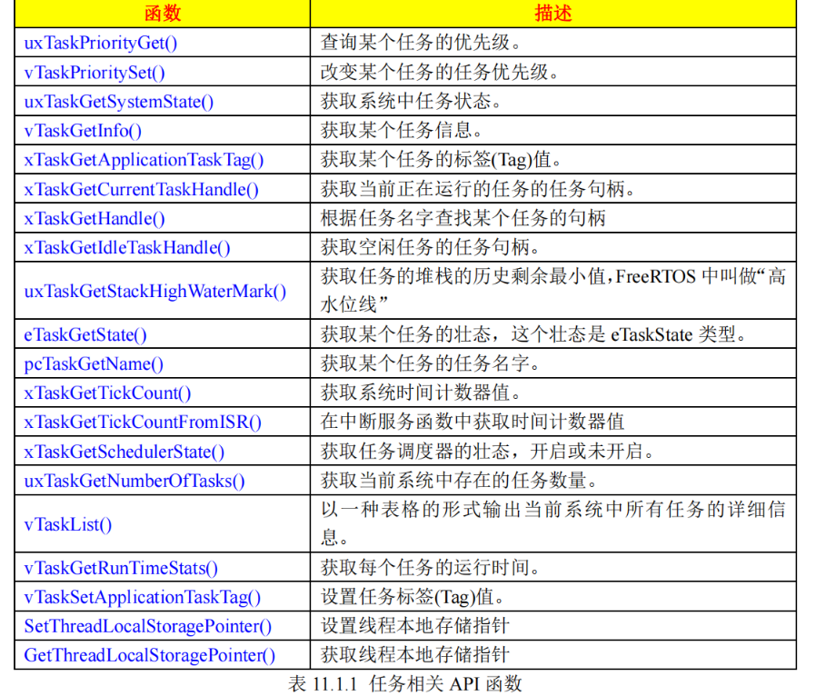

后面再说

# 时间管理

FreeRTOS里面延时函数有相对模式和绝对模式

vTaskDelay()是相对模式，vTaskDelayUntil()是绝对模式

## vTaskDelay()

相对延时，当任务执行到末尾的延时函数才会开始延时

```c
#if ( INCLUDE_vTaskDelay == 1 )

void vTaskDelay( const TickType_t xTicksToDelay )
{
    BaseType_t xAlreadyYielded = pdFALSE;

    /* 如果延时时间为 0，只是强制进行一次任务切换，不做延时 */
    if( xTicksToDelay > ( TickType_t ) 0U )
    {
        /* 断言：调度器必须处于运行状态，不能被挂起 */
        configASSERT( uxSchedulerSuspended == 0 );

        /* 挂起调度器，防止在操作延时链表时被中断打断 */
        vTaskSuspendAll();
        {
            traceTASK_DELAY();  /* 供调试或追踪使用 */

            /* 当前正在运行的任务不会出现在事件列表中，
               所以可以安全地将其加入到延时链表（阻塞列表）中。*/
            prvAddCurrentTaskToDelayedList( xTicksToDelay, pdFALSE );
        }

        /* 恢复调度器（让其他任务可以运行）；
           返回值表示是否已经发生任务切换 */
        xAlreadyYielded = xTaskResumeAll();
    }
    else
    {
        /* 延时时间为 0，什么也不做（但会触发一次任务切换） */
        mtCOVERAGE_TEST_MARKER();
    }

    /* 如果恢复调度器后没有进行任务切换，
       则在这里强制进行一次任务切换。*/
    if( xAlreadyYielded == pdFALSE )
    {
        portYIELD_WITHIN_API();   /* 主动触发 PendSV 进行上下文切换 */
    }
    else
    {
        mtCOVERAGE_TEST_MARKER();
    }
}

#endif /* INCLUDE_vTaskDelay */

```


```c
调用 vTaskDelay(xTicksToDelay)
 │
 ├─ 判断延时时间 xTicksToDelay 是否 > 0？
 │      │
 │      ├─ 否 (==0)
 │      │     └─ 不延时，只是强制任务切换 → portYIELD_WITHIN_API()
 │      │
 │      └─ 是 (>0)
 │           │
 │           ├─ 断言检查：调度器未挂起 (uxSchedulerSuspended == 0)
 │           │
 │           ├─ vTaskSuspendAll()
 │           │     └─ 暂停调度器，防止并发修改链表
 │           │
 │           ├─ traceTASK_DELAY()        ← 记录 trace 信息
 │           │
 │           ├─ prvAddCurrentTaskToDelayedList(xTicksToDelay, pdFALSE)
 │           │     └─ 将当前任务从就绪链表移除
 │           │     └─ 根据唤醒时间加入正确的延时链表
 │           │
 │           ├─ xAlreadyYielded = xTaskResumeAll()
 │           │     └─ 恢复调度器，可能发生任务切换
 │           │
 │           └─ 如果 xAlreadyYielded == pdFALSE
 │                 └─ 手动触发一次上下文切换 → portYIELD_WITHIN_API()
 │
 └─ 结束，任务被阻塞直到延时到期由 SysTick 唤醒

```


prvAddCurrentTaskToDelayedList

懒得解释了，这里会涉及到两个延时列表


## 延时列表

内核维护两个链表：**当前延时链表（Delayed List）** 和 **溢出延时链表（Overflow Delayed List）**。

新加入待唤醒任务会根据它的 `wakeTime`（当前 xTickCount+ delay）与当前 `xTickCount` 的关系选择放到哪个链表：

- 如果 `wakeTime` **>=** `xTickCount`（在当前 tick 之后到期） → 放到 **当前延时链表**；
- 如果 `wakeTime` **<** `xTickCount`（意味着它的到期时间在计数器溢出之后） → 放到 **溢出延时链表**。

当系统 `xTickCount` 发生 **溢出（从最大值回到 0）** 时，内核会**交换两条链表的角色**：把原来的溢出链表变成“当前延时链表”继续被检查，而原来的当前链表变成新的溢出链表。这样所有任务到期判断仍然只需检查“当前延时链表”的表头。


假设 tick 是 8 位（0..255）只是示例：

- 当前 `xTickCount = 250`。
- 你创建任务 A：delay = 10 → `wakeTime = 250 + 10 = 260 -> 260 mod 256 = 4`。
  - 4 < 250，所以 A 的 `wakeTime` 在 wrap 后，应放到 **溢出链表**。
- 你创建任务 B：delay = 3 → `wakeTime = 253`，253 >= 250 → 放 **当前链表**。
- 内核每 tick 检查当前链表表头（比如 B 会在 253 达到并唤醒）。
- 当 `xTickCount` 从 255 增加到 0（溢出）时，内核把 **溢出链表** 换成“当前链表”，现在表头会是 A（wakeTime=4），内核继续按顺序唤醒。

这样就避免了对 A 的 `wakeTime` 做特殊变换或对所有任务重排，逻辑干净且高效。

```c
添加延时任务 (wakeTime = xTickCount + delay)
 │
 ├─ 如果 wakeTime >= xTickCount
 │     └─ 放入 pxDelayedTaskList（当前延时链表，按 wakeTime 有序）
 │
 └─ 否则 (wakeTime < xTickCount，即跨 wrap)
       └─ 放入 pxOverflowDelayedTaskList（溢出链表，按 wakeTime 有序）

每个 SysTick:
 │
 ├─ xTickCount++
 │
 ├─ 检查 pxDelayedTaskList 的表头：
 │     ├─ 若 head.wakeTime <= xTickCount → 移任务到就绪表（prvAddTaskToReadyList）
 │     └─ 否 → 不再有到期任务（链表有序）
 │
 ├─ 若 xTickCount 溢出（由 max -> 0）:
 │     └─ 交换 pxDelayedTaskList 与 pxOverflowDelayedTaskList
 │
 ▼
重复
```


## vTaskDelayUntil()

绝对延时，从进入任务就开始记录时间

```c
void vTaskDelayUntil( TickType_t * const pxPreviousWakeTime, const TickType_t xTimeIncrement )
{
    TickType_t xTimeToWake;              /* 计算下一次唤醒时间 */
    BaseType_t xAlreadyYielded;          /* 是否已发生任务切换 */
    BaseType_t xShouldDelay = pdFALSE;   /* 是否需要延时 */

    /* 参数检查 */
    configASSERT( pxPreviousWakeTime );      /* 必须传入上次唤醒时间指针 */
    configASSERT( ( xTimeIncrement > 0U ) ); /* 周期不能为0 */
    configASSERT( uxSchedulerSuspended == 0 ); /* 调度器不能被挂起 */

    /* 暂停调度器，防止修改链表时发生切换 */
    vTaskSuspendAll();
    {
        /* 读取当前系统节拍计数 */
        const TickType_t xConstTickCount = xTickCount;

        /* 计算下一次唤醒时间 */
        xTimeToWake = *pxPreviousWakeTime + xTimeIncrement;

        /* 判断是否需要延时（考虑 tick 溢出情况） */
        if( xConstTickCount < *pxPreviousWakeTime )
        {
            /* Tick 溢出场景：
               只有在唤醒时间也溢出且大于当前 tick 时才需要延时 */
            if( ( xTimeToWake < *pxPreviousWakeTime ) && ( xTimeToWake > xConstTickCount ) )
            {
                xShouldDelay = pdTRUE;
            }
        }
        else
        {
            /* 正常场景（未溢出）：
               当前 tick 小于唤醒时间时才需要延时 */
            if( ( xTimeToWake < *pxPreviousWakeTime ) || ( xTimeToWake > xConstTickCount ) )
            {
                xShouldDelay = pdTRUE;
            }
        }

        /* 更新上一次唤醒时间，便于下一次周期计算 */
        *pxPreviousWakeTime = xTimeToWake;

        /* 如果确实还没到唤醒时间，就进行延时 */
        if( xShouldDelay != pdFALSE )
        {
            traceTASK_DELAY_UNTIL( xTimeToWake );

            /* 将当前任务加入延时链表：
               参数是“延时时长”，而不是“绝对唤醒时间” */
            prvAddCurrentTaskToDelayedList( xTimeToWake - xConstTickCount, pdFALSE );
        }
    }

    /* 恢复调度器，可能触发任务切换 */
    xAlreadyYielded = xTaskResumeAll();

    /* 如果没有发生任务切换，则手动触发 */
    if( xAlreadyYielded == pdFALSE )
    {
        portYIELD_WITHIN_API();
    }
}

```

```c
调用 vTaskDelayUntil(pxPreviousWakeTime, xTimeIncrement)
 │
 ├─ 参数检查
 │     ├─ pxPreviousWakeTime 是否为空？
 │     ├─ xTimeIncrement 是否 > 0？
 │     └─ 调度器是否未挂起？
 │
 ├─ vTaskSuspendAll()  → 暂停调度器
 │
 ├─ 读取当前系统节拍计数 xTickCount
 │
 ├─ 计算下一次唤醒时间：
 │       xTimeToWake = *pxPreviousWakeTime + xTimeIncrement
 │
 ├─ 判断是否需要延时（考虑 tick 溢出）
 │     ├─ 如果当前 tick 小于上次唤醒时间 → tick 发生溢出
 │     │     └─ 只有当唤醒时间也溢出且大于当前 tick 时才延时
 │     └─ 否则（未溢出）
 │           └─ 若当前 tick < 唤醒时间，则需要延时
 │
 ├─ 更新 *pxPreviousWakeTime = xTimeToWake
 │
 ├─ 若 xShouldDelay == TRUE
 │     └─ 调用 prvAddCurrentTaskToDelayedList(xTimeToWake - xConstTickCount)
 │           └─ 把任务加入延时链表（阻塞态）
 │
 ├─ xAlreadyYielded = xTaskResumeAll()  → 恢复调度器
 │
 ├─ 如果尚未触发任务切换
 │     └─ 调用 portYIELD_WITHIN_API() 强制切换
 │
 └─ 函数结束，任务被阻塞直到指定唤醒时刻到来

```

## 两种延时对比

相对延时，执行到末尾才计时

```markdown
时间(ms):   0       10        110       120       220       230       330
             |-------|---------|---------|---------|---------|---------|
执行阶段:   [执行10] [延时100] [执行10] [延时100] [执行10] [延时100]
任务运行点:  0ms --->110ms--->220ms--->330ms ...
```


绝对延时,从任务开始就计时

```c
时间(ms) → 0         10        100        110        200        210        300
            |----------|---------|----------|----------|----------|----------|
            ↑执行10ms  ↑延时90ms ↑执行10ms  ↑延时90ms ↑执行10ms  ↑延时90ms
任务执行点: 0ms------>100ms---->200ms---->300ms ...
周期长度 : 精确100ms 每次恒定不变

```

## 任务锁(调度器挂起与恢复)

```c
BaseType_t xTaskResumeAll( void )
{
    TCB_t *pxTCB = NULL;
    BaseType_t xAlreadyYielded = pdFALSE;

    /* 断言：必须先调用过 vTaskSuspendAll() 才能调用本函数 */
    configASSERT( uxSchedulerSuspended );

    taskENTER_CRITICAL();
    {
        /* 调度器暂停计数减一 */
        --uxSchedulerSuspended;

        /* 如果计数已减到0，说明调度器可以恢复 */
        if( uxSchedulerSuspended == ( UBaseType_t ) pdFALSE )
        {
            if( uxCurrentNumberOfTasks > 0U )
            {
                /* 将暂停期间被唤醒的任务，从 xPendingReadyList
                   移动到对应的就绪队列 */
                while( listLIST_IS_EMPTY( &xPendingReadyList ) == pdFALSE )
                {
                    /* 获取列表头的任务控制块 */
                    pxTCB = ( TCB_t * ) listGET_OWNER_OF_HEAD_ENTRY( &xPendingReadyList );

                    /* 从挂起列表和事件列表中移除 */
                    ( void ) uxListRemove( &( pxTCB->xEventListItem ) );
                    ( void ) uxListRemove( &( pxTCB->xStateListItem ) );

                    /* 放入对应优先级的就绪列表中 */
                    prvAddTaskToReadyList( pxTCB );

                    /* 如果该任务优先级 ≥ 当前任务，则标记需要切换 */
                    if( pxTCB->uxPriority >= pxCurrentTCB->uxPriority )
                    {
                        xYieldPending = pdTRUE;
                    }
                }

                /* 若确实有任务被移动过，重新计算下一个解除阻塞时间 */
                if( pxTCB != NULL )
                {
                    prvResetNextTaskUnblockTime();
                }

                /* 处理暂停期间累积的时钟节拍 (uxPendedTicks) */
                {
                    UBaseType_t uxPendedCounts = uxPendedTicks;

                    if( uxPendedCounts > 0U )
                    {
                        do
                        {
                            /* 处理每个挂起的节拍 */
                            if( xTaskIncrementTick() != pdFALSE )
                            {
                                /* 若有任务超时到期，则触发调度 */
                                xYieldPending = pdTRUE;
                            }
                            --uxPendedCounts;
                        } while( uxPendedCounts > 0U );

                        /* 所有挂起的tick已处理完 */
                        uxPendedTicks = 0;
                    }
                }

                /* 如果标记了需要切换任务 */
                if( xYieldPending != pdFALSE )
                {
#if( configUSE_PREEMPTION != 0 )
                    xAlreadyYielded = pdTRUE;
#endif
                    /* 如果启用了抢占，则触发任务切换 */
                    taskYIELD_IF_USING_PREEMPTION();
                }
            }
        }
    }
    taskEXIT_CRITICAL();

    /* 返回是否已执行过一次任务切换 */
    return xAlreadyYielded;
}

```


```c
vTaskSuspendAll()  调用过 → uxSchedulerSuspended++

      ↓
xTaskResumeAll()
      │
      ├─ 检查断言：确保确实被暂停过
      ├─ taskENTER_CRITICAL()   // 关中断，进入临界区
      │
      ├─ uxSchedulerSuspended--   // 减少暂停计数
      │
      ├─ 判断是否恢复到0
      │    └─ 是 → 恢复调度流程
      │
      │     ├─ 若有任务 → 开始处理
      │     │
      │     ├─ 循环移动 xPendingReadyList 中的任务
      │     │      ├─ 从事件/挂起列表移除
      │     │      ├─ 放入就绪队列
      │     │      └─ 若优先级高于当前 → 标记需切换
      │     │
      │     ├─ 若有任务移动 → 重新计算下次唤醒时间
      │     │
      │     ├─ 检查是否有挂起的节拍 (uxPendedTicks)
      │     │      ├─ 调用 xTaskIncrementTick() 更新系统节拍
      │     │      └─ 若有任务到期 → 标记需切换
      │     │
      │     ├─ 若 xYieldPending = TRUE
      │     │      ├─ 抢占模式下 → 立即触发上下文切换
      │     │      └─ 设置返回值 xAlreadyYielded = TRUE
      │     │
      │     └─ 否则不切换
      │
      └─ taskEXIT_CRITICAL()
      ↓
返回 xAlreadyYielded (表示是否已切换任务)

```


systick中断函数会调用它

```c
BaseType_t xTaskIncrementTick(void)
{
    TCB_t *pxTCB;               // 当前要处理的任务控制块指针
    TickType_t xItemValue;      // 存储任务的唤醒时间
    BaseType_t xSwitchRequired = pdFALSE;  // 是否需要切换任务的标志

    traceTASK_INCREMENT_TICK(xTickCount);  // 可选的调试跟踪

    /* 如果调度器没有被暂停 */
    if (uxSchedulerSuspended == (UBaseType_t)pdFALSE)
    {
        const TickType_t xConstTickCount = xTickCount + 1;

        /* 1️⃣ 递增系统节拍计数 */
        xTickCount = xConstTickCount;

        /* 若计数溢出，从头开始——交换两个延时链表 */
        if (xConstTickCount == (TickType_t)0U)
        {
            taskSWITCH_DELAYED_LISTS();   // 切换主延时表与溢出表
        }

        /* 2️⃣ 检查是否有任务到期需要解阻 */
        if (xConstTickCount >= xNextTaskUnblockTime)
        {
            for (;;)
            {
                if (listLIST_IS_EMPTY(pxDelayedTaskList))
                {
                    // 延时链表为空，没有任务要解阻
                    xNextTaskUnblockTime = portMAX_DELAY;
                    break;
                }

                // 获取链表头部任务（最先到期的）
                pxTCB = (TCB_t *)listGET_OWNER_OF_HEAD_ENTRY(pxDelayedTaskList);
                xItemValue = listGET_LIST_ITEM_VALUE(&(pxTCB->xStateListItem));

                if (xConstTickCount < xItemValue)
                {
                    // 还没到唤醒时间，记录下次要解阻的时刻
                    xNextTaskUnblockTime = xItemValue;
                    break;
                }

                // ⏰ 已到时间 → 从延时链表移除
                (void)uxListRemove(&(pxTCB->xStateListItem));

                // 若该任务还在事件等待链表，也移除
                if (listLIST_ITEM_CONTAINER(&(pxTCB->xEventListItem)) != NULL)
                {
                    (void)uxListRemove(&(pxTCB->xEventListItem));
                }

                // 放入对应优先级的就绪链表
                prvAddTaskToReadyList(pxTCB);

                /* 若启用抢占调度，则比较优先级 */
#if (configUSE_PREEMPTION == 1)
                if (pxTCB->uxPriority >= pxCurrentTCB->uxPriority)
                {
                    xSwitchRequired = pdTRUE;   // 需要切换任务
                }
#endif
            }
        }

        /* 3️⃣ 时间片调度（同优先级任务轮流执行） */
#if ((configUSE_PREEMPTION == 1) && (configUSE_TIME_SLICING == 1))
        if (listCURRENT_LIST_LENGTH(&(pxReadyTasksLists[pxCurrentTCB->uxPriority])) > 1)
        {
            xSwitchRequired = pdTRUE;
        }
#endif

        /* 4️⃣ 可选 Tick Hook 回调 */
#if (configUSE_TICK_HOOK == 1)
        if (uxPendedTicks == (UBaseType_t)0U)
        {
            vApplicationTickHook();   // 用户定义的 Tick 回调函数
        }
#endif
    }
    else
    {
        /* 若调度器暂停，则不处理任务，只记录挂起节拍数 */
        ++uxPendedTicks;

#if (configUSE_TICK_HOOK == 1)
        vApplicationTickHook();
#endif
    }

    /* 5️⃣ 若有任务已被标记为需要切换，则返回真 */
#if (configUSE_PREEMPTION == 1)
    if (xYieldPending != pdFALSE)
    {
        xSwitchRequired = pdTRUE;
    }
#endif

    return xSwitchRequired;   // 返回是否需要切换任务
}

```


```c
系统 Tick 中断触发
        │
        ▼
调用 xTaskIncrementTick()
        │
        ├─ 判断调度器是否暂停？
        │     │
        │     ├─ 否 → 继续执行
        │     │
        │     └─ 是 → uxPendedTicks++（仅记录节拍）→ 返回
        │
        ├─ 递增节拍计数 xTickCount++
        │
        ├─ 若 Tick 溢出（回到 0）→ 交换两个延时链表
        │
        ├─ 判断是否有任务到期解阻：
        │     ├─ 无任务 → 设置 xNextTaskUnblockTime = MAX
        │     └─ 有任务：
        │           ├─ 从延时链表移除
        │           ├─ 若在事件链表中 → 一并移除
        │           └─ 加入就绪链表
        │
        ├─ 若解阻任务优先级 ≥ 当前任务 → 标记需切换
        │
        ├─ 若启用时间片调度：
        │     ├─ 同优先级就绪任务数量 > 1 → 标记切换
        │
        ├─ 若启用 Tick Hook → 调用用户钩子函数
        │
        └─ 返回是否需要任务切换标志 xSwitchRequired

```

任务进入临界区，会屏蔽掉SYSTICK中断和PENDSV，所以不会进行任务调度和中断


# 队列

## 结构

没有操作系统话，不同函数间传递信息是通过全局变量。有操作系统就是队列

将数据传入队列，分为值传递和引用传递，前者会发生数据拷贝，速度较慢，但是队列想删就删，不会影响到原来的；后者速度较快，但是队列里面的删除操作会影响本身。

结合二者优点，可以传入指向变量地址的指针

```c
typedef struct QueueDefinition
{
    /* === 存储区域管理指针 === */
    int8_t *pcHead;                 /*< 指向队列存储区的起始位置 */
    int8_t *pcTail;                 /*< 指向队列存储区的结束字节。分配比存储队列项所需多一个字节，用作标记 */
    int8_t *pcWriteTo;              /*< 指向存储区中下一个空闲位置 */

    /* === 互斥使用联合体 === */
    union                           
    {
        int8_t *pcReadFrom;         /*< 当结构用作队列时，指向最后一个读取项的位置 */
        UBaseType_t uxRecursiveCallCount; /*< 当结构用作递归互斥量时，维护递归获取的次数计数 */
    } u;

    /* === 任务等待列表 === */
    List_t xTasksWaitingToSend;     /*< 等待向此队列发送数据的阻塞任务列表。按优先级顺序存储 */
    List_t xTasksWaitingToReceive;  /*< 等待从此队列接收数据的阻塞任务列表。按优先级顺序存储 */

    /* === 队列状态信息 === */
    volatile UBaseType_t uxMessagesWaiting; /*< 当前队列中的项目数量 */
    UBaseType_t uxLength;           /*< 队列的长度，定义为它能容纳的项目数量，不是字节数 */
    UBaseType_t uxItemSize;         /*< 队列将容纳的每个项目的大小 */

    /* === 队列锁定机制 === */
    volatile int8_t cRxLock;        /*< 存储队列锁定时从队列接收（移除）的项目数量。队列未锁定时设置为queueUNLOCKED */
    volatile int8_t cTxLock;        /*< 存储队列锁定时向队列传输（添加）的项目数量。队列未锁定时设置为queueUNLOCKED */

    /* === 内存分配标识 === */
    #if( ( configSUPPORT_STATIC_ALLOCATION == 1 ) && ( configSUPPORT_DYNAMIC_ALLOCATION == 1 ) )
        uint8_t ucStaticallyAllocated; /*< 如果队列使用的内存是静态分配的，则设置为pdTRUE，确保不会尝试释放内存 */
    #endif

    /* === 队列集支持 === */
    #if ( configUSE_QUEUE_SETS == 1 )
        struct QueueDefinition *pxQueueSetContainer; /*< 指向此队列所属的队列集 */
    #endif

    /* === 跟踪调试支持 === */
    #if ( configUSE_TRACE_FACILITY == 1 )
        UBaseType_t uxQueueNumber;  /*< 队列编号，用于调试跟踪 */
        uint8_t ucQueueType;        /*< 队列类型标识 */
    #endif

} xQUEUE;

/* 旧的xQUEUE名称在上面维护，然后在下面typedef为新的Queue_t名称，以便使用较旧的内核感知调试器 */
typedef xQUEUE Queue_t;
```


最终完成队列创建函数

该函数主要是分配内存，然后再调用其他函数初始化队列

```c
#if ( configSUPPORT_DYNAMIC_ALLOCATION == 1 )  // 若允许动态内存分配

QueueHandle_t xQueueGenericCreate(
    const UBaseType_t uxQueueLength,   // 队列长度：最大消息个数
    const UBaseType_t uxItemSize,      // 每条消息的字节大小
    const uint8_t ucQueueType          // 队列类型
)
{
    Queue_t *pxNewQueue;        // 指向队列控制结构体（Queue_t）
    size_t xQueueSizeInBytes;   // 队列用于存放消息的数据区大小（字节）
    uint8_t *pucQueueStorage;   // 指向队列中存放消息的内存起始位置

    configASSERT( uxQueueLength > 0 ); // 队列长度必须大于 0

    /* 计算队列数据区大小 */
    if( uxItemSize == 0 )
    {
        // 如果每个元素大小为 0（如信号量），则不需要额外的数据存储区
        xQueueSizeInBytes = 0;
    }
    else
    {
        // 队列中最多能存放 uxQueueLength 个元素
        xQueueSizeInBytes = ( size_t )( uxQueueLength * uxItemSize );
    }

    /* 🧱 动态分配内存：
       先分配 Queue_t 控制块，再紧接着分配数据区。
       +-------------------+------------------------+
       |   Queue_t结构体   |     队列消息缓冲区     |
       +-------------------+------------------------+
    */
    pxNewQueue = ( Queue_t * ) pvPortMalloc( sizeof( Queue_t ) + xQueueSizeInBytes );

    if( pxNewQueue != NULL )
    {
        /* 计算数据区起始地址：
           跳过结构体部分，就是消息存储区的起点 */
        pucQueueStorage = ( ( uint8_t * ) pxNewQueue ) + sizeof( Queue_t );

#if( configSUPPORT_STATIC_ALLOCATION == 1 )
        {
            // 标记该队列是动态创建的（方便删除时区分）
            pxNewQueue->ucStaticallyAllocated = pdFALSE;
        }
#endif

        /* 初始化新队列结构体 */
        prvInitialiseNewQueue(
            uxQueueLength,     // 队列长度
            uxItemSize,        // 每个消息大小
            pucQueueStorage,   // 存储区首地址
            ucQueueType,       // 队列类型
            pxNewQueue         // 队列结构体指针
        );
    }

    return pxNewQueue;  // 返回队列句柄（即 Queue_t 指针）
}

#endif /* configSUPPORT_DYNAMIC_ALLOCATION */

```


```c
xQueueGenericCreate()
        │
        ├─▶ 检查参数合法性 (uxQueueLength > 0)
        │
        ├─▶ 计算数据区大小：
        │       uxItemSize == 0 ? 0 : uxQueueLength * uxItemSize
        │
        ├─▶ 动态申请内存：
        │       总大小 = sizeof(Queue_t) + 数据区大小
        │
        ├─▶ 若申请成功：
        │       ├─ 计算数据区起始地址
        │       ├─ 若支持静态分配，则标记为“动态创建”
        │       └─ 调用 prvInitialiseNewQueue() 初始化结构体
        │
        ├─▶ 若申请失败：
        │       └─ 返回 NULL
        │
        └─▶ 返回队列句柄 (QueueHandle_t)

```


在 `xQueueGenericCreate()` 分配好内存后，对队列的内部成员进行初始化，包括数据缓冲区起始地址、队列长度、元素大小、类型、状态等。

```c
static void prvInitialiseNewQueue(
    const UBaseType_t uxQueueLength,   // 队列长度（最大消息数量）
    const UBaseType_t uxItemSize,      // 每个消息的字节大小
    uint8_t *pucQueueStorage,          // 队列消息存储区起始地址
    const uint8_t ucQueueType,         // 队列类型
    Queue_t *pxNewQueue                // 指向新建的队列控制结构体
)
{
    /* 防止未使用 ucQueueType 产生编译警告 */
    ( void ) ucQueueType;

    /* ========== 1️⃣ 设置队列存储区头指针 ========== */
    if( uxItemSize == ( UBaseType_t ) 0 )
    {
        /* 如果元素大小为 0，说明该队列不需要消息缓冲区（如信号量、互斥量）。
           但 pcHead 不能为 NULL，因为 NULL 在内部代表“该队列是互斥量”。
           所以将 pcHead 指向自身 pxNewQueue，只要它不是 NULL 就行。 */
        pxNewQueue->pcHead = ( int8_t * ) pxNewQueue;
    }
    else
    {
        /* 普通消息队列，pcHead 指向分配的消息缓冲区起始地址 */
        pxNewQueue->pcHead = ( int8_t * ) pucQueueStorage;
    }

    /* ========== 2️⃣ 设置队列基本属性 ========== */
    pxNewQueue->uxLength = uxQueueLength;  // 队列最大容量（消息数量）
    pxNewQueue->uxItemSize = uxItemSize;   // 每条消息的字节大小

    /* 调用 xQueueGenericReset() 初始化其他运行时状态：
       - pcTail、pcReadFrom、pcWriteTo 等指针
       - 队列为空、消息数清零
       - 等待任务列表初始化
       - 若参数 pdTRUE，则表示新创建的队列（会解锁任务调度） */
    ( void ) xQueueGenericReset( pxNewQueue, pdTRUE );

    /* ========== 3️⃣ 若启用追踪功能，则记录队列类型 ========== */
#if ( configUSE_TRACE_FACILITY == 1 )
    {
        pxNewQueue->ucQueueType = ucQueueType;
    }
#endif

    /* ========== 4️⃣ 若启用队列集（Queue Set）功能，则置空指针 ========== */
#if( configUSE_QUEUE_SETS == 1 )
    {
        pxNewQueue->pxQueueSetContainer = NULL;
    }
#endif

    /* ========== 5️⃣ 发送创建队列的 trace 事件 ========== */
    traceQUEUE_CREATE( pxNewQueue );
}

```


```c
prvInitialiseNewQueue()
        │
        ├─▶ 判断 uxItemSize
        │     ├─ 若为 0 → 无需缓冲区，将 pcHead 指向自身 (互斥量/信号量)
        │     └─ 若非 0 → 将 pcHead 指向分配的消息存储区首地址
        │
        ├─▶ 初始化基本属性：
        │     │  uxLength ← 队列长度
        │     │  uxItemSize ← 每条消息大小
        │
        ├─▶ 调用 xQueueGenericReset()
        │     │  设置 pcTail、pcReadFrom、pcWriteTo
        │     │  初始化任务等待列表
        │     │  清空消息计数
        │
        ├─▶ 若启用 trace：记录 ucQueueType
        │
        ├─▶ 若启用 Queue Set：pxQueueSetContainer = NULL
        │
        └─▶ traceQUEUE_CREATE() 打印创建事件
```


xQueueGenericReset()

**将队列重置为初始状态**，包括清空消息、重新设置读写指针、初始化等待任务列表等。
 如果是刚创建的队列（`xNewQueue = pdTRUE`），还会初始化队列的任务等待列表

```c
BaseType_t xQueueGenericReset( QueueHandle_t xQueue, BaseType_t xNewQueue )
{
Queue_t * const pxQueue = ( Queue_t * ) xQueue;
BaseType_t xReturn = pdPASS;

	configASSERT( pxQueue );

	taskENTER_CRITICAL();
	{
		/* ========== 1️⃣ 初始化消息存储区指针 ========== */

		/* 写指针指向队列起始位置 */
		pxQueue->u.xQueue.pcTail = pxQueue->pcHead + ( pxQueue->uxLength * pxQueue->uxItemSize );

		/* 当前读指针指向最后一个消息（逻辑上为空） */
		pxQueue->u.xQueue.pcReadFrom = pxQueue->pcHead + ( ( pxQueue->uxLength - 1U ) * pxQueue->uxItemSize );

		/* 队列中消息数清零 */
		pxQueue->uxMessagesWaiting = ( UBaseType_t ) 0U;

		/* 初始化锁计数器，表示当前没有任务在操作队列 */
		pxQueue->xRxLock = queueUNLOCKED;
		pxQueue->xTxLock = queueUNLOCKED;

		/* ========== 2️⃣ 如果是新队列，还需初始化任务等待列表 ========== */
		if( xNewQueue != pdFALSE )
		{
			/* 等待发送的任务列表 */
			vListInitialise( &( pxQueue->xTasksWaitingToSend ) );

			/* 等待接收的任务列表 */
			vListInitialise( &( pxQueue->xTasksWaitingToReceive ) );
		}
		else
		{
			/* 若是旧队列复位，需清空等待列表 */
			if( listLIST_IS_EMPTY( &( pxQueue->xTasksWaitingToSend ) ) == pdFALSE )
			{
				xReturn = pdFAIL; /* 有任务在等队列，不能复位 */
			}

			if( listLIST_IS_EMPTY( &( pxQueue->xTasksWaitingToReceive ) ) == pdFALSE )
			{
				xReturn = pdFAIL;
			}
		}
	}
	taskEXIT_CRITICAL();

	return xReturn;
}

```


```c
xQueueGenericReset()
       │
       ├─▶ 进入临界区（禁止任务切换）
       │
       ├─▶ 初始化队列核心结构：
       │     ├─ pcTail = pcHead + (长度 × 元素大小)
       │     ├─ pcReadFrom = pcHead + ((长度 - 1) × 元素大小)
       │     ├─ uxMessagesWaiting = 0
       │     ├─ xRxLock = queueUNLOCKED
       │     └─ xTxLock = queueUNLOCKED
       │
       ├─▶ 判断是否为新创建队列 (xNewQueue)
       │     ├─ 是：初始化等待任务列表
       │     │      ├─ vListInitialise(xTasksWaitingToSend)
       │     │      └─ vListInitialise(xTasksWaitingToReceive)
       │     └─ 否：检查是否有任务在等待队列
       │            ├─ 若等待列表非空 → 返回 pdFAIL
       │            └─ 否则继续
       │
       ├─▶ 退出临界区
       │
       └─▶ 返回 pdPASS（复位成功）
```


队列创建完成结构

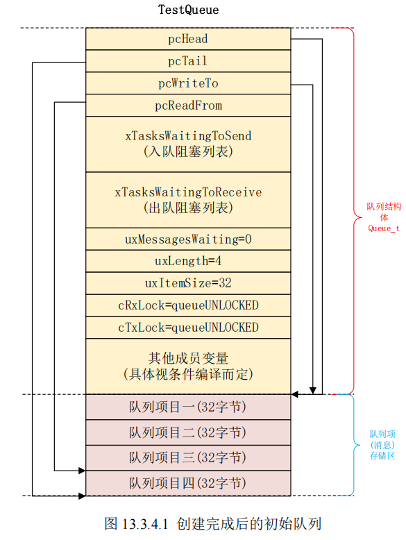

## 发送API

3个主要功能：尾部入队（默认），向前入队，覆写功能

2个级别：中断级别，任务级别

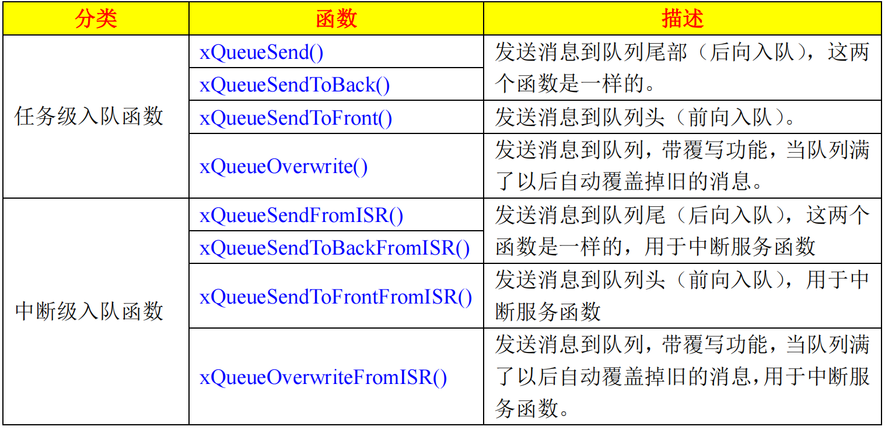


任务级：这些函数参数是队列句柄，要发的消息指针，当队列满后等待有空位的时间（覆写API没有）

中断级：任务级的前两个参数都有，阻塞时间参数没有：阻塞的目的是任务切换，其他任务去对队列进行操作，在中断里面阻塞又没有什么用，不会触发任务调度，所以这个参数没用。<font color='red'>新传入的参数</font>是来保存函数产生的值用的。用户只需要创建这个变量并传入函数，在函数里面回对这个变量进行赋值，来决定是否进行pendSV任务调度

以接收API xTaskWokenByReceive为例，发送API也是一样的

```c
void HAL_TIM_PeriodElapsedCallback(TIM_HandleTypeDef *htim)
{	u8 *buffer;
	BaseType_t xTaskWokenByReceive=pdFALSE;//随便初始化个变量，在接收API里面真正赋值
	BaseType_t err;

	
    if(htim==(&TIM3_Handler))
    {
        FreeRTOSRunTimeTicks++;
    }
	else if(htim==(&TIM9_Handler))
	{
		buffer=mymalloc(SRAMIN,USART_REC_LEN);
        if(Message_Queue!=NULL)
        {
			memset(buffer,0,USART_REC_LEN);	//清除缓冲区
			err=xQueueReceiveFromISR(Message_Queue,buffer,&xTaskWokenByReceive);//请求消息Message_Queue
            if(err==pdTRUE)			//接收到消息
            {
				disp_str(buffer);	//在LCD上显示接收到的消息
            }
        }
		myfree(SRAMIN,buffer);		//释放内存
		
		portYIELD_FROM_ISR(xTaskWokenByReceive);//如果需要的话进行一次任务切换
	}
}

```

xQueueGenericSend

```c
BaseType_t xQueueGenericSend( QueueHandle_t xQueue,
                              const void * const pvItemToQueue,
                              TickType_t xTicksToWait,
                              const BaseType_t xCopyPosition )
{
BaseType_t xEntryTimeSet = pdFALSE;  // 是否已经记录进入时间（用于超时检测）
BaseType_t xYieldRequired;           // 是否需要任务切换
TimeOut_t xTimeOut;                  // 超时结构体
Queue_t * const pxQueue = ( Queue_t * ) xQueue; // 队列控制块指针

	configASSERT( pxQueue ); // 队列不能为空
	configASSERT( !( ( pvItemToQueue == NULL ) && ( pxQueue->uxItemSize != 0 ) ) );

	// 开始一个循环（可能因为队列满被阻塞后再回来继续执行）
	for( ;; )
	{
		taskENTER_CRITICAL(); // 进入临界区（防止中断访问队列）
		{
			/* ✅ Step 1: 判断队列是否有空位（或允许覆盖） */
			if( ( pxQueue->uxMessagesWaiting < pxQueue->uxLength ) ||
				( xCopyPosition == queueOVERWRITE ) )
			{
				traceQUEUE_SEND( pxQueue );

				/* 把数据拷贝到队列中（根据位置是头、尾或覆盖） */
				xYieldRequired = prvCopyDataToQueue( pxQueue, pvItemToQueue, xCopyPosition );

				/* 🔔 Step 2: 若有任务在等待接收队列数据，则唤醒它 */
				if( listLIST_IS_EMPTY( &( pxQueue->xTasksWaitingToReceive ) ) == pdFALSE )
				{
					/* 从事件列表中移除等待接收的任务 */
					if( xTaskRemoveFromEventList( &( pxQueue->xTasksWaitingToReceive ) ) != pdFALSE )
					{
						/* 如果被唤醒任务优先级更高，则立即切换 */
						queueYIELD_IF_USING_PREEMPTION();
					}
				}
				else if( xYieldRequired != pdFALSE )
				{
					/* 特殊情况：若优先级相同，也可能触发切换 */
					queueYIELD_IF_USING_PREEMPTION();
				}

				taskEXIT_CRITICAL();  // 离开临界区
				return pdPASS;        // ✅ 发送成功
			}
			else
			{
				/* ❌ 队列已满 */
				if( xTicksToWait == ( TickType_t ) 0 )
				{
					// 不允许阻塞（立即返回错误）
					taskEXIT_CRITICAL();
					traceQUEUE_SEND_FAILED( pxQueue );
					return errQUEUE_FULL;
				}
				else if( xEntryTimeSet == pdFALSE )
				{
					// 首次检测到队列满，记录当前时间用于超时判断
					vTaskSetTimeOutState( &xTimeOut );
					xEntryTimeSet = pdTRUE;
				}
			}
		}
		taskEXIT_CRITICAL();

		/* 🕒 Step 3: 若队列仍然满，则进入阻塞等待阶段 */
		vTaskSuspendAll();   // 挂起调度器，防止切换
		prvLockQueue( pxQueue ); // 给队列加锁

		if( xTaskCheckForTimeOut( &xTimeOut, &xTicksToWait ) == pdFALSE )
		{
			/* 超时时间未到，继续阻塞等待 */
			if( prvIsQueueFull( pxQueue ) != pdFALSE )
			{
				/* 当前任务进入队列的“发送等待列表” */
				traceBLOCKING_ON_QUEUE_SEND( pxQueue );
				vTaskPlaceOnEventList( &( pxQueue->xTasksWaitingToSend ), xTicksToWait );

				/* 解锁队列后再恢复调度 */
				prvUnlockQueue( pxQueue );

				/* 恢复调度，若没有高优先级任务就自己让出 CPU */
				if( xTaskResumeAll() == pdFALSE )
				{
					portYIELD_WITHIN_API();
				}
			}
			else
			{
				/* 可能在阻塞期间队列空了，重新尝试 */
				prvUnlockQueue( pxQueue );
				( void ) xTaskResumeAll();
			}
		}
		else
		{
			/* 🕓 超时到达，退出等待 */
			prvUnlockQueue( pxQueue );
			( void ) xTaskResumeAll();

			traceQUEUE_SEND_FAILED( pxQueue );
			return errQUEUE_FULL;
		}
	}
}

```


```c
xQueueGenericSend()
│
├─▶ 进入临界区
│     ├─ 若队列未满 → 拷贝数据到队列
│     │       ├─ 唤醒等待接收任务
│     │       ├─ 可能触发任务切换
│     │       └─ 返回 pdPASS
│     └─ 若队列已满：
│             ├─ xTicksToWait = 0 → 立即返回 errQUEUE_FULL
│             └─ 否则记录超时起点 (xEntryTimeSet = TRUE)
│
├─▶ 退出临界区
│
├─▶ 挂起调度器 → 锁定队列
│
├─▶ 检查是否超时：
│     ├─ 未超时：
│     │     ├─ 若仍满 → 当前任务加入 xTasksWaitingToSend
│     │     ├─ 解锁队列 → 恢复调度
│     │     └─ 若需要则让出 CPU
│     └─ 已超时：
│           ├─ 解锁队列
│           └─ 返回 errQUEUE_FULL
│
└─▶ 若被唤醒 → 重新进入循环再判断队列状态

```

中断版的懒得看，反正看不懂


## 上锁和解锁

## 🧩 一、为什么要有“锁”？

在 FreeRTOS 里，**队列（queue）其实是多任务共享的资源**。
 可能有：

- 一个任务在往队列“发消息”（Send）
- 另一个任务在从队列“取消息”（Receive）
- 同时，还有中断、定时器也在操作这个队列！

👉 所以必须保证队列在修改时不会被打断或被别人改乱。
 于是 FreeRTOS 设计了**“队列上锁”机制**。

------

## 🧱 二、什么叫“上锁”？

简单理解：

> **上锁（Lock）= 暂时禁止任务切换或事件唤醒**，但**不禁止数据读写**。

也就是说：

- 队列“被锁住”时，**还能往里面放数据、取数据**；
- 但不能立刻“唤醒等待的任务”，这个动作要**延后到解锁时再做**。

------

## 🧠 三、那为什么要延后唤醒？

举个实际例子：

1️⃣ 当前系统调用 `vTaskSuspendAll()` 暂停调度器（scheduler）。
 → 此时**任务切换被禁止**。

2️⃣ 某个任务在暂停状态下往队列里 `xQueueSend()`：

- FreeRTOS 允许你在调度暂停时发送；
- 但如果这次发送**让另一个等待接收的任务可以运行**，
   它 **不能马上被唤醒**（因为调度被暂停！）。

3️⃣ 所以 FreeRTOS 说：

> 我先记下来：“有任务需要被唤醒”，用 `cTxLock++` 或 `cRxLock++` 计数。

等调度恢复时再统一唤醒。

这就是“上锁”的意义：

> **不阻止操作队列，只是延后任务唤醒动作**。


上面的函数涉及到了队列的解锁与上锁

上锁是一个宏

```c
#define prvLockQueue( pxQueue )								\
	taskENTER_CRITICAL();									\
	{														\
		if( ( pxQueue )->cRxLock == queueUNLOCKED )			\
		{													\
			( pxQueue )->cRxLock = queueLOCKED_UNMODIFIED;	\
		}													\
		if( ( pxQueue )->cTxLock == queueUNLOCKED )			\
		{													\
			( pxQueue )->cRxLock = queueLOCKED_UNMODIFIED;	\
		}													\
	}														\
	taskEXIT_CRITICAL()
```

cRxLock，cTxLock这两个没上锁的话就上锁

| 计数器    | 名称   | 增加时机                                                     | 对应唤醒的任务                            |
| --------- | ------ | ------------------------------------------------------------ | ----------------------------------------- |
| `cTxLock` | 发送锁 | **有任务往队列里“发送数据”**（队列加锁期间）,数据会写入，但是不会因为写入发生任务调度，而是加入到xTasksWaitingToReceive | 唤醒“接收任务” (`xTasksWaitingToReceive`) |
| `cRxLock` | 接收锁 | **有任务从队列里“接收数据”**（队列加锁期间），数据会读出，但是不会因为读出发生任务调度，而是加入到xTasksWaitingToSend | 唤醒“发送任务” (`xTasksWaitingToSend`)    |

解锁时才唤醒，从对应列表里面取出任务执行，并且Lock- -


```c
static void prvUnlockQueue( Queue_t * const pxQueue )
{
	/* ⚠️ 调用此函数时，调度器必须处于挂起状态（防止立即任务切换） */

	/* =======================================================
	 * 第一部分：处理 “发送锁” (TxLock)
	 * =======================================================
	 * TxLock 表示在队列被锁住时，有多少次“发送”操作发生。
	 * 当解锁时，需要唤醒等待接收数据的任务。
	 */
	taskENTER_CRITICAL();
	{
		int8_t cTxLock = pxQueue->cTxLock;  // 取出发送锁计数

		while( cTxLock > queueLOCKED_UNMODIFIED ) // 若有数据在锁期间被发送
		{
			#if ( configUSE_QUEUE_SETS == 1 )
			{
				// 若该队列属于某个 QueueSet
				if( pxQueue->pxQueueSetContainer != NULL )
				{
					// 通知 QueueSet，有新数据到达
					if( prvNotifyQueueSetContainer( pxQueue, queueSEND_TO_BACK ) != pdFALSE )
					{ 
						// 若有高优先级任务被唤醒，则标记需要切换任务
						vTaskMissedYield();
					}
				}
				else
				{
					// ⚡ 队列独立使用：唤醒等待“接收”的任务
					if( listLIST_IS_EMPTY( &( pxQueue->xTasksWaitingToReceive ) ) == pdFALSE )
					{
						if( xTaskRemoveFromEventList( &( pxQueue->xTasksWaitingToReceive ) ) != pdFALSE )
						{
							vTaskMissedYield(); // 有高优先级任务需要切换
						}
					}
					else
					{
						break; // 没有等待接收任务，退出循环
					}
				}
			}
			#else /* 未使用 QueueSet */
			{
				if( listLIST_IS_EMPTY( &( pxQueue->xTasksWaitingToReceive ) ) == pdFALSE )
				{
					if( xTaskRemoveFromEventList( &( pxQueue->xTasksWaitingToReceive ) ) != pdFALSE )
					{
						vTaskMissedYield(); // 记录一次任务切换请求
					}
				}
				else
				{
					break;
				}
			}
			#endif /* configUSE_QUEUE_SETS */

			--cTxLock; // 每次处理一个发送事件
		}

		/* 解锁发送方向 */
		pxQueue->cTxLock = queueUNLOCKED;
	}
	taskEXIT_CRITICAL();


	/* =======================================================
	 * 第二部分：处理 “接收锁” (RxLock)
	 * =======================================================
	 * RxLock 表示在队列被锁住时，有多少次“接收”操作发生。
	 * 解锁时要唤醒等待发送数据的任务。
	 */
	taskENTER_CRITICAL();
	{
		int8_t cRxLock = pxQueue->cRxLock;

		while( cRxLock > queueLOCKED_UNMODIFIED )
		{
			if( listLIST_IS_EMPTY( &( pxQueue->xTasksWaitingToSend ) ) == pdFALSE )
			{
				if( xTaskRemoveFromEventList( &( pxQueue->xTasksWaitingToSend ) ) != pdFALSE )
				{
					vTaskMissedYield(); // 有高优先级任务被唤醒
				}

				--cRxLock; // 处理一个接收事件
			}
			else
			{
				break; // 没有等待发送任务
			}
		}

		pxQueue->cRxLock = queueUNLOCKED;
	}
	taskEXIT_CRITICAL();
}

```


```c
[队列满]
  ↓
任务A 想发送 → 被阻塞，加入 "xTasksWaitingToSend",TxLock++
  ↓
任务B 接收了一个数据 → 队列有空位，但队列当时被锁住 (RxLock++),加入"xTasksWaitingToReceive"
  ↓
解锁时 → prvUnlockQueue()
         ↳ 发现 cRxLock > 0 → 唤醒任务A！

```


## 接收API


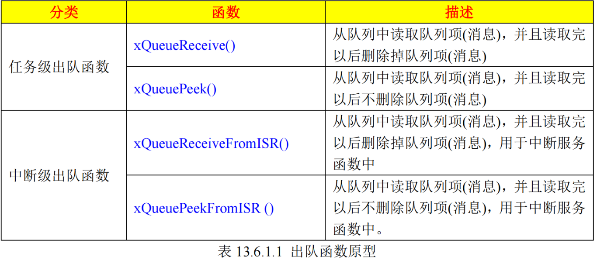


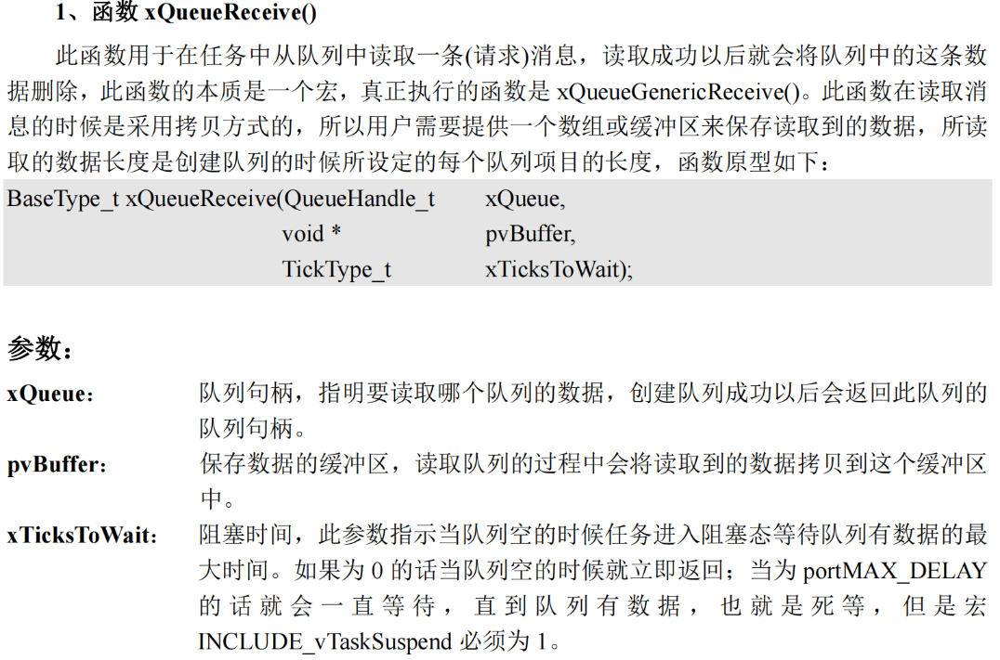

随便看看啊，最终还是调用 xQueueGenericReceive

```c
BaseType_t xQueueGenericReceive(
    QueueHandle_t xQueue,
    void * const pvBuffer,
    TickType_t xTicksToWait,
    const BaseType_t xJustPeeking
)
{
    BaseType_t xEntryTimeSet = pdFALSE; // 是否已记录进入等待的时间
    TimeOut_t xTimeOut;                 // 超时结构体，用于检测等待是否超时
    int8_t *pcOriginalReadPosition;     // 记录原始读指针（用于Peek）
    Queue_t * const pxQueue = (Queue_t * ) xQueue; // 转为内部结构体类型

    /* 断言校验，防止空指针或非法参数 */
    configASSERT( pxQueue );
    configASSERT( !( ( pvBuffer == NULL ) && ( pxQueue->uxItemSize != 0U ) ) );

    #if ( INCLUDE_xTaskGetSchedulerState == 1 || configUSE_TIMERS == 1 )
    {
        configASSERT( !( ( xTaskGetSchedulerState() == taskSCHEDULER_SUSPENDED )
                        && ( xTicksToWait != 0 ) ) );
    }
    #endif


    for( ;; )
    {
        taskENTER_CRITICAL(); // 进入临界区，防止并发修改队列
        {
            const UBaseType_t uxMessagesWaiting = pxQueue->uxMessagesWaiting;

            /* 队列中是否有消息？ */
            if( uxMessagesWaiting > 0 )
            {
                /* 保存当前读指针（防止Peek后要恢复） */
                pcOriginalReadPosition = pxQueue->u.pcReadFrom;

                /* 从队列中复制一条消息到用户缓冲区 */
                prvCopyDataFromQueue( pxQueue, pvBuffer );

                /* 是否是Peek操作（只看不取）？ */
                if( xJustPeeking == pdFALSE )
                {
                    /* 真正取出一条消息 */
                    traceQUEUE_RECEIVE( pxQueue );
                    pxQueue->uxMessagesWaiting = uxMessagesWaiting - 1; // 队列消息数减1

                    #if ( configUSE_MUTEXES == 1 )
                    {
                        if( pxQueue->uxQueueType == queueQUEUE_IS_MUTEX )
                        {
                            /* 如果是互斥量，更新持有者信息，用于优先级继承 */
                            pxQueue->pxMutexHolder = ( int8_t * ) pvTaskIncrementMutexHeldCount();
                        }
                    }
                    #endif

                    /* 如果有任务在等着“发送”（即队列之前满了），现在可以唤醒它们 */
                    if( listLIST_IS_EMPTY( &( pxQueue->xTasksWaitingToSend ) ) == pdFALSE )
                    {
                        if( xTaskRemoveFromEventList( &( pxQueue->xTasksWaitingToSend ) ) != pdFALSE )
                        {
                            queueYIELD_IF_USING_PREEMPTION(); // 可能触发任务切换
                        }
                    }
                }
                else
                {
                    /* Peek操作：数据不移除，只是读一下 */
                    traceQUEUE_PEEK( pxQueue );
                    pxQueue->u.pcReadFrom = pcOriginalReadPosition; // 恢复读指针

                    /* 如果还有任务也在等数据，唤醒它们 */
                    if( listLIST_IS_EMPTY( &( pxQueue->xTasksWaitingToReceive ) ) == pdFALSE )
                    {
                        if( xTaskRemoveFromEventList( &( pxQueue->xTasksWaitingToReceive ) ) != pdFALSE )
                        {
                            queueYIELD_IF_USING_PREEMPTION();
                        }
                    }
                }

                taskEXIT_CRITICAL();
                return pdPASS; // 成功读取
            }


            else
            {
                /* 队列为空 */
                if( xTicksToWait == 0 )
                {
                    /* 不等待，直接返回失败 */
                    taskEXIT_CRITICAL();
                    traceQUEUE_RECEIVE_FAILED( pxQueue );
                    return errQUEUE_EMPTY;
                }
                else if( xEntryTimeSet == pdFALSE )
                {
                    /* 第一次进入等待，记录当前tick时间 */
                    vTaskSetTimeOutState( &xTimeOut );
                    xEntryTimeSet = pdTRUE;
                }
            }
        }
        taskEXIT_CRITICAL();


        vTaskSuspendAll();        // 暂停调度器（防止中途切换）
        prvLockQueue( pxQueue );  // 给队列上锁（禁止并发修改）

        /* 检查是否超时 */
        if( xTaskCheckForTimeOut( &xTimeOut, &xTicksToWait ) == pdFALSE )
        {
            /* 还没超时，再次确认队列是否仍为空 */
            if( prvIsQueueEmpty( pxQueue ) != pdFALSE )
            {
                traceBLOCKING_ON_QUEUE_RECEIVE( pxQueue );

                #if ( configUSE_MUTEXES == 1 )
                {
                    if( pxQueue->uxQueueType == queueQUEUE_IS_MUTEX )
                    {
                        taskENTER_CRITICAL();
                        {
                            /* 如果是互斥量，执行优先级继承机制 */
                            vTaskPriorityInherit( ( void * ) pxQueue->pxMutexHolder );
                        }
                        taskEXIT_CRITICAL();
                    }
                }
                #endif

                /* 把任务加入队列的等待接收列表（阻塞） */
                vTaskPlaceOnEventList( &( pxQueue->xTasksWaitingToReceive ), xTicksToWait );

                /* 解锁队列并恢复调度 */
                prvUnlockQueue( pxQueue );
                if( xTaskResumeAll() == pdFALSE )
                {
                    portYIELD_WITHIN_API(); // 手动触发任务切换
                }
            }
            else
            {
                /* 队列已经被别的任务放入数据，再试一次 */
                prvUnlockQueue( pxQueue );
                ( void ) xTaskResumeAll();
            }
        }
        else
        {
            /* 等待超时 */
            prvUnlockQueue( pxQueue );
            ( void ) xTaskResumeAll();

            if( prvIsQueueEmpty( pxQueue ) != pdFALSE )
            {
                traceQUEUE_RECEIVE_FAILED( pxQueue );
                return errQUEUE_EMPTY; // 超时后依旧无数据 → 返回失败
            }
        }
    }
}

```


# 信号量

信号量用于对<font color='red'>共享资源的访问</font>和<font color='red'>任务同步</font>，前者信号量代表可用资源量，后者信号量表示一个启动标志

共享资源访问

信号量对共享资源的访问控制就相当于一个上锁机制，上了锁之后这个资源就会被禁止访问。什么时候上锁呢？举个例子，停车场有100个位置，每进一辆车，信号量++，当信号量==100后，这个停车场就不能再进车了，外界不能访问，相当于上锁了。（计数信号量）

公用电话亭也是，没人占用电话亭，信号量为1，外界可以访问；有人占用电话亭，信号量为0，外界禁止访问，相当于上锁了。（二值信号量）

任务同步

在裸机中，为了让两个任务同步（即一个任务发出通知后另一个任务才开始执行），我是用全局变量来实现的。

在RTOS里面，现在可以用信号量。一个任务在执行的时候，释放出一个信号量，另一个任务就接收，接收到了该任务就被唤醒，然后等待下一次释放

## 创建二值信号量API


二值信号就是一个队列，给一个二值信号量就相当于往这个队列里面发送一个NULL，

xSemaphoreCreateBinary() 

返回值是创建的二值信号量句柄，信号量所需要的RAM是由FreeRTOS来动态恢复的，创建好的二值信号量默认是空，获取API不能拿走


调用xQueueGenericCreate（）创建一个长度为1，队列项长度为0的队列

没有看到xSemaphoreGive()函数，所以take不到信号量

```c
，//创建二值信号量
	BinarySemaphore=xSemaphoreCreateBinary();	

#if( configSUPPORT_DYNAMIC_ALLOCATION == 1 )
	#define xSemaphoreCreateBinary() xQueueGenericCreate( ( UBaseType_t ) 1, semSEMAPHORE_QUEUE_ITEM_LENGTH, queueQUEUE_TYPE_BINARY_SEMAPHORE )
#endif
//xQueueGenericCreate参数为队列长度，队列项长度，	队列类型
```

## 释放信号量API

```c
xSemaphoreGiveFromISR(BinarySemaphore,&xHigherPriorityTaskWoken);	//释放二值信号量
portYIELD_FROM_ISR(xHigherPriorityTaskWoken);//如果需要的话进行一次任务切换
```

相当于往这个信号队列xSemaphore里面发送一个NULL值

```c
#define xSemaphoreGive( xSemaphore )     xQueueGenericSend( ( QueueHandle_t ) ( xSemaphore ), NULL, semGIVE_BLOCK_TIME, queueSEND_TO_BACK )
```


中断里函数要对pxHigherPriorityTaskWoken进行赋值，判断中断完了要不要进行任务切换

释放互斥量不能用这个函数，因为互斥量涉及到任务优先级继承，中断里没有

```c
#define xSemaphoreGiveFromISR( xSemaphore, pxHigherPriorityTaskWoken )  xQueueGiveFromISR( ( QueueHandle_t ) ( xSemaphore ), ( pxHigherPriorityTaskWoken ) )
```


## 获取信号量

```c
err=xSemaphoreTake(BinarySemaphore,portMAX_DELAY);  //获取信号量
```

传入信号量队列和阻塞等待时间


```c
#define xSemaphoreTake( xSemaphore, xBlockTime )     xQueueGenericReceive( ( QueueHandle_t ) ( xSemaphore ), NULL, ( xBlockTime ), pdFALSE )
```

第二个参数是接收数据缓冲区的指针，最后一个参数是来决定读出信号量后是否从队列中删除，否则可以一直拿取信号量

| 参数                 | 含义                                         |
| -------------------- | -------------------------------------------- |
| `pvBuffer == &value` | 普通队列，要取出数据放进变量                 |
| `pvBuffer == NULL`   | 信号量，不取数据，只消耗一个令牌（计数减 1） |

```c
if( pxQueue->uxItemSize == 0 )
{
    // 信号量模式，不需要拷贝数据
}
else
{
    // 普通队列，需要把队列头的数据拷贝到 pvBuffer
}
当 uxItemSize == 0（信号量）时，
FreeRTOS 只会做“队列计数减一”这类操作，
不会访问 pvBuffer，所以 NULL 没问题。
```

如果获取失败，在这个函数里面就会进行任务调度，不会进行这个函数下面的内容

## 计数型信号量

常用于资源管理

二值信号相当于长度为1的队列，计数信号量就是长度大于1的队列

<font color='red'>应用场景：</font>

事件计数（<font color='orange'>任务同步</font>）：每次事件发生了，就在事件处理函数里面释放信号量，其他任务会获得信号量，这样的话信号量--；这种情况下初始计数值为0。

​     资源管理：这种情况下表示当前资源的可用数量，一个任务想要使用一个资源，就要先获得信号量，即信号量--；使用完毕要及时释放信号，即信号量++；


## 创建计数型信号量API

两个参数,一个是最大计数值，一个是初始值，创建成功会返回这个信号量的句柄

```c
CountSemaphore=xSemaphoreCreateCounting(255,0);	

 */
#if( configSUPPORT_DYNAMIC_ALLOCATION == 1 )
	#define xSemaphoreCreateCounting( uxMaxCount, uxInitialCount ) xQueueCreateCountingSemaphore( ( uxMaxCount ), ( uxInitialCount ) )
#endif
```


```c

	QueueHandle_t xQueueCreateCountingSemaphore( const UBaseType_t uxMaxCount, const UBaseType_t uxInitialCount )
	{
	QueueHandle_t xHandle;

		configASSERT( uxMaxCount != 0 );
		configASSERT( uxInitialCount <= uxMaxCount );

		xHandle = xQueueGenericCreate( uxMaxCount, queueSEMAPHORE_QUEUE_ITEM_LENGTH, queueQUEUE_TYPE_COUNTING_SEMAPHORE );

		if( xHandle != NULL )
		{
			( ( Queue_t * ) xHandle )->uxMessagesWaiting = uxInitialCount;

			traceCREATE_COUNTING_SEMAPHORE();
		}
		else
		{
			traceCREATE_COUNTING_SEMAPHORE_FAILED();
		}

		return xHandle;
	}
```


还是会调用最基本的xQueueGenericCreate


## 优先级反转

问题发生在访问普通共享资源并用普通二值信号量，而不是临界资源；普通资源拿到信号量就能访问，但是访问过程中没有保护，可以被中断切换任务，又是普通二值信号量，从而引出连锁问题；访问临界资源要进入临界区，临界区是禁止了中断的，自然没有任务切换

前置关键知识：任务<font color='red'>第一次</font>调用API拿取信号失败后，会将自己变为阻塞态并加入等待信号队列，除非有信号被释放，否则不会占用CPU

异常关键就在于<font color='red'>高优先级任务拿不到信号量就会一直阻塞等待（阻塞等待的时间大部分就是执行中优先级任务的时间），直到低优先级任务被执行完。这就相当于低优先级任务变得比高优先级更高</font>，这是所谓优先级反转

有一个低优先级的任务，它获得了一个二值信号量（0，1），来访问一个资源；这段时间里，有一个高优先级任务也要访问这个资源，这个时候低优先级任务被挂起，开始执行高优先级任务，但是因为它没有获得信号量（这个信号量被低优先级任务占有），这个高优先级任务在<font color='red'>第一次获取信号量失败</font>的同时会触发任务调度，将自己变为阻塞态加入等待信号列表，直到有信号被释放。所以此时会执行一个优先级小于高优先级的任务（中优先级任务,如果中优先级任务存在的话)，疑问：任务调度会调度这个低优先级任务吗（只有2个任务的极端情况下)？如果会，那么能让这个低优先级任务执行完释放信号吗？

两个都会的。但是如果有多个中优先级的任务并且很忙，<font color='red'>低优先级任务可能很久都拿不到CPU->信号不会被释放->高优先级任务阻塞很久</font>

由此引出互斥信号量->优先级继承


## 互斥信号量

互斥信号量是一个有优先级继承机制的二值信号量

优先级继承:当一个互斥信号量被一个低优先级任务使用，此时有个高优先级任务也尝试获取这个互斥量的话就会阻塞，但是在阻塞之前这个任务会将低优先级任务的优先级提升到和自己相同的优先级，这样低优先级任务很快就被执行，就减少了高优先级任务阻塞等待的事件。

二值信号量适合需要任务同步的场景，互斥信号量适合需要资源管理的场景(拿了信号量才能访问，访问完了释放信号量)。

中断里面最好别用信号量，不是任务，调用任务API可能出问题


## 常用API

1️⃣ 创建互斥信号量

```c
SemaphoreHandle_t xSemaphoreCreateMutex(void);

```

**功能**：创建一个标准的互斥信号量（初始状态为“可用”）。

**返回值**：成功返回句柄（`SemaphoreHandle_t`），失败返回 `NULL`。

**特点**：支持优先级继承机制（防止优先级反转）


**2️⃣ 获取互斥信号量**

```c
BaseType_t xSemaphoreTake(SemaphoreHandle_t xMutex, TickType_t xTicksToWait);
```

- **功能**：尝试获取信号量（上锁）。
- **参数**：
  - `xMutex`：信号量句柄；
  - `xTicksToWait`：等待时间（`portMAX_DELAY` 表示无限等待）。
- **返回值**：
  - `pdTRUE`：成功获得；
  - `pdFALSE`：超时或失败。
- **作用**：任务执行到此处如果信号量不可用，会进入阻塞队列。

------

🔓 **3️⃣ 释放互斥信号量**

```c
BaseType_t xSemaphoreGive(SemaphoreHandle_t xMutex);
```

- **功能**：释放信号量（解锁）。
- **返回值**：
  - `pdTRUE`：成功释放；
  - `pdFALSE`：失败（如释放者不是持有者）。
- **注意**：只有“持有锁”的任务才能释放。

------

🧹 **4️⃣ 删除互斥信号量**

```c
void vSemaphoreDelete(SemaphoreHandle_t xMutex);
```

- **功能**：删除互斥信号量，释放其占用的内存。
- **注意**：删除前应确保没有任务在等待该信号量。

具体代码例子见正点原子例程

## 递归互斥信号量

xSemaphoreTakeRecursive(xRecursiveMutex, portMAX_DELAY)

xSemaphoreGiveRecursive(xRecursiveMutex);

```c
#include "FreeRTOS.h"
#include "task.h"
#include "semphr.h"

SemaphoreHandle_t xRecursiveMutex;

void FunctionB(void)
{
    printf("FunctionB: 想再次获取递归互斥信号量...\n");
    if(xSemaphoreTakeRecursive(xRecursiveMutex, portMAX_DELAY) == pdTRUE)
    {
        printf("FunctionB: 再次获得成功！执行任务...\n");
        vTaskDelay(pdMS_TO_TICKS(200));
        xSemaphoreGiveRecursive(xRecursiveMutex);
        printf("FunctionB: 释放递归互斥信号量（第2层）\n");
    }
}

void TaskA(void *pvParameters)
{
    while(1)
    {
        if(xSemaphoreTakeRecursive(xRecursiveMutex, portMAX_DELAY) == pdTRUE)
        {
            printf("\nTaskA: 第1次获得递归互斥信号量\n");
            FunctionB();   // 在此函数中又获得一次同一个锁
            vTaskDelay(pdMS_TO_TICKS(200));
            xSemaphoreGiveRecursive(xRecursiveMutex);
            printf("TaskA: 释放递归互斥信号量（第1层）\n");
        }
        vTaskDelay(pdMS_TO_TICKS(1000));
    }
}

int main(void)
{
    xRecursiveMutex = xSemaphoreCreateRecursiveMutex();
    if(xRecursiveMutex != NULL)
    {
        xTaskCreate(TaskA, "TaskA", 256, NULL, 2, NULL);
        vTaskStartScheduler();
    }
    for(;;);
}

```

在函数内部加锁获得信号是为了让函数又有独立性，能自己保护自己，万一外层没加锁没得到信号，也不会出错

| 特性         | 普通二值信号量     | 递归互斥量         |
| :----------- | :----------------- | :----------------- |
| **初始状态** | 空（不可用）       | **可用**（已释放） |
| **创建后**   | 需要先释放才能获取 | **可以直接获取**   |
| **用途**     | 同步、事件通知     | 临界资源保护       |

# 软件定时器

使用之前要在FreeRTOSConfig.h里面配置相关参数

## 概述

MCU自带的定时器不够用可以考虑用FreeRTOS的软件定时器。

回调函数：软件定时器设置的时间到了，会执行一个函数，叫回调函数

回调函数是在定时器服务任务里面执行的，不能在回调函数里面调用任何会阻塞任务的API

## 定时器服务任务

定时器是由定时器服务任务来提供的。freeRTOS提供了很多定时器有关的API，这些API大多使用FreeRTOS的队列发送命令给定时器服务任务。队列叫做定时器命令队列，用户不能直接访问。用户来调用这些API，定时器服务任务里面接收

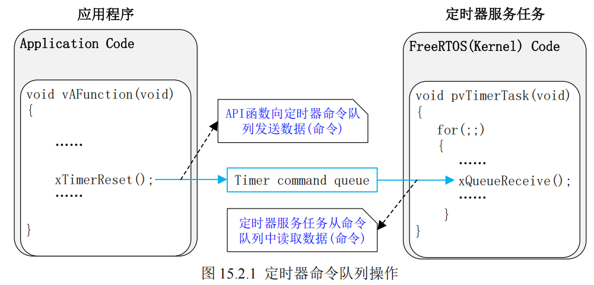

## 分类

单次定时器：只运行一次，触发了回调函数之后就停止，要手动调用API函数

周期定时器：会一直运行

## 复位

复位之后会重新开始计数，调用xTimerReset()和xTimerResetFromISR()来实现

## 控制块

```C
typedef struct tmrTimerControl
{
    const char *pcTimerName;                  // 定时器名字
    ListItem_t xTimerListItem;                // 链表节点（用于挂到定时器列表中）
    TickType_t xTimerPeriodInTicks;           // 定时时长（以tick为单位）
    UBaseType_t uxAutoReload;                 // 是否自动重载
    void *pvTimerID;                          // 用户数据
    TimerCallbackFunction_t pxCallbackFunction; // ✅ 回调函数指针
} xTIMER;

//typedef void (*TimerCallbackFunction_t)( TimerHandle_t xTimer );

```

## 创建

```c
TimerHandle_t xTimerCreate( 
    const char * const pcTimerName,          // 定时器名称（调试用）
    const TickType_t xTimerPeriodInTicks,    // 定时周期（节拍数）
    const UBaseType_t uxAutoReload,          // 自动重载模式
    void * const pvTimerID,                  // 定时器ID标识符
    TimerCallbackFunction_t pxCallbackFunction // 回调函数指针
);
```

返回的是句柄,也即是指向定时器控制块的指针

## 启动定时器

```c
BaseType_t xTimerStart(
    TimerHandle_t xTimer,        // 定时器句柄
    TickType_t xTicksToWait      // 阻塞等待时间
);

BaseType_t xTimerStartFromISR(
    TimerHandle_t xTimer,                   // 定时器句柄
    BaseType_t *pxHigherPriorityTaskWoken   // 输出参数：是否唤醒高优先级任务
);
```

## 停止定时器

```c
BaseType_t xTimerStop(
    TimerHandle_t xTimer,        // 定时器句柄
    TickType_t xTicksToWait      // 阻塞等待时间
);

BaseType_t xTimerStopFromISR(
    TimerHandle_t xTimer,                   // 定时器句柄
    BaseType_t *pxHigherPriorityTaskWoken   // 输出参数：是否唤醒高优先级任务
);
```


## 代码示例

```c
// 定时器回调函数
void vTimerCallback(TimerHandle_t xTimer)
{
    void *pvID = pvTimerGetTimerID(xTimer);
    printf("定时器 %d 超时！\n", (int)pvID);
}

// 创建定时器
TimerHandle_t xMyTimer = xTimerCreate(
    "MyTimer",                      // 名称
    pdMS_TO_TICKS(1000),            // 1秒周期
    pdTRUE,                         // 自动重载
    (void *)1,                      // ID=1
    vTimerCallback                  // 回调函数
);

// 启动定时器
if(xTimerStart(xMyTimer, 0) != pdPASS) {
    // 启动失败处理
}
```

# 事件标志组

## 背景

```c
#include "FreeRTOS.h"
#include "task.h"
#include "semphr.h"
#include "stdio.h"

// 全局变量
SemaphoreHandle_t xDataReadySemaphore;  // 数据就绪信号量
QueueHandle_t xDataQueue;               // 数据队列
int iProducedData = 0;

// 生产者任务
void vProducerTask(void *pvParameters)
{
    const char *pcTaskName = "Producer";
    int iLocalData = 0;
    
    printf("[%s] 任务启动\n", pcTaskName);
    
    for(;;)
    {
        // 生产数据
        iLocalData = iProducedData++;
        
        // 发送数据到队列
        if(xQueueSend(xDataQueue, &iLocalData, portMAX_DELAY) == pdPASS)
        {
            printf("[%s] 生产数据: %d\n", pcTaskName, iLocalData);
            
            // 释放信号量，通知消费者数据就绪
            xSemaphoreGive(xDataReadySemaphore);
            printf("[%s] 发出数据就绪信号\n", pcTaskName);
        }
        
        // 延迟一段时间，模拟数据生产时间
        vTaskDelay(pdMS_TO_TICKS(1000));
    }
}

// 消费者任务
void vConsumerTask(void *pvParameters)
{
    const char *pcTaskName = "Consumer";
    int iReceivedData = 0;
    
    printf("[%s] 任务启动\n", pcTaskName);
    
    for(;;)
    {
        // 等待数据就绪信号量
        if(xSemaphoreTake(xDataReadySemaphore, portMAX_DELAY) == pdPASS)
        {
            printf("[%s] 收到数据就绪信号\n", pcTaskName);
            
            // 从队列接收数据
            if(xQueueReceive(xDataQueue, &iReceivedData, 0) == pdPASS)
            {
                printf("[%s] 消费数据: %d\n", pcTaskName, iReceivedData);
                
                // 模拟数据处理时间
                vTaskDelay(pdMS_TO_TICKS(200));
                printf("[%s] 数据处理完成\n", pcTaskName);
            }
        }
    }
}

// 监控任务 - 显示系统状态
void vMonitorTask(void *pvParameters)
{
    const char *pcTaskName = "Monitor";
    
    for(;;)
    {
        UBaseType_t uxSemaphoreCount = uxSemaphoreGetCount(xDataReadySemaphore);
        UBaseType_t uxQueueMessages = uxQueueMessagesWaiting(xDataQueue);
        
        printf("[%s] 信号量计数: %lu, 队列数据: %lu\n", 
               pcTaskName, uxSemaphoreCount, uxQueueMessages);
        
        vTaskDelay(pdMS_TO_TICKS(3000));
    }
}

int main(void)
{
    printf("=== FreeRTOS 信号量同步示例 ===\n");
    
    // 创建二值信号量（初始状态为0 - 不可用）
    xDataReadySemaphore = xSemaphoreCreateBinary();
    if(xDataReadySemaphore == NULL)
    {
        printf("错误: 无法创建信号量!\n");
        return -1;
    }
    
    // 创建数据队列，可以存储5个整数
    xDataQueue = xQueueCreate(5, sizeof(int));
    if(xDataQueue == NULL)
    {
        printf("错误: 无法创建队列!\n");
        vSemaphoreDelete(xDataReadySemaphore);
        return -1;
    }
    
    printf("信号量和队列创建成功\n");
    
    // 创建任务
    xTaskCreate(vProducerTask, "Producer", 256, NULL, 2, NULL);
    xTaskCreate(vConsumerTask, "Consumer", 256, NULL, 2, NULL);
    xTaskCreate(vMonitorTask, "Monitor", 256, NULL, 1, NULL);
    
    // 启动调度器
    vTaskStartScheduler();
    
    // 不会执行到这里
    for(;;);
    return 0;
}
```


可以看见，使用信号量来同步的话，任务只能和单个的事件或任务进行同步，有时候任务会需要与多个事件或任务进行同步，由此引出事件标志组

## 结构

分为16位和32位

```c
#if configUSE_16_BIT_TICKS == 1
	#define eventCLEAR_EVENTS_ON_EXIT_BIT	0x0100U
	#define eventUNBLOCKED_DUE_TO_BIT_SET	0x0200U
	#define eventWAIT_FOR_ALL_BITS			0x0400U
	#define eventEVENT_BITS_CONTROL_BYTES	0xff00U
#else
	#define eventCLEAR_EVENTS_ON_EXIT_BIT	0x01000000UL
	#define eventUNBLOCKED_DUE_TO_BIT_SET	0x02000000UL
	#define eventWAIT_FOR_ALL_BITS			0x04000000UL
	#define eventEVENT_BITS_CONTROL_BYTES	0xff000000UL
#endif
```

32位事件标志组和16位一样，都是高8位有其他用

每个位代表一个事件，所以可以存24个事件

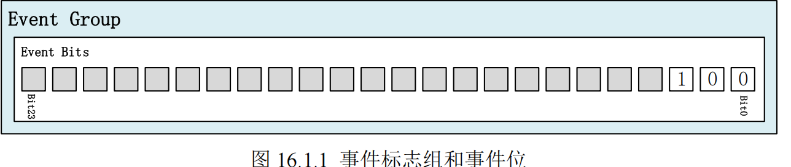

## API

### 创建


根据上面的宏来创建事件组，成功返回事件标志组的句柄

```c
EventGroupHandle_t xEventGroupCreate( void )
```


### 删除

```
void vEventGroupDelete( EventGroupHandle_t xEventGroup );
```


**功能**：删除事件组并释放内存
**参数**：`xEventGroup` - 要删除的事件组句柄


### **设置事件位**


```C
EventBits_t xEventGroupSetBits( EventGroupHandle_t xEventGroup,
                                const EventBits_t uxBitsToSet );
```

C

**功能**：在任务中设置指定事件位
**参数**：

- `xEventGroup` - 事件组句柄
- `uxBitsToSet` - 要设置的事件位掩码
  **返回**：设置后的事件组值


### `xEventGroupSetBitsFromISR()`

c

```C
BaseType_t xEventGroupSetBitsFromISR( EventGroupHandle_t xEventGroup,
                                      const EventBits_t uxBitsToSet,
                                      BaseType_t *pxHigherPriorityTaskWoken );
```

C

**功能**：在中断中设置事件位
**参数**：

- `xEventGroup` - 事件组句柄
- `uxBitsToSet` - 要设置的事件位掩码
- `pxHigherPriorityTaskWoken` - 输出参数，是否唤醒高优先级任务,任务切换
  **返回**：pdPASS 或 pdFAIL

## 🔍 **等待事件位**


```C
EventBits_t xEventGroupWaitBits( EventGroupHandle_t xEventGroup,
                                 const EventBits_t uxBitsToWaitFor,
                                 const BaseType_t xClearOnExit,
                                 const BaseType_t xWaitForAllBits,
                                 TickType_t xTicksToWait );
```


**功能**：等待指定的事件位被设置
**参数**：

- `xEventGroup` - 事件组句柄
- `uxBitsToWaitFor` - 要等待的事件位掩码
- `xClearOnExit` - 退出时是否清除等待的位
  - `pdTRUE`：清除已等待的位
  - `pdFALSE`：保持位不变
- `xWaitForAllBits` - 等待所有位还是任意位
  - `pdTRUE`：等待所有指定位都置位
  - `pdFALSE`：等待任意指定位置位
- `xTicksToWait` - 最大等待时间
  **返回**：满足条件的事件位值，超时返回当前值

第三个参数:这个函数执行完了返回了标志组中的值之后,要不要把事件标志删除

## 🧹 **清除事件位**

```C
EventBits_t xEventGroupClearBits( EventGroupHandle_t xEventGroup,
                                  const EventBits_t uxBitsToClear );
```


**功能**：在任务中清除指定事件位
**参数**：

- `xEventGroup` - 事件组句柄
- `uxBitsToClear` - 要清除的事件位掩码
  **返回**：清除后的事件组值


```C
BaseType_t xEventGroupClearBitsFromISR( EventGroupHandle_t xEventGroup,
                                        const EventBits_t uxBitsToClear );
```


**功能**：在中断中清除事件位
**参数**：

- `xEventGroup` - 事件组句柄
- `uxBitsToClear` - 要清除的事件位掩码
  **返回**：pdPASS 或 pdFAIL

## 📊 **读取事件位**

```C
EventBits_t xEventGroupGetBits( EventGroupHandle_t xEventGroup );
```


**功能**：获取当前事件位的值（不改变事件组）
**参数**：`xEventGroup` - 事件组句柄
**返回**：当前事件位的值


```c
EventBits_t xEventGroupGetBitsFromISR( EventGroupHandle_t xEventGroup );
```


**功能**：在中断中获取事件位的值
**参数**：`xEventGroup` - 事件组句柄
**返回**：当前事件位的值

## 🔄 **同步操作**

```c
EventBits_t xEventGroupSync( EventGroupHandle_t xEventGroup,
                             const EventBits_t uxBitsToSet,
                             const EventBits_t uxBitsToWaitFor,
                             TickType_t xTicksToWait );
```


**功能**：同步多个任务（设置位并等待其他位）
**参数**：

- `xEventGroup` - 事件组句柄
- `uxBitsToSet` - 要设置的事件位
- `uxBitsToWaitFor` - 要等待的事件位
- `xTicksToWait` - 最大等待时间
  **返回**：成功时返回满足条件的事件位值


## 例子

三个都就绪了，任务A里面的循环才会执行，否则直接任务切换

```c
#include "FreeRTOS.h"
#include "event_groups.h"

// 定义事件位掩码
#define TASK_1_READY_BIT    ( 1 << 0 )  // 位0
#define TASK_2_READY_BIT    ( 1 << 1 )  // 位1  
#define TASK_3_READY_BIT    ( 1 << 2 )  // 位2
#define ALL_TASKS_READY     ( TASK_1_READY_BIT | TASK_2_READY_BIT | TASK_3_READY_BIT )

EventGroupHandle_t xSyncEventGroup;

void vTask1( void *pvParameters )
{
    // 执行初始化工作...
    vTaskDelay( pdMS_TO_TICKS( 100 ) );
    
    // 设置任务就绪位
    xEventGroupSetBits( xSyncEventGroup, TASK_1_READY_BIT );
    printf( "Task1 就绪\n" );
    
    // 等待所有任务就绪
    xEventGroupWaitBits( xSyncEventGroup, ALL_TASKS_READY, pdTRUE, pdTRUE, portMAX_DELAY );
    printf( "所有任务就绪，开始协同工作\n" );
    
    for( ;; )
    {
        // 主循环
        vTaskDelay( pdMS_TO_TICKS( 1000 ) );
    }
}

void vTask2( void *pvParameters )
{
    vTaskDelay( pdMS_TO_TICKS( 200 ) );
    xEventGroupSetBits( xSyncEventGroup, TASK_2_READY_BIT );
    printf( "Task2 就绪\n" );
    
    for( ;; )
    {
        vTaskDelay( pdMS_TO_TICKS( 1500 ) );
    }
}

void vISR_Handler( void )
{
    BaseType_t xHigherPriorityTaskWoken = pdFALSE;
    
    // 在中断中设置事件位
    xEventGroupSetBitsFromISR( xSyncEventGroup, TASK_3_READY_BIT, &xHigherPriorityTaskWoken );
    printf( "ISR 设置 Task3 就绪位\n" );
    
    portYIELD_FROM_ISR( xHigherPriorityTaskWoken );
}

int main( void )
{
    // 创建事件组
    xSyncEventGroup = xEventGroupCreate();
    
    if( xSyncEventGroup != NULL )
    {
        xTaskCreate( vTask1, "Task1", 256, NULL, 2, NULL );
        xTaskCreate( vTask2, "Task2", 256, NULL, 2, NULL );
        
        vTaskStartScheduler();
    }
    
    for( ;; );
}
```

# 任务通知

可以用任务通知来代替信号量，消息队列，事件标志组等通信方式，使用任务通知效率会更高

## 概述

使用前

```
#define configUSE_TASK_NOTIFICATIONS            1                       //为1时开启任务通知功能，默认开启
```

每个任务都有一个32位的通知值，任务控制块中的ulNotifiedValue变量就是这个通知值。

```c
#if( configUSE_TASK_NOTIFICATIONS == 1 )
   	volatile uint32_t ulNotifiedValue;	/*< 任务通知值。*/
   	volatile uint8_t ucNotifyState;		/*< 任务通知状态。*/
   #endif
```

| 函数                       | 作用                                                      |
| -------------------------- | --------------------------------------------------------- |
| `xTaskNotifyGive()`        | 给目标任务发送一个“通知信号” (+1)，常用于替代二值信号量。 |
| `vTaskNotifyGiveFromISR()` | 中断中给任务发通知。                                      |
| `ulTaskNotifyTake()`       | 当前任务等待通知（类似 `xSemaphoreTake()`）。             |
| `xTaskNotify()`            | 发送通知并可携带一个数值。                                |
| `xTaskNotifyWait()`        | 等待通知并获取里面的数值。                                |
| `xTaskNotifyFromISR()`     | 中断中发送通知。                                          |


```
BaseType_t xTaskGenericNotify( TaskHandle_t xTaskToNotify, uint32_t ulValue, eNotifyAction eAction, uint32_t *pulPreviousNotificationValue ) PRIVILEGED_FUNCTION;


#define xTaskNotifyGive( xTaskToNotify ) xTaskGenericNotify( ( xTaskToNotify ), ( 0 ), eIncrement, NULL )


#define xTaskNotify( xTaskToNotify, ulValue, eAction ) xTaskGenericNotify( ( xTaskToNotify ), ( ulValue ), ( eAction ), NULL )


#define xTaskNotifyAndQuery( xTaskToNotify, ulValue, eAction, pulPreviousNotifyValue ) xTaskGenericNotify( ( xTaskToNotify ), ( ulValue ), ( eAction ), ( pulPreviousNotifyValue ) )

```


## **参数功能对比表**

使用 `ulTaskNotifyTake` 当：

- ✅ 只需要简单的计数功能
- ✅ 模拟二值/计数信号量
- ✅ 轻量级资源保护
- ✅ 不关心通知值的具体位模式

使用 `xTaskNotifyWait` 当：

- ✅ 需要处理复杂的事件位图
- ✅ 需要精细控制位的清除时机
- ✅ 需要获取完整的通知值进行分析
- ✅ 实现状态机或多事件处理系统

| 参数       | `ulTaskNotifyTake`  | `xTaskNotifyWait`       | 功能说明           |
| :--------- | :------------------ | :---------------------- | :----------------- |
| **参数1**  | `xClearCountOnExit` | `ulBitsToClearOnEntry`  | **入口清除控制**   |
| **参数2**  | 无                  | `ulBitsToClearOnExit`   | **出口清除控制**   |
| **参数3**  | 无                  | `pulNotificationValue`  | **保存接收通知值** |
| **参数4**  | `xTicksToWait`      | `xTicksToWait`          | **等待超时时间**   |
| **返回值** | `uint32_t` (计数)   | `BaseType_t` (成功标志) | **返回结果类型**   |

## xTaskNotifyWait,xTaskNotify例子

```c
//task1任务函数
void task1_task(void *pvParameters)
{
	u8 key,i=0;
    BaseType_t err;
	while(1)
	{
		key=KEY_Scan(0);            			//扫描按键
        if((Keyprocess_Handler!=NULL)&&(key))   
        {
			err=xTaskNotify((TaskHandle_t	)Keyprocess_Handler,		//接收任务通知的任务句柄
							(uint32_t		)key,						//任务通知值
							(eNotifyAction	)eSetValueWithOverwrite);	//覆写的方式发送任务通知
			if(err==pdFAIL)
			{
				printf("任务通知发送失败\r\n");
			}
        }
        i++;
        if(i==50)
        {
            i=0;
            LED0=!LED0;
        }
        vTaskDelay(10);           //延时10ms，也就是10个时钟节拍	
	}
}


//Keyprocess_task函数
void Keyprocess_task(void *pvParameters)
{
	u8 num,beepsta=1;
	uint32_t NotifyValue;
	BaseType_t err;
	while(1)
	{
		err=xTaskNotifyWait((uint32_t	)0x00,				//进入函数的时候不清除任务bit
							(uint32_t	)ULONG_MAX,			//退出函数的时候清除所有的bit
							(uint32_t*	)&NotifyValue,		//保存任务通知值
							(TickType_t	)portMAX_DELAY);	//阻塞时间
		if(err==pdTRUE)				//获取任务通知成功
		{
			switch((u8)NotifyValue)
			{
                case WKUP_PRES:		//KEY_UP控制LED1
                    LED1=!LED1;
					break;
				case KEY2_PRES:		//KEY2控制蜂鸣器
					beepsta=!beepsta;
                    PCF8574_WriteBit(BEEP_IO,beepsta);
					break;
				case KEY0_PRES:		//KEY0刷新LCD背景
                    num++;
					LCD_Fill(6,126,233,313,lcd_discolor[num%14]);
                    break;
			}
		}
	}
}


```


## ulTaskNotifyTake,vTaskNotifyGiveFromISR例子

```c

	//发送任务通知
	if((USART_RX_STA&0x8000)&&(DataProcess_Handler!=NULL))//接收到数据，并且接收任务通知的任务有效
	{
		vTaskNotifyGiveFromISR(DataProcess_Handler,&xHigherPriorityTaskWoken);//发送任务通知
		portYIELD_FROM_ISR(xHigherPriorityTaskWoken);//如果需要的话进行一次任务切换
	}
	
	
	
	
	
	void DataProcess_task(void *pvParameters)
{
	u8 len=0;
	u8 CommandValue=COMMANDERR;
	u32 NotifyValue;
	
	u8 *CommandStr;
	POINT_COLOR=BLUE;
	while(1)
	{
		
		NotifyValue=ulTaskNotifyTake(pdTRUE,portMAX_DELAY);	//获取任务通知，清除之前的值
		if(NotifyValue==1)									//清零之前的任务通知值为1，说明任务通知有效
		{
			len=USART_RX_STA&0x3fff;						//得到此次接收到的数据长度
			CommandStr=mymalloc(SRAMIN,len+1);				//申请内存
			sprintf((char*)CommandStr,"%s",USART_RX_BUF);
			CommandStr[len]='\0';							//加上字符串结尾符号
			LowerToCap(CommandStr,len);						//将字符串转换为大写		
			CommandValue=CommandProcess(CommandStr);		//命令解析
			if(CommandValue!=COMMANDERR)
			{
				LCD_Fill(10,90,210,110,WHITE);				//清除显示区域
				LCD_ShowString(10,90,200,16,16,CommandStr);	//在LCD上显示命令
				printf("命令为:%s\r\n",CommandStr);
				switch(CommandValue)						//处理命令
				{
					case LED1ON: 
						LED1=0;
						break;
					case LED1OFF:
						LED1=1;
						break;
					case BEEPON:
						PCF8574_WriteBit(BEEP_IO,0);
						break;
					case BEEPOFF:
						PCF8574_WriteBit(BEEP_IO,1);
						break;
				}
			}
			else
			{
				printf("无效的命令，请重新输入!!\r\n");
			}
			USART_RX_STA=0;
			memset(USART_RX_BUF,0,USART_REC_LEN);			//串口接收缓冲区清零
			myfree(SRAMIN,CommandStr);						//释放内存
		}
		else 
		{
			vTaskDelay(10);      //延时10ms，也就是10个时钟节拍	
		}
	}
}

```


## ulTaskNotifyTake,xTaskNotifyGive例子

```c
//释放计数型信号量任务函数
void SemapGive_task(void *pvParameters)
{
	u8 key,i=0;
	while(1)
	{
		key=KEY_Scan(0);           	//扫描按键
        if(SemapTakeTask_Handler!=NULL)  	
        {
            switch(key)
            {
                case WKUP_PRES:
					xTaskNotifyGive(SemapTakeTask_Handler);//发送任务通知
                    break;
            }
        }
        i++;
        if(i==50)
        {
            i=0;
            LED0=!LED0;
        }
        vTaskDelay(10);     //延时10ms，也就是10个时钟节拍	
	}
}

//获取计数型信号量任务函数
void SemapTake_task(void *pvParameters)
{
    u8 num;
    uint32_t NotifyValue;
	while(1)
	{
		NotifyValue=ulTaskNotifyTake(pdFALSE,portMAX_DELAY);//获取任务通知，入口不清除
        num++;
        LCD_ShowxNum(166,111,NotifyValue-1,3,16,0);         //显示当前任务通知值
		LCD_Fill(6,131,233,313,lcd_discolor[num%14]);   	//刷屏
		LED1=!LED1;
        vTaskDelay(1000);                               	//延时1s，也就是1000个时钟节拍	
	}
}
```


# 低功耗Tickless

## MCU低功耗

这些是固定好了的，自己不能改动

| 模式                | 功耗等级 | CPU状态               | 外设状态                     | 唤醒方式                   | 特点                           |
| ------------------- | -------- | --------------------- | ---------------------------- | -------------------------- | ------------------------------ |
| **Sleep（睡眠）**   | 低       | CPU停止，外设继续工作 | 所有时钟继续运行（可选）     | 任意中断                   | 快速进入/退出，数据保持        |
| **Stop（停止）**    | 更低     | CPU和大部分时钟停止   | SRAM/寄存器保持              | 外部中断、RTC、USART唤醒等 | 功耗与恢复速度平衡             |
| **Standby（待机）** | 最低     | CPU完全断电           | SRAM、寄存器丢失（除备份区） | WKUP脚、RTC闹钟、复位      | 等效“关机”，唤醒后重新启动程序 |

### sleep模式

**工作机制：**

- CPU 停止执行指令（即暂停运行）。
- 外设仍然工作（比如 UART、ADC、定时器）。
- 所有寄存器、RAM 内容保持不变。

**唤醒来源：**

- 任意中断（EXTI、SysTick、USART、DMA…）
- 唤醒后从中断返回继续执行。

**典型用途：**

- 稍微省电，同时保持外设响应能力。
- 比如在空闲循环里进入 Sleep，等待外设事件。

```c
__WFI();   // Wait For Interrupt
__WFE();   //wait for event

```

当SCR寄存器的bit1(SLEEPONEXIT)为0时立即休眠,当为1的时候退出休眠

### Stop模式

**工作机制：**

- CPU 和主时钟（HCLK、PLL、HSI/HSE）全部停止。
- SRAM 和寄存器内容保持。
- LSI / LSE / RTC 可继续运行。
- 可选主稳压器或低功耗稳压器。

**唤醒来源：**

- 外部中断（EXTI）
- RTC Alarm / Wakeup timer
- USART / I2C 唤醒（部分芯片支持）

**唤醒后：**

- 需要重新配置时钟系统（如重新使能 PLL）。
- 程序从唤醒点继续运行。

**典型用途：**

- 电池设备中长时间等待事件但仍需快速恢复的场合。

```c
HAL_PWR_EnterSTOPMode(PWR_LOWPOWERREGULATOR_ON, PWR_STOPENTRY_WFI);

```


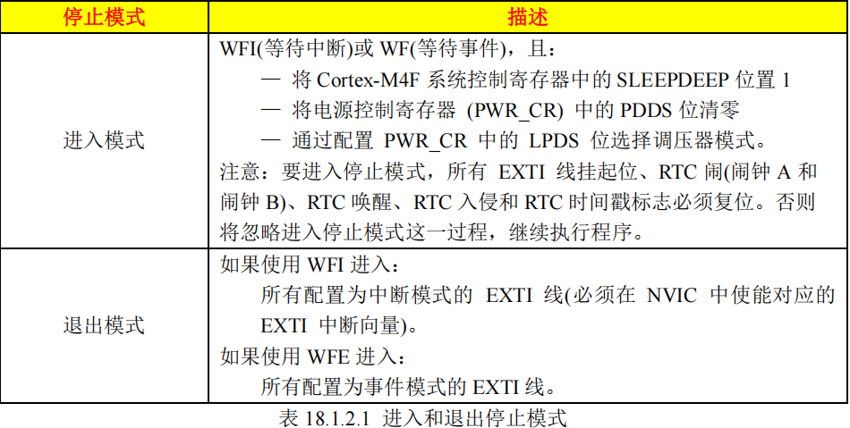


### Standby模式

```c
HAL_PWR_EnterSTANDBYMode();

```


**工作机制：**

- 所有时钟关闭。
- CPU 和主 SRAM 断电。
- RTC 和备份寄存器保持。
- 唤醒相当于上电复位。

**唤醒来源：**

- 外部唤醒引脚（WKUP1~WKUPx）
- RTC Alarm / Wakeup
- IWDG（独立看门狗）
- NRST 复位

**唤醒后：**

- 从系统复位开始（程序重新执行 `main()`）。
- 可通过备份寄存器判断是否是“待机唤醒”。

**典型用途：**

- 极限节能、长时间待机的设备（如手环、传感节点）。

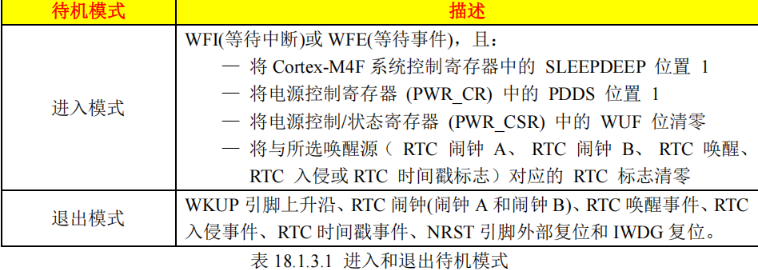

## FreeRTOS降低低功耗

这个可以在进入低功耗和退出低功耗自定义外设

```c
extern void PreSleepProcessing(uint32_t ulExpectedIdleTime);

extern void PostSleepProcessing(uint32_t ulExpectedIdleTime);

//进入低功耗模式前需要处理的事情
//ulExpectedIdleTime：低功耗模式运行时间
void PreSleepProcessing(uint32_t ulExpectedIdleTime)
{
	//关闭某些低功耗模式下不使用的外设时钟
	__HAL_RCC_GPIOB_CLK_DISABLE();
	__HAL_RCC_GPIOC_CLK_DISABLE();
	__HAL_RCC_GPIOD_CLK_DISABLE();
	__HAL_RCC_GPIOE_CLK_DISABLE();
	__HAL_RCC_GPIOF_CLK_DISABLE();
	__HAL_RCC_GPIOG_CLK_DISABLE();
	__HAL_RCC_GPIOH_CLK_DISABLE();  
}

//退出低功耗模式以后需要处理的事情
//ulExpectedIdleTime：低功耗模式运行时间
void PostSleepProcessing(uint32_t ulExpectedIdleTime)
{
	//退出低功耗模式以后打开那些被关闭的外设时钟
	__HAL_RCC_GPIOB_CLK_ENABLE();
	__HAL_RCC_GPIOC_CLK_ENABLE();
	__HAL_RCC_GPIOD_CLK_ENABLE();
	__HAL_RCC_GPIOE_CLK_ENABLE();
	__HAL_RCC_GPIOF_CLK_ENABLE();
	__HAL_RCC_GPIOG_CLK_ENABLE();
	__HAL_RCC_GPIOH_CLK_ENABLE();                
}

```


CPU大部分时间都在执行空闲任务，所以考虑当处理器执行空闲任务的时候进入低功耗模式。一般会在空闲任务的钩子函数里面低功耗处理逻辑。

理想情况：在空闲里低功耗，其他和之前一样不变

问题1：滴答定时器中断会周期性的唤醒处理器，效果会打折扣

解决：引出Tickless模式，当进入空闲任务周期后就延长SysTick中断，其他中断发生时才会被唤醒

问题2：系统时钟中断被延长，就算任务在中断里被唤醒，他不会算上在空闲任务里的时间，任务的时序就混乱了，不正常

解决：开一个定时器，记录下在空闲任务里睡着的时间，在任务被唤醒时加上补偿的时间

问题3：要将CPU唤醒现在只有中断，任务怎么和中断一样把CPU从低功耗唤醒？

解决：开一个定时器，周期设置为任务的时间值，时间一到就中断唤醒CPU

总结：进入低功耗记录时间点，关闭SYStick，设置好定时器周期；定时器中断一产生，任务就被唤醒，时钟也补偿好了 

## 具体实现

先置1

```c
#define configUSE_TICKLESS_IDLE					1                       //1启用低功耗tickless模式
```

**Tickless模式启动条件**（两个条件必须同时满足）：

1. **只有空闲任务在运行** - 其他所有任务都在阻塞或挂起状态
2. **预计睡眠时间足够长** - 至少要睡够 `configEXPECTED_IDLE_TIME_BEFORE_SLEEP` 个tick（默认2个）

```c
#ifndef configEXPECTED_IDLE_TIME_BEFORE_SLEEP
	#define configEXPECTED_IDLE_TIME_BEFORE_SLEEP 2
#endif
```


```c
空闲任务运行
    ↓
检查：是否只有我在运行？ 是 → 检查：能睡多久？
    ↓  
如果睡眠时间 > 2个tick → 调用 portSUPPRESS_TICKS_AND_SLEEP(xExpectedIdleTime)
    ↓
进入真正的低功耗睡眠
    ↓
定时器在xExpectedIdleTime时间后唤醒系统
```

- **`xExpectedIdleTime`**：这是最重要的参数，表示"还能睡多久"
  - 计算方式：下一个任务唤醒时间 - 当前时间
  - 单位：时钟节拍数(tick)
  - 例子：如果下一个任务50ms后要运行，tick周期1ms，那么 `xExpectedIdleTime = 50`

对于STM32用户：

- **不用自己写** `portSUPPRESS_TICKS_AND_SLEEP()` 函数
- FreeRTOS已经为Cortex-M芯片提供了现成的实现
- 只需要配置 `configUSE_TICKLESS_IDLE = 1` 即可

## 简单理解

**就像你午睡：**

- 条件1：手头没工作（只有空闲任务运行）
- 条件2：能睡至少2小时以上才值得躺下（睡眠时间>2个tick）
- 闹钟：设好下次开会的时间（xExpectedIdleTime）
- 睡觉：进入低功耗模式
- 唤醒：闹钟响，起来继续工作

## 底层调用

```c
#if configUSE_TICKLESS_IDLE == 1

/**
 * @brief  FreeRTOS Tickless Idle 模式下的睡眠函数（弱定义，可用户重写）
 * 
 * 当系统检测到任务空闲，可以连续空闲 xExpectedIdleTime 个 tick 时，
 * 就会调用该函数，让 MCU 进入低功耗状态（比如睡眠或停止模式）。
 * 
 * Tickless 的核心思想：暂停 SysTick 中断计时器，让 CPU 进入睡眠；
 * 醒来后补偿系统的 Tick 计数，从而保持时间连续。
 */
__weak void vPortSuppressTicksAndSleep( TickType_t xExpectedIdleTime )
{
    uint32_t ulReloadValue;                  // SysTick 的重装载值（表示要睡多久）
    uint32_t ulCompleteTickPeriods;          // 实际经过的完整 tick 数
    uint32_t ulCompletedSysTickDecrements;   // SysTick 递减次数
    uint32_t ulSysTickCTRL;                  // SysTick 控制寄存器临时变量
    TickType_t xModifiableIdleTime;

    /*-----------------------------------------------------------
     * ① 限制最大可睡眠时间，防止溢出
     *-----------------------------------------------------------*/
    if( xExpectedIdleTime > xMaximumPossibleSuppressedTicks )
    {
        xExpectedIdleTime = xMaximumPossibleSuppressedTicks;
    }

    /*-----------------------------------------------------------
     * ② 暂时关闭 SysTick 计数器
     *   （因为我们要自己计算时间，不让它继续中断）
     *-----------------------------------------------------------*/
    portNVIC_SYSTICK_CTRL_REG &= ~portNVIC_SYSTICK_ENABLE_BIT;

    /*-----------------------------------------------------------
     * ③ 计算 SysTick 的重装载值（休眠时间）
     *   - 减 1 是因为当前 tick 周期已经走了一部分
     *-----------------------------------------------------------*/
    ulReloadValue = portNVIC_SYSTICK_CURRENT_VALUE_REG
                  + ( ulTimerCountsForOneTick * ( xExpectedIdleTime - 1UL ) );

    /* 停止 SysTick 带来的误差补偿 */
    if( ulReloadValue > ulStoppedTimerCompensation )
    {
        ulReloadValue -= ulStoppedTimerCompensation;
    }

    /*-----------------------------------------------------------
     * ④ 进入临界区（不使用 taskENTER_CRITICAL）
     *   - 因为要保留能唤醒的中断
     *-----------------------------------------------------------*/
    __disable_irq();
    __dsb( portSY_FULL_READ_WRITE );
    __isb( portSY_FULL_READ_WRITE );

    /*-----------------------------------------------------------
     * ⑤ 检查是否允许进入低功耗模式
     *   若有任务待调度/被唤醒，就取消睡眠
     *-----------------------------------------------------------*/
    if( eTaskConfirmSleepModeStatus() == eAbortSleep )
    {
        /* 恢复 SysTick 正常运行 */
        portNVIC_SYSTICK_LOAD_REG = portNVIC_SYSTICK_CURRENT_VALUE_REG;
        portNVIC_SYSTICK_CTRL_REG |= portNVIC_SYSTICK_ENABLE_BIT;
        portNVIC_SYSTICK_LOAD_REG = ulTimerCountsForOneTick - 1UL;
        __enable_irq();
    }
    else
    {
        /*-------------------------------------------------------
         * ⑥ 设置 SysTick 的新 reload 值并清零当前计数
         *-------------------------------------------------------*/
        portNVIC_SYSTICK_LOAD_REG = ulReloadValue;
        portNVIC_SYSTICK_CURRENT_VALUE_REG = 0UL;

        /* 重新启动 SysTick */
        portNVIC_SYSTICK_CTRL_REG |= portNVIC_SYSTICK_ENABLE_BIT;

        /*-------------------------------------------------------
         * ⑦ 准备进入睡眠模式
         *-------------------------------------------------------*/
        xModifiableIdleTime = xExpectedIdleTime;
        configPRE_SLEEP_PROCESSING( xModifiableIdleTime ); // 用户自定义：可在这里关闭外设等省电动作

        if( xModifiableIdleTime > 0 )
        {
            /* 执行 WFI 指令 —— 等待中断唤醒 */
            __dsb( portSY_FULL_READ_WRITE );
            __wfi();
            __isb( portSY_FULL_READ_WRITE );
        }

        configPOST_SLEEP_PROCESSING( xExpectedIdleTime ); // 唤醒后的用户自定义钩子函数

        /*-------------------------------------------------------
         * ⑧ 醒来后：再次停止 SysTick（准备补偿时间）
         *-------------------------------------------------------*/
        ulSysTickCTRL = portNVIC_SYSTICK_CTRL_REG;
        portNVIC_SYSTICK_CTRL_REG = ( ulSysTickCTRL & ~portNVIC_SYSTICK_ENABLE_BIT );

        /* 重新打开中断 */
        __enable_irq();

        /*-------------------------------------------------------
         * ⑨ 判断是谁唤醒的（Tick 中断 or 其他中断）
         *-------------------------------------------------------*/
        if( ( ulSysTickCTRL & portNVIC_SYSTICK_COUNT_FLAG_BIT ) != 0 )
        {
            /* 情况A：SysTick 自己超时唤醒 */
            uint32_t ulCalculatedLoadValue;

            ulCalculatedLoadValue = ( ulTimerCountsForOneTick - 1UL )
                                  - ( ulReloadValue - portNVIC_SYSTICK_CURRENT_VALUE_REG );

            /* 防止负数或太小的 reload 值 */
            if( ( ulCalculatedLoadValue < ulStoppedTimerCompensation )
             || ( ulCalculatedLoadValue > ulTimerCountsForOneTick ) )
            {
                ulCalculatedLoadValue = ( ulTimerCountsForOneTick - 1UL );
            }

            portNVIC_SYSTICK_LOAD_REG = ulCalculatedLoadValue;

            /* 已完成的 tick = 期望值 - 1 */
            ulCompleteTickPeriods = xExpectedIdleTime - 1UL;
        }
        else
        {
            /* 情况B：被其他中断提前唤醒 */
            ulCompletedSysTickDecrements = ( xExpectedIdleTime * ulTimerCountsForOneTick )
                                         - portNVIC_SYSTICK_CURRENT_VALUE_REG;

            /* 计算经过了多少完整 tick */
            ulCompleteTickPeriods = ulCompletedSysTickDecrements / ulTimerCountsForOneTick;

            /* 设置下一个 reload 值，补齐剩余 tick */
            portNVIC_SYSTICK_LOAD_REG =
                ( ( ulCompleteTickPeriods + 1UL ) * ulTimerCountsForOneTick )
                - ulCompletedSysTickDecrements;
        }

        /*-------------------------------------------------------
         * ⑩ 恢复 SysTick 正常运行 + 同步系统时钟
         *-------------------------------------------------------*/
        portNVIC_SYSTICK_CURRENT_VALUE_REG = 0UL;
        portENTER_CRITICAL();
        {
            portNVIC_SYSTICK_CTRL_REG |= portNVIC_SYSTICK_ENABLE_BIT;

            /* 补偿系统 Tick 计数器，让时间保持正确 */
            vTaskStepTick( ulCompleteTickPeriods );

            /* 恢复 SysTick 的标准重装载值 */
            portNVIC_SYSTICK_LOAD_REG = ulTimerCountsForOneTick - 1UL;
        }
        portEXIT_CRITICAL();
    }
}

#endif /* #if configUSE_TICKLESS_IDLE */

```


```markdown
flowchart TD

A[开始：vPortSuppressTicksAndSleep(xExpectedIdleTime)] --> B[判断 xExpectedIdleTime 是否超过最大可抑制tick数]
B -->|是| C[限制 xExpectedIdleTime = xMaximumPossibleSuppressedTicks]
B -->|否| D[继续]

C --> D[停止SysTick计数器，防止计数期间进入睡眠]
D --> E[计算新的 SysTick 重装值 (ulReloadValue)]
E --> F[关中断 __disable_irq()，防止睡眠过程被打断]

F --> G[调用 eTaskConfirmSleepModeStatus() 检查是否允许进入低功耗]
G -->|返回 eAbortSleep| H[放弃睡眠：恢复SysTick计数并退出]
G -->|允许进入低功耗| I[设置新的SysTick重装值，清零当前计数器]

I --> J[重新启动SysTick计数器]
J --> K[调用 configPRE_SLEEP_PROCESSING() 进入前预处理钩子函数]
K --> L[执行 __WFI() 等待中断唤醒（若xModifiableIdleTime>0）]
L --> M[调用 configPOST_SLEEP_PROCESSING() 后处理钩子函数]

M --> N[停止 SysTick，读取控制寄存器]
N --> O[开中断 __enable_irq()]

O --> P{判断是否SysTick中断唤醒}
P -->|是| Q[计算新的装载值，说明Tick中断已发生]
P -->|否| R[计算睡眠时长对应的完整Tick数]

Q --> S[重装SysTick计数器，修正Tick步进]
R --> S[重装SysTick计数器，修正Tick步进]

S --> T[进入临界区 portENTER_CRITICAL()]
T --> U[重新启动SysTick，更新任务节拍 vTaskStepTick()]
U --> V[退出临界区 portEXIT_CRITICAL()]
V --> W[结束函数，恢复到正常运行状态]

```

## 低功耗管理相关配置


```c
//进入低功耗模式前需要处理的事情
//ulExpectedIdleTime：低功耗模式运行时间
void PreSleepProcessing(uint32_t ulExpectedIdleTime)
{
	//关闭某些低功耗模式下不使用的外设时钟
	__HAL_RCC_GPIOB_CLK_DISABLE();
	__HAL_RCC_GPIOC_CLK_DISABLE();
	__HAL_RCC_GPIOD_CLK_DISABLE();
	__HAL_RCC_GPIOE_CLK_DISABLE();
	__HAL_RCC_GPIOF_CLK_DISABLE();
	__HAL_RCC_GPIOG_CLK_DISABLE();
	__HAL_RCC_GPIOH_CLK_DISABLE();  
}

//退出低功耗模式以后需要处理的事情
//ulExpectedIdleTime：低功耗模式运行时间
void PostSleepProcessing(uint32_t ulExpectedIdleTime)
{
	//退出低功耗模式以后打开那些被关闭的外设时钟
	__HAL_RCC_GPIOB_CLK_ENABLE();
	__HAL_RCC_GPIOC_CLK_ENABLE();
	__HAL_RCC_GPIOD_CLK_ENABLE();
	__HAL_RCC_GPIOE_CLK_ENABLE();
	__HAL_RCC_GPIOF_CLK_ENABLE();
	__HAL_RCC_GPIOG_CLK_ENABLE();
	__HAL_RCC_GPIOH_CLK_ENABLE();                
}

```


# 重点：配置步骤

### 第一步：修改 FreeRTOSConfig.h 宏定义

这是开关，必须在配置文件中开启。


```c
/* 1. 启用 Tickless 模式 */
/* 
   0 = 关闭（默认）
   1 = 使用 FreeRTOS 自带的默认实现（基于 SysTick，仅支持轻度睡眠 Sleep Mode）
   2 = 用户自定义实现（通常用于深度睡眠 Stop Mode，需要用 LPTIM 或 RTC）
*/
#define configUSE_TICKLESS_IDLE                 1

/* 2. 设置进入低功耗的最小阈值 */
/* 
   只有当空闲时间大于这个值（Tick数）时，才进入低功耗。
   如果只空闲 1ms，进入睡眠的开销比省下的电还多，就不睡了。
   通常设为 2 到 5。
*/
#define configEXPECTED_IDLE_TIME_BEFORE_SLEEP   2

/* 3. 定义睡前和醒后的处理宏（可选但推荐） */
/* 
   这两个宏会在进入睡眠指令（WFI）执行前后被自动调用。
   你可以在这里关闭外设时钟、降低主频等。
*/
#define configPRE_SLEEP_PROCESSING( x )         PreSleepProcessing( x )
#define configPOST_SLEEP_PROCESSING( x )        PostSleepProcessing( x )
```

### 第二步：实现睡前/醒后的处理函数（关键）

在你的 main.c 或专门的 power_management.c 中实现上面定义的宏函数。这是你控制硬件去“关灯”的地方。

```c
/* 进入睡眠前被调用 */
void PreSleepProcessing(uint32_t ulExpectedIdleTime)
{
    // 1. 关闭不用的外设时钟（GPIO, UART, ADC等）以省电
    // 2. 如果是 STM32，可以在这里把 Flash 掉电
    // 3. 甚至可以降低系统主频
    
    // 这里的 xModifiableIdleTime 是个指针，你甚至可以修改它来强制缩短睡眠时间
    // 但通常不需要动
    
    // (仅作示例，STM32 HAL库)
    // HAL_SuspendTick(); // 停止 HAL 库的 Tick，防止它唤醒
}

/* 醒来后立刻被调用 */
void PostSleepProcessing(uint32_t ulExpectedIdleTime)
{
    // 1. 恢复外设时钟
    // 2. 恢复 Flash 供电
    // 3. 恢复主频
    
    // (仅作示例)
    // HAL_ResumeTick(); 
}
```


### 第三步：理解底层实现（port.c）

如果你把 configUSE_TICKLESS_IDLE 设为 **1**，FreeRTOS 会自动编译 port.c 中的 vPortSuppressTicksAndSleep() 函数。

**它的默认逻辑是：**

1. **关中断：** 防止被打断。
2. **算时间：** 计算 SysTick 还需要数多少下才能到下一个任务的时间点。
3. **伪装停 SysTick：** 重新配置 SysTick 的重装载值（Reload Value）为最大值，让它不要频繁中断。
4. **执行 WFI：** 执行汇编指令 wfi (Wait For Interrupt)。**此时 CPU 停止运行，时钟停止，进入 Sleep 模式。**
5. **唤醒：** 当定时时间到（或者有外部中断按键按下），CPU 醒来。
6. **补时间：** 看看睡了多久，把 OS 的系统时间变量 xTickCount 加上去，假装中间的时间正常流逝了。


### 第四步：进阶——实现深度睡眠（Stop Mode）

**注意：** 默认的 configUSE_TICKLESS_IDLE = 1 只能实现 **Sleep Mode**（CPU 停，外设不停，SysTick 不停）。如果你要实现 **Stop Mode**（主时钟 HSI/HSE 都会停掉，电流降到 uA 级别），默认实现就不行了，因为 SysTick 没时钟会挂掉。

你需要：

1. 将 configUSE_TICKLESS_IDLE 设为 **2**。

2. 自己重写 vPortSuppressTicksAndSleep() 函数。

3. 使用 **LPTIM (低功耗定时器)** 或 **RTC (实时时钟)** 来唤醒，因为它们在 Stop 模式下还能走字。

   

   自定义伪代码

```c
void vPortSuppressTicksAndSleep( TickType_t xExpectedIdleTime )
{
    // 1. 停掉 SysTick
    // 2. 配置 LPTIM，让它在 xExpectedIdleTime 后中断
    // 3. 启动 LPTIM
    
    // 4. 进入 STOP 模式 (这是最省电的一步)
    HAL_PWR_EnterSTOPMode(PWR_LOWPOWERREGULATOR_ON, PWR_STOPENTRY_WFI);
    
    // 5. ... 睡着了 ... Zzz ...
    
    // 6. 醒来！(通常是因为 LPTIM 中断或者外部引脚中断)
    
    // 7. 恢复系统时钟 (因为 Stop 模式唤醒后默认是内部低速时钟，必须切回高速)
    SystemClock_Config(); 
    
    // 8. 修正 xTickCount (补回睡着的时间)
    // 9. 重新启动 SysTick
}
```


# 空闲任务

## 做的事

接上一讲，空闲任务是没任务时执行的函数，优先级最低，在里面可以进行各种处理

```c
// 在 tasks.c 文件中查找这个函数
void prvIdleTask( void *pvParameters )
{
    for( ;; ) {
        // 这里是空闲任务的循环体
        
        // 1. 检查是否要删除已终止的任务
        prvCheckTasksWaitingTermination();
        
        // 2. 如果启用了钩子函数，就调用它
        #if ( configUSE_IDLE_HOOK == 1 )
        {
            vApplicationIdleHook();
        }
        #endif
        
        // 3. 如果启用了Tickless模式，可能进入低功耗
        #if ( configUSE_TICKLESS_IDLE != 0 )
        {
            // Tickless低功耗相关处理
        }
        #endif
    }
}
```


1.在这个函数里面会回收 在函数里面调用vTaskDelete()删除自己  任务的内存，如果是别的任务的话就立刻释放掉

2.configIDLE_SHOULD_YILED为 1的话可以创建和空闲任务优先级相同的任务，这样的话就是时间片调度。但是，和普通的时间片调度不一样：当就序列表里面有空闲优先级任务就绪时，如果当前正在执行空闲任务，那么会打断空闲任务的执行，用剩下的时间片去执行这个任务。


```c
/*
 * FreeRTOS 空闲任务（Idle Task）
 * 当没有其它任务就绪时，由内核自动创建并运行。
 */
static portTASK_FUNCTION( prvIdleTask, pvParameters )
{
	(void) pvParameters; // 防止编译器告警

	for( ;; )
	{
		/* ① 检查是否有任务自删（例如任务调用了 vTaskDelete(NULL)）
		 * 若有，则由空闲任务回收它们的堆栈和TCB */
		prvCheckTasksWaitingTermination();

		/* ②（可选）如果系统是非抢占式调度，则主动让出CPU */
		#if ( configUSE_PREEMPTION == 0 )
			taskYIELD(); // 主动切换任务
		#endif

		/* ③（可选）如果是抢占式调度，但空闲优先级有多个任务，则轮流执行 */
		#if ( ( configUSE_PREEMPTION == 1 ) && ( configIDLE_SHOULD_YIELD == 1 ) )
			if( listCURRENT_LIST_LENGTH( &( pxReadyTasksLists[ tskIDLE_PRIORITY ] ) ) > 1 )
			{
				taskYIELD(); // 同优先级任务轮换
			}
		#endif

		/* ④（可选）用户自定义钩子函数：vApplicationIdleHook()
		 * 可在其中执行后台工作（不能阻塞！） */
		#if ( configUSE_IDLE_HOOK == 1 )
			vApplicationIdleHook();
		#endif

		/* ⑤（Tickless Idle 模式）节拍抑制与低功耗休眠 */
		#if ( configUSE_TICKLESS_IDLE != 0 )
		{
			TickType_t xExpectedIdleTime;

			// 预估系统可以空闲多久（tick数）
			xExpectedIdleTime = prvGetExpectedIdleTime();

			// 如果预计空闲时间足够长，考虑进入低功耗
			if( xExpectedIdleTime >= configEXPECTED_IDLE_TIME_BEFORE_SLEEP )
			{
				// 暂停调度器，防止任务调度干扰
				vTaskSuspendAll();
				{
					// 再次确认可空闲时间
					configASSERT( xNextTaskUnblockTime >= xTickCount );
					xExpectedIdleTime = prvGetExpectedIdleTime();

					if( xExpectedIdleTime >= configEXPECTED_IDLE_TIME_BEFORE_SLEEP )
					{
						// 进入低功耗模式前的钩子
						traceLOW_POWER_IDLE_BEGIN();

						// 真正进入低功耗模式（调用vPortSuppressTicksAndSleep），具体见上一节
						portSUPPRESS_TICKS_AND_SLEEP( xExpectedIdleTime );

						// 退出低功耗后的钩子
						traceLOW_POWER_IDLE_END();
					}
				}
				// 恢复调度
				( void ) xTaskResumeAll();
			}
		}
		#endif
	}
}

```


```c
flowchart TD

A[开始：进入空闲任务循环] --> B[检查是否有任务被删除]
B --> C[若有任务删除 → 释放TCB和堆栈]
C --> D[是否启用抢占式调度？]

D -->|否| E[调用 taskYIELD() 主动切换任务]
D -->|是| F[是否启用空闲任务让出？]

F -->|是| G[若空闲优先级队列中有多个任务 → taskYIELD()]
F -->|否| H[继续执行]

G --> H[执行用户空闲钩子函数 vApplicationIdleHook()]
H --> I{是否启用Tickless Idle模式？}

I -->|否| J[保持空闲循环（节拍继续运行）]
I -->|是| K[计算预计空闲时间 xExpectedIdleTime]

K --> L{是否长于阈值 configEXPECTED_IDLE_TIME_BEFORE_SLEEP？}
L -->|否| J
L -->|是| M[暂停调度器 vTaskSuspendAll()]

M --> N[再次确认空闲时间]
N --> O{仍然满足休眠条件？}
O -->|否| P[恢复调度 xTaskResumeAll()]
O -->|是| Q[traceLOW_POWER_IDLE_BEGIN()]

Q --> R[调用 portSUPPRESS_TICKS_AND_SLEEP(xExpectedIdleTime)\n进入低功耗模式（WFI）]
R --> S[traceLOW_POWER_IDLE_END()]
S --> P[恢复调度 xTaskResumeAll()]

P --> J[继续空闲循环]
J --> A[下一次循环]

```


## 钩子函数

就是回调函数而已

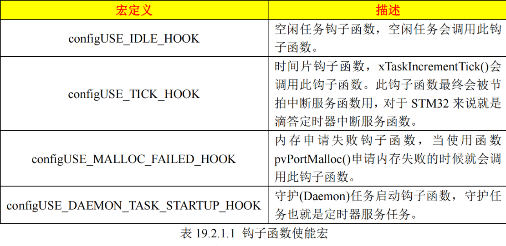

在空闲任务钩子函数里面不能再主动触发任务切换（阻塞延时等），已经是最低优先级了

也可以关闭Tickless，在这里面实现低功耗进入和退出。进出低功耗函数是自定义的，和上面的

PreSleepProcessing等2个函数内容一样

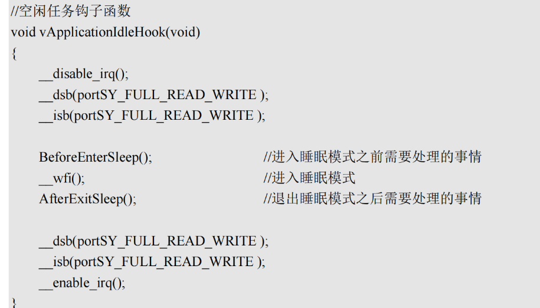


# freeRTOS内存管理

## 概述

<font color='red'>FreeRTOS 的堆是由 `heap_x.c` 文件中定义的一个静态数组（`ucHeap[]`）组成的</font>，
 大小由 `configTOTAL_HEAP_SIZE` 决定，系统启动时就已经放在 RAM 里，
 不需要手动申请，它只是被 `pvPortMalloc()` 动态“使用”而已。

## 🧩 一、堆（Heap）不是运行时申请的，而是**编译时静态分配**的！

也就是说：
 堆这块内存，在你烧录程序进 MCU 前，**就已经被编译器在 RAM 里划出来了**。

它不是用 `malloc()` 或某个函数“申请”的，而是你选用的 `heap_x.c` 文件里定义的一块静态数组。

------

## 🧠 二、看看源码就明白了

比如你工程里使用的是 **`heap_4.c`**（最常用的版本）。

打开 `FreeRTOS/portable/MemMang/heap_4.c`，里面有这一段：

```
/* 定义一块静态数组作为堆空间 */
static uint8_t ucHeap[ configTOTAL_HEAP_SIZE ];

/* 堆的总大小来自 FreeRTOSConfig.h */
#define configTOTAL_HEAP_SIZE    ( ( size_t ) ( 10 * 1024 ) )
```

这就表示：

> 在 RAM 里留出 10KB 空间，作为 FreeRTOS 的“堆内存池”。

------

## 🧰 三、谁来管理这块堆？

FreeRTOS 内部有个专门的分配器函数：

```
void *pvPortMalloc(size_t xWantedSize);
void vPortFree(void *pv);
```

这两个函数操作的就是上面那个 `ucHeap[]` 数组。

也就是说：

- `pvPortMalloc()`：从 `ucHeap[]` 数组中找出一段空闲区域；
- `vPortFree()`：释放这段区域，让以后能再次用。

------

## 🧮 四、系统初始化时什么时候生效？

当你调用 `xTaskCreate()`、`xQueueCreate()`、`xSemaphoreCreateBinary()` 等 FreeRTOS API 时，
 这些函数会在内部调用 `pvPortMalloc()` 去堆里要内存。

比如：

```
xTaskCreate(Task_LED, "LED", 128, NULL, 1, NULL);
```

👉 实际上内部调用了：

```
pxNewTCB = (TCB_t *)pvPortMalloc(sizeof(TCB_t));  // 分配任务控制块
pxStack = (StackType_t *)pvPortMalloc(stack_size); // 分配任务栈
```

所以堆就在这里被真正“用起来”了。


创建队列，任务，信号量有两种方法，要么动态，要么静态，对于静态，自己管理好就行。对于动态，就要内存管理

使用标准C库的malloc()和free()也可以实现动态内存管理，但是

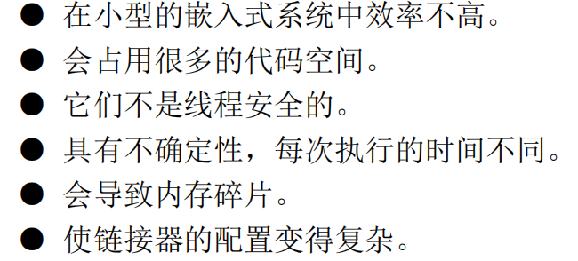

不同的系统对内存的分配和时间要求不同，因此freertos提供了自己的内存分配算法


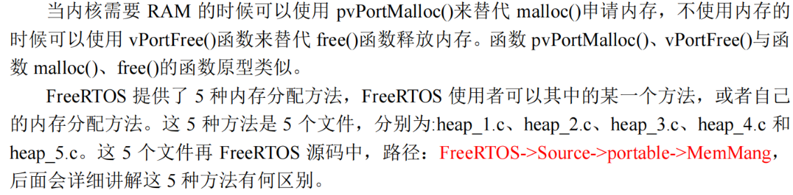


## 内存碎片

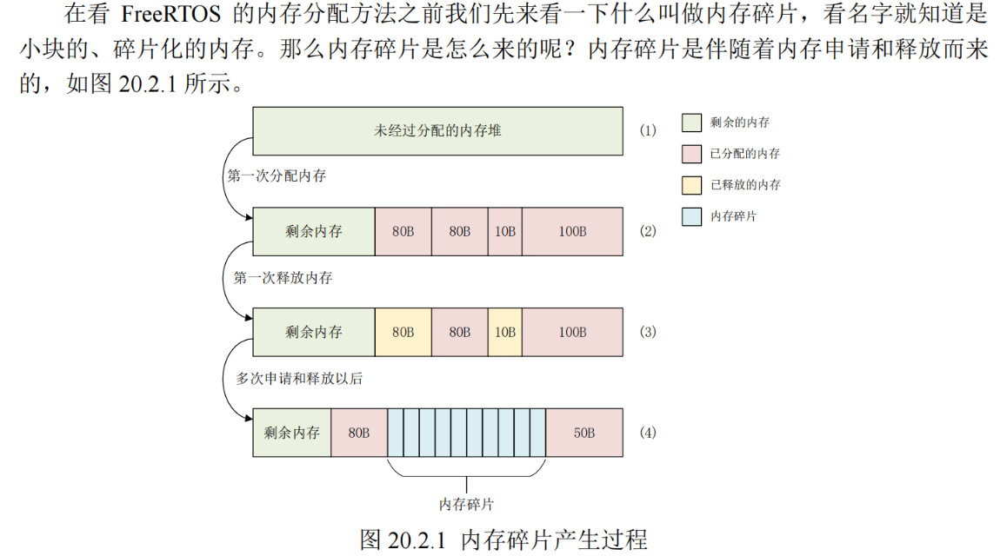

一开始创建4个任务，那么接下来如果有在地址不连续的任务提前释放，就会形成碎片

## 内存分配方法

### heap_1

创建之后不可以回收

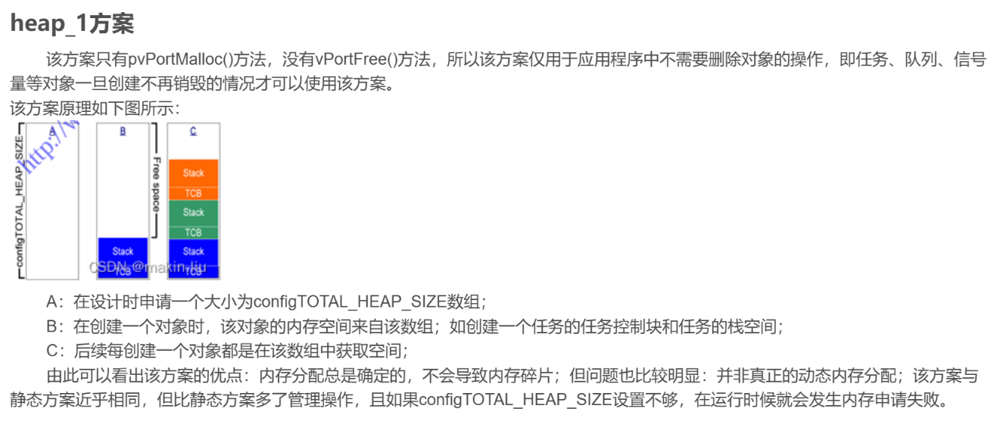

### heap_2

会有碎片产生

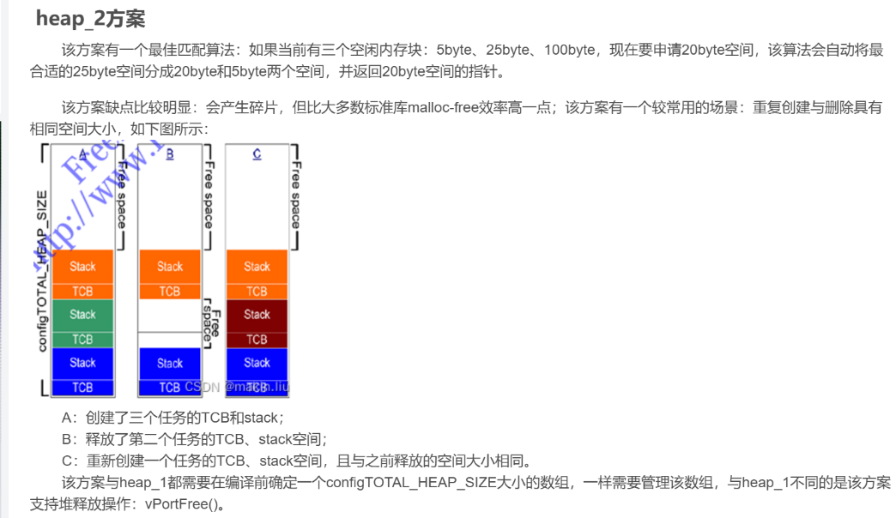


### heap_3


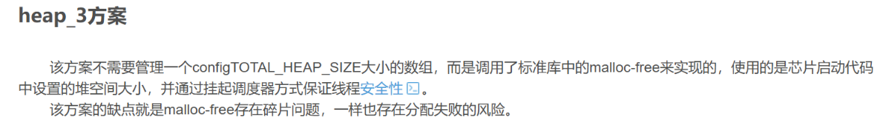

### heap_4

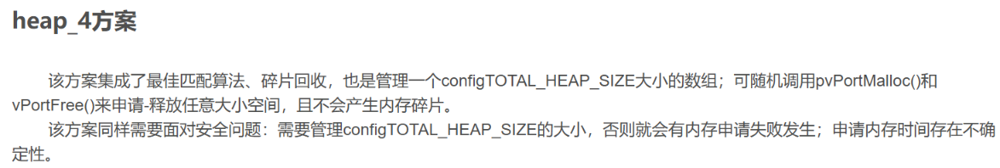


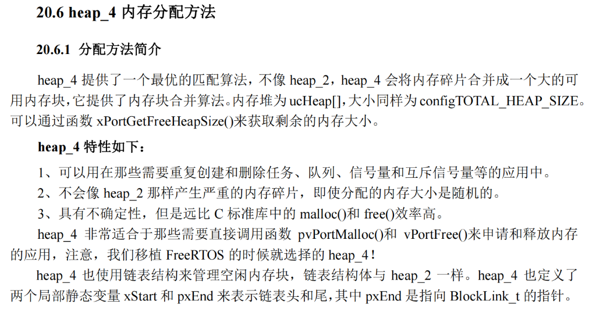

**裸机系统：**

text

```
内存布局：
+------------------+
|      栈          | ← main函数的栈
+------------------+
|      堆          | ← 标准C库管理的堆(malloc/free)
+------------------+
|     数据段       | ← 全局变量
+------------------+
|      代码区      |
+------------------+
```


**RTOS系统：**

text

```
内存布局：
+------------------+
|   任务1栈        | ← 从RTOS堆分配
+------------------+
|   任务2栈        | ← 从RTOS堆分配  
+------------------+
|   RTOS堆         | ← FreeRTOS自己管理的"堆"(其实是个大数组)
+------------------+
|   标准库堆       | ← 可能很小甚至没有
+------------------+
|     数据段       |
+------------------+
|      代码区      |
+------------------+
```

裸机堆区就是一块未使用的内存，这块内存专门留给自己手动申请，释放

OS的任务栈也是从堆区里面划分的，堆区是一个数组的占用空间


# 实战问题

## 初见


```c
//优先级
#define START_TASK_PRIO 1
#define LED0_TASK_PRIO 4
#define LED1_TASK_PRIO 5
#define FLOAT_TASK_PRIO 6
#define KEY_TASK_PRIO 3
//Q:最大可以设置多大少？被配置文件哪个宏决定的？
```

由 **`configMAX_PRIORITIES`** 宏决定,**优先级范围：`0` 到 `configMAX_PRIORITIES - 1`**


```c

//堆栈
#define START_STK_SIZE 128
#define LED0_STK_SIZE 128
#define LED1_STK_SIZE 128
#define FLOAT_STK_SIZE 128
#define KEY_STK_SIZE 128
//Q:分配的时候单位是4字节吧？实际要*4？
```

```c
// 在 task.c 文件中
BaseType_t xTaskCreate( TaskFunction_t pxTaskCode,
                        const char * const pcName,
                        const uint16_t usStackDepth,  // 注意这个参数！
                        void * const pvParameters,
                        UBaseType_t uxPriority,
                        TaskHandle_t * const pxCreatedTask )
{
    TCB_t *pxNewTCB;
    BaseType_t xReturn;
    
    // 为TCB和堆栈分配内存
    pxNewTCB = ( TCB_t * ) pvPortMalloc( sizeof( TCB_t ) );
    
    if( pxNewTCB != NULL ) {
        // 为任务堆栈分配内存 - 关键行！
        pxNewTCB->pxStack = ( StackType_t * ) pvPortMalloc( 
            ( ( size_t ) usStackDepth ) * sizeof( StackType_t ) );  // 这里乘以了sizeof(StackType_t)
        
        if( pxNewTCB->pxStack != NULL ) {
            // 初始化任务...
            prvInitialiseNewTask( pxTaskCode, pcName, usStackDepth, 
                                pvParameters, uxPriority, pxCreatedTask, pxNewTCB );
            xReturn = pdPASS;
        }
    }
    return xReturn;
}
```

对的，V9的freeRTOS单位是字

```c
typedef uint32_t StackType_t;  // 堆栈单位是32位（4字节）
```


```c

//声明 
void start_task(void *pv); 
void led0_task(void *pv); 
void led1_task(void *pv); 
void float_task(void *pv); 
void key_task(void *pv); 
//Q:为什么要参数，并且是万能指针？
```

也就是说，如果LED控制逻辑一样，只是控制的参数不同的话(亮灭时间不同），就可以复用相同的代码逻辑。再创建多个任务。

```c
// 没有参数 - 只能创建相同的LED任务
void led_task(void *pv) {
    HAL_GPIO_TogglePin(GPIOB, GPIO_PIN_0);  // 固定控制PB0
}

// 有参数 - 可以控制不同的LED
void led_task(void *pv) {
    LED_Config *led_cfg = (LED_Config *)pv;  // 通过参数区分
    HAL_GPIO_TogglePin(led_cfg->port, led_cfg->pin);
}

// 创建多个不同的LED任务
LED_Config led1_cfg = {GPIOB, GPIO_PIN_0, 500};  // PB0, 500ms
LED_Config led2_cfg = {GPIOB, GPIO_PIN_1, 1000}; // PB1, 1000ms

xTaskCreate(led_task, "LED1", 128, &led1_cfg, 4, NULL);
xTaskCreate(led_task, "LED2", 128, &led2_cfg, 4, NULL);
```


 

```c
xTaskCreate((TaskFunction_t)start_task,

​          (const char *)"start_task",

​          (uint16_t) START_STK_SIZE,

​          (void *)NULL,

​          (UBaseType_t)START_TASK_PRIO,

​          (TaskHandle_t*)&StartTask_Handler

​        );

​      //Q:能不能不在参数前面强制转换？很麻烦
```

可以，本来就是隐式强转


```c
void start_task(void *pv){
    taskENTER_CRITICAL();

    xTaskCreate(led0_task,
                "led0_task",
                LED0_STK_SIZE,
                NULL,
                LED0_TASK_PRIO,
                &LED0Task_Handler);
    
    xTaskCreate(led1_task,
                "led1_task",
                LED1_STK_SIZE,
                NULL,
                LED1_TASK_PRIO,
                &LED1Task_Handler);
    xTaskCreate(float_task,
                "flaot_task",
                FLOAT_STK_SIZE,
                NULL,
                FLOAT_TASK_PRIO,
                &FLOATTask_Handler);
    xTaskCreate(key_task,
                "key_task",
                KEY_STK_SIZE,
                NULL,
                KEY_TASK_PRIO,
                &KEYTask_Handler);

    vTaskDelete(StartTask_Handler);
        //Q：删除自身在空闲任务里面才释放对吧？
    taskEXIT_CRITICAL();
    
}
```


**删除过程**：

1. **立即发生**：任务立即停止执行，从就绪/运行态移除
2. **资源标记**：TCB和堆栈标记为"待释放"
3. **空闲任务清理**：由空闲任务实际释放内存


```c
void start_task(void *pv){
    taskENTER_CRITICAL();           // 进入临界区

    // 创建多个任务...
    
    vTaskDelete(StartTask_Handler); // ❌ 在临界区内删除自身！
    taskEXIT_CRITICAL();            // ❌ 这行代码永远不会执行c！
}
//AI说交换下上面两行的顺序，并且是用vTaskDelete(NULL)
```


```c
 vTaskDelay(1000);//Q：这个能放在程序中间吗？毕竟回来之后还会接着往下运行
```

当然没问题

## 消息队列

```c
 xLEDQueue=xQueueCreate(10,sizeof(LED_Command_t));//Q:为什么创建10个，明明只用了一个？来当缓冲？
```

相当于一个数组，第一个参数是数组的大小，第二个参数是数组单位元素的大小


按键每次按下都会发送，然后LED任务去接收处理。我们设置保持时间是1s，也就是接收到了就vTaskDelay(1000)

```c
 xQueueSend(xLEDQueue, &cmd2, 0);//Q:队列满了，再向队列发消息会失败还是覆盖？    失败，连点试试
```


如果队列的大小是1.那么很容易出现队列满，导致发送失败（队列满了再发送数据不会覆盖），也就是数据丢失。

队列会满是因为接收方没有及时接收


```c
//队列句柄

QueueHandle_t xLEDQueue;//Q:指向的是队列控制块？队列结构？
```

对，见下面

## 信号量

互斥访问资源

```c
 // 创建二值信号量
    xUARTMutex = xSemaphoreCreateBinary();
    if(xUARTMutex == NULL) {
        printf("信号量创建失败!\r\n");
    } else {
        printf("串口互斥信号量创建成功!\r\n");
        xSemaphoreGive(xUARTMutex);  // 初始化为可用
    }
   //Q：返回的是信号量句柄？和任务句柄一样吗？都指向任务控制块？
```

信号量的本质是长度是1的队列，信号量句柄实际上就是队列句柄，指向队列控制块


```c
typedef struct QueueDefinition
{
    int8_t *pcHead;              // 队列缓冲区头
    int8_t *pcTail;              // 队列缓冲区尾
    int8_t *pcWriteTo;           // 当前写入位置
    int8_t *pcReadFrom;          // 当前读取位置
    List_t xTasksWaitingToSend;  // 等待发送的任务列表
    List_t xTasksWaitingToReceive; // 等待接收的任务列表
    volatile UBaseType_t uxMessagesWaiting; // 当前队列中消息数量
    UBaseType_t uxLength;        // 队列长度
    UBaseType_t uxItemSize;      // 每个消息大小
    ...
} Queue_t;


typedef struct tskTaskControlBlock
{
    StackType_t *pxTopOfStack;   // 当前任务栈顶指针
    ListItem_t xStateListItem;   // 就绪、阻塞等状态链表节点
    ListItem_t xEventListItem;   // 等待事件（如信号量）的链表节点
    StackType_t *pxStack;        // 任务栈起始地址
    char pcTaskName[configMAX_TASK_NAME_LEN]; // 任务名
    UBaseType_t uxPriority;      // 任务优先级
    ...
} TCB_t;

```


```c
堆区内存（FreeRTOS自己管理的一大块RAM）
┌────────────────────────────────────┐
│                                    │
│  [TCB_t]   ←── TaskHandle_t(task1) │   ← 任务句柄指向任务控制块
│  [Stack1]                           │   ← 任务自己的栈空间
│                                    │
│  [Queue_t] ←── SemaphoreHandle_t   │   ← 信号量/队列句柄指向队列控制块
│  [Queue Buffer]                    │   ← 队列或信号量的数据存放处
│                                    │
└────────────────────────────────────┘

```


注意：在等待信号量或者消息的过程中，任务都是被阻塞的，CPU去执行其他任务，只有当阻塞时间到了或者拿到了信号量才会切换到运行态

多个任务都要用串口，那么就轮流拿取这个信号。

纠正：时间片轮转时，可以看作多个任务几乎并行运行，但是如果一个任务拿到了信号，其他任务运行一次后就会被阻塞，时间片就失效了（因为只有它可以运行）

感觉和消息队列差不太多


## 事件标志组

```c
#define TEMP_HIGH_BIT (1UL<<0)//Q:为什么要加括号并且加UL? 
```

防止数学运算的时候出错

```c
// 不加括号的危险：
#define TEMP_HIGH_BIT 1UL << 0

// 使用时可能出问题：
if(events & TEMP_HIGH_BIT == 1) {
    // 编译器理解为：events & (1UL << 0 == 1)
    // 实际是：events & (1UL << (0 == 1))
    // 这完全不是我们想要的意思！
}

// 加括号后安全：
#define TEMP_HIGH_BIT (1UL << 0)
if(events & TEMP_HIGH_BIT == 1) {
    // 编译器理解为：(events & (1UL << 0)) == 1
    // 这才是正确的！
}
```

有符号整数的话，有一位是符号位

```c
// 在32位系统中：
#define BIT_31 (1 << 31)   // ❌ 有符号整数，结果是负数！
#define BIT_31 (1UL << 31) // ✅ 无符号整数，正确

// 使用：
uint32_t events = 0;
events |= BIT_31;  // 如果是 (1 << 31)，会警告符号问题
```


## 软件定时器

```c
 xSoilCheckTimer=xTimerCreate("SoilCheck",pdMS_TO_TICKS(3000),pdTRUE,0,soil_check_callback);
//Q:回调函数void soil_check_callback(TimerHandle_t xTimer)里面也有参数，我传入了吗？

```

在这个函数里面会自己操作一个控制块地址，这个地址一个用来返回，另一个用来传入当传入的参数


## 任务通知模拟信号量


## 2大API

<font color='red'>本质：调用xTaskGenericNotify传递参数数量不同</font>

API家族1

简化版API（专为eIncrement模式）

没有具体的数字，模拟信号量

```c
// 发送：直接递增通知值
void vTaskNotifyGive(TaskHandle_t xTaskToNotify);
BaseType_t xTaskNotifyGive(TaskHandle_t xTaskToNotify);

// 接收：获取并清零通知值
uint32_t ulTaskNotifyTake(BaseType_t xClearCountOnExit, TickType_t xTicksToWait);
```

底层

```c
#define xTaskNotifyGive( xTaskToNotify ) xTaskGenericNotify( ( xTaskToNotify ), ( 0 ), eIncrement, NULL )

```

模拟二值信号量的话，就要把xClearCountOnExit参数改成pdTURE,这样的话拿到就会清零那32位的值；无论释放了几次通知（在eIncrement模式下，每通知一次就会使那32位的值++），最终只会执行一次

反之，就是计数信号，调用函数释放了几次，始终会接收几次


家族2

完整模式

```c
// 发送：支持所有5种模式
BaseType_t xTaskNotify(TaskHandle_t xTaskToNotify, 
                       uint32_t ulValue, 
                       eNotifyAction eAction);

// 接收：灵活的参数控制
BaseType_t xTaskNotifyWait(uint32_t ulBitsToClearOnEntry,
                           uint32_t ulBitsToClearOnExit,
                           uint32_t *pulNotificationValue,
                           TickType_t xTicksToWait);
```


底层

```c
BaseType_t xTaskGenericNotify( TaskHandle_t xTaskToNotify, uint32_t ulValue, eNotifyAction eAction, uint32_t *pulPreviousNotificationValue ) PRIVILEGED_FUNCTION;

#define xTaskNotify( xTaskToNotify, ulValue, eAction ) xTaskGenericNotify( ( xTaskToNotify ), ( ulValue ), ( eAction ), NULL )
```


## 任务通知模拟消息邮箱

```c
 err=xTaskNotifyWait(0x00,0xffffffffUL,&NotifyValue,portMAX_DELAY);
        //Q:另一个api返回的是32位的任务通知值？对
err=xTaskNotify(KEY_Handler,key,eSetValueWithOverwrite);
         //Q:覆写，覆盖的是32位的任务通知吗？那只能一次只能发一个？
```

对，所以叫做邮箱，覆写模式下，发一次，下一次发送就覆盖

## 5种模式


| 模式                            | 英文名 | 通知值的变化             | 若上次值未读取   | 典型用途                     |
| ------------------------------- | ------ | ------------------------ | ---------------- | ---------------------------- |
| **① eNoAction**                 | 无动作 | 不改通知值               | 无影响           | 相当于“任务同步”，只唤醒任务 |
| **② eSetBits**                  | 置位   | `NotifyValue             | = bits`          | 累积多个事件                 |
| **③ eIncrement**                | 自增   | `NotifyValue++`          | 继续加           | 统计次数（如中断计数）       |
| **④ eSetValueWithOverwrite**    | 覆写   | `NotifyValue = newValue` | 直接覆盖         | 只关心最后一个值的情况       |
| **⑤ eSetValueWithoutOverwrite** | 不覆盖 | `NotifyValue = newValue` | 忽略（返回失败） | 确保不丢数据的场合           |

| 模式                      | 比喻                       |
| ------------------------- | -------------------------- |
| eNoAction                 | 按门铃，不放信（只唤醒）   |
| eSetBits                  | 邮箱里放一封“可以累积的信” |
| eIncrement                | 邮递次数 +1                |
| eSetValueWithOverwrite    | 丢掉旧信，直接放新信       |
| eSetValueWithoutOverwrite | 邮箱有信就不放（防止覆盖） |

## 任务通知模拟事件标志组

```c
xTaskNotify(LED_Handler,EVENTBIT_0,eSetBits);

 err=xTaskNotifyWait(0x00,0xffffffffUL,&NotifyValue,portMAX_DELAY);
```

总结：

每个任务自带一个32位的任务通知，还有32/16位的事件标志组。

其实模拟就是不同模式下的任务通知，信号量用eincrement,消息邮箱用eSetValueWithOverwrite，事件标志组用eSetBits

