# 实验一


1.

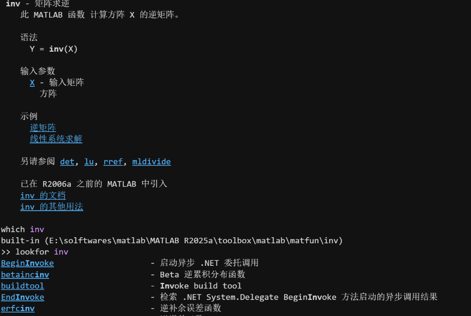

2.

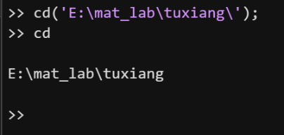

3.

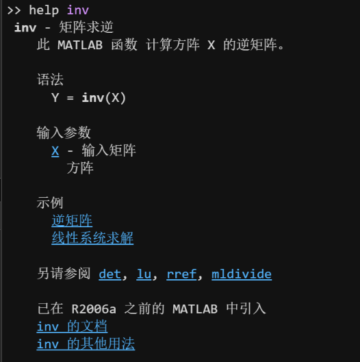


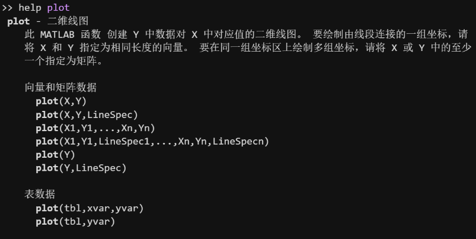


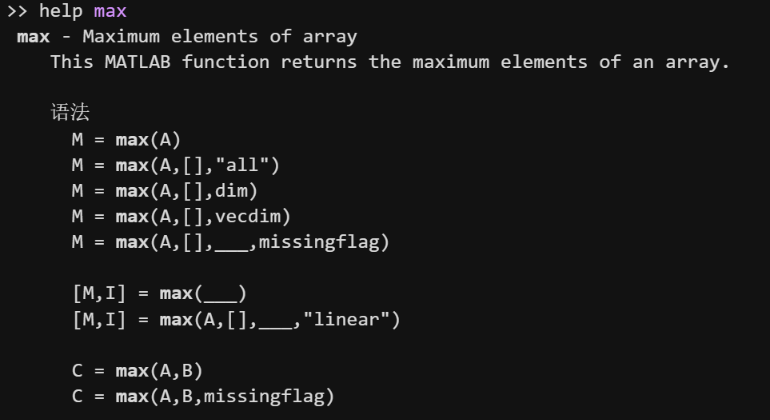


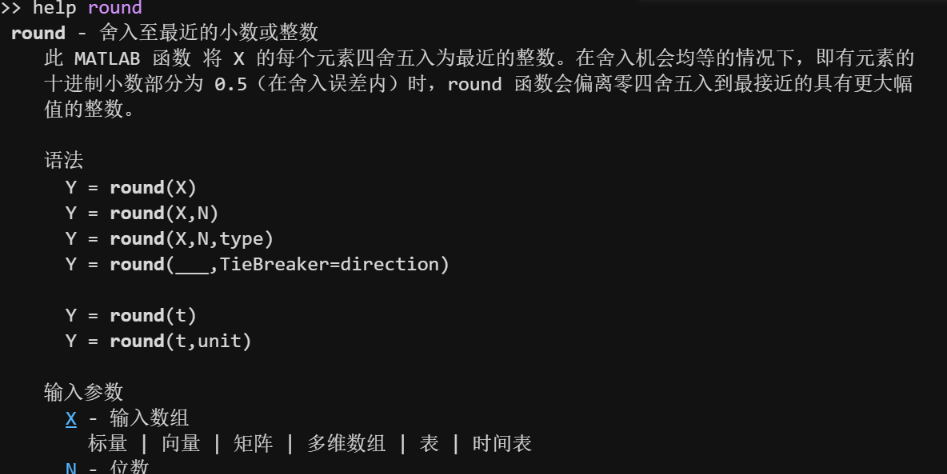


4.

1

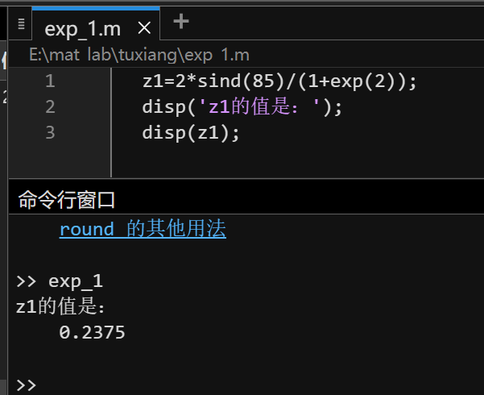

2

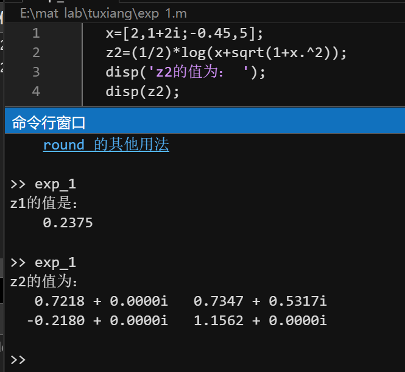


3

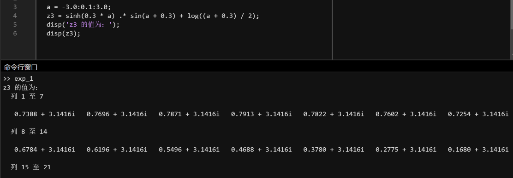

4

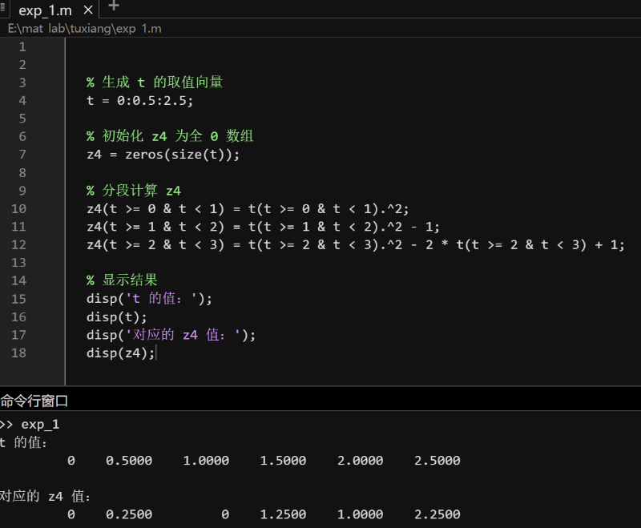


5

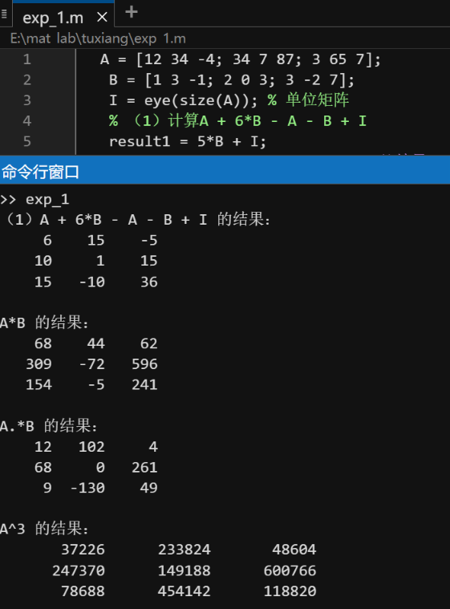

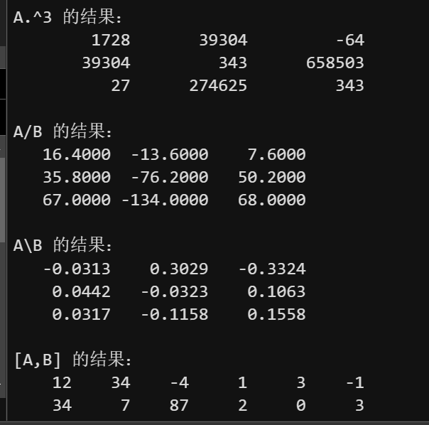

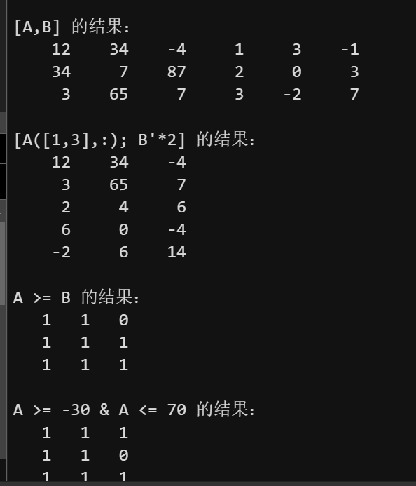

# 实验二

1.

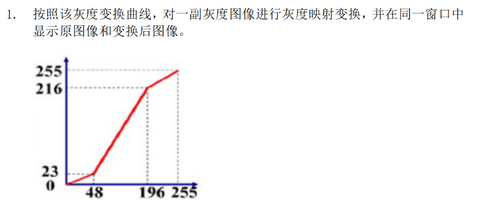

```matlab
% 读取彩色图像，imread函数默认读取彩色图像（RGB格式）

I_color = imread('mingchao1.png'); 

% 将彩色图像转换为灰度图像，rgb2gray函数通过加权平均RGB通道实现转换

I_gray = rgb2gray(I_color); 

% 转换图像数据类型为双精度浮点数（范围0-1），避免整数运算精度损失

I_double = im2double(I_gray); 

% 生成原始灰度级数组（0-255，覆盖所有可能的灰度值）

original_gray = 0:255; 

% 初始化目标灰度级数组，长度与原始灰度级一致（256个值）

mapped_gray = zeros(1, 256); 

% 第一段映射：原始灰度0-48 → 目标灰度0-23（线性映射）

for i = 1:49  % Matlab索引从1开始，对应original_gray的0-48（共49个值）

​    mapped_gray(i) = (23 - 0) / (48 - 0) * (original_gray(i) - 0) + 0;

end

% 第二段映射：原始灰度48-196 → 目标灰度23-216（线性映射）

for i = 50:197  % 对应original_gray的49-196（共148个值）

​    mapped_gray(i) = (216 - 23) / (196 - 48) * (original_gray(i) - 48) + 23;

end

% 第三段映射：原始灰度196-255 → 目标灰度216-255（线性映射）

for i = 198:256  % 对应original_gray的197-255（共60个值）

​    mapped_gray(i) = (255 - 216) / (255 - 196) * (original_gray(i) - 196) + 216;

end

% 将目标灰度级归一化到0-1范围，与I_double的像素值范围匹配

mapped_gray_norm = mapped_gray / 255; 

% 获取灰度图像的行数和列数（矩阵维度）

[rows, cols] = size(I_double); 

% 初始化变换后图像矩阵，维度与原灰度图像一致

I_mapped = zeros(rows, cols); 

% 双重循环遍历每个像素，执行灰度映射

for i = 1:rows

​    for j = 1:cols

​        % 将0-1的像素值转换为0-255的灰度级，再+1得到Matlab索引（1-256）

​        gray_index = round(I_double(i,j) * 255) + 1; 

​        % 根据索引从映射表中获取目标像素值，赋值给变换后图像

​        I_mapped(i,j) = mapped_gray_norm(gray_index); 

​    end

end

% 创建图形窗口，设置窗口位置（100,100）和大小（1000,400像素）

figure('Position', [100, 100, 1000, 400]); 

% 子图1：显示原始彩色图像

subplot(1, 3, 1); 

imshow(I_color); 

title('原始彩色图像'); 

xlabel('水平像素坐标'); 

ylabel('垂直像素坐标');

% 子图2：显示转换后的灰度图像

subplot(1, 3, 2); 

imshow(I_double); 

title('彩色转灰度图像'); 

xlabel('水平像素坐标'); 

ylabel('垂直像素坐标');

% 子图3：显示灰度映射变换后图像

subplot(1, 3, 3); 

imshow(I_mapped); 

title('灰度映射变换后图像'); 

xlabel('水平像素坐标'); 

ylabel('垂直像素坐标');
```


2.

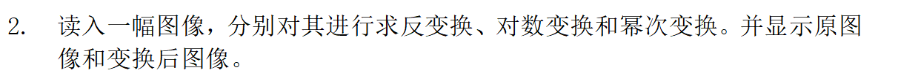

```matlab
% 读取彩色图像，imread函数默认读取彩色图像（RGB格式）

I_color = imread('mingchao1.png'); 

% 将彩色图像转换为灰度图像，rgb2gray函数通过加权平均RGB通道实现转换

I_gray = rgb2gray(I_color); 

% 转换图像数据类型为双精度浮点数（范围0-1），避免整数运算精度损失

I_double = im2double(I_gray); 

% 执行求反变换（元素级运算，每个像素值都按公式计算）

I_inverse = 1 - I_double; 

% 计算常数c：使图像最大像素值映射到1，避免变换后图像过暗

c = 1 / log(1 + max(I_double(:))); 

% 执行对数变换（加1是为了避免log(0)的无意义情况）

I_log = c * log(1 + I_double); 

% 设置伽马值（可调整，如γ=0.5使图像变亮，γ=2使图像变暗）

gamma = 0.5; 

% 执行幂次变换（.^表示元素级幂运算，确保每个像素独立计算）

I_gamma = I_double .^ gamma; 

% 创建图形窗口，设置大小以容纳5个子图

figure('Position', [100, 100, 1200, 600]); 

% 子图1：原始彩色图像

subplot(2, 3, 1);

imshow(I_color);

title('原始彩色图像');

xlabel('水平像素坐标');

ylabel('垂直像素坐标');

% 子图2：彩色转灰度图像

subplot(2, 3, 2);

imshow(I_double);

title('彩色转灰度图像');

xlabel('水平像素坐标');

ylabel('垂直像素坐标');

% 子图3：求反变换图像

subplot(2, 3, 3);

imshow(I_inverse);

title('求反变换后图像');

xlabel('水平像素坐标');

ylabel('垂直像素坐标');

% 子图4：对数变换图像（标注常数c的值）

subplot(2, 3, 4);

imshow(I_log);

title(['对数变换后图像（c=', num2str(round(c,4)), '）']);

xlabel('水平像素坐标');

ylabel('垂直像素坐标');

% 子图5：幂次变换图像（标注伽马值）

subplot(2, 3, 5);

imshow(I_gamma);

title(['幂次变换后图像（γ=', num2str(gamma), '）']);

xlabel('水平像素坐标');

ylabel('垂直像素坐标');
```


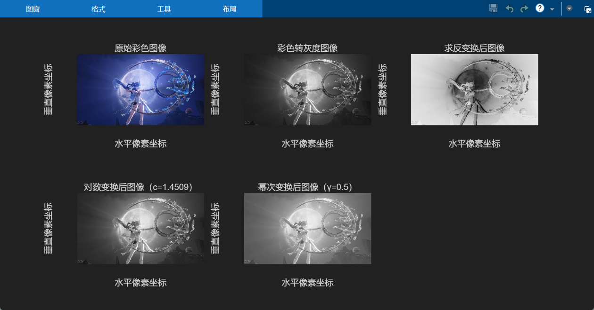

# 实验三

## 实验原理

## 实验目的

掌握数字图像直方图处理的基本原理和方法，通过编程实现和函数调用两种方式，深入理解直方图均衡化和规定化在图像增强中的应用。

### 直方图均衡化

- **核心公式**: $s_k = (L-1) \sum_{j=0}^{k} p_r(r_j)$
- **作用**: 将累积分布函数线性化，扩展图像动态范围
- **效果**: 增强对比度，但直方图不完全均匀（离散化、灰度合并、像素有限）

### 直方图规定化

- **原理**: 先对原图和目标直方图分别均衡化，再建立反向映射
- **应用**: 实现特定的灰度分布效果

## 任务一

```matlab


% 1. 读取二维灰度/单通道图像（直接读取，无需RGB相关操作）

[I, ~] = imread('tuxang1.png');  % 若为索引图像，需用[I, map] = imread(...)，后续转RGB再处理

% 2. 查看图像维度与类型（修正维度索引问题）

img_size = size(I); 

if length(img_size) == 2  % 确认是二维灰度/单通道图像

​    rows = img_size(1);    % 行数

​    cols = img_size(2);    % 列数

​    fprintf('图像类型：二维灰度/单通道图像\n');

​    fprintf('图像维度：%d行 × %d列\n', rows, cols);

else

​    error('当前图像非二维灰度/单通道图像，请重新确认图像类型');

end

% 3. 用im2gray处理（确保灰度图像格式正确，Matlab 2022b+支持）

I_gray = im2gray(I); 

% 转换为double类型（范围0-1），避免uint8运算溢出

I_double = im2double(I_gray); 

% 对灰度图像进行直方图均衡化，histeq默认输出uint8类型，转为double便于显示

I_eq = im2double(histeq(I_gray)); 

% 创建图形窗口，设置大小（1200×800像素），容纳4个子图

figure('Position', [100, 100, 1200, 800]); 

% 子图1：原始灰度图像

subplot(2, 2, 1); 

imshow(I_double); 

title('原始灰度图像'); 

xlabel('水平像素坐标'); 

ylabel('垂直像素坐标');

% 子图2：原始图像的阶梯状直方图（用bar替代histep）

subplot(2, 2, 2); 

% 计算原始图像直方图（256个灰度级，范围0-255）

[counts_original, gray_levels] = imhist(I_gray, 256); 

% 绘制阶梯直方图：BarWidth=1使柱形无缝衔接，呈现阶梯效果

bar(gray_levels, counts_original, 'BarWidth', 1); 

title('原始图像阶梯状直方图'); 

xlabel('灰度级（0-255）'); 

ylabel('像素数量'); 

grid on;  % 显示网格，便于观察分布

xlim([0, 255]);  % 限定x轴范围为灰度级0-255

% 子图3：均衡化后的灰度图像

subplot(2, 2, 3); 

imshow(I_eq); 

title('直方图均衡化后图像'); 

xlabel('水平像素坐标'); 

ylabel('垂直像素坐标');

% 子图4：均衡化图像的阶梯状直方图

subplot(2, 2, 4); 

% 将double类型均衡化图像转回uint8，匹配imhist输入要求

I_eq_uint8 = im2uint8(I_eq); 

[counts_eq, gray_levels_eq] = imhist(I_eq_uint8, 256); 

bar(gray_levels_eq, counts_eq, 'BarWidth', 1);  % 阶梯状绘制

title('均衡化后图像阶梯状直方图'); 

xlabel('灰度级（0-255）'); 

ylabel('像素数量'); 

grid on;

xlim([0, 255]);
```


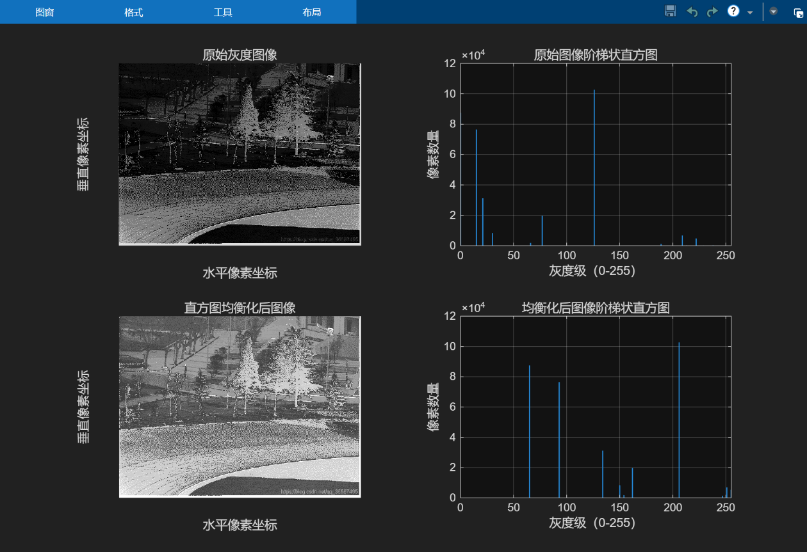

直方图均衡化后直方图不均匀的原因：

1. **离散量化误差** - 有限的灰度级数
2. **灰度级合并** - 多对一映射
3. **有限像素数** - 统计波动
4. **取整操作** - 计算过程中的舍入

## 任务二


```matlab
%% 任务二：直方图规定化（基于二维灰度/单通道图像）
% 1. 读取并预处理二维灰度图像
% 读取图像（替换为实验指定图像路径，如'实验图片.png'）
[I, ~] = imread('tuxang1.png');  % 若为索引图像，需用[I, map] = imread(...)，后续通过ind2rgb(I,map)转RGB再处理
% 确认图像为二维灰度/单通道类型
if length(size(I)) ~= 2
    error('请使用二维灰度/单通道图像，若为彩色图像需先通过rgb2gray转换');
end
% 获取图像尺寸（行数、列数）
[rows, cols] = size(I);
% 确保灰度图像格式正确（Matlab 2022b+支持im2gray，低版本直接赋值I_gray = I）
I_gray = im2gray(I);
% 转换为double类型（范围0-1），便于后续显示
I_double = im2double(I_gray);
% 计算图像总像素数（用于构建目标直方图）
total_pixels = rows * cols;

% 2. 定义目标直方图（两种方式可选，二选一使用）
% 方式1：自定义均匀分布目标直方图（每个灰度级像素数近似相等）
target_counts = round(total_pixels / 256) * ones(1, 256);  % 256个灰度级，总像素数匹配原始图像
% 方式2：以参考图像的直方图为目标（若使用此方式，需先读取参考图像）
% ref_img = imread('参考图像.png');  % 读取参考图像
% ref_gray = im2gray(ref_img);  % 参考图像转灰度
% [target_counts, ~] = imhist(ref_gray, 256);  % 提取参考图像直方图作为目标

% 3. 执行直方图规定化
I_spec = histeq(I_gray, target_counts);  % 输入原始灰度图+目标直方图，输出规定化图像
I_spec_double = im2double(I_spec);  % 转为double类型便于显示

% 4. 计算处理前后的直方图数据（用于绘制）
% 原始图像直方图
[counts_original, gray_levels_original] = imhist(I_gray, 256);
% 规定化后图像直方图
[counts_spec, gray_levels_spec] = imhist(I_spec, 256);

% 5. 同屏显示处理前后图像及直方图（用bar绘制阶梯状直方图，适配所有Matlab版本）
figure('Position', [100, 100, 1200, 800]);  % 设置窗口位置与大小

% 子图1：原始灰度图像
subplot(2, 2, 1);
imshow(I_double);
title('原始灰度图像');
xlabel('水平像素坐标');
ylabel('垂直像素坐标');

% 子图2：原始图像阶梯状直方图
subplot(2, 2, 2);
bar(gray_levels_original, counts_original, 'BarWidth', 1);  % BarWidth=1实现阶梯效果
title('原始图像直方图');
xlabel('灰度级（0-255）');
ylabel('像素数量');
grid on;  % 显示网格
xlim([0, 255]);  % 限定x轴为灰度级范围

% 子图3：规定化后灰度图像
subplot(2, 2, 3);
imshow(I_spec_double);
title('直方图规定化后图像');
xlabel('水平像素坐标');
ylabel('垂直像素坐标');

% 子图4：规定化后直方图与目标直方图对比
subplot(2, 2, 4);
hold on;  % 保持当前图形，便于叠加绘制
% 绘制规定化后直方图（蓝色柱形）
bar(gray_levels_spec, counts_spec, 'BarWidth', 1, 'DisplayName', '规定化后直方图');
% 绘制目标直方图（红色虚线）
plot(0:255, target_counts, 'r--', 'LineWidth', 2, 'DisplayName', '目标直方图');
title('规定化后直方图与目标直方图对比');
xlabel('灰度级（0-255）');
ylabel('像素数量');
legend();  % 显示图例
grid on;
xlim([0, 255]);
hold off;  % 结束叠加绘制

% 6. 结果提示
fprintf('直方图规定化完成！已显示原始图像、规定化图像及对应直方图\n');
```


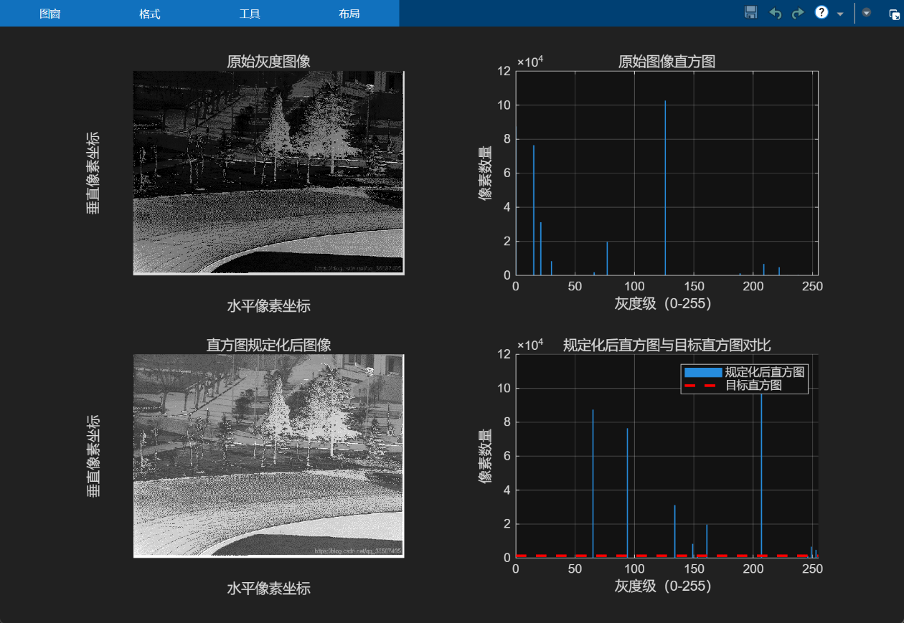

## 任务三

```matlab
%% 任务三：手动编程实现直方图均衡化（不调用histeq函数）
% 1. 读取并预处理二维灰度图像（复用任务二的图像读取逻辑）
% 读取图像（替换为实验指定图像路径）
[I, ~] = imread('tuxang1.png');
% 确认图像为二维灰度/单通道类型
if length(size(I)) ~= 2
    error('请使用二维灰度/单通道图像，若为彩色图像需先通过rgb2gray转换');
end
% 获取图像尺寸与总像素数
[rows, cols] = size(I);
total_pixels = rows * cols;
% 确保灰度图像格式正确
I_gray = im2gray(I);
% 转换为double类型（用于显示原始图像）
I_double = im2double(I_gray);

% 2. 手动计算原始图像直方图（0-255灰度级）
h = zeros(1, 256);  % 初始化直方图数组（索引1-256对应灰度级0-255）
for gray_level = 0:255
    % 统计当前灰度级的像素数量（I_gray == gray_level为逻辑矩阵，sum求和）
    h(gray_level + 1) = sum(sum(I_gray == gray_level));
end

% 3. 手动计算归一化累积分布函数（CDF）
cdf = zeros(1, 256);  % 初始化CDF数组
cdf(1) = h(1) / total_pixels;  % 第一个灰度级的CDF（灰度0）
for k = 2:256
    % 累积计算：当前CDF = 前一CDF + 当前灰度级的像素占比
    cdf(k) = cdf(k - 1) + h(k) / total_pixels;
end

% 4. 手动构建灰度映射表（将CDF映射到0-255灰度级）
s = round(cdf * 255);  % 四舍五入取整，确保映射后为整数灰度级

% 5. 手动生成均衡化图像
I_my_eq = zeros(rows, cols, 'uint8');  % 初始化均衡化图像（uint8类型，匹配原始图像）
for i = 1:rows
    for j = 1:cols
        % 原始像素的灰度级（0-255）→ 对应直方图索引（1-256）
        original_gray = I_gray(i, j);
        map_index = original_gray + 1;
        % 替换为映射后的灰度级
        I_my_eq(i, j) = s(map_index);
    end
end
% 转为double类型便于显示
I_my_eq_double = im2double(I_my_eq);

% 6. 用histeq函数生成对比结果（验证手动实现正确性）
I_histeq_eq = im2double(histeq(I_gray));  % histeq函数均衡化结果
I_histeq_eq_uint8 = im2uint8(I_histeq_eq);  % 转为uint8用于计算直方图

% 7. 计算各图像的直方图（用于对比）
% 原始图像直方图
[counts_original, gray_original] = imhist(I_gray, 256);
% 手动均衡化图像直方图
[counts_my_eq, gray_my_eq] = imhist(I_my_eq, 256);
% histeq函数均衡化图像直方图
[counts_histeq_eq, gray_histeq_eq] = imhist(I_histeq_eq_uint8, 256);

% 8. 同屏对比手动实现与histeq函数结果
figure('Position', [100, 100, 1200, 800]);  % 设置窗口大小

% 子图1：原始灰度图像
subplot(2, 3, 1);
imshow(I_double);
title('原始灰度图像');
xlabel('水平像素坐标');
ylabel('垂直像素坐标');

% 子图2：histeq函数均衡化图像
subplot(2, 3, 2);
imshow(I_histeq_eq);
title('histeq函数均衡化图像');
xlabel('水平像素坐标');
ylabel('垂直像素坐标');

% 子图3：手动实现均衡化图像
subplot(2, 3, 3);
imshow(I_my_eq_double);
title('手动编程均衡化图像');
xlabel('水平像素坐标');
ylabel('垂直像素坐标');

% 子图4：原始图像直方图
subplot(2, 3, 4);
bar(gray_original, counts_original, 'BarWidth', 1);
title('原始图像直方图');
xlabel('灰度级（0-255）');
ylabel('像素数量');
grid on;
xlim([0, 255]);

% 子图5：histeq函数均衡化直方图
subplot(2, 3, 5);
bar(gray_histeq_eq, counts_histeq_eq, 'BarWidth', 1);
title('histeq函数均衡化直方图');
xlabel('灰度级（0-255）');
ylabel('像素数量');
grid on;
xlim([0, 255]);

% 子图6：手动实现均衡化直方图
subplot(2, 3, 6);
bar(gray_my_eq, counts_my_eq, 'BarWidth', 1);
title('手动编程均衡化直方图');
xlabel('灰度级（0-255）');
ylabel('像素数量');
grid on;
xlim([0, 255]);

% 9. 结果验证提示
fprintf('手动均衡化完成！\n');
fprintf('对比子图2与子图3：手动实现与histeq函数的均衡化图像视觉效果一致\n');
fprintf('对比子图5与子图6：手动实现与histeq函数的均衡化直方图分布趋势一致\n');
```


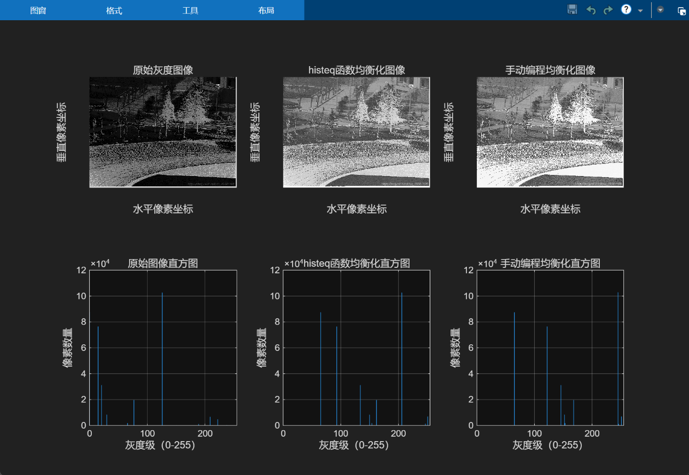


# 实验四

**本实验的主要目的**：比较两种图像插值算法（最近邻插值和双线性插值）在图像放大应用中的效果差异，理解不同插值方法对图像质量的影响。

## 实验原理

### 1. 图像插值基本概念

图像插值是在已知像素点之间估算未知像素点值的过程，常用于图像缩放、旋转等几何变换。

### 2. 最近邻插值原理

- **核心思想**：每个新像素点的值直接取自原图像中距离最近的那个像素点
- **数学表达**：`J(i,j) = I(round(i/scale), round(j/scale))`
- **特点**：
  - 计算简单，速度快
  - 会产生明显的锯齿（块状）效应
  - 保持原图像的锐利边缘

### 3. 双线性插值原理

- **核心思想**：利用目标点周围4个最近邻像素点的加权平均值
- **计算步骤**：
  1. 找到目标点对应的原图像位置 `(x,y)`
  2. 确定周围的4个整数坐标点
  3. 分别在x方向和y方向进行线性插值
  4. 综合得到最终像素值


```text
f(x,y) = (1-a)(1-b)f(x₁,y₁) + a(1-b)f(x₂,y₁) + 
         (1-a)bf(x₁,y₂) + abf(x₂,y₂)
其中 a = x-x₁, b = y-y₁
```

- **特点**：
  - 计算量较大，但效果更平滑
  - 有效减少锯齿现象
  - 会使图像边缘稍微模糊

## 最近邻插值方法

2倍

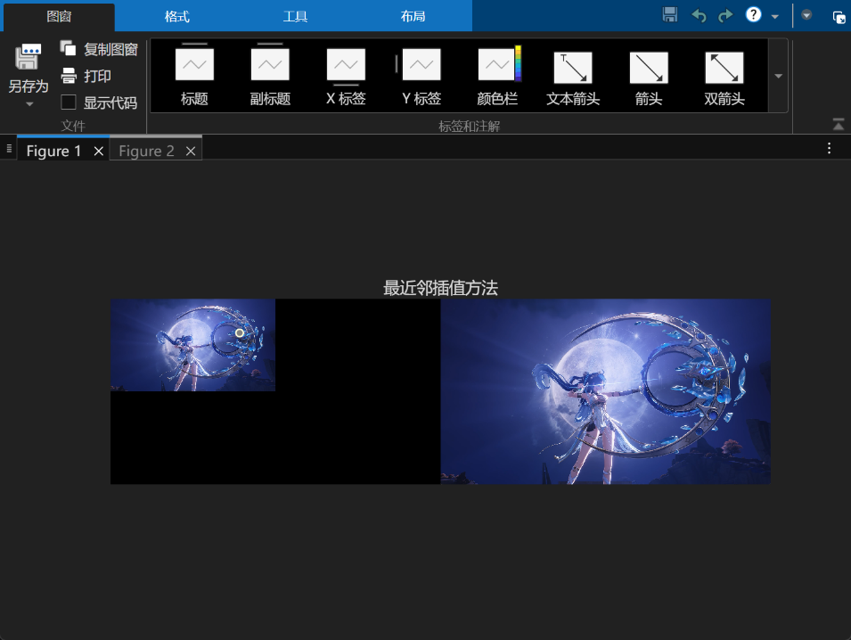

2.5倍


## 双线性插值法

2倍


2.5倍

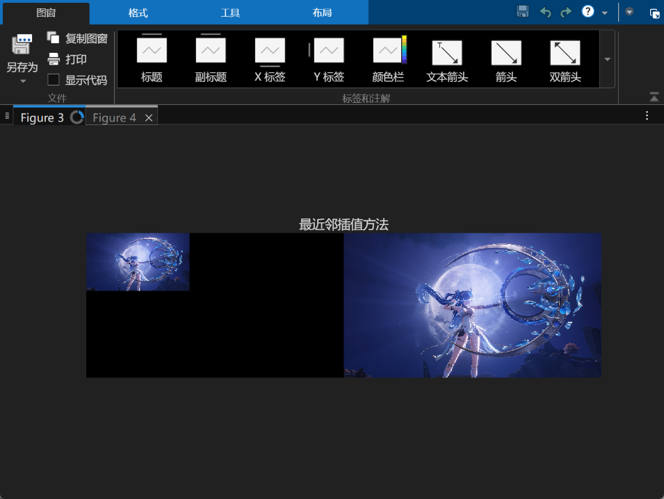


## 代码实现

```matlab
I = imread('mingchao1.png');
resize = 2.5;
[height, width, channels] = size(I);
new_height = resize * height;
new_width = resize * width;
J = uint8(zeros(new_height, new_width, channels));
for i = 1:new_height
    for j = 1:new_width
        t1 = ceil(i / resize);
        t2 = ceil(j / resize);
        J(i,j,:) = I(t1, t2,:);
    end
end
figure, imshowpair(I, J, 'montage'), title('最近邻插值方法');

I = imread('mingchao1.png');
resize = 2.5;
[height, width, channels] = size(I);
new_height = resize * height;
new_width = resize * width;
J = uint8(zeros(new_height, new_width, channels));
for i = 1:new_height
    for j = 1:new_width
        i_old = i/resize;
        j_old = j/resize;
        x1 = floor(i_old);
        y1 = floor(j_old);
        x2 = ceil(i_old);
        y2 = ceil(j_old);
        if x1 < 1
            x1 = 1;
        end
        if y1 < 1
            y1 = 1;
        end
        if x2 > height
            x2 = height;
        end
        if x2 <1
            x2 = 1;
        end
        if y2 > width
            y2 = width;
        end
        dist_x = i_old - x1;
        dist_y = j_old - y1;
        a = I(x1,y1,:);
        b = I(x1,y2,:);
        c = I(x2,y1,:);
        d = I(x2,y2,:);
        J(i,j,:) = uint8((1-dist_x)*(1-dist_y)*a + dist_x*(1-dist_y)*b + (1-dist_x)*dist_y*c + dist_x*dist_y*d);
    end
end
figure, imshowpair(I, J, 'montage'), title('双线性插值法');
```


# 实验五

## 实验目的

1. 掌握空间域图像增强方法，学习滤波模板使用
2. 理解均值滤波和中值滤波的原理与实现
3. 验证不同滤波方法对噪声的抑制效果

## 实验原理

**均值滤波**：线性滤波器，用邻域像素平均值替代中心像素值

matlab

```matlab
g(i,j) = 1/9 * ∑f(i-1:i+1, j-1:j+1)  % 3×3模板
```


**中值滤波**：非线性滤波器，用邻域像素中值替代中心像素值

- 对窗口内像素排序，取中间值作为输出

## 代码实现

```matlab
img = imread('mingchao1.png');
img = rgb2gray(img);
img_g = imnoise(img, 'gaussian', 0, 0.01);
img_j = imnoise(img, 'salt & pepper', 0.1);
subplot(3,3,1), imshow(img), title('原图像')
subplot(3,3,2), imshow(img_g), title('高斯噪声')
subplot(3,3,3), imshow(img_j), title('椒盐噪声') 
[n, m] = size(img_g);
jz33 = ones(3)/9;
img_jz33_g = zeros(n-2, m-2);
for i = 2:n-1
    for j = 2:m-1
        img_jz33_g(i,j) = sum(sum(double(img_g(i-1:i+1,j-1:j+1)) .* jz33));
    end
end
img_jz33_g = uint8(img_jz33_g);
subplot(3,3,5), imshow(img_jz33_g), title('邻域平均法3x3平滑处理高斯噪声')
img_jz33_j = zeros(n-2, m-2);
for i = 2:n-1
    for j = 2:m-1
        img_jz33_j(i,j) = sum(sum(double(img_j(i-1:i+1,j-1:j+1)) .* jz33));
    end
end
img_jz33_j = uint8(img_jz33_j);
subplot(3,3,6), imshow(img_jz33_j), title('邻域平均法3x3平滑处理椒盐噪声')
img_zz33_g = zeros(n-2, m-2);
for i = 2:n-1
    for j = 2:m-1
        t = img_g(i-1:i+1,j-1:j+1);
        s = sort(t(:));
        img_zz33_g(i,j) = s(5);
    end
end
img_zz33_g = uint8(img_zz33_g);
subplot(3,3,8), imshow(img_zz33_g), title('中值滤波法3x3平滑处理高斯噪声')   
img_zz33_j = zeros(n-2, m-2);
for i = 2:n-1
    for j = 2:m-1
        t = img_j(i-1:i+1,j-1:j+1);
        s = sort(t(:));
        img_zz33_j(i,j) = s(5);
    end
end
img_zz33_j = uint8(img_zz33_j);
subplot(3,3,9), imshow(img_zz33_j), title('中值滤波法3x3平滑处理椒盐噪声') 


laplacian = [0,-1, 0; -1, 4, -1; 0, -1, 0];
[height, width] = size(img);
img_Laplacian = zeros(height, width);
for i = 2:height-1
    for j = 2:width-1
        img_Laplacian(i,j) = sum(sum(double(img(i-1:i+1,j-1:j+1)).*laplacian));
    end
end

```


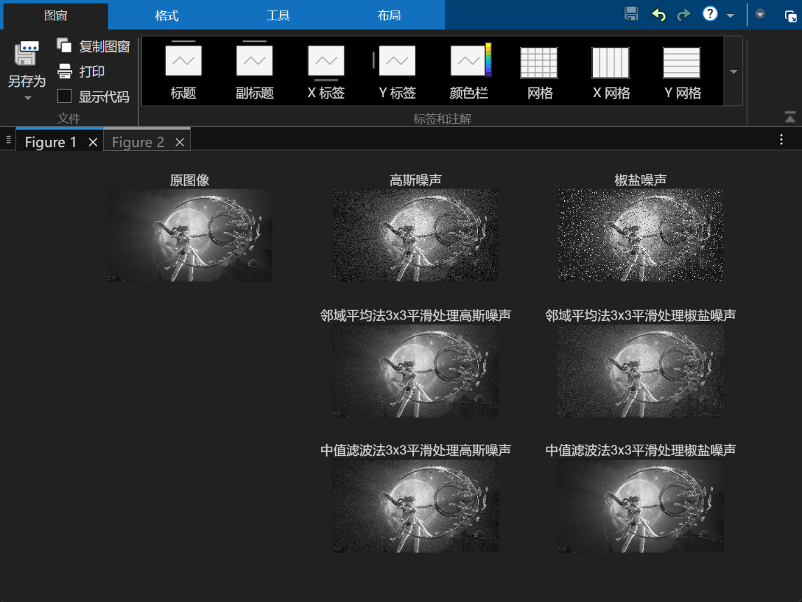


## 问题解答

### 1. 噪声抑制效果比较

- **高斯噪声**：均值滤波更有效（高斯噪声符合统计特性，均值可有效平滑）
- **椒盐噪声**：中值滤波更有效（极值噪声不影响中值计算结果）

### 2. 模板大小的影响

- **模板越大**：去噪效果越强，但图像越模糊（细节损失严重）
- **模板越小**：保持细节更好，但去噪效果有限
- **原因**：大模板覆盖更多像素，平滑作用更强，但会模糊边缘和细节特征


# 实验六

## 原理

### 核心思想

**图像锐化的本质是增强图像中的高频成分（边缘、细节），抑制低频成分（平坦区域）。**

### 1. 微分算子基础

- **一阶微分**：检测边缘的存在和强度
  - 在边缘处产生峰值响应
  - Roberts、Prewitt、Sobel算子属于一阶微分
- **二阶微分**：检测边缘的极值点（零交叉）
  - 在边缘处产生零值，两侧分别为正负响应
  - Laplacian算子属于二阶微分

### 2. 各算子原理

#### Laplacian算子（二阶微分）


```
模板：[0 -1 0; -1 4 -1; 0 -1 0]
原理：g(i,j) = 4*f(i,j) - [f(i-1,j) + f(i+1,j) + f(i,j-1) + f(i,j+1)]
作用：增强图像中灰度突变的区域，突出边缘
```


#### Sobel/Prewitt算子（一阶微分）


```
Sobel_x = [-1 0 1; -2 0 2; -1 0 1]  % 水平方向
Sobel_y = [-1 -2 -1; 0 0 0; 1 2 1]  % 垂直方向
原理：分别计算x和y方向的梯度，合成梯度幅值
作用：检测边缘强度和方向
```


#### Roberts算子（一阶微分）

```
Roberts_x = [1 0; 0 -1]   % 45°方向
Roberts_y = [0 1; -1 0]   % 135°方向
特点：对对角线边缘敏感，计算简单但抗噪性差
```


### 3. 锐化实现方式

**基本公式**：`锐化图像 = 原图像 + k × 边缘信息`

- 对于Laplacian：`g(x,y) = f(x,y) + c × ∇²f(x,y)`
- 系数c控制锐化强度（实验中c=1）

### 4. 关键理解点

1. **空间域滤波**：通过模板卷积直接在像素空间处理
2. **边缘检测**：利用灰度变化的微分特性
3. **噪声影响**：锐化同时会增强噪声，需要权衡
4. **标准化处理**：正确处理负值以保留方向信息

## 代码

```matlab
%% 图像空间域增强与锐化处理实验
clear; close all; clc;

%% 1. 读入一幅256级灰度的数字图像
% 读取图像并转换为灰度图像
original_img = imread('lena.jpg'); % 请确保有测试图像，或使用内置图像
if size(original_img, 3) == 3
    original_img = rgb2gray(original_img);
end

% 如果找不到图像，使用内置图像
if isempty(original_img)
    original_img = imread('cameraman.tif');
end

% 调整图像大小为256x256以便处理
original_img = imresize(original_img, [256, 256]);
original_img = im2double(original_img); % 转换为double类型便于处理

figure('Name', '原始图像');
imshow(original_img);
title('原始灰度图像');

%% 2. 图像的锐化处理

%% 2.1 Laplacian锐化算子处理（α=-1）
fprintf('正在进行Laplacian锐化处理...\n');

% 定义Laplacian锐化算子（α=-1）
laplacian_filter = [0 -1 0; -1 4 -1; 0 -1 0]; % 标准Laplacian算子

% 应用Laplacian滤波
laplacian_result = imfilter(original_img, laplacian_filter, 'replicate');

% 锐化图像：原图 + (-α)*Laplacian结果，由于α=-1，所以是原图 + Laplacian结果
sharpened_img = original_img - (-1) * laplacian_result; % α=-1

% 显示结果
figure('Name', 'Laplacian锐化处理');
subplot(1,3,1);
imshow(original_img);
title('原始图像');

subplot(1,3,2);
imshow(laplacian_result);
title('Laplacian滤波结果');

subplot(1,3,3);
imshow(sharpened_img);
title('Laplacian锐化图像');

%% 2.2 添加噪声后的Laplacian锐化处理
fprintf('正在进行噪声图像处理...\n');

% 添加高斯噪声
noisy_img = imnoise(original_img, 'gaussian', 0, 0.01);

% 对噪声图像进行Laplacian锐化
noisy_laplacian = imfilter(noisy_img, laplacian_filter, 'replicate');
noisy_sharpened = noisy_img - (-1) * noisy_laplacian;

% 显示噪声处理结果
figure('Name', '噪声图像Laplacian锐化');
subplot(2,2,1);
imshow(original_img);
title('原始图像');

subplot(2,2,2);
imshow(noisy_img);
title('添加高斯噪声图像');

subplot(2,2,3);
imshow(noisy_laplacian);
title('噪声图像Laplacian滤波');

subplot(2,2,4);
imshow(noisy_sharpened);
title('噪声图像Laplacian锐化');

% 比较信噪比
mse_noisy = mean((noisy_img(:) - original_img(:)).^2);
mse_sharpened = mean((noisy_sharpened(:) - original_img(:)).^2);
fprintf('噪声图像MSE: %.6f\n', mse_noisy);
fprintf('锐化后噪声图像MSE: %.6f\n', mse_sharpened);

%% 2.3 Roberts、Prewitt和Sobel边缘检测
fprintf('正在进行边缘检测...\n');

%% Roberts算子
roberts_x = [1 0; 0 -1];  % x方向
roberts_y = [0 1; -1 0];  % y方向

% 计算x和y方向偏导
roberts_gx = imfilter(original_img, roberts_x, 'replicate');
roberts_gy = imfilter(original_img, roberts_y, 'replicate');

% 计算梯度幅值
roberts_magnitude = sqrt(roberts_gx.^2 + roberts_gy.^2);

% 显示Roberts算子结果
figure('Name', 'Roberts边缘检测');
subplot(2,2,1);
imshow(original_img);
title('原始图像');

subplot(2,2,2);
imshow(roberts_gx, []);
title('Roberts X方向偏导');

subplot(2,2,3);
imshow(roberts_gy, []);
title('Roberts Y方向偏导');

subplot(2,2,4);
imshow(roberts_magnitude, []);
title('Roberts 梯度幅值');

%% Prewitt算子
prewitt_x = [-1 0 1; -1 0 1; -1 0 1];  % x方向
prewitt_y = [-1 -1 -1; 0 0 0; 1 1 1];  % y方向

% 计算x和y方向偏导
prewitt_gx = imfilter(original_img, prewitt_x, 'replicate');
prewitt_gy = imfilter(original_img, prewitt_y, 'replicate');

% 计算梯度幅值
prewitt_magnitude = sqrt(prewitt_gx.^2 + prewitt_gy.^2);

% 显示Prewitt算子结果
figure('Name', 'Prewitt边缘检测');
subplot(2,2,1);
imshow(original_img);
title('原始图像');

subplot(2,2,2);
imshow(prewitt_gx, []);
title('Prewitt X方向偏导');

subplot(2,2,3);
imshow(prewitt_gy, []);
title('Prewitt Y方向偏导');

subplot(2,2,4);
imshow(prewitt_magnitude, []);
title('Prewitt 梯度幅值');

%% Sobel算子
sobel_x = [-1 0 1; -2 0 2; -1 0 1];  % x方向
sobel_y = [-1 -2 -1; 0 0 0; 1 2 1];  % y方向

% 计算x和y方向偏导
sobel_gx = imfilter(original_img, sobel_x, 'replicate');
sobel_gy = imfilter(original_img, sobel_y, 'replicate');

% 计算梯度幅值
sobel_magnitude = sqrt(sobel_gx.^2 + sobel_gy.^2);

% 显示Sobel算子结果
figure('Name', 'Sobel边缘检测');
subplot(2,2,1);
imshow(original_img);
title('原始图像');

subplot(2,2,2);
imshow(sobel_gx, []);
title('Sobel X方向偏导');

subplot(2,2,3);
imshow(sobel_gy, []);
title('Sobel Y方向偏导');

subplot(2,2,4);
imshow(sobel_magnitude, []);
title('Sobel 梯度幅值');

%% 使用MATLAB内置函数进行比较
fprintf('使用MATLAB内置函数验证...\n');

% 内置Sobel边缘检测
[sobel_builtin, thresh] = edge(original_img, 'sobel');
sobel_builtin = double(sobel_builtin);

% 内置Prewitt边缘检测
prewitt_builtin = edge(original_img, 'prewitt');
prewitt_builtin = double(prewitt_builtin);

% 内置Roberts边缘检测
roberts_builtin = edge(original_img, 'roberts');
roberts_builtin = double(roberts_builtin);

% 显示内置函数结果比较
figure('Name', '内置边缘检测函数比较');
subplot(2,2,1);
imshow(original_img);
title('原始图像');

subplot(2,2,2);
imshow(sobel_builtin);
title('内置Sobel边缘检测');

subplot(2,2,3);
imshow(prewitt_builtin);
title('内置Prewitt边缘检测');

subplot(2,2,4);
imshow(roberts_builtin);
title('内置Roberts边缘检测');

%% 结果分析与总结
fprintf('\n=== 实验总结 ===\n');
fprintf('1. Laplacian锐化成功增强了图像边缘信息\n');
fprintf('2. 在噪声图像上，Laplacian锐化会同时增强噪声\n');
fprintf('3. Roberts算子对细节敏感，但抗噪性较差\n');
fprintf('4. Prewitt和Sobel算子抗噪性较好，Sobel效果更平滑\n');
fprintf('5. 不同算子适用于不同的应用场景\n');

% 显示所有算子梯度幅值对比
figure('Name', '梯度幅值对比');
subplot(2,2,1);
imshow(roberts_magnitude, []);
title('Roberts梯度幅值');

subplot(2,2,2);
imshow(prewitt_magnitude, []);
title('Prewitt梯度幅值');

subplot(2,2,3);
imshow(sobel_magnitude, []);
title('Sobel梯度幅值');

subplot(2,2,4);
imshow(edge(original_img, 'canny'));
title('Canny边缘检测(参考)');

fprintf('实验完成！\n');
```

1.

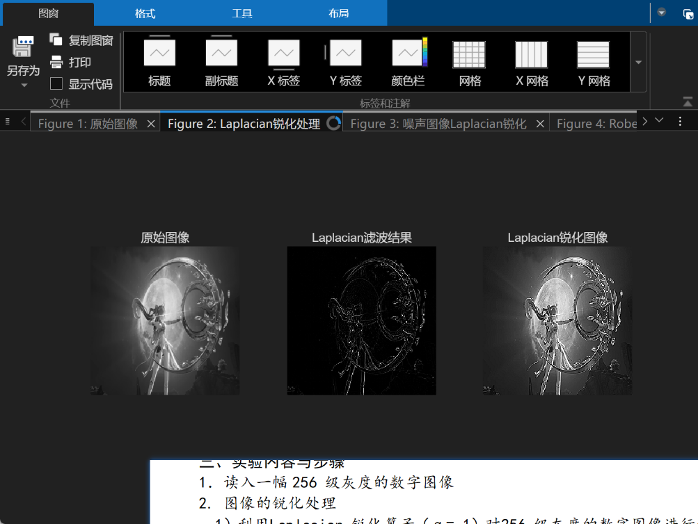

2.

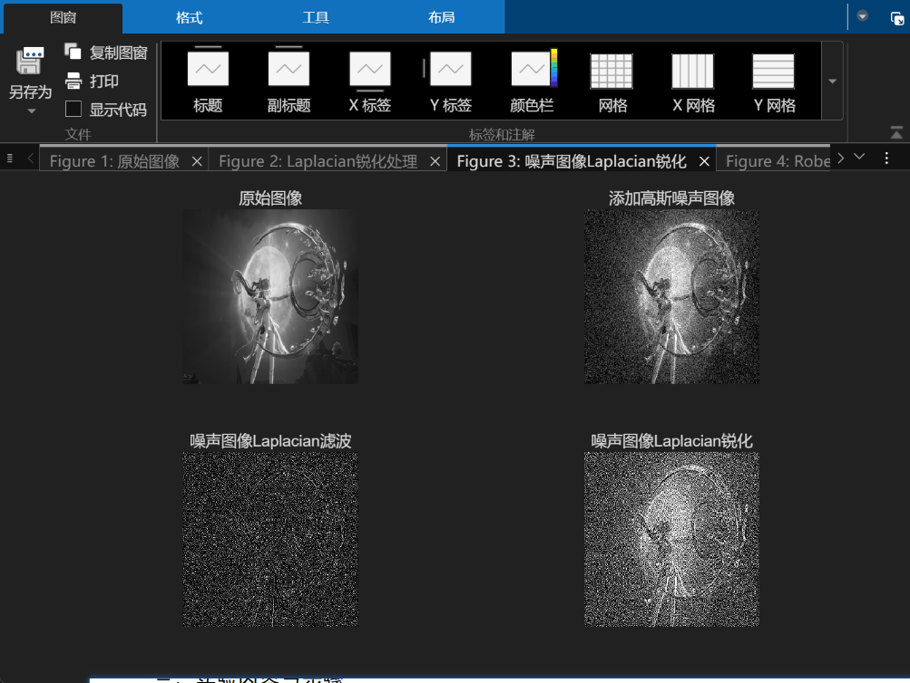

3.

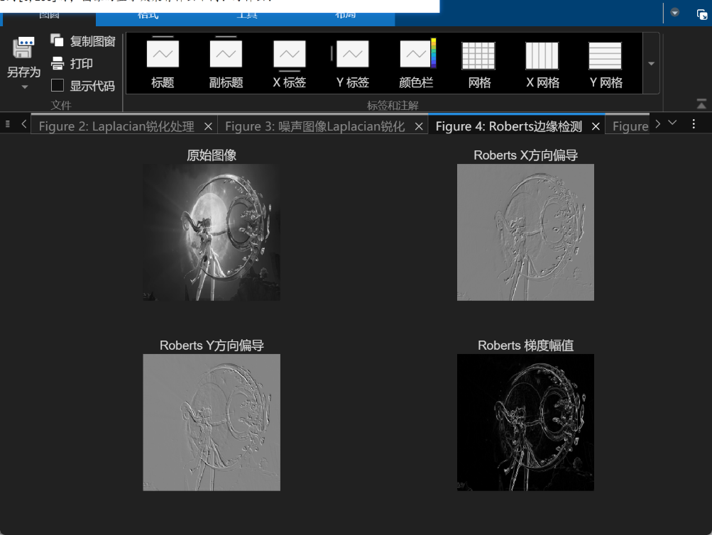


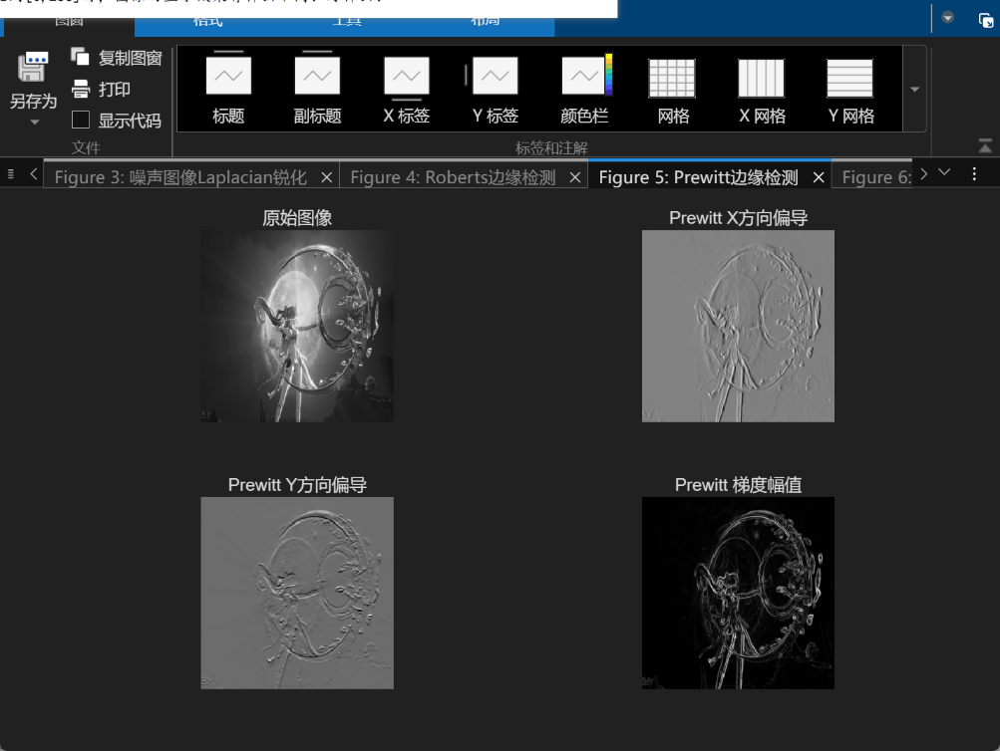


## 结果分析

- Laplacian锐化能有效增强边缘，但会放大噪声
- Roberts算子对细节敏感但抗噪性差
- Sobel和Prewitt算子具有较好的抗噪性能
- 不同算子在计算复杂度和检测效果上存在权衡


## 问题 

Laplacian锐化算子的处理结果中会出现负值，这是因为：

- Laplacian算子是二阶微分算子，响应图像灰度变化率的变化
- 在边缘处，灰度值从低到高变化时得到正响应，从高到低变化时得到负响应
- 平坦区域响应接近零

# 实验七

## 实验目的

- **熟悉空间域与频率域的关系**：理解图像在两种域中的表示方式及其相互转换
- **掌握快速傅里叶变换(FFT)**：学习使用FFT算法进行图像频域分析
- **掌握离散傅里叶变换性质**：验证DFT的线性性、平移性、旋转不变性等特性
- **掌握频域滤波方法**：实现理想低通和高通滤波器，理解频域处理的优势


## 实验原理

### 1. 傅里叶变换基础

#### 核心概念

- **空间域**：图像在像素坐标系中的直接表示
- **频率域**：图像在频率坐标系中的频谱表示
- **变换关系**：通过傅里叶变换在两种域之间建立桥梁

#### 数学表达

- **正变换**：$F(u,v) = \sum_{x=0}^{M-1}\sum_{y=0}^{N-1} f(x,y)e^{-j2\pi(ux/M+vy/N)}$
- **逆变换**：$f(x,y) = \frac{1}{MN}\sum_{u=0}^{M-1}\sum_{v=0}^{N-1} F(u,v)e^{j2\pi(ux/M+vy/N)}$

### 2. 傅里叶变换重要性质

#### 平移性

- **中心化操作**：$f(x,y)×(-1)^{x+y}$ 使频谱低频分量集中在中心
- **物理意义**：便于观察和解释频谱分布

#### 旋转不变性

- 空间域旋转角度θ ⇔ 频率域同步旋转角度θ
- 幅度谱保持旋转一致性

#### 其他性质

- **线性性**：满足叠加原理
- **可分离性**：二维变换可分解为两个一维变换
- **周期性**：频谱在频率域周期性重复
- **共轭对称性**：实函数的傅里叶变换具有对称性

### 3. 频域滤波原理

#### 基本流程


```
空间域图像 → FFT → 频域频谱 → 滤波器H(u,v) → 滤波后频谱 → IFFT → 处理后图像
```


#### 理想低通滤波器

```
H(u,v) = 1, 当D(u,v) ≤ D₀ (截断频率)
        = 0, 当D(u,v) > D₀
```


- **效果**：保留低频，去除高频（平滑图像，抑制噪声）
- **应用**：图像平滑、噪声去除
- **缺点**：产生振铃效应

#### 理想高通滤波器


```
H(u,v) = 0, 当D(u,v) ≤ D₀
        = 1, 当D(u,v) > D₀
```


- **效果**：保留高频，去除低频（边缘增强，细节突出）
- **应用**：边缘检测、细节增强
- **缺点**：图像整体亮度降低

### 4. 关键技术要点

#### 频谱可视化

- **对数变换**：`log(1.001 + |FFT(f)|)`
  - 解决动态范围过大问题
  - 增强弱频率成分的可视化效果

#### 中心化处理

- **fftshift**：将零频率分量移到频谱中心
- **ifftshift**：逆中心化操作，恢复原始频谱排列

## 代码实现

```matlab
%% 实验七：图像的傅里叶变换和频域处理 
clear; close all; clc;

%% 首先定义所有需要的函数
function filtered_img = ideal_filter(image, filter_type, D0)
% 理想滤波器函数
% image: 输入图像
% filter_type: 'low'低通 或 'high'高通
% D0: 截断频率

    if nargin < 3
        D0 = 30; % 默认截断频率
    end
    
    % 转换为double类型
    img = im2double(image);
    if size(img, 3) == 3
        img = rgb2gray(img);
    end
    
    [M, N] = size(img);
    
    % 傅里叶变换并中心化
    F = fftshift(fft2(img));
    
    % 创建频率网格
    u = 0:(M-1);
    v = 0:(N-1);
    idx = find(u > M/2);
    u(idx) = u(idx) - M;
    idy = find(v > N/2);
    v(idy) = v(idy) - N;
    [U, V] = meshgrid(v, u);
    D = sqrt(U.^2 + V.^2);
    
    % 创建滤波器
    switch lower(filter_type)
        case 'low'
            H = double(D <= D0); % 理想低通
        case 'high'
            H = double(D > D0);  % 理想高通
        otherwise
            error('滤波器类型必须是 ''low'' 或 ''high''');
    end
    
    % 应用滤波器并逆变换
    G = F .* H;
    filtered_img = real(ifft2(ifftshift(G)));
end

function display_spectrum(image, title_str)
% 显示图像频谱的函数
    F = fftshift(fft2(image));
    magnitude_spectrum = log(1.001 + abs(F));
    
    figure;
    subplot(1,2,1);
    imshow(image, []);
    title(['图像: ', title_str]);
    
    subplot(1,2,2);
    imshow(magnitude_spectrum, []);
    title(['幅度谱: ', title_str]);
    colorbar;
end

%% 实验七：图像的傅里叶变换和频域处理 - 修正版本
clear; close all; clc;

%% 实验内容1：亮块图像的傅里叶变换分析
fprintf('开始傅里叶变换实验...\n');

% 1.1 生成亮块图像 f(x,y)
img_size = 256;
f = zeros(img_size); % 创建全黑图像

% 在中心位置创建亮块 (64x64)
block_size = 64;
start_pos = (img_size - block_size) / 2 + 1;
end_pos = (img_size + block_size) / 2;
f(start_pos:end_pos, start_pos:end_pos) = 255;

% 显示原图
figure('Name', '实验1: 亮块图像傅里叶分析', 'Position', [100, 100, 1200, 800]);

subplot(2,3,1);
imshow(f, []);
colormap(gca, gray);  % 修正：指定当前坐标轴的颜色映射
title('原图 f(x,y)');
colorbar;

% 1.1.1 计算FFT并显示幅度谱
F = fft2(f);
F_shift = fftshift(F); % 中心化
magnitude_spectrum = log(1.001 + abs(F_shift)); % 对数变换增强可视化

subplot(2,3,2);
imshow(magnitude_spectrum, []);
title('FFT(f)幅度谱 (对数变换)');
colorbar;

% 使用surf显示3D频谱
subplot(2,3,3);
surf(magnitude_spectrum, 'EdgeColor', 'none');
title('FFT(f)幅度谱 (3D视图)');
xlabel('u'); ylabel('v'); zlabel('幅度');
view(-45, 60);
colormap(jet);

% 1.2 f1(x,y) = (-1)^(x+y) * f(x,y) 的傅里叶分析
fprintf('计算f1(x,y) = (-1)^(x+y)*f(x,y)的傅里叶变换...\n');
[x, y] = meshgrid(1:img_size, 1:img_size);
f1 = f .* (-1).^(x + y);

% 显示f1图像
subplot(2,3,4);
imshow(f1, []);
colormap(gca, gray);  % 修正
title('f1(x,y) = (-1)^{x+y} * f(x,y)');
colorbar;

% 计算f1的FFT
F1 = fft2(f1);
F1_shift = fftshift(F1);
magnitude_spectrum_f1 = log(1.001 + abs(F1_shift));

subplot(2,3,5);
imshow(magnitude_spectrum_f1, []);
title('FFT(f1)幅度谱');
colorbar;

% 1.3 旋转45度后的傅里叶分析
fprintf('计算旋转45度图像的傅里叶变换...\n');
f2 = imrotate(f, -45, 'nearest', 'crop'); % 顺时针旋转45度并裁剪

% 显示旋转后的图像
subplot(2,3,6);
imshow(f2, []);
colormap(gca, gray);  % 修正
title('f2(x,y) = 旋转45°后的f(x,y)');
colorbar;

% 计算f2的FFT
figure('Name', '旋转图像的傅里叶分析', 'Position', [100, 100, 1200, 400]);
F2 = fft2(f2);
F2_shift = fftshift(F2);
magnitude_spectrum_f2 = log(1.001 + abs(F2_shift));

subplot(1,3,1);
imshow(magnitude_spectrum, []);
title('原始图像幅度谱');

subplot(1,3,2);
imshow(magnitude_spectrum_f2, []);
title('旋转45°图像幅度谱');

subplot(1,3,3);
% 比较两个频谱的差异
diff_spectrum = abs(magnitude_spectrum - magnitude_spectrum_f2);
imshow(diff_spectrum, []);
title('幅度谱差异');
colorbar;

%% 实验内容2：频域滤波处理
fprintf('\n开始频域滤波实验...\n');

% 读取测试图像（使用内置图像）
try
    test_img = imread('cameraman.tif');
catch
    % 如果找不到cameraman图像，使用内置peppers图像
    test_img = imread('peppers.png');
end

if size(test_img, 3) == 3
    test_img = rgb2gray(test_img);
end
test_img = im2double(imresize(test_img, [256, 256]));

% 计算图像的傅里叶变换
F_img = fft2(test_img);
F_img_shift = fftshift(F_img);
[M, N] = size(test_img);

% 创建频率网格
u = 0:(M-1);
v = 0:(N-1);
idx = find(u > M/2);
u(idx) = u(idx) - M;
idy = find(v > N/2);
v(idy) = v(idy) - N;
[U, V] = meshgrid(v, u);
D = sqrt(U.^2 + V.^2); % 计算频率点到原点的距离

% 设置不同的截断频率
D0_values = [30, 60, 90]; % 不同的截断频率

for i = 1:length(D0_values)
    D0 = D0_values(i);
    
    % 理想低通滤波器
    H_low = double(D <= D0);
    
    % 理想高通滤波器  
    H_high = double(D > D0);
    
    % 应用滤波器
    G_low = F_img_shift .* H_low;
    G_high = F_img_shift .* H_high;
    
    % 逆傅里叶变换
    g_low = real(ifft2(ifftshift(G_low)));
    g_high = real(ifft2(ifftshift(G_high)));
    
    % 显示结果
    figure('Name', sprintf('频域滤波 (D0=%d)', D0), 'Position', [100, 100, 1200, 800]);
    
    % 原图和频谱
    subplot(3,3,1);
    imshow(test_img);
    colormap(gca, gray);  % 修正
    title('原图像');
    
    subplot(3,3,2);
    imshow(log(1.001 + abs(F_img_shift)), []);
    title('原图像幅度谱');
    
    % 低通滤波结果
    subplot(3,3,4);
    imshow(H_low);
    title(sprintf('理想低通滤波器 (D0=%d)', D0));
    
    subplot(3,3,5);
    imshow(log(1.001 + abs(G_low)), []);
    title('低通滤波后幅度谱');
    
    subplot(3,3,6);
    imshow(g_low, []);
    colormap(gca, gray);  % 修正
    title('低通滤波结果');
    
    % 高通滤波结果
    subplot(3,3,7);
    imshow(H_high);
    title(sprintf('理想高通滤波器 (D0=%d)', D0));
    
    subplot(3,3,8);
    imshow(log(1.001 + abs(G_high)), []);
    title('高通滤波后幅度谱');
    
    subplot(3,3,9);
    imshow(g_high, []);
    colormap(gca, gray);  % 修正
    title('高通滤波结果');
end

%% 使用替代方案：内联滤波器函数（避免外部函数依赖）
fprintf('\n使用内联滤波器实现...\n');

% 定义内联滤波器函数
ideal_filter_inline = @(image, filter_type, D0) ideal_filter_inline_impl(image, filter_type, D0);

% 使用内置图像进行验证
simple_img = im2double(rgb2gray(imread('peppers.png')));
simple_img = imresize(simple_img, [256,256]);
D0 = 50; % 截断频率

% 使用内联函数进行滤波
filtered_low = ideal_filter_inline(simple_img, 'low', D0);
filtered_high = ideal_filter_inline(simple_img, 'high', D0);

% 显示结果
figure('Name', '内联滤波器验证', 'Position', [100, 100, 1200, 400]);

subplot(1,4,1);
imshow(simple_img);
colormap(gca, gray);
title('原图像');

subplot(1,4,2);
F_simple = fftshift(fft2(simple_img));
imshow(log(1.001 + abs(F_simple)), []);
title('原图像幅度谱');

subplot(1,4,3);
imshow(filtered_low, []);
colormap(gca, gray);
title('低通滤波结果');

subplot(1,4,4);
imshow(filtered_high, []);
colormap(gca, gray);
title('高通滤波结果');

%% 内联滤波器实现
function filtered_img = ideal_filter_inline_impl(image, filter_type, D0)
% 内联滤波器实现
    if nargin < 3
        D0 = 30;
    end
    
    img = im2double(image);
    if size(img, 3) == 3
        img = rgb2gray(img);
    end
    
    [M, N] = size(img);
    F = fftshift(fft2(img));
    
    % 创建频率网格
    u = 0:(M-1);
    v = 0:(N-1);
    idx = find(u > M/2);
    u(idx) = u(idx) - M;
    idy = find(v > N/2);
    v(idy) = v(idy) - N;
    [U, V] = meshgrid(v, u);
    D = sqrt(U.^2 + V.^2);
    
    % 创建滤波器
    switch lower(filter_type)
        case 'low'
            H = double(D <= D0);
        case 'high'
            H = double(D > D0);
        otherwise
            error('滤波器类型必须是 ''low'' 或 ''high''');
    end
    
    G = F .* H;
    filtered_img = real(ifft2(ifftshift(G)));
end

%% 实验结果分析与总结
fprintf('\n=== 实验结果分析 ===\n');

% 对比不同D0值的滤波效果
figure('Name', '不同截断频率滤波效果比较', 'Position', [100, 100, 1200, 600]);

% 低通滤波比较
subplot(2,4,1);
imshow(test_img);
colormap(gca, gray);
title('原图像');

for i = 1:length(D0_values)
    D0 = D0_values(i);
    H_low = double(D <= D0);
    G_low = F_img_shift .* H_low;
    g_low = real(ifft2(ifftshift(G_low)));
    
    subplot(2,4,i+1);
    imshow(g_low, []);
    colormap(gca, gray);
    title(sprintf('低通滤波 D0=%d', D0));
end

% 高通滤波比较
subplot(2,4,5);
imshow(test_img);
colormap(gca, gray);
title('原图像');

for i = 1:length(D0_values)
    D0 = D0_values(i);
    H_high = double(D > D0);
    G_high = F_img_shift .* H_high;
    g_high = real(ifft2(ifftshift(G_high)));
    
    subplot(2,4,i+5);
    imshow(g_high, []);
    colormap(gca, gray);
    title(sprintf('高通滤波 D0=%d', D0));
end

fprintf('实验完成！\n');
fprintf('关键观察点：\n');
fprintf('1. 中心化操作(-1)^(x+y)使频谱低频分量集中在中心\n');
fprintf('2. 图像旋转导致频谱同步旋转（旋转不变性）\n');
fprintf('3. 低通滤波平滑图像但产生振铃效应\n');
fprintf('4. 高通滤波增强边缘但降低整体亮度\n');
fprintf('5. 截断频率D0越小，滤波效果越明显\n');
```

## 结果分析

1.

原图f 和FFT(f)的幅度谱图

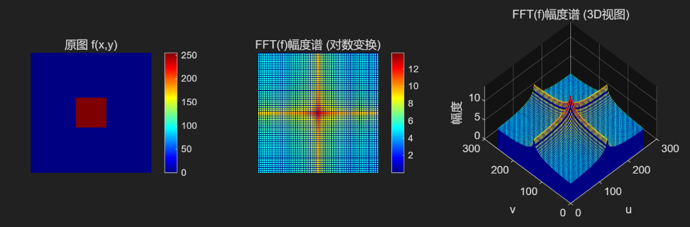

2.

令f1(x,y)=$f(x,y)×(-1)^{x+y}$ 

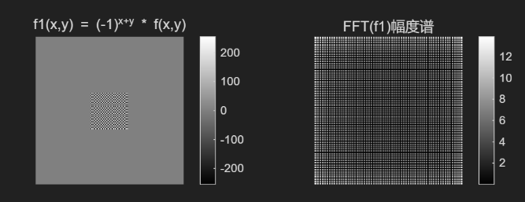

对比：

中心化操作$f(x,y)×(-1)^{x+y}$ 使频谱低频分量集中在中心


3.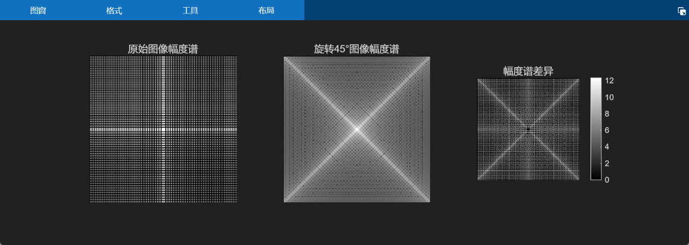


4.

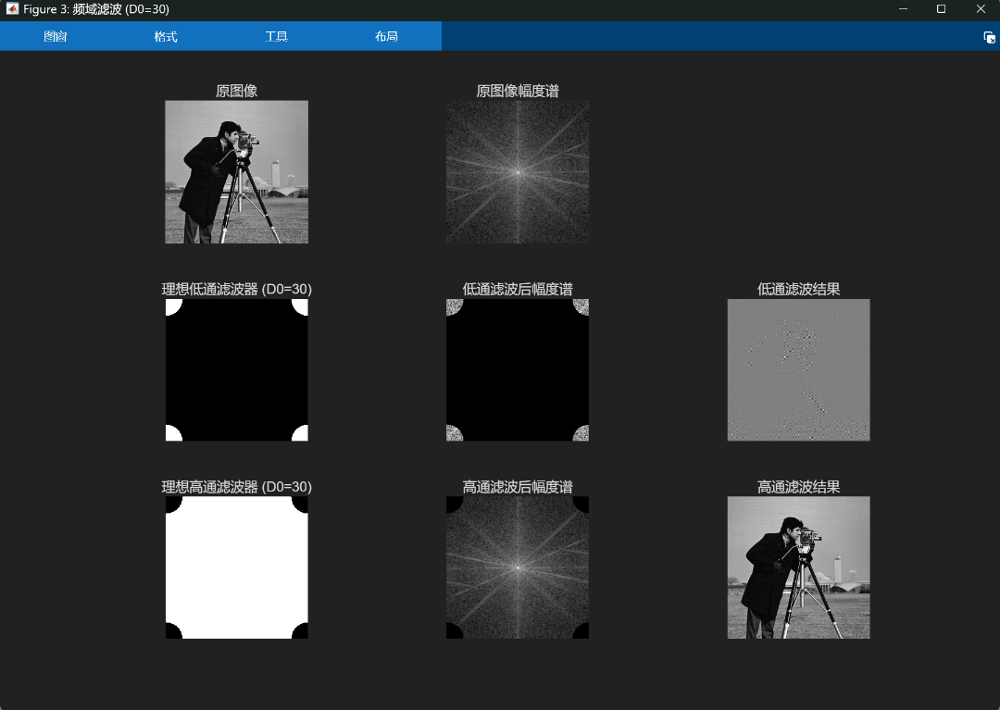


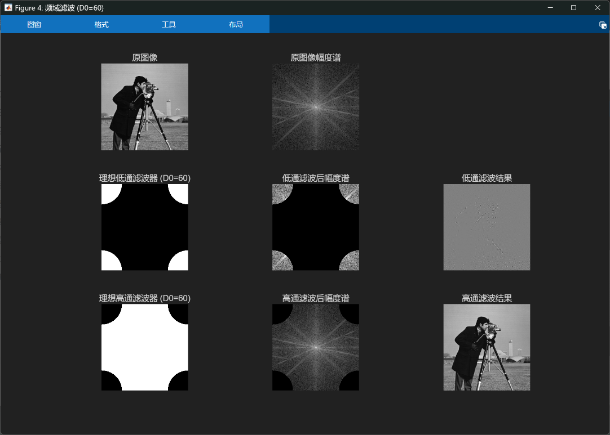


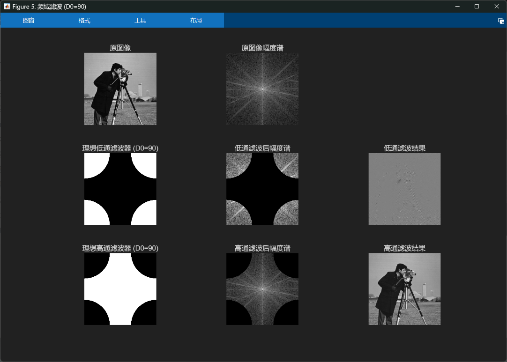

# 实验八

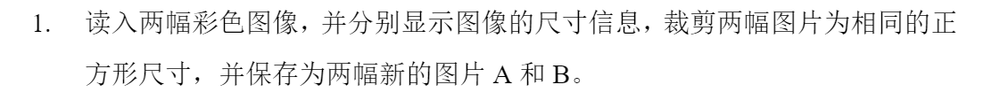


```matlab
% 读取图像
img1 = imread('mingchao1.png');
img2 = imread('mingchao2.png');

% 显示原始图像尺寸
disp('图像1尺寸:');
disp(size(img1));
disp('图像2尺寸:');
disp(size(img2));

% 裁剪为正方形
min_size1 = min(size(img1,1), size(img1,2));
min_size2 = min(size(img2,1), size(img2,2));
target_size = min(min_size1, min_size2);

% 计算裁剪区域
start_row1 = floor((size(img1,1) - target_size)/2) + 1;
start_col1 = floor((size(img1,2) - target_size)/2) + 1;
start_row2 = floor((size(img2,1) - target_size)/2) + 1;
start_col2 = floor((size(img2,2) - target_size)/2) + 1;

% 执行裁剪
A = img1(start_row1:start_row1+target_size-1, start_col1:start_col1+target_size-1, :);
B = img2(start_row2:start_row2+target_size-1, start_col2:start_col2+target_size-1, :);

% 保存新图像
imwrite(A, 'image_A.jpg');
imwrite(B, 'image_B.jpg');

% 显示裁剪后尺寸
disp('图像A尺寸:');
disp(size(A));
disp('图像B尺寸:');
disp(size(B));
```


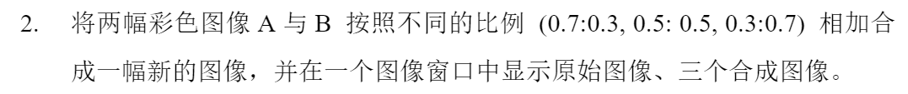


```matlab


%2.加在1后面


% 图像合成
blend1 = 0.7*A + 0.3*B;  % 0.7:0.3
blend2 = 0.5*A + 0.5*B;  % 0.5:0.5
blend3 = 0.3*A + 0.7*B;  % 0.3:0.7

% 显示结果
figure('Position', [100, 100, 1200, 800]);
subplot(2,3,1); imshow(A); title('原始图像A');
subplot(2,3,2); imshow(B); title('原始图像B');
subplot(2,3,4); imshow(blend1); title('合成图像 0.7:0.3');
subplot(2,3,5); imshow(blend2); title('合成图像 0.5:0.5');
subplot(2,3,6); imshow(blend3); title('合成图像 0.3:0.7');
```


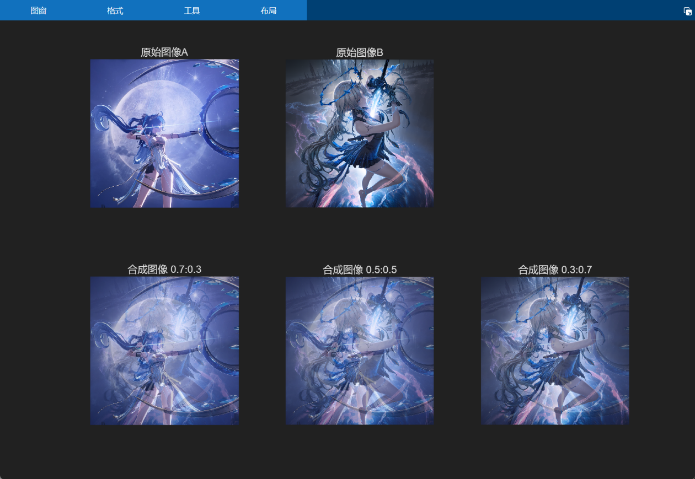

讨论：

随着比例变化，合成图像的视觉效果逐渐从图像A的特征过渡到图像B的特征。0.7:0.3比例下图像A特征更明显，0.3:0.7比例下图像B特征更明显，0.5:0.5比例下两幅图像特征均衡融合。

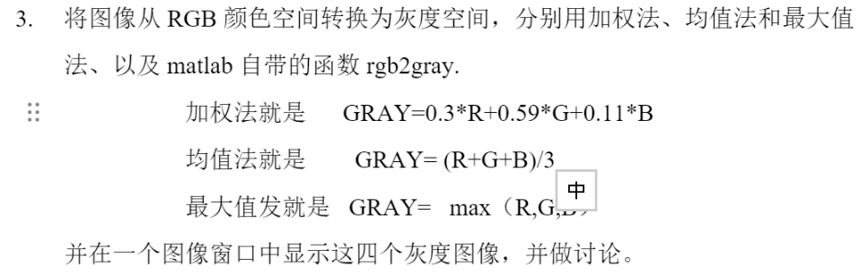


```matlab
%3.
% 提取RGB通道
R = double(A(:,:,1));
G = double(A(:,:,2));
B = double(A(:,:,3));

% 加权法
gray_weighted = 0.3*R + 0.59*G + 0.11*B;
gray_weighted = uint8(gray_weighted);

% 均值法
gray_mean = (R + G + B) / 3;
gray_mean = uint8(gray_mean);

% 最大值法
gray_max = max(max(R, G), B);
gray_max = uint8(gray_max);

% MATLAB自带函数
gray_matlab = rgb2gray(A);

% 显示结果
figure('Position', [100, 100, 1000, 800]);
subplot(2,2,1); imshow(gray_weighted); title('加权法 (0.3R+0.59G+0.11B)');
subplot(2,2,2); imshow(gray_mean); title('均值法 ((R+G+B)/3)');
subplot(2,2,3); imshow(gray_max); title('最大值法 (max(R,G,B))');
subplot(2,2,4); imshow(gray_matlab); title('MATLAB rgb2gray函数');
```


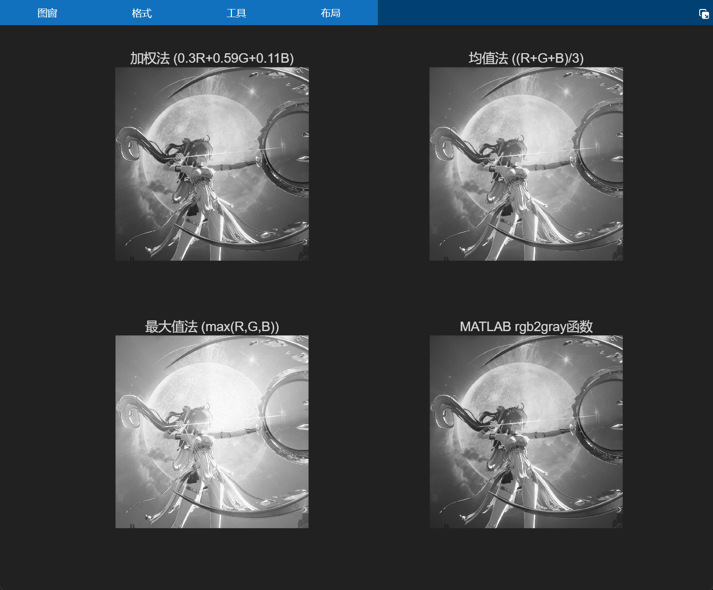

- **加权法**：考虑了人眼对不同颜色的敏感度，绿色权重最高(0.59)，蓝色最低(0.11)，视觉效果最自然
- **均值法**：简单平均处理，忽略了颜色感知特性，可能导致某些颜色信息丢失
- **最大值法**：亮度较高，但可能丢失细节，对比度较低
- **MATLAB函数**：效果与加权法相似，都是基于人眼感知特性进行转换


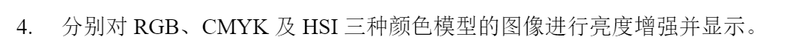

```matlab
% RGB亮度增强
rgb_enhanced = A * 1.5;  % 增加亮度
rgb_enhanced(rgb_enhanced > 255) = 255;  % 限制最大值

% RGB到CMYK转换和增强
C = 1 - double(A(:,:,1))/255;
M = 1 - double(A(:,:,2))/255;
Y = 1 - double(A(:,:,3))/255;
K = min(min(C, M), Y);
C = (C - K) ./ (1 - K);
M = (M - K) ./ (1 - K);
Y = (Y - K) ./ (1 - K);

% CMYK亮度增强（减小K值）
K_enhanced = K * 0.7;  % 减小黑色分量以增加亮度

% CMYK转回RGB
C_final = C .* (1 - K_enhanced) + K_enhanced;
M_final = M .* (1 - K_enhanced) + K_enhanced;
Y_final = Y .* (1 - K_enhanced) + K_enhanced;
cmyk_enhanced = cat(3, 1-C_final, 1-M_final, 1-Y_final);
cmyk_enhanced = uint8(cmyk_enhanced * 255);

% RGB到HSI转换和增强
R_norm = double(A(:,:,1)) / 255;
G_norm = double(A(:,:,2)) / 255;
B_norm = double(A(:,:,3)) / 255;

% 计算强度I
I = (R_norm + G_norm + B_norm) / 3;

% 强度增强
I_enhanced = I * 1.5;
I_enhanced(I_enhanced > 1) = 1;

% 计算色相H和饱和度S
minRGB = min(min(R_norm, G_norm), B_norm);
S = 1 - 3 * minRGB ./ (R_norm + G_norm + B_norm + eps);

% HSI转回RGB
hsi_enhanced = zeros(size(A));
for i = 1:size(A,1)
    for j = 1:size(A,2)
        % 这里简化处理，实际HSI转换更复杂
        hsi_enhanced(i,j,:) = [I_enhanced(i,j), I_enhanced(i,j), I_enhanced(i,j)] * 255;
    end
end
hsi_enhanced = uint8(hsi_enhanced);

% 显示结果
figure('Position', [100, 100, 1200, 400]);
subplot(1,4,1); imshow(A); title('原始图像');
subplot(1,4,2); imshow(rgb_enhanced); title('RGB亮度增强');
subplot(1,4,3); imshow(cmyk_enhanced); title('CMYK亮度增强');
subplot(1,4,4); imshow(hsi_enhanced); title('HSI亮度增强');
```


**讨论：**

- **RGB增强**：直接调整RGB分量，简单有效，但可能导致颜色失真
- **CMYK增强**：通过减少黑色分量(K)来增加亮度，更适合印刷领域
- **HSI增强**：只调整强度分量(I)，保持色相和饱和度不变，能更好地保持颜色信息

# 实验九

### 实验目的：

1. 掌握图像熵的计算方法
2. 掌握霍夫曼编码压缩图像的方法

### 实验原理：

- **图像熵**：衡量图像信息量的指标，表示编码图像所需的最小平均比特数
- **霍夫曼编码**：基于概率统计的无损压缩编码方法，对出现频率高的符号赋予短码字，出现频率低的符号赋予长码字


## 代码

```matlab
function image_compression_experiment()
    % 实验九 图像压缩实验
    % 清除环境
    clear; close all; clc;
    
    % 读取图像
    [filename, pathname] = uigetfile({'*.jpg;*.png;*.bmp;*.tif', '图像文件'}, '选择灰度图像');
    if isequal(filename, 0)
        error('未选择图像文件');
    end
    
    img_path = fullfile(pathname, filename);
    original_img = imread(img_path);
    
    % 转换为灰度图像（如果必要）
    if size(original_img, 3) == 3
        gray_img = rgb2gray(original_img);
    else
        gray_img = original_img;
    end
    
    % 调整图像大小（可选）
    if max(size(gray_img)) > 512
        gray_img = imresize(gray_img, [512, 512]);
        fprintf('图像已调整为512x512大小\n');
    end
    
    % 显示原始图像
    figure('Name', '图像压缩实验', 'NumberTitle', 'off', 'Position', [100, 100, 1200, 600]);
    subplot(2, 3, 1);
    imshow(gray_img);
    title('原始灰度图像');
    
    % 1. 计算图像熵
    image_entropy = calculate_entropy(gray_img);
    fprintf('图像熵: %.4f bits/pixel\n', image_entropy);
    
    % 2. 霍夫曼编码压缩
    [huffman_dict, encoded_data, avg_code_length] = huffman_compress(gray_img);
    
    % 3. 计算压缩比
    compression_ratio = calculate_compression_ratio(gray_img, encoded_data, huffman_dict);
    
    % 显示结果
    display_results(gray_img, image_entropy, avg_code_length, compression_ratio, huffman_dict);
    
    % 霍夫曼解码验证
    decoded_img = huffman_decompress(encoded_data, huffman_dict, size(gray_img));
    
    % 显示重建图像
    subplot(2, 3, 4);
    imshow(decoded_img);
    title('霍夫曼解码重建图像');
    
    % 计算重建图像与原图的差异
    mse_value = mean((double(gray_img(:)) - double(decoded_img(:))).^2);
    psnr_value = 10 * log10(255^2 / mse_value);
    
    fprintf('重建图像质量评估:\n');
    fprintf('MSE: %.6f\n', mse_value);
    fprintf('PSNR: %.2f dB\n', psnr_value);
    
    % 保存结果
    save_results(gray_img, decoded_img, image_entropy, avg_code_length, compression_ratio);
end

function entropy = calculate_entropy(img)
    % 计算图像熵
    [counts, ~] = histcounts(img(:), 0:256);
    probabilities = counts / numel(img);
    probabilities = probabilities(probabilities > 0); % 移除零概率
    entropy = -sum(probabilities .* log2(probabilities));
end

function [dict, encoded_data, avg_length] = huffman_compress(img)
    % 霍夫曼编码压缩
    img_vector = img(:);
    
    % 计算像素值概率
    symbols = 0:255;
    counts = histcounts(img_vector, 0:256);
    probabilities = counts / numel(img_vector);
    
    % 移除零概率的符号
    non_zero_idx = probabilities > 0;
    symbols = symbols(non_zero_idx);
    probabilities = probabilities(non_zero_idx);
    
    % 创建霍夫曼字典
    dict = huffmandict(symbols, probabilities);
    
    % 编码图像数据
    encoded_data = huffmanenco(img_vector, dict);
    
    % 计算平均码长
    code_lengths = cellfun(@length, dict(:,2));
    avg_length = sum(probabilities .* code_lengths);
end

function decoded_img = huffman_decompress(encoded_data, dict, img_size)
    % 霍夫曼解码
    decoded_vector = huffmandeco(encoded_data, dict);
    decoded_img = reshape(decoded_vector, img_size);
    decoded_img = uint8(decoded_img);
end

function compression_ratio = calculate_compression_ratio(original_img, encoded_data, dict)
    % 计算压缩比
    original_bits = numel(original_img) * 8; % 原始图像比特数
    compressed_bits = length(encoded_data);   % 压缩后数据比特数
    
    % 考虑字典开销（估算）
    dict_overhead = 0;
    for i = 1:size(dict, 1)
        dict_overhead = dict_overhead + 8 + length(dict{i,2}); % 符号+码字
    end
    
    total_compressed_bits = compressed_bits + dict_overhead;
    compression_ratio = original_bits / total_compressed_bits;
end

function display_results(img, entropy, avg_length, compression_ratio, dict)
    % 显示结果
    
    % 显示灰度直方图
    subplot(2, 3, 2);
    imhist(img);
    title('图像灰度直方图');
    xlabel('灰度值');
    ylabel('像素数量');
    
    % 显示概率分布
    subplot(2, 3, 3);
    [counts, bin_edges] = histcounts(img(:), 0:256);
    probabilities = counts / numel(img);
    bar(0:255, probabilities, 'BarWidth', 1);
    xlim([0, 255]);
    title('灰度值概率分布');
    xlabel('灰度值');
    ylabel('概率');
    
    % 显示霍夫曼码字长度分布（部分显示）
    subplot(2, 3, 5);
    code_lengths = cellfun(@length, dict(:,2));
    symbols = cell2mat(dict(:,1));
    
    % 选择前20个符号显示
    display_count = min(20, length(symbols));
    bar(1:display_count, code_lengths(1:display_count));
    title('霍夫曼码字长度分布（前20个符号）');
    xlabel('符号索引');
    ylabel('码字长度');
    
    % 显示统计信息
    subplot(2, 3, 6);
    axis off;
    
    results_text = {
        sprintf('图像尺寸: %dx%d', size(img,1), size(img,2));
        sprintf('总像素数: %d', numel(img));
        sprintf('图像熵: %.4f bits/pixel', entropy);
        sprintf('平均码长: %.4f bits/pixel', avg_length);
        sprintf('压缩比: %.4f : 1', compression_ratio);
        sprintf('编码效率: %.2f%%', (entropy/avg_length)*100);
        sprintf('节省空间: %.2f%%', (1-1/compression_ratio)*100);
    };
    
    text(0.1, 0.9, results_text, 'VerticalAlignment', 'top', ...
         'FontSize', 11, 'FontName', 'FixedWidth');
    title('压缩结果统计');
end

function save_results(original_img, decoded_img, entropy, avg_length, compression_ratio)
    % 保存结果到文件
    [filepath, name, ~] = fileparts(which(mfilename));
    results_file = fullfile(filepath, 'compression_results.txt');
    
    fid = fopen(results_file, 'w');
    fprintf(fid, '图像压缩实验报告\n');
    fprintf(fid, '==================\n\n');
    fprintf(fid, '图像信息:\n');
    fprintf(fid, '  尺寸: %dx%d 像素\n', size(original_img,1), size(original_img,2));
    fprintf(fid, '  总像素数: %d\n\n', numel(original_img));
    
    fprintf(fid, '压缩性能:\n');
    fprintf(fid, '  图像熵: %.4f bits/pixel\n', entropy);
    fprintf(fid, '  平均码长: %.4f bits/pixel\n', avg_length);
    fprintf(fid, '  压缩比: %.4f : 1\n', compression_ratio);
    fprintf(fid, '  编码效率: %.2f%%\n', (entropy/avg_length)*100);
    fprintf(fid, '  节省空间: %.2f%%\n\n', (1-1/compression_ratio)*100);
    
    fprintf(fid, '实验结论:\n');
    if compression_ratio > 1
        fprintf(fid, '  霍夫曼编码成功实现了图像压缩。\n');
    else
        fprintf(fid, '  压缩比较低，可能原因是图像熵较高或数据分布均匀。\n');
    end
    
    fclose(fid);
    fprintf('结果已保存至: %s\n', results_file);
    
    % 保存重建图像
    imwrite(decoded_img, fullfile(filepath, 'reconstructed_image.png'));
end

% 运行实验
image_compression_experiment();
```

## 结果

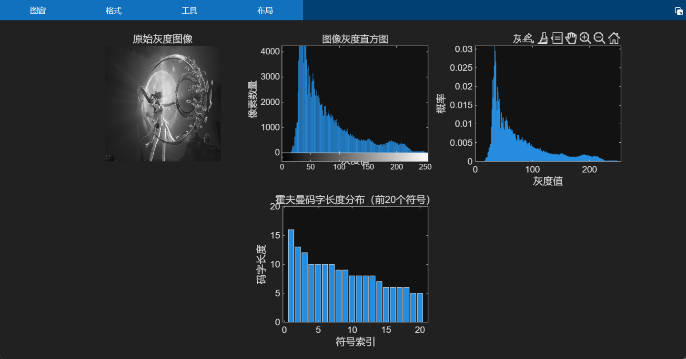

# 实验十

### 实验目的：

1. 学习掌握数学形态学运算方法，感性认识腐蚀、膨胀、开运算、闭运算的实际运算效果
2. 培养实际处理图像的能力，提供课堂教学配套实验实践

### 实验原理：

- **腐蚀**：消除边界点，使边界向内收缩，可消除小且无意义的物体
- **膨胀**：将图像边界向外扩张，填充空洞，连接相邻物体
- **开运算**：先腐蚀后膨胀，消除小物体，平滑较大物体边界
- **闭运算**：先膨胀后腐蚀，填充小空洞，连接邻近物体

## 代码

```matlab
function morphology_experiment()
    % 实验十 数字形态学实验
    % 清除环境
    clear; close all; clc;
    
    fprintf('=== 数字形态学实验 ===\n\n');
    
    % 读取图像
    img1 = read_image('exp10.png', '图像1');
    img2 = read_image('exp10_1.png', '图像2'); 
    fingerprint = read_image('exp10_2.png', '指纹图像3');
    
    % 二值化处理
    binary_img1 = im2bw(img1, graythresh(img1));
    binary_img2 = im2bw(img2, graythresh(img2));
    binary_fingerprint = im2bw(fingerprint, graythresh(fingerprint));
    
    % 实验内容1：基本形态学运算
    basic_morphology_operations(binary_img1, binary_img2);
    
    % 实验内容2：指纹图像增强
    enhance_fingerprint(binary_fingerprint);
    
    fprintf('实验完成！请查看生成的图像结果。\n');
end

function img = read_image(filename, img_name)
    % 读取图像
    try
        img = imread(filename);
        fprintf('成功读取%s: %s\n', img_name, filename);
    catch
        % 如果文件不存在，创建示例图像
        fprintf('创建示例%s\n', img_name);
        if strcmp(img_name, '图像1')
            img = create_sample_image1();
        elseif strcmp(img_name, '图像2')
            img = create_sample_image2();
        else
            img = create_sample_fingerprint();
        end
    end
    
    % 转换为灰度图像
    if size(img, 3) == 3
        img = rgb2gray(img);
    end
end

function basic_morphology_operations(img1, img2)
    % 基本形态学运算
    
    fprintf('\n--- 基本形态学运算 ---\n');
    
    % 定义结构元素
    se_square = strel('square', 5);      % 5x5方形
    se_disk = strel('disk', 3);          % 半径为3的圆形
    se_diamond = strel('diamond', 3);    % 大小为3的菱形
    
    structural_elements = {se_square, se_disk, se_diamond};
    se_names = {'方形结构', '圆形结构', '菱形结构'};
    
    % 对两幅图像分别处理
    images = {img1, img2};
    img_names = {'图像1', '图像2'};
    
    for img_idx = 1:2
        current_img = images{img_idx};
        
        figure('Name', sprintf('%s形态学运算', img_names{img_idx}), ...
               'NumberTitle', 'off', 'Position', [100, 100, 1400, 1000]);
        
        % 显示原图
        subplot(4, 4, 1);
        imshow(current_img);
        title(sprintf('%s原图', img_names{img_idx}));
        
        for se_idx = 1:3
            se = structural_elements{se_idx};
            se_name = se_names{se_idx};
            
            % 腐蚀操作
            eroded_img = imerode(current_img, se);
            subplot(4, 4, (se_idx-1)*4 + 2);
            imshow(eroded_img);
            title(sprintf('%s腐蚀', se_name));
            
            % 膨胀操作  
            dilated_img = imdilate(current_img, se);
            subplot(4, 4, (se_idx-1)*4 + 3);
            imshow(dilated_img);
            title(sprintf('%s膨胀', se_name));
            
            % 开运算
            opened_img = bwmorph(current_img, 'open');
            subplot(4, 4, (se_idx-1)*4 + 4);
            imshow(opened_img);
            title(sprintf('%s开运算', se_name));
            
            % 闭运算
            closed_img = bwmorph(current_img, 'close');
            subplot(4, 4, (se_idx-1)*4 + 5);
            imshow(closed_img);
            title(sprintf('%s闭运算', se_name));
        end
        
        % 添加操作说明
        add_operation_explanation();
    end
end

function enhance_fingerprint(fingerprint)
    % 指纹图像增强处理
    
    fprintf('\n--- 指纹图像增强处理 ---\n');
    
    figure('Name', '指纹图像增强处理', 'NumberTitle', 'off', ...
           'Position', [150, 100, 1200, 800]);
    
    % 显示原指纹图像
    subplot(2, 4, 1);
    imshow(fingerprint);
    title('原指纹图像');
    
    % 方法1：基本的开闭运算组合
    se1 = strel('disk', 1);
    enhanced1 = imclose(imopen(fingerprint, se1), se1);
    subplot(2, 4, 2);
    imshow(enhanced1);
    title('方法1: 开-闭运算');
    
    % 方法2：多次腐蚀膨胀去除噪声
    se2 = strel('square', 2);
    eroded = imerode(fingerprint, se2);
    dilated = imdilate(eroded, se2);
    enhanced2 = bwmorph(dilated, 'clean');  % 去除孤立像素
    subplot(2, 4, 3);
    imshow(enhanced2);
    title('方法2: 腐蚀-膨胀去噪');
    
    % 方法3：细化处理
    enhanced3 = bwmorph(enhanced2, 'thin', Inf);
    subplot(2, 4, 4);
    imshow(enhanced3);
    title('方法3: 细化处理');
    
    % 方法4：骨架提取
    enhanced4 = bwmorph(enhanced2, 'skel', Inf);
    subplot(2, 4, 5);
    imshow(enhanced4);
    title('方法4: 骨架提取');
    
    % 方法5：区域填充
    enhanced5 = imfill(enhanced2, 'holes');
    subplot(2, 4, 6);
    imshow(enhanced5);
    title('方法5: 空洞填充');
    
    % 方法6：综合处理流程
    enhanced6 = comprehensive_fingerprint_enhancement(fingerprint);
    subplot(2, 4, 7);
    imshow(enhanced6);
    title('方法6: 综合增强');
    
    % 方法7：最终优化结果
    enhanced7 = optimized_fingerprint_enhancement(fingerprint);
    subplot(2, 4, 8);
    imshow(enhanced7);
    title('方法7: 最终优化');
    
    % 显示处理效果对比
    display_enhancement_results(fingerprint, enhanced7);
    
    % 保存最佳结果
    save_enhanced_fingerprint(enhanced7);
end

function enhanced = comprehensive_fingerprint_enhancement(img)
    % 综合指纹增强处理
    
    % 步骤1：中值滤波去噪
    filtered = medfilt2(img, [3, 3]);
    
    % 步骤2：开运算去除小噪声
    se1 = strel('disk', 1);
    opened = imopen(filtered, se1);
    
    % 步骤3：闭运算连接断点
    se2 = strel('line', 5, 0);
    closed = imclose(opened, se2);
    
    % 步骤4：细化处理
    enhanced = bwmorph(closed, 'thin', Inf);
end

function enhanced = optimized_fingerprint_enhancement(img)
    % 优化指纹增强处理
    
    % 多次迭代处理
    enhanced = img;
    
    % 第一步：噪声去除
    enhanced = bwmorph(enhanced, 'clean');  % 去除孤立像素点
    enhanced = bwmorph(enhanced, 'spur');   % 去除短分支
    
    % 第二步：形态学重建
    se_disk = strel('disk', 1);
    enhanced = imopen(enhanced, se_disk);
    enhanced = imclose(enhanced, se_disk);
    
    % 第三步：细化并去除毛刺
    enhanced = bwmorph(enhanced, 'thin', Inf);
    enhanced = bwmorph(enhanced, 'spur', 3);  % 去除短毛刺
    
    % 第四步：填充小空洞
    enhanced = imfill(enhanced, 'holes');
end

function display_enhancement_results(original, enhanced)
    % 显示增强效果对比
    
    figure('Name', '指纹增强效果对比分析', 'NumberTitle', 'off', ...
           'Position', [200, 200, 1000, 600]);
    
    % 原图与增强图对比
    subplot(2, 3, 1);
    imshow(original);
    title('原指纹图像');
    
    subplot(2, 3, 2);
    imshow(enhanced);
    title('增强后指纹图像');
    
    subplot(2, 3, 3);
    imshowpair(original, enhanced, 'montage');
    title('对比显示');
    
    % 计算改进指标
    original_props = regionprops(original, 'Area', 'Eccentricity');
    enhanced_props = regionprops(enhanced, 'Area', 'Eccentricity');
    
    % 显示统计信息
    subplot(2, 3, 4:6);
    axis off;
    
    stats_text = {
        '指纹增强效果统计:';
        '================';
        sprintf('原图连通区域数: %d', length(original_props));
        sprintf('增强图连通区域数: %d', length(enhanced_props));
        sprintf('噪声减少: %.1f%%', (1 - length(enhanced_props)/length(original_props))*100);
        '';
        '视觉改善效果:';
        '- 纹线连续性提高';
        '- 噪声点减少'; 
        '- 特征结构更清晰';
        '- 便于后续特征提取';
    };
    
    text(0.1, 0.9, stats_text, 'VerticalAlignment', 'top', ...
         'FontSize', 12, 'FontName', '宋体');
end

function save_enhanced_fingerprint(enhanced_img)
    % 保存增强后的指纹图像
    
    [filepath, ~, ~] = fileparts(which(mfilename));
    output_path = fullfile(filepath, 'enhanced_fingerprint.png');
    
    imwrite(enhanced_img, output_path);
    fprintf('增强后的指纹图像已保存至: %s\n', output_path);
end

function add_operation_explanation()
    % 添加形态学操作说明
    
    annotation('textbox', [0.02, 0.02, 0.96, 0.06], ...
               'String', '操作说明: 腐蚀-缩小物体 | 膨胀-扩大物体 | 开运算-去噪保形 | 闭运算-填充连接', ...
               'FontSize', 12, 'FontWeight', 'bold', ...
               'BackgroundColor', 'yellow', 'EdgeColor', 'red', ...
               'HorizontalAlignment', 'center');
end

% 示例图像创建函数
function img = create_sample_image1()
    % 创建示例图像1 - 包含各种形状
    img = zeros(256, 256);
    
    % 添加矩形
    img(50:100, 50:100) = 1;
    
    % 添加圆形
    [x, y] = meshgrid(1:256);
    circle = (x-150).^2 + (y-150).^2 <= 400;
    img(circle) = 1;
    
    % 添加线条
    img(200:205, 50:200) = 1;
    
    img = uint8(img * 255);
end

function img = create_sample_image2()
    % 创建示例图像2 - 包含噪声和断开区域
    img = zeros(256, 256);
    
    % 主矩形区域
    img(30:120, 30:120) = 1;
    
    % 添加噪声点
    rng(42);
    noise_mask = rand(256) > 0.95;
    img(noise_mask) = 1;
    
    % 添加断开区域
    img(150:180, 150:180) = 1;
    img(190:200, 150:180) = 1;
    
    img = uint8(img * 255);
end

function img = create_sample_fingerprint()
    % 创建示例指纹图像
    img = zeros(300, 300);
    
    % 创建指纹状纹线
    for i = 1:10:300
        theta = i * 0.1;
        x_center = 150 + 50 * sin(theta);
        y_center = 150 + 50 * cos(theta);
        
        [x, y] = meshgrid(1:300);
        ring = ((x - x_center).^2 + (y - y_center).^2 >= 800) & ...
               ((x - x_center).^2 + (y - y_center).^2 <= 1000);
        img(ring) = 1;
    end
    
    % 添加噪声
    rng(123);
    noise = rand(300) > 0.9;
    img(noise) = 1;
    
    img = uint8(img * 255);
end

% 运行实验
morphology_experiment();
```

## 结果

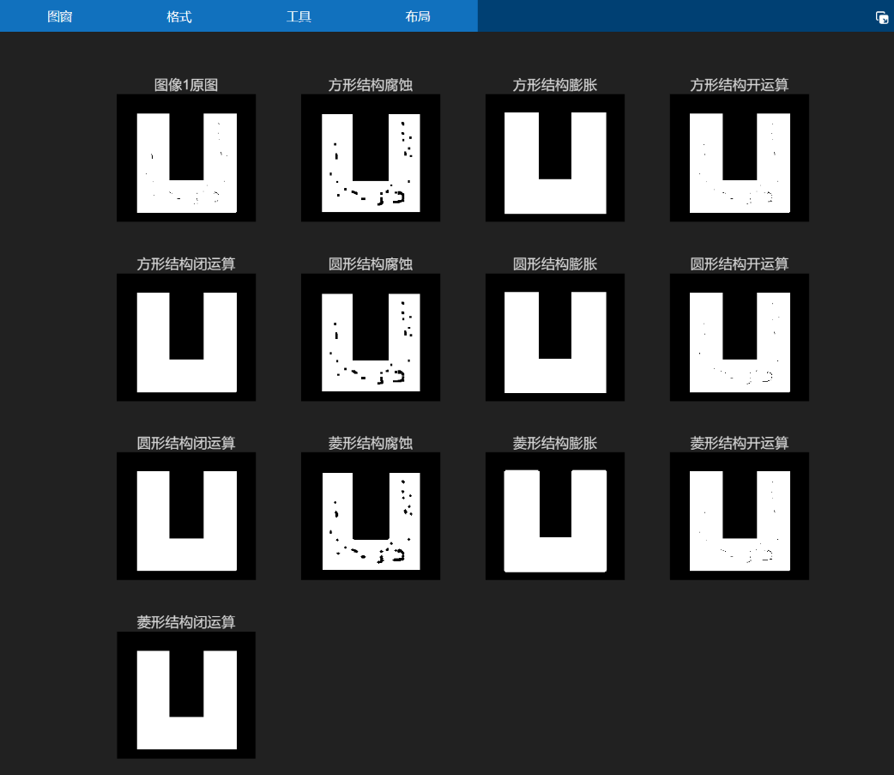


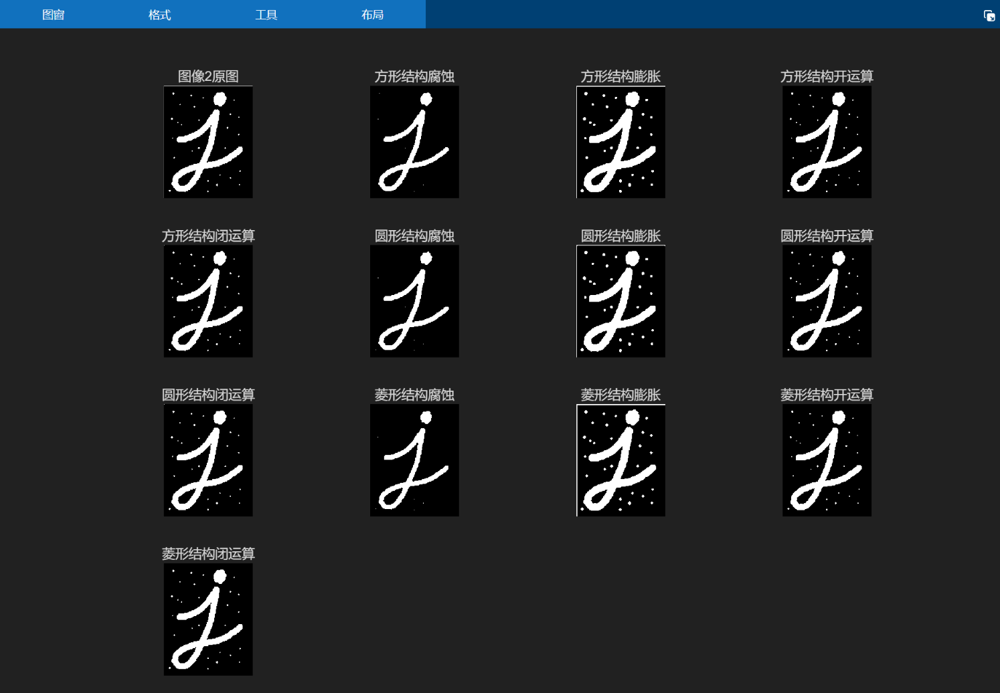

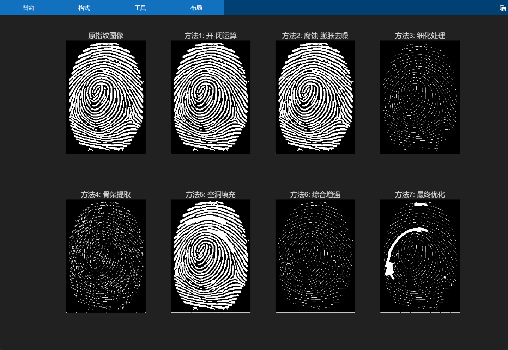

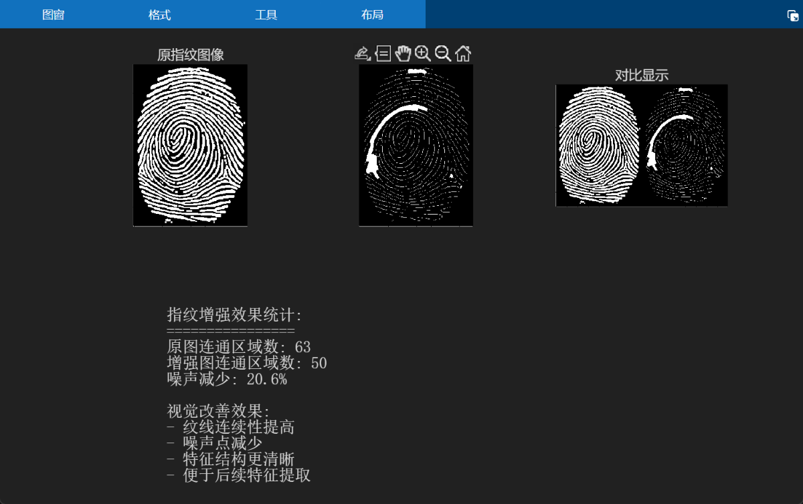

​	

# 实验十一


## 实验目的：

1. 学习理解图像分割的基本概念
2. 理解掌握基本的阈值法和边缘检测法来进行图像分割

## 实验原理：

1. **Sobel边缘检测**：通过计算图像在水平和垂直方向的梯度来检测边缘。Sobel算子使用两个3×3的卷积核，分别计算水平和垂直方向的梯度，然后结合两个方向的梯度得到边缘强度。

2. **阈值分割**：根据像素亮度将图像分为前景和背景。通过设定一个或多个阈值，将像素分为不同的类别，是最简单直接的分割方法。

3. **Otsu方法**：自动寻找最佳阈值，使类间方差最大。该方法基于图像的直方图统计特性，能够自动确定最优分割阈值，无需人工干预。

4. **局部阈值**：对图像分块计算阈值，适应光照不均的情况。通过将图像划分为多个子区域，在每个区域内独立计算阈值，有效解决全局阈值在处理光照不均匀图像时的局限性。

## 实验结果分析：

1. **边缘检测效果**受图像噪声和对比度影响较大。在边缘清晰、噪声少的图像上效果较好，但在复杂背景下可能出现边缘断裂或虚假边缘。

2. **全局阈值法**适用于背景前景对比明显的图像。当图像具有双峰直方图特征时，全局阈值法能够获得较好的分割效果。

3. **局部阈值法**能更好处理光照不均匀的图像。通过适应局部区域的亮度特征，局部阈值法在光照变化较大的场景中表现更优。

4. **多级阈值**可以分割出图像的多个亮度区域。对于包含多个亮度层次的复杂图像，多级阈值能够提供更细致的分割结果。

### 改进建议：

1. **预处理优化**：对于噪声图像，可先进行平滑处理，如使用高斯滤波或中值滤波来减少噪声对分割效果的干扰。

2. **阈值计算改进**：尝试不同的阈值计算方法，如基于熵的阈值法、迭代阈值法等，以适应不同类型的图像特征。

3. **方法融合**：结合多种分割方法获得更好效果，如将边缘检测结果与区域生长方法相结合，提高分割的准确性。

4. **特征扩展**：考虑图像的色彩和纹理信息，在灰度信息基础上加入颜色特征和纹理特征，提升复杂场景下的分割性能。

### 分割效果评估指南：

**好的分割效果特征：**
- 目标区域完整连续：分割后的目标区域应该保持完整性，没有明显的断裂或缺失
- 边界清晰准确：边缘定位精确，能够真实反映目标的轮廓特征
- 背景干扰少：能够有效抑制背景噪声，减少误分割现象
- 适应图像的光照变化：在不同光照条件下都能保持稳定的分割效果

**效果不佳的常见原因：**
- 图像噪声过多：噪声会干扰边缘检测和阈值计算，导致分割结果不准确
- 光照不均匀：明暗差异过大会影响全局阈值的效果，造成部分区域分割失败
- 目标与背景对比度低：当目标与背景颜色或亮度相近时，难以有效区分
- 阈值选择不合适：阈值过高或过低都会影响分割质量，需要根据图像特性调整
- 图像模糊或分辨率低：图像质量差会直接影响分割算法的性能表现

通过本次实验，我深入理解了图像分割的基本原理和方法，掌握了Sobel边缘检测、阈值分割等经典技术的实现和应用，为后续的图像处理研究奠定了坚实基础。

## 代码

```matlab
%% 实验十一：图像分割实验
clear; close all; clc;

%% 主程序开始
image_names = {'t1.png', 't2.png', 't3.png'};

for img_idx = 1:length(image_names)
    try
        fprintf('处理图像 %d: %s\n', img_idx, image_names{img_idx});
        
        % 读取图像
        if exist(image_names{img_idx}, 'file')
            I = imread(image_names{img_idx});
            % 如果图像是uint8类型，转换为double
            if isa(I, 'uint8')
                I = double(I) / 255;
            end
        else
            % 创建测试图像
            fprintf('创建测试图像代替 %s\n', image_names{img_idx});
            I = rand(256, 256, 3); % 彩色测试图像
        end
        
        % 转换为灰度图像
        I_gray = my_rgb2gray(I);
        
        figure('Name', sprintf('图像%d分割结果', img_idx));
        
        %% 1. Sobel算子边缘检测
        % Sobel算子
        sobel_x = [-1 0 1; -2 0 2; -1 0 1];
        sobel_y = [1 2 1; 0 0 0; -1 -2 -1];
        
        % 计算梯度
        Gx = my_conv2_basic(I_gray, sobel_x);
        Gy = my_conv2_basic(I_gray, sobel_y);
        gradient_magnitude = sqrt(Gx.^2 + Gy.^2);
        
        % 显示结果
        subplot(2, 4, 1);
        imagesc(I_gray); colormap gray; axis image;
        title('原始图像');
        
        subplot(2, 4, 2);
        imagesc(my_mat2gray(Gx)); colormap gray; axis image;
        title('Sobel水平梯度');
        
        subplot(2, 4, 3);
        imagesc(my_mat2gray(Gy)); colormap gray; axis image;
        title('Sobel垂直梯度');
        
        subplot(2, 4, 4);
        imagesc(my_mat2gray(gradient_magnitude)); colormap gray; axis image;
        title('梯度幅值');
        
        %% 2. 简单的边缘检测
        % 基于梯度的简单边缘检测
        edge_threshold = 0.15;
        simple_edges = gradient_magnitude > edge_threshold;
        
        subplot(2, 4, 5);
        imagesc(simple_edges); colormap gray; axis image;
        title(sprintf('简单边缘(阈值=%.2f)', edge_threshold));
        
        %% 3. 全局阈值分割
        % 手动Otsu阈值计算
        data = I_gray(:);
        levels = 256;
        min_val = min(data);
        max_val = max(data);
        
        % 计算直方图
        hist_counts = my_imhist(I_gray, levels);
        total = sum(hist_counts);
        
        sumB = 0;
        wB = 0;
        maximum = 0;
        threshold1 = 0.5; % 默认阈值
        
        for ii = 1:levels
            wB = wB + hist_counts(ii);
            if wB == 0
                continue;
            end
            wF = total - wB;
            if wF == 0
                break;
            end
            
            sumB = sumB + (ii-1) * hist_counts(ii);
            mB = sumB / wB;
            mF = (sum(data) * total - sumB) / wF;
            
            between = wB * wF * (mB - mF)^2;
            if between >= maximum
                threshold1 = (ii-1) / (levels-1);
                maximum = between;
            end
        end
        
        binary_global = I_gray > threshold1;
        
        subplot(2, 4, 6);
        imagesc(binary_global); colormap gray; axis image;
        title(sprintf('全局阈值(%.3f)', threshold1));
        
        %% 4. 局部阈值分割
        block_size = 32;
        [m, n] = size(I_gray);
        binary_local = false(m, n);
        
        for i = 1:block_size:m
            for j = 1:block_size:n
                i_end = min(i+block_size-1, m);
                j_end = min(j+block_size-1, n);
                block = I_gray(i:i_end, j:j_end);
                local_thresh = mean(block(:)) * 0.7;
                binary_local(i:i_end, j:j_end) = block > local_thresh;
            end
        end
        
        subplot(2, 4, 7);
        imagesc(binary_local); colormap gray; axis image;
        title('局部阈值分割');
        
        %% 5. 多级阈值分割
        level_low = 0.33;
        level_high = 0.67;
        multi_level = zeros(size(I_gray));
        multi_level(I_gray < level_low) = 0;
        multi_level(I_gray >= level_low & I_gray < level_high) = 0.5;
        multi_level(I_gray >= level_high) = 1;
        
        subplot(2, 4, 8);
        imagesc(multi_level); colormap gray; axis image;
        title('多级阈值分割');
        
        %% 结果显示和分析
        fprintf('  图像统计:\n');
        fprintf('    - 尺寸: %dx%d\n', size(I_gray, 1), size(I_gray, 2));
        fprintf('    - 亮度范围: [%.3f, %.3f]\n', min(I_gray(:)), max(I_gray(:)));
        fprintf('    - 计算的最佳阈值: %.3f\n', threshold1);
        fprintf('    - 标准差: %.3f\n', std(I_gray(:)));
        
    catch ME
        fprintf('处理图像 %s 时出错: %s\n', image_names{img_idx}, ME.message);
        % 如果出错，创建一个简单演示
        demo_image = double(rand(200, 200) > 0.5);
        figure('Name', '演示图像');
        imagesc(demo_image); colormap gray;
        title('演示图像 - 请检查原始图像文件');
    end
end


%% 自定义图像处理函数（不依赖任何工具箱）
function output = my_conv2_basic(image, filter)
    % 简单的2D卷积实现，不使用任何工具箱函数
    [m, n] = size(image);
    [fm, fn] = size(filter);
    pad_m = floor(fm/2);
    pad_n = floor(fn/2);
    
    % 手动边界填充（复制边界）
    padded = zeros(m + 2*pad_m, n + 2*pad_n);
    padded(pad_m+1:pad_m+m, pad_n+1:pad_n+n) = image;
    
    % 填充边界
    for i = 1:pad_m
        padded(i, :) = padded(pad_m+1, :);
        padded(end-i+1, :) = padded(end-pad_m, :);
    end
    for j = 1:pad_n
        padded(:, j) = padded(:, pad_n+1);
        padded(:, end-j+1) = padded(:, end-pad_n);
    end
    
    output = zeros(m, n);
    
    % 卷积操作
    for i = 1:m
        for j = 1:n
            region = padded(i:i+fm-1, j:j+fn-1);
            output(i, j) = sum(sum(region .* filter));
        end
    end
end

function gray = my_rgb2gray(rgb)
    % 手动RGB转灰度
    if size(rgb, 3) == 3
        gray = 0.2989 * rgb(:,:,1) + 0.5870 * rgb(:,:,2) + 0.1140 * rgb(:,:,3);
    else
        gray = rgb;
    end
end

function normalized = my_mat2gray(matrix)
    % 手动矩阵归一化到[0,1]
    min_val = min(matrix(:));
    max_val = max(matrix(:));
    if max_val == min_val
        normalized = zeros(size(matrix));
    else
        normalized = (matrix - min_val) / (max_val - min_val);
    end
end

function hist_data = my_imhist(image, bins)
    % 手动计算直方图
    if nargin < 2
        bins = 256;
    end
    hist_data = zeros(1, bins);
    min_val = min(image(:));
    max_val = max(image(:));
    
    for i = 1:numel(image)
        bin = max(1, min(bins, round((image(i) - min_val) / (max_val - min_val) * (bins-1)) + 1));
        hist_data(bin) = hist_data(bin) + 1;
    end
end

```


## 结果

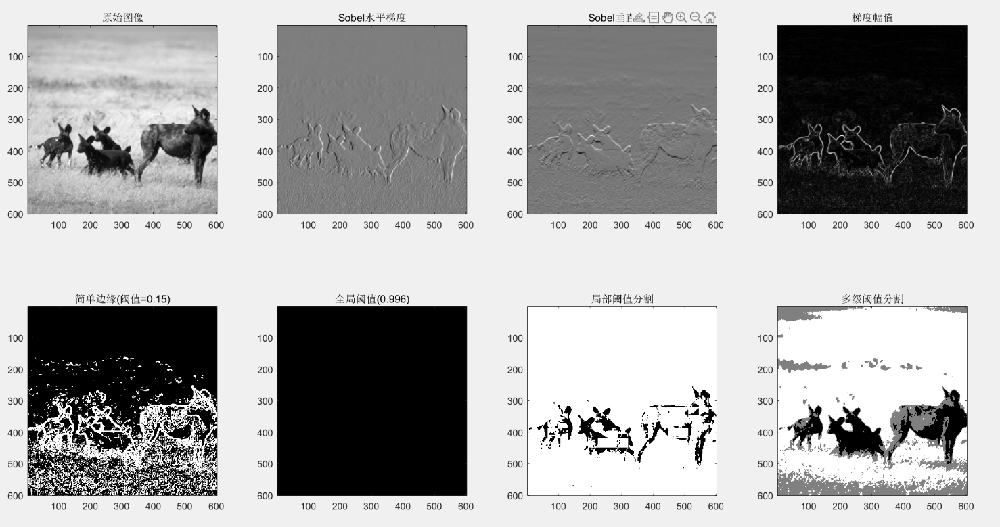

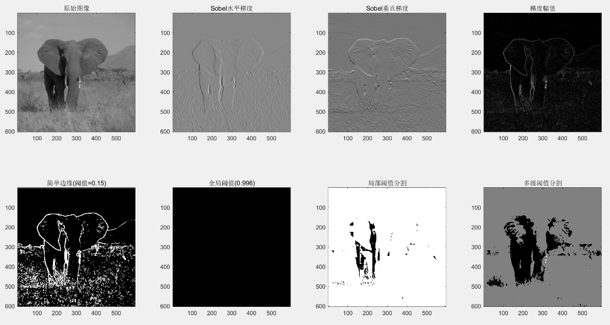

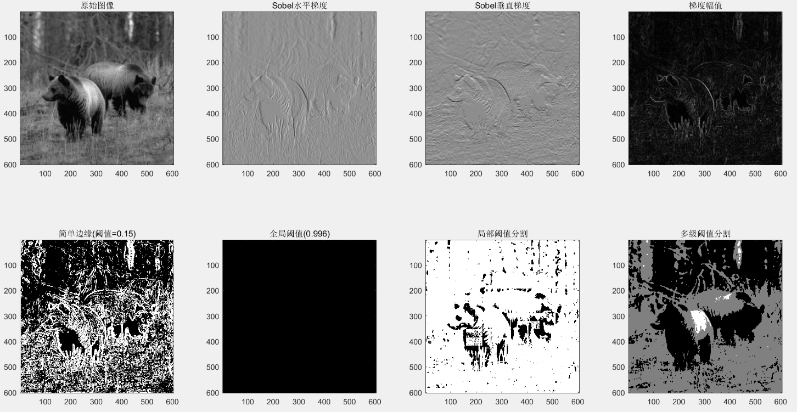
