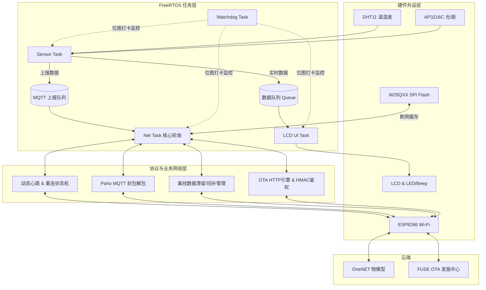

test
test2

# 基于 STM32F429 与 FreeRTOS 的高可靠性 IoT 网关

本项目是一个工业级/智能家居双场景适用的 IoT 网关全栈设备端系统。基于 STM32F429 核心，搭载 FreeRTOS 实时操作系统，实现多传感器数据采集、本地 UI 渲染、异常掉线离线缓存、OneNET 平台接入以及 FUSE 平台的 OTA 远程静默升级。

## 🎯 核心特性
- **稳定的多线程架构**：采用 FreeRTOS 进行任务解耦（传感器采集、UI 刷新、TCP/MQTT 网络、守护进程）。
- **位图机制软件看门狗**：设计了精确到任务级的状态监控，防止单一线程死锁导致整个网关瘫痪。
- **动态心跳与防掉线机制**：结合 Paho-MQTT 与 ATK-MW8266D，实现断网指数级退避重连、基于流量侦测的动态 PING 节能保活。
- **离线数据容灾存储**：断网期间传感器数据自动封装备份至外置 SPI Flash (W25Qxx)，待网络恢复后按 FIFO 执行历史账单回补上报。
- **HMAC-SHA1 加密与 OTA 升级**：支持云端固件下发，通过 HTTP Ranged Requests (分块下载)、MD5 完整性校验实现安全可靠的系统更新。

## 🗂 系统架构图

