# 命名规则

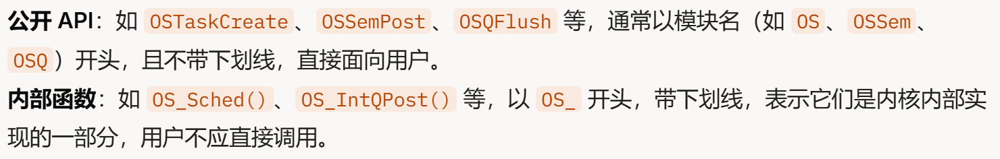

# 多任务系统

```C
#include "FreeRTOS.h"
#include "task.h"

// 任务1：每1秒打印一次
void Task1(void *pvParameters) {
    while (1) {
        printf("Task1: I am cooking soup!\n");
        vTaskDelay(1000 / portTICK_PERIOD_MS); // 延时1秒
    }
}

// 任务2：每0.5秒打印一次
void Task2(void *pvParameters) {
    while (1) {
        printf("Task2: I am frying vegetables!\n");
        vTaskDelay(500 / portTICK_PERIOD_MS);  // 延时0.5秒
    }
}

int main(void) {
    SystemInit(); // 初始化系统（比如设置时钟）
```


    // 创建任务1
    xTaskCreate(Task1, "Task1", 100, NULL, 1, NULL);
    // 创建任务2
    xTaskCreate(Task2, "Task2", 100, NULL, 2, NULL);
    
    // 启动调度器
    vTaskStartScheduler();//调度器接管 CPU，开始根据任务优先级和状态调度任务。
    //调度器启动后，main 函数不会继续执行，除非调度器启动失败（例如内存不足）
    
    while (1); // 不会执行到这里
}

#### **类比：厨师和任务**

- **CPU（厨师）**：厨房里只有一个厨师（单核 CPU），他一次只能做一件事。
- **任务（Task1 和 Task2）**：厨师需要完成两件事：Task1 是“煮汤”（每1秒搅拌一次），Task2 是“炒菜”（每0.5秒翻炒一次）。
- **调度器（vTaskStartScheduler）**：一个智能助手（FreeRTOS 调度器），告诉厨师什么时候该切换任务。


xxxxxxxxxx41 1graph TD2    subgraph 硬件外设层3        S1[DHT11 温湿度]4        S2[AP3216C 光/距]5        S3[W25QXX SPI Flash]6        S4[LCD & LED/Beep]7        S5[ESP8266 Wi-Fi]8    end9​10    subgraph FreeRTOS 任务层11        T1[Sensor Task]12        T2[LCD UI Task]13        T3[Net Task 核心轮询]14        T4[Watchdog Task]15        16        Q1[(数据队列 Queue)]17        Q2[(MQTT 上报队列)]18    end19​20    subgraph 协议与业务网络层21        P1[动态心跳 & 重连状态机]22        P2[Paho MQTT 封包解包]23        P3[离线数据滞留/回补管理]24        P4[OTA HTTP引擎 & HMAC鉴权]25    end26​27    subgraph 云端28        C1[OneNET 物模型]29        C2[FUSE OTA 发版中心]30    end31​32    S1 & S2 --> T133    T1 -->|实时数据| Q134    T1 -->|上报数据| Q235    Q1 --> T2 --> S436    37    Q2 --> T338    S3 <-->|断网缓存| T339    T3 <--> P1 & P2 & P3 & P4 <--> S5 <--> C1 & C240    41    T4 -.->|位图打卡监控| T1 & T2 & T3mermaid#mermaidChart0{font-family:sans-serif;font-size:16px;fill:#333;}@keyframes edge-animation-frame{from{stroke-dashoffset:0;}}@keyframes dash{to{stroke-dashoffset:0;}}#mermaidChart0 .edge-animation-slow{stroke-dasharray:9,5!important;stroke-dashoffset:900;animation:dash 50s linear infinite;stroke-linecap:round;}#mermaidChart0 .edge-animation-fast{stroke-dasharray:9,5!important;stroke-dashoffset:900;animation:dash 20s linear infinite;stroke-linecap:round;}#mermaidChart0 .error-icon{fill:#552222;}#mermaidChart0 .error-text{fill:#552222;stroke:#552222;}#mermaidChart0 .edge-thickness-normal{stroke-width:1px;}#mermaidChart0 .edge-thickness-thick{stroke-width:3.5px;}#mermaidChart0 .edge-pattern-solid{stroke-dasharray:0;}#mermaidChart0 .edge-thickness-invisible{stroke-width:0;fill:none;}#mermaidChart0 .edge-pattern-dashed{stroke-dasharray:3;}#mermaidChart0 .edge-pattern-dotted{stroke-dasharray:2;}#mermaidChart0 .marker{fill:#333333;stroke:#333333;}#mermaidChart0 .marker.cross{stroke:#333333;}#mermaidChart0 svg{font-family:sans-serif;font-size:16px;}#mermaidChart0 p{margin:0;}#mermaidChart0 .label{font-family:sans-serif;color:#333;}#mermaidChart0 .cluster-label text{fill:#333;}#mermaidChart0 .cluster-label span{color:#333;}#mermaidChart0 .cluster-label span p{background-color:transparent;}#mermaidChart0 .label text,#mermaidChart0 span{fill:#333;color:#333;}#mermaidChart0 .node rect,#mermaidChart0 .node circle,#mermaidChart0 .node ellipse,#mermaidChart0 .node polygon,#mermaidChart0 .node path{fill:#ECECFF;stroke:#9370DB;stroke-width:1px;}#mermaidChart0 .rough-node .label text,#mermaidChart0 .node .label text,#mermaidChart0 .image-shape .label,#mermaidChart0 .icon-shape .label{text-anchor:middle;}#mermaidChart0 .node .katex path{fill:#000;stroke:#000;stroke-width:1px;}#mermaidChart0 .rough-node .label,#mermaidChart0 .node .label,#mermaidChart0 .image-shape .label,#mermaidChart0 .icon-shape .label{text-align:center;}#mermaidChart0 .node.clickable{cursor:pointer;}#mermaidChart0 .root .anchor path{fill:#333333!important;stroke-width:0;stroke:#333333;}#mermaidChart0 .arrowheadPath{fill:#333333;}#mermaidChart0 .edgePath .path{stroke:#333333;stroke-width:2.0px;}#mermaidChart0 .flowchart-link{stroke:#333333;fill:none;}#mermaidChart0 .edgeLabel{background-color:rgba(232,232,232, 0.8);text-align:center;}#mermaidChart0 .edgeLabel p{background-color:rgba(232,232,232, 0.8);}#mermaidChart0 .edgeLabel rect{opacity:0.5;background-color:rgba(232,232,232, 0.8);fill:rgba(232,232,232, 0.8);}#mermaidChart0 .labelBkg{background-color:rgba(232, 232, 232, 0.5);}#mermaidChart0 .cluster rect{fill:#ffffde;stroke:#aaaa33;stroke-width:1px;}#mermaidChart0 .cluster text{fill:#333;}#mermaidChart0 .cluster span{color:#333;}#mermaidChart0 div.mermaidTooltip{position:absolute;text-align:center;max-width:200px;padding:2px;font-family:sans-serif;font-size:12px;background:hsl(80, 100%, 96.2745098039%);border:1px solid #aaaa33;border-radius:2px;pointer-events:none;z-index:100;}#mermaidChart0 .flowchartTitleText{text-anchor:middle;font-size:18px;fill:#333;}#mermaidChart0 rect.text{fill:none;stroke-width:0;}#mermaidChart0 .icon-shape,#mermaidChart0 .image-shape{background-color:rgba(232,232,232, 0.8);text-align:center;}#mermaidChart0 .icon-shape p,#mermaidChart0 .image-shape p{background-color:rgba(232,232,232, 0.8);padding:2px;}#mermaidChart0 .icon-shape rect,#mermaidChart0 .image-shape rect{opacity:0.5;background-color:rgba(232,232,232, 0.8);fill:rgba(232,232,232, 0.8);}#mermaidChart0 .label-icon{display:inline-block;height:1em;overflow:visible;vertical-align:-0.125em;}#mermaidChart0 .node .label-icon path{fill:currentColor;stroke:revert;stroke-width:revert;}#mermaidChart0 :root{--mermaid-alt-font-family:sans-serif;}云端协议与业务网络层FreeRTOS 任务层硬件外设层实时数据上报数据断网缓存位图打卡监控位图打卡监控位图打卡监控DHT11 温湿度AP3216C 光/距W25QXX SPI FlashLCD & LED/BeepESP8266 Wi-FiSensor TaskLCD UI TaskNet Task 核心轮询Watchdog Task数据队列 QueueMQTT 上报队列动态心跳 & 重连状态机Paho MQTT 封包解包离线数据滞留/回补管理OTA HTTP引擎 & HMAC鉴权OneNET 物模型FUSE OTA 发版中心

## **多任务系统的核心：调度器**

#### **调度器的工作**

- 任务状态

  ：调度器会跟踪每个任务的状态：

  - **运行**：当前正在使用 CPU。
  - **就绪**：可以运行，但等待 CPU。
  - **阻塞**：任务主动暂停（比如调用 vTaskDelay），暂时不占用 CPU。

- **优先级**：调度器总是选择优先级最高的“就绪”任务运行。

- **时间片**：如果两个任务优先级相同，调度器会让它们轮流运行（分时调度）。

# 创建任务

## 定义任务栈

在一个裸机系统中，如果有全局变量，有子函数调用，有中断发生。那么系统在运行的时候，全局变量放在哪里，子函数调用时，局部变量放在哪里，中断发生时，函数返回地址发哪里。如果只是单纯的裸机编程，它们放哪里我们不用管，但是如果要写一个 RTOS，这些种种环境参数，我们必须弄清楚他们是如何存储的。

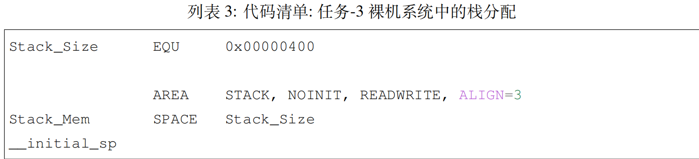

在多任务系统中，每个任务都是独立的，互不干扰的，所以要为每个任务都分配独立的栈空间，这个栈空间通常是一个预先定义好的全局数组


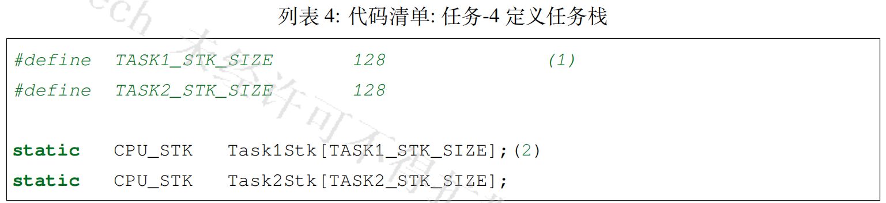

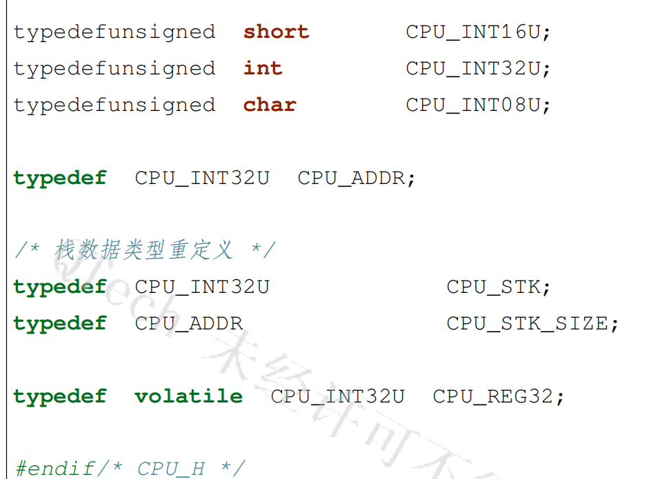

**volatile**：C 语言关键字，表示变量可能被外部修改（例如硬件寄存器），告诉编译器不要优化对该变量的访问，确保每次访问寄存器时都直接读写硬件，而不是使用缓存值。


**为什么需要这些类型？**

- 类比

  ：假设你在一家公司工作，公司有不同部门（销售、研发、财务）。每个部门有自己的“工作语言”：

  - 销售用“客户编号”（类似 CPU_INT32U）。
  - 研发用“设备地址”（类似 CPU_ADDR）。
  - 财务用“账本记录”（类似 CPU_REG32）。

- 如果大家都用自己的语言（unsigned int、unsigned char），可能会混乱。typedef 就像公司统一了术语，让大家用相同的“工作语言”，沟通更顺畅。

## 定义任务函数

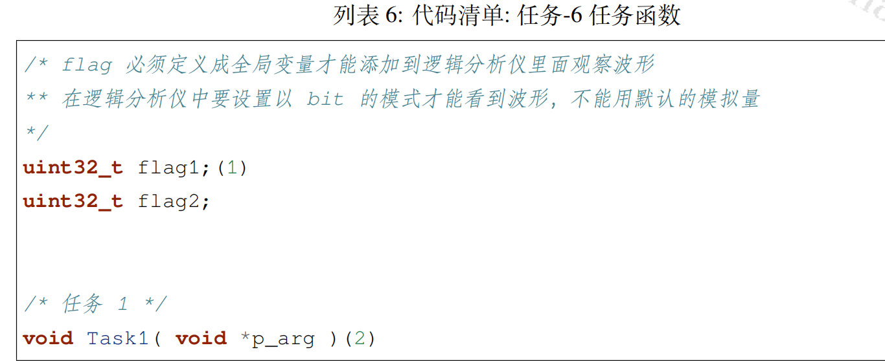

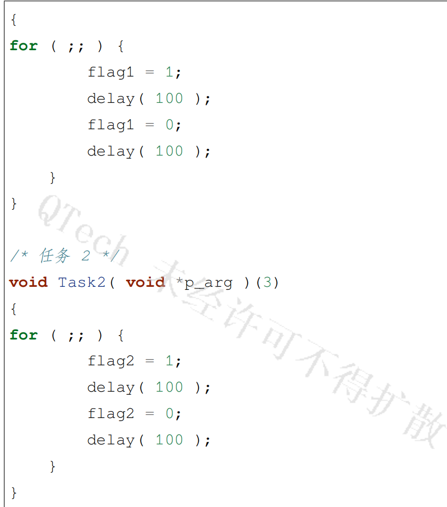

任务是一个独立的、无限循环且不能返回的函数

## 定义任务控制块TCB

这个任务控制块就相当于任务的身份证，里面存有任务的所有信息，比如任务的栈，任务名称，任务的形参等。有了这个任务控制块之后，以后系统对任务的全部操作都可以通过这个 TCB 来实现。

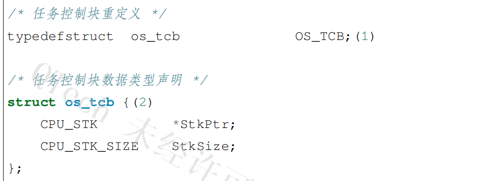

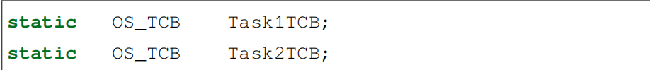


## 实现任务创建函数

```c
/******************************************************************************
* 函数名称: OSTaskCreate
* 功能描述: 创建操作系统任务
* 输入参数:
*   - p_tcb:     指向任务控制块(TCB)的指针
*   - p_task:    任务函数指针
*   - p_arg:     传递给任务函数的参数指针
*   - p_stk_base:任务堆栈基地址指针
*   - stk_size:  任务堆栈大小(以CPU_STK为单位)
* 输出参数:
*   - p_err:     错误码指针，用于返回执行状态
* 返回值: 无
******************************************************************************/
void OSTaskCreate (OS_TCB        *p_tcb,
                   OS_TASK_PTR   p_task,
                   void          *p_arg,
                   CPU_STK       *p_stk_base,
                   CPU_STK_SIZE  stk_size,
                   OS_ERR        *p_err)
{
    CPU_STK       *p_sp;  // 堆栈指针临时变量

    // 初始化任务堆栈
    p_sp = OSTaskStkInit (p_task,  // 任务入口函数
                          p_arg,  // 任务参数
                          p_stk_base,  // 堆栈基地址
                          stk_size);   // 堆栈大小

    // 设置任务控制块(TCB)中的堆栈信息
    p_tcb->StkPtr = p_sp;    // 保存堆栈指针
    p_tcb->StkSize = stk_size; // 保存堆栈大小

    // 返回成功状态
	*p_err = OS_ERR_NONE;
}


```

函数命名规则

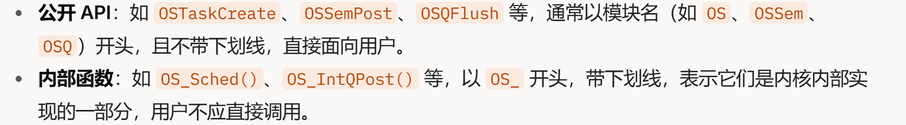

```c
/*
 * 任务堆栈初始化函数
 * 功能: 初始化一个任务的堆栈结构，模拟任务第一次被调度时的CPU上下文
 * 参数:
 *   p_task    - 任务函数的入口地址
 *   p_arg     - 传递给任务函数的参数
 *   p_stk_base- 堆栈的基地址
 *   stk_size  - 堆栈的大小(以CPU_STK为单位)
 * 返回值:
 *   初始化后的堆栈指针
 */
CPU_STK *OSTaskStkInit (OS_TASK_PTR  p_task,
                        void         *p_arg,
                        CPU_STK      *p_stk_base,
                        CPU_STK_SIZE stk_size)
{
	CPU_STK  *p_stk;

    /* 将堆栈指针初始化为堆栈的顶部(满递减堆栈) */
	p_stk = &p_stk_base[stk_size];

    /*
     * 模拟异常发生时自动保存的寄存器(硬件自动压栈部分)
     * 注意: 这些寄存器的压栈顺序必须与CPU异常发生时一致
     */
    *--p_stk = (CPU_STK)0x01000000u;        /* xPSR: 程序状态寄存器，bit24必须置1表示Thumb状态 */
    *--p_stk = (CPU_STK)p_task;             /* PC: 任务入口地址，异常返回时将从此处开始执行 */
    *--p_stk = (CPU_STK)0x14141414u;        /* LR(R14): 链接寄存器，初始化为无效值 */
    *--p_stk = (CPU_STK)0x12121212u;        /* R12: 通用寄存器 */
    *--p_stk = (CPU_STK)0x03030303u;        /* R3: 通用寄存器 */
    *--p_stk = (CPU_STK)0x02020202u;        /* R2: 通用寄存器 */
    *--p_stk = (CPU_STK)0x01010101u;        /* R1: 通用寄存器 */
    *--p_stk = (CPU_STK)p_arg;              /* R0: 任务参数，作为第一个参数传递给任务函数 */

    /*
     * 模拟异常发生时需要手动保存的寄存器(软件保存部分)
     * 这些寄存器在任务切换时需要由OS保存和恢复
     */
    *--p_stk = (CPU_STK)0x11111111u;        /* R11: 通用寄存器 */
    *--p_stk = (CPU_STK)0x10101010u;        /* R10: 通用寄存器 */
    *--p_stk = (CPU_STK)0x09090909u;        /* R9: 通用寄存器 */
    *--p_stk = (CPU_STK)0x08080808u;        /* R8: 通用寄存器 */
    *--p_stk = (CPU_STK)0x07070707u;        /* R7: 通用寄存器 */
    *--p_stk = (CPU_STK)0x06060606u;        /* R6: 通用寄存器 */
    *--p_stk = (CPU_STK)0x05050505u;        /* R5: 通用寄存器 */
    *--p_stk = (CPU_STK)0x04040404u;        /* R4: 通用寄存器 */

    /* 返回初始化后的堆栈指针 */
	return (p_stk);
}
```

## 编译问题

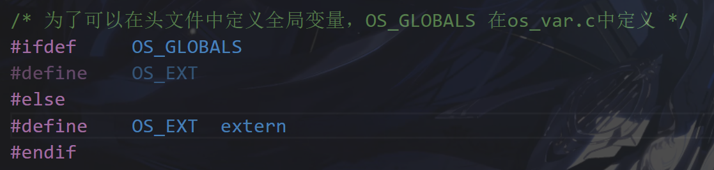

在 μC/OS-III 中，需要使用很多全局变量，这些全局变量都在 os.h 这个头文件中定义，但是 os.h会被包含进很多的文件中，那么编译的时候，os.h 里面定义的全局变量就会出现重复定义的情况，而我们要的只是 os.h 里面定义的全局变量只定义一次，其他包含 os.h 头文件的时候只是声明。

通常我们的做法都是在 C 文件里面定义全局变量，然后在头文件里面加 extern 声明，哪里需要使用就在哪里加 extern 声明。但是 μC/OS-III 中，文件非常多，这种方法可行，但不现实。所以就有了现在在 os.h 头文件中定义全局变量

为了实现os.h里的变量定义一次，其他的只是声明

宏的作用域是当前文件

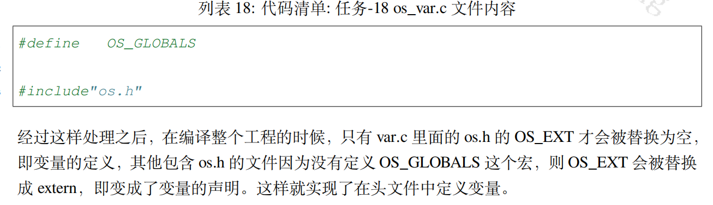

## 不看底层了

# 任务时间片

RTOS 需要一个时基来驱动，系统任务调度的频率等于该时基的频率。通常该时基由一个定时器来提供，也可以从其他周期性的信号源获得。刚好 Cortex-M 内核中有一个系统定时器 SysTick，它内嵌在 NVIC 中，是一个 24 位的递减的计数器，计数器每计数一次的时间为 1/SYSCLK。当重装载数值寄存器的值递减到 0 的时候，系统定时器就产生一次中断，以此循环往复。


定时中断实现切换任务

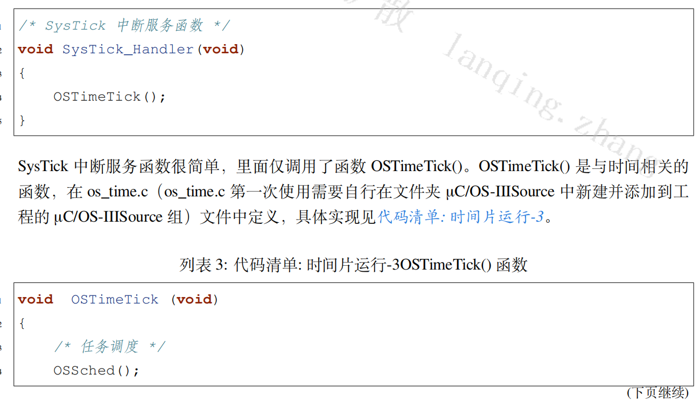

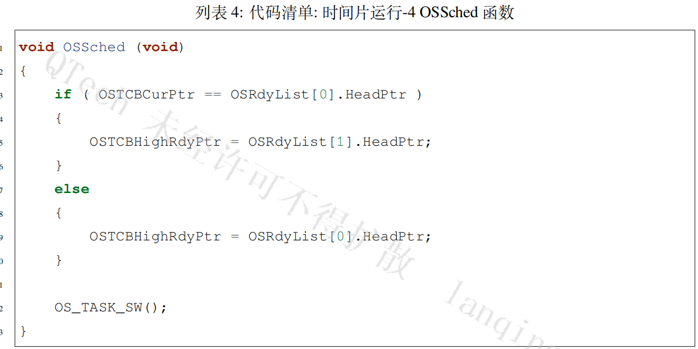

## 时基和时钟

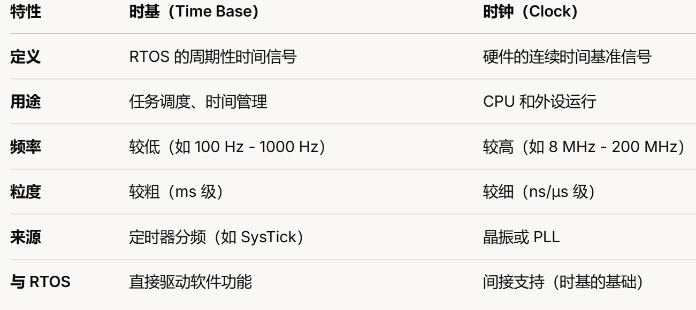

时基驱动软件，时钟驱动硬件

# 阻塞延时和空闲任务

使用 RTOS 的很大优势就是榨干 CPU 的性能，永远不能让它闲着，任务如果需要延时也就不能再让 CPU 空等来实现延时的效果。RTOS 中的延时叫阻塞延时，即任务需要延时的时候，任务会放弃 CPU 的使用权，CPU 可以去干其他的事情，当任务延时时间到，重新获取 CPU 使用权，任务继续运行，这样就充分地利用了 CPU 的资源，而不是干等着。

当任务需要延时，进入阻塞状态，那 CPU 又去干什么事情了？如果没有其他任务可以运行，RTOS都会为 CPU 创建一个空闲任务，这个时候 CPU 就运行空闲任务。在 μC/OS-III 中，空闲任务是系统在初始化的时候创建的优先级最低的任务，空闲任务主体很简单，只是对一个全局变量进行计数。鉴于空闲任务的这种特性，在实际应用中，当系统进入空闲任务的时候，可在空闲任务中让单片机进入休眠或者低功耗等操作。

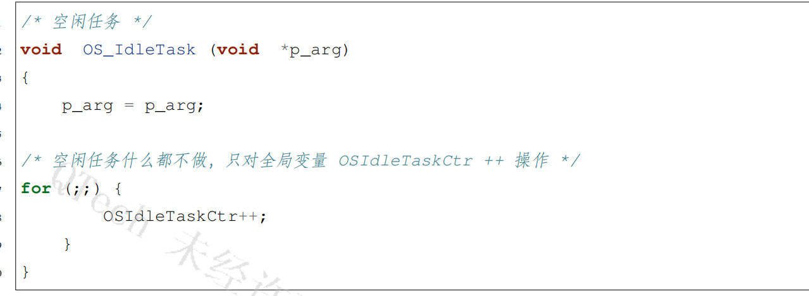

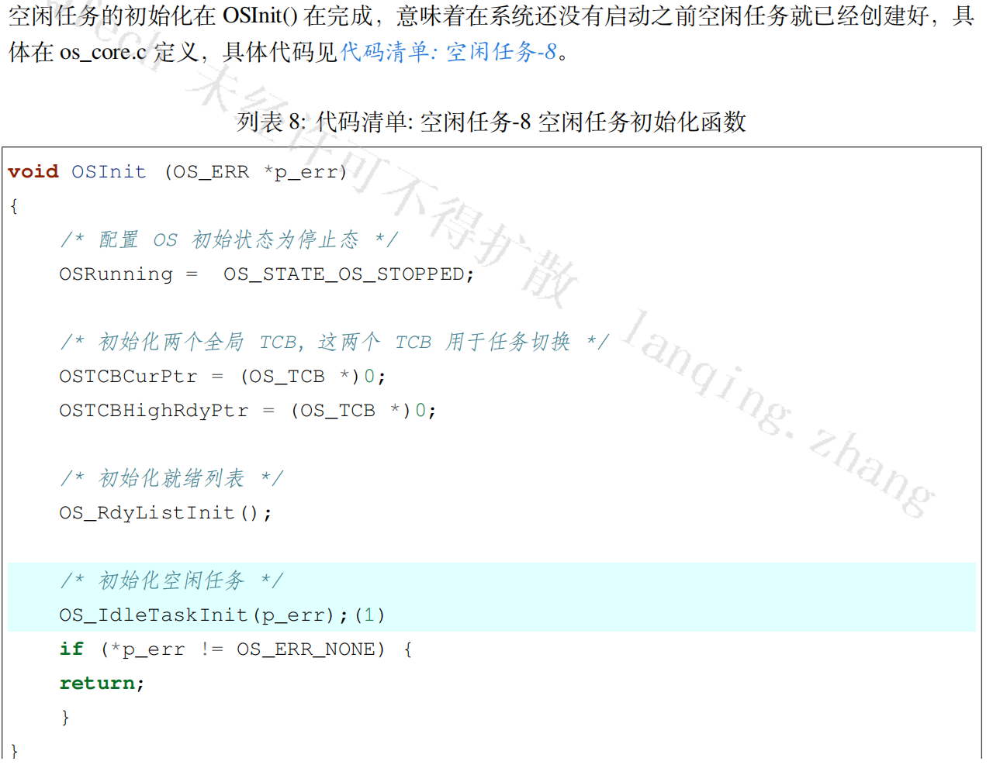

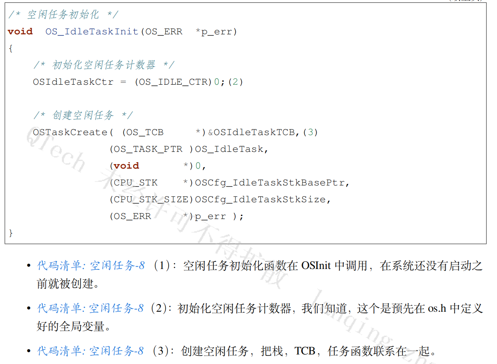


阻塞延时的阻塞是指任务调用该延时函数后，任务会被剥离 CPU 使用权，然后进入阻塞状态，直到延时结束，任务重新获取 CPU 使用权才可以继续运行。在任务阻塞的这段时间，CPU 可以去执行其他的任务，如果其他的任务也在延时状态，那么 CPU 就将运行空闲任务。

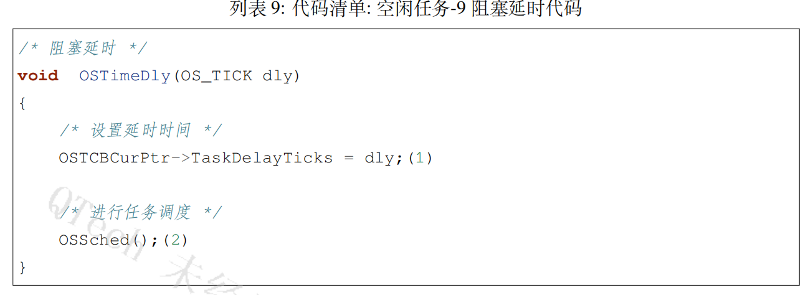

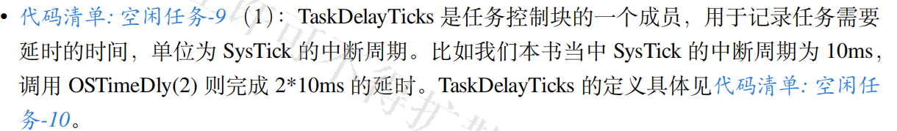

# 时间戳

通常执行一条代码是需要多个时钟周期的，即是 ns 级别。要想准确测量代码的运行时间，时间戳的精度就很重要。通常单片机中的硬件定时器的精度都是 us 级别，远达不到测量几条代码运行时间的精度。在 ARM Cortex-M 系列内核中，有一个 DWT 的外设，该外设有一个 32 位的寄存器叫 CYCCNT，它是一个向上的计数器，记录的是内核时钟 HCLK 运行的个数，当 CYCCNT 溢出之后，会清零重新开始向上计数。该计数器在 μC/OS-III 中正好被用来实现时间戳的功能。在 STM32F103 系列的单片机中，HCLK 时钟最高为 72M，单个时钟的周期为 1/72us = 0.0139us= 14ns，CYCCNT 总共能记录的时间为 2 32*14=60S。在 μC/OS-III 中，要测量的时间都是很短的，都是 ms 级别，根本不需要考虑定时器溢出的问题。如果内核代码执行的时间超过 s 的级别，那就背离了实时操作系统实时的设计初衷了，没有意义。

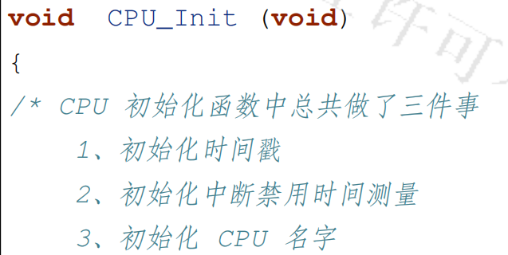

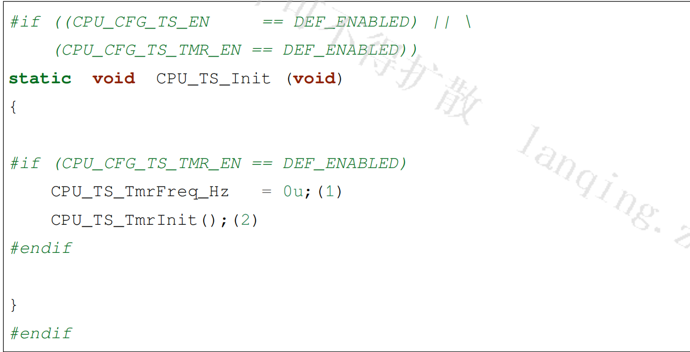

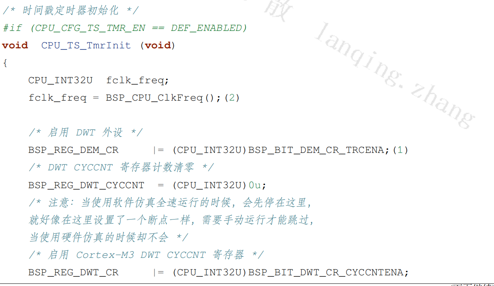

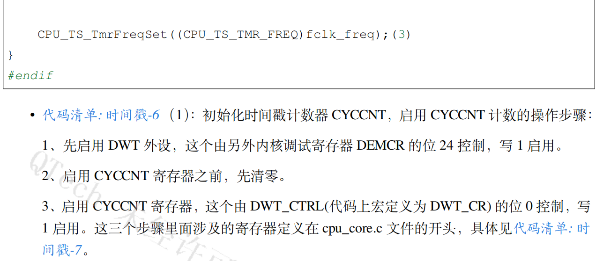

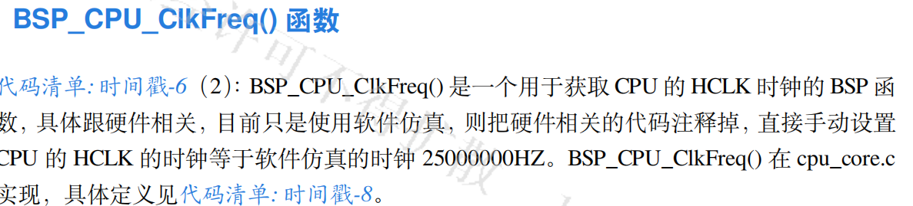

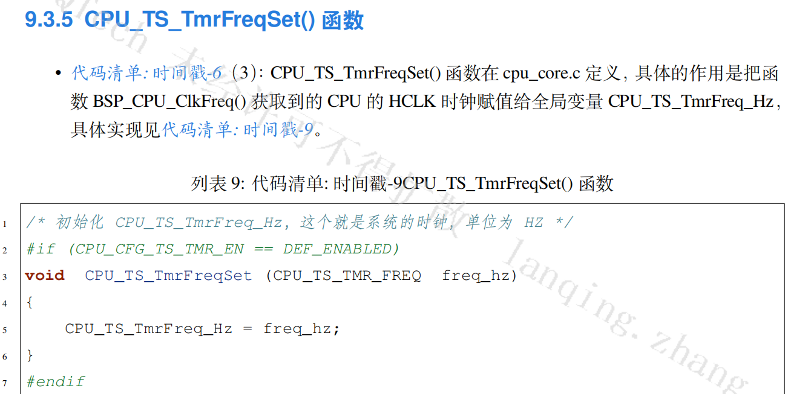

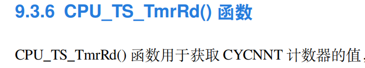

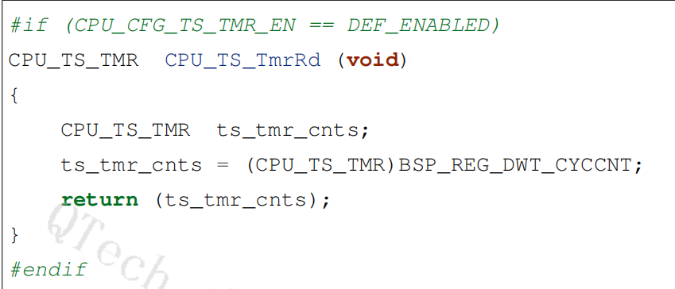

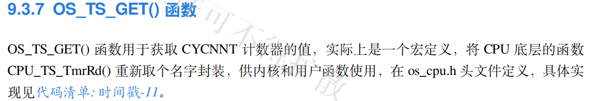

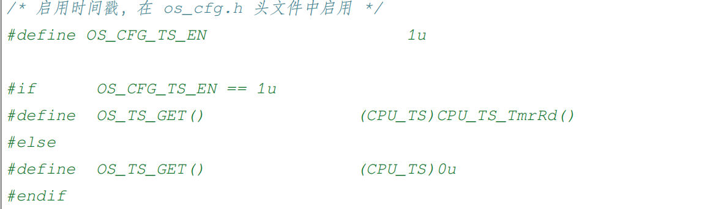

CYCNNT是CYCCNT,写错了

# 临界段

临界段代码，也称作临界域，是一段不可分割的代码。μC/OS 中包含了很多临界段代码。如果临界段可能被中断，那么就需要关中断以保护临界段。如果临界段可能被任务级代码打断，那么需要锁调度器保护临界段。

**临界段用一句话概括就是一段在执行的时候不能被中断的代码段**。在 μC/OS 里面，这个临界段最常出现的就是对全局变量的操作，全局变量就好像是一个枪把子，谁都可以对他开枪，但是我开枪的时候，你就不能开枪，否则就不知道是谁命中了靶子。可能有人会说我可以在子弹上面做个标记，我说你能不能不要瞎扯淡。

那么什么情况下临界段会被打断？一个是系统调度，还有一个就是外部中断。在 μC/OS 的系统调度，最终也是产生 PendSV 中断，在 PendSV Handler 里面实现任务的切换，所以还是可以归结为中断。既然这样，μC/OS 对临界段的保护最终还是回到对中断的开和关的控制。

在 μC/OS-III 中，调度器是抢占式的（Preemptive），意味着当更高优先级的任务就绪时，会立即中断当前任务并切换到更高优先级的任务。

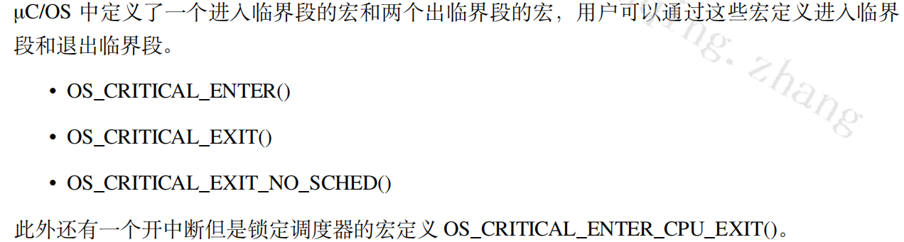

## 关中断指令

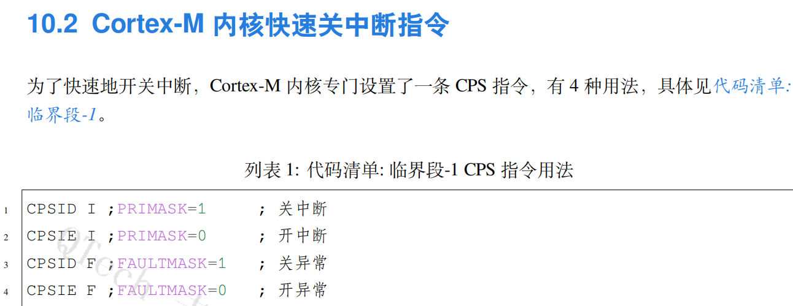

## 关中断

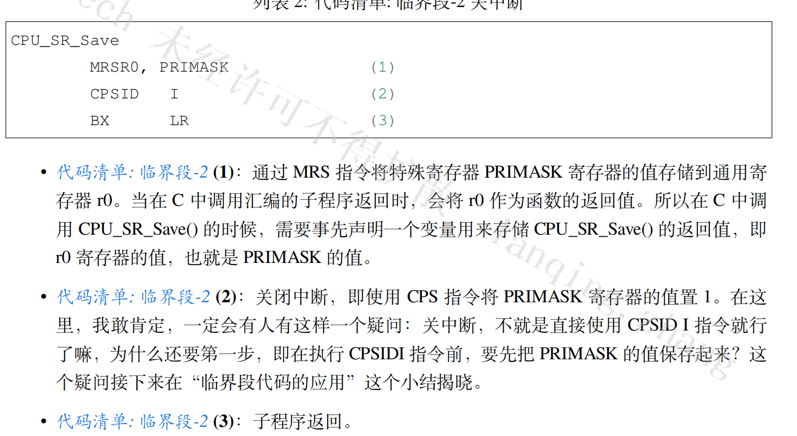

## 开中断

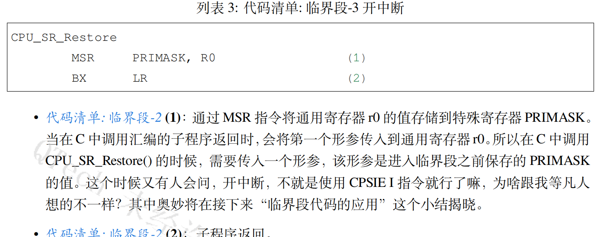

## 临界嵌套

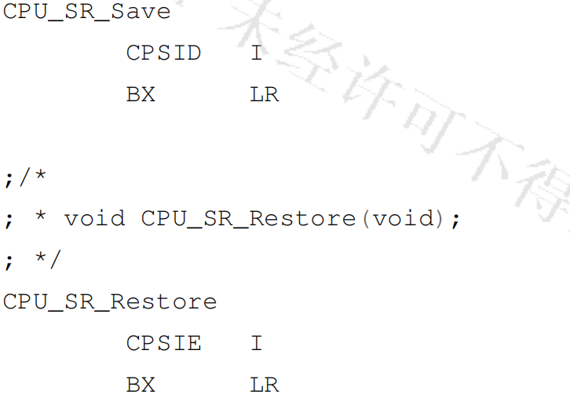

如果是这样

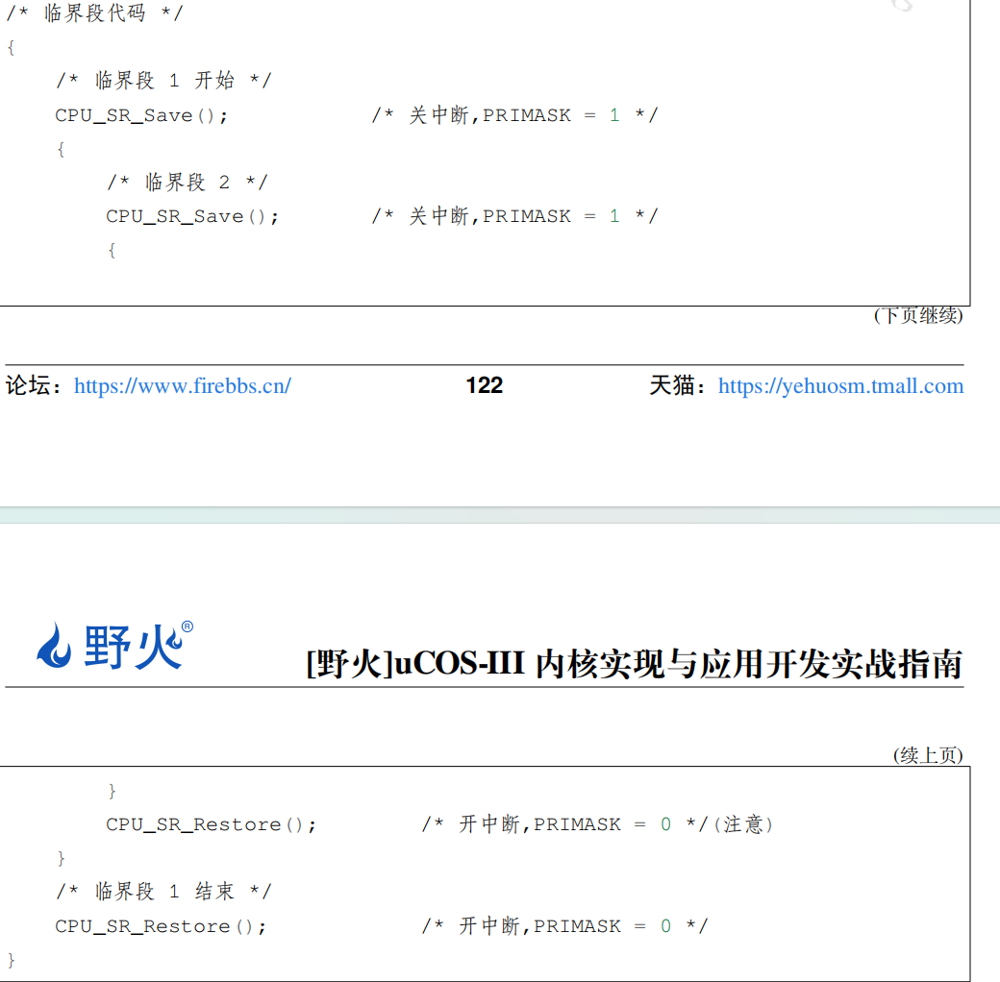

虽然临界段 2 已经结束，

但是临界段 1 还没有结束，中断是不能开启的


# 任务栈和任务堆栈

任务栈是调度任务的栈，里面放的的当前在执行的任务和待执行的任务，任务堆栈放的是执行当前任务的局部变量


### 任务栈的例子

当你首先打开浏览器时，浏览器任务被压入任务栈，此时任务栈中只有浏览器任务。接着你打开音乐播放器，音乐播放器任务被压入任务栈顶部，成为当前运行任务，此时任务栈中有浏览器和音乐播放器两个任务，并且音乐播放器在栈顶。然后你又打开短信应用，短信应用任务被压入任务栈顶部，此时任务栈的顺序从上到下为短信应用、音乐播放器、浏览器。当你点击手机的返回按钮时，短信应用任务从任务栈中弹出，音乐播放器任务成为栈顶任务，恢复运行。如果再点击返回，音乐播放器任务弹出，浏览器任务成为当前运行任务。这里的任务栈主要用于管理任务的执行顺序和切换，决定当前哪个任务处于前台运行状态。

### 任务堆栈的例子

以浏览器任务为例，当你在浏览器中输入网址访问网页时，浏览器程序中的函数会使用任务堆栈来存储局部变量，比如存储输入的网址字符串、当前页面的加载状态等。当浏览器调用某个函数来解析网页代码时，函数的参数和返回地址会被压入任务堆栈，同时 CPU 寄存器的状态也会被保存到任务堆栈中，以便在函数执行完毕后能恢复到原来的状态继续执行后续代码。任务堆栈为浏览器任务提供了一个临时的数据存储和操作空间，保证了浏览器任务在执行过程中数据的正确处理和函数的正确调用。

# 实时系统“调度”的核心

```c
void LED_Task(void *p_arg)
{
    while (1)
    {
        Toggle_LED();  // 翻转LED
        OSTimeDlyHMSM(0, 0, 1, 0, OS_OPT_TIME_HMSM_STRICT, &err); // 延时1秒
    }
}
```

因为在实时系统中，**不能有一个任务一c直 while(1) 占着 CPU**，必须定时挂起一下，释放资源给别的任务（这就是实时系统“调度”的核心）


# 空闲任务

在OS_Init()函数中会创建空闲任务