---

---

# 结构基础

## 存储设备

### FLASH

传统的ROM基本被淘汰，一旦写入出错芯片就废了，被FLASH闪存替代

FALSH可以修改，分为NAND和NOR

NAND FLASH:

存储单元按“NAND 逻辑门”串联，结构简单（1 个晶体管/单元），相同芯片面积可集成更多存储单元 → **容量大、成本低**（如 1TB NAND 芯片很常见）。

NOR FLASH**：**

**存储单元按“NOR 逻辑门”并联，结构复杂（2-3 个晶体管/单元） → **容量小、成本高**（通常最大几百 MB）。

SRAM,SDARM

ARM这里SRAM和X86的里CPU的cache类似，集成在CPU内部

| **对比项**   | SRAM                       | SDRAM                       |
| ------------ | -------------------------- | --------------------------- |
| **存储单元** | 6 晶体管（触发器）         | 1 晶体管 + 1 电容           |
| **刷新需求** | 无需刷新                   | 需定期刷新（防数据丢失）    |
| **速度**     | 极快（ns 级，与 CPU 同步） | 较快（10~50ns，与时钟同步） |
| **容量**     | 小（KB~MB 级，内置）       | 大（MB~GB 级，外置）        |
| **成本**     | 高（芯片面积大）           | 低（适合大容量）            |
| **典型位置** | MCU 内部（内部 RAM）       | 外部扩展（独立芯片）        |

SDRAM（synchrous dynamic）是同步的，CPU还要检测时钟线，还要定时刷新，功耗大，面积很大（看下图）改进·为DDRx

SRAM(static)CPU直接访问，无需其他

## 地址

嵌入式中，CPU会为所有存储型设备创建统一的地址空间


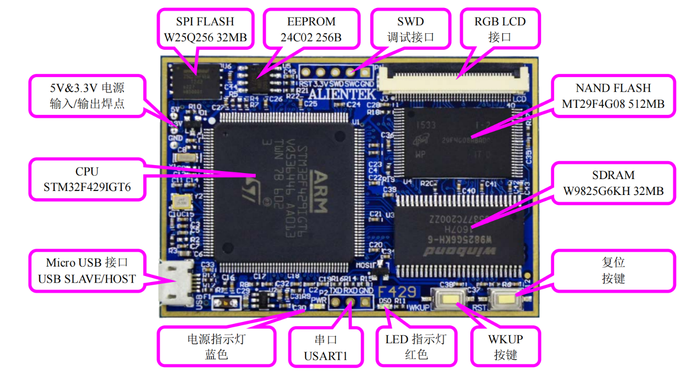

CPU：STM32F429IGT6，LQFP176，FLASH：1024KB，SRAM：256KB

◆ 外扩 SDRAM：W9825G6KH，32M 字节

◆ 外扩 NAND FLASH：MT29F4G08，512M 字节

◆ 外扩 SPI FLASH：W25Q256，32M 字节

◆ 外扩 EEPROM：24C02，256 字节

编译时会给程序划分字段

程序会被下载到内部FLASH中，运行时再根据需要从FLASH中加载到SDRAM/SRAM(const等只读的不会被频繁访问的片段会被保存在FLASH，其他变量需要频繁访问会被加载到SDRAM/SRAM)

运行时会加载汇编文件初始化各种环境（c语言，中断，堆栈……)，在跳转到main.c

外扩的存储设备不和CPU总线相连，不参与地址分配，有独立的地址，用协议访问


## 外设

外设：内部总线AHB(advanced high bus)不能直接访问的设备

外设分为片上外设和片内外设

片上外设：AHB不能直接访问，APB（advanced peripheral bus）可以访问（PWM,定时器，看门狗）

片外外设：AHB,APB(总线)都不能直接访问，通过片上外设GPIO,I2C,串口来通信

比如外接屏幕（iic协议，SPI），蓝牙模块（串口协议），循迹模块（GPIO)等

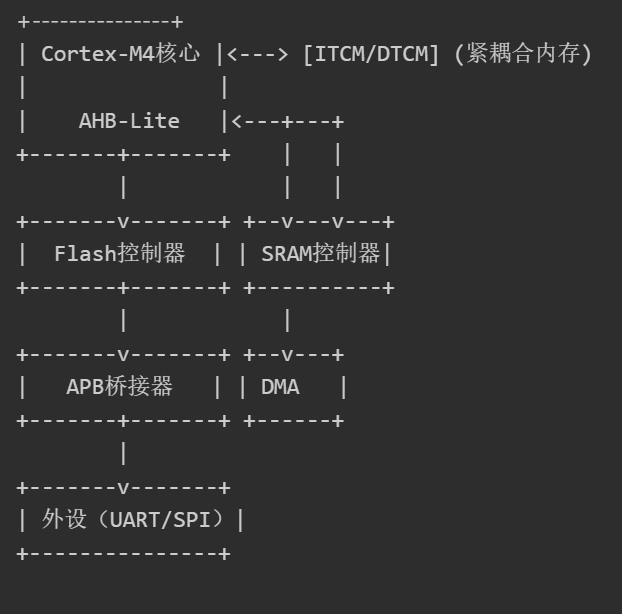

# 架构

## 8位单片机为什么RAM和ROM可以地址重叠复用?

8位单片机采用哈佛结构，数据和代码有两套地址空间，可以相同，访问操作时用MOV/MOVX区分

32位单片机（STM32）采用改进型哈佛，数据和代码隔离但可交互,统一了地址空间

```assembly
0x00000000~0x1FFFFFFF: Flash（代码）    		0x20000000~0x3FFFFFFF: RAM（数据）  
0x40000000~0x5FFFFFFF: 外设
```

## 低位处理器能处理高位数据吗？

8位单片机的8位是数据总线，是ALU单元运算一次的数据位数，也可以处理32，64位的数据，分多次很慢。32同理。

## 低位处理器能访问低位地址吗？

8位单片机的地址总线是16位，可以寻址64KB，所以可以访问处理0xFFFF这种地址，32同理

## 初见——ARM

指令集是一套规则，CPU处理数据的流程，方式等的规则

ARM是一套指令集架构，也是一家公司，专卖指令授权，不产芯片。

ST，Soc,Apple，三星等芯片公司购买指令授权，生产芯片,处理器

ARMV7，V8等是常用版本。操作系统寄存器方式不同，V7指令要通过CP15协处理器，麻烦；V8直接通过指令操作VBAR等

## CPU交互方式

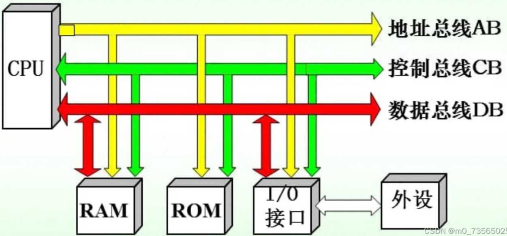

IO复用为下面的SPI,I2C等

### 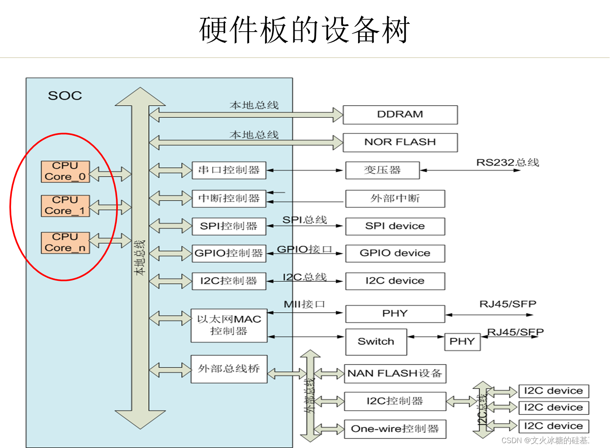


### 并行总线(本质)

首先明确一点，与CPU直接相连的是（并行总线）：数据线，地址线，控制总线(片选)。就像公共圆形轨道，CPU在核心

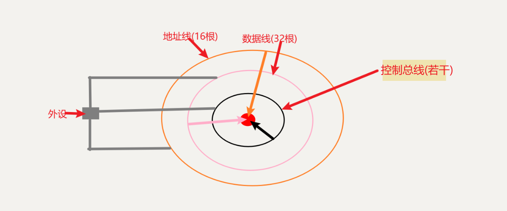

增加一个外设，就要从公共总线上拉挂相同数目的地址线和数据线；CS线，还要额外的两根读写线等控制总线

这种是最基本的方式，在ARM-CotexM架构下将3捆线绑在一起，叫做AHB和APB总线。

挂在总线上，CPU会分配地址，因此可以直接访问地址来控制

可以看见，每增加一个外设，都要加一堆线重新设计电路，表现为PCB板子上线路爆炸，从而引出了IO引脚复用


### 串行协议


这些片外外设不挂在总线上，而是通过引脚复用，用对应的协议来实现交互

对于LCD屏幕等片外外设（自身有寄存器），通过I2C协议实现CPU间接对寄存器的操作，LCD寄存器是单独的地址空间，通过iic函数来写入或读取

MCU只需要杜邦线接入几个引脚就行了，方便

引脚读取到数据之后还是交给总线

# 内存布局

这里的ROM在实际中是MCU里的FLASH，RAM是SRAM

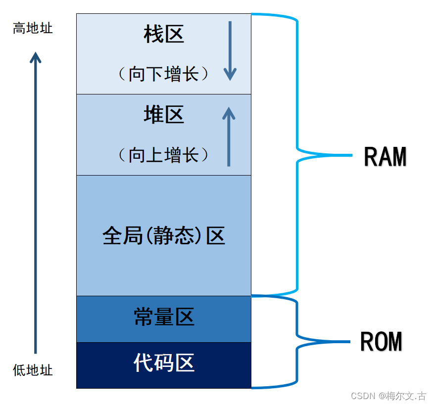


堆区是手动分配的，要手动释放


# 地址分配


1.启动时单片机是从0地址开始的，这里的0是根据BOOT引脚映射到FLASH或者其他放程序的地方的

2.核内外设区（Cortex-M Core Peripherals）

- **地址范围：** 0xE000 0000 - 0xFFFF FFFF
- **功能：** 管理 CPU 内核的心跳和中断。
- **详细解释：** 这里的寄存器是 **ARM 公司** 设计的，跟 ST（意法半导体）没关系。
- **举例：****SysTick（滴答定时器）**：你代码里 HAL_Delay 依赖的计时器就住在这里。**NVIC（中断控制器）**：管理所有外设中断的优先级和使能。**Debug 通讯 (ITM/SWD)**：你在线调试时数据是怎么回传的，也归这里的地址管。

# 寄存器映射

给很多寄存器起的别名


# 指针基础

***对一切变量的修改都是CPU通过总线访问内存地址，修改地址对应的值***

指针是个变量，变量就有对应的地址，指针变量比较特殊，它地址对应的的值是地址类型的

指针指向的值的是地址类型

指针对数据的操作为2种：

1.对指针指向的地址对应的值进行操作（取值*）

2.修改指针指向的地址（直接赋值 p=address）

p->a =1;是p对指向的地址区域  里面的变量a的地址   对应的值  赋1，也就是a=1;

# 时钟信号的产生

### **时钟信号是怎么产生的？**

**时钟信号**是一种周期性变化的方波信号，用于在计算机和电子系统中同步操作的时间基准。它主要由一些特殊的硬件电路产生，以下是其常见生成方法和背后的原理。

------

### **1. 常见的时钟信号产生方式**

#### **1.1 晶振（晶体振荡器）**

- 工作原理：
  - 晶振是最常见的时钟信号源，利用压电效应产生振荡信号。
  - 石英晶体在电压作用下会机械变形，断开电压后恢复原状。这个过程非常稳定且周期性。
  - 晶振的频率由石英晶体的尺寸和形状决定，通常非常精确。
- 输出：
  - 输出的是一个固定频率的方波或正弦波信号。
- 应用：
  - CPU、微控制器和其他高精度设备通常使用晶振作为时钟源。

#### **1.2 RC振荡器**

- 工作原理：
  - 利用电阻（R）和电容（C）的充放电特性形成振荡信号。
  - 电容通过电阻充电，当达到一定电压时，电路触发放电，然后再次充电。
- 特点：
  - 结构简单，成本低，但频率稳定性和精度较差。
- 应用：
  - 常用于低精度要求的场合，例如玩具电路或简单的定时应用。

#### **1.3 LC振荡器**

- 工作原理：
  - 利用电感（L）和电容（C）之间的谐振来产生振荡信号。
  - LC电路的频率取决于电感和电容的值： f=12πLCf = \frac{1}{2\pi \sqrt{LC}}
- 特点：
  - 适合产生高频信号，频率范围较大，但稳定性不如晶振。
- 应用：
  - 常用于无线电通信和射频电路。

#### **1.4 锁相环（PLL, Phase-Locked Loop）**

- 工作原理：
  - 锁相环是一种电路，用于生成高频率和可调的时钟信号。
  - 它将输入参考信号与内部产生的振荡信号相比较，然后通过反馈调整振荡器频率，使两者保持同步。
- 特点：
  - 可生成不同频率的时钟信号，常用于频率倍增或分频。
- 应用：
  - 现代CPU、通信系统和高速接口（如PCIe、USB）中。

#### **1.5 晶体振荡器与倍频电路结合**

- 工作原理：
  - 用一个低频晶体振荡器生成基础时钟信号，然后使用倍频电路（如PLL）将其放大到更高频率。
- 特点：
  - 提供高精度的高速时钟信号，同时保持低频晶振的稳定性。
- 应用：
  - 常用于需要超高频时钟的场景，比如CPU和显卡的核心频率。

------

### **2. 时钟信号生成电路的基本组成**

1. **振荡器：**生成基本的周期性信号（如晶体振荡器、RC振荡器等）。
2. **放大器：**增强振荡信号的强度。
3. **整形电路：**将信号整形为标准的方波，便于后续处理。
4. **分频器或倍频器：**调整信号频率以满足系统需求。
5. **缓冲器：**驱动时钟信号到多个模块，确保信号质量。

------

### **3. 时钟信号在计算机中的应用**

- **CPU时钟：**驱动处理器的操作，每个时钟周期执行一小步操作。
- **外设时钟：**为外围设备（如内存、I/O）提供同步信号。
- **通信接口：**确保数据发送和接收的同步。

------

### **4. 通俗比喻**

- **晶振**像一个稳定的鼓点手，提供均匀的节拍。
- **PLL**像一个变速器，可以将鼓点加速或减速以适应不同场合的需求。

------

### **5. 总结**

时钟信号通常由晶振或其他振荡器产生，经过倍频、分频和整形后，作为电子设备的时间基准，用于同步系统的操作。具体方法的选择取决于系统的精度需求、频率范围和成本约束。

# axf,hex,bin

### **通俗易懂解释：AXF、HEX 和 BIN 文件是什么？**

在嵌入式系统开发中，编译器生成的文件类型很多，其中 **AXF**、**HEX** 和 **BIN** 是常见的文件格式。每种文件都包含不同的信息，用于不同的目的。以下是通俗易懂的解释：

------

### **1. AXF 文件**

- **全称：** ARM Executable File（ARM 可执行文件）。
- **内容：** 包含了程序代码、调试信息和符号表。
- 作用：
  - 这是开发过程中使用的文件，主要用于调试。
  - 通过 AXF 文件，你可以在调试器中查看变量、设置断点、跟踪代码执行。
- 特点：
  - 文件结构复杂，包含了丰富的信息，不适合直接烧录到硬件中。
  - 主要在开发和测试阶段使用。

#### **通俗比喻：**

AXF 文件就像一本程序的**完整说明书**，不仅包含了代码，还附带详细的调试注释和结构说明，方便开发人员理解和改进程序。

------

### **2. HEX 文件**

- **全称：** Intel Hexadecimal Object File（英特尔十六进制文件）。
- 内容：
  - 以十六进制文本形式表示程序代码和地址信息。
  - 包含了代码在目标硬件中的存储地址，告诉硬件具体数据应该放在哪些内存区域。
- 作用：
  - HEX 文件是用来烧录到设备中的文件之一，适合嵌入式开发中用编程器或烧录工具加载到芯片中。
- 特点：
  - 文件是**文本格式**，包含地址、数据和校验信息。
  - 可读性比 BIN 文件强，但文件体积稍大。

#### **通俗比喻：**

HEX 文件就像一个**路线图**，明确告诉你每段数据应该存放在硬件的哪个位置。

------

### **3. BIN 文件**

- **全称：** Binary File（二进制文件）。
- 内容：
  - 最直接的代码映像，只有机器码，没有额外的信息。
  - 简单来说，它就是将程序代码转换成设备可以直接执行的形式。
- 作用：
  - BIN 文件适合直接烧录到硬件中，例如闪存或 EEPROM。
- 特点：
  - 文件是**二进制格式**，体积最小，效率最高。
  - 不包含调试信息，也不含地址信息，只有纯数据。
  - 通常需要通过烧录工具指定烧录地址。

#### **通俗比喻：**

BIN 文件就像一个**纯净版的歌曲文件**，不含歌词、专辑封面或说明，只有实际的音频数据，直接播放即可。

------

### **4. 三者的区别和用途总结**

| **文件类型** | **包含信息**             | **主要用途**                     | **文件格式**   |
| ------------ | ------------------------ | -------------------------------- | -------------- |
| **AXF**      | 代码、调试信息、符号表等 | 开发和调试阶段                   | 可执行文件格式 |
| **HEX**      | 地址和代码数据，校验信息 | 烧录到硬件，适合编程器或调试工具 | 文本格式       |
| **BIN**      | 纯代码数据               | 直接烧录到硬件，执行效率高       | 二进制格式     |

------

### **举例说明**

假设我们在开发一个简单的 LED 闪烁程序，最终的文件生成过程如下：

1. 编译器生成 **AXF 文件**，开发者可以用它调试程序。
2. 调试完成后，生成 **HEX 文件**，包含了代码和地址，可以用烧录工具将程序烧录到芯片中。
3. 如果设备需要直接加载执行，可以使用 **BIN 文件**，以二进制方式加载到硬件的特定地址。

------

### **总结**

- **AXF 文件：**开发者用来调试和理解程序的工具，包含调试相关的丰富信息。
- **HEX 文件：**适合通过烧录工具写入硬件，清楚描述了每段数据的位置。
- **BIN 文件：**最简洁的代码映像，直接用于硬件执行，但需要指定加载地址。

每种文件有不同的用途，它们共同服务于嵌入式系统的开发、调试和部署过程。

# 滴答

### **什么是滴答（Tick）？**

**滴答（Tick）** 是指计算机或嵌入式系统中，**系统时钟每次跳动或计时的一个基本单位**。它通常表示一个固定的时间间隔。这个时间间隔可能是微秒、毫秒或更短的时间，具体取决于系统的时钟频率。

### **1. 滴答的作用**

滴答通常用于控制系统的定时任务、调度任务以及产生精确的时间流逝。例如：

- 操作系统通过滴答来分配 CPU 时间给不同的进程（即时间片轮转调度）。
- 用于驱动实时任务，确保系统能够按照设定的节奏运行。

### **2. 滴答的来源**

滴答的频率通常由**系统时钟**或**定时器**提供，系统的时钟会按照固定的频率产生滴答信号。例如：

- 如果系统时钟的频率为 1 MHz（每秒百万次），那么每个滴答的时间间隔是 1 微秒。
- 在一些嵌入式系统中，滴答的频率可能是几十赫兹到几千赫兹。

### **3. 滴答的作用举例**

- **操作系统调度：**在操作系统中，滴答通常用来触发时钟中断，操作系统可以根据滴答来分配不同进程的运行时间。例如，每 10 毫秒触发一次滴答，中断会通知操作系统进行任务切换。
- **计时器：**一些设备或程序用滴答来跟踪时间。例如，数字时钟会根据滴答信号更新显示时间。

### **4. 滴答与看门狗的关系**

在一些嵌入式系统中，滴答与看门狗机制有关系：

- 看门狗定时器通常依赖滴答信号来倒计时。如果在规定的滴答时间内没有被“喂”给看门狗（即没有重置定时器），看门狗会认为系统发生了错误或死锁，进而触发复位。

------

### **通俗比喻**

滴答就像你家钟表的“滴答”声音，每一声都是时间的一个小步伐，标志着系统时间的流逝。系统通过这些“滴答”来安排各项任务，并确保一切按时执行。

# GPIO

每一个IO要先选择复用的功能才能用 

IO!=GPIO，GPIO是复用的功能

### **什么是 GPIO？**

**GPIO（General Purpose Input/Output）**，即**通用输入输出口**，是一种常见的硬件接口，用于微控制器（如单片机、嵌入式系统等）与外部设备之间进行数据交换。通过 GPIO 引脚，系统可以与外部的开关、传感器、LED、按钮等硬件设备进行交互。

### **1. GPIO的基本功能**

GPIO引脚有两种基本模式：

1. **输入模式（Input）**：
   - 当 GPIO 引脚设置为输入模式时，它可以接收外部设备的信号。
   - 常见的输入设备有传感器、按钮、开关等。
   - **输入功能举例**：按下按钮时，GPIO 会读取到按钮的状态（高电平或低电平）。
2. **输出模式（Output）**：
   - 当 GPIO 引脚设置为输出模式时，它可以向外部设备输出电信号。
   - 常见的输出设备有 LED、继电器、蜂鸣器等。
   - **输出功能举例**：控制 LED 的开关或点亮显示屏。
3. **双向模式（Bidirectional）**：
   - 在某些情况下，GPIO 引脚可以在输入和输出之间切换，用于特定的应用，比如数据传输。

------

### **2. GPIO 引脚的工作方式**

GPIO 引脚的电平可以是**高电平**（通常是 3.3V 或 5V）或**低电平**（通常是 0V）。根据工作模式，GPIO 引脚的功能如下：

- **输入模式**：
  - 当外部设备发送信号（如按键被按下）时，GPIO 引脚读取到的信号会是高电平或低电平。
  - 系统可以检测到这种信号变化，并执行相应的操作。
- **输出模式**：
  - 系统可以通过编程设置 GPIO 引脚为高电平或低电平，从而控制外部设备的开关状态。
  - 例如，当 GPIO 输出高电平时，LED 亮起；当输出低电平时，LED 熄灭。

------

### **3. GPIO 的应用**

GPIO 引脚可以广泛应用于各种场景：

- **控制 LED**：通过设置 GPIO 引脚为输出模式，可以控制 LED 的开关。例如，想点亮 LED，就将 GPIO 引脚设置为高电平。
- **读取按钮状态**：当外部按钮被按下时，GPIO 引脚处于高电平或低电平，系统可以通过输入模式读取这个信号来判断按钮是否被按下。
- **驱动继电器**：GPIO 可以用来控制继电器的开关，进而控制较高电流的设备，如电动机、灯泡等。
- **传感器数据采集**：例如使用 GPIO 引脚连接温度传感器或其他传感器，读取传感器的信号并处理。
- **串行通信**：通过多个 GPIO 引脚，嵌入式系统可以实现串行通信协议，如 UART、SPI 和 I2C。

------

### **4. GPIO 的高级功能**

现代的 GPIO 引脚不仅仅是简单的输入或输出，它们通常具有一些高级功能：

- **中断功能**：当 GPIO 引脚的电平变化时（如按钮按下或松开），可以触发系统的中断，从而响应外部事件，快速处理输入信号。
- **PWM（脉宽调制）输出**：某些 GPIO 引脚支持 PWM 输出功能，可以用来调节 LED 的亮度或电动机的速度。通过调整高电平和低电平的时间比例，可以精确控制设备。
- **模拟输入（某些GPIO支持）**：一些嵌入式平台的 GPIO 支持模拟输入功能，允许读取模拟信号（例如温度传感器的电压变化），并将其转换为数字值。

------

### **5. GPIO 引脚的限制和注意事项**

- **电流限制**：大多数 GPIO 引脚的输出电流是有限的，通常是几十毫安。为了避免损坏引脚，直接驱动高功率设备（如电动机）时需要额外的驱动电路（例如晶体管或继电器）。
- **电压限制**：不同的微控制器或平台，其 GPIO 引脚支持的电压范围不同（如 3.3V 或 5V）。在连接外部设备时，需要确保电压匹配，避免损坏硬件。
- **共享资源**：不同的外设可能会共享同一组 GPIO 引脚，因此在设计电路时，要合理安排和分配引脚。

------

### **6. 通俗比喻**

GPIO 就像是嵌入式系统的“手指”，它能通过“触摸”（读取输入信号）或者“发力”（输出信号）与外界互动。就像你按下开关来控制灯泡的开关，GPIO 也能通过控制电流的高低来控制外部硬件的行为。

------

### **7. 总结**

**GPIO（通用输入输出）** 是嵌入式系统中非常基础且重要的接口。它使得微控制器能够与外部设备进行互动，通过简单的输入输出信号控制硬件。GPIO 被广泛应用于控制 LED、读取传感器数据、与按钮交互、执行串行通信等任务，是嵌入式系统中不可或缺的一部分。

# 位带

### **什么是位带（Bit-Banding）？**

**位带（Bit-Banding）**是一种特殊的内存访问机制，通常用于某些嵌入式系统中（如 ARM Cortex-M 处理器系列），允许直接操作内存中单个位的内容，而无需先读取整个字（如字节或字）。通过位带，可以更加高效地进行单个位的设置、清除、反转或读取操作，而不需要读取和写入整个数据单元。

### **1. 位带的背景和用途**

在传统的内存操作中，你通常需要读写一个字（如字节或字），然后对其中的某个位进行操作。这意味着需要先读取整个字，然后修改其中的某一位，再将修改后的字写回内存。这个过程通常会涉及到额外的时间开销，尤其是对于嵌入式系统和实时系统而言，这种操作可能会导致性能下降。

位带技术的引入允许你直接访问内存中单个位的值，从而减少了这种开销。通过位带，可以直接通过特定的内存地址操作单个位的内容，而无需关心其他位。

### **2. 位带的工作原理**

位带的工作原理基于特殊的内存映射，它将某些内存区域映射为可以访问单个位的特殊区域。通过这一映射，您可以通过对某一特定地址的操作来直接改变内存中某一位的状态。

位带区域的映射规则通常如下：

- 位带映射区域通常以固定的内存地址段进行划分。
- 位带区域对应的每一个字节位置都会映射到一个单独的位（可以是该字节的任意一位）。
- 对映射地址的访问将直接影响目标位，而无需读取整个字节或字。

在 ARM Cortex-M 系列处理器中，通常使用两个内存区域来实现位带：

- **位带别名区域（Bit-Band Alias Region）**：这个区域允许你通过访问别名地址来操作内存中的单个位。
- **位带原始区域（Bit-Band Region）**：这个区域是实际的数据存储区域，存储了原始的内存数据。

### **3. 位带地址映射**

假设我们有一块内存区域，从 `0x20000000` 开始，这块内存区域映射到位带别名区域。

- 原始内存区域（`0x20000000` 到 `0x200FFFFF`）是存储数据的地方。
- 位带别名区域（`0x22000000` 到 `0x23FFFFFF`）是通过位带操作来直接修改某一位的区域。

具体的映射关系是：
 对于原始内存区域中的某一个地址 `addr`，如果你想通过位带别名区域操作其中的第 `bit` 位，你可以使用以下映射公式：

```
位带别名地址 = 基址 + (字节偏移 * 32) + (位偏移 * 4)
```

举个例子，假设要操作原始地址 `0x20000004` 的第 3 位（即内存中的第 3 位），对应的位带别名地址会是：

```
位带别名地址 = 0x22000000 + ((0x20000004 - 0x20000000) * 32) + (3 * 4)
              = 0x22000000 + (4 * 32) + (3 * 4)
              = 0x22000000 + 128 + 12
              = 0x22000080
```

这样，你可以通过访问 `0x22000080` 来直接设置或清除原始地址 `0x20000004` 中的第 3 位，而不需要处理其他位。

### **4. 位带的优势**

1. **高效性**：传统方法需要先读取整个字节或字，再操作某个位，最后再写回。而使用位带，你可以直接操作单个位，无需读取和写入整个字节或字，因此可以节省时间和计算资源。
2. **原子操作**：通过位带进行操作时，可以确保操作是原子的，这意味着你可以在中断或多任务环境下安全地修改某个位，不会被其他操作打断。
3. **简化代码**：通过位带，你可以更方便地对特定的硬件寄存器或内存位进行操作，代码更加简洁且不易出错。
4. **减少带宽消耗**：传统的读取/写入整个字节或字可能需要更多的总线带宽，而位带操作可以减少对内存总线的负载，尤其适用于资源有限的嵌入式系统。

### **5. 位带的应用场景**

- **硬件控制**：位带常用于控制外设的特定位。例如，GPIO 控制、状态寄存器的位操作、或者配置控制寄存器中的单个位。
- **开关和标志位控制**：在嵌入式系统中，很多设备的状态可以通过单个位来控制，位带能够高效地设置或清除这些位。
- **中断标志位**：对于中断控制器，位带技术可以高效地处理中断请求标志位。

### **6. 例子**

假设你有一个控制 LED 灯的寄存器，它的某一位用于打开或关闭 LED。假设寄存器地址是 `0x20000004`，LED 控制位是该寄存器的第 3 位。通过位带，你可以直接操作该位来控制 LED 的状态：

- 如果想打开 LED，设置该位为 1。
- 如果想关闭 LED，设置该位为 0。

### **7. 总结**

**位带（Bit-Banding）** 是一种可以直接操作内存中特定位的高效技术，广泛应用于 ARM Cortex-M 系列的嵌入式系统中。它通过特殊的内存映射，使得开发者可以直接访问并修改内存中单个位的状态，避免了对整个字的读取和写入，提供了高效、原子且简洁的控制方式。位带技术特别适用于硬件寄存器控制、状态标志位和高效的实时任务处理中。

# F103C8T6时钟配置

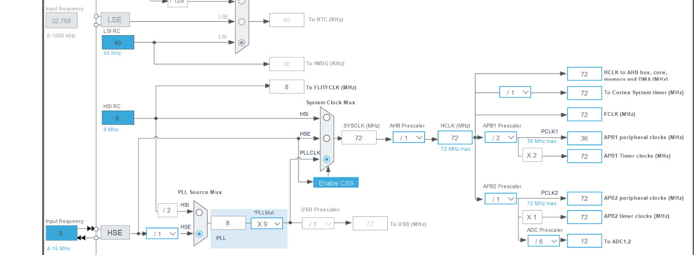

# F429IGT6时钟配置

选HSE

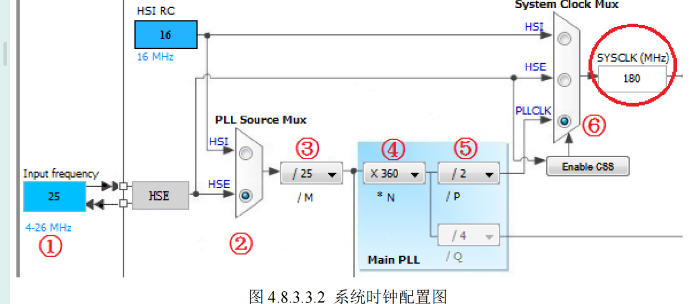


# GPIOF

`GPIOF` 是 STM32 系列单片机中一个 **GPIO（通用输入输出）端口** 的名字。在 STM32F4 这样的微控制器中，整个芯片拥有多个 GPIO 端口，每个端口由多个引脚（Pin）组成，供用户与外部硬件（如 LED、按钮、传感器、蜂鸣器等）进行交互。

### 1. **GPIO 端口的组成**

STM32F4 芯片的 GPIO 端口一般从 **A** 到 **I**（有些型号可能会有更多的端口），这些端口是微控制器中不同的 GPIO 组。例如：

- `GPIOA`：表示端口 A，包含多个引脚（如 PA0, PA1, ..., PA15）。
- `GPIOB`：表示端口 B，包含多个引脚（如 PB0, PB1, ..., PB15）。
- `GPIOF`：表示端口 F，包含多个引脚（如 PF0, PF1, ..., PF15）。

### 2. **GPIOF 的作用**

`GPIOF` 是 STM32F4 微控制器中的一个 GPIO 端口，它包含 **16 个引脚**，从 `PF0` 到 `PF15`。这些引脚可以被配置为不同的工作模式，具体用途取决于配置：

- **输入模式**：用来接收外部信号。
- **输出模式**：用来输出电信号（如控制 LED 或蜂鸣器）。
- **复用功能模式**：用来提供外部硬件接口（如 UART、SPI、I2C 等）。
- **模拟模式**：用于模拟信号处理。

### 3. **在代码中的具体含义**

在你给出的代码中，`GPIOF` 被用来表示 STM32F4 的 F 端口，具体是端口 F 上的第 8 引脚（`PF8`）。在 STM32 微控制器中，每个端口（如 `GPIOF`）都有多个引脚（从 0 到 15），你可以对这些引脚进行不同的配置，控制它们作为输入、输出，或执行其他功能。

例如，代码中的：

```c
#define BEEP PFout(8)
```

这表示定义了一个宏 `BEEP`，它对应于 `GPIOF` 的第 8 引脚，`PFout(8)` 是操作该引脚的宏，意味着我们可以用 `BEEP` 来控制 `PF8` 引脚的输出（例如控制蜂鸣器的开关）。

### 4. **GPIOF 的使用**

- **输入**：如果将某个引脚设置为输入模式，GPIOF 的引脚可以接收外部信号（如按键、传感器等），并将信号传送给微控制器进行处理。
- **输出**：如果将某个引脚设置为输出模式，GPIOF 的引脚可以用来输出电信号，控制外部设备。例如，可以控制 LED 灯、蜂鸣器、电机等。
- **复用功能**：GPIOF 端口的引脚也可以配置为复用功能（例如串口、I2C 总线、PWM 输出等）。
- **模拟**：一些引脚可以配置为模拟模式，接收模拟信号，如 ADC 输入等。

### 总结

`GPIOF` 是 STM32F4 系列芯片中的一个 **通用输入输出端口**，它包含多个引脚（如 `PF0`, `PF1`, ..., `PF15`）。通过配置这些引脚为不同的工作模式，微控制器可以与外部设备进行交互。在代码中，`GPIOF` 被用于控制 `PF8` 引脚（在本例中用于控制蜂鸣器的输出）。

# 复用

**GPIO 复用**（General Purpose Input/Output Multiplexing）是指在 STM32 微控制器中，某些 GPIO 引脚不仅可以作为普通的输入或输出引脚使用，还可以通过配置，作为其他外设的接口引脚，执行特定的功能。换句话说，**复用功能**使得 GPIO 引脚能在不同的外设之间共享资源，从而节省引脚数量，提高硬件的灵活性。

### 1. **GPIO 复用的基本概念**

STM32 微控制器的许多 GPIO 引脚可以配置为“复用模式”，即它们既能作为普通的输入输出引脚，也可以被配置为特定的外设接口，如：

- **串口（UART）通信**
- **I2C 总线**
- **SPI 总线**
- **PWM 输出**
- **模拟信号输入（ADC、DAC）**

这些引脚通常会标明哪些引脚具有复用功能，例如 `PA9`、`PA10` 在 STM32F4 中就可以作为 UART 的 TX 和 RX 引脚。

### 2. **复用的工作原理**

每个 GPIO 引脚通常有几种功能模式，其中包括：

- **输入模式（Input）**：用于读取外部信号。
- **输出模式（Output）**：用于输出电信号（比如控制 LED、蜂鸣器等）。
- **复用模式（Alternate Function）**：用于连接外设，如串口（UART）、I2C、SPI 等。
- **模拟模式（Analog）**：用于模拟信号处理，比如 ADC 输入或 DAC 输出。

### 3. **复用模式的选择**

STM32 微控制器中的每个 GPIO 引脚都具有一个特定的复用功能，通过 **配置寄存器** 可以设置每个引脚的功能。例如，在 STM32F4 中，某些引脚有多达 **四种复用功能**，具体功能由 `AF`（Alternate Function）寄存器中的配置位来选择。

### 4. **具体的复用功能示例**

- **串口（UART）复用**：
  - **`PA9`** 和 **`PA10`**：在 STM32F4 系列中，这两个引脚通常作为 UART1 的 TX（发送）和 RX（接收）引脚。当它们被设置为复用模式时，可以实现串口通信。
- **SPI 总线复用**：
  - **`PB3`** 和 **`PB4`**：这些引脚可以作为 SPI1 的 MISO（主输入从输出）和 MOSI（主输出从输入）引脚。通过复用，它们能够连接到外部设备，如 SPI 外设。
- **I2C 总线复用**：
  - **`PB6`** 和 **`PB7`**：这两个引脚可以配置为 I2C1 的 SCL（时钟线）和 SDA（数据线）。通过 I2C 协议，STM32 可以与其他 I2C 外设进行通信。
- **PWM 输出复用**：
  - **`PA8`**：这个引脚可以配置为输出 PWM 信号，控制外部电机的转速、亮度调节等。

### 5. **复用模式的配置**

在 STM32 中，通过修改 **GPIO 端口的配置寄存器** 来设置引脚的复用功能。具体步骤如下：

1. **选择正确的复用功能**：根据数据手册或者参考手册，确定你要将引脚配置为哪个外设接口。
2. **配置 GPIO 引脚的工作模式**：通过控制寄存器设置引脚为复用模式（`GPIO_Mode_AF`）。
3. **选择复用功能**：在对应的复用功能寄存器中设置引脚的复用功能编号（如 `AF0`, `AF1`, `AF2`, `AF3` 等）。

例如，假设你希望配置 `PA9` 为 UART1 的 TX 引脚，步骤如下：

- 设置 `PA9` 为复用模式（`GPIO_Mode_AF`）。
- 在 `AF` 寄存器中将 `PA9` 设置为 UART1 的 TX 引脚。

### 6. **GPIO 复用的优势**

- **节省引脚资源**：通过复用引脚，多个外设可以共享同一引脚，从而减少了对芯片引脚数量的需求。
- **提高灵活性**：可以根据不同的外设需求配置引脚的功能，使得硬件设计更加灵活。
- **优化 PCB 设计**：可以减少连接外设的线数，使得 PCB 布局更紧凑。

### 7. **注意事项**

- 在配置 GPIO 为复用模式时，需要确保其他使用该引脚的功能不会发生冲突。
- 在复用模式下，通常不能再将该引脚用于普通的输入/输出操作。

### 总结

**GPIO 复用**是 STM32 微控制器的一项强大功能，它允许多个外设通过相同的引脚进行连接，从而节省引脚资源，提高硬件设计的灵活性。通过合理配置 GPIO 引脚，可以使同一个引脚承担不同的任务，如串口通信、SPI 总线、PWM 输出等，极大地丰富了系统的功能。

是的，**JTAG/SWD** 接口不仅可以用于**下载程序**，还可以用于**调试程序**。这两个功能的结合是 JTAG/SWD 的一大优势，尤其在嵌入式开发中，非常方便。

#  JTAG/SWD下载

------

### **1. 什么是 JTAG/SWD？**

- **JTAG**：全称 Joint Test Action Group，是一种标准调试接口，支持多信号线，常用于复杂的嵌入式系统。
- **SWD**：全称 Serial Wire Debug，是 ARM 公司推出的简化版 JTAG，只需要两条主要信号线（`SWDIO` 和 `SWCLK`），适合资源受限的嵌入式设备（如 STM32）。

这两种接口可以通过调试器（如 J-Link、ST-Link）连接开发板，实现对设备的**调试**和**程序下载**功能。

------

### **2. 调试和下载的区别与结合**

#### **下载功能**

- 将编译好的程序代码通过 JTAG/SWD 接口直接写入目标设备的 Flash 存储器。
- 下载后，设备可以独立运行新程序。

#### **调试功能**

- 通过 JTAG/SWD，开发者可以实时与目标设备交互，进行以下操作：
  - 设置断点：程序运行到某行代码暂停，方便检查。
  - 单步执行：逐行执行代码，观察变量变化。
  - 查看和修改寄存器、内存状态。
  - 实时调试异常或逻辑错误。

#### **结合使用**

- JTAG/SWD 接口在下载程序时，先将程序写入设备 Flash，随后无需重新连接，可以直接启动调试功能。这种**无缝切换**极大提高了开发效率。

------

### **3. JTAG/SWD 调试下载的优势**

1. **多功能一体**：
   - 一个接口同时支持下载和调试功能，减少硬件和软件的切换时间。
2. **实时调试**：
   - 可以直接查看程序运行中的状态，不需要打印日志，效率更高。
3. **精确定位问题**：
   - 支持设置断点和观察变量值，快速定位代码问题。
4. **硬件层面支持**：
   - 可以调试硬件问题，如中断异常、寄存器配置错误等。

------

### **4. 示例：STM32 的 JTAG/SWD 下载和调试**

#### **硬件配置**

1. 使用 ST-Link 调试器，将其与 STM32 开发板连接。
   - **SWCLK**：时钟信号线。
   - **SWDIO**：数据信号线。
   - **GND** 和 **VCC**：电源和地线。
2. 确保 STM32 的调试引脚功能未被其他外设占用。

#### **软件配置**

1. 使用 Keil 或 STM32CubeIDE，设置调试工具为 ST-Link。
2. 编写程序后，点击“下载”（Download）按钮将程序写入 Flash。
3. 切换到“调试模式”（Debug），开始实时调试程序。

------

### **5. 总结**

JTAG/SWD 是一种功能强大的接口，结合了**程序下载**和**调试**两大功能。它不仅可以快速将程序写入设备，还能实时调试程序运行过程，非常适合嵌入式开发中需要频繁测试和优化的场景。通过 JTAG/SWD，开发者可以快速定位问题并验证解决方案，极大提高开发效率。

当程序被写入嵌入式设备的非易失性存储器（如 Flash）后，即使设备断电，程序也不会丢失。要清除设备上的程序，可以通过以下方式实现：

# 擦除

------

### **1. 使用调试工具清除**

#### **方法**

通过调试工具（如 J-Link、ST-Link）连接设备，使用开发环境中的“擦除 Flash”功能来清除存储器内容。

#### **步骤**

1. 连接调试器（例如 ST-Link）到设备。
2. 打开开发工具（如 Keil、STM32CubeIDE、IAR 等）。
3. 找到“擦除 Flash”或类似选项。
4. 执行操作，清空设备 Flash 中的内容。

#### **结果**

设备中的程序会被完全擦除，Flash 恢复到初始状态。

------

### **2. 写入一个空程序**

#### **方法**

将一个简单的空程序（通常是一个只执行死循环的代码或占位符代码）写入设备，覆盖原有程序。

#### **示例代码**

```c
int main(void)
{
    while (1)
    {
        // 空程序，什么也不做
    }
}
```

#### **结果**

原有程序被覆盖，设备重新上电后将运行新写入的空程序。

------

### **3. 使用设备的引导模式**

一些嵌入式设备支持进入特殊的“引导模式”（Boot Mode），可以通过此模式跳过运行现有程序，并提供工具清除 Flash。

#### **方法**

1. 根据设备手册，设置引导引脚（如 BOOT0/BOOT1）。
2. 重启设备进入引导模式。
3. 使用专用工具（如 STM32CubeProgrammer）连接设备。
4. 擦除或重写 Flash。

#### **结果**

程序被清除或覆盖，设备恢复为初始状态。

------

### **4. 通过自定义固件清除**

#### **方法**

在某些应用场景中，可以编写一个程序，主动擦除设备自身的 Flash 内容。嵌入式设备通常提供 Flash 擦写的相关 API。

#### **示例代码**

以下代码以 STM32 为例，清除特定区域的 Flash：

```c
#include "stm32f4xx_hal.h"

void Clear_Flash(void)
{
    FLASH_EraseInitTypeDef EraseInitStruct;
    uint32_t PageError;

    HAL_FLASH_Unlock();

    EraseInitStruct.TypeErase = FLASH_TYPEERASE_SECTORS;
    EraseInitStruct.Sector = FLASH_SECTOR_1; // 指定要擦除的扇区
    EraseInitStruct.NbSectors = 1;
    EraseInitStruct.VoltageRange = FLASH_VOLTAGE_RANGE_3;

    HAL_FLASHEx_Erase(&EraseInitStruct, &PageError);

    HAL_FLASH_Lock();
}
```

#### **注意**

使用此方法前需要确保不会影响程序运行的稳定性。

------

### **5. 使用特定命令清除**

一些嵌入式设备支持特定的清除命令，可以通过串口或其他通信接口发送命令，指示设备擦除自身存储器。

#### **示例**

- 对于一些芯片，可以通过 `Bootloader` 提供的串口命令（如 `Erase Memory`）实现 Flash 清空。

------

### **6. 重新写入其他程序**

如果不需要完整清除原程序，可以直接写入新的程序，覆盖原有内容。这种方式简单快捷，是开发中最常用的方法。

------

### **注意事项**

1. **保护区：** 某些设备的 Flash 可能有保护区，必须先解除保护才能擦除。
2. **谨慎操作：** 擦除或覆盖 Flash 是不可逆的，确认后再执行操作。
3. **设备手册：** 不同芯片的操作方式可能不同，应参考具体芯片的用户手册或开发文档。

------

### **总结**

清除设备上写入的程序通常通过调试工具、写入空程序、引导模式等方式实现。在开发中，最常用的方式是通过调试工具执行“擦除 Flash”操作或直接覆盖写入新的程序。

# GPIO输入输出模式

**GPIO**（通用输入输出，General Purpose Input/Output）是嵌入式系统中非常重要的一种引脚，可以用来连接外部设备，实现**输入**和**输出**的功能。根据不同的应用场景，GPIO 可以配置为不同的状态，比如输入浮空、输入上拉、输入下拉、推挽输出、开漏输出等。

下面通俗易懂地解释这些模式及其作用：

------

### **1. GPIO 输入模式**

GPIO 配置为**输入**时，用于接收外部信号（例如按键、传感器的信号）。

#### **1.1 输入浮空模式（Floating Input）**

- **特点**：引脚不接任何电阻，完全悬空。
- **作用**：引脚直接读取外部输入信号，电平状态完全由外部电路决定。
- **问题**：当引脚没有外部电路接入时，电平会不稳定，容易受到干扰，出现“飘来飘去”的状态。
- **应用场景**：少用，通常需要外部电路提供电平。

> **举例**：按键输入，外部电路需要连接一个上拉或下拉电阻来稳定电平。

------

#### **1.2 输入上拉模式（Pull-up Input）**

- **特点**：引脚内部连接一个**上拉电阻**到高电平（VCC）。
- **作用**：当外部电路没有信号时，引脚会默认读取高电平。
- **稳定性**：避免引脚悬空，增加稳定性。
- **应用场景**：按键输入、信号检测，外部电路接低电平时引脚状态会变为低电平。

> **举例**：按下按键时，电平被拉低；松开按键时，电平自动拉高。

------

#### **1.3 输入下拉模式（Pull-down Input）**

- **特点**：引脚内部连接一个**下拉电阻**到低电平（GND）。
- **作用**：当外部电路没有信号时，引脚会默认读取低电平。
- **稳定性**：避免引脚悬空，增加稳定性。
- **应用场景**：按键输入、信号检测，外部电路接高电平时引脚状态会变为高电平。

> **举例**：按下按键时，电平被拉高；松开按键时，电平自动拉低。

------

### **2. GPIO 输出模式**

GPIO 配置为**输出**时，用于向外部设备输出信号（比如点亮 LED、控制蜂鸣器等）。

#### **2.1 推挽输出（Push-Pull Output）**

- 特点

  ：

  - 引脚可以输出**高电平**和**低电平**。
  - 内部由两个晶体管控制（一个输出高电平，一个输出低电平）。

- **作用**：能够直接驱动外部设备，比如 LED、继电器。

- **优点**：输出能力强，电平稳定。

- **应用场景**：常用于驱动设备，如 LED 指示灯、蜂鸣器等。

> **举例**：输出高电平时 LED 点亮，输出低电平时 LED 熄灭。

------

#### **2.2 开漏输出（Open-Drain Output）**

- 特点

  ：

  - 引脚只有**低电平输出**能力，高电平需要外部电阻上拉。
  - 内部只有一个晶体管，接地时输出低电平；释放时，需要外部电路将电平拉高。

- **作用**：适用于连接多个设备，实现“线与”（AND）逻辑。

- **优点**：可以方便地与不同电压的设备通信，支持多设备共用一根线。

- 应用场景

  ：

  - I2C 通信（开漏+上拉电阻）。
  - 多个设备共用一个引脚的场景。

> **举例**：开漏模式连接一个上拉电阻，当引脚输出低电平时，LED 点亮；释放时通过上拉电阻拉高电平。

------

### **3. GPIO 复用模式**

GPIO 也可以配置为**复用功能**，用于连接内部外设，比如串口、I2C、SPI、定时器等。

#### **复用推挽输出**

- **特点**：引脚复用为外设功能，并采用推挽输出方式。
- **应用**：用于串口、SPI 等需要稳定电平输出的通信接口。

#### **复用开漏输出**

- **特点**：引脚复用为外设功能，并采用开漏输出方式。
- **应用**：用于 I2C 总线通信，外部需要上拉电阻。

------

### **总结：各种模式的区别和应用**

| 模式         | 方向      | 特点                             | 应用场景                     |
| ------------ | --------- | -------------------------------- | ---------------------------- |
| 输入浮空     | 输入      | 引脚悬空，受外部信号控制         | 按键输入，需外部电路稳定     |
| 输入上拉     | 输入      | 内部上拉电阻，默认高电平         | 按键输入（接地时拉低电平）   |
| 输入下拉     | 输入      | 内部下拉电阻，默认低电平         | 按键输入（接高时拉高电平）   |
| 推挽输出     | 输出      | 高、低电平直接输出，驱动能力强   | 控制 LED、蜂鸣器             |
| 开漏输出     | 输出      | 只能输出低电平，高电平需上拉电阻 | I2C 通信、与不同电压设备连接 |
| 复用推挽输出 | 输出/复用 | 复用功能，推挽方式输出           | SPI、串口等通信              |
| 复用开漏输出 | 输出/复用 | 复用功能，开漏方式输出           | I2C 等通信                   |

------

### **通俗总结：如何选择？**

- **按键输入**：一般使用**输入上拉**或**输入下拉**，避免引脚悬空。

- **驱动 LED 或蜂鸣器**：使用**推挽输出**，直接输出高/低电平。

- 通信接口

  ：

  - **I2C**：使用**开漏输出**（加上拉电阻）。
  - **SPI/串口**：使用**复用推挽输出**。

- **多设备共用线**：选择**开漏输出**模式，外部加上拉电阻。

这样，根据应用场景选择合适的 GPIO 配置，既能保证电路稳定，又能高效实现功能。

# GPIO寄存器

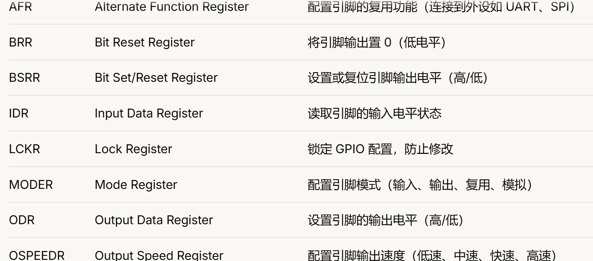

# MOS管

### **MOS管的通俗解释及工作原理**

MOS管（**金属氧化物半导体场效应晶体管**）是一个电子开关器件，通过**电压**来控制电流的流通。它常被用来控制电路中的灯、马达、蜂鸣器等设备，也在各种电子产品中扮演核心角色。

------

### **1. MOS管的结构**

MOS管有三个引脚：

- **栅极 (G，Gate)**：像“开关按钮”，用来控制开关的状态。
- **源极 (S，Source)**：像水管中的水源，电流流出的地方。
- **漏极 (D，Drain)**：像水管的出口，电流流入出的地方。

栅极与源极、漏极之间有一个**绝缘层**（氧化层），使得栅极几乎不消耗电流。

------

### **2. MOS管的基本原理**

MOS管的工作原理可以类比为**水龙头控制水流**：

1. **栅极电压控制导通**：
   - 栅极就像水龙头的开关。
   - 当给栅极加上合适的电压，MOS管内部会“打开”，形成通道，电流可以从**漏极**流到**源极**。
   - 如果栅极电压没有达到要求，MOS管就会“关闭”，电流无法流通。
2. **N沟道 MOS管的例子**（最常见）：
   - 栅极电压 **高**（例如 3.3V、5V）：MOS管**导通**，电流流过，设备工作。
   - 栅极电压 **低**（0V）：MOS管**关断**，电流被阻断，设备停止。
3. **P沟道 MOS管的例子**：
   - 栅极电压 **低**：MOS管**导通**，电流流过。
   - 栅极电压 **高**：MOS管**关断**，电流被阻断。

------

### **3. 通俗的“开关”比喻**

想象你要控制一盏灯：

- **MOS管像一个电控开关**，你不需要用手去开关灯，而是通过“控制电压”来开关灯。

- 栅极电压 = 控制信号

  。

  - 如果你在栅极加电压（比如 5V），MOS管导通，电流流通，灯就亮了。
  - 如果栅极没有电压（比如 0V），MOS管关断，灯就熄灭了。

------

### **4. MOS管的优点**

- **功耗低**：栅极控制电压时，几乎不消耗电流。
- **速度快**：可以快速开关，非常适合高频电路。
- **电压控制**：不像普通三极管需要电流，MOS管通过电压轻松控制。

------

### **5. 工作原理总结**

- N沟道 MOS管

  （最常见）：

  - **栅极加高电压 → 导通 → 电流通过 → 设备工作。**
  - **栅极加低电压 → 关断 → 电流阻断 → 设备停止。**

- P沟道 MOS管

  ：

  - **栅极加低电压 → 导通**
  - **栅极加高电压 → 关断**

------

### **6. 生活中的应用**

- 控制 **LED 灯**：用单片机给 MOS管栅极加电压控制灯的亮灭。
- **充电器**：MOS管用来快速开关控制电流流通。
- **电动车电机控制**：MOS管控制电机的启停和调速。
- **电脑 CPU、内存**：MOS管是核心器件，控制高速数据传输。

------

### **总结**

MOS管就像一个“电压控制的开关”，通过给栅极加电压来控制电流的通断。

- 给栅极一个合适的电压 → 开关打开 → 电流流通 → 设备工作。
- 不给电压或电压不足 → 开关关闭 → 电流被阻断 → 设备停止。

这样简单地通过电压就能控制各种电路和设备的开关状态，非常方便又高效。

# 位或

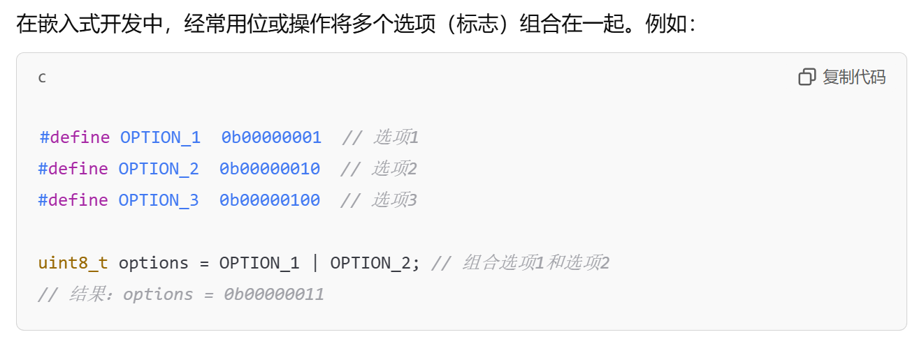

# 项目文件浅说明

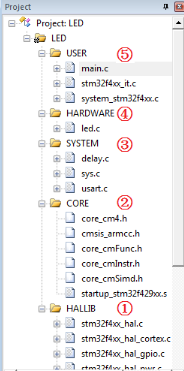

① 组HALLIB下面存放的是**ST官方提供的HAL库文件**，每一个源文件stm32f4xx_hal_ppp.c

都对应一个头文件 stm32f4xx_hal_ppp.h。分组内的**源文件我们可以根据工程需要添加和删除。**

这里对于跑马灯实验，我们需要添加 11 个源文件。

② 组 **CORE** 下面存放的是**固件库必须的核心头文件和启动文件**。这里面的**文件用户不需要**

**修改**。大家可以根据自己的**芯片型号选择对应的启动文件**。

③ 组 **SYSTEM** 是 ALIENTEK 提供的**共用代码**，这些代码在第五章都有详细讲解。

④ 组 **HARDWARE** 下面存放的是每个**实验的外设驱动代码**，他的实现是通过调用 HALLIB 

下面的 HAL 库文件函数实现的，比如 led.c 中函数调用 stm32f4xx_hal_gpio.c 内定义的函数对 led

进行初始化，这里面的函数是讲解的重点。后面的实验中可以看到会引入多个源文件。

⑤ 组 **USER** 下面存放的主要是**用户代码**。但是 system_stm32f4xx.c 文件用户不需要修改，

同时 stm32f4xx_it.c 里面存放的是中断服务函数，这两个文件的作用在 3.3 节有讲解。main.c 函

数主要存放的是主函数了。

# 项目运行前置

## USE_HAL_DRIVER,STM32F429xx

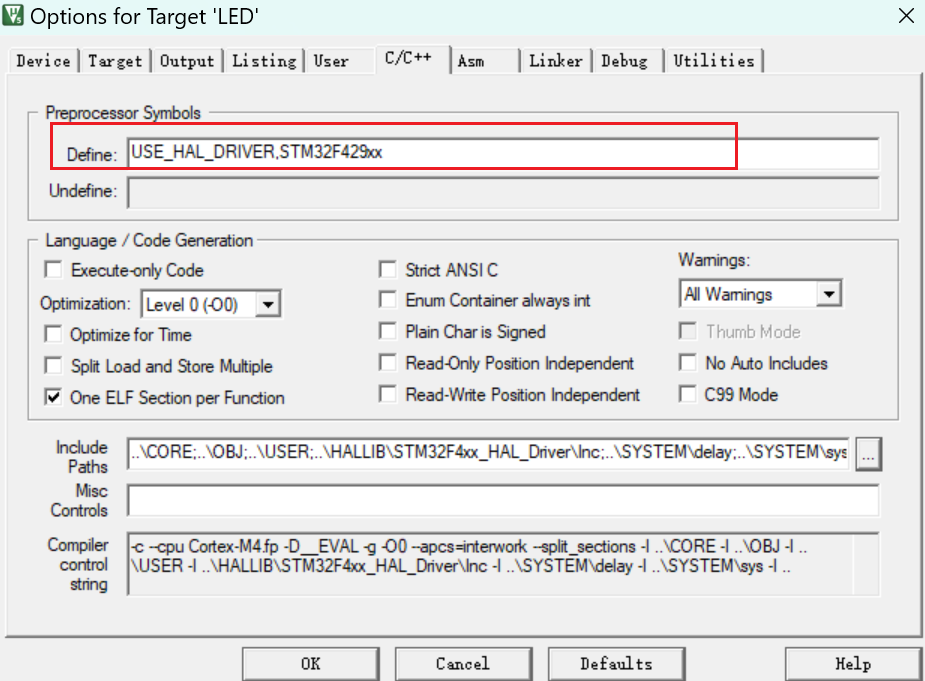

来对于 STM32F429 系列的工程，还需要添加全局宏定义标识符，所谓全局宏定义标识符，就是在工程中任何地方都可见

## 包含头文件

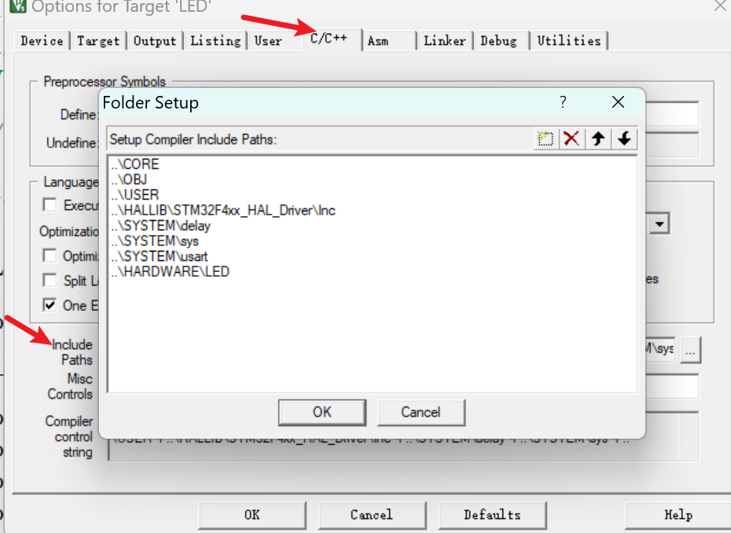

这里大家需要注意，这里**添加的路径必须添加到头文件所在目录的最后一级**。比如在 SYSTEM

文件夹下面有三个子文件夹下面都有.h 头文件，这些头文件在工程中都需要使用到，所以我们

必须将这三个子目录都包含进来。这里我们需要添加的头文件路径包括：\CORE， \USER\，

\SYSTEM\delay ，\SYSTEM\usart，SYSTEM\sys 以及\HALLIB\Inc。这里还需要提醒大家，HAL

库存放头文件子目录是**\HALLIB\Inc**，不是 **HALLIB\Src**，其次很多朋友都是这里弄错导致报

很多奇怪的错误。

# 点灯实验

## 步骤

1.初始化HAL库

2.设置时钟

3.开启时钟

4.配置GPIO参数

5.初始化GPIO

6.调用HAL库往引脚写入信号

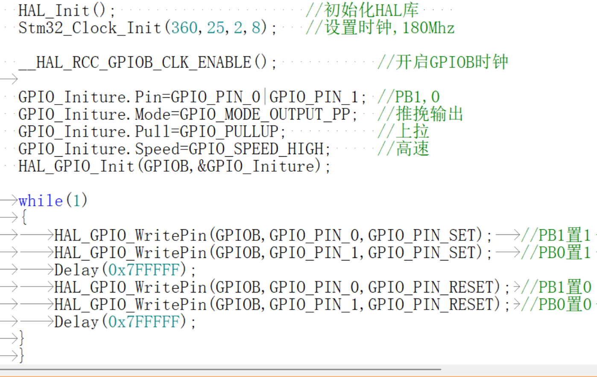

## 编译结果

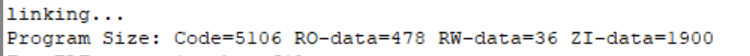

Code：表示程序所占用 FLASH 的大小（FLASH）。

RO-data：即 Read Only-data，表示程序定义的常量（FLASH）。

RW-data：即 Read Write-data，表示已被初始化的变量（SRAM）

ZI-data：即 Zero Init-data，表示未被初始化的变量(SRAM)

有了这个就可以知道你当前使用的 flash 和 sram 大小了，所以，一定要注意的是程序的大小不是.hex 文件的大小，而是编译后的 Code和 RO-data 之和

# 按键输入实验

## 按键介绍

物理按键是一个机械开关，按下时两端短接，松开时断开

## 疑难

前置：按键的高/低电平有效是指被按下后的电平状态

例子：

**松开时为低电平（默认状态）**。

**按下时为高电平（有效状态）**。

解释：

以KEY_UP为例，当按键松开时，按键两端断开，电路不连通，PA0 引脚被拉到低电平（0），保持稳定；当按键按下时，按键两端短接，电路连通，PA0 引脚直接连接到 VCC，变为高电平（1）。KEY_UP采用下拉电阻。

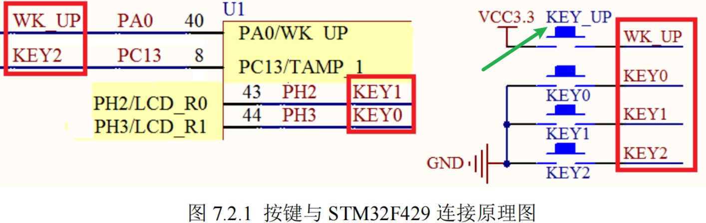

问题：为什么要用下拉电阻？

当按键未被按下时，按键两端断开，电路不连通，此时PA0会受到KEY_UP电位变化的影响（比如如果KEY_UP此时是高电平，则PA0也是高电平；KEY_UP此时是低电平，则PA0也是低电平）。

如果采用浮空输入，那么电平可能是0也可能是1，最有可能是0-1之间的电平，PA0收到的电平不稳定，不采用。

如果采用上拉输入，此时默认电平为1，则PA0收到的也是1，没问题；但是当按键被按下时，按键两端短接，电路连通，KEY_UP会产生低电平，电源会产生高电平，此时相当于PA0直接接到电源上（因为引脚在接收到按键的低电平后，后续始终会收到电源的高电平），收到的是1，按与没按没区别，不采用

如果采用下拉输入，此时默认电平是0，则PA0收到的也是0；当按键被按下时，按键两端短接，电路连通，KEY_UP会产生高电平，电源会也产生高电平，则PA0收到的是1。没按是0，按了是1，采用。

KEY0 ,KEY1,KEY2同理

总结：接了电源时，按下按键，引脚收到的信号和电源一样，所以在没按下按键时默认电平要选择和电源信号不一样的，从而选择是上拉还是下拉

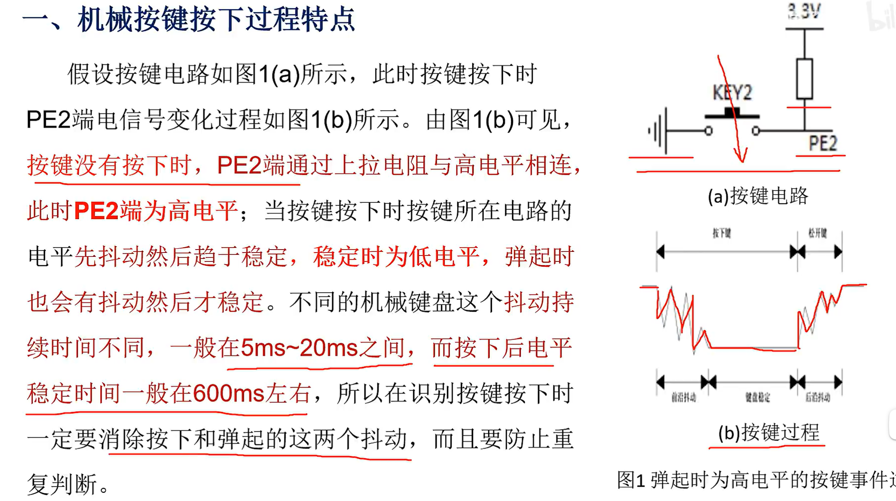

## 代码分析

```
u8 KEY_Scan(u8 mode)
{
    static u8 key_up=1;     //按键松开标志
    if(mode==1)key_up=1;    //支持连按
    if(key_up&&(KEY0==0||KEY1==0||KEY2==0||WK_UP==1))
    {
        delay_ms(10);
        key_up=0;
        if(KEY0==0)       return KEY0_PRES;
        else if(KEY1==0)  return KEY1_PRES;
        else if(KEY2==0)  return KEY2_PRES;
        else if(WK_UP==1) return WKUP_PRES;          
    }else if(KEY0==1&&KEY1==1&&KEY2==1&&WK_UP==0)key_up=1;
    return 0;   //无按键按下
}
```

static u8 key_up=1; 语句并不是函数的一部分，因为静态变量和全局变量在程序调入内存是就已经就位了。运行函数是static u8 key_up=1; 看起来是跳过了。key_up的存储类是空连接的静态。
函数中 static u8 key_up=1; 定义后，当KET_Scan运行结束后，key_up并不消失，而是保留了赋予的0值，函数下一次运行时仍旧是执行0值


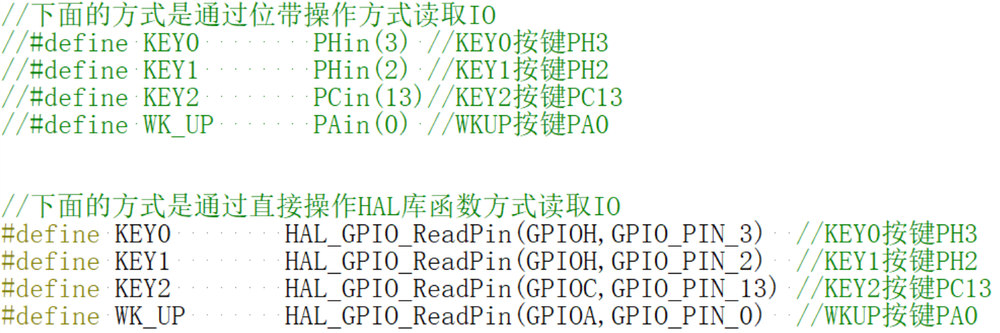

使用读取函数获取按键信息，并用宏定义增加可读性

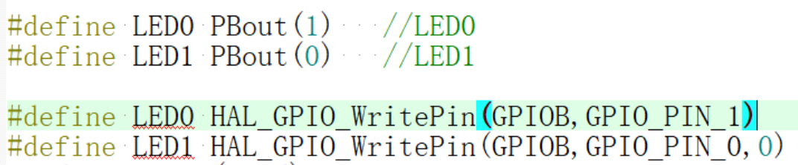

但是获取输出的函数不能直接换成HAL库,因为有个设置参数,这里只是想要获得状态


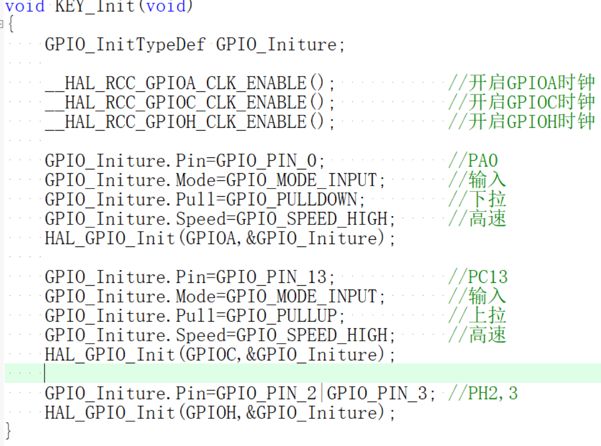

PH2，3省略是因为GPIO配置除了引脚都和上面一样，只需改引脚然后直接套用上面的，可用CubuMX生成

# 串口通信实验

## 波特率

在串行通信中，**波特率**（Baud Rate）是指每秒钟传输的位数（bits），即数据传输的速度，单位为 bps（bits per second）。

波特率的设置直接影响通信的效率和可靠性。

常见的标准波特率包括 2400、4800、9600、19200、38400、57600 和 115200 bps 等。

在进行串口通信时，通信双方必须设置相同的波特率，以确保数据能够正确传输和接收。

如果波特率设置不一致，可能导致数据传输错误或通信失败。

因此，选择合适的波特率并确保通信双方一致，是实现可靠串口通信的关键。

此外，波特率的选择还应考虑传输介质的特性和应用需求。

较高的波特率可以提高数据传输速度，但可能增加传输错误的风险；较低的波特率虽然传输速度较慢，但在噪声较大的环境中可能更稳定。

因此，在实际应用中，需要根据具体情况选择合适的波特率。

在 STM32 等微控制器中，波特率的设置通常通过配置 UART（通用异步收发传输器）的相关寄存器来实现。

开发者可以根据系统时钟频率和所需的波特率，计算并设置相应的寄存器值，以实现所需的通信速率。

总之，波特率的设置是串口通信中至关重要的环节，直接影响数据传输的速度和可靠性。

在实际应用中，应根据系统要求和环境条件，选择并配置合适的波特率，以确保通信的有效性和稳定性。

UART:通用异步

USART:通用同步异步

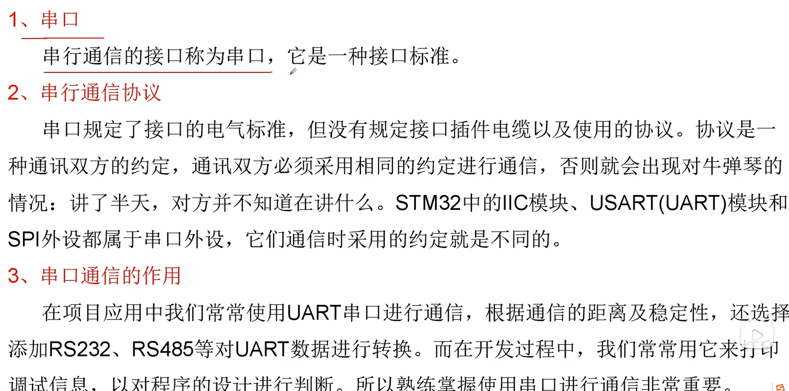

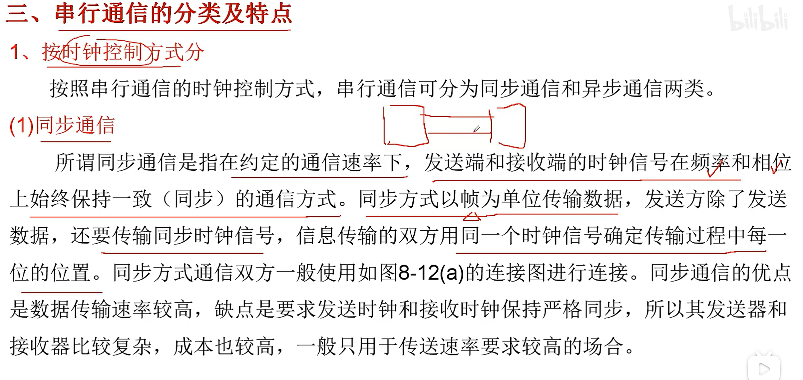

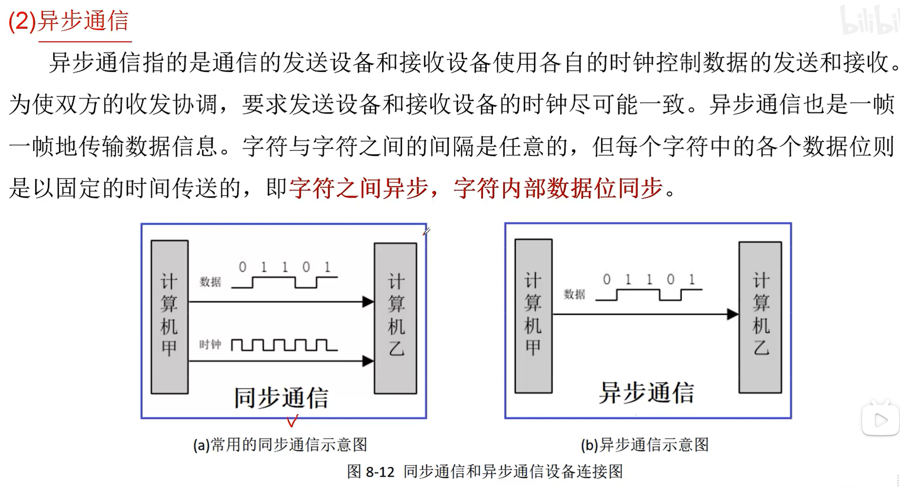

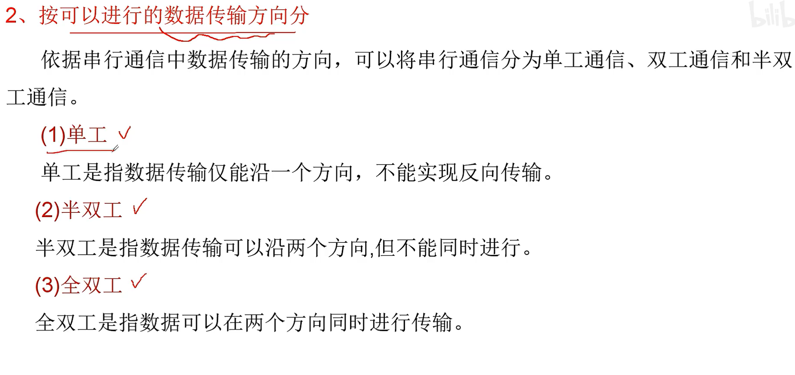

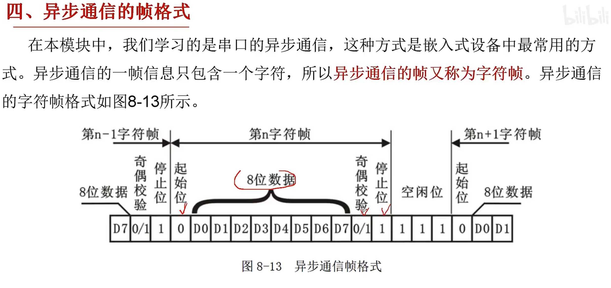

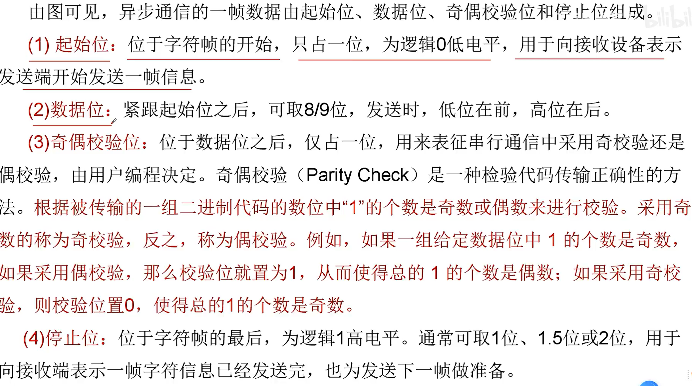

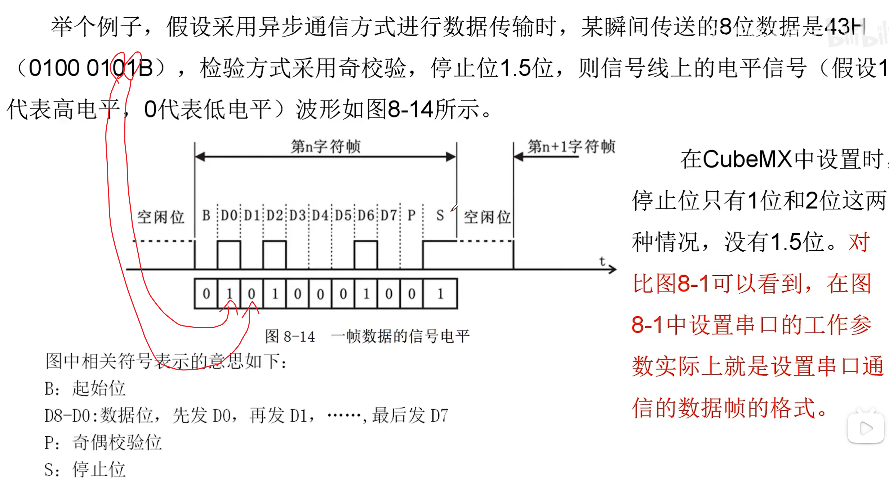

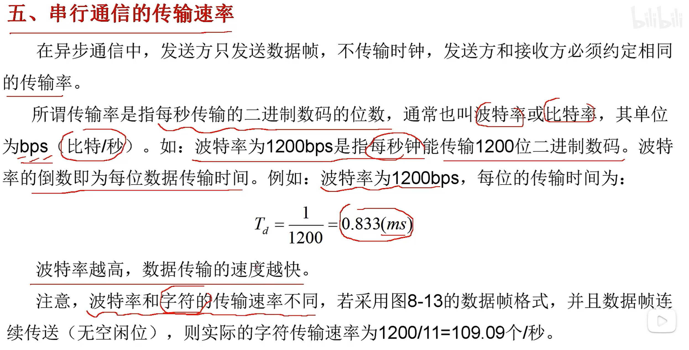

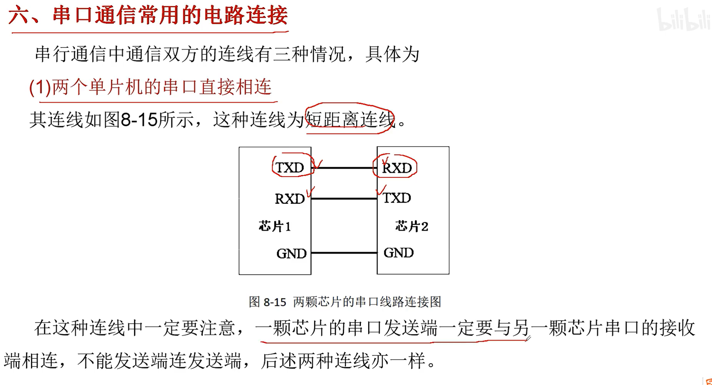

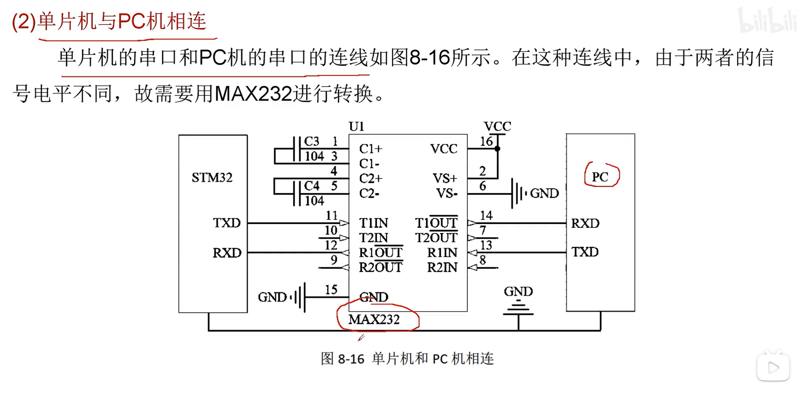

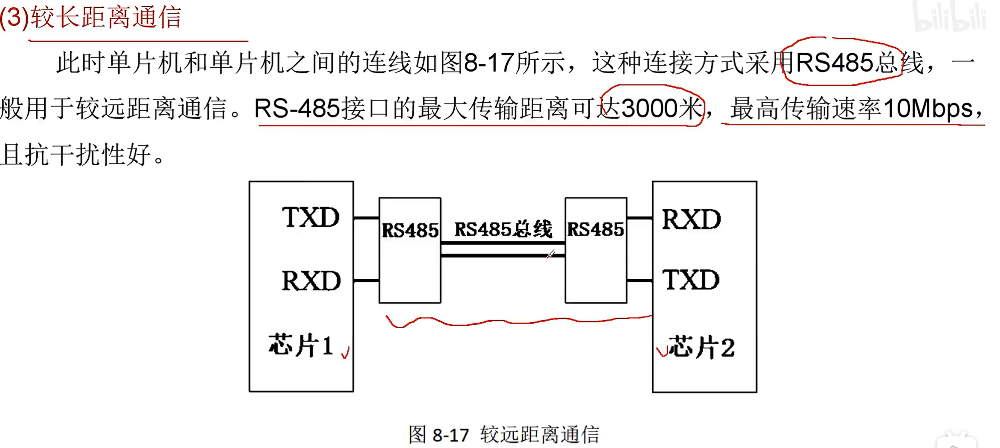

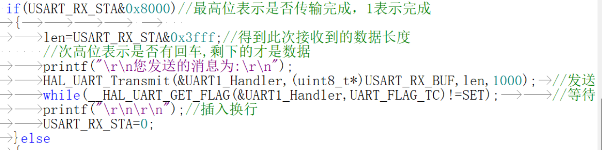

单片机接受的数据存储在缓冲中，通过调用Transmit函数将数据发送给电脑

TC:Transmit complete

传输完成才置SET


## HAL_UART_Transmit_IT和HAL_UART_Transmit

| **特性**       | **HAL_UART_Transmit**  | **HAL_UART_Transmit_IT** |
| -------------- | ---------------------- | ------------------------ |
| **发送模式**   | 阻塞模式               | 非阻塞模式               |
| **实时性**     | 较低                   | 较高                     |
| **效率**       | 较低                   | 较高                     |
| **实现复杂度** | 简单                   | 需要中断和回调支持       |
| **适用场景**   | 小数据量、低实时性任务 | 大数据量或实时性任务     |

HAL_UART_Transmit_IT传输完成之后可以重写回调函数

# 电路基础

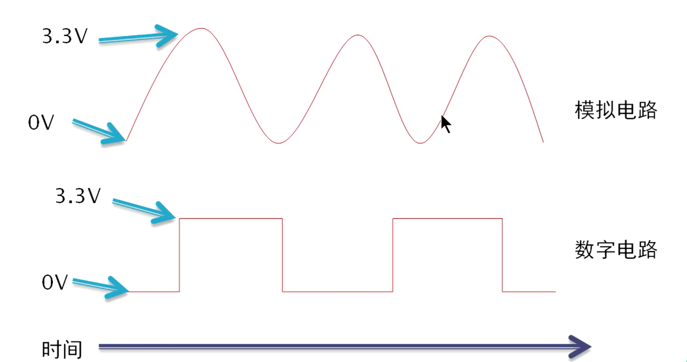

突变与连续

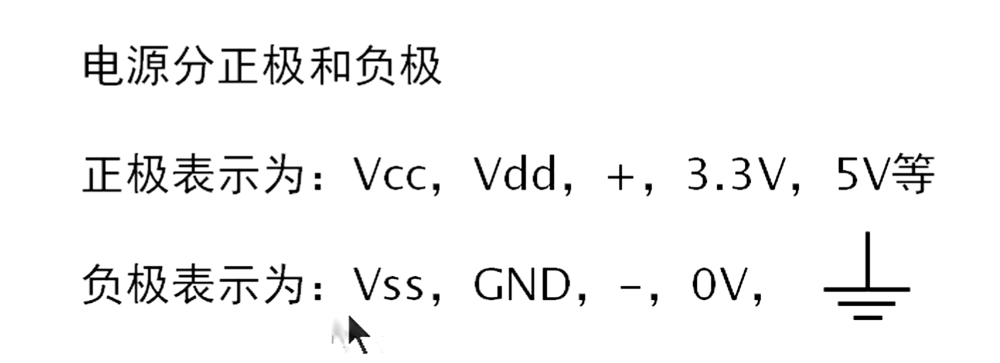

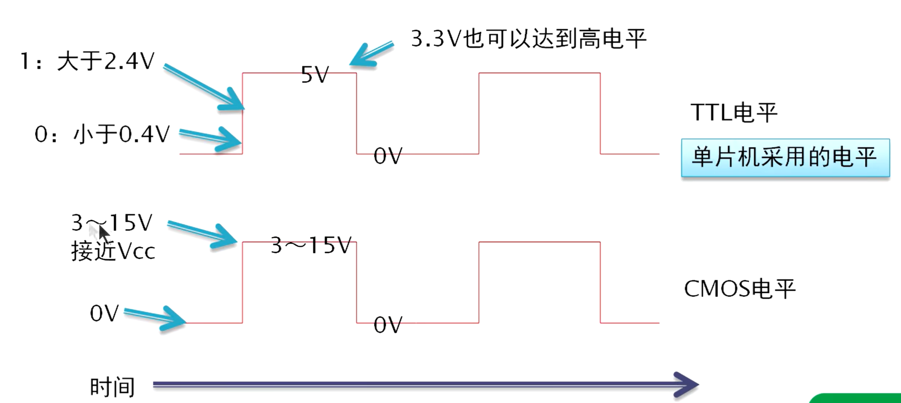

不同芯片判定电平0/1有区别，单片机接3.3V

## 电平协议

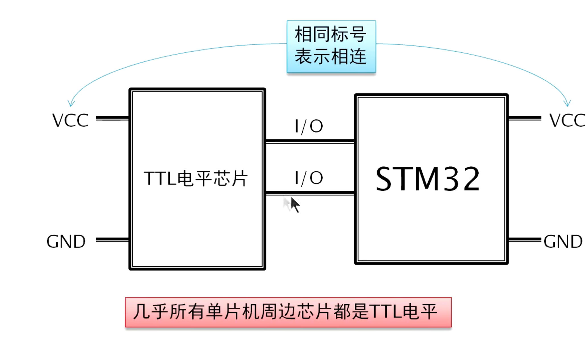

**STM32 电平**：单端，0V 到 3.3V/5V，逻辑 1 为高电平。

**RS232 电平**：单端，±3V 到 ±15V，逻辑 1 为负电平。

**RS485 电平**：差分，A-B 电压差 ±0.2V 以上，逻辑 1 为 A>B。

**核心区别**：STM32 用 TTL 电平，直接输出；RS232/RS485 用不同电平标准，需转换芯片才能与 STM32 通信。

## 上下拉电阻原理

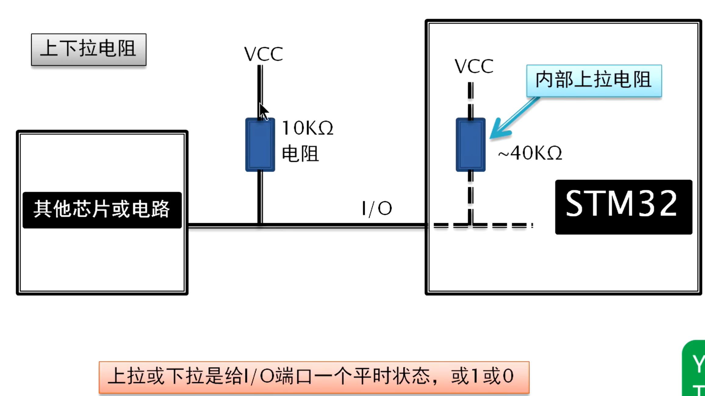

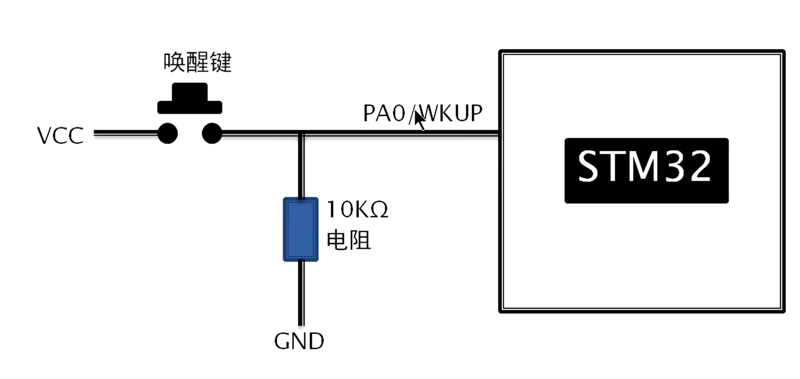

按键没按下I/O端口为一个很弱的低电平

按下了就被短接覆盖成高电平

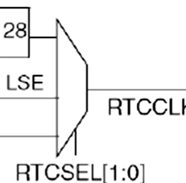

梯形表示选择

单片机中除了ARM内核以外的功能都叫做外设

# 复用

GPIO（通用输入输出口，General Purpose Input/Output）是微控制器（如STM32）中与外界设备通信的引脚，可以用来输入信号或输出信号。默认情况下，这些引脚是独立的，由程序直接控制其高低电平。

例如：

- 输入模式：检测一个按键是否按下（0 或 1）。
- 输出模式：点亮或关闭一个LED灯。

复用功能（Alternate Function）意味着这个引脚不仅仅是一个普通的GPIO引脚，它可以切换为某些外设的专用信号接口。

比如：

- STM32的某些引脚可以用于UART通信（串口），那么这个引脚就需要作为UART的发送或接收引脚工作，而不是普通GPIO。
- 用于SPI通信时，引脚可能需要作为数据时钟、数据输入或输出。

# RCC（Reset and Clock Control）

在STM32微控制器中，配置RCC（Reset and Clock Control）是为了设置和管理时钟系统，但配置时钟系统本身是为了满足特定的性能需求和优化系统性能

RCC用来管理时钟系统

# .uvprojx和.mxproject

• 功能差异：`.uvprojx`文件专注于 Keil IDE 的项目管理和编译调试，而`.mxproject`文件用于保存 CubeMX 的配置，以便后续生成或更新项目代码.

• 使用场景：在使用 STM32CubeMX 生成项目代码时，通常会同时生成`.mxproject`文件和`.uvprojx`文件，以便在 CubeMX 和 Keil IDE 中分别管理和开发项目。

问：在用XCOM时,用CH340还是STLink和MCU通信？CH340

STLink用来下载和调试，CH340用来供电和串口通信，当然也可以用来下载和调式（用FlyMcu)

# STM32的CPU（轮询外设）

在嵌入式系统（如 STM32）中，主函数通常会包含一个 **`while(1)`** 无限循环，原因是嵌入式系统的设计理念与传统桌面系统有所不同。主函数中的无限循环是嵌入式程序结构的一部分，以下是一些原因：

### 1. **嵌入式系统没有操作系统（或使用简化的操作系统）**

- 在很多嵌入式系统中，尤其是没有操作系统或使用轻量级操作系统的情况下，CPU 一直在执行一个主循环，处理各种任务。这种设计方式被称为 **单任务** 或 **轮询式**。在这种结构下，主函数中的无限循环保持程序持续运行，并不断执行任务。

例如，代码可能会定期检查外设状态或执行某些控制操作，而这些任务需要不断地被轮询和执行。

```c
int main(void) {
    // 初始化硬件和外设
    while(1) {
        // 执行主控制逻辑或轮询外设
        if (some_condition) {
            // 处理外设或执行某些任务
        }
    }
}
```

### 2. **系统的长期运行**

- 嵌入式系统通常需要长时间稳定运行。例如，在一个控制系统中，设备可能需要一直运行，直到被断电或重启。
- 无限循环保证了程序在系统启动后不会自动退出，始终保持系统的活跃状态，执行各种必要的任务，如数据采集、通信、状态监测等。

### 3. **处理外设和事件**

- 嵌入式系统中的外设（如传感器、显示器、通信接口等）通常需要不断被监控和控制。主函数中的 `while(1)` 无限循环确保 CPU 不断地检查和响应这些外设。
- 在没有操作系统的情况下，主循环用于处理定时任务、轮询外设和执行其他控制逻辑。

```c
while(1) {
    // 轮询外设
    if (USART_GetFlagStatus(USART1, USART_FLAG_RXNE) != RESET) {
        uint8_t data = USART_ReceiveData(USART1);
        // 处理接收到的数据
    }
}
```

### 4. **实现定时器和延时控制**

- 在没有操作系统的情况下，程序通过主循环控制定时器和延时。这通常依赖计时器中断或者软件延时来执行周期性任务。
- 无限循环可以确保这些定时任务得到持续执行，并且控制程序能够按照设定的时序进行。

### 总结：

在嵌入式系统的代码中，`while(1)` 无限循环是为了确保程序能够持续运行，并且不断处理外设、响应事件以及执行控制任务。它是嵌入式系统中的一种常见结构，特别是在没有操作系统的情况下。通过这个循环，系统可以持续监控外设、执行定时任务和处理中断，而不会主动退出或停止运行。


# **中断机制（非轮询方式）**

- **中断**是一种机制，允许外部事件（如硬件设备、系统错误或用户输入）打断正在执行的程序。中断请求会导致 CPU 暂停当前执行的任务，转而处理中断服务程序（Interrupt Service Routine，ISR）。
- 开启外设中断后，CPU 并不会一直“轮询”硬件设备，而是依赖硬件中断来高效响应设备的需求。例如，当外部设备（如硬盘、网络卡等）准备好数据时，它会发送中断信号给 CPU，通知 CPU 进行处理。CPU 会在完成当前任务后，优先处理这些中断请求。
- 这种方式避免了轮询带来的无效资源浪费，提高了系统效率。


# 竞争与冒险

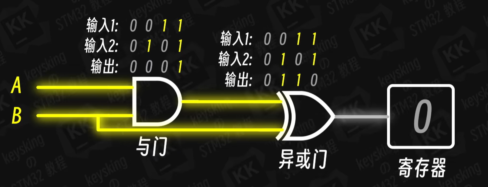

比如都先输入1，结果是0；B变为1，B有两个路线，一个经过与门到异或门，一个直接到，信号传播几乎是光速，尽管宏观看是同时，微观因为经过与门有差异，所以由0->1->0.有多余的信号产生，为了避免，使用边沿触发器

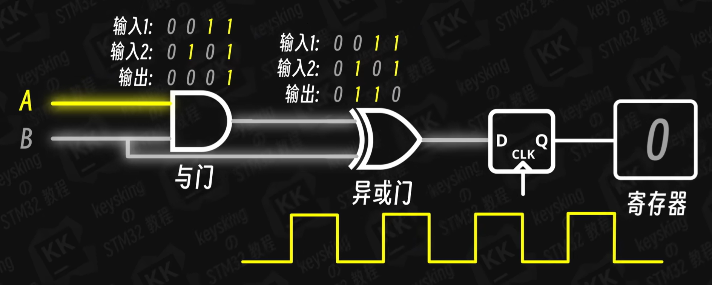

只有时钟信号到了才接受数据到寄存器里，等同于从原来的一直接受信号到现在的每隔很长时间才瞬间接受一次，避免了接收到不稳定的信号

# cubeMX逆天默认设置

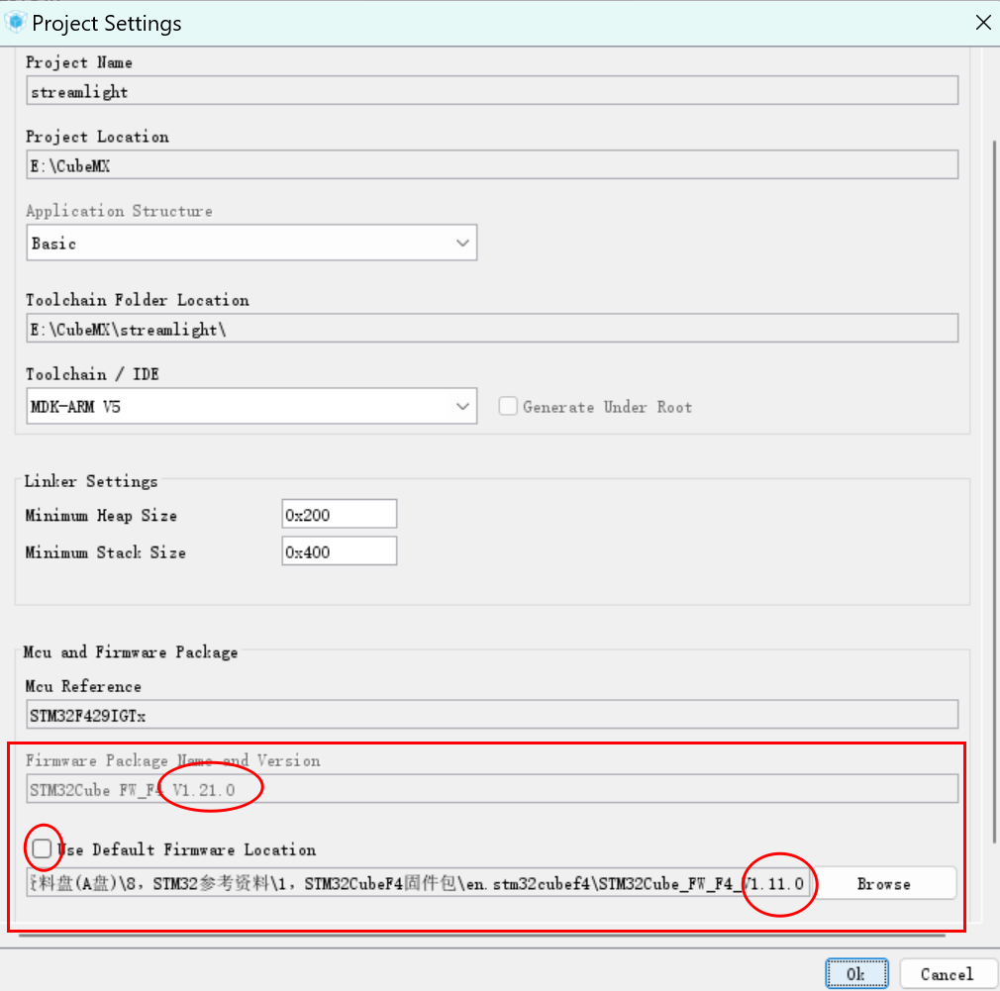

把默认地址取消掉，不然生成不了工程文件，真他妈傻逼

# 位运算理解

按位与1 位返回自己，按位与0 位返回0

按位或1 位返回1，按位或0位返回自己


# IRQHandler()函数

检测中断源，处理中断标志位（清除），调用回调函数

没有IRQ的要手动清楚中断标志位

# 深入SysTick计数器和HAL_Delay

SysTick —系统定时器是属于 CM3 内核中的一个外设，内嵌在 NVIC 中。系统定时器是一个 24bit 的向下递减的计数器，计数器每计数一次的时间为 1/SYSCLK，一般我们设置系统时钟 SYSCLK 等于 72M。当重装载数值寄存器的值递减到 0 的时候，系统定时器就产生一次中断，以此循环往复，uwTick加一

因为 SysTick 是属于 CM3 内核的外设，所以所有基于 CM3 内核的单片机都具有这个系统定时器，使得软件在 CM3 单片机中可以很容易的移植。系统定时器一般用于操作系统，用于产生时基，维持操作系统的心跳。

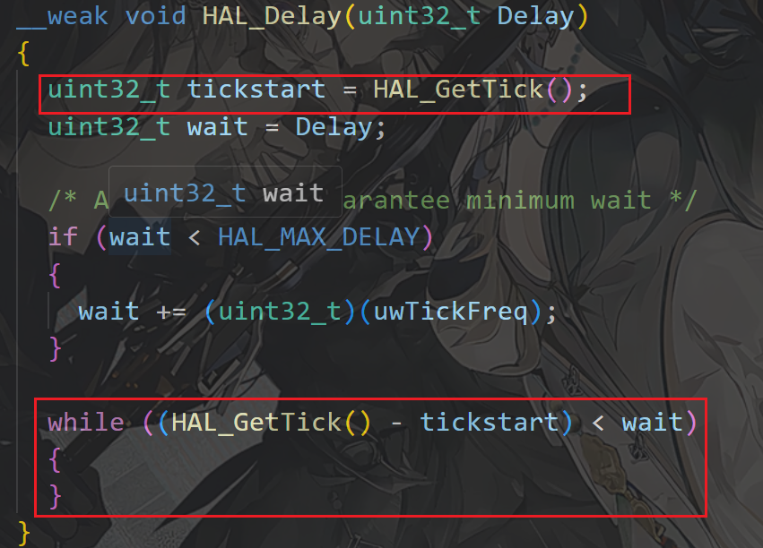

HAL_GetTick()返回的是uwTick,调用HAL_Delay()函数本质上是sysTick中断

所以在中断回调中要避免用HAL_Delay()这个阻塞延时，一旦sysTick的抢占优先级不够高，在中断回调函数中CPU就不会中断处理uwTick———–>HAL_GetTick()返回的uwTick都是一样的,轮询条件一直为真，导致阻塞

# NVIC(中断向量表)


抢占优先级和响应优先级
STM32 的中断向量具有两个属性，一个为抢占属性，另一个为响应属性，
其**属性编号越小，表明它的优先级别越高**。
抢占，是指打断其它中断的属性，即因为具有这个属性，会出现嵌套中断
(在执行中断服务函数 A 的过程中被中断 B 打断，执行完中断服务函数 B 再继续
执行中断服务函数 A)，抢占属性由 NVIC_IRQChannelPreemptionPriority 的参
数配置。
而响应属性则应用在抢占属性相同的情况下，当两个中断向量的抢占优先
级相同时，如果两个中断同时到达，则先处理响应优先级高的中断，响应属性
由 NVIC_IRQChannelSubPriority 的参数配置。
例如，现在有三个中断向量：
中断向量  抢占优先级  响应优先级
A  0  0
B  1  0
C  1  1
若内核正在执行 C 的中断服务函数，则它能被抢占优先级更高的中断 A 打
断，由于 B 和 C 的抢占优先级相同，所以 C 不能被 B 打断。但如果 B 和 C 中断
是同时到达的，内核就会首先响应响应优先级别更高的 B 中断

------------------------------------------------

​                      

# 外部中断实验

## 中断控制线

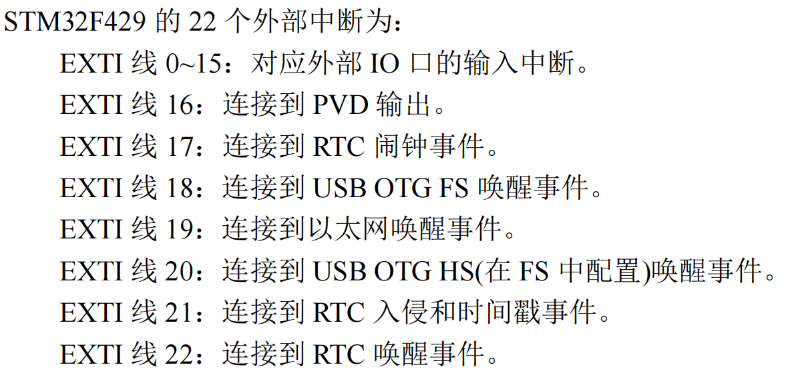

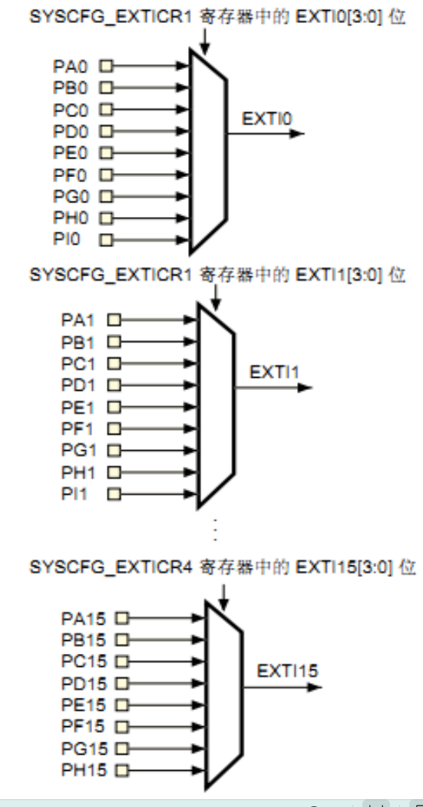

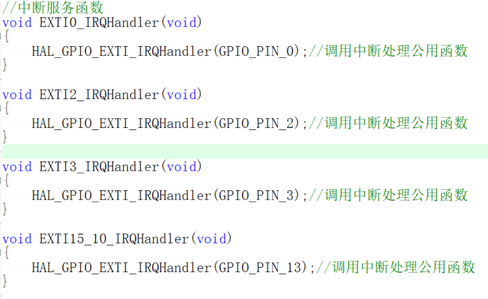

每次发生外部中断时就会调用相应的IRQ（中断请求）函数，然后通过HAL库的中断函数，调用回调函数。

自定义逻辑写在回调函数里，自带的中断等逻辑写在HAL库的中断函数里

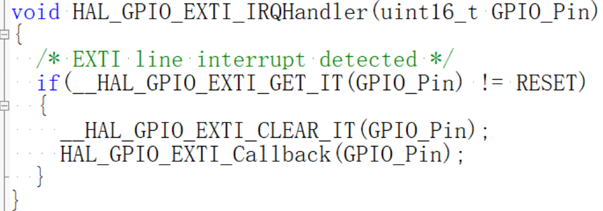

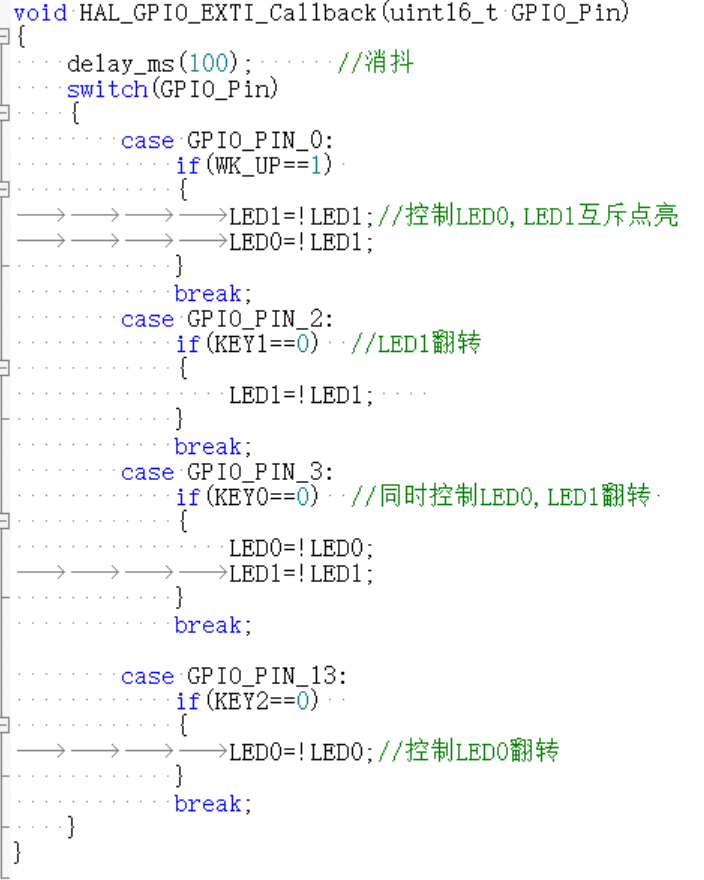

比写按键扫描函数来控制LED灯容易实现

注意：GPIO中断模式配置时，要选择具体怎么触发。这里按键按下（除WK_UP)电平由上拉电阻带来的高电平转化为低电平，所以选择下降沿触发。否则，按下后基本没反应，就算有那也只是抖动带来的**毛刺**

# 定时器（定时发送中断）

## 定时器数目和功能


## 如何实现定时

定时就是记数，方波信号来临时，寄存器值加一；100HZ->1S 寄存器存100

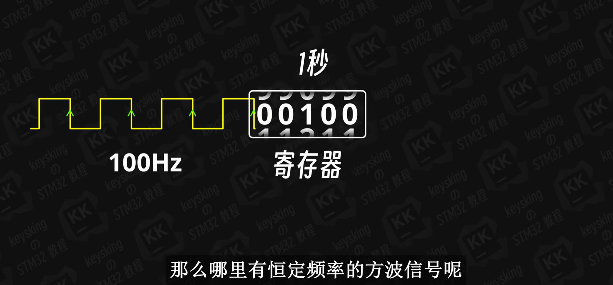

如何实现置0

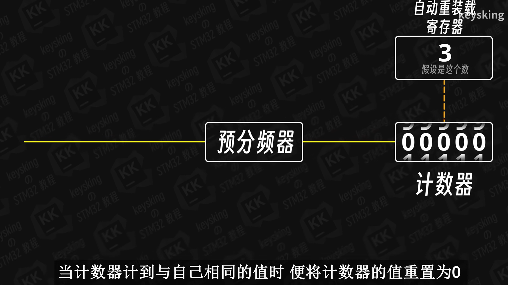

重置计时会触发中断，在回调函数里面可以自动义中断内容

## 影子寄存器

手动设置预分频值重装值时，设置的值要在下一个周期开始时才会生效

宏定义函数比较偏底层，直接对寄存器进行操作，开头为两个下划线并且全是大写

## 实验注意

使用定时器记得要用一个可以开启定时器中断计数的函数


如果后面不加杠it的话，就只有计数没有中断作用。

调用函数之后找到时间终止的回调函数,代表定时器达到时限之后可以发生中断做点什么


达到时间后闪灯

为什么UART1可以传送数据到串口,其他的都不能呢?(UART2,UART6,UART3)

# 定时器从模式

## 复位模式

只有基本的定时重装中断，从模式控制器用外部时钟模式1


从模式：通过接入外部时钟来发生中断（光电传感器等），需要另一个时钟源

内部时钟只能简单计数，外部时钟可以有更多的功能


定时器自带自动重装载寄存器，达到值后产生中断

采用复位模式，收到信号会产生中断，重置计数器

这两种都会在状态寄存器里将对应的中断标志位置1，表明中断已经发生，并且会调用同一个中断回调函数


## 门模式


根据电平高低来控制门的开关

门开计数器可以进行计数，门关计数器不能进行计数

下降沿为例，直到遇见上升沿才继续计数


外部信号触发门模式生效时不能触发外部中断（不能改变更新中断标志位），但是可以使得触发中断标志位置1

定时器从模式3种都会改变触发器中断标志位，

## 触发模式

上/下边沿会启动定时器，但不能终止，常与单脉冲配合。

单脉冲：复位一次之后不会自动计数

## 总结


# 输入捕获模式

## 输入捕获

TI是输入通道

每个TIM有多个TI


一个TI能设置为上升沿或下降沿触发捕获，不能设置为双边沿捕获

所以

计算高电平时间：将TI2设置为下降沿触发，和TI1的寄存器值相减


## 总结


# 输出比较模式（PWN）

数字信号来模拟模拟信号


## 输出比较


输出比较模式类型


以下是 STM32 定时器的 **输出比较模式** 类型及其功能说明，以表格形式列出：

| **输出比较模式**                       | **描述**                                                     | **应用场景**                                         |
| -------------------------------------- | ------------------------------------------------------------ | ---------------------------------------------------- |
| **OCMode: TIM_OCMODE_TIMING**          | 定时模式：输出比较触发时，什么都不做，仅用于定时。           | 单纯的时间比较，不需要控制外部引脚。                 |
| **OCMode: TIM_OCMODE_ACTIVE**          | 激活模式：当计数器与比较寄存器匹配时，将输出引脚设置为高电平。 | 控制外设状态为“激活”（例如开始充电、开关切换）。     |
| **OCMode: TIM_OCMODE_INACTIVE**        | 非激活模式：当计数器与比较寄存器匹配时，将输出引脚设置为低电平。 | 控制外设状态为“关闭”（例如停止充电、关闭设备）。     |
| **OCMode: TIM_OCMODE_TOGGLE**          | 翻转模式：当计数器与比较寄存器匹配时，输出引脚的状态翻转（高电平变低电平，低电平变高电平）。 | 产生方波或脉冲信号（如方波信号发生器）。             |
| **OCMode: TIM_OCMODE_PWM1**            | PWM 模式 1：当计数器值小于比较值时，输出为高电平；当计数器值大于比较值时，输出为低电平。 | 生成 PWM 信号，控制占空比（如 LED 调光、电机控制）。 |
| **OCMode: TIM_OCMODE_PWM2**            | PWM 模式 2：与 PWM 模式 1 相反，当计数器值小于比较值时输出为低电平，计数器值大于比较值时输出为高电平。 | 特殊情况下需要反相 PWM 输出信号。                    |
| **OCMode: TIM_OCMODE_FORCED_ACTIVE**   | 强制激活模式：输出立即设置为高电平，不依赖计数器和比较寄存器的匹配。 | 特殊控制场景，直接强制输出高电平。                   |
| **OCMode: TIM_OCMODE_FORCED_INACTIVE** | 强制非激活模式：输出立即设置为低电平，不依赖计数器和比较寄存器的匹配。 | 特殊控制场景，直接强制输出低电平。                   |

------

### **总结**

1. **定时模式（TIMING）**：用于单纯的时间比较，不改变输出状态。
2. **激活/非激活模式（ACTIVE/INACTIVE）**：在比较匹配时设置输出高电平或低电平。
3. **翻转模式（TOGGLE）**：用于生成固定频率的方波信号。
4. **PWM 模式（PWM1/PWM2）**：常用于生成占空比可调的 PWM 信号。
5. **强制模式（FORCED ACTIVE/INACTIVE）**：立即改变输出状态，适合特定应用需求。

根据实际的定时器输出需求，选择合适的输出比较模式！


100是计数器的自动重装载值，是计数器最大值

Pulse是设置的比较寄存器里面的值


设置预分频器后得到的频率就是计数频率（1M:1S计数器变化1M个数），每变化500(计数周期）重装（一个计数周期就是PWM周期）

PWM频率越大，那么看到的灯越连续

# 独立看门狗


## 初始化函数


## 


## 喂狗函数

## 窗口寄存器（了解，独立看门狗很少用）


## 实战思路


# 窗口看门狗和其区别


以下是 **窗口看门狗（WWDG）** 和 **独立看门狗（IWDG）** 的区别，以表格形式呈现：

| **特性**         | **窗口看门狗（WWDG）**                                 | **独立看门狗（IWDG）**                               |
| ---------------- | ------------------------------------------------------ | ---------------------------------------------------- |
| **时钟源**       | APB1 时钟（与系统时钟相关）                            | 独立于系统时钟的低速内部时钟（LSI，通常为 32kHz）    |
| **工作模式**     | 提供窗口机制：必须在规定时间窗口内喂狗，否则会触发复位 | 没有窗口限制，只需在计数器溢出前喂狗即可             |
| **计时范围**     | 时间窗口限制计时（如 5ms 到 20ms）                     | 可配置更长的超时时间范围（取决于 LSI 分频器设置）    |
| **复位控制**     | 可通过 APB 时钟停止时暂停                              | 无法停止，即使 MCU 进入低功耗模式仍然运行            |
| **初始化复杂性** | 需要设置窗口大小和刷新计时窗口                         | 初始化简单，只需设置超时时间和启用                   |
| **优先应用场景** | 高实时性场景，限制喂狗时间窗口，用于更精准的监控       | 更注重系统稳定性，在任意时间内确保系统无死机         |
| **可靠性**       | 依赖系统时钟，可能受到系统配置或时钟故障影响           | 独立于系统时钟，运行更可靠                           |
| **电源模式支持** | 系统时钟关闭时无法运行                                 | 即使进入低功耗模式（如停止模式），也可正常运行       |
| **应用复杂度**   | 需要额外的窗口时间管理，配置相对复杂                   | 使用简单，只需定时喂狗                               |
| **典型应用**     | 实时性强的场景，防止过早或过晚喂狗（如工业设备）       | 通用场景，确保系统在任意情况下都能重启（如安全设备） |

------

### **总结**

- **窗口看门狗（WWDG）** 更适合需要严格控制喂狗时间的高实时性场景，但依赖系统时钟，不适合完全独立的监控。
- **独立看门狗（IWDG）** 更可靠，适合需要系统始终受到监控的场景（如关键安全设备），即使 MCU 进入低功耗模式也能运行。

根据实际需求选择适合的看门狗类型！

## 窗口看门狗原理


用户设置一个窗口区间，计数器值大于区间上限的话，这时喂狗会产生复位，在区间内喂狗不会产生复位（只能在区间喂狗），到了区间下限还没有喂狗则触发复位

# 易错注意


## **初始化顺序问题：**

- `HAL_TIM_PWM_Start` 和 `HAL_TIM_Base_Start` 的调用顺序在 `HAL_Init` 之前。这可能会导致相关硬件资源未正确初始化。
- `HAL_Init` 用于初始化 HAL 库并配置中断优先级等内容，应在任何外设操作之前调用。

**解决方法：** 将所有外设的启动代码移到 `MX_..._Init()` 调用之后。

## **捕获中断回调函数中的数据更新：**

- 捕获的值 `capture_value` 被更新，但串口发送可能在其值未更新之前执行，导致发送的值总是上一次的捕获结果。
- 串口发送的时机需要和捕获中断的更新同步。

**解决方法：** 在主循环中增加对 `capture_value` 是否被更新的判断，可以通过标志位实现。

```c
volatile int capture_updated = 0; // 捕获更新标志
void HAL_TIM_IC_CaptureCallback(TIM_HandleTypeDef *htim) {    if (htim->Channel == HAL_TIM_ACTIVE_CHANNEL_1) {        capture_value = HAL_TIM_ReadCapturedValue(htim, TIM_CHANNEL_1);        
capture_updated = 1;  // 标志捕获值已更新   
                                                          }`
```

while循环中

```c
 if (capture_updated) {            
     sprintf(message, "%d\r\n", capture_value); // 格式化捕获值            
HAL_UART_Transmit(&huart1, (uint8_t *)message, strlen(message), HAL_MAX_DELAY);            capture_updated = 0;  // 重置更新标志        }
```

# I2C通信

<font color='red'>看图的时候就是看时钟高电平就行了，对应数据是0就是0，1就是1，跳变就代表标志位</font>

ACK  是从机拉低数据线

读写数据时，时钟是高电平，并且数据无跳变，低电平时不能对数据进行操作

如果时钟高电平期间数据跳变，不是开始（下拉）就是结束（上拉）

起始信号必须先拉高 SDA 再拉高 SCL；停止信号必须先拉低 SCL 再拉低 SDA。

数据线开始要出来一截


实际分析->从机有回应


注意：如果有多个IIC设备挂载，数据线和时钟线要设置为开漏输出，


以下是 **USART** 和 **I2C** 通信的主要区别、应用场景以及优缺点的总结表格：

| **特性**         | **USART（通用同步/异步收发器）**                             | **I2C（串行外围设备接口）**                                  |
| ---------------- | ------------------------------------------------------------ | ------------------------------------------------------------ |
| **通信方式**     | 全双工（Full Duplex），支持双向同时通信                      | 半双工（Half Duplex），数据在 SDA 线上单方向传输             |
| **信号线数量**   | 最少 2 根（TX、RX），外加 GND（若启用硬件流控需 4 根：CTS 和 RTS） | 最少 2 根（SCL、SDA），外加 GND                              |
| **数据速率**     | 支持更高的速率（常见 115200 bps ~ 10 Mbps 或更高）           | 标准模式（100 kbps）、快速模式（400 kbps）、高速模式（3.4 Mbps） |
| **通信距离**     | 通常适用于短距离通信（几米内）                               | 短距离通信，受限于总线电容（一般小于 1 米）                  |
| **主从模式**     | 无明确主从角色，点对点通信                                   | 明确的主从结构，支持多从设备和一个或多个主机                 |
| **设备寻址**     | 无设备地址，点对点通信，需通过硬件连接识别设备               | 使用从设备地址（7 位或 10 位），支持多设备                   |
| **通信可靠性**   | 没有明确的硬件仲裁机制，依赖协议或流控机制                   | 具备硬件仲裁机制（多主设备冲突检测）                         |
| **传输模式**     | 异步模式（无需时钟同步）、同步模式（支持时钟同步）           | 同步模式，主机提供时钟信号                                   |
| **引脚复用**     | TX 和 RX 引脚复用较灵活，不同 MCU 引脚可分配 UART 功能       | SCL 和 SDA 是固定的总线信号线，所有设备共享同一总线          |
| **支持的设备数** | 每个通道点对点通信，通常 2 个设备                            | 支持多设备通信，最多可连接 127 个从设备（7 位地址）          |
| **硬件复杂度**   | 简单，点对点直接连接即可                                     | 较复杂，需要上拉电阻和总线配置                               |
| **通信时延**     | 较小，适合实时性要求高的场景                                 | 较大，多设备时延更高，因需要地址解析和仲裁                   |
| **优点**         | - 通信速度快- 实现简单- 支持长数据流传输                     | - 支持多从设备通信- 硬件仲裁机制可靠- 接线少                 |
| **缺点**         | - 设备数有限- 不支持多设备总线- 硬件流控引脚可能占用资源     | - 通信速率较低- 实现较复杂，需要严格的总线设计               |
| **应用场景**     | - 串口调试- 模块通信（如 GPS、蓝牙）- 高速数据传输           | - 传感器集成（如温湿度传感器）- EEPROM 存储- 多设备系统      |

------

### **总结**

- **USART：**
  - 适用于点对点通信，特别是在需要高速传输或实时性要求高的场景（如调试串口、数据传输模块）。
  - 硬件连接简单，但设备数量受限。
- **I2C：**
  - 适用于需要多个从设备通信的场景（如多传感器系统、外围设备管理）。
  - 速度较低，但支持多设备和硬件仲裁，可靠性较高。

选择 USART 或 I2C 取决于应用需求：点对点高速通信选 USART，多设备低速通信选 I2C。

在I2C总线上，每个设备都有其对应的从机地址

主机通过地址总线发送地址给从机，对应从机作出反应


异步通信要求双方各自时钟准确，因为设置波特率时双方为了达到相同的波特率，会通过预分频器来改变各自的时钟频率。如果设置好了之后时钟有一方不准确，就不能正常读取

## 通信过程例子


时钟低电平主机写入数据，高电平从机读取数据


ACK信号，就是通过外部电阻将数据线拉低，哪个设备想发送就把数据线拉低，这里主机先给从机发送数据，然后从机拉低数据线，后面就是从机发送。接受方再拉高，代表结束


## 读取

```
unsigned char Read_eeprom(unsigned char add) {
    unsigned char dat;
    I2CStart();               // 1. 起始条件
    I2CSendByte(0xA0);        // 2. 设备地址（写模式）
    I2CWaitAck();             // 3. 等待ACK
    I2CSendByte(add);         // 4. 存储地址
    I2CWaitAck();             // 5. 等待ACK
    I2CStart();               // 6. 重复起始条件
    I2CSendByte(0xA1);        // 7. 设备地址（读模式）
    I2CWaitAck();             // 8. 等待ACK
    dat = I2CReceiveByte();   // 9. 读取数据
    I2CSendNotAck();          // 10. 发送NACK
    I2CStop();                // 11. 停止条件
    return dat;
}
```

**为什么需要两次起始条件？**

- **第一次起始条件**：用于设置EEPROM的读取地址。
  - 主设备发送设备地址（写模式）和存储地址，告诉EEPROM要读取哪个地址的数据。
- **第二次起始条件**：用于切换为读模式。
  - 主设备发送设备地址（读模式），然后从EEPROM读取数据。

## ACK和NACK

## **ACK 与 NACK 的对比**

| **特性**     | **ACK**                     | **NACK**                                |
| :----------- | :-------------------------- | :-------------------------------------- |
| **电平**     | 低电平（SDA = 0）           | 高电平（SDA = 1）                       |
| **作用**     | 确认接收成功，允许继续传输  | 停止传输或指示错误                      |
| **发送方**   | 接收方（从设备或主设备）    | 接收方（从设备或主设备）                |
| **典型场景** | - 地址匹配后 - 数据接收成功 | - 最后一个字节接收后 - 地址不匹配或错误 |

## **实际应用中的关键点**

#### **(1) 写入操作中的 ACK**

- 主设备每发送一个字节（设备地址、存储地址、数据），从设备必须回复 ACK。
- 若未收到 ACK，主设备应终止通信（可能是从设备故障或地址错误）。

#### **(2) 读取操作中的 NACK**

- 主设备读取最后一个字节后，必须发送 NACK，通知从设备停止发送。
- 如果读取多个字节但未发送 NACK，从设备会继续发送数据，导致总线冲突。

## **总结**

- **ACK** 是***接收方***（从机）的积极确认信号，表示通信正常，允许继续传输。
- **NACK** 是***接收方***（主机）的否定信号，用于终止传输或指示错误。
- **规则**：
  - 写入时，每次发送数据后必须等待 ACK。
  - 读取时，最后一个字节后必须发送 NACK。

# ADC  读取电压

输入模拟电压信号，将其转化为数字信号，再将getValue()*3.3/模拟量转化为电压

分辨率表示它能够区分的最小模拟量变化


## 单次模式


## 为什么要乘以 3.3/4096？

- ADC 的读数与输入电压成正比。
- 当输入电压为 0V 时，ADC 输出 0。
- 当输入电压等于参考电压（这里是 3.3V）时，ADC 输出最大值 4095。

如果getADC1() 返回 2048（半满量程），那么：

电压 = 2048 * 3.3 / 4096 ≈ 1.65V

## 循环转换模式


## cubeMX中参数含义


综合表格：ADC 配置总结（合并两张截图）****

| **项目**                                  | **内容/选项**                                        | **含义**                                                     | **标红/标黄**                    | **与电位器测量的关系**                                       |
| ----------------------------------------- | ---------------------------------------------------- | ------------------------------------------------------------ | -------------------------------- | ------------------------------------------------------------ |
| **ADC1 总模式（第一张截图）**             | IN1 到 IN15（Disable/Single-ended）                  | 选择是否启用相应通道（INx），单端模式用于测量单端模拟信号（如电位器输出）。 | 标红：IN12、IN15（Single-ended） | 这些通道已启用，可能连接电位器，需确认引脚（如 PA6、PA7）是否正确连接。 |
|                                           | IN9、IN10（Disable，标黄）                           | 通道未启用，但引脚可能有冲突或警告，需检查 Pinout 视图。     | 标黄：IN9、IN10                  | 如果不使用这些通道，可保持禁用；若需用，需解决引脚冲突。     |
| **其他通道（第一张截图）**                | Temperature Sensor、Vbat、Vrefint、VOPAMP1（未启用） | 内部信号通道，未勾选，用于测量芯片温度、电池电压等，不适用于电位器。 | 无特殊标记                       | 不相关，可忽略。                                             |
| **EXTI Conversion Trigger（第一张截图）** | Disable                                              | ADC 转换由软件或定时器触发，非外部中断触发，适合简单测量。   | 无特殊标记                       | 适合电位器测量，无需外部触发。                               |
| **IN6 通道模式（第二张截图）**            | Disable                                              | 禁用 IN6 通道，不进行任何 ADC 转换。                         | 无特殊标记                       | 不适合测量电位器，需启用通道。                               |
|                                           | IN6 Differential                                     | 启用 IN6 通道，以差分模式工作，测量两路信号的电压差。        | 无特殊标记                       | 不适合电位器（单端信号），配置复杂且不必要。                 |
|                                           | IN6 Single-ended                                     | 启用 IN6 通道，以单端模式工作，测量相对于地的单端信号。      | 无特殊标记                       | 最适合电位器测量，简单直接，推荐使用。                       |


**Resolution（分辨率）**：

- 当前设置为 **ADC 12-bit resolution**（默认选中）。
- 
- 可用选项：
  - ADC 12-bit resolution（12 位分辨率）
  - 
  - ADC 10-bit resolution（10 位分辨率）
  - 
  - ADC 8-bit resolution（8 位分辨率）
  - 
  - ADC 6-bit resolution（6 位分辨率）
  - 
- 
- 含义：分辨率决定了 ADC 转换的精度，分辨率越高，量化精度越细，但转换时间可能稍长。12 位分辨率意味着 ADC 输出值范围为 0 到 4095（2^12 - 1），适合需要较高精度的应用。
- 
- 参数描述：分辨率影响 ADC 转换的精度，直接关系到你能分辨的电压变化大小。例如，12 位分辨率在 3.3V 参考电压下，每步约 0.8mV（3.3V / 4096）。


## ADC 配置总结（ADCs_Common_Settings 和 ADC_Settings）

| **项目**                               | **内容/选项**                                          | **含义**                                                     | **当前设置**                            | **与电位器测量的关系**                                       | **建议调整（若需）**                          |
| -------------------------------------- | ------------------------------------------------------ | ------------------------------------------------------------ | --------------------------------------- | ------------------------------------------------------------ | --------------------------------------------- |
| **Mode**                               | Independent mode                                       | 每个 ADC 实例独立工作，不与其它 ADC 同步。适合简单单路测量。 | Independent mode                        | 适合电位器测量，无需同步，保持默认。                         | 无需调整，除非需要多 ADC 同步。               |
| **Clock Prescaler**                    | Synchronous clock mode divided by 2                    | ADC 时钟来源于系统时钟或 APB2 时钟，分频 2 后提供给 ADC。    | Synchronous clock mode divided by 2     | 适合低频信号（如电位器），但需确保时钟不超过最大限制（通常 14MHz）。 | 若系统时钟高（如 72MHz），可尝试分频 4 或 8。 |
| **Resolution**                         | ADC 12-bit/10-bit/8-bit/6-bit resolution               | 确定 ADC 转换的精度，12 位最高（0~~4095），6 位最低（0~~63）。 | ADC 12-bit resolution                   | 12 位提供最高精度，适合电位器微小变化测量，保持默认。        | 保持 12 位，除非需要更快转换（牺牲精度）。    |
| **Data Alignment**                     | Right alignment/Left alignment                         | 转换结果的对齐方式，右对齐（低位在低地址）或左对齐（高位在低地址）。 | Right alignment                         | 右对齐是标准设置，适合大多数应用，保持默认。                 | 无需调整，除非特殊需求。                      |
| **Gain Compensation**                  | 0 (or adjustable)                                      | 校正 ADC 增益误差，通常默认值为 0，无需调整。                | 0                                       | 不影响电位器测量，保持默认。                                 | 无需调整，除非有校准需求。                    |
| **Scan Conversion Mode**               | Enabled/Disabled                                       | 启用扫描模式时，连续转换多个通道；禁用时，仅转换单一通道。   | Disabled                                | 电位器单路测量，无需扫描，保持默认。                         | 保持禁用，除非需要多通道测量。                |
| **End Of Conversion Selection**        | End of single conversion/End of sequence               | 选择转换结束中断触发点，单次转换或序列结束。                 | End of single conversion                | 适合单路电位器测量，保持默认。                               | 无需调整，除非使用多通道。                    |
| **Low Power Auto Wait**                | Enabled/Disabled                                       | 低功耗模式，减少功耗但可能影响性能。                         | Disabled                                | 不影响电位器测量，保持默认。                                 | 无需调整，除非关注功耗优化。                  |
| **Continuous Conversion Mode**         | Enabled/Disabled                                       | 启用后，ADC 连续转换；禁用后，每次需手动或触发启动。         | Disabled                                | 电位器通常为低频信号，单次转换即可，保持默认。               | 保持禁用，除非需要连续采样（如实时监控）。    |
| **Discontinuous Conversion Mode**      | Enabled/Disabled                                       | 启用后，按组分段转换多个通道；禁用后，连续或单次转换。       | Disabled                                | 不适用电位器单路测量，保持默认。                             | 无需调整，除非多通道分组转换。                |
| **DMA Continuous Requests**            | Enabled/Disabled                                       | 启用 DMA 后，ADC 数据自动传输到内存；禁用后，手动读取。      | Disabled                                | 电位器单路测量，无需 DMA，保持默认。                         | 保持禁用，除非需要高速多通道数据传输。        |
| **Overrun behaviour**                  | Overrun data preserved/Overrun data replaced           | 超限行为，保留或替换超限数据。                               | Overrun data preserved                  | 不常见于电位器测量，保持默认。                               | 无需调整，除非高速采样出现数据溢出。          |
| **Enable Regular Conversions**         | Enabled/Disabled                                       | 启用常规转换模式，用于标准 ADC 测量。                        | Enabled                                 | 必须启用以测量电位器，保持默认。                             | 保持启用。                                    |
| **Enable Regular Oversampling**        | Enabled/Disabled                                       | 启用过采样以提高精度，但增加转换时间。                       | Disabled                                | 电位器测量通常无需过采样，保持默认。                         | 保持禁用，除非需要更高精度。                  |
| **Number Of Conversion**               | 1 (or more)                                            | 指定常规转换的通道数。                                       | 1                                       | 电位器单路测量，只需 1 个通道，保持默认。                    | 保持 1，除非多通道测量。                      |
| **External Trigger Conversion Source** | Regular Conversion launched by software/Other triggers | 选择转换触发源，软件触发或外部/定时器触发。                  | Regular Conversion launched by software | 适合手动控制电位器测量，保持默认。                           | 保持软件触发，除非需要定时或外部触发。        |
| **External Trigger Conversion Edge**   | None/Rising/Falling/Both                               | 触发边沿选择（上升沿、下降沿或双边沿）。                     | None                                    | 无需外部触发，保持默认。                                     | 无需调整，除非使用外部触发。                  |
| **Rank**                               | 1 (or other rank)                                      | 转换顺序，指定通道在序列中的优先级。                         | 1                                       | 电位器单通道，保持默认。                                     | 保持 1，除非多通道排序。                      |
| **Enable Injected Conversions**        | Enabled/Disabled                                       | 启用注入转换模式，用于高优先级中断式测量。                   | Disabled                                | 不适用电位器常规测量，保持默认。                             | 保持禁用，除非需要高优先级测量。              |


# DAC   生成电压**​**

检测到数字信号，将其转化为模拟电压（0-3.3V）

根据设置的分辨率，开启检测，得到符合分辨率范围的数字信号

最后再HAL_DAC_getValue()

```c
/* IO operation functions *****************************************************/
HAL_StatusTypeDef HAL_DAC_Start(DAC_HandleTypeDef* hdac, uint32_t Channel);     //开启DAC输出
HAL_StatusTypeDef HAL_DAC_Stop(DAC_HandleTypeDef* hdac, uint32_t Channel);   //关闭DAC输出
HAL_StatusTypeDef HAL_DAC_Start_DMA(DAC_HandleTypeDef* hdac, uint32_t Channel, uint32_t* pData, uint32_t Length, uint32_t Alignment); //需要函数中不断开启   //开启DAC的DMA输出
HAL_StatusTypeDef HAL_DAC_Stop_DMA(DAC_HandleTypeDef* hdac, uint32_t Channel); //关闭DAC的DMA输出
HAL_StatusTypeDef HAL_DAC_SetValue(DAC_HandleTypeDef* hdac, uint32_t Channel, uint32_t Alignment, uint32_t Data);  //设置DAC输出值
uint32_t HAL_DAC_GetValue(DAC_HandleTypeDef* hdac, uint32_t Channel);  //获取DAC输出值

```


# RTC(real time clock)

| 分类            | 详情                                                         |
| --------------- | ------------------------------------------------------------ |
| 基本概念        | 实时时钟（RTC）是一个独立的定时器，可为系统提供计时、日历功能，即使主电源关闭，在备用电源支持下仍能持续工作，确保计时的连续性。 |
| 主要功能        | 1. **计时功能**：精准提供秒、分、时、日、月、年等时间信息，常用于记录事件发生时间、设定定时任务等场景。<br>2. **闹钟功能**：可设置一个或多个闹钟时间，当RTC计时与设定闹钟时间匹配时，触发中断通知系统执行特定操作，如定时唤醒系统、定时采集数据等。<br>3. **周期性唤醒功能**：按设定的时间间隔周期性触发中断，将系统从低功耗模式唤醒，执行特定任务后再返回低功耗模式，用于节能场景。 |
| 时钟源选择      | 1. **内部低速时钟（LSI）**：无需外部硬件支持，成本低，但精度较差，频率约为32kHz，适用于对时钟精度要求不高的场景。<br>2. **外部低速晶体（LSE）**：精度较高，频率通常为32.768kHz，能提供更稳定的计时，但需要外接晶体振荡器，成本相对较高，适用于对时钟精度要求较高的应用。 |
| Cube MX配置要点 | 1. **使能RTC功能**：在“Pinout & Configuration”选项卡中，将对应的引脚设置为“RTC”功能；或在“Configuration”选项卡中，找到“RTC”并点击使能。<br>2. **配置时钟源**：在“RTC Configuration”中，选择“Clock Source”为所需的时钟源（LSI或LSE），若选LSE，还可设置“LSE Drive Capability”等参数。<br>3. **配置日历时间**：在“Date and Time”区域设置初始日期和时间。<br>4. **配置中断**：在“NVIC Settings”中使能“RTC Alarm_IRQn”等相关中断，并设置中断优先级。 |
| 后备区域相关    | 1. **存储特性**：包含42个16位的BKP寄存器，在主电源VDD掉电且有后备电源供电时，可保存用户程序的数据，系统复位或电源复位时数据不丢失；RTC模块中的计数器、分频器等相关寄存器的数据也保存在此区域，保证RTC在系统复位、掉电等情况下，其设置和时间数据能维持不变。<br>2. **功能特性**：无论器件处于运行、低功耗还是复位状态，只要后备区域供电正常，RTC便能持续工作；系统复位后默认禁止访问后备寄存器和RTC，防止对后备区域的意外写操作，确保数据的安全性和完整性。 |
| TAMPER1相关     | 1. **功能含义**：TAMPER1引脚用于检测是否有外部对后备区域的非法侵入或干扰，当TAMPER1引脚上的信号发生特定变化时，会产生一个侵入检测事件。<br>2. **应用场景**：用于保护后备区域的数据安全，防止非法访问或篡改后备寄存器中的数据。当检测到侵入事件时，系统可以采取相应的措施，如清除所有数据备份寄存器内容、触发中断通知软件进行处理等。<br>3. **配置要点**：在Cube MX中配置时，需要根据具体需求设置TAMPER1引脚的相关参数，如TPAL位、使能或禁止TAMPER1功能等，还需注意TAMPER1引脚的外部连接。 |


**异步预分频器**处理高频输入时钟，快速降低频率，减少后续同步分频器的负担。

**同步预分频器**进一步精确调整频率，确保最终输出1Hz的时钟信号，用于RTC的计时。

HSE (High-Speed External)

LSI (Low-Speed Internal)

LSE (Low-Speed External)


# RGBCLD

## 信号线


## RGB888格式

每个像素由三个颜色通道组成，每个颜色占用8位，一个像素总占用24位

## 驱动模式


早期用HV，现在多用DE

## ID表示方式


LCD_G7/B7/R7表示表示各自8位通道中的最高位，通过控制上拉下拉来定义ID

## LTDC

如何驱动？

RGBLCD要什么LTDC就提供什么

**LTDC 和 RGB LCD** 的关系非常紧密，因为 LTDC 是用来驱动 **RGB 接口 LCD 屏** 的核心硬件模块。RGB LCD 是一种常见的显示屏类型，而 LTDC 则是一个能够为其提供必要控制信号和显示数据的控制器。

### **RGB LCD 和 LTDC 的关系**

1. **RGB LCD 的基本结构**：

   - **RGB LCD** 是指通过 **RGB 数据接口** 接收图像数据的液晶显示屏。它通过 `R` (红色)、`G` (绿色)、`B` (蓝色) 三种颜色信号混合来显示各种颜色，同时需要控制信号（如同步信号、时钟信号）来正确显示图像。
   - 通常，RGB LCD *需要*：
     - **数据信号**：每个像素的颜色值（RGB 信号）。
     - **控制信号**：同步信号（如水平同步 HSYNC、垂直同步 VSYNC）、数据使能信号 DE 和时钟信号 PCLK。
   - 这些信号需要实时更新，以保证显示画面的刷新。

2. **LTDC 驱动 RGB LCD**：

   - **LTDC（LCD-TFT Display Controller）** 是 STM32 系列中的硬件模块，用于直接控制 **RGB LCD** 显示屏。

   - LTDC 输出的信号

     ：

     - 输出 RGB 数据（如 RGB565、RGB888 格式）。
     - 提供 HSYNC（水平同步）、VSYNC（垂直同步）、DE（数据使能）、PCLK（像素时钟）等必要的控制信号。

   - LTDC 从帧缓存（Frame Buffer）中读取图像数据，将其转换为 RGB 信号，并通过 LCD 接口发送到 RGB LCD 显示屏。

------

### **RGB LCD 的显示原理**

- **像素颜色显示**：RGB LCD 的每个像素由红、绿、蓝（RGB）三种颜色的子像素组合而成。通过调整每种颜色的强度，就能显示不同的颜色。

- 时序控制

  ：

  - **HSYNC（水平同步）**：控制显示屏每行显示的开始和结束。
  - **VSYNC（垂直同步）**：控制显示屏每帧显示的开始和结束。
  - **DE（数据使能）**：指示哪些时钟周期内的数据是有效的。
  - **PCLK（像素时钟）**：驱动每个像素显示数据。

------

### **LTDC 和 RGB LCD 的联系（关键点）**

| **特性**     | **RGB LCD**                        | **LTDC**                           |
| ------------ | ---------------------------------- | ---------------------------------- |
| **图像数据** | 接收 RGB 信号驱动每个像素显示      | 提供 RGB 数据，支持多种像素格式    |
| **时序信号** | 需要 HSYNC、VSYNC、DE、PCLK 等     | 生成并输出所需的时序信号           |
| **帧缓存**   | 不具备帧缓存功能，依赖外部信号输入 | 通过外部内存（如 SDRAM）存储帧数据 |
| **接口类型** | 需要并行 RGB 数据接口              | 提供并行 RGB 输出                  |
| **刷新**     | 被动接收数据，刷新率由外部控制     | 主动生成数据，支持高刷新率         |

------

### **LTDC 驱动 RGB LCD 的基本流程**

1. **初始化 LTDC 模块**：
   - 配置 LTDC 的分辨率、时序参数（HSYNC、VSYNC、DE、总宽度和总高度等）。
   - 设置帧缓存（Frame Buffer）地址，用于存储需要显示的图像数据。
2. **加载显示数据**：
   - 将图像数据（像素数据）加载到帧缓存中，通常存储在外部存储器（如 SDRAM）。
3. **发送数据到 RGB LCD**：
   - LTDC 从帧缓存中读取图像数据，并通过硬件生成 RGB 数据和时序信号。
   - RGB LCD 接收数据后，根据时序信号刷新每个像素的颜色。
4. **实时刷新**：
   - LTDC 不断从帧缓存读取图像数据，生成连续的帧信号，确保屏幕实时刷新。

------

### **LTDC 和 RGB LCD 的优势结合**

| **优势**                  | **描述**                                                     |
| ------------------------- | ------------------------------------------------------------ |
| **实时显示高质量图像**    | LTDC 支持高分辨率、高色深输出，使 RGB LCD 能显示清晰、色彩丰富的图像。 |
| **硬件驱动降低 CPU 负担** | LTDC 硬件独立生成时序和控制信号，减少对主 CPU 的依赖。       |
| **灵活的图层支持**        | LTDC 支持多个图层叠加（如前景图层和背景图层），丰富显示效果。 |
| **适配多种 LCD 类型**     | LTDC 支持不同的分辨率、像素格式和时序要求，适配多种 RGB LCD 显示屏。 |

------

### **示例：LTDC 驱动 RGB LCD 的配置**

以下是 STM32 使用 LTDC 驱动 RGB LCD 的简单配置代码示例：

```c
void LTDC_Config(void) {
    LTDC_HandleTypeDef hltcd;
    LTDC_LayerCfgTypeDef layer_cfg;

    // 启用 LTDC 时钟
    __HAL_RCC_LTDC_CLK_ENABLE();

    // 配置 LTDC 控制器
    hltcd.Instance = LTDC;
    hltcd.Init.HorizontalSync = 40;   // 水平同步宽度
    hltcd.Init.VerticalSync = 9;     // 垂直同步宽度
    hltcd.Init.AccumulatedHBP = 42;  // 水平后沿
    hltcd.Init.AccumulatedVBP = 11;  // 垂直后沿
    hltcd.Init.TotalWidth = 800;     // 总宽度
    hltcd.Init.TotalHeigh = 480;     // 总高度
    hltcd.Init.Backcolor = LTDC_COLOR_BLACK; // 背景色
    HAL_LTDC_Init(&hltcd);

    // 配置图层
    layer_cfg.WindowX0 = 0;
    layer_cfg.WindowY0 = 0;
    layer_cfg.WindowX1 = 800;
    layer_cfg.WindowY1 = 480;
    layer_cfg.PixelFormat = LTDC_PIXEL_FORMAT_RGB565; // 像素格式
    layer_cfg.FBStartAdress = (uint32_t)frame_buffer; // 帧缓存地址
    layer_cfg.Alpha = 255;                            // 不透明度
    HAL_LTDC_ConfigLayer(&hltcd, &layer_cfg, 1);      // 配置图层 1
}
```

------

### **总结**

- **LTDC 是 RGB LCD 的核心驱动模块**，用于生成显示所需的 RGB 数据和时序信号。
- RGB LCD 作为显示终端，依赖 LTDC 提供数据来更新画面。
- 它们的组合为嵌入式设备提供了高效的图形显示解决方案。LTDC 的硬件加速和多图层功能使得 RGB LCD 能实现丰富的图形显示效果。

帧缓存<-LTDC->RGBLCD


## 底层基础


HSW-1是真正的列数，VSW-1是真正的行数（高度）

假设你要在一块大黑板上绘制一幅画，规则如下：

1. **横向画线（行）**：每次从左到右画一行图案，画完后需要 **“滴答”** 一声（HSYNC）表示换行。
2. **纵向换页（帧）**：画满所有行后，需要 **“叮”** 一声（VSYNC）表示换到下一页（新一帧）。

### **参数对应**

| **动作**             | **屏幕术语** | **示例值**              |
| -------------------- | ------------ | ----------------------- |
| 每行画完“滴答”的时长 | **HSW=4**    | 滴持续4秒（4像素时钟）  |
| 每页画完“叮”的时长   | **VSW=2**    | 叮持续2行（2×滴答间隔） |


# 蓝桥:crossed_swords:

## 配置项目

用cubemx生成的项目中自己定义函数到新的文件中要先自己到文件管理器中新建对应的文件，再在keil中创建同名的group,在group中添加对应的.h和.c文件，最后在manage item中添加includepath让keil找到对应文件

uint32_t这些类型在include<stdint.h>文件下面


## 时钟配置


## 按键模板

```c
if (condition1) { /* 做某事 */ }
if (condition2) { /* 做另一件事 */ }
```

```
//.h
struct keys{

  bool single_flag;

  bool long_flag;

  bool double_flag;

  bool key_status;

  uint8_t click_status;//0，1，2

  int click_time;

  uint8_t double_status;

  int double_time;

};
//main.c
struct key Keys[4]=0;
```


```c
Key[0].key_status=HAL_GPIO_ReadPin(GPIOB,GPIO_PIN_0);

Key[1].key_status=HAL_GPIO_ReadPin(GPIOB,GPIO_PIN_1);

Key[2].key_status=HAL_GPIO_ReadPin(GPIOB,GPIO_PIN_2);

Key[3].key_status=HAL_GPIO_ReadPin(GPIOA,GPIO_PIN_0);

for(int i=0;i<4;i++){

    //先判断是否稳定

    switch(Key[i].click_status){//双重消抖

        case 0://检测按下

            //检测到按键被按下才继续，否则拜拜

            if(Key[i].key_status==GPIO_PIN_RESET){
                Key[i].click_status=1;

            }

            break;

        case 1://检测到按键被按下后才到这，消除抖动

            if(Key[i].key_status==GPIO_PIN_RESET){

                Key[i].click_status=2;

                Key[i].click_time=0;

            }

            else {//有抖动就拜拜，从头检测

                Key[i].click_status=0;

            }

            break;

        case 2://抖动消除之后真正执行的地方

            if(Key[i].key_status==GPIO_PIN_RESET){//按键按下时一直计时

                Key[i].click_time++;

            }

            if(Key[i].key_status==GPIO_PIN_SET&&Key[i].click_time>100){//检测到按键松开后并且按下时间符合长按

                //处理长按

                Key[i].long_flag=1;

                Key[i].click_status=0;//等待下一次按键被按下，恢复初始状态

            }

            else if(Key[i].key_status==GPIO_PIN_SET&&Key[i].click_time<100){

                //处理短按和双击，要判断
                Key[i].click_status=0;//等待下一次按键被按下，恢复初始状态
                switch(Key[i].double_status){

                    case 0://第一次按下时，等待第二次按下时判断是否双击

                        Key[i].double_status=1;//进入第二次按下判断的条件

                        Key[i].double_time=0;//双击间隔准备计时

                        break;

                    case 1://判断双击

                        Key[i].double_flag=1;

                        Key[i].double_status=0;//等待下一次按键被按下，恢复初始状态
                        break;
                }
            }

            break;//case 2的

    }

    //第一次点击后的判断函数,在switch外面，不点击也会执行

    if(Key[i].double_status==1){

        Key[i].double_time++;

        if(Key[i].double_time>35){//双击间隔大于350ms时，判断为单击，进入单击处理函数

            Key[i].single_flag=1;

            Key[i].double_status=0;//等待下一次按键被按下，恢复初始状态

        }

    }

}
```

3个flag,3个status,2个time

switch(Key[i].click_status){}case0,1,2每次开头时都是if(Key[i].key_status==GPIO_PIN_RESET) 确定被按下

每次出现if(Key[i].key_status==GPIO_PIN_SET)（按键松开时）都要在最后恢复状态 Key[i].click_status=0;

click_time和double_time(长按计时和双击间隔计时）要提前清0，防止延用上一次的

判断双击和单击的switch()里面都是double开头的

## 高亮


## 流水灯

封装函数,先关闭所有灯,再打开对应灯,轮询调用,GPIO位运算循环

## LED闪烁：亮一个时间，再熄灭相同的时间


定时器控制state

## 解决LED和LCD的引脚冲突:

1.在所有被使用的Lcd函数内部头添加uint32_t  temp=GPIOC->ODR,尾部添加GPIOC->ODR=temp；

2.在main函数调用LCD初始化函数值前（在GPIO初始化函数后）加：HAL_GPIO_Write(GPIOD,GPIO_PIN_2,GPIO_PIN_RESET);关闭锁存器

## 解决RTC显示问题


在Cubemx中要同时激活时 间和日期，并且要使用

两个要用就一起同时用，不然不能正常显示时间  

## RTC中断


A闹钟用HAL_RTC_AlarmAEventCallback()


中断标志位不同，调用的函数不同.

B闹钟是另一个Ex后缀的

秒掩码如果未使能，则每次秒和设置中断的s相同时就会产生中断，如果使能了要其他的和它相同才产生中断

分秒掩码同时不使能，一秒一次中断

## 非阻塞延时操作

定义全局变量或者静态局部变量lasttime=0

if(HAL_GetTick()-lasttime<1000)

return;                                                                                                                                                                                                                                                                                                                                                                                                                                                                                                                                                                                                                         

lasttime=HAL_GetTick();

extern声明的不引用头文件也会被感知

在中声明


再在main.c函数定义

最后实现1毫秒计时

## ADC模板

两个电位器对应的引脚是PB15,和PB12,则要把这两个引脚配置为ADC模式，不能随便找个通道就配置


## ADC多通道采集


由于ADC多通道采集时，各个通道采集的数据使用同一个寄存器，所以上一个通道的计数值会被直接覆盖。

同时由于采集速率过快，读出数组保存的数据可能不按顺序，所以**添加了每次读取后1ms的延迟。**


注意：如果没有Poll,那么采集到的数据优先级是反的，要把延时打开，不然会覆盖数值

间断模式开不开好像没多大影响

## EEPROM模板(多字节读取)


对float变量取指针，再强制转化位8位一字节

EEPROM内部一个地址占一个字节，一次只能读写一个字节

默认是0xff填充，即初始值是255

 


```c
unsigned char eeprom_read(unsigned char address){
	unsigned char tem;
		I2CStart();
		I2CSendByte(0XA0);	
	I2CWaitAck();
	
	I2CSendByte(address);
		I2CWaitAck();
	I2CStop();
	
	I2CStart();
	I2CSendByte(0xA1);
	I2CWaitAck();
	
	tem=I2CReceiveByte();
	I2CSendNotAck();
	
	I2CStop();
	
	HAL_Delay(20);
	
	return tem;
	


}
void eeprom_write(unsigned char address,unsigned char data){
	I2CStart();
	I2CSendByte(0XA0);
	I2CWaitAck();
	
	I2CSendByte(address);
	I2CWaitAck();
	
	I2CSendByte(data);
	I2CWaitAck();
	
	I2CStop();

	HAL_Delay(20);


}
```

HAL_Delay(20) 的延时是为了确保 EEPROM（电可擦除可编程只读存储器）有足够的时间完成读写操作。EEPROM 是一种非易失性存储器，写入或读取数据时需要一定的物理时间来完成内部操作（如电荷存储或读取）。如果没有延时，MCU（微控制器）可能会在 EEPROM 还未准备好时尝试下一次操作，导致数据错误或失败。


### **别他妈的忘了要先调用**I2CInit()！！！！！在LCD后面调用


## 串口模板

每次读取后都会清除

防止上一次的非法数据影响下一次

```c
uint8_t uart_buff[2];
uint8_t rx_buff[3];
uint8_t rx_cnt;
uint16_t lasttime=0;
HAL_UART_Receive_IT(&huart1,(uint8_t *)rx_data,1);
void HAL_UART_RxCpltCallback(UART_HandleTypeDef *huart) {
	if(huart->Instance==USART1){
	//还要进行定时清除，连续读取的速度很快，比连续发两次的速度大得多
	//每次进入接受回调中断就重置时间，在轮询中一直计算时间差
	//一旦读取完了最后发送的数据，最后时间不会重置，轮询中到达差值后
	//就会清除接收到的所有数据
	lasttime=HAL_GetTick();
	

	rx_buff[rx_cnt++]=uart_buff[0];
	if(rx_cnt==3){
	rx_cnt=0;
	//--rx_buff[0],[1],[2],
	}
	
	}
	}

void RxIdle_Proc(){
	if(HAL_GetTick()-lasttime<50) return;
	lasttime=HAL_GetTick();//
	rx_cnt=0;
	memset(rx_buf,'\0',sizeof(rx_buf))
}
```

## 输入捕获测量频率和占空比模板（两路通道）

通过旋钮来模拟产生外部信号，把PA15和PB4设置为输入捕获模式，不能随便找个定时器


通道 1 和通道 2 是一对，通道 3 和通道 4 是一对


计数器的值要设置到最大，防止溢出。这里定时器没有溢出中断


重要：如果检测下降沿，对应中断要开启，上升沿也要IC start,不然不会读取

```c
void HAL_TIM_IC_CaptureCallback(TIM_HandleTypeDef *htim){

 if(htim->Instance==TIM3){

  

 if(htim->Channel==HAL_TIM_ACTIVE_CHANNEL_2){//下降沿

 

 up=HAL_TIM_ReadCapturedValue(&htim3,TIM_CHANNEL_1);

 down=HAL_TIM_ReadCapturedValue(&htim3,TIM_CHANNEL_2);

 __HAL_TIM_SET_COUNTER(&htim3,0);

 pulse_rate=(down-up)/down;

 fre=1000000/down;

 }


}

}
```


也可以反过来

## 旋钮控制占空比

板子上R37是一个电位器，要用ADC来读取，用ADC读取的是具体的数，除以u分辨率才是占的比率，用这个比率来✖（最大重装载值+1），再将其设置为pulse值

## MCP4017（可编程电阻）

通过写入0-127来控制电阻阻值，然后通过PB14的ADC来读取电压，但因为有R17,电压不能到3.3V.

MCP4017 的 I2C 地址通常为 0x5e/f（具体地址需参考数据手册或开发板原理图）。通过 I2C 发送一个字节的步进值（0 到 127）来设置电阻。例如：

- 写 0x00：滑动端在最低位置（电阻最小）。
- 写 0x7F（127）：滑动端在最高位置（电阻最大）。


## 细节

sprintf()函数在<stdio.h>里面

GPIO_PIN_SET 在stm32G4xx_hal.h里面

每次处理完按键对应事件要让key[i].single_flag/double/long清零

有多个界面的，要在按键处理函数key[i].single_flag/的逻辑中调用LCD_Clear();不是在LCD_Proc()函数中清除

初始化时不要忘了初始化PD2为SET，打开锁存器，这样才能让配置的led被成功初始化

按键扫描如果按键松开了，即key[i].key_status等于GPIO_PIN_SET,要重置key[i].click_status=0;

在main函数中驱动LCD时要使用LCD_Clear(Black);

 LCD_SetBackColor(Black);

 LCD_SetTextColor(White);

不用 LCD_SetBackColor(Black);的话只会出现方块

不用LCD_Clear(Black);的话屏幕背景颜色会和文字部分的背景颜色不一样

sprintf时有数据显示的地方后面要用空格填充,不然缓冲区若未覆盖完会残留上一次末尾的数据

对于定义为bool类型的变量少用++自增运算符，一不小心就会出界


进入另一个参数界面时不要忘了重置参数

对于USART串口通信，如果使用USART1的话cube MX会自动配置PC4和PC5作为发送和接受引脚，但是LCD驱动也要用PC的引脚，这会导致引脚占用，所以选择PC9和PC10作为引脚


每次用Cubemx生成代码之前都要先编译，在cubemx中生成的代码是在最近编译的代码基础上进行修改的，不然未编译的代码和设置会消失


R37第一个旋钮对应的是ADC2,R38第二个旋钮对应的是ADC1,不要搞反了

对于float类型的数据，由于有小数位，小数转换为二进制很多都是无限的，但float只能存32位的数据，因此会有精度误差。

float a=1;a+=0.2  if(a>2)a=1;

这里希望a的范围是[1,2],步进值0.2，但是通过舍入后得到的值可能大于0.2，也就是说在宏观上看见1.8，实际上是1.8456456----，所以宏观上看见的值是[1,1.8]


在中断回调函数里面不要调用其他的函数，特别是LED的函数，会造成指示灯闪烁

HAL_TIM_ACTIVE_CHANNEL_2在中断捕获中用(htim->instance==),其他情况是TIM_CHANNEL_2

### 串口通信

对于串口通信，使用HAL_UART_Receive_IT(&huart1,receive,22);时

**小于 22**：阻塞
 HAL_UART_Receive_IT 会等待接收满 22 个字节才会触发回调。如果数据不足 22 字节，它会一直阻塞，直到接收到足够的数据或超时（取决于超时配置）。

**大于 22**：下一次不能接受
 它只会接收前 22 个字节并触发回调，多余的数据会被忽略或留在缓冲区中，等待下一次接收操作处理（取决于缓冲区管理和后续调用）。

在接受中断回调函数里面，结尾要重新调用HAL_UART_Receive_IT(&huart1,receive,22);重新开启中断，因为每次触发接受中断时都会自动关闭中断

若要使用LCD来显示串口接受的数据，则要在软件（自定义）接受缓冲区的末尾加上‘\0’

```
receive[7]='\0';

sprintf(buff,"receive:%s",receive);

 LCD_DisplayStringLine(Line1,buff);  
```

%s是打印字符串，而结尾处有‘\0’才被认为是字符串。

同理，使用字符串相关的函数（在<string.h>里面）strcmp(),strcpy(),函数也要求比较的数组结尾有‘\0’.

atoi():将字符串转化为整数，在<stdlib.h>里面。ceil()向上取整，在<math.h>里面

### 串口重定向

重定向：重写<stdio.h>里面的函数

1.#include<stdio.h>

2.在keil中勾选

3.在main.c或者其他地方添加

```
int fputc(int ch,FILE*f){

HAL_UART_Transmit(&huart1,(uint8_t *)&ch,1,0xffff);

return ch;

}
```

4.原理

1. printf("42") → 解析为字符 '4' 和 '2'。
2. 逐个调用 fputc('4', stdout) 和 fputc('2', stdout)。
3. fputc 调用 HAL_UART_Transmit，将 '4'（ASCII 52）和 '2'（ASCII 50）发送到 UART。
4. UART 硬件将字节通过 TX 引脚发送到外部设备。

**流程**：

- printf → fputc → HAL 驱动 → UART 寄存器（USARTx->DR） → 硬件发送

NOTES


在函数体里写到Rx的时候keil就会跳出来，不用自己去找（以为用户要调用）


### 深入理解


如果没有结束符号，接受缓冲区之前的值会被覆盖掉，但长度不够的地方不变


如果有结束符号，那么结束符号以外的可以忽略不计


#### 总结

加上结束符号后，在每次接收完成后就不用手动清空缓冲区，数据不会混乱

不加结束符号，就要在回调末尾手动清空

所以接收完成第一件事就是加‘\0’


效果是一样的


sprintf()函数拼接传值时尽量避免直接传入有返回值的函数，用中间变量取值后再用中间变量传入

拼接字符串缓冲区不能超限，不然会引发一系列未知错误！（变量值不对）


## 刷题收获


PA6,PA7配置的是PWM模式，是STM32自己向外面输出波形，所以可以用

__HAL_TIM_GET_COMPARE();直接来获取Pulse值，从而得到占空比，而不需要设置输入捕获模式

输入捕获模式是测量外部的波形，不是单片机本身发出的

21年后的题难度飙升，注意解决问题要定义结构体


对于串口通信，使用HAL_UART_Receive_IT(&huart1,receive,22);时

**小于 22**：阻塞
 HAL_UART_Receive_IT 会等待接收满 22 个字节才会触发回调。如果数据不足 22 字节，它会一直阻塞，直到接收到足够的数据或超时（取决于超时配置）。

**大于 22**：下一次不能接受
 它只会接收前 22 个字节到**软件缓冲区**并触发回调，多余的数据会被忽略或留在**硬件缓冲区**中，等待下一次接收操作处理（取决于缓冲区管理和后续调用）。

在接受中断回调函数里面，结尾要重新调用HAL_UART_Receive_IT(&huart1,receive,22);重新开启中断，因为每次触发接受中断时都会自动关闭中断


深入理解：

影响串口的主要3个：软件缓冲区大小，一次性接受的长度，实际发送的长度

case 1:

软件缓冲区大小是15

软件缓冲区一开始是空，第一次接收的实际长度>一次性接受的长度，导致多余的数据存储在硬件缓冲区

case 2:

第二次接受开启时(软件缓冲区为空），硬件缓冲区里面的内容会直接加载到软件缓冲区，假设硬件缓冲区里面的内容大小是8，加载后软件缓冲区的大小只剩7，而一次性接收的长度是12，软件缓冲区大小不够，此次接受会造成数据丢失，


%.1f  是四舍五入

### 状态机解决问题

对于有时间要求的，注意用


### LCD显示位置


注意实际LCD函数是从0开始编号的，LCD_DisplayStrine(Line1,“        DATA”);才对

LCD要手动减速

 static uint32_t time=0;
	 
```c
 if(HAL_GetTick()-time<100)
	 return ;
 time=HAL_GetTick();
```

不然太快了，如果后面有对LED的操作，即使PD2只打开一瞬间，LCD的引脚变化还是会影响到LED


### 计数问题


这种通常是设一个量来存储之前的数据（在数据更新之前），当状态发生更新时，判断之前的数据是否属于0另一个边界，是加一，不是不加


### 连续信号离散化

14届的信号回放就是对连续信号抽样存储在数组里面，再按相同的抽样时间间隔设置频率和占空比

### SRAM

13届本质和十四届一样，只不过要更简单一点，都是将采集到的数据用一个数组来存储，然后对数据进行各种处理

13届重在对数据的采集，存储，处理操作

14届很抽象，难就难在这，对数据的处理很常规

# EEPROM

****


## A0、A1、A2 的含义

A0、A1、A2 是 **硬件地址引脚**，用于区分同一总线上多个 **I²C EEPROM** 设备。例如，如果你有多个 **AT24Cxx** EEPROM（如 AT24C02、AT24C04 等）连接到同一 **I²C 总线**，你可以通过改变 **A0、A1、A2** 的连接方式（接地或接高电平）来给每个 EEPROM 分配一个唯一的地址。

在 **I²C 设备地址** 组成中：

- 固定的 **设备地址前缀**（如 `1010`）。
- 变动的 **地址引脚位**（A2、A1、A0，具体使用哪些取决于 EEPROM 的容量）。
- **R/W 位**，用于指示是 **读（1）** 还是 **写（0）** 操作。

------

## **LSB（Least Significant Bit）**

LSB 指 **最低有效位**，在这里是 **R/W 位**，用于指定当前操作是 **读**（1）还是 **写**（0）。**

- `0` 表示写入（Write）。
- `1` 表示读取（Read）。

## **P0、P1、P2 的含义**

P0、P1、P2 代表的是 **EEPROM 内部存储空间的页地址位（Page Address Bits）**，用于选择更大容量 EEPROM 中的特定存储页。

例：

```
I2CSendByte(0xA0);        // 2. 设备地址（写模式）
```

# 头文件包含准则

**仅在必要时在头文件中包含其他头文件**：当头文件中的声明直接依赖另一个头文件的内容时（如使用某个类或结构体的定义），必须在头文件中包含该头文件。否则，应尽量在源文件中包含。

**优先使用前向声明**：如果可能，使用前向声明代替包含头文件，特别是在头文件中使用指针或引用时。

**减少头文件依赖**：尽量让头文件独立，减少对其他头文件的依赖。这可以通过前向声明或接口设计来实现，从而降低编译时间和耦合度。

**源文件包含实现所需的头文件**：源文件需要包含所有其实现所需的头文件，包括对应的头文件（例如B.cpp包含B.h），以及B.h中未包含但实现需要的其他头文件。

 **处理循环依赖**：如果出现头文件之间的循
环依赖，可能需要重新设计代码结构，或者使用前向声明来打破循环。

重复定义：只要包含了#ifndef #endif就不会发生  

#incldue“main.h”

#include “gpio.h”  gpio.h里面又包含了main.h，但不会影响

# else和if

**清晰性**：else if更直观地表达了“或者”的逻辑，代码意图更明确，避免了潜在的逻辑错误。

**性能**：虽然性能差异微乎其微，但在复杂条件下，else if可以避免不必要的条件检查。

**互斥性**用else if

### 什么时候可以用if替换else if？

只有在以下情况下可以用独立if代替else if，且不会改变逻辑：

条件之间没有依赖关系，且不需要**互斥性**。

# extern实现变量跨文件使用

#### 为什么能跨文件使用？

这种机制依赖于以下几点：

1. ## 外部链接

   在 C 中，未使用 static 修饰的全局变量（如 uint32_t usy）默认具有**外部链接**（external linkage）。这意味着它可以在整个程序中通过名称访问，只要其他文件正确声明它（用 extern）。

   编译器在编译每个 .c 文件时独立工作，生成目标文件（.o）。链接器随后将这些目标文件合并，解析 usy 的地址，确保 main.c 和 stm32g4xx_it.c 操作的是同一个变量。

   ## 2.**链接器的魔法**

   在编译阶段，stm32g4xx_it.c 中的 usy 是一个未解析的符号。

   在链接阶段，链接器会扫描所有目标文件，找到 main.c 中定义的 usy，并将所有对 usy 的引用指向同一个内存地址。


只要使用当前文件extern声明了，并且在任意文件里有定义，使用都不会报错

函数也是一样，函数默认extern，不用包含任何头文件都行

~~~c
#include <stdio.h>

void say_hello() {
    printf("Hello from func.c!\n");
}
``>

---

### 👉 `main.c` —— 声明并调用该函数，但**不包含任何头文件**
```c
// 不 include 任何东西

// 直接声明函数（不写 extern 也行）
// 这里我们写 extern 来体现“极端共享”
extern void say_hello();

int main() {
    say_hello();
    return 0;
}

~~~


# 串口重定向

重定向：重写<stdio.h>里面的函数

## 1.#include<stdio.h>

## 2.在keil中勾选

## 3.在main.c或者其他地方添加

```
int fputc(int ch,FILE*f){

HAL_UART_Transmit(&huart1,(uint8_t *)&ch,1,0xffff);

return ch;

}
```

## 4.原理

1. printf("42") → 解析为字符 '4' 和 '2'。
2. 逐个调用 fputc('4', stdout) 和 fputc('2', stdout)。
3. fputc 调用 HAL_UART_Transmit，将 '4'（ASCII 52）和 '2'（ASCII 50）发送到 UART。
4. UART 硬件将字节通过 TX 引脚发送到外部设备。

**流程**：

- printf → fputc → HAL 驱动 → UART 寄存器（USARTx->DR） → 硬件发送

# sscanf()

`sscanf()` **用于从字符串中解析数据**，和 `scanf()` 类似，但 `sscanf()` **是从字符串读取，而不是从标准输入读取**。

------

## **🔹 基本用法**

### **📌 语法**

```c
int sscanf(const char *str, const char *format, ...);
```

- `str`：要解析的字符串。
- `format`：格式化字符串，类似 `scanf()` 的格式。
- `...`：存放解析结果的变量的地址。

**返回值**：

- 成功解析的变量个数。
- **解析失败**返回 `0` 或 `EOF`。

------

## **🔹 示例**

### **✅ 解析整数和浮点数**

```c
#include <stdio.h>

int main() {
    char input[] = "123 45.67";
    int a;
    float b;

    sscanf(input, "%d %f", &a, &b);
    printf("a = %d, b = %.2f\n", a, b);
    return 0;
}
```

**输出：**

```
a = 123, b = 45.67
```

**解析流程：**

1. `"%d"` 解析 `123`，存入 `a`。
2. `"%f"` 解析 `45.67`，存入 `b`。

------

## **🔹 解析字符串**

### **✅ 解析多个字符串**

```c
#include <stdio.h>

int main() {
    char input[] = "Hello World";
    char str1[10], str2[10];

    sscanf(input, "%s %s", str1, str2);
    printf("str1 = %s, str2 = %s\n", str1, str2);
    return 0;
}
```

**输出：**

```
str1 = Hello, str2 = World
```

------

## **🔹 解析混合数据**

### **✅ 提取姓名、年龄、身高**

```c
#include <stdio.h>

int main() {
    char input[] = "Tom 25 1.75";
    char name[20];
    int age;
    float height;

    sscanf(input, "%s %d %f", name, &age, &height);
    printf("Name: %s, Age: %d, Height: %.2f\n", name, age, height);
    return 0;
}
```

**输出：**

```
Name: Tom, Age: 25, Height: 1.75
```

------

## **🔹 解析带格式的字符串**

### **✅ 解析日期**

```c
#include <stdio.h>

int main() {
    char input[] = "2025-03-10";
    int year, month, day;

    sscanf(input, "%d-%d-%d", &year, &month, &day);
    printf("Year: %d, Month: %d, Day: %d\n", year, month, day);
    return 0;
}
```

**输出：**

```
Year: 2025, Month: 3, Day: 10
```

------

## **🔹 解析部分数据**

### **✅ 只解析前两个数**

```c
#include <stdio.h>

int main() {
    char input[] = "100 200 300";
    int x, y;

    sscanf(input, "%d %d", &x, &y);  // 只解析前两个数
    printf("x = %d, y = %d\n", x, y);
    return 0;
}
```

**输出：**

```
x = 100, y = 200
```

**剩下的 `300` 被忽略**。

------

## **🔹 过滤无关字符**

### **✅ 解析带单位的数值**

```c
#include <stdio.h>

int main() {
    char input[] = "Temperature: 25C";
    int temp;

    sscanf(input, "Temperature: %dC", &temp);
    printf("Temperature = %d°C\n", temp);
    return 0;
}
```

**输出：**

```
Temperature = 25°C
```

💡 **技巧：** `sscanf()` 可以直接跳过特定字符（如 `Temperature:` 和 `C`），只提取数值。

------

## **🔹 `sscanf()` 返回值**

### **✅ 检查解析是否成功**

```c
#include <stdio.h>

int main() {
    char input[] = "50 kg";
    int weight;
    char unit[10];

    int result = sscanf(input, "%d %s", &weight, unit);
    
    if (result == 2) {
        printf("Weight: %d %s\n", weight, unit);
    } else {
        printf("Parsing failed!\n");
    }

    return 0;
}
```

**输出：**

```
Weight: 50 kg
```

✅ **解析成功返回 `2`（成功解析了两个变量）**。

------

## **🔹 `sscanf()` vs `scanf()`**

| 功能         | `sscanf()`                           | `scanf()`            |
| ------------ | ------------------------------------ | -------------------- |
| **输入源**   | **字符串**                           | **标准输入**（键盘） |
| **适用场景** | 处理缓冲区数据、日志解析、协议解析等 | 读取用户输入         |
| **常用格式** | `"%d %f %s"`                         | `"%d %f %s"`         |
| **解析失败** | 返回 `0` 或 `EOF`                    | 阻塞等待输入         |

------

## **🔹 总结**

✅ **`sscanf()` 用于从字符串解析数据**，常用于日志、文件数据处理。
 ✅ **支持整数、浮点数、字符串**，可以跳过固定字符。
 ✅ **返回成功解析的变量个数**，可以用 `if` 判断是否成功。
 ✅ **比 `scanf()` 更安全，不会等待输入，更适合处理已有数据。** 🚀

```c
sscanf(str, "pitch:%.1f roll:%.1f", &rec_pitch, &rec_roll); // ❌ 错误
```

**`%.1f`** 这样的写法是用在 `printf` 里的，表示“输出时保留 1 位小数”，是**输出格式化**，不是输入格式化。

## 注意：

### ❌ 问题出在哪？

 `%s` 是解析字符串时**遇到空白字符（空格、回车、换行）才结束**，
 而你用了 `:` 作为分隔符，但 `%s` **不会自动把冒号当成结束符**！

所以这句：

```

sscanf("VNBR:D583:200202213205", "%s:%s:%2d...", ...)
```

**第一个 `%s` 会把整串 `"VNBR:D583:200202213205"` 吞下去！**


```c
char RX_buf[] = "VNBR:D583:200202213205";

struct {
  char kind[5];
  char signal[5];
  int Year, Month, Day, Hour, Min, Sec;
} in_parking;

sscanf(RX_buf, "%4s:%4s:%2d%2d%2d%2d%2d%2d",
       in_parking.kind, in_parking.signal,
       &in_parking.Year, &in_parking.Month, &in_parking.Day,
       &in_parking.Hour, &in_parking.Min, &in_parking.Sec);

printf("%s:%s:%02d%02d%02d%02d%02d%02d\r\n",
       in_parking.kind, in_parking.signal,
       in_parking.Year, in_parking.Month, in_parking.Day,
       in_parking.Hour, in_parking.Min, in_parking.Sec);

```


# **关于代码文件的思考**

除了main.c外还有那么多.c函数，他们被什么调用？

**启动阶段**：

- 启动代码（startup_stm32g4xx.s） → SystemInit()（system_stm32g4xx.c） → main()（main.c）。

**初始化阶段**：

- main() 调用 HAL_Init()、SystemClock_Config()、MX_GPIO_Init() 等初始化函数。
- 调用自定义模块的初始化函数，如 LCD_Init()（lcd.c）、LED_ALL_OFF()（LED.c）。

**运行阶段**：

- 主循环中调用用户函数：key_Proc()、LCD_Proc()、PWM_Proc()。
- 硬件中断触发：
  - TIM2 中断 → TIM2_IRQHandler（stm32g4xx_it.c） → HAL_TIM_PeriodElapsedCallback（main.c）。
  - USART1 中断 → USART1_IRQHandler（stm32g4xx_it.c） → HAL_UART_RxCpltCallback（main.c）。
  - SysTick 中断 → SysTick_Handler（stm32g4xx_it.c）。

**模块间调用**：

LED.c、lcd.c 等中的函数由 main.c 或其他模块直接调用。

**谁调用这些 .c 文件中的函数？**

- **硬件**：通过中断向量表调用中断服务例程（如 stm32g4xx_it.c 中的函数）。

- **HAL 库**：通过回调机制调用用户实现的函数（如 main.c 中的回调）。

- **用户代码**：main.c 或其他 .c 文件通过函数调用直接使用模块化功能。

- **启动代码**：调用系统初始化函数。

  


# 关于跳线帽


跳线帽就相当于杜邦线，将两个引脚连在一起

比如一个设置为PWM模式，另一个设置为输入捕获模式，实现频率和占空比

# strlen()和sizeof()

### 主要区别

| 特性       | `strlen()`                   | `sizeof()`                   |
| ---------- | ---------------------------- | ---------------------------- |
| **用途**   | 计算字符串长度               | 计算数据类型或变量的内存大小 |
| **参数**   | 以 null 结尾的字符串         | 类型名或变量名               |
| **返回值** | 字符数（不包括 null 终止符） | 字节数                       |
| **示例**   | `strlen("Hello")` 返回 5     | `sizeof(int)` 返回 4         |

uint8_t data[50]; *// 未初始化*    
printf("sizeof(data) = %zu\n", sizeof(data)); *// 输出 50*

printf("strlen(data) = %zu\n", strlen(data)); *// 输出随机值

### 总结

- `strlen()` 用于获取字符串长度。
- `sizeof()` 用于获取数据类型或变量的内存大小。

# 定时器底层函数

以下是与 STM32 定时器相关的常用底层宏（基于 HAL 库），以表格形式列出。这些宏主要用于操作定时器的寄存器，例如设置比较值、计数器值、自动重装载值等。表格包括宏的名称、功能描述和典型用法。

| **宏名称**                                               | **功能描述**                                                 | **典型用法**                                                 |
| -------------------------------------------------------- | ------------------------------------------------------------ | :----------------------------------------------------------- |
| `__HAL_TIM_SET_COMPARE(htim, channel, compare)`          | 设置指定通道的比较值（CCR 寄存器），用于 PWM 或输出比较模式。 | `__HAL_TIM_SET_COMPARE(&htim3, TIM_CHANNEL_1, 500);` // 设置通道 1 的比较值为 500 |
| `__HAL_TIM_SET_COUNTER(htim, counter)`                   | 设置定时器的计数器值（CNT 寄存器）。                         | `__HAL_TIM_SET_COUNTER(&htim3, 0);` // 重置计数器为 0        |
| `__HAL_TIM_SET_AUTORELOAD(htim, arr)`                    | 设置定时器的自动重装载值（ARR 寄存器），决定计数周期。       | `__HAL_TIM_SET_AUTORELOAD(&htim3, 999);` // 设置 ARR 为 999，计数周期为 1000 |
| `__HAL_TIM_GET_COUNTER(htim)`                            | 获取当前计数器值（CNT 寄存器）。                             | `uint32_t count = __HAL_TIM_GET_COUNTER(&htim3);` // 读取当前计数器值 |
| `__HAL_TIM_GET_COMPARE(htim, channel)`                   | 获取指定通道的比较值（CCR 寄存器）。                         | `uint32_t compare = __HAL_TIM_GET_COMPARE(&htim3, TIM_CHANNEL_1);` // 读取通道 1 的比较值 |
| `__HAL_TIM_GET_AUTORELOAD(htim)`                         | 获取自动重装载值（ARR 寄存器）。                             | `uint32_t arr = __HAL_TIM_GET_AUTORELOAD(&htim3);` // 读取 ARR 值 |
| `__HAL_TIM_SET_PRESCALER(htim, psc)`                     | 设置定时器的预分频系数（PSC 寄存器），影响计数频率。         | `__HAL_TIM_SET_PRESCALER(&htim3, 71);` // 设置预分频系数为 71（例如 72 MHz 时钟，分频后 1 MHz） |
| `__HAL_TIM_ENABLE(htim)`                                 | 启用定时器（设置 CR1 寄存器的 CEN 位）。                     | `__HAL_TIM_ENABLE(&htim3);` // 启动定时器                    |
| `__HAL_TIM_DISABLE(htim)`                                | 禁用定时器（清除 CR1 寄存器的 CEN 位）。                     | `__HAL_TIM_DISABLE(&htim3);` // 停止定时器                   |
| `__HAL_TIM_ENABLE_IT(htim, interrupt)`                   | 启用定时器中断（例如更新中断、捕获中断）。                   | `__HAL_TIM_ENABLE_IT(&htim3, TIM_IT_CC1);` // 启用通道 1 捕获中断 |
| `__HAL_TIM_DISABLE_IT(htim, interrupt)`                  | 禁用定时器中断。                                             | `__HAL_TIM_DISABLE_IT(&htim3, TIM_IT_UPDATE);` // 禁用更新中断 |
| `__HAL_TIM_GET_FLAG(htim, flag)`                         | 检查定时器标志位状态（例如更新标志、捕获标志）。             | `if (__HAL_TIM_GET_FLAG(&htim3, TIM_FLAG_UPDATE))` // 检查更新标志 |
| `__HAL_TIM_CLEAR_FLAG(htim, flag)`                       | 清除定时器标志位。                                           | `__HAL_TIM_CLEAR_FLAG(&htim3, TIM_FLAG_CC1);` // 清除通道 1 捕获标志 |
| `__HAL_TIM_SET_CLOCKDIVISION(htim, div)`                 | 设置定时器时钟分频（CKD 位），影响内部时钟频率。             | `__HAL_TIM_SET_CLOCKDIVISION(&htim3, TIM_CLOCKDIVISION_DIV1);` // 设置时钟分频为 1 |
| `__HAL_TIM_GET_CLOCKDIVISION(htim)`                      | 获取定时器时钟分频设置。                                     | `uint32_t div = __HAL_TIM_GET_CLOCKDIVISION(&htim3);` // 读取时钟分频设置 |
| `__HAL_TIM_SET_CAPTUREPOLARITY(htim, channel, polarity)` | 设置捕获极性（例如上升沿、下降沿）。                         | `__HAL_TIM_SET_CAPTUREPOLARITY(&htim3, TIM_CHANNEL_1, TIM_INPUTCHANNELPOLARITY_RISING);` // 设置通道 1 为上升沿捕获 |

---

#  `HAL_UARTEx_ReceiveToIdle_DMA()` 

**Ex** 是 **"Extended"（扩展）** 的缩写

## 机制

- **功能**：通过 DMA 接收 UART 数据，支持不定长数据。
- **工作原理**：
  1. 将接收到的数据自动存入指定缓冲区（`pData`）。
  2. 两种结束条件：
     - 接收到指定字节数（`Size`），触发传输完成（TC）。
     - 检测到 UART 线路空闲（IDLE），提前结束。
  3. 完成后通过回调函数 `HAL_UARTEx_RxEventCallback()` 返回实际接收字节数。
- **核心特点**：DMA 高效传输 + 空闲检测，适合动态长度数据。

## 与其他函数的区别
1. **对比 `HAL_UART_Receive()`**：
   - `HAL_UART_Receive()` 是阻塞式，CPU 逐字节接收，效率低。
   - `HAL_UARTEx_ReceiveToIdle_DMA()` 用 DMA，非阻塞，解放 CPU。

2. **对比 `HAL_UART_Receive_DMA()`**：
   - `HAL_UART_Receive_DMA()` 只支持固定长度接收，需预知数据大小，否则等待超时。
   - `HAL_UARTEx_ReceiveToIdle_DMA()` 支持不定长，空闲时提前结束，更灵活。

3. **对比 `HAL_UART_Receive_IT()`**：
   - `HAL_UART_Receive_IT()` 用中断接收，需指定长度，数据量大时中断频繁，影响性能。
   - `HAL_UARTEx_ReceiveToIdle_DMA()` 用 DMA + 空闲检测，减少中断开销。

## 总结
- **优点**：高效（DMA）、灵活（空闲检测）、适合不定长数据。
- **适用场景**：串口命令、传感器数据、通信协议等。
- **局限**：需配置 DMA 和中断，回调处理需简洁。

简单记：DMA 接收 + 空闲触发，比普通接收更快、更灵活。


​	与普通接收函数不一样，size,意思是接收的最大元素数量，因为是不定长，一般填接受缓冲区的大小，尽量设大一点。


与普通回调函数不一样，多了个Size，意思是实际接收到的数据大小，这里TRANSMIT也用DMA算了


使用前要进行DMA的配置


在DMA模式下，接受到目标长度，空闲，接受过半都会引起中断回调

要关闭接受过半，别忘了这两个是一起的，回调函数里面要打开，main函数第一次用的时候也要一起哟


&hdma_usart1_rx会报错，需要在main.h中使用extern声明


这玩意在uart.c第一行

# 超声波传感器(HC_HR04)

## 原理


## cubemx实现


## 代码实现


# 增量型旋转编码器

## 硬件图

A,B两相信号接在板子的PA8,PA9


## 判断顺逆旋转

有两个信号会变化


## 判断旋转角度

根据手册，每顺时针转18°就产生对应方向的边沿信号，计数器值加1，逆时针转18°计数器值减1

将计数器的值*18就能得出当前的角度和位置

计数器加1的前提是**设置了预分频数为2-1**；实际上会双重计数，每有一个脉冲，计数器+-2，


## 测量思路


## 启用定时器的编码器模式


选择计数TI


Polarity是极性选择，即是上升沿有效还是下降沿有效

## 代码实现


# 舵机(SG90)

通过编码器改变占空比控制--说白了就是改变占空比来控制，没什么特别的

该舵机只能旋转180°


旋转角度：高电平持续时间决定（占空比）


半周记录20次


## 代码实现


# 电机（DRV8833)

## 示意图


电流减得慢，速度减得快

## PWM状态图


还要用到电机驱动库，具体用到了再看


# 带编码器电机


要让电机工作只需要接电机线。编码器是附加的，用来测量转速（每转xx度产生一次高电平，定时器编码器模式计数值+-1）,来保证实际轮子的转速一致

# 红外避障模块


## 红外模块的工作原理

**红外发射管**：发出红外光，照射到地面。

**红外接收管**：接收地面反射回来的红外光。

## 反射原理

**白色**：反射能力强，反射回来的红外光多。

**黑色**：吸收能力强，反射回来的红外光少。

------

## 信号输出（关键点）

光强与信号

反射光多（白色地面）：红外接收管接收到的光强，输出信号强。

反射光少（黑色地面）：接收到的光弱，输出信号弱。

具体输出

（以数字红外模块为例）：

不同模块的输出逻辑可能不同，但常见设计是：

- **白色（光强）**：输出 **低电平**（0V，逻辑 0）。
- **黑色（光弱）**：输出 **高电平**（3.3V 或 5V，逻辑 1）。

## 定时器时钟图


将避障模块通过杜邦线连接到的引脚设置为定时器外部触发ETR,这样子的话定时器的计数值就随着避障红外模块检测到高电平变化

注意黑白条纹的交界，会产生大量抖动，所以要消抖

## 消抖

开启ETR模式下的输入滤波器


**抖动的电平持续时间相对于稳定的电平要小很多**

每隔一段时间进行采样，如果采样次数达到标准，就认为是稳定的电平，否则就认为是抖动

采样的频率不能太快，不然一些抖动会被漏掉。因此内部时钟频率不能太快

直接查看__HAL_TIM_GET_COUNTER()的值就能知道计数的变化

## 速度计算


# 红外循迹模块


循迹模块在黑线的两边，检测到黑线返回1

# 电容按键


手是导电的，摸到按键形成电容，电容充电时间要比不摸要长，要不停的进行充电和放电，用输入捕获记录并判断时间长短

放电：PA5切换到输出模式，输出低电平

充电：PA5作为输入模式，这里是定时器捕获，不向电容输出电平


# 红外遥控

红外遥控的编码目前广泛使用的是：NEC Protocol 的 PWM(脉冲宽度调制)和 Philips

RC-5 Protocol 的 PPM(脉冲位置调制)。ALIENTEK 阿波罗 STM32F429 开发板配套的遥控器使用的是 NEC 协议，其特征如下：

1、8 位地址和 8 位指令长度；

2、地址和命令 2 次传输（确保可靠性）

3、PWM 脉冲位置调制，以发射红外载波的占空比代表“0”和“1”；

4、载波频率为 38Khz；

5、位时间为 1.125ms 或 2.25ms；

NEC 码的位定义：一个脉冲对应 560us 的连续载波，一个逻辑 1 传输需要 2.25ms（560us脉冲+1680us 低电平），一个逻辑 0 的传输需要 1.125ms（560us 脉冲+560us 低电平）。而遥控接收头在收到脉冲的时候为低电平，在没有脉冲的时候为高电平，这样，我们在接收头端收到的信号为：***逻辑 1 应该是 560us 低+1680us 高，逻辑 0 应该是 560us 低+560us 高。***


NEC 遥控指令的数据格式为：**同步码头、地址码、地址反码、控制码、控制反码**。**同步码由一个 9ms 的低电平和一个 4.5ms 的高电平组成**，地址码、地址反码、控制码、控制反码均是**8 位数据格式**。按照低位在前，高位在后的顺序发送。采用反码是为了增加传输的可靠性（可用于校验）。


同步码头是0-10ms处的；地址是0，所以反码是1

可以看到，其地址码为 0，控制码为 168。可以看到在 100ms 之后，我们还收到了几个脉冲，这是 NEC 码规定的连发码(由 9ms 低电平+2.5m 高电平+0.56ms 低电平+97.94ms 高电平组成)，如果在一帧数据发送完毕之后，按键仍然没有放开，则发射重复码，即连发码，可以通过统计连发码的次数来标记按键按下的长短/次数。


传输完成之后就没有PWM了，所以定时器就不会捕获中断（在捕获中断里面清零计数值)，定时器就会溢出，产生普通中断

# SPI读写Flash

SPI（Serial Peripheral Interface） 协议是由摩托罗拉公司提出的通讯协议，即串行外围设备接口，是一种高速全双工的通信总线。它被广泛地使用在 ADC、LCD 等设备与 MCU 间，要求通讯速率较高的场合。

芯片的管脚上只占用四根线。
MISO： 主器件数据输入，从器件数据输出。
MOSI：主器件数据输出，从器件数据输入。
SCK： 时钟信号，由主设备控制发出。
NSS（CS）： 从设备选择信号，由主设备控制。当NSS为低电平则选中从器件。

原文链接：https://blog.csdn.net/qq_36347513/article/details/113252061


SS1,SS2,SS3是片选信号

对比I2C,少了GND,多了片选线，数据线相当于MOSI,MISO


指令是查看某个信息（ID,manufacture）

使能片选信号->发送对应指令->接受返回信息

指令是读模式等不需要直接返回的模式

使能片选->发送读取指令->发送要读的地址->接受到缓冲区

## 很简单，全双工

时序图很好看，读写同时进行


# 低功耗睡眠模式


**内核停止**通常指的是 **CPU 停止执行指令**，也就是处理器进入低功耗或挂起状态，不再主动运行程序代码。


```c
// 挂起（暂停）系统时钟中断
HAL_SuspendTick();

/* 进入睡眠模式， 任意中断唤醒 */
HAL_PWR_EnterSLEEPMode(PWR_MAINREGULATOR_ON, PWR_SLEEPENTRY_WFI);

/* 恢复系统时钟中断 */
HAL_ResumeTick();
```


# 低功耗停止模式


```c
int main(void)
{
    ···
    while(1)
    {
        ···
        // 暂停滴答定时器，防止通过滴答定时器中断唤醒
        HAL_SuspendTick();
        /* 进入停止模式，设置电压调节器为低功耗模式，等待中断唤醒 */
        HAL_PWR_EnterSTOPMode(PWR_MAINREGULATOR_ON,PWR_STOPENTRY_WFI);
        //被唤醒后，重新配置系统时钟
        SYSCLKConfig_STOP();
        // 被唤醒后，恢复滴答定时器
        HAL_ResumeTick();
        ···
    }
}

static void SYSCLKConfig_STOP(void)
{
    RCC_ClkInitTypeDef RCC_ClkInitStruct = {0};
    RCC_OscInitTypeDef RCC_OscInitStruct = {0};
    uint32_t pFLatency = 0;
   
    /* 启用电源控制时钟 */
    __HAL_RCC_PWR_CLK_ENABLE();
  
    /* 根据内部 RCC 寄存器获取振荡器配置 */
    HAL_RCC_GetOscConfig(&RCC_OscInitStruct);
  
    /* 从停止模式唤醒后重新配置系统时钟: 启用 HSE 和 PLL */
    RCC_OscInitStruct.OscillatorType = RCC_OSCILLATORTYPE_HSE;
    RCC_OscInitStruct.HSEState = RCC_HSE_ON;
    RCC_OscInitStruct.PLL.PLLState = RCC_PLL_ON;
    if (HAL_RCC_OscConfig(&RCC_OscInitStruct) != HAL_OK) 
    {
        while (1)
        {;
        }
    }
    /* 根据内部 RCC 寄存器获取时钟配置 */
    HAL_RCC_GetClockConfig(&RCC_ClkInitStruct, &pFLatency);
    /* 选择 PLL 作为系统时钟源, 并配置 HCLK、PCLK1 和 PCLK2 时钟分频系数 */
    RCC_ClkInitStruct.ClockType = RCC_CLOCKTYPE_SYSCLK;
    RCC_ClkInitStruct.SYSCLKSource = RCC_SYSCLKSOURCE_PLLCLK;
    if (HAL_RCC_ClockConfig(&RCC_ClkInitStruct, pFLatency) != HAL_OK) 
    {
        while (1) 
        {;
        }
    }
}

```

## Question:

HAL_PWR_EnterSTOPMode(PWR_MAINREGULATOR_ON, PWR_STOPENTRY_WFI);使用该函数后所有时钟（HCLK,PCLK1,PCLK2)都停止，那为什么还要手动停止滴答定时器？

答：虽然进入 STOP 模式后，HCLK 关闭，SysTick 也无法运行，但 **在进入 STOP 之前，SysTick 可能会触发一次中断，影响低功耗过程**，所以 **手动调用 `HAL_SuspendTick();` 是为了避免 STOP 过程中被 SysTick 误中断**。


## RTC中断唤醒

中断回调

```c
/* USER CODE BEGIN 1 */
void HAL_RTC_AlarmAEventCallback(RTC_HandleTypeDef *hrtc)
{
    SystemClock_Config();  // STOP模式唤醒后默认时钟主频为内部8M时钟，所以要先初始化时钟配置
    // 亮蓝灯
    HAL_GPIO_WritePin(GPIOB, LED_B_Pin, GPIO_PIN_RESET);
    printf("3s时间到，唤醒！\r\n");
}
/* USER CODE END 1 */
```

while循环中调用，RTC配置

```c
void RTC_AlarmStart(void)
{
    //RTC_AlarmTypeDef sAlarm = {0};
    RTC_TimeTypeDef tim = {0};

    // 获取当前时间
    HAL_RTC_GetTime(&hrtc, &tim, RTC_FORMAT_BIN);

    sAlarm.AlarmTime.Hours = tim.Hours;
    sAlarm.AlarmTime.Minutes = tim.Minutes;
    sAlarm.AlarmTime.Seconds = tim.Seconds + 3;  /* 设置下次闹钟提醒时间是当前时间的3s之后 */
    sAlarm.Alarm = RTC_ALARM_A;

    // 启动闹钟中断事件
    //HAL_RTC_SetAlarm_IT(&hrtc, &sAlarm, RTC_FORMAT_BIN);
    //不要这个也行
}

```

## 主函数

```c
/**
  * @brief  The application entry point.
  * @retval int
  */
int main(void)
{
  /* USER CODE BEGIN 1 */
  uint32_t SYSCLK_Frequency = 0;
  uint32_t HCLK_Frequency = 0;
  uint32_t PCLK1_Frequency = 0;
  uint32_t PCLK2_Frequency = 0;
  uint32_t SYSCLK_Source = 0;
  /* USER CODE END 1 */

  /* MCU Configuration--------------------------------------------------------*/

  /* Reset of all peripherals, Initializes the Flash interface and the Systick. */
  HAL_Init();

  /* USER CODE BEGIN Init */

  /* USER CODE END Init */

  /* Configure the system clock */
  SystemClock_Config();

  /* USER CODE BEGIN SysInit */

  /* USER CODE END SysInit */

  /* Initialize all configured peripherals */
  MX_GPIO_Init();
  MX_USART1_UART_Init();
  /* USER CODE BEGIN 2 */
  printf("stop mode test\r\n");
  /* USER CODE BEGIN 2 */
  
  /* USER CODE END 2 */

  /* Infinite loop */
  /* USER CODE BEGIN WHILE */
  while (1)
  {
    // 使用绿灯指示，运行状态
    HAL_GPIO_WritePin(GPIOB, LED_G_Pin, GPIO_PIN_RESET);
    HAL_Delay(2000);
    HAL_GPIO_WritePin(GPIOB, LED_G_Pin, GPIO_PIN_SET);
    // 任务执行完毕，进入睡眠降低功耗

    // 使用红灯指示，进入停止状态
    HAL_GPIO_WritePin(GPIOB, LED_R_Pin, GPIO_PIN_RESET);
    // 暂停滴答时钟，防止通过滴答时钟中断唤醒
    HAL_SuspendTick();
    // 配置下次唤醒的闹钟时间
    RTC_AlarmStart();
    // 使能PWR时钟
    __HAL_RCC_PWR_CLK_ENABLE();
    // 清除唤醒标记
    __HAL_PWR_CLEAR_FLAG(PWR_FLAG_WU);
    // 进入停止模式
    HAL_PWR_EnterSTOPMode(PWR_LOWPOWERREGULATOR_ON, PWR_STOPENTRY_WFI);
	//唤醒点灯
    HAL_GPIO_WritePin(GPIOB, LED_R_Pin, GPIO_PIN_SET);
    // 被唤醒后，恢复滴答时钟
    HAL_ResumeTick();
    // 获取重新配置后的时钟状态
    SYSCLK_Frequency = HAL_RCC_GetSysClockFreq();
    HCLK_Frequency = HAL_RCC_GetHCLKFreq();
    PCLK1_Frequency = HAL_RCC_GetPCLK1Freq();
    PCLK2_Frequency = HAL_RCC_GetPCLK2Freq();
    SYSCLK_Source = __HAL_RCC_GET_SYSCLK_SOURCE();
  
    // 重新配置时钟源后始终状态
    printf("\r\n 重新配置后的时钟状态：\r\n");
    printf(" SYSCLK 频率:%d,\r\n HCLK 频率:%d,\r\n PCLK1 频率:%d,\r\n PCLK2 频率:%d,\r\n 时钟源:%d (0 表示 HSI，8 表示 PLLCLK)\n",SYSCLK_Frequency,HCLK_Frequency,PCLK1_Frequency,PCLK2_Frequency,SYSCLK_Source);
    HAL_Delay(2000);
    HAL_GPIO_WritePin(GPIOB, LED_B_Pin, GPIO_PIN_SET);
    /* USER CODE END WHILE */

    /* USER CODE BEGIN 3 */
  }
  /* USER CODE END 3 */
}

```

// 使能PWR时钟
    __HAL_RCC_PWR_CLK_ENABLE();__

__📌 **如果没有使能 PWR 时钟，后续的 PWR 相关操作（如清除唤醒标志、进入低功耗模式）可能会失败！**__


​    // 清除唤醒标记
​    __HAL_PWR_CLEAR_FLAG(PWR_FLAG_WU);

📌 **如果 MCU 之前进入了 STOP/STANDBY 模式，并被外部中断或 RTC 唤醒，PWR_FLAG_WU 可能仍然保持为 1。此时，不清除该标志就无法再次进入低功耗模式。**

# 低功耗待机模式


# 新知识(这都不知道？)

局部变量未定义初值是随机值啊，不是0；

全局变量/静态才是0啊；

**Output模式**下：Output Level 控制初始电平，Pull-up/Pull-down基本无效。

**Input模式**下：Pull-up/Pull-down才决定引脚悬空时是高还是低

开漏模式下也可以把电平置1，只不过原理不一样，靠的是外部的上拉电阻,IIC用

详见：

https://blog.csdn.net/u013381608/article/details/125082835?fromshare=blogdetail&sharetype=blogdetail&sharerId=125082835&sharerefer=PC&sharesource=2301_79173040&sharefrom=from_link

## 速率

| 使用场景                                | 推荐速率               | 备注                                         |
| :-------------------------------------- | :--------------------- | :------------------------------------------- |
| 按键输入、LED灯、蜂鸣器、普通控制信号   | **Low** or **Medium**  | 慢速够用，稳定，抗干扰强                     |
| SPI通信、PWM输出、脉冲信号              | **High**               | 高速切换，保证波形干净                       |
| SD卡接口、摄像头DVP接口、FMC总线等      | **Very High**          | 超高速总线必须Very High，不然数据出错        |
| I2C通信                                 | **Medium** or **High** | 看具体频率，普通100k用Medium，高速400k用High |
| UART串口                                | **Medium** or **High** | 波特率大于115200建议High，小于则Medium即可   |
| GPIO模拟开关量（比如继电器、MOS管控制） | **Low**                | 慢动作，不需要快，省电省干扰                 |
| 电机方向、启动控制（低速信号）          | **Low**                | 机械反应慢，用Low更稳定                      |


极性选择只在TI1或者TI2模式下有效，TI1和TI2会同时检测上升和下降，极性选择没用


# 项目

## PID算法

pid.out可以是电压，占空比等，关键在于设置了之后，对3个参数的调试，看是否能达到预期值

妈的傻逼野火串口，修改PID怎么没用啊，解析尼玛戈壁的数据还要int，传float给老子乱解析


差速控制不算是增量型，因为没有PID累加没有累加


增量型要把得到的PID结果与历史结果进行累加，再将结果去控制

P就相当于原始力量，可被加持或削弱

I就相当于历史误差的累积，根据偏离程度来给P的力量进行调节

D就相当于抑制力量下一步的突变，如果力量不稳定，被加持或削弱程度太大，在二者极值来回震荡，可以增大D，D合适大，曲线就平滑

## MPU6050

可以中断触发，连IN线，在外部中断里面进行姿态解算

他妈的堆栈爆了，可以尼玛逼

傻逼零点漂移，原始yaw值尼玛不做处理偏到美国去了

自己看手册了解驱动库

正点原子的傻逼库，init函数乱写，我的MPU9250是不是烂了？对，


上电数据清零：库自带的，以当前位置为基点，必须放置水平才能初始化；

上电数据不为0，以标准固定位置为基点，在自检函数里面加


这样不是水平也能初始化，并且以一个固定位置为基点


MPU6050安装位置不是标准位置，导致数据增减不对，右手定则增减角度

z:yaw x:roll，y:pitch

求AI，改原始数据位置矩阵


YAW值不能用，偏移很严重，算法解决不了

### 总结：

不动驱动函数，MPU水平放置才能初始化，并且上电清零

改写驱动函数，MPU可不在水平位置初始化，并且上电不清零

根据安装方向改写矩阵，保证方向增减符合右手定则

## 编码器电机

这个垃圾电机，转一圈，在两个通道上都计数的话，会产生他妈1040个脉冲，计算速度定时器间隔他妈的不能太小了，最好弄他妈个50ms，才能精确

垃圾电机本来就是歪货，编码器定时器就不要设置预分频了，不然轱辘转一圈才计尼玛几个数

## F103C8T6

我尼玛不愧是廉价芯片，4个定时器用尼玛呢？这尼玛点引脚用的抠抠搜搜

## 5月8日

屎一样的PID到底怎么调？到处都是问题，弄个上位机调，问题一堆啊，手动调更不用说，烧写慢的批爆

弃赛了

## 9月6日

2天完成双环串级PID曲线循迹，就是调，拼耐心，会看图，配置好协议用上位机，但是角度突变（尖角）无法处理；还有MPU陀螺仪，视觉识别没加上，另一个模式来

我认为关于PID的实现,我要做的就是把得到的pid结果，来调节(直接或间接)pid的采集数据参数(速度)，形成闭环
比如
寻迹pid里采集的是寻迹的偏离程度,而循迹的偏离又是由车轮的转速控制的，车轮的转速又是电机的占空比控制的，所以我们要让得到的结果去调节占空比。这样参数会越来越接近目标
PID 输出的作用，就是强迫测量值往目标值靠拢。它本身并没有什么含义，关键在于应用的系统
方向环和速度环双环调节，方向环先将自己的输出结果作为速度目标(间接调节参数:偏移程度)传递给速度环，速度环采集实时速度将结果设为占空比(直接调节参数:速度)


## 陀螺仪控制舵机

## I2C自检

F429板子上的MPU9250坏了，没有它的地址，搞了2天代码，调试，换驱动，换模块，换接口，看II2C波形，唉


```c

void I2C_Scan(void)
{
    printf("Scanning I2C bus...\r\n");
    HAL_StatusTypeDef result;
    uint8_t i;
    int devices = 0;
    for (i = 1; i < 128; i++)  // 7位地址范围 0x01 ~ 0x7F
{
    result = HAL_I2C_IsDeviceReady(&hi2c2, (uint16_t)(i << 1), 2, 10);
    if (result == HAL_OK)
    {
        printf("I2C device found at address 0x%02X\r\n", i);
        devices++;
    }
}

if (devices == 0)
    printf("No I2C devices found!\r\n");
else
    printf("Scan complete. Found %d devices.\r\n", devices);
    }
    
```

陀螺仪要水平才会初始化成功，把自检函数注释掉就行了

## NRF4I01


## conf.h

#define HAL_MODULE_ENABLED

  /* #define HAL_CRYP_MODULE_ENABLED */
/* #define HAL_ADC_MODULE_ENABLED */
/* #define HAL_CAN_MODULE_ENABLED */
/* #define HAL_CRC_MODULE_ENABLED */
/* #define HAL_CAN_LEGACY_MODULE_ENABLED */
/* #define HAL_DAC_MODULE_ENABLED */
 //#define HAL_DCMI_MODULE_ENABLED 
 #define HAL_DMA2D_MODULE_ENABLED 
/* #define HAL_ETH_MODULE_ENABLED */
/* #define HAL_ETH_LEGACY_MODULE_ENABLED */
/* #define HAL_NAND_MODULE_ENABLED */
/* #define HAL_NOR_MODULE_ENABLED */
/* #define HAL_PCCARD_MODULE_ENABLED */
 #define HAL_SRAM_MODULE_ENABLED 
 #define HAL_SDRAM_MODULE_ENABLED 
/* #define HAL_HASH_MODULE_ENABLED */
#define HAL_I2C_MODULE_ENABLED
/* #define HAL_I2S_MODULE_ENABLED */
/* #define HAL_IWDG_MODULE_ENABLED */
 #define HAL_LTDC_MODULE_ENABLED 
/* #define HAL_RNG_MODULE_ENABLED */
/* #define HAL_RTC_MODULE_ENABLED */
/* #define HAL_SAI_MODULE_ENABLED */
/* #define HAL_SD_MODULE_ENABLED */
/* #define HAL_MMC_MODULE_ENABLED */
 #define HAL_SPI_MODULE_ENABLED 
#define HAL_TIM_MODULE_ENABLED
#define HAL_UART_MODULE_ENABLED
/* #define HAL_USART_MODULE_ENABLED */
/* #define HAL_IRDA_MODULE_ENABLED */
/* #define HAL_SMARTCARD_MODULE_ENABLED */
/* #define HAL_SMBUS_MODULE_ENABLED */
/* #define HAL_WWDG_MODULE_ENABLED */
/* #define HAL_PCD_MODULE_ENABLED */
/* #define HAL_HCD_MODULE_ENABLED */
/* #define HAL_DSI_MODULE_ENABLED */
/* #define HAL_QSPI_MODULE_ENABLED */
/* #define HAL_QSPI_MODULE_ENABLED */
/* #define HAL_CEC_MODULE_ENABLED */
/* #define HAL_FMPI2C_MODULE_ENABLED */
/* #define HAL_FMPSMBUS_MODULE_ENABLED */
/* #define HAL_SPDIFRX_MODULE_ENABLED */
/* #define HAL_DFSDM_MODULE_ENABLED */
/* #define HAL_LPTIM_MODULE_ENABLED */
#define HAL_GPIO_MODULE_ENABLED
#define HAL_EXTI_MODULE_ENABLED
#define HAL_DMA_MODULE_ENABLED
#define HAL_RCC_MODULE_ENABLED
#define HAL_FLASH_MODULE_ENABLED
#define HAL_PWR_MODULE_ENABLED
#define HAL_CORTEX_MODULE_ENABLED

## 9月22日

完成陀螺仪控制舵机，调PID依旧很傻逼，mpu6050一步一坑


## 10-26

常好！学完FreeRTOS基础后，渴望一个能整合知识、用于求职的实战项目，这是你能力跃升的关键一步。这个阶段的项目，核心目标不再是“点亮LED”，而是 **“展示你如何用软件架构解决复杂问题”**。

为你量身设计一个既能体现你当前技术栈（STM32, FreeRTOS， 初步嵌入式Linux概念），又能帮你叩开实习大门的项目：

### **项目：基于FreeRTOS的智能物联网网关（数据采集与转发中心）**

这个项目为什么适合你找实习？

1. **直击物联网核心：** 网关是物联网架构中的关键设备，几乎所有物联网公司都有相关岗位。
2. **展示多任务设计能力：** 完美利用FreeRTOS，体现你的RTOS理解和应用能力。
3. **技术栈有深度和广度：** 覆盖传感器驱动、通信协议、数据结构、操作系统、网络编程。
4. **可扩展性强：** 可以作为你后续学习嵌入式Linux和Qt的基石。

------

### **项目详细架构与实施计划**

#### **第一层：核心功能（必须完成）**

**硬件清单：**

- STM32F4系列开发板（性能足够支撑多任务和复杂协议）
- 温湿度传感器（如DHT22/AHT20， I2C接口）
- 光照强度传感器（如BH1750， I2C接口）
- Wi-Fi模块（如ESP8266或ESP32， AT指令， UART接口）
- 一块OLED屏幕（SSD1306, I2C接口，用于显示状态）

**软件架构（FreeRTOS任务划分）：**

下图清晰地展示了该项目的软件架构与数据流，它体现了多任务协同工作的核心思想：


**任务描述：**

- **传感器管理任务：** 负责以固定频率（如每2秒）通过I2C总线采集所有传感器数据。**关键点：** 使用互斥锁（Mutex）保护I2C总线，防止多个传感器同时访问造成冲突。
- **数据融合任务：** 从传感器任务获取数据，进行滤波、校准等处理，并整合成一个结构化的数据包。
- **协议打包任务：** 将数据包封装成标准的JSON格式。**`{"device": "gateway01", "temp": 25.6, "humi": 60, "light": 300}`** 这展示了你的数据结构化能力。
- **Wi-Fi通信任务：**
  - 通过UART驱动Wi-Fi模块，使用AT指令连接指定的路由器。
  - 维护一个网络连接状态机。
  - 从协议打包任务获取JSON数据，通过TCP协议发送到云平台（见下文）。
- **人机交互任务：** 在OLED屏幕上实时刷新系统状态（Wi-Fi连接状态、传感器读数、任务运行情况）。

#### **第二层：进阶与亮点（让你脱颖而出）**

完成核心功能后，添加这些“高级特性”，它们是你面试时侃侃而谈的资本。

1. **实现“本地控制逻辑”（展示业务逻辑能力）**
   - **功能：** 当光照强度低于某个阈值时，自动“打开灯”（在开发板上点亮一个LED模拟）。
   - **实现：** 这需要你在**数据融合任务**或一个独立的**逻辑控制任务**中实现判断逻辑，并通过消息队列或事件标志组通知一个**LED控制任务**。
   - **面试时说：** “我实现了一个简单的本地智能，减少了云端的计算压力，提高了响应速度。”
2. **设计“命令接收与解析”功能（展示双向通信能力）**
   - **功能：** 云端可以下发命令（如 `{"cmd": "report_now"}`），网关收到后立即上报一次数据。
   - **实现：** 在**Wi-Fi通信任务**中，除了发送，还要持续监听来自云端的TCP数据。收到后解析JSON，并通过消息队列将命令传递给**协议打包任务**。
   - **面试时说：** “我实现了网关与云端的双向交互，为远程控制打下了基础。”
3. **接入真正的云平台（最具说服力的一步）**
   - **选择：** 使用**阿里云物联网平台**或**腾讯云物联网开发平台**。它们都对个人开发者有免费额度，并提供详细的接入文档。
   - **行动：** 注册账号，创建一个虚拟设备，获得连接密钥（三元组）。然后，修改你的**Wi-Fi通信任务**，按照平台要求的协议（通常是MQTT，对于STM32你可以实现一个简单的MQTT客户端）将数据上报到云端。
   - **最终效果：** 你可以在手机的云平台APP上，实时看到你的STM32网关发来的数据。
   - **面试时说：** “我有实际对接主流物联网云平台的经验，理解设备上云的完整流程。”

#### **第三层：扩展思考（展现你的技术视野）**

在简历和面试中，你可以这样描述这个项目，并引出更深层次的思考：

- **“本项目是一个高内聚、低耦合的微服务式嵌入式架构...”**
- **“当前项目运行在FreeRTOS上，但我已经预留了接口。未来可以平滑地移植到嵌入式Linux平台，将每个FreeRTOS任务演变为一个Linux守护进程...”**
- **“网关的UI目前是OLED，未来可以轻松扩展为使用Qt for MCU或LVGL打造触摸屏界面...”**

### **如何写到简历上**

**项目名称：基于FreeRTOS和STM32的智能物联网数据网关**

**项目描述：**

- 设计并实现了一个多任务嵌入式系统，负责多传感器数据采集、本地智能决策与云端数据同步。
- 采用FreeRTOS进行任务调度，合理运用消息队列、信号量、互斥锁进行任务间同步与通信，保障系统稳定运行。
- 负责传感器(I2C)、Wi-Fi模块(UART AT指令)、OLED显示(I2C)的驱动开发与调试。
- 实现了数据到JSON格式的封装，并通过TCP/MQTT协议成功对接阿里云物联网平台，实现设备上云。
- 增加了本地自动控制逻辑与云端命令响应机制，实现了完整的双向通信。

这个项目能有力地证明你不仅会写代码，更具备**系统架构思维**和**解决复杂工程问题**的能力，完全达到了嵌入式软件实习生的要求。现在，就从画任务框图和写驱动开始吧！

本回答由 AI 生成，内容仅供参考，请仔细甄别。

## ESP8266

### 1. 基础测试与模式设置（第一步）

| 指令功能         | 指令               | 示例指令      | 示例响应    | 说明                                                         |
| :--------------- | :----------------- | :------------ | :---------- | :----------------------------------------------------------- |
| **测试通讯**     | `AT`               | `AT`          | `OK`        | 检查模块是否正常                                             |
| **恢复出厂设置** | `AT+RESTORE`       | `AT+RESTORE`  | `OK`        | **必做！** 清除原有配置，避免奇怪问题。                      |
| **设置工作模式** | `AT+CWMODE=<mode>` | `AT+CWMODE=1` | `OK`        | **1=Station** (设备), **2=AP** (热点), **3=混合模式**。客户端模式选1。 |
| **查询当前模式** | `AT+CWMODE?`       | `AT+CWMODE?`  | `+CWMODE:1` | 确认模式设置成功                                             |

------

### 2. 连接Wi-Fi网络（第二步）

| 指令功能         | 指令                    | 示例指令                        | 示例响应                       | 说明                                                         |
| :--------------- | :---------------------- | :------------------------------ | :----------------------------- | :----------------------------------------------------------- |
| **列出可用AP**   | `AT+CWLAP`              | `AT+CWLAP`                      | `+CWLAP:(4,"MyHome",...)`      | 扫描周围的Wi-Fi网络                                          |
| **连接AP**       | `AT+CWJAP=<ssid>,<pwd>` | `AT+CWJAP="MyPhone","12345678"` | `OK`                           | 连接到你手机或路由器的热点。 **注意：SSID和密码需要加英文双引号** |
| **查询IP地址**   | `AT+CIFSR`              | `AT+CIFSR`                      | `+CIFSR:STAIP,"192.168.1.101"` | 连接成功后，获取模块被分配的IP地址                           |
| **查询连接状态** | `AT+CWJAP?`             | `AT+CWJAP?`                     | `+CWJAP:"MyPhone"`             | 查看当前连接的Wi-Fi信息                                      |

------

### 3. TCP/UDP通信（第三步 - 核心）

| 指令功能         | 指令                                                 | 示例指令                                          | 示例响应       | 说明                                                         |
| :--------------- | :--------------------------------------------------- | :------------------------------------------------ | :------------- | :----------------------------------------------------------- |
| **建立TCP连接**  | `AT+CIPSTART=<type>,<addr>,<port>`                   | `AT+CIPSTART="TCP","123.123.123.123",8080`        | `CONNECT` `OK` | 连接到指定的服务器IP和端口                                   |
| **建立UDP连接**  | `AT+CIPSTART=<type>,<addr>,<port>[,<l_port>,<mode>]` | `AT+CIPSTART="UDP","123.123.123.123",8080,1112,0` | `CONNECT` `OK` | 1112是本地端口，0是固定远程IP模式                            |
| **发送数据**     | `AT+CIPSEND=<length>`                                | `AT+CIPSEND=11`                                   | `>`            | 模块会返回 `>`，此时你输入11个字节的数据即可                 |
| **进入透传模式** | `AT+CIPMODE=<mode>`                                  | `AT+CIPMODE=1`                                    | `OK`           | **1=开启透传**，数据直接转发，不需指定长度                   |
| **启动透传发送** | `AT+CIPSEND`                                         | `AT+CIPSEND`                                      | `>`            | 进入透传模式后，发送此指令，之后所有串口数据都直接发送到服务器 |
| **退出透传模式** | `+++`                                                | 发送 `+++`                                        |                | **注意：不要带回车！** 需要稍作延时后再发                    |
| **查询连接状态** | `AT+CIPSTATUS`                                       | `AT+CIPSTATUS`                                    | `STATUS:3`     | **STATUS:3** 表示已获得IP，**STATUS:4** 表示已连接TCP/UDP    |
| **关闭连接**     | `AT+CIPCLOSE`                                        | `AT+CIPCLOSE`                                     | `CLOSED`       | 主动关闭TCP/UDP连接                                          |

------

### 4. 作为HTTP客户端（高级应用，基于TCP）

HTTP是基于TCP的应用层协议，你需要手动组装HTTP请求包。

**步骤：**

1. `AT+CIPSTART="TCP","www.example.com",80` (连接网站服务器，HTTP端口80)

2. `AT+CIPSEND=100` (根据你下面请求的长度来定)

3. 在 `>` 后，发送一个标准的HTTP GET请求：

   http

   ```
   GET / HTTP/1.1
   Host: www.example.com
   Connection: close
   ```

   

   **（最后需要两个回车换行）**

服务器就会返回网页的HTML代码。

------

### 实战流程示例：连接TCP服务器并透传

假设你要用STM32控制ESP8266连接并发送 "Hello"。

1. **初始化配置：**

   at

   ```
   AT+RESTORE
   AT+CWMODE=1//要连WIFI   模式   2是等别人连WIFI 热点模式
   ```

   

2. **连接Wi-Fi：**

   at

   ```
   AT+CWJAP="MyPhone","12345678"
   // ... 等待几秒，返回 OK
   AT+CIFSR // 确认拿到IP
   ```

   

3. **连接TCP服务器并开启透传：**

   at

   ```
   AT+CIPSTART="TCP","192.168.1.100",8080
   // ... 返回 CONNECT OK
   AT+CIPMODE=1//透传
   AT+CIPSEND
   // ... 返回 >
   ```

## 1月31日

终于把10月份的简单东西给做出来了

### 虚拟机联网配置


前置知识：一个公网IP通常对应一个路由器，一个路由器下面可以自己分配很多内网IP。公网IP相当于小区，路由器相当于楼栋，内网ip相当于每个楼栋的门牌号

### 1.开发板

虚拟机联网+ping通板子->要两张网卡，一张桥接以太网静态设置IP，一张设置NAT模式DHCP通过主机代理上网

网卡要设置为桥接以太网网卡，这样在同一个路由器下面才是和电脑，esp8266是同一级的，才能被局域网其他设备被转发，但是这样不能上公网，因为桥接的是板子，加了网关也没有用

网卡是NAT模式的情况下，相当于是电脑的一个附属，IP是主机下的一个子网私有IP啥都行，只能和公网（主机ip代理转发）和电脑通信，不能在被其他设备被发现

两张网卡设置一个网关就可以了，不然系统会在两个网卡之间切换跳跃，导致网络不稳，

### 2.esp8266

网卡要设置为桥接WIFI网卡，这样在同一个路由器下面才是和电脑，esp8266是同一级的，才能被局域网其他设备被转发，还可以上公网


### RTOS驱动资源互斥

注意：在RTOS里面，进行串口发送时，**严禁两个任务同时操作发送函数**，也就是说如果一个任务操作的时候，只能等这个任务操作完了另一个任务才能来操作串口。所以我们要么加上互斥锁，要么把串口写在同一个任务里面。

否则，一个任务执行的时候另一个任务突然打断执行，更改了串口缓冲区的内容，导致该接收到的数据丢失


RTOS 规范 ：

- 驱动必须互斥 ：如果一个驱动（如 UART、I2C）可能被多个任务调用，必须加锁（互斥量 Mutex）。
- 独占式设计 ：更好的做法是让 一个任务独占 硬件资源。例如，只有 net_task 有权操作 ESP8266，其他任务想发数据，必须通过 队列 把数据传给 net_task ，而不是自己直接调用驱动


RTOS里面，优先级数字越大，优先级越低。数字越小，优先级数越高

在项目中采用消息泵机制，在中断函数里面发出信号队列，再在消息任务里面接收解析的时候


ISR的API调用优先级数字要>=下面的5，只能在优先级低的中断里面调用，不然串口打印要出现断言警示

```
Error:..\FreeRTOS\portable\RVDS\ARM_CM4F\port.c,271
```


而且串口USART2的任务要在同一个任务里面，不能在两个分别的任务里面，不然的话会修改相同的全局变量 g_uart_rx_frame里面的内容，导致从任务A到B再到A的时候，任务A的数据状态被B改了导致解析失败


```markdown
任务 A 发出了 AT+MQTTPUB，然后进入 while 循环：“我盯、我等、我循环……”。
Wi-Fi 模块传回了数据 "OK\r\n"。串口 IDLE 中断触发。
中断服务程序 (ISR) 将 g_uart_rx_frame.sta.finsh 设为 1。
【高能瞬间】：这时候，操作系统决定切换到 任务 B。
任务 B 看到 xUartRxQueue 来了通知。
它去读 get_frame()，看到了 "OK\r\n"。
它高兴地大喊一句：printf("MsgPump: OK\r\n");。
最致命的一步：它调用了 atk_mw8266d_uart_rx_restart() —— 也就是把状态位、长度全部抹为 0！盘子被它洗干净了！
系统切换回 任务 A。
任务 A 继续在循环里问：get_frame() 回复我了吗？
由于任务 B 把 finsh 标志位擦成 0 了，get_frame() 会一直返回 NULL。
任务 A 等到最后，认为超时失败，垂头丧气地返回了 ETIMEOUT。
```


##  踩坑：

1.队列通知本身就是种信号量的使用，可以来同步信息

低功耗Tickless模式

把它置位1就行了，在空闲任务里面判断空的时间足够进入之后才进入低功耗模式，关闭了SYSTICK中断


2.串口问题，莫名收不到数据

````
toolName: todo_write
            
status: success
          
Todos updated: 6 items
          

        
            
toolName: view_files
            
status: success
          
            
filePath: e:\MCU_code\F429IGT6\loT_gateway\USER\main.c
          

        
            
toolName: view_files
            
status: success
          
            
filePath: e:\MCU_code\F429IGT6\loT_gateway\USER\main.c
          

        
            
toolName: view_files
            
status: success
          
            
filePath: e:\MCU_code\F429IGT6\loT_gateway\ATK_MW8266D\atk_mw8266d.c
          

        
            
toolName: view_files
            
status: success
          
            
filePath: e:\MCU_code\F429IGT6\loT_gateway\ATK_MW8266D\atk_mw8266d_uart.c
          

        
            
toolName: view_files
            
status: success
          
            
filePath: e:\MCU_code\F429IGT6\loT_gateway\ATK_MW8266D\atk_mw8266d_uart.c
          

        
            
toolName: edit_file_search_replace
            
status: success
          
            
filePath: e:\MCU_code\F429IGT6\loT_gateway\ATK_MW8266D\atk_mw8266d_uart.c
          
changes: undefined
          
The issue you encountered where "ESP8266 initialization fails" despite the hardware being normal is caused by a logic error in the UART interrupt handler (`ATK_MW8266D_UART_IRQHandler`) within `atk_mw8266d_uart.c`.

### Problem Analysis
When we introduced the message pump (Queue) mechanism, a regression was introduced in the IDLE interrupt handler:
1.  The code was setting `g_uart_rx_frame.sta.len = 0` **immediately** after detecting an IDLE frame.
2.  This happened **before** `atk_mw8266d_init` (or any other function) could read the received data.
3.  As a result, `atk_mw8266d_send_at_cmd` would wake up, see that a frame arrived (`finsh=1`), but when it tried to read the data, the length was 0, resulting in an empty string.
4.  The function would then fail to find the "OK" response, causing the initialization to timeout and fail.

### The Fix
I have removed the premature `len = 0` resets in `atk_mw8266d_uart.c`. Now the logic is:
1.  **ISR**: Sets `finsh = 1`, keeps `len` as is, and sends the length to the Queue.
2.  **Consumer** (Init function or Task): Reads the valid data using `atk_mw8266d_uart_rx_get_frame()`.
3.  **Cleanup**: The consumer is responsible for calling `atk_mw8266d_uart_rx_restart()` to reset `len` to 0 for the next frame (which is already correctly implemented in your code).

### Code Changes
**File:** [atk_mw8266d_uart.c](file:///e:/MCU_code/F429IGT6/loT_gateway/ATK_MW8266D/atk_mw8266d_uart.c)

```c
// In ATK_MW8266D_UART_IRQHandler

/* 3. IDLE Interrupt Handling */
if (__HAL_UART_GET_FLAG(&g_uart_handle, UART_FLAG_IDLE) != RESET)
{
    BaseType_t xHigherPriorityTaskWoken = pdFALSE;

    __HAL_UART_CLEAR_IDLEFLAG(&g_uart_handle);
    g_uart_rx_frame.sta.finsh = 1;
    // REMOVED: g_uart_rx_frame.sta.len = 0;  <-- This was the bug

    /* 4. Send to Queue */
    if (xUartRxQueue != NULL)
    {
        uint16_t len = g_uart_rx_frame.sta.len;
        // REMOVED: g_uart_rx_frame.sta.len = 0; <-- This was also incorrect here
        xQueueSendFromISR(xUartRxQueue, &len, &xHigherPriorityTaskWoken);
    }

    portYIELD_FROM_ISR(xHigherPriorityTaskWoken);
}
```

This change ensures that both the initialization sequence (polling based) and the new message pump (queue based) can correctly access the received UART data.
````

3.透传模式后串口数据残留，发送MQTT报文时帧的格式不对，导致连接失败

~~~c
// 4. 等待CONNACK包

len = MQTTPacket_read(mqtt_recv_buf, sizeof(mqtt_recv_buf), transport_getdata);

if (len > 0)

{

if (MQTTDeserialize_connack(&sessionPresent, &connack_rc, mqtt_recv_buf, len))

{

if (connack_rc == MQTT_CONNECTION_ACCEPTED)

{

printf("MQTT Connected!\r\n");

con_status = 1;

// 5. 订阅主题

subscribe_topic.cstring = MQTT_TOPIC_SUB;

int reqQoS[1] = {0};

len = MQTTSerialize_subscribe(mqtt_send_buf, sizeof(mqtt_send_buf), 0, sub_packetid++, 1, &subscribe_topic, reqQoS);

if (len > 0)

{

transport_sendPacketBuffer(mqtt_sock, mqtt_send_buf, len);

printf("MQTT Subscribe Sent.\r\n");

}

}

else

{

printf("MQTT Connect Rejected: %d\r\n", connack_rc);

transport_close(mqtt_sock);

mqtt_sock = -1;

con_status = 0;

}

}

else

{

printf("MQTT Connack Deserialize Failed!\r\n");

transport_close(mqtt_sock);

mqtt_sock = -1;

con_status = 0;

}

}

else

{

printf("MQTT Connack Receive Timeout!\r\n");

transport_close(mqtt_sock);

mqtt_sock = -1;

con_status = 0;

}

break;

Connecting to MQTT Broker...

Pinging 192.168.1.28 ...

Ping Success!

TCP Connected, Entered Transparent Mode.

MQTT Connack Receive Timeout!

哪里的问题？用中文回答


这个问题通常是由 串口缓冲区残留数据 引起的。

原因分析： 当 ESP8266 响应 AT+CIPSEND 命令进入透传模式时，它会返回 > 符号。在某些情况下，这个响应后面可能还跟着回车换行符 ( \r\n )。

1. 代码在检测到 > 后认为透传已就绪，开始发送 MQTT CONNECT 包。
2. 但是在接收 CONNACK 回复时，MCU 的串口接收缓冲区里可能还残留着之前的 \r\n 。
3. MQTTPacket_read 函数读取到的第一个字节是 \r (0x0D)，而不是 CONNACK 的包头 (0x20)。
4. MCU 误将 \r 当作包头，将 \n 当作剩余长度（0x0A = 10字节），于是继续等待读取后续的 10 个字节。
5. 由于实际上并没有这 10 个字节的数据，读取操作最终 超时 (Timeout) 。
已为您修复： 我修改了 MQTT/transport.c 文件中的 transport_open 函数。
在确认进入透传模式后， 强制清空一次串口接收缓冲区 ，确保后续接收到的都是纯净的 MQTT 数据。

代码修改位置： transport.c

```
// 修改前
transport_transparent_mode = 1;
transport_rx_offset = 0;

// 修改后
transport_transparent_mode = 1;

// 进入透传模式后，清除可能存在的残留数据
（例如 ">" 响应后的回车换行等）
// 确保后续接收到的是纯净的 MQTT 数据
atk_mw8266d_uart_rx_restart();
transport_rx_offset = 0;
```
~~~

4.

问题已经解决，现在有新的问题了。

1.一旦我按下按键开始上传数据到MQTT服务器，屏幕上的采集显示就会停止

2.一旦我用MQTT服务发送了一次数据，串口打印出来了之后，之前MQTT订阅的服务就接收不到数据了，但是串口显示

MQTT Pub AP3216C OK

MQTT Pub AP3216C OK

MQTT Pub AP3216C OK


1. 屏幕显示停止问题 ：
   
   - 原因 ： lcd_task （显示任务）和 net_task （MQTT任务）都在竞争同一个队列 xAP3216CQueue 。由于 net_task 优先级更高（4 > 2），一旦它开始运行，就会抢在 lcd_task 之前把队列里的数据取走，导致 LCD 拿不到数据，因此屏幕停止更新。
   - 解决 ：我为您创建了一个专用的 MQTT 队列 xAP3216CQueueForMQTT 。现在传感器任务会将数据同时发送给 LCD 队列和 MQTT 队列，互不干扰。
   
2. MQTT 订阅接收不到数据问题 ：
   
   - 原因 ：之前的代码在接收处理逻辑上可能存在漏洞，如果收到的包不是 PUBLISH 包（例如 SUBACK 或 PINGRESP），可能会导致解析失败且未做处理。此外，串口接收缓冲区的处理逻辑也需要确保不会丢包。
   - 解决 ：优化了 net_task 中的接收逻辑，增加了对不同 MQTT 包类型的判断和调试打印。如果收到了非数据包（如订阅确认或心跳响应），串口现在会打印提示，而不是默默丢弃。
   代码修改详情：

1. main.c ：
   - 新增队列 ：定义并初始化了 xAP3216CQueueForMQTT 。
   
   - 修改发送方 ： ap3216c_task 现在会把数据“双发”，一份给屏幕，一份给 MQTT。
   
   - 修改接收方 ： net_task 现在从专用队列读取数据，不再抢占 LCD 的数据。
   
   - 优化接收逻辑 ：重构了 MQTT 接收部分的代码，增加了对 SUBACK （订阅确认）和 PINGRESP （心跳响应）的处理，并添加了调试信息，如果收到未知包会打印 MQTT RX Ignored (Type=...) 。
   
     

5.

4.2问题追溯

解决 MQTT 接收中断/丢包问题 (粘包处理)

- 问题描述 ：发送一次数据后，MQTT 订阅功能失效，无法再接收服务器下发的指令。

- 原因分析 ：串口接收缓冲区可能一次性包含多个 MQTT 包（例如 PUBACK + PUBLISH）。原代码只解析缓冲区的第一个包就结束了，导致缓冲区后半部分的后续数据包被直接丢弃。

- 解决方案 ：重构接收逻辑，引入 while 循环。
  - 根据 MQTT 协议头计算当前包长度。
  - 逐个解析缓冲区内的所有数据包，直到缓冲区为空。
  - 增加了对  SUBACK （订阅确认）和 PINGRESP （心跳）的处理，避免因未知包类型导致的解析中断。
  
- 涉及文件 ： USER/main.c 5. 解决 MQTT 发布主题错乱 (变量污染)

  

  6.解决 MQTT 发布主题错乱 (变量污染)

  

  问题描述 ：设备向订阅的主题（Control）发送了传感器数据，导致设备收到自己发的数据。

- 原因分析 ： net_task 中 复用 了 topicString 变量。
  - 接收流程：收到服务器消息时，MQTT 库修改 topicString 指向接收的主题。
  - 发送流程：紧接着发送数据时，代码未完全重置该变量状态，导致使用了刚刚接收到的主题作为发送目标。
  
- 解决方案 ： 变量分离 。
  - 发送逻辑中使用全新的局部变量 pubTopicString ，与接收逻辑用的 topicString 彻底解耦。
  - 同时修改了 Topic 定义为唯一值（ user/dev1/data ），避免与公共测试服务器上的其他设备冲突。
  
- 涉及文件 ： USER/main.c

  

6.mqtt重连机制

我把key1按下后的逻辑改了，auto_reconnect=1,断开后马上自动重连，但是串口打印显示Pinging 192.168.1.28 ...

```c
Ping Failed! Host unreachable or Timeout.
Transport Open Failed!
```

为什么？什么情况？但是一开始按下KEY0的时候就直接成功了

猜测：发送ping的时候串口有残余，这个命令不会成功的

根本：发送等待成功的回应没有清除掉，失败的回应会清除掉，所以串口缓冲总有残余

```C
 if (strstr((const char *)ret, ack) != NULL)
     {
                    return ATK_MW8266D_EOK;
     }
                else
    {
    				
                    atk_mw8266d_uart_rx_restart();
 }

```

```c
uint8_t atk_mw8266d_send_at_cmd(char *cmd, char *ack, uint32_t timeout)
{
    uint8_t *ret = NULL;
    

    atk_mw8266d_uart_rx_restart();
    atk_mw8266d_uart_printf("%s\r\n", cmd);
    
    if ((ack == NULL) || (timeout == 0))
    {
        return ATK_MW8266D_EOK;
    }
    else
    {
        while (timeout > 0)
        {
            ret = atk_mw8266d_uart_rx_get_frame();
            

            if (ret != NULL)
            {
                if (strstr((const char *)ret, ack) != NULL)
                {
                    return ATK_MW8266D_EOK;
                }
                else
                {
                    atk_mw8266d_uart_rx_restart();
                }
            }
            timeout--;    
            delay_ms(1);
        }
        
        return ATK_MW8266D_ETIMEOUT;
    }
}
```

这里加了清除操作和WIFI操作

```c
if (atk_mw8266d_get_ip(ip_buf) != ATK_MW8266D_EOK)
         {
                    atk_mw8266d_join_ap(DEMO_WIFI_SSID, DEMO_WIFI_PWD);
                }
                atk_mw8266d_uart_rx_restart();
                mqtt_sock = transport_open(MQTT_BROKER_IP, atoi(MQTT_BROKER_PORT));
                if (mqtt_sock < 0)
                {
                    printf("Transport Open Failed!\r\n");
                    con_status = 0;
                }


```


7.断线重连机制问题：
- pending 固定在 163、重启后还在、反复补发旧数据，是因为之前：
  - 已发送记录没有真正落盘成“已发送”标记；
  - 扫描空位时没把 0x00(FLASH_FLAG_SENT) 当可复用位，导致写入空间逻辑异常。
  已修复


## 调试模式

要先在下面的地方自己声明实现这些，要一个计时用的时钟和获取时间的状态，再调用

```c
 vTaskGetRunTimeStats(pcWriteBuffer);

        printf("TaskName\tAbsTime\t\tTime%%\r\n%s\r\n", pcWriteBuffer);
```


## 指数退避算法

```c
断网!
  |
(等待 1s) ---> 尝试连接... 失败!
  |
(等待 2s) ---> 尝试连接... 失败!
  |
(等待 4s) ---> 尝试连接... 失败!
  |
(等待 8s) ---> 尝试连接... 失败!
  |
(等待 16s) --> 尝试连接... 失败!
  |
(等待 32s) --> 尝试连接... 失败!
  |
(等待 32s) --> 尝试连接... 成功! -> 重置 backoff_ms = 1000
```


```c
// 面试时能写出这个框架就满分了
void mqtt_task(void *pv) {
    int retry_time = 1000; // 初始等待1秒
    
    while(1) {
        // 1. 如果没连上
        if (is_connected == 0) {
            // 尝试连接
            if (connect_to_server() == SUCCESS) {
                is_connected = 1;
                retry_time = 1000; // 连上了，重置等待时间
            } else {
                // 没连上，触发退避算法
                vTaskDelay(retry_time); // 等待
                
                retry_time = retry_time * 2; // 时间翻倍
                if (retry_time > 30000) retry_time = 30000; // 设置上限
            }
        } 
        // 2. 如果连上了
        else {
            // 处理业务逻辑...
            if (send_heartbeat() == FAILED) {
                is_connected = 0; // 掉线了，下次循环会重新连
            }
        }
    }
}
```

## 断点续传

**"为什么用 256 字节定长记录？**

**首先，一条数据（JSON）实际只有 30-50 字节。但我选择 256 字节定长记录有几个好处：**

**1️⃣ 寻址简单 - 直接用 `index × 256` 计算地址，不需要维护索引表**

**2️⃣ Flash 擦除规律 - Flash 最小擦除单位是 4KB，恰好 16 条 256B 记录 = 1 个扇区，管理简单**

**3️⃣ 循环缓冲简化 - 不需要链表或复杂的指针运算，只需要 `++` 和 `% RECORD_COUNT` 就行**

**4️⃣ 空间浪费可接受 - 虽然每条浪费 223 字节，但 1MB Flash 能存 4000 条记录，足够 10 天的数据，对于断点续传足够了**

**权衡了代码简洁性和空间利用率，这是工程上的最优选**


## 任务看门狗

软件层和硬件层相互协作，软件触发时间小于硬件，在硬件跑飞的前一段时间触发遗言

## OTA升级


ONENET平台登录+鉴权+OTA+TOKEN坑多多


串口信息，完成了运行时升级

bootloader是复位时进行选择执行哪块的程序用的

APP1和APP2的代码里面必须有串口传输写入到FLASH APP2备份区的任务，这样子才能进行在线升级，而不是在bootloader哪里升级，虽然说bootloader那里启动时也可以升级，但是那里是自定义协议

```
***********************************
*                                 *
*           BootLoader            *
*                                 *
***************** by Leaf_Fruit ***
> Wait 1000ms...
> Choose a startup method......
> Normal start......
> Start up......

?
***********************************
*                                 *
*       STM32 BootLoader v0.5     *
*                                 *
***********************************
*                                 *
*                *
> Send 'C' wait for start...
> Send 'C' wait for start...
> Send 'C' wait for start...
> Send 'C' wait for start...
> Send 'C' wait for start...
> Send 'C' wait for start...
> Send 'C' wait for start...
Call! Len:1, Head:0x18
> Unknown Head: 0x18
> Send 'C' wait for start...
> Send 'C' wait for start...
> Send 'C' wait for start...
> Send 'C' wait for start...
> Send 'C' wait for start...
> Send 'C' wait for start...
> Send 'C' wait for start...
> Send 'C' wait for start...
> Send 'C' wait for start...
Call! Len:133, Head:0x01
> Got SOH packet
> YMODEM Start Frame OK!
Call! Len:133, Head:0x01
> Got SOH packet
> Data Bag: 1
Call! Len:133, Head:0x01
> Got SOH packet
> Data Bag: 2
Call! Len:133, Head:0x01
> Got SOH packet
> Data Bag: 3
Call! Len:133, Head:0x01
> Got SOH packet
> Data Bag: 4
Call! Len:133, Head:0x01
> Got SOH packet
> Data Bag: 5
Call! Len:133, Head:0x01
> Got SOH packet
> Data Bag: 6
Call! Len:133, Head:0x01
> Got SOH packet
> Data Bag: 7
Call! Len:133, Head:0x01
> Got SOH packet
> Data Bag: 8
Call! Len:133, Head:0x01
> Got SOH packet
> Data Bag: 9
Call! Len:133, Head:0x01
> Got SOH packet
> Data Bag: 10
Call! Len:133, Head:0x01
> Got SOH packet
> Data Bag: 11
Call! Len:133, Head:0x01
> Got SOH packet
> Data Bag: 12
Call! Len:133, Head:0x01
> Got SOH packet
> Data Bag: 13
Call! Len:133, Head:0x01
> Got SOH packet
> Data Bag: 14
Call! Len:133, Head:0x01
> Got SOH packet
> Data Bag: 15
Call! Len:133, Head:0x01
> Got SOH packet
> Data Bag: 16
Call! Len:133, Head:0x01
> Got SOH packet
> Data Bag: 17
Call! Len:133, Head:0x01
> Got SOH packet
> Data Bag: 18
Call! Len:133, Head:0x01
> Got SOH packet
> Data Bag: 19
Call! Len:133, Head:0x01
> Got SOH packet
> Data Bag: 20
Call! Len:133, Head:0x01
> Got SOH packet
> Data Bag: 21
Call! Len:133, Head:0x01
> Got SOH packet
> Data Bag: 22
Call! Len:133, Head:0x01
> Got SOH packet
> Data Bag: 23
Call! Len:133, Head:0x01
> Got SOH packet
> Data Bag: 24
Call! Len:133, Head:0x01
> Got SOH packet
> Data Bag: 25
Call! Len:133, Head:0x01
> Got SOH packet
> Data Bag: 26
Call! Len:133, Head:0x01
> Got SOH packet
> Data Bag: 27
Call! Len:133, Head:0x01
> Got SOH packet
> Data Bag: 28
Call! Len:133, Head:0x01
> Got SOH packet
> Data Bag: 29
Call! Len:133, Head:0x01
> Got SOH packet
> Data Bag: 30
Call! Len:133, Head:0x01
> Got SOH packet
> Data Bag: 31
Call! Len:133, Head:0x01
> Got SOH packet
> Data Bag: 32
Call! Len:133, Head:0x01
> Got SOH packet
> Data Bag: 33
Call! Len:133, Head:0x01
> Got SOH packet
> Data Bag: 34
Call! Len:133, Head:0x01
> Got SOH packet
> Data Bag: 35
Call! Len:133, Head:0x01
> Got SOH packet
> Data Bag: 36
Call! Len:133, Head:0x01
> Got SOH packet
> Data Bag: 37
Call! Len:133, Head:0x01
> Got SOH packet
> Data Bag: 38
Call! Len:133, Head:0x01
> Got SOH packet
> Data Bag: 39
Call! Len:133, Head:0x01
> Got SOH packet
> Data Bag: 40
Call! Len:133, Head:0x01
> Got SOH packet
> Data Bag: 41
Call! Len:133, Head:0x01
> Got SOH packet
> Data Bag: 42
Call! Len:133, Head:0x01
> Got SOH packet
> Data Bag: 43
Call! Len:133, Head:0x01
> Got SOH packet
> Data Bag: 44
Call! Len:133, Head:0x01
> Got SOH packet
> Data Bag: 45
Call! Len:133, Head:0x01
> Got SOH packet
> Data Bag: 46
Call! Len:133, Head:0x01
> Got SOH packet
> Data Bag: 47
Call! Len:133, Head:0x01
> Got SOH packet
> Data Bag: 48
Call! Len:133, Head:0x01
> Got SOH packet
> Data Bag: 49
Call! Len:133, Head:0x01
> Got SOH packet
> Data Bag: 50
Call! Len:133, Head:0x01
> Got SOH packet
> Data Bag: 51
Call! Len:133, Head:0x01
> Got SOH packet
> Data Bag: 52
Call! Len:133, Head:0x01
> Got SOH packet
> Data Bag: 53
Call! Len:133, Head:0x01
> Got SOH packet
> Data Bag: 54
Call! Len:133, Head:0x01
> Got SOH packet
> Data Bag: 55
Call! Len:133, Head:0x01
> Got SOH packet
> Data Bag: 56
Call! Len:133, Head:0x01
> Got SOH packet
> Data Bag: 57
Call! Len:133, Head:0x01
> Got SOH packet
> Data Bag: 58
Call! Len:133, Head:0x01
> Got SOH packet
> Data Bag: 59
Call! Len:133, Head:0x01
> Got SOH packet
> Data Bag: 60
Call! Len:133, Head:0x01
> Got SOH packet
> Data Bag: 61
Call! Len:133, Head:0x01
> Got SOH packet
> Data Bag: 62
Call! Len:133, Head:0x01
> Got SOH packet
> Data Bag: 63
Call! Len:133, Head:0x01
> Got SOH packet
> Data Bag: 64
Call! Len:133, Head:0x01
> Got SOH packet
> Data Bag: 65
Call! Len:1, Head:0x04
> Got EOT
Call! Len:1, Head:0x04
> Got EOT
Call! Len:133, Head:0x01
> Got SOH packet
> YMODEM End Frame OK!

***********************************
*                                 *
*           BootLoader            *
*                                 *
***************** by Leaf_Fruit ***
> Wait 1000ms...
> Choose a startup method......
> Start update......
> Start erase des flash......
> Erase des flash down......
> Start copy......
> Copy down......
> Start erase src flash......
> Erase src flash down......
> Update down......
> Start up......

?
***********************************
*                                 *
*       STM32 BootLoader v1.1     *
*                                 *
***********************************
*                                 *
*                *

```


## 串口进阶

### RXNE和IDLE中断

使能了**RXNE（Receive Data Register Not Empty）中断**，这是导致每字节中断一次的关键

代码

```c
void ATK_MW8266D_UART_IRQHandler(void)
{
    uint8_t tmp;

    /* 1. 处理 ORE 溢出错误标志 */
    if (__HAL_UART_GET_FLAG(&g_uart_handle, UART_FLAG_ORE) != RESET)
    {
        __HAL_UART_CLEAR_OREFLAG(&g_uart_handle);
        (void)g_uart_handle.Instance->SR;
        (void)g_uart_handle.Instance->DR;
    }

    /* 2. 处理接收数据寄存器非空中断 (RXNE) */
    if (__HAL_UART_GET_FLAG(&g_uart_handle, UART_FLAG_RXNE) != RESET)
    {
        /* 读取接收到的数据 */
        tmp = (uint8_t)(g_uart_handle.Instance->DR & 0xFF);

        if (g_uart_rx_frame.sta.len < (ATK_MW8266D_UART_RX_BUF_SIZE - 1))
        {
            g_uart_rx_frame.buf[g_uart_rx_frame.sta.len++] = tmp;
        }
        else
        {
            /* 缓冲区满，重置缓冲区并从当前字节开始 */
            g_uart_rx_frame.sta.len = 0;
            g_uart_rx_frame.buf[g_uart_rx_frame.sta.len++] = tmp;
        }
    }

    /* 3. IDLE 空闲中断检测帧结束 */
    if (__HAL_UART_GET_FLAG(&g_uart_handle, UART_FLAG_IDLE) != RESET)
    {
        BaseType_t xHigherPriorityTaskWoken = pdFALSE;

        __HAL_UART_CLEAR_IDLEFLAG(&g_uart_handle);
        g_uart_rx_frame.sta.finsh = 1;

        /* 4. 通过队列通知任务处理数据 */
        if (xUartRxQueue != NULL)
        {
            uint16_t len = g_uart_rx_frame.sta.len;
            g_uart_rx_frame.sta.len=0;
            xQueueSendFromISR(xUartRxQueue, &len, &xHigherPriorityTaskWoken);
        }

        portYIELD_FROM_ISR(xHigherPriorityTaskWoken);
    }
}
```

例子

```text
时间轴和中断触发：
┌─────────┬─────────┬─────────┬─────────┬─────────┐
│ 收到'H' │ 收到'e' │ 收到'l' │ 收到'l' │ 收到'o' │
├─────────┼─────────┼─────────┼─────────┼─────────┤
│中断1触发│中断2触发│中断3触发│中断4触发│中断5触发│
│读取'H'  │读取'e'  │读取'l'  │读取'l'  │读取'o'  │
└─────────┴─────────┴─────────┴─────────┴─────────┘
      ↑         ↑         ↑         ↑         ↑
    RXNE置位  RXNE置位  RXNE置位  RXNE置位  RXNE置位
```

### DMA+IDLE中断+环形缓冲

这些缓冲指的都是软件层面定义的，不是寄存器

每帧一次中断

CNDTR是当前缓冲区还剩多少个字节。初始大小是Size这个参数决定的

```c
HAL_UART_Receive_DMA(UART_HandleTypeDef *huart, 
                                        uint8_t *pData, 
                                        uint16_t Size)
```


深入理解

```c
// HAL库源码（简化版）
HAL_StatusTypeDef HAL_UART_Receive_DMA(UART_HandleTypeDef *huart, 
                                        uint8_t *pData, 
                                        uint16_t Size)
{
    /* 1. 设置DMA的CNDTR寄存器 */
    huart->hdmarx->Instance->CNDTR = Size;  // ← 这里设置了CNDTR!
    
    /* 2. 设置DMA的内存地址 */
    huart->hdmarx->Instance->CMAR = (uint32_t)pData;
    
    /* 3. 设置DMA的外设地址 */
    huart->hdmarx->Instance->CPAR = (uint32_t)&huart->Instance->DR;
    
    /* 4. 使能DMA通道 */
    __HAL_DMA_ENABLE(huart->hdmarx);
    
    /* 5. 使能串口的DMA接收 */
    SET_BIT(huart->Instance->CR3, USART_CR3_DMAR);
    
    return HAL_OK;
}
```


```c

//简易
void USART2_IRQHandler(void)
{
  /* USER CODE BEGIN USART2_IRQn 0 */
    uint32_t tmp_flag = 0;
    uint32_t temp;
    
    tmp_flag = __HAL_UART_GET_FLAG(&huart2, UART_FLAG_IDLE);
    if ((tmp_flag != RESET)) {
        __HAL_UART_CLEAR_IDLEFLAG(&huart2);
        
        // 清除IDLE标志所需的操作
        temp = huart2.Instance->SR;
        temp = huart2.Instance->DR;
        
       //为什么要在IDLE中断中停止DMA再读取CNDTR？
// 如果不停止DMA，CNDTR可能正在变化，读取的值可能不准确
// 想象一下：
// 时间点1：CPU开始读取CNDTR，读到值=100
// 时间点2：DMA又传输了1个字节，CNDTR变成99
// 时间点3：CPU读取完成，得到100，但实际应该是99

// 正确做法：
	HAL_UART_DMAStop(&huart2);           // 先停止DMA
	temp = huart2.hdmarx->Instance->CNDTR;  // 安全读取
	Rx_Len = Rx_Max - temp;             // 计算长度
    RX_Flag = 1;
    }
  /* USER CODE END USART2_IRQn 0 */
  
  HAL_UART_IRQHandler(&huart2);
  /* USER CODE BEGIN USART2_IRQn 1 */

  /* USER CODE END USART2_IRQn 1 */
}


//加环形缓冲


uart_DMA_init();        //要先    dma   
uart_init(115200);	
	
HAL_UART_Receive_DMA(&UART1_Handler,UartRxBuf,RX_BUF_SIZE);//上面的两个执行完了才能有这个


// 串口1中断服务函数
void USART1_IRQHandler(void)
{
    if (__HAL_UART_GET_FLAG(&UART1_Handler, UART_FLAG_IDLE))
    {
        __HAL_UART_CLEAR_IDLEFLAG(&UART1_Handler);

        uint16_t rx_new_pos;
        static uint16_t rx_old_pos = 0;

        // 计算新的接收位置：缓冲区总大小 - DMA剩余计数器
        rx_new_pos = RX_BUF_SIZE - UART1_Handler.hdmarx->Instance->NDTR;

        // 处理环形缓冲区数据块
        if (rx_new_pos >= rx_old_pos)
        {
            // 数据在缓冲区中是连续的
            chunk.start = rx_old_pos;
            chunk.len = rx_new_pos - rx_old_pos;
        }
        else
        {
            // 数据跨越缓冲区末尾
            chunk.start = rx_old_pos;
            chunk.len = RX_BUF_SIZE - rx_old_pos + rx_new_pos;
        }

        // 打印调试信息
        printf("\r\nNDTR=%d, old_pos=%d, new_pos=%d, len=%d\r\n",
               UART1_Handler.hdmarx->Instance->NDTR, rx_old_pos, rx_new_pos, chunk.len);

        // 如果有新数据，更新位置并标记数据块
        if (chunk.len > 0)
        {
            rx_old_pos = rx_new_pos;
            chunk.finish = RX_finish_flag;
        }
    }

    // HAL_UART_IRQHandler(&UART1_Handler);
}

// DMA初始化函数
void uart_DMA_init()
{
    __HAL_RCC_DMA2_CLK_ENABLE(); // 使能DMA2时钟

    DMA2_Stream2_Handler.Instance = DMA2_Stream2;             // DMA2数据流2
    DMA2_Stream2_Handler.Init.Channel = DMA_CHANNEL_4;        // DMA通道4
    DMA2_Stream2_Handler.Init.Direction = DMA_PERIPH_TO_MEMORY; // 外设到存储器
    DMA2_Stream2_Handler.Init.PeriphInc = DMA_PINC_DISABLE;   // 外设地址不增加
    DMA2_Stream2_Handler.Init.MemInc = DMA_MINC_ENABLE;       // 存储器地址增加
    DMA2_Stream2_Handler.Init.PeriphDataAlignment = DMA_PDATAALIGN_BYTE; // 外设数据对齐：字节
    DMA2_Stream2_Handler.Init.MemDataAlignment = DMA_MDATAALIGN_BYTE;    // 存储器数据对齐：字节
    DMA2_Stream2_Handler.Init.Mode = DMA_CIRCULAR;            // 循环模式
    DMA2_Stream2_Handler.Init.Priority = DMA_PRIORITY_HIGH;   // 高优先级
    DMA2_Stream2_Handler.Init.FIFOMode = DMA_FIFOMODE_DISABLE; // 禁用FIFO

    HAL_DMA_Init(&DMA2_Stream2_Handler); // 初始化DMA

    // 将DMA与UART关联
    __HAL_LINKDMA(&UART1_Handler, hdmarx, DMA2_Stream2_Handler);
}


void data_Process_Task()
	{
		if(chunk.finish)
		{
			chunk.finish=RX_not_finish_flag;
			 printf("RX[%d]: ", chunk.len);

        for (uint16_t i = 0; i < chunk.len; i++)
        {
            uint16_t index = (chunk.start + i) % RX_BUF_SIZE;
            printf("%c", UartRxBuf[index]);
        }

        printf("\r\n");
    }
		
	}


```


补充

```c
UART_HandleTypeDef huart2;

DMA_HandleTypeDef hdma_usart2_rx;
```


清除标志位

可以看出，清除这些标志位都是先读SR,再读DR

```c
#define __HAL_UART_CLEAR_PEFLAG(__HANDLE__)     \
  do{                                           \
    __IO uint32_t tmpreg = 0x00U;               \
    tmpreg = (__HANDLE__)->Instance->SR;        \
    tmpreg = (__HANDLE__)->Instance->DR;        \
    UNUSED(tmpreg);                             \
  } while(0U)

/** @brief  Clears the UART FE pending flag.
  * @param  __HANDLE__ specifies the UART Handle.
  *         UART Handle selects the USARTx or UARTy peripheral
  *         (USART,UART availability and x,y values depending on device).
  * @retval None
  */
#define __HAL_UART_CLEAR_FEFLAG(__HANDLE__) __HAL_UART_CLEAR_PEFLAG(__HANDLE__)

/** @brief  Clears the UART NE pending flag.
  * @param  __HANDLE__ specifies the UART Handle.
  *         UART Handle selects the USARTx or UARTy peripheral
  *         (USART,UART availability and x,y values depending on device).
  * @retval None
  */
#define __HAL_UART_CLEAR_NEFLAG(__HANDLE__) __HAL_UART_CLEAR_PEFLAG(__HANDLE__)

/** @brief  Clears the UART ORE pending flag.
  * @param  __HANDLE__ specifies the UART Handle.
  *         UART Handle selects the USARTx or UARTy peripheral
  *         (USART,UART availability and x,y values depending on device).
  * @retval None
  */
#define __HAL_UART_CLEAR_OREFLAG(__HANDLE__) __HAL_UART_CLEAR_PEFLAG(__HANDLE__)

/** @brief  Clears the UART IDLE pending flag.
  * @param  __HANDLE__ specifies the UART Handle.
  *         UART Handle selects the USARTx or UARTy peripheral
  *         (USART,UART availability and x,y values depending on device).
  * @retval None
  */
#define __HAL_UART_CLEAR_IDLEFLAG(__HANDLE__) __HAL_UART_CLEAR_PEFLAG(__HANDLE__)

/** @brief  Enable the specified UART interrupt.
  * @param  __HANDLE__ specifies the UART Handle.
  *         UART Handle selects the USARTx or UARTy peripheral
  *         (USART,UART availability and x,y values depending on device).
  * @param  __INTERRUPT__ specifies the UART interrupt source to enable.
  *          This parameter can be one of the following values:
  *            @arg UART_IT_CTS:  CTS change interrupt
  *            @arg UART_IT_LBD:  LIN Break detection interrupt
  *            @arg UART_IT_TXE:  Transmit Data Register empty interrupt
  *            @arg UART_IT_TC:   Transmission complete interrupt
  *            @arg UART_IT_RXNE: Receive Data register not empty interrupt
  *            @arg UART_IT_IDLE: Idle line detection interrupt
  *            @arg UART_IT_PE:   Parity Error interrupt
  *            @arg UART_IT_ERR:  Error interrupt(Frame error, noise error, overrun error)
  * @retval None
  */
```


# SSH远程连接虚拟机免密配置

1.在linux里先在用户目录下普通创建.ssh和authorized_keys,不要用sudo，不然属组和属主都是root，连不上


2.把这个公钥里面的配置复制到authorized_keys即可实现免密登录


