# CPU主频（Clock Speed）

是指处理器内部时钟信号的频率，通常用**赫兹（Hz）**作为单位，表示每秒钟处理器完成的时钟周期数。


#  1.计算机系统结构

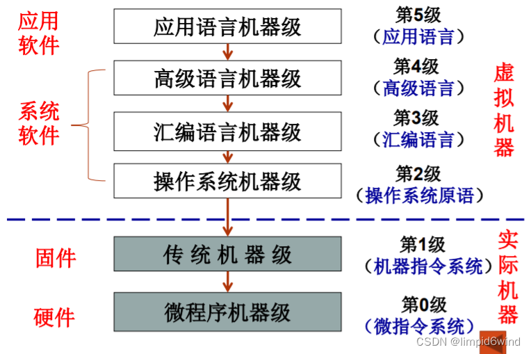


透明是某些机制存在并起作用，但用户感觉不到它的存在。用户可以调用

透明度越高，用户越不需要关心内部实现

# 2.字长


# 3.冯诺依曼


冯·诺依曼计算机思想提出了**存储程序**和**程序控制**，解决了计算机灵活性低、手动操作复杂等问题，使计算机能够：

- 将程序和数据存储在同一个内存中（存储程序）。
- 自动地逐条取出指令，按照指令顺序控制计算机运行（程序控制）。

这种设计思想成为现代计算机的基础，所有现代计算机都遵循冯·诺依曼架构。

# 4.计算机系统结构


指令集架构作为软硬件的接口，起到以下桥梁作用：

1. **软件对硬件的抽象化**

   - 软件开发人员无需了解硬件内部的具体电路实现，只需遵循指令集架构进行编程。
   - 指令集提供了硬件的功能接口，隐藏了硬件设计的复杂性。

2. **硬件对软件的标准化**

   - 硬件制造商设计CPU时必须遵守指令集架构，这保证了同一架构的CPU可以运行相同的软件。
   - 例如：Intel和AMD都遵循**x86**架构，所以它们的CPU可以运行相同的Windows程序。

3. **兼容性**

   - 软件开发者编写基于某个指令集架构的软件时，可以保证该程序在支持该指令集的所有硬件上运行。

   - 例如：ARM架构被广泛应用于移动设备，所有遵循ARM架构的芯片都可以运行ARM软件。

     **一句话总结**：

     **指令集架构**定义了软件与硬件沟通的“语言”，是连接软硬件的桥梁。

     **高层用户**（如使用高级编程语言的程序员）对硬件的透明性较高，即他们无需了解底层硬件的具体实现细节。
     
     这是因为高级语言和操作系统等抽象层次屏蔽了硬件的复杂性，为用户提供了更友好的接口。
     
     例如，高级语言的程序员不必了解机器的指令系统、中断机制等，这些对他们来说是透明的。 
     
     
     
     
     
     **低层用户**（如使用汇编语言的程序员）对硬件的透明性较低，他们需要直接与硬件交互，了解硬件的具体特性和操作方式。
     
     因此，低层用户对硬件的透明性比高层用户低。
     
     

# 5.字长


字长与运算有关，寄存器用来存储运算数据


# 6.计算MIPS


主频就是CPU每秒钟能够处理的[时钟](https://www.elecfans.com/tags/时钟/)周期数，它直接反映了CPU的运行速度

每秒总的时钟周期数（主频）/处理一条指令所需要的时钟（CPI）=IPS(每秒能处理的指令)

# 7.计算（重新计算百分比例）


# 8.进制转换


x=-5

符号位补齐8位

二转十六  四位看

# 8.5补码


**一句话总结**：
加法和减法按模运算就是在**固定范围**（模 MMM）内进行加减法，当结果超出范围时，会**回绕**或取余到指定范围内。

# 9.移码（IEEE754）

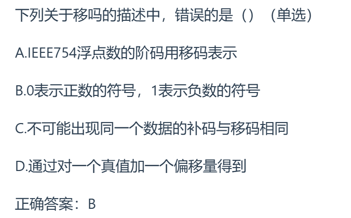

## **总结**

IEEE 754浮点数通过**符号位**、**指数位**和**尾数位**来表示一个数值。

1. **符号位**决定正负 0正1负    移码是0负1正

2. **指数位**使用偏移量表示指数大小。

3. **尾数位**表示有效数字的小数部分。

   IEEE754移码的偏移量和普通的不同

   

   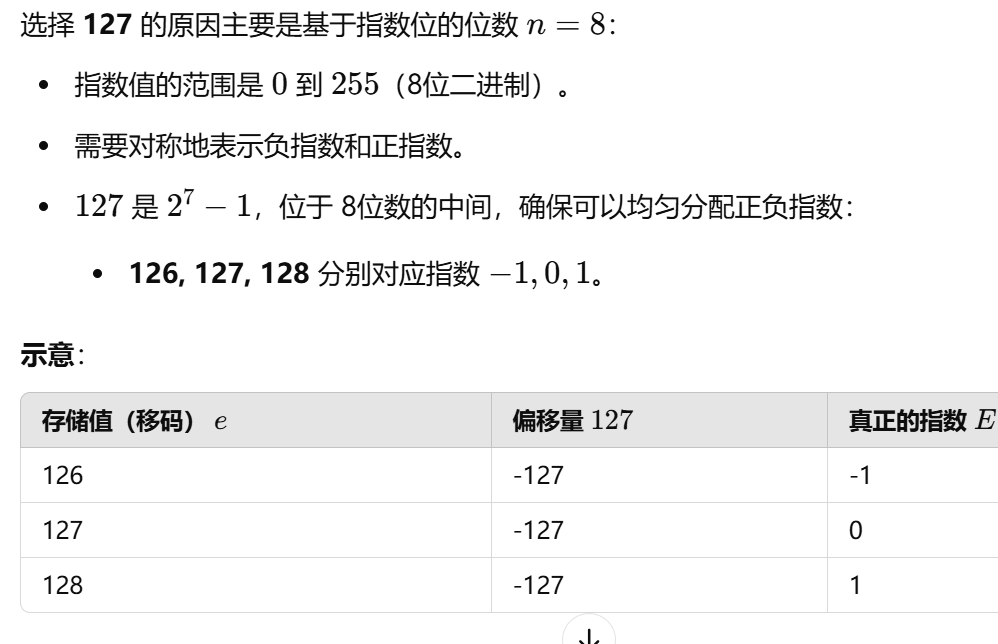

IEEE 754标准选择 **127** 作为偏移量的原因是：

1. 移码将负指数转为非负整数，方便硬件处理。
2. 127127127 是 888 位指数的中间值，对称地分布负指数和正指数。
3. 硬件比较简单，避免负数复杂运算。

# 10.IEEE754转10


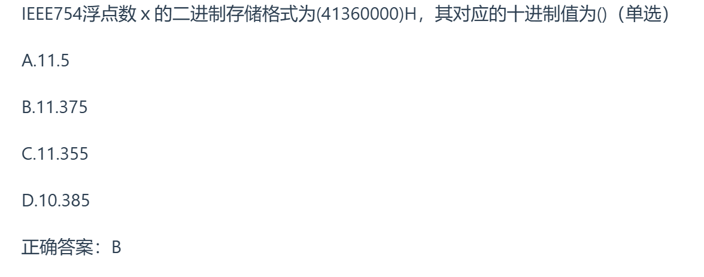

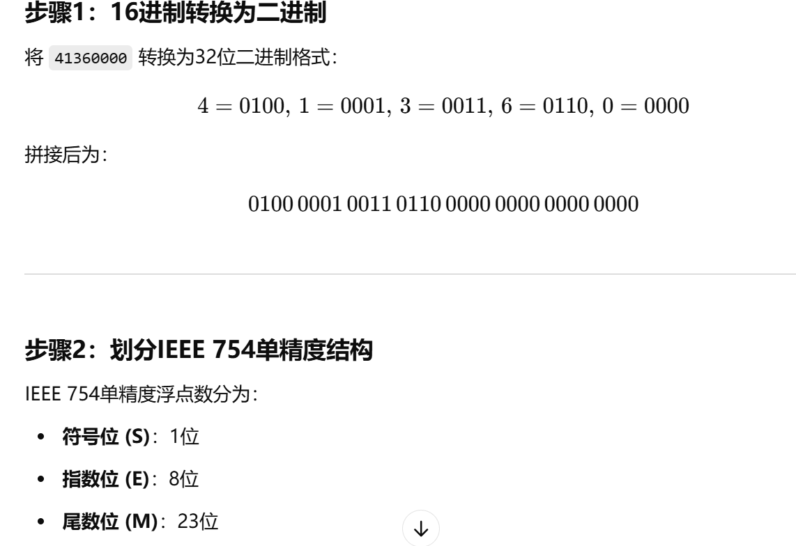

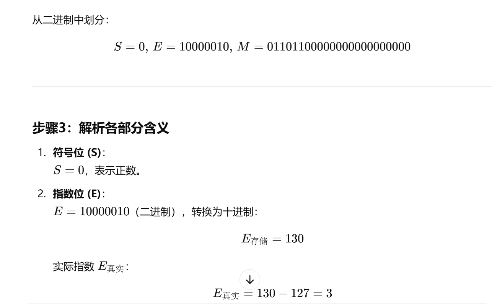

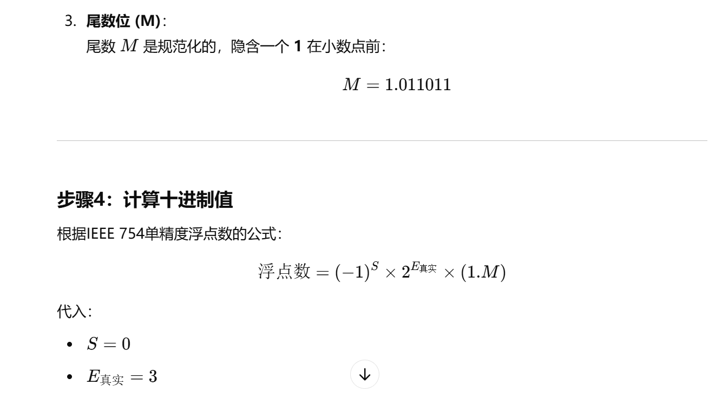

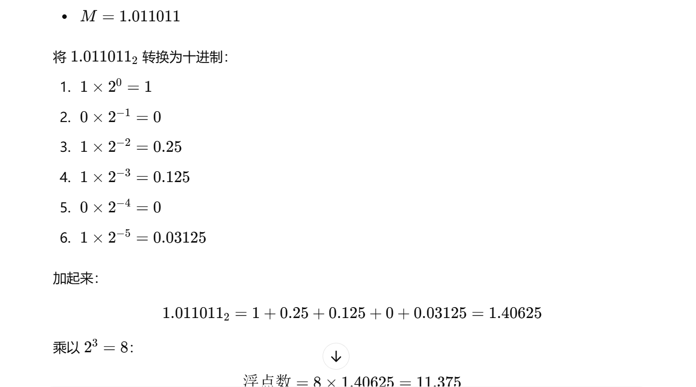


# 11.码距


码距是两个编码之间不同的位数

多个编码之间是至少不同的位数

# 12.检错纠错


# 13.校验


# 14.奇偶校验


### **奇偶校验的检错和纠错详细解释**

奇偶校验是一种**简单且常用的错误检测方法**，主要用于数据通信和存储中，用来检测数据传输过程中是否发生了错误。下面详细解释奇偶校验的检错和纠错过程：

------

## **1. 奇偶校验的基本原理**

奇偶校验通过在数据末尾添加**校验位**（Parity Bit）来实现错误检测。校验位的取值规则是根据数据中**1的个数**来决定的：

- **奇校验（Odd Parity）**
   数据中1的个数加上校验位的1的个数必须是**奇数**。
- **偶校验（Even Parity）**
   数据中1的个数加上校验位的1的个数必须是**偶数**。

通过这种方法，当传输数据时，可以检测出**单个位错误**。

------

## **2. 奇偶校验的检错过程**

### **步骤：**

1. 发送端

   ：

   - 根据奇校验或偶校验的规则，计算校验位并将校验位附加到数据末尾。

2. 接收端

   ：

   - 接收到数据后，再次计算所有位（包括校验位）的1的个数。
   - 根据校验规则（奇校验或偶校验）判断是否出现错误。

------

### **举例：**

假设数据为 `1011`，我们分别用**奇校验**和**偶校验**进行演示：

#### **(1) 奇校验：**

- 数据 `1011` 中1的个数为 `3`（奇数）。
- 根据奇校验的规则，校验位应该为 `0`，使1的总数保持**奇数**。
- 发送的数据变为：`1011 0`。

**接收端检测：**

- 接收到的数据是 `1011 0`，计算1的个数为 `3`，符合奇校验规则。
- 如果数据在传输过程中变成 `1001 0`（单个位出错），1的个数变为 `2`，不符合奇校验规则，检测出错误。

------

#### **(2) 偶校验：**

- 数据 `1011` 中1的个数为 `3`（奇数）。
- 根据偶校验的规则，校验位应该为 `1`，使1的总数保持**偶数**。
- 发送的数据变为：`1011 1`。

**接收端检测：**

- 接收到的数据是 `1011 1`，计算1的个数为 `4`，符合偶校验规则。
- 如果数据在传输过程中变成 `1001 1`（单个位出错），1的个数变为 `3`，不符合偶校验规则，检测出错误。

------

### **奇偶校验的检错能力：**

- 奇偶校验可以**检测出单个位错误**，但**无法确定错误发生在哪一位**。

- 如果发生**偶数位错误**（例如同时有2位错误），奇偶校验无法检测出错误，因为1的个数仍然符合校验规则。

- 总结

  ：

  - **检错能力**：能够检测单个位错误。
  - **局限性**：无法检测偶数位错误，也无法纠正错误。

------

## **3. 奇偶校验的纠错能力**

**奇偶校验本身无法进行纠错**，只能进行检错。

- **原因**：奇偶校验只有一个校验位，无法提供足够的信息来确定错误发生的位置。
- **示例**：假设数据为 `1011`，若接收到的数据为 `1001`，校验位可以检测出错误，但无法知道是第2位还是第3位出错。

------

## **4. 奇偶校验与纠错码的对比**

为了实现**纠错**，需要使用更复杂的编码方法，比如**汉明码**（Hamming Code）：

- **汉明码**可以通过多个校验位定位出错误发生的位置，并进行纠错。
- 奇偶校验只能检测错误，无法确定错误位置，因此无法纠错。

------

## **5. 总结**

- **奇偶校验**：
  - **原理**：通过校验位使1的个数保持奇数或偶数，进行错误检测。
  - **检错能力**：能检测单个位错误，不能检测偶数位错误。
  - **纠错能力**：无法纠错。
- **应用场景**：
  - 奇偶校验主要用于**数据通信中的错误检测**，如串口通信、存储系统等。
  - 若需要实现纠错，则需要更复杂的编码方法，如汉明码或其他纠错码。

# 15.奇偶校验


A.在编码中，两个有效代码之间的最小差异一般是1个数据位 + 1个校验位的差异。

奇校验码：0000 1  0001 0   0010 0   0011 1

相邻的几个不同的位数至少是2，则码距至少是2，偶校验同理

C.只能检验奇数位错误

# 16.（疑难）奇偶校验


偶数位不能检测，不能纠错

# 17.（疑难）CRC校验

记忆：001 移位2次  011移位1次  111移位0次 还剩101 


**校验码的位数是r,那么生成多项式的位数是r+1**

k+r<=2^r-1

**以上是解题关键**

### **什么是CRC校验？**

**CRC（Cyclic Redundancy Check，循环冗余检验）** 是一种常用的错误检测方法，用于确保数据在传输或存储过程中没有发生错误。它通过对数据进行数学计算，生成一个校验码来验证数据的完整性。CRC校验广泛应用于网络通信、硬盘存储、压缩文件等场合。

------

### **CRC的工作原理**

1. **数据和多项式**
    在进行CRC校验时，我们首先需要一个数据和一个预定义的多项式。多项式用二进制表示，称为 **生成多项式**。
2. **数据的二进制除法**
    CRC校验的核心是通过**模2除法**（二进制除法）将数据与生成多项式相除。模2除法不同于普通除法，它只对1和0进行加法和减法操作，而加法和减法在模2下是一样的（即1 + 1 = 0，1 - 1 = 0，0 + 0 = 0）。
3. **生成校验码**
    计算完模2除法后，得到的**余数**就是CRC校验码。这个校验码通常会附加到数据后面一起发送或存储。
4. **接收方验证数据完整性**
    接收方在收到数据时，会使用相同的生成多项式进行相同的模2除法。若余数为0，表示数据没有错误；若余数不为0，表示数据出现了错误。

------

### **一个简单的例子**

假设我们有一个4位的数据 `1011` 和一个生成多项式 `1101`。我们需要通过CRC检查这个数据的完整性。

1. **步骤一：添加校验位**
    首先，假设我们的CRC码长度为3位（与生成多项式的位数相关）。将数据后面加上3个零（初始校验位）：

   ```
   数据：1011
   添加校验位：1011000
   ```

2. **步骤二：模2除法**
    用生成多项式 `1101` 对 `1011000` 进行模2除法：

   ```
   1011000 ÷ 1101
   ```

   通过模2除法，我们得到的余数是 `011`，这就是CRC校验码。

3. **步骤三：验证**
    接收方收到数据后，会将数据和CRC校验码一起进行同样的模2除法计算。如果余数为0，说明数据没有错误；如果余数不为0，说明数据在传输过程中发生了错误。


------


# 18.CRC校验


(7,4)码是一种分组码。

其中“7”表示编码后的码长，即一个编码序列总共有7位；“4”表示信息位的长度，这意味着原始信息有4位。另外的7 - 4 = 3位是冗余位（校验位），用于检错和纠错，例如在CRC（循环冗余校验）编码中就会用到这种(7,4)码来提高数据传输的可靠性。

# 19.CRC校验


**校验码的位数是r,那么生成多项式的位数是r+1**

**用公式**

# 20.（疑难）CRC校验


无法理解CRC

# 21.地址


# 22.CRC校验

# 23.十转二 二转十六


简单哪

# 24.模运算


找规律：2^1 2^2 2^3  2,4,1余数三个循环

# 25.（疑难）CRC模二除法


# 26.IEEE754

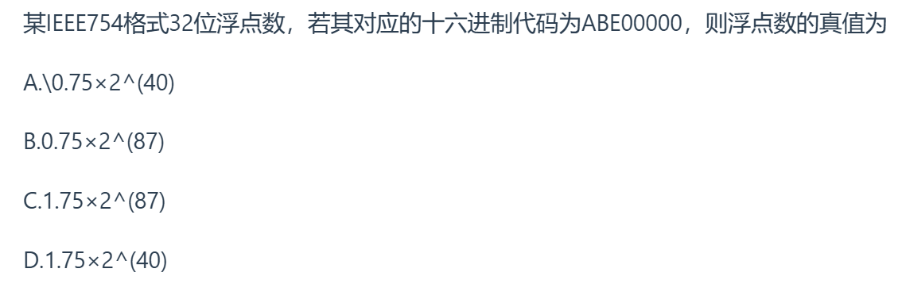

-1.75*2^-40

# 27.IEEE754


移码是原码+偏移量  补码符号位取反

-0.375×2^(-93)

IEEE754格式情况优先看题目

# 28.大小端模式


一个32位的2进制在内存中存储时有两种发布方式：

高字节 对应 高地址 --------------> 小端模式

高字节 对应 低地址 --------------> 大端模式

# 29.移码与补码，原码关系


移码=原码+偏移量  

​       =补码符号位取反

# 30.带符号位拓展

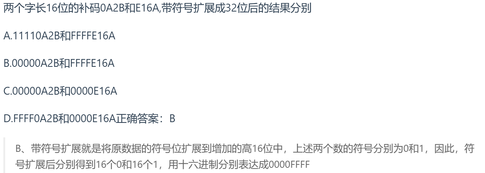

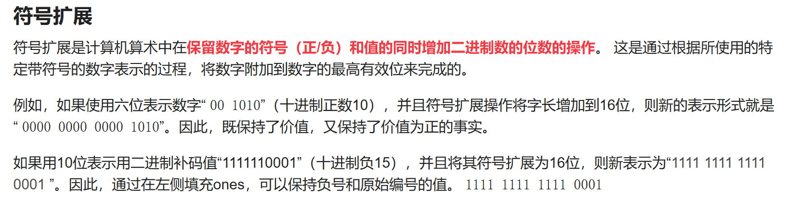

# 31.（疑难）移码真值计算


# 32.（疑难）海明校验


题目问的是**对海明校验的描述中，哪个选项是正确的**。

------

### **正确答案解析：A**

- 选项A描述

  ：待编码数据长度为4位，再增加3位校验码，就可以检测到

  仅1位数据出错

  的情况并

  纠错

  。

  - **正确**：海明校验码通过增加适当数量的校验位（例如3位校验位），可以检测并纠正**单个位错误**。校验位的数量和数据位的数量有明确关系，满足公式 2r≥k+r+12^r \geq k + r + 1（其中 rr 是校验位的数量，kk 是数据位的数量）。对于4位数据，3位校验位是正确的。

------

### **选项B：错误**

- 描述

  ：海明校验码的

  码距

  与校验位的位数没有关系。

  - **错误**：海明码的码距与校验位的数量有关。海明码的码距是3，增加校验位可以保证码字之间的最小码距，从而实现检测和纠正1位错误的功能。

------

### **选项C：错误**

- 描述

  ：分成 

  rr

   组时，可以得到 

  rr

   位指误码，因此可以区分 

  2r2^r

   种只有1位出错的情况。

  - **错误**：这里的表述混淆了概念。虽然 rr 位校验码可以标识出1位错误的位置，但 2r2^r 包括数据位和校验位本身的错误情况，并非单纯的“分组”误码。

------

### **选项D：错误**

- 描述

  ：在任何条件下，海明校验都无法检测到

  多位数据同时出错

  的情况。

  - **错误**：海明码**可以检测到2位错误**，但无法纠正2位错误。只要码距是3，双位错误的检测是可能的。

------

### **总结**

- **A是正确的**，因为海明校验通过增加校验位，可以检测并纠正单个位错误。

# 33.规格化


# 34.补码和移码


# 35.定点数运算


# 36.（疑难）浮点数表示范围（看不懂）


# 37.CRC校验


# 37.5（疑难）


**整数的原码反码补码一样的**

# 38.（疑难）补码表示数据范围


**原码和反码中0的补码不唯一**

# 39.码距取所有的最小值


# 40.IEEE754计算十进制真值


32位类似

# 浮点数一般格式


# IEEE754下的浮点数格式


指数部分的正负由移码表示，不需要符号  把符号位当成数值位转换成十进制-127得到啥就是啥

# 41.点阵汉字存储


一个字节存储八个点，相当于位bit

# 42.原码转十进制


# 43.定点运算器


​	定点运算器只能进行二进制定点运算

# 44.溢出


两个数是负数，打错了

## 判断溢出：


最高位与次高位的进位相异或

1代表溢出，0不溢出

双符号位：00表示正数，11表示负数，01，10表示溢出

# 45.溢出


# 46.5.（疑难）溢出电路设计


#   46.全加器用异或门


# 47.（疑难）溢出功能运算器


# 48.（疑难）并行进位


# 49.（疑难）ALU（看不懂錒）


# 50.左移


# 51.右移


-19,补码

# **左移右移在补码上进行**

# 符号位的拓展也在补码上进行

# 52.原码一位乘法


# 52.原码一位乘法


n-1

# 53.拓展位


# 54.补码一位乘法


# 55.原码恢复余数法除法


# 55.5.原码加减交替法除法


# 56.补码交替加减法除法


# 57.（疑难）浮点数规格化


错了，左移一位，尾数是=0.xxx


# 58.浮点数表示范围精度


简单

# 59.（疑难）溢出类型


上溢：数的绝对值太大，大于所能表示的数据范围

下溢：数的绝对值太小，小于所能表示的数据范围

正溢：正数相加溢出

负溢：相加绝对值溢出

# 60.浮点数运算


草泥马终于做出来了


# 模数舍弃和运算溢出的区别

十进制数相加：(－15) + (－20) = (－35)
用[补码](https://zhidao.baidu.com/search?word=补码&fr=iknow_pc_qb_highlight)计算，就会有自然丢弃的现象。

(－15) 补＝ 1111 0001
(－20) 补＝ 1110 1100
相加：－－－－－－－－
可得： (1)1101 1101

括号中的1，是进位，自然丢弃。

剩下的 1101 1101，就是(－35)补。

===================================

八位的补码，可以表示十进制数－128~+127。
运算结果超出这个范围，就溢出了。

十进制数计算：(+80) + (+90) = (+170)
用补码计算，就会有溢出。

(+80) 补＝ 0101 0000
(+90) 补＝ 0101 1010
相加：－－－－－－－－
可得： (0) 1010 1010

进位是0。
剩下的 1010 1010，却是(－86)补。

为什么不是 (+170)补？
就是因为，超出范围，溢出了。

# 61.浮点数溢出


# 62.算数右移


# 63.（疑难）原码除法


# 64.5 溢出


进位标识是两个符号位的

# 64.减法运算


# 65.浮点数运算


# 66.补码作用


# 67.算数左移和右移


算数左移等价于逻辑左移，算数右移符号位不动，并补符号位

# 68.溢出判断电路


# 69.（疑难）补码乘法器


# 70.ALU


ALU是计算机中实现算术和逻辑操作的核心组件，其主要包括以下模块：

algorithm and logical unit

1. 算术单元（加减乘除）。
2. 逻辑单元（与、或、非、异或）。
3. 移位单元（逻辑移位、算术移位）。
4. 条件比较单元。
5. 状态标志寄存器。

# 71.（疑难）移位丢弃的影响


# 72.溢出种类双符号判断


# 73.ALU


# 74.运算器组成


# 74.5 补码


-128补码：1000 0000

# 75.（疑难）综合运算


# 76.移位


逻辑移位：无视符号位，缺位补0

算术移位：符号位不变，右移补符号，左移补0

# 77.串行与并行


B.对

# 78.（疑难）阶码部件


乘除是通过移位来完成的


浮点数由三个部分组成：符号位、阶码部分和尾数部分。在浮点运算中，阶码部分的主要作用是调整浮点数的范围，而不是直接参与具体的算术运算。

在浮点运算器中，阶码部件的主要任务是：

1. 在浮点数的加减运算时，需要对阶码进行加减运算以调整浮点数的范围；
2. 在浮点数的乘除运算时，需要对阶码进行乘除运算以相应调整浮点数的范围。

因此，阶码部件并不需要完成加、减、乘、除四种运算，它只需要完成加减运算即可。乘除运算是通过移位操作来实现的，不直接涉及阶码部件的乘除运算。

# 79.（疑难）尾数部件


还要加减运算

# 80.移位补码计算 


简单

# 81.补码移位计算


注意要补全8位，符号位在第一位

# 82.移码用途


# 83.（疑难）哈佛结构


# 84.局部性


时间局部性指程序中最近被访问的内存位置很可能在不久的将来再次被访问。

空间局部性指程序中被访问的内存地址附近的位置很可能在不久的将来也会被访问

# 85.存储系统结构层次


# 86.CPU和主存差异


# 87.局部性


# 88.内存对齐


| 地址 | 0    | 1    | 2    | 3    | 4    | 5    | 6    | 7    | 8    | 9    | 10   | 11   |
| ---- | ---- | ---- | ---- | ---- | ---- | ---- | ---- | ---- | ---- | ---- | ---- | ---- |
|      |      |      |      |      |      |      |      |      |      |      |      |      |

| **对齐情况** | ✔️    | ❌    | ✔️    | ❌    | ✔️    | ❌    | ✔️    | ✔️    | ✔️    | ❌    | ✔️    | ❌    |
| :----------- | ---- | ---- | ---- | ---- | ---- | ---- | ---- | ---- | ---- | ---- | ---- | ---- |
|              |      |      |      |      |      |      |      |      |      |      |      |      |

### **A. `j` 的物理地址 mod 8 = 0**

- 系统的默认对齐规则是 8 字节对齐，`mod 8 = 0` 是符合系统对齐规则的地址。
- **short 类型对齐要求是 mod 2 = 0**，而 **mod 8 = 0** 同样满足 mod 2 = 0 的要求。
- 因此，**A 是正确的**。

------

### **B. `j` 的物理地址 mod 8 = 1**

- **short 类型要求地址是偶数**（mod 2 = 0），但是 mod 8 = 1 表示地址是奇数（比如 1、9、17...）。
- 因此，`short` 类型无法存储在这个地址上。
- **B 是错误的**。

------

### **C. `j` 的物理地址 mod 8 = 2**

- mod 8 = 2 表示地址是 8 的倍数加 2，比如 2、10、18...。
- **short 类型需要满足 mod 2 = 0**，而 mod 8 = 2 也是偶数地址（符合 mod 2 = 0 的要求）。
- 因此，`short` 类型可以存储在这样的地址上。
- **C 是正确的**。

------

### **D. `j` 的物理地址 mod 8 = 3**

- mod 8 = 3 表示地址是 8 的倍数加 3，比如 3、11、19...。
- 这些地址是奇数（mod 2 ≠ 0），无法满足 **short 类型的对齐要求**（mod 2 = 0）。
- **D 是错误的**。

# 内存对齐总结

一般来说，数据类型的大小决定了它的对齐单位。比如：

- `char`（1字节）：对齐单位是1，地址可以是任何值。
- `short`（2字节）：对齐单位是2，地址必须是 **偶数**。
- `int`（4字节）：对齐单位是4，地址必须是 **4的倍数**。
- `double`（8字节）：对齐单位是8，地址必须是 **8的倍数**

# 89.内存对齐


8位->1字节->对齐单位是1->地址是1的倍数->所有数

# 89.大端模式和小端模式


# 90.存储字长


# 90.5.大端小端


# 91.寻址范围


按字寻址：**每个字为一个地址**


# 92.（疑难）数据线和地址线


# 93.（疑难）单译码与双译码结构


# 94.（疑难）SRAM


考到该背时

# 95.DRAM


# SRAM和DRAM

| **指标**         | **DRAM**                         | **SRAM**                   |
| ---------------- | -------------------------------- | -------------------------- |
| **速度**         | 较慢，需要刷新                   | 快，直接读取数据           |
| **密度**         | 高（单位面积存储更多数据）       | 低（占用更多晶体管面积）   |
| **功耗**         | 高（刷新和动态操作消耗更多能量） | 低（不需要刷新）           |
| **价格**         | 较低（结构简单，易制造）         | 较高（结构复杂）           |
| **数据保持时间** | 需要刷新，断电后数据丢失         | 断电后数据丢失，不需要刷新 |

### **DRAM (动态随机存取存储器)**

- **存储单元结构：**
  DRAM 使用 **电容** 和 **晶体管** 作为存储单元。每个存储单元由一个晶体管和一个电容组成：
  - 电容存储电荷，用来表示数据（“1” 或 “0”）。
  - 电容的电荷会随着时间泄漏，因此需要周期性地“刷新”（即重新充电）。
- **特点：**
  - 每个存储单元结构简单，占用面积小。
  - 电容需要定期刷新，增加了操作复杂性。
- **刷新：**
  - DRAM 必须在一定时间间隔内，通过控制器进行刷新操作（通常是几十毫秒一次）。
  - 刷新时存储器无法被访问，因此影响性能。

------

### **SRAM (静态随机存取存储器)**

- **存储单元结构：**
  SRAM 使用 **触发器（Flip-Flop）** 作为存储单元，每个存储单元由 4-6 个晶体管组成：
  - 触发器通过两对交叉耦合的晶体管维持一个稳定的状态。
  - 只要电源供电，触发器就能保持数据稳定，无需刷新。
- **特点：**
  - 结构复杂，占用面积大。
  - 不需要刷新，速度快，功耗低（静态存储时）。

# 96.二者区别


# 97.（疑难）DRAM刷新


刷新操作是由DRAM内部的刷新计数器提供地址，而不是由CPU提供

1. **集中刷新**：
   - 集中刷新在刷新期间停止读/写操作，存在“死时间”，但保持了存储单元的高速特性。因此，选项B是正确的。
2. **异步刷新**：
   - 异步刷新方式在每次读/写操作后进行一次刷新，刷新频率高，因此不存在“死时间”，同时保持了存储单元的高速特性。因此，选项C是正确的。
3. **分散刷新**：
   - 分散刷新将刷新操作分散到每个存储单元的每次读/写操作中，导致刷新次数过多，影响存储单元的性能。因此，选项D是正确的。

死时间：进行刷新不读取数据的时间

以下是对 **集中刷新**、**异步刷新** 和 **分散刷新** 的简单通俗解释，它们是 **DRAM 的刷新方式**：

------

### **1. 集中刷新**

- **概念：**
   一段时间内，暂停所有正常的数据读写操作，集中精力对所有存储单元进行刷新。
- **类比：**
   就像一个班级统一时间集中打扫卫生，所有人都停止其他活动。
- 特点：
  - 简单易实现。
  - 刷新时无法访问数据，可能导致卡顿。

------

### **2. 异步刷新**

- **概念：**
   在需要刷新时，异步触发刷新操作，而不依赖于固定时间间隔。
- **类比：**
   就像每次有垃圾需要清理时，随时安排人打扫，不规定特定时间。
- 特点：
  - 刷新不固定，有一定灵活性。
  - 效率取决于具体触发机制。

------

### **3. 分散刷新**

- **概念：**
   把整个刷新任务分散到多个时钟周期中，每次只刷新一部分存储单元。
- **类比：**
   就像班级每天轮流分小组打扫卫生，所有人都能正常活动，没有完全停下来。
- 特点：
  - 刷新和读写操作交替进行，减少了卡顿。
  - 复杂度较高，但更适合连续工作的场景。

------

### **总结对比**

| 刷新方式 | **刷新时机**           | **影响**                   | **场景适配**           |
| -------- | ---------------------- | -------------------------- | ---------------------- |
| 集中刷新 | 固定时间，集中一次完成 | 停止所有操作，可能引起延迟 | 简单系统或低速场景     |
| 异步刷新 | 动态触发，非固定时间   | 相对灵活，但效率不稳定     | 不常用，适配特殊场景   |
| 分散刷新 | 多个周期分散完成       | 减少卡顿，刷新与操作交替   | 高性能或实时性强的场景 |

# 98.DRAM


一般为存储字长一般是四位或八位

2^12*4

# 99.（疑难）寻址计算


# 100.（疑难）寻址计算


注意：48K-1转化为二进制


# 101.存储拓展


- 选项A：字扩展时，存储芯片的片选信号一般由地址译码器产生。地址译码器根据地址总线的高几位产生片选信号，以选择特定的存储芯片，这是正确的。
- 选项B：只做位扩展时，所有存储芯片的片选信号都固定接0。位扩展不需要选择不同的存储芯片，因此片选信号固定为0，这是正确的。
- 选项C：CPU的读写控制线应连接到SRAM的读写控制线。这是正确的，因为无论哪种扩展方式，CPU的读写控制线都需要连接到SRAM的读写控制线以控制数据的读写操作。
- 选项D：只做字扩展时，不同存储芯片相同编号的数据位（如D2）不能连接到CPU数据总线的同一位上。这是错误的，因为在字扩展中，不同存储芯片的相同编号的数据位是并行连接到CPU数据总线的同一位上，以增加存储器的容量。

# 102.CPU


# 103.Cache


# 104.存储字长


# 105.寻址范围


# 106.地址线与数据线


256k个存储单元

地址线18，数据线4

# 107.地址线与数据线


C

# 108.（疑难）寻址计算


# 109.存储器系统


# 110.DRAM


# 111.对齐


双字长，64位，8字节，则地址是8的倍数，所以低三位全部为0

# 112.RAM和ROM


# RAM和ROM

### **RAM（随机存取存储器）和 ROM（只读存储器）的区别**

| 特性         | **RAM** （Random Access Memory）      | **ROM** （Read-Only Memory）                |
| ------------ | ------------------------------------- | ------------------------------------------- |
| **功能**     | 存储临时数据和正在运行的程序          | 存储永久数据和指令                          |
| **存储内容** | 动态更新，可随时读写                  | 一般在生产时写入，正常使用时仅供读取        |
| **易失性**   | 易失性存储器：断电后数据丢失          | 非易失性存储器：断电后数据仍然保存          |
| **速度**     | 读写速度快，用于主存或缓存            | 读速度较慢，多用于固化程序                  |
| **用途**     | CPU运行时用于存放操作数据、指令及程序 | 存储启动程序（如 BIOS）、固件或系统关键信息 |
| **分类**     | DRAM、SRAM                            | PROM、EPROM、EEPROM、Flash ROM              |
| **成本**     | 较高（特别是高速 SRAM）               | 较低                                        |
| **可编程性** | 任意修改数据                          | 视类型决定是否可以重写（如 Flash ROM 可写） |

------

### **RAM 详细说明：**

1. **易失性：**
    RAM 中的数据在断电后会丢失。
2. 分类：
   - **DRAM（动态 RAM）：** 常用作计算机的主内存，需要周期性刷新。
   - **SRAM（静态 RAM）：** 速度快但成本高，多用于缓存（如 CPU 的 L1/L2 Cache）。
3. **用途：**
    用于临时存储数据和程序，支持快速读写，CPU直接从 RAM 获取指令和数据。

------

### **ROM 详细说明：**

1. **非易失性：**
    ROM 的数据断电后仍然存在。
2. 分类：
   - **PROM（一次性可编程 ROM）：** 只能编写一次。
   - **EPROM（可擦写 ROM）：** 通过紫外线擦除后可重新写入。
   - **EEPROM（电可擦写 ROM）：** 可以用电擦除和写入。
   - **Flash ROM（闪存）：** 现代最常用，快速擦写，可用于存储系统固件、手机存储等。
3. **用途：**
    存储固化程序，如 BIOS、嵌入式设备固件等。

------

### **RAM 和 ROM 的简单记忆：**

- **RAM 是"临时工作空间"：** 存放临时数据，速度快，但断电就没了。
- **ROM 是"永久存储空间"：** 存放重要固化信息，不能轻易更改。

# 113.存储器技术标准


# 114.DRAM SRAM


# 115.存储位数


总的存储位数不变

# 116.存储体系思想


存储体系的构建思想主要是为了提高存储器的访问速度，减少访存周期对CPU执行效率的影响。为了实现这一目标，存储体系主要依据以下两个原则来构建：

1. **时间局部性**：如果某个数据被访问，那么在不久的将来它再次被访问的概率很高。时间局部性通过在高速缓存中保存最近访问的数据来提高访问速度。
2. **空间局部性**：如果某个数据被访问，那么与它相邻的数据在不久的将来被访问的概率也很高。空间局部性通过在高速缓存中保存数据的相邻块来提高访问速度。

此外，为了充分利用存储体系，编程时应尽量采用顺序结构，因为顺序结构能够更好地利用时间局部性和空间局部性，减少分支和跳转对存储器访问的负面影响。

选项分析：

- 选项A（时间局部性）：符合存储体系构建思想。
- 选项B（空间局部性）：符合存储体系构建思想。
- 选项C（编程采用顺序结构）：符合存储体系构建思想。

故答案为: ABC

# 116.5芯片计算


这里看总的位数，地址编址没用，不要被迷惑

# 117.小端


# 118.小端存储


0x 11 10 00 00  注意是小端存储  

# （疑难）交叉存储器概述

**基本思想**是在**不提高存储器速率、不扩展数据总线位数的前提下**，`通过存储芯片的交叉组织`，提高CPU单位时间内访问的数据量，`从而缓解`快速的CPU与慢速的主存之间的`速度差异。`


### 

------

### **1. 高位多体交叉存储器**

#### **概念**

在**高位多体交叉存储器**中，**存储地址的高位**用于选择存储体。
 例如，如果地址的二进制表示为 `abcdefgh`（8 位地址），高位如 `ab` 用于决定数据存储在哪个存储体。

#### **数据存储的逻辑**

- 假设有 4 个存储体（`Bank 0`, `Bank 1`, `Bank 2`, `Bank 3`）。

- 地址高 2 位（如 

  ```
  00
  ```

  , 

  ```
  01
  ```

  , 

  ```
  10
  ```

  , 

  ```
  11
  ```

  ）决定数据分配：

  - `00` → Bank 0
  - `01` → Bank 1
  - `10` → Bank 2
  - `11` → Bank 3

#### **存储分配规则**

地址低位（`efgh`）表示数据在该存储体内部的位置，而高位决定选取的存储体。
 例如：

- 地址 `00000000`（高位 `00`）→ `Bank 0`。
- 地址 `01000000`（高位 `01`）→ `Bank 1`。
- 地址 `10000000`（高位 `10`）→ `Bank 2`。
- 地址 `11000000`（高位 `11`）→ `Bank 3`。

#### **优点**

1. **连续性：** 数据在每个存储体中是顺序存储的，适合单体访问。
2. **简单：** 适用于对大块数据的连续访问需求。

#### **缺点**

- 访问多个地址时，容易集中在一个存储体，导致**并行度降低**。

------

### **2. 低位多体交叉存储器**

#### **概念**

在**低位多体交叉存储器**中，**存储地址的低位**用于选择存储体。
 例如，如果地址为 `abcdefgh`，低位如 `gh` 用于决定数据存储在哪个存储体。

#### **数据存储的逻辑**

- 假设有 4 个存储体（`Bank 0`, `Bank 1`, `Bank 2`, `Bank 3`）。

- 地址低 2 位（

  ```
  00
  ```

  , 

  ```
  01
  ```

  , 

  ```
  10
  ```

  , 

  ```
  11
  ```

  ）决定数据分配：

  - `00` → Bank 0
  - `01` → Bank 1
  - `10` → Bank 2
  - `11` → Bank 3

#### **存储分配规则**

地址高位（`abcd`）表示数据块的位置，低位决定存储体分配。
 例如：

- 地址 `00000000`（低位 `00`）→ `Bank 0`。
- 地址 `00000001`（低位 `01`）→ `Bank 1`。
- 地址 `00000010`（低位 `10`）→ `Bank 2`。
- 地址 `00000011`（低位 `11`）→ `Bank 3`。
- 地址 `00000100`（低位 `00`，新一轮循环）→ `Bank 0`。

#### **优点**

1. **高并行性：** 不同地址的数据分布在不同存储体中，多个地址可被同时访问。
2. **避免冲突：** 适合流水线系统或多任务环境。

#### **缺点**

- 访问连续数据时，数据被分散在不同存储体中，需要多次切换存储体。

------

### **3. 对比总结**

| **特性**           | **高位多体交叉存储器**             | **低位多体交叉存储器**             |
| ------------------ | ---------------------------------- | ---------------------------------- |
| **地址分配方式**   | 根据地址高位选择存储体             | 根据地址低位选择存储体             |
| **适合场景**       | 单任务连续访问                     | 并行访问、多任务流水线处理         |
| **存储体分布特点** | 连续数据存储在同一个存储体中       | 连续数据分散到不同存储体中         |
| **并行性**         | 并行性低                           | 并行性高                           |
| **冲突可能性**     | 数据集中在单个存储体，冲突可能性高 | 数据分散到多个存储体，冲突可能性低 |

------

### **4. 应用场景举例**

#### **高位多体交叉存储器：**

- **应用场景：** 偏向单任务的场景，例如某些嵌入式系统中的连续数据处理。
- **示例：** 视频解码时每一帧数据存储在一个存储体中，读取时以帧为单位。

#### **低位多体交叉存储器：**

- **应用场景：** 偏向并发访问的场景，例如多核处理器、多线程访问共享内存。
- **示例：** 向量处理器的并行计算中，每个线程访问不同的存储体。

------

### **5. 通俗理解**

- **高位多体交叉存储器：**
   想象一个图书馆有 4 个楼层，每个楼层存放不同的书籍类型（小说、历史、科学等）。你需要读完整一套书（例如，某系列小说），只需待在一层楼即可。
- **低位多体交叉存储器：**
   想象一个图书馆有 4 个书架，每个书架上依次存放一本不同的书（小说第 1 本在书架 1，小说第 2 本在书架 2...）。你需要读完整一套书，需要在不同的书架间轮流取书。

通过这种比喻可以清楚理解：**高位方式适合顺序读取（同一楼层），低位方式适合并行读取（多个书架）。**

# 119.交叉存储器


首先，我们需要理解并行存储器的存取过程：

1. 并行存储器的每个模块在一个存取周期内可以提供32位（即一个字）的数据。
2. 因为有四个模块，所以四个模块并行工作时，每个存取周期可以提供 4×32=128 位的二进制信息。

# 120.交叉存储器


**基本思想**是在**不提高存储器速率、不扩展数据总线位数的前提下**，`通过存储芯片的交叉组织`，提高CPU单位时间内访问的数据量，`从而缓解`快速的CPU与慢速的主存之间的`速度差异。`

# 121.交叉存储器


# 122.交叉存储器（有图也不会）


# Cache地址映射概述

### **通俗详细解释全相联映射、直接相联映射、组相联映射以及 K 路组相联映射**

在缓存（Cache）设计中，**映射方式**指的是如何把主存中的地址映射到缓存中。以下以生活中的例子详细说明这些概念，让初学者更易理解。

------

### **1. 全相联映射（Fully Associative Mapping）**

#### **概念**

- 全相联映射允许主存中的数据块可以存储在缓存中的**任何位置**。
- 每次查找时，需要将主存地址与**所有缓存块**的标签进行比较，找到匹配的块。

#### **通俗解释**

想象你有一个抽屉，里面可以随意放置你的各种文具（比如笔、橡皮、尺子等）。没有固定的存放规则，你只需在需要时打开抽屉，把所有物品都翻一遍，直到找到你想要的。

#### **特点**

- **优点：** 灵活性高，缓存空间利用率最大。
- **缺点：** 查找时需要与所有缓存块比较，硬件开销大，速度慢。

------

### **2. 直接相联映射（Direct Mapped Mapping）**

#### **概念**

- 在直接相联映射中，每个主存块只能存放到缓存中的**固定位置**。
- 主存地址被分成**块号（用于定位缓存块）**和**标签（用于验证）**两部分。

#### **通俗解释**

想象你有一个文具盒，里面有固定的隔层（比如第一个隔层放笔，第二个隔层放橡皮，第三个隔层放尺子）。当你需要某样东西时，你知道该去哪个隔层找它。

#### **特点**

- **优点：** 查找速度快，只需要比较一个缓存块。
- **缺点：** 缓存冲突严重（不同的主存块可能被映射到同一个缓存块，导致不断替换）。

------

### **3. 组相联映射（Set Associative Mapping）**

#### **概念**

- 组相联映射是全相联和直接相联映射的结合体。
- 缓存分成多个**组（Set）**，每个组有固定数量的缓存块（称为“路”）。
- 主存块首先被映射到一个特定的组（类似直接相联映射），然后可以存放到该组的**任意缓存块**中（类似全相联映射）。

#### **通俗解释**

想象你有多个文具盒，每个文具盒里有几个隔层。你根据物品种类（主存地址）决定放在哪个文具盒中，然后在这个文具盒的任意隔层中找到或存放它。

#### **特点**

- **优点：** 减少了冲突，提高了缓存利用率。
- **缺点：** 查找复杂度介于全相联和直接相联之间。

------

### **4. K 路组相联映射（K-Way Set Associative Mapping）**

#### **概念**

- K 路组相联是组相联映射的一种特例，每组固定有 **K 个缓存块**。
- 主存地址被分为三部分：
  1. **标记位（Tag）：** 用于验证数据是否正确。
  2. **组号（Set Index）：** 用于确定数据属于哪个组。
  3. **块内偏移（Block Offset）：** 确定块内具体数据的位置。

#### **通俗解释**

继续上面的文具盒例子：

- 如果每个文具盒有 4 个隔层（即 4 路组相联），那么：
  - 你根据物品种类（主存地址）找到对应的文具盒。
  - 然后在这个文具盒的 4 个隔层中查找具体的物品。

#### **特点**

- **灵活性和效率：** K 越大，越接近全相联映射；K 越小，越接近直接相联映射。
- **平衡性：** 它在查找效率和缓存利用率之间取得了良好的折中。

------

### **对比总结**

| **特性**           | **全相联映射**           | **直接相联映射**       | **组相联映射**         | **K 路组相联映射**       |
| ------------------ | ------------------------ | ---------------------- | ---------------------- | ------------------------ |
| **灵活性**         | 任意块可存储任意位置     | 每块只能存储到固定位置 | 介于两者之间           | 组内灵活，组外固定       |
| **查找复杂度**     | 需要检查所有缓存块       | 只检查一个块           | 只检查组内的块         | 只检查 K 个块            |
| **缓存冲突**       | 冲突最少                 | 冲突最多               | 冲突适中               | 冲突概率由 K 决定        |
| **硬件实现复杂度** | 最复杂                   | 最简单                 | 介于两者之间           | 介于两者之间             |
| **适用场景**       | 程序访问模式随机或多样化 | 程序访问模式规则性强   | 灵活性和性能折中的场景 | 高性能、多任务并行的场景 |

------

### **应用场景通俗化理解**

1. **全相联映射：**
    随意存储，不在乎规则，但需要花费更多时间“翻找”。
   - **场景：** 小型嵌入式设备，程序访问模式不确定。
2. **直接相联映射：**
    一对一存储，简单高效，但容易产生冲突。
   - **场景：** 性能要求低且访问模式较简单的系统。
3. **组相联映射：**
    折中方案，部分灵活存储，减少冲突，提高并行性。
   - **场景：** 大多数现代 CPU 的缓存系统。
4. **K 路组相联映射：**
    “灵活分组存储”，K 越大越接近全相联，K 越小越接近直接相联。
   - **场景：** 高性能计算，K 值常见为 2、4、8。

------

通过这些通俗的例子，你可以清楚地理解不同映射方式的存储规则、优缺点和适用场景！

# 123.Cache地址映射


每组有K个缓存块（每个文具盒有K个夹层）

# 124.Cache


# 写穿策略

### **Cache的写穿策略（Write-Through Policy）**

#### **概念**

**写穿策略（Write-Through Policy）** 是一种处理缓存写操作的策略。它的特点是：

- **每当数据写入缓存时，立即同步写入主存（内存）。**
- 确保缓存和主存中的数据保持一致。

------

#### **通俗解释**

想象你正在编辑一份文档，每次你修改文档内容（缓存中的数据）时，你同时手写一份副本（主存中的数据）。这样，无论发生什么情况（比如电脑突然关机），你的副本始终是最新的。

------

#### **具体操作**

1. 写数据：
   - 数据先写入缓存。
   - 缓存再把这次写操作“穿透”到主存中。
2. 数据一致性：
   - 主存和缓存中的数据始终保持同步。

------

### **优点和缺点**

#### **优点**

1. 数据一致性高：
   - 主存和缓存中的数据实时一致，适合需要强一致性的数据应用。
2. 简单可靠：
   - 易于实现，降低了系统崩溃或电源故障时的数据丢失风险。

#### **缺点**

1. 写入速度较慢：
   - 每次写操作都需要访问主存，延迟较高。
2. 存储设备压力大：
   - 主存需要频繁写入，增加了带宽和功耗。

------

### **对比其他写策略**

1. **写回策略（Write-Back Policy）**
   - 写入数据时，只修改缓存中的数据，**主存不立即更新**。
   - 只有当缓存块被替换时，才将数据写回主存。
   - **优点：** 写入速度快，减少对主存的访问。
   - **缺点：** 数据一致性差，掉电时可能丢失最新数据。
2. **写穿策略（Write-Through Policy）**
   - 写入数据时，缓存和主存同步更新。
   - **优点：** 数据一致性高，简单可靠。
   - **缺点：** 写入延迟大。

------

### **适用场景**

- 写穿策略适用于对数据一致性要求较高的场景，例如：
  - **金融系统：** 交易记录必须实时保存，不能丢失。
  - **数据库系统：** 数据的写入需要与主存保持同步。

------

### **改进方案：写穿 + 写缓冲（Write Buffer）**

为了弥补写穿策略的写入速度较慢的问题，可以引入**写缓冲（Write Buffer）**：

- 写操作时，数据写入缓存和写缓冲。
- 主存的写入延迟由写缓冲负责，写缓冲可以批量更新主存，减少频繁写操作的开销。

------

通过这种方式，写穿策略既能保持数据一致性，又能优化写入性能，在实际应用中更为高效！

# 125.Cache组成


Cache通常由以下几个部分组成：

1. **标记存储体**：用于存放从主存地址中剥离出的标记（Tag），以便在访问时快速查找所需数据。
2. **数据存储体**：用于存放从主存中拷贝的数据，这些数据是与主存交换的数据。
3. **有效位（Valid）**：用于判断Cache中的数据是否有效，如果无效，则需要从主存中重新读取数据。
4. **脏位（Dirty）**：用于判断Cache中的数据是否被修改，如果被修改，则需要将修改后的数据写回到主存中。

# 126.Cache工作部件


1. **相联存储器**：相联存储器（Associative Memory）用于存储Cache中的数据和地址映射关系，能够快速查找和匹配数据，是Cache的重要组成部分。
2. **调度替换算法**：调度替换算法（Replacement Algorithm）用于决定在Cache满时，哪些数据块应该被替换，以优化Cache的使用效率。
3. **脏位和有效位比较电路**：脏位（Dirty Bit）用于标记数据是否被修改过，有效位（Valid Bit）用于指示数据是否有效，这些位的比较电路是Cache管理的重要部分。
4. **标记比较电路**：标记比较电路用于比较Cache中的数据标记，以确定是否命中（Hit）或未命中（Miss）。

# 127.（疑难）Cache地址映射


看公式


# 128.Cache地址映射


更简单了

# 129.（疑难）直接映射原理


# 130.Cache


K是每组里面的块数

# 映射总结


# 131.替换算法


19

LFU：least frequently used  最少被使用

# 132.替换算法


全相联映射（Fully Associative Mapping）是一种缓存映射方式，其中任何内存块可以放置在缓存中的任何位置。LFU（Least Frequently Used）替换算法是一种缓存替换策略，根据数据块的使用频率来决定哪个数据块应该被替换。具体来说，LFU算法会替换掉使用频率最低的数据块。在本题中，我们需要根据CPU访问的数据块流和LFU算法来确定在访问数据块4时，哪个数据块会被调出。

1. 初始化Cache，假定Cache被划分成4行，初始状态为空。
2. 按照数据块流的顺序，依次处理每个数据块的访问请求：
   - 第一次访问数据块22：Cache中无数据，将22放入Cache。
   - 第二次访问数据块11：Cache中无数据，将11放入Cache。
   - 第三次访问数据块22：命中，22的使用频率加1。
   - 第四次访问数据块19：Cache中无数据，将19放入Cache。
   - 第五次访问数据块11：命中，11的使用频率加1。
   - 第六次访问数据块16：Cache中无数据，将16放入Cache。
   - 第七次访问数据块19：命中，19的使用频率加1。
   - 第八次访问数据块4：Cache已满，需要根据LFU算法替换一个数据块。

根据LFU算法，我们需要找出当前Cache中使用频率最低的数据块进行替换。假设每次访问后更新频率如下：

- 第一次访问22后，Cache状态：[22]
- 第二次访问11后，Cache状态：[22, 11]
- 第三次访问22后，Cache状态：[22, 11]（22的频率变为2）
- 第四次访问19后，Cache状态：[22, 11, 19]
- 第五次访问11后，Cache状态：[22, 11, 19]（11的频率变为2）
- 第六次访问16后，Cache状态：[22, 11, 19, 16]
- 第七次访问19后，Cache状态：[22, 11, 19, 16]（19的频率变为2）

此时，Cache已满，需要替换一个数据块。根据LFU算法，比较各数据块的使用频率：

- 22的频率为2
- 11的频率为2
- 19的频率为2
- 16的频率为1

由于16的使用频率最低，因此在访问数据块4时，会调出数据块16。

# 132.替换算法


# 替换算法总结

常用的缓存替换算法有以下几种：

1. **FIFO（First-In-First-Out，先进先出）**
   - **特点**：按照块进入缓存的时间顺序替换最早进入的块。
   - **优点**：简单易实现，维护一个队列即可。
   - **缺点**：可能替换掉经常使用的块，导致命中率下降。
2. **LRU（Least Recently Used，最近最少使用）**
   - **特点**：替换最近最少被访问的块，假设最近访问过的数据未来更有可能被再次访问。
   - **优点**：性能较好，命中率通常高于FIFO。
   - **缺点**：实现复杂，需要维护访问时间记录。
3. **LFU（Least Frequently Used，最少使用频率）**
   - **特点**：替换访问次数最少的块，假设使用频率低的数据未来也可能不再被访问。
   - **优点**：适用于访问频率稳定的场景。
   - **缺点**：对访问频率波动大的数据不友好，可能需要周期性清除统计。
4. **Random（随机替换）**
   - **特点**：随机选择一块进行替换，与访问模式无关。
   - **优点**：实现简单，无需记录访问历史。
   - **缺点**：性能不稳定，可能影响命中率。
5. **NRU（Not Recently Used，未被最近使用）**
   - **特点**：根据访问和修改位（通常是操作系统的页表字段）来选择未被最近使用的块进行替换。
   - **优点**：接近LRU，但实现更简单。
   - **缺点**：依赖硬件支持。
6. **Clock（时钟替换算法）**
   - **特点**：改进的NRU算法，用指针循环扫描，检查访问位（通常用1位标志）。
   - **优点**：实现简单，性能接近LRU。
   - **缺点**：适用于操作系统的页面置换，不常用于硬件缓存。

### 总结

- **FIFO**：简单但容易替换掉有用数据。
- **LRU**：命中率高，但实现复杂。
- **LFU**：关注频率，适合长期稳定访问模式。
- **Random**：简单快速，但不确定性大。
- **NRU/Clock**：介于简单和性能之间，适合特定场景。

根据实际需求和硬件复杂性选择合适的算法。

# 133.虚拟存储器


# 134.虚拟存储器


# 135.（疑难）虚拟存储器


- 页表：用于将虚拟地址映射到物理地址。
- MMU（存储管理单元）：用于管理和翻译虚拟地址和物理地址。
- 高速缓冲存储器（Cache）：用于提高内存访问速度，但它并不是虚拟存储器的核心构建部件。
- 磁盘等外存储器：用于存储不常用的数据，以扩展内存容量。

# 136.Virtual计算


# 137.TLB(快表)


本题考查的是对TLB（Translation Lookaside Buffer，翻译后备缓冲器）的理解。TLB是计算机系统中用于加速虚拟地址到物理地址转换的重要硬件组件。以下是对各选项的分析：

1. **TLB中存放的是页表项**：TLB中确实存放的是页表项，这些页表项用于快速查找虚拟地址到物理地址的映射关系，从而加速地址转换过程。因此，选项A是正确的。
2. **TLB的工作原理是局部性原理**：TLB利用了时间局部性和空间局部性原理，即最近被访问的页表项很可能在不久的将来也会被再次访问，从而提高地址转换的效率。因此，选项B是正确的。
3. **引入TLB的目的是快速实现虚实地址转换**：TLB的主要目的是通过缓存页表项来减少访问页表的次数，从而加快虚拟地址到物理地址的转换速度。因此，选项C是正确的。
4. **TLB中采用了类似Cache的映射方法**：TLB的工作方式类似于Cache，通过缓存机制来存储最近访问的页表项，以提高地址转换的效率。因此，选项D是正确的。

# 138.（疑难）TLB


# TLB概述

### 什么是 TLB？

**TLB（Translation Lookaside Buffer，翻译后备缓冲器）\**是计算机中的一种\**高速缓存（Cache）**，专门用来加速**虚拟地址**到**物理地址**的转换过程。

------

### 为什么需要 TLB？

1. **虚拟内存机制：**
   - 现代计算机使用虚拟内存，将程序的虚拟地址映射到实际的物理内存地址。
   - 映射关系存储在一个叫**页表**的数据结构中。
2. **问题：**
   - 每次访问内存都需要查询页表（通常存放在主存中）。
   - 查询页表速度很慢（需要多次内存访问）。
3. **解决方法：**
   - TLB 是一种小而快的缓存，用来存放**最近访问过的页表条目**。
   - 如果需要地址转换时，先检查 TLB，能找到的话就避免访问主存中的页表。

------

### TLB 的工作原理（通俗解释）

1. **假设：** 程序需要访问一个虚拟地址。
2. 步骤：
   1. 检查 TLB：
      - TLB 中保存了最近使用的地址映射（虚拟地址到物理地址的对应关系）。
      - 如果虚拟地址对应的映射存在于 TLB 中，称为 **TLB 命中**。
      - 如果没有找到，称为 **TLB 未命中**。
   2. 命中：
      - 直接使用 TLB 中的映射，快速得到物理地址。
   3. 未命中：
      - 查询主存中的页表，找到对应的映射，然后将映射存入 TLB，供后续使用。
3. **执行访问：** 最终通过物理地址访问数据。

------

### 举个通俗的例子

- **场景：** 你去某栋大厦办事（访问内存）。
- **大厦前台：** 相当于页表，负责告诉你目标房间号（物理地址）。
- **问题：** 前台很忙，每次都要问效率低。
- **解决方法：** 在你办事前，前台将你常去的房间号（映射关系）记在一个小本子上（TLB）。
- 结果：
  - 如果下次去办事，小本子上有记录（命中），直接去房间。
  - 如果小本子上没有记录（未命中），再去前台询问，然后更新小本子。

------

### TLB 的特点

1. 速度快：
   - 因为它是缓存，查询比直接访问主存快得多。
2. 容量小：
   - TLB 的大小通常在几十到几百条条目，比主存小很多。
3. 局部性原理：
   - 由于程序访问内存具有**空间局部性**和**时间局部性**，TLB 很适合缓存最近使用的地址映射。

------

### 总结

- TLB 是专门加速地址转换的缓存。

- 它是操作系统虚拟内存机制的重要组成部分，解决了频繁查询页表导致的性能瓶颈问题。

- ### **简单记忆：** TLB 就是「虚拟地址到物理地址的快速联系人」。

# RAID概述

### 什么是 RAID？

**RAID**（Redundant Array of Independent Disks，独立磁盘冗余阵列）是一种通过组合多个硬盘，实现更高的**性能**、**可靠性**或**存储容量**的技术。

简单来说，RAID 是一种将多个硬盘组织成一个逻辑单元的技术。它通过数据分布或备份的方式，解决单个硬盘性能不足或可靠性不高的问题。

------

### RAID 技术的主要目标

1. **提高性能：**
    同时利用多个硬盘并行读写数据，速度更快。
2. **提高可靠性：**
    使用冗余（备份）技术，即使一个硬盘坏了，数据也不会丢失。
3. **扩大存储容量：**
    将多个硬盘组合为一个大的逻辑存储空间。

------

### RAID 的常见工作方式

RAID 的核心理念可以用两个词总结：**数据分条（Striping）\**和\**冗余（Redundancy）**。

- **数据分条：**
   把数据分成小块，存储在不同的硬盘上，实现并行读写，提升速度。
- **冗余：**
   把数据做一份或多份备份，或者用校验信息保护数据，提升可靠性。

------

### 常见 RAID 级别（通俗解释）

#### **1. RAID 0（性能提升型）**

- **特点：**
  - 数据分条：将数据切分成块后分布存储在多个硬盘上。
  - 没有冗余：如果一个硬盘坏了，所有数据都会丢失。
- **优点：**
  - 速度快，容量为所有硬盘容量总和。
- **缺点：**
  - 没有容错能力，可靠性低。
- **比喻：**
   假如你用多个快递员送一份书，书被拆分成几本分别送，快递很快送达，但如果丢了一本，就看不了完整的内容。

------

#### **2. RAID 1（镜像型）**

- **特点：**
  - 数据完全镜像：每个硬盘都存储完整的数据副本。
  - 冗余度高：任意一个硬盘损坏，数据都可以从镜像中恢复。
- **优点：**
  - 高可靠性，读速度快（可同时读取多块硬盘）。
- **缺点：**
  - 存储效率低（只有一半硬盘容量可用）。
- **比喻：**
   假如你把一本书复印一份，原本丢了还有复印件。

------

#### **3. RAID 5（平衡型：性能 + 容错）**

- **特点：**
  - 需要至少 3 块硬盘。
  - 数据和校验信息分散存储在硬盘上，既能提升性能，又能实现容错。
  - 任意一块硬盘损坏时，数据可通过剩余硬盘中的校验信息恢复。
- **优点：**
  - 高效利用空间（只浪费 1 块硬盘用于校验），读取速度快，可靠性高。
- **缺点：**
  - 写入速度较慢（需要计算校验信息）。
- **比喻：**
   假如有三本书，信息被分散存储在这三本书中，如果一本丢了，另外两本能用校验信息重建缺失内容。

------

#### **4. RAID 10（RAID 1 + RAID 0，混合型）**

- **特点：**
  - 结合 RAID 0 和 RAID 1 的优点，既有性能提升，又有可靠性保障。
  - 需要至少 4 块硬盘。
- **优点：**
  - 高性能，高可靠性。
- **缺点：**
  - 成本较高（硬盘利用率只有 50%）。
- **比喻：**
   假如你把一本书拆分成两部分，用四个快递员分别送两份完整的镜像拷贝，这样即使有快递员丢了东西，也能恢复。

------

### RAID 的优缺点总结

| **RAID 级别** | **优点**                       | **缺点**                      | **最适合的场景**             |
| ------------- | ------------------------------ | ----------------------------- | ---------------------------- |
| **RAID 0**    | 高性能，存储空间利用率 100%    | 没有容错能力                  | 游戏、视频剪辑等高性能需求。 |
| **RAID 1**    | 高可靠性，读速度快             | 硬盘利用率低                  | 数据重要性高的场景。         |
| **RAID 5**    | 性能与可靠性平衡，存储利用率高 | 写入速度较慢，需至少 3 块硬盘 | 服务器存储、数据库等应用。   |
| **RAID 10**   | 高性能 + 高可靠性              | 成本高，硬盘利用率低          | 高性能且高可靠性场景。       |

------

### TIPS

- RAID 并不是备份系统！如果数据逻辑被删除或损坏，RAID 无法恢复。
- RAID 的实现可以通过硬件（RAID 控制器）或软件（操作系统提供）完成。

------

通过 RAID 技术，用户可以根据需求在**性能**、**可靠性**和**成本**之间找到合适的平衡，广泛应用于服务器和存储设备中。

# 139.RAID


本题考查的是RAID（独立磁盘冗余阵列）技术中的RAID1级别的磁盘利用率。RAID1通过磁盘数据镜像实现数据冗余，即在成对的独立磁盘上产生互为备份的数据，以提高数据的安全性和可用性。RAID1的特点是每个数据块都会被复制到另一块磁盘上，形成镜像，这样在原始数据繁忙或失效时，可以从镜像中读取数据，从而提高读取性能和数据可靠性。由于每个数据块都需要两块磁盘来存储（一块用于原始数据，一块用于镜像），因此磁盘的利用率为50%。也就是说，一半的磁盘容量用于存储数据，另一半用于存储数据的镜像备份。

# 140.RAID


意思是没有容错率，无法再提高，**数据丢失了就不见了**

# 141.RAID


RAID1的主要目的是数据冗余和安全性，而不是提高读写性能。它将数据完全复制到另一个磁盘上，虽然可以提高读取性能，但由于需要同步写入到两个磁盘，写入性能会受到影响。因此，RAID1无法显著提高读写性能。

# 142.RAID


RAID5是一种带分布式奇偶校验的条带化存储方式，它通过将数据和奇偶校验信息分布在多个硬盘上来提供数据冗余，允许在一块硬盘故障时通过其他硬盘重建数据。RAID5的总容量计算公式为：总容量 = (硬盘数量 - 1) × 单块硬盘容量。

1. 题目中给出了8个300G的硬盘，因此总容量为8个硬盘的容量减去1个硬盘的容量用于奇偶校验。
2. 计算过程如下：
   总容量 = (8 - 1) × 300G = 7 × 300G = 2100G = 2.1T


只浪费 1 块硬盘用于校验

# 142.5


###  **什么是32位处理器？**

32位处理器是指其**寄存器**的宽度为32位，意味着它可以一次处理32位数据，**同时也可以使用32位的地址**。地址是用二进制数表示的，而32位地址就相当于一个**32位的二进制数**

2^32是4G

# 143.各个部件作用


- **TLB（Translation Lookaside Buffer）**：翻译后备缓冲器，用于存储最近使用的页面的地址转换信息，以加快地址转换速度，但它本身不负责完成整个地址转换过程。快表
- **MMU（Memory Management Unit）**：内存管理单元，是实现虚拟存储器的硬件核心。它负责将虚拟地址转换为物理地址，并处理存储保护和缓存命中等功能。
- **Cache**：高速缓存，用于存储经常使用的数据和指令，以提高访问速度，但它不负责地址转换。
- **DMA（Direct Memory Access）**：直接内存访问，用于在设备和内存之间直接传输数据，不涉及地址转换。

# 143.5


在计算机系统中，Cache（高速缓存）是一种用于提高数据访问速度的硬件设备，通常位于处理器和主存（RAM）之间。Cache的作用是存储处理器近期经常访问的数据和指令，以减少访问主存的时间，从而提高整体系统性能。

当处理器需要访问某个内存地址时，它首先会查找Cache中是否存在该数据（即Cache命中）。如果找到了，就直接读取Cache中的数据；如果没有找到（即Cache未命中），则需要从主存中读取数据，并将其存储到Cache中，以备后续使用。

这个Cache与主存之间的地址映射过程是由特定硬件实现的，而不是通过操作系统、驱动程序或用户软件来完成的。硬件自动完成该过程，以确保高速度和高效率。

因此，在程序的执行过程中，Cache与主存的地址映射是由硬件自动完成的。

# 144.计算


弱智

# 145.虚到实映射


# 相联存储器概述

### 什么是相联存储器？

**相联存储器**（Associative Memory）是一种特殊的存储器，与传统的通过地址访问存储单元的方式不同，它是**按内容（数据）访问**存储单元的。相联存储器也叫**内容寻址存储器**（Content Addressable Memory，简称 CAM）。

------

### 通俗解释

想象你有一个文件柜：

- **传统存储器（地址存储器）**：你知道文件在第几号抽屉（地址），于是直接打开那个抽屉去取文件。
- **相联存储器**：你直接说出文件的名字或部分内容，文件柜会自动找到并取出这个文件，不需要知道它存在哪个抽屉。

相联存储器的特别之处在于，它能够**根据存储的内容直接找到对应的地址**。

------

### 工作原理

1. **输入内容**：
   - 提供一个搜索条件（比如一段数据或部分关键字）。
2. **并行比较**：
   - 相联存储器的每个存储单元都能同时比较输入的搜索内容，判断是否匹配。
3. **返回结果**：
   - 如果有匹配的单元，返回这个单元的地址或对应的数据。

------

### 主要特性

1. **按内容寻址**：
   - 输入的是要查找的数据或部分特征，而不是传统的地址。
2. **并行比较**：
   - 所有存储单元能同时比较，大大加快了查找速度。
3. **高效查找**：
   - 特别适用于需要快速匹配的场景，比如路由表查找。

------

### 应用场景

- **高速缓存（Cache）**： 在缓存中，相联存储器用于快速查找数据是否存在于缓存中。
- **路由器中的地址查找**： 相联存储器可以快速匹配路由表中的IP地址，决定数据包的转发路径。
- **数据库系统**： 在数据库查询中，用于快速匹配特定的关键字或数据。

------

### 优缺点

#### 优点：

- 查找速度极快（并行比较）。
- 更灵活的寻址方式。

#### 缺点：

- 硬件实现复杂。
- 存储容量有限，价格较高。

------

### 总结

**相联存储器是一种按内容访问的存储器，它直接根据输入内容进行查找，而不需要指定地址，主要用于需要快速匹配的场景。** 虽然它速度很快，但由于成本较高，一般只在特定的硬件中使用，比如高速缓存和路由器。

# 146.相联存储器


# 147.Cache


，Cache是一种高速缓存，用于存储最近使用的数据和指令，以加快访问速度。要更好地发挥Cache的作用，程序需要具备以下特性：

1. **时间局部性**：时间局部性意味着如果某个数据在某一时刻被访问，那么在不久的将来它很可能会再次被访问。例如，在一个循环中反复执行的指令和访问的数据就体现了时间局部性。
2. **空间局部性**：空间局部性意味着如果一个数据被访问，那么其附近的数据很可能也会被访问。例如，数组的连续存取就体现了空间局部性。

# 148.逻辑地址和物理地址


逻辑地址和物理地址的位数关系并不是固定的

# 149.地址映射


# 150.MMU作用


# 151.Cache地址映射


# 152.Cache


读操作通常不需要考虑CaChe与主存的一致性问题，因为读操作不改变数据内容。一致性问题主要涉及写操作。

# 152.5


CaChe和主存的容量差距需要适度，过大的差距反而不利于性能提升

# 152.6


在计算机系统中，Cache和主存是两级不同的存储层次。Cache是高速缓存，容量较小但速度快；主存是主要存储器，容量大但速度相对较慢。为了综合利用两者的优点，通常将Cache和主存结合使用。

等效容量的概念指的是从系统整体来看，存储器系统的容量应当与主存的容量一致，因为Cache的作用是加速对主存数据的访问，而不是增加存储容量。因此，Cache-主存层次的等效容量等于主存容量。

# 153.Cache


# 154.Cache


1. **Cache块大小**：Cache块大小是指从主存中调入Cache的数据块的大小。较大的块大小可以减少访问主存的次数，但可能会导致空间浪费和命中率下降，因为块越大，命中率越低。
2. **Cache的总容量**：Cache的总容量决定了可以存储的数据量，容量越大，能够存储的数据越多，命中率通常会越高。
3. **主存的存取时间**：主存的存取时间影响了Cache未命中时的访问时间，但与命中率无直接关系。
4. **替换算法**：替换算法决定了在Cache满时如何选择要替换的数据块，不同的替换算法会影响Cache的命中率。

# 155.


Cache与主存统一编址，但Cache地址空间不是主存的一部分。Cache有自己独立的地址空间，通过映射机制与主存地址空间关联

# 156.Cache


# 157.（疑难）访问过程

TLB->Page->Cache

由虚到实


- **Step 1：TLB检查**
  - TLB是一个高速缓存，用于存储虚拟地址到物理地址的映射。如果命中，直接得到物理地址；如果未命中，就需要访问页表。
- **Step 2：页表检查（Page）**
  - 如果TLB未命中，CPU会查询页表以获得虚拟地址对应的物理地址。如果页表命中，可以继续访问内存；如果未命中，则发生缺页中断，加载页面到内存。
- **Step 3：Cache检查**
  - 当获得物理地址后，CPU会检查Cache是否存有该地址的数据。如果命中，则直接读取；如果未命中，则需要从主存加载数据到Cache。

TLB未命中：虚拟地址映射不在TLB中。

Page未命中：页表中也没有映射，发生缺页中断。

Cache命中：这不可能，因为物理地址无法解析出，Cache命中条件不成立。

# 158.（疑难）RAID


# 159.（疑难）分页计算


# 160.Cache计算


# 161.（疑难）TAG位计算


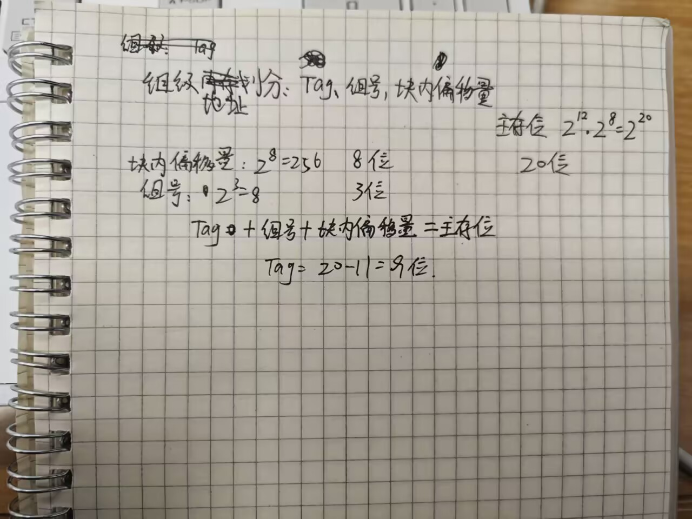

# 162.指令

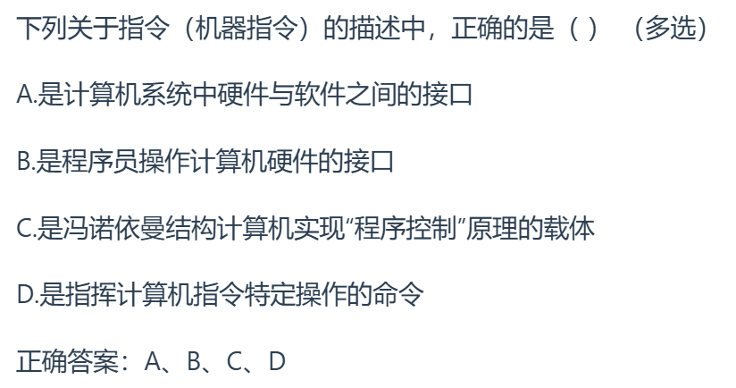

# 163.指令

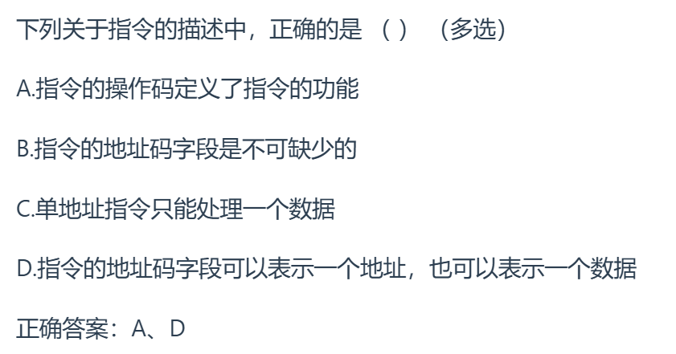

单地址指令能够处理一个数据，但并不意味着只能处理一个数据。实际上，单地址指令可以通过一个地址码指定一个操作数，并对该操作数进行处理，因此C错误。

选项D：指令的地址码字段可以表示一个地址，也可以表示一个数据，具体取决于指令的类型和操作码，因此D正确。

# 指令地址码概述

在计算机系统中，**指令的地址码字段**指的是指令中用于指定操作数地址或目标地址的部分。为了便于理解，以下是通俗解释和技术背景：

------

### **1. 指令格式**

指令通常由以下部分组成：

- **操作码（Opcode）：** 表示要执行的操作类型（如加法、减法、加载等）。
- **地址码字段（Address Field）：** 指定操作数的位置（即操作数的地址）或结果存储的目标地址。

------

### **2. 地址码字段的作用**

当一个指令执行时，CPU需要知道在哪里找到操作数或将结果存放在哪里。地址码字段的主要作用是提供这些信息。

- **来源地址：** 指定操作数的位置（如寄存器、内存、I/O设备）。
- **目标地址：** 指定运算结果应该存储的目标位置。
- **跳转地址：** 在控制指令中，地址码字段可以指定跳转目标的位置。

------

### **3. 地址码字段的几种表示方式**

**地址码字段可以通过不同的方式指定操作数或目标地址**，这就涉及到**寻址方式**。常见的寻址方式包括：

#### （1）**立即寻址**

- 地址码字段直接存放操作数。
- 示例：`MOV R1, 5`，操作数 `5` 就直接存放在指令中。
- **特点：** 不需要访问内存，速度快。

#### （2）**直接寻址**

- 地址码字段存放的是内存地址，操作数存储在这个地址中。
- 示例：`LOAD R1, [1000]`，操作数存放在内存地址 `1000`。
- **特点：** 简单，但地址范围受限于地址码字段的位数。

#### （3）**间接寻址**

- 地址码字段存放的是一个指针的地址，真正的操作数地址存放在这个指针中。
- 示例：`LOAD R1, [[1000]]`，`1000` 处存放另一个地址，比如 `2000`，而操作数在地址 `2000` 中。
- **特点：** 支持更大的地址范围，但速度较慢。

#### （4）**寄存器寻址**

- 地址码字段指定一个寄存器，操作数存储在这个寄存器中。
- 示例：`ADD R1, R2`，`R1` 和 `R2` 都是寄存器。
- **特点：** 速度快，但寄存器数量有限。

#### （5）**基址寻址**

- 地址码字段指定一个基址寄存器，操作数的地址是基址加上偏移量。
- **特点：** 灵活，适用于数组和指针操作。

#### （6）**相对寻址**

- 地址码字段指定一个偏移量，操作数的地址是程序计数器（PC）加上这个偏移量。
- **特点：** 常用于分支跳转。

#### （7）**变址寻址**

- 地址码字段指定一个变址寄存器，操作数的地址是基址加上偏移量。

  

------

### **4. 地址码字段的长度**

- 地址码字段的长度决定了可以访问的地址范围。
- 如果地址码字段是 **n 位**，则最多可以指定 2n2^n 个不同的地址。
- **现代计算机中**，指令长度通常是固定的，因此地址码字段的位数也受指令长度的限制。

------

### **5. 实例分析**

假设一条 32 位的指令，其中：

- 操作码占 8 位。
- 地址码字段占 16 位。
- 其余字段用于寄存器编号或其他控制信息。

如果地址码字段是 16 位，则这条指令最多可以直接访问 216=65,5362^{16} = 65,536 个内存地址。

------

### **总结**

指令的地址码字段是指令中至关重要的一部分，它指定了操作数或目标地址的位置，配合不同的寻址方式，可以极大地提高指令执行的灵活性和效率。

# 164.指令

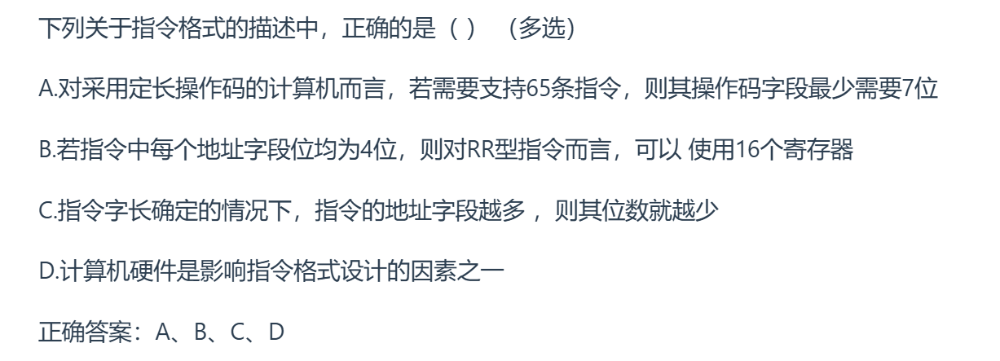

B：一个寄存器存放数据，一个存放结果

# **常见的指令格式**

以下是典型的几种指令格式：

#### **1. 单地址格式**

- 操作码字段 + 操作数字段。

- 优点：结构简单。

- 缺点：需要依赖隐含寄存器（如累加器）来存放中间结果。

  **示例：**

  - `ADD A`（将累加器的值与地址A的值相加）。

------

#### **2. 双地址格式**

- 操作码字段 + 两个操作数字段。

- 一个操作数用于读取数据，另一个操作数用于存放结果。

- 常见于一些简单的处理器。

  **示例：**

  - `ADD R1, R2`（将寄存器R2的值加到寄存器R1）。

------

#### **3. 三地址格式**

- 操作码字段 + 三个操作数字段。

- 两个操作数是源操作数，一个操作数是结果位置。

- 通常用于RISC体系结构。

  **示例：**

  - `ADD R1, R2, R3`（将R2和R3的值相加，结果存入R1）。

------

#### **4. 零地址格式**

- 指令不显式指定操作数地址，而是使用栈结构隐式操作。

- 常见于基于栈的机器。

  **示例：**

  - `ADD`（从栈顶弹出两个值相加，结果存回栈顶）。

# 165.寻址方式

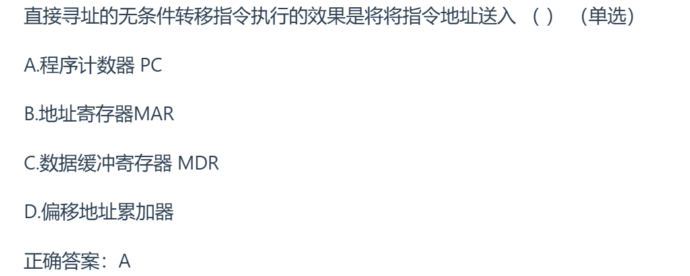

1. **程序计数器（PC）**：用于存储即将执行的指令地址。每次指令执行后，PC会自动递增，指向下一条指令的地址。

2. **地址寄存器（MAR）**：用于**暂存**当前正在访问的内存单元的**地址**。

3. **数据缓冲寄存器（MDR）**：用于**暂存**从内存中读取的数据或准备写入内存的**数据**。

4. **偏移地址累加器**：用于存储基地址与偏移地址的和，以确定有效地址。

   

# 166.寻址方式

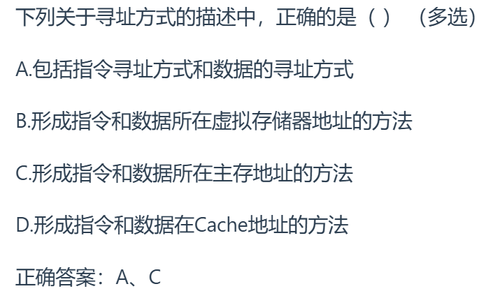

寻址方式是指在计算机系统中获取指令和数据所在存储位置的方法。具体来说，寻址方式可以分为指令寻址和数据寻址两种：

- 指令寻址：用于确定指令在存储器中的位置，通常通过程序计数器（PC）加上一定的偏移量来实现。
- 数据寻址：用于确定操作数在存储器中的位置，可以通过多种寻址方式如直接寻址、间接寻址、寄存器寻址等来实现。

根据题意，寻址方式包括指令寻址和数据寻址，并且主要是形成指令和数据在主存地址的方法。因此，选项A和C是正确的。

选项B和D的描述涉及虚拟存储器和Cache的地址形成方法，这不属于传统意义上的寻址方式定义，因此不正确。

# 167.寻址方式

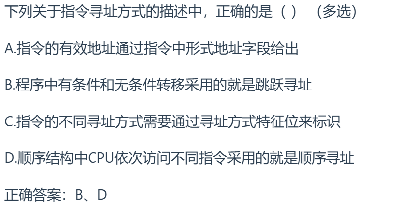

这道题目是关于指令寻址方式的描述，选项分析如下：

------

### 选项解析：

1. **A. 指令的有效地址通过指令中形式地址字段给出**

   - 错误

     ：

     - 有效地址（Effective Address）是指实际访问操作数所在的地址，而形式地址（或称逻辑地址）通常是指令中直接给出的地址。有效地址可能需要经过某种变换（如基址、变址等）后才能获得。因此，形式地址并不等同于有效地址。

2. **B. 程序中有条件和无条件转移采用的就是跳跃寻址**

   - 正确

     ：

     - 条件转移（如跳转到满足条件的某一地址）和无条件转移（如直接跳到某一地址）的实现正是通过跳跃寻址（或相对寻址）。跳跃寻址通过相对偏移量实现地址的动态计算，是转移类指令的常见方式。

3. **C. 指令的不同寻址方式需要通过寻址方式特征位来标识**

   - 错误

     ：

     - 指令的寻址方式通常通过操作码（Opcode）或其他专门的标志位（如模式字段）来区分，而不是直接依赖“特征位”。这种表述不够准确，容易误导。

4. **D. 顺序结构中CPU依次访问不同指令采用的就是顺序寻址**

   - 正确

     ：

     - 顺序结构的程序中，指令是按地址逐条存储的，CPU执行完一条指令后，通过程序计数器（PC）的递增依次访问下一条指令，这种方式被称为顺序寻址。

------

### 正确答案： **B, D**

如需进一步解释或有其他问题，可以随时询问！

# 168.单字长指令

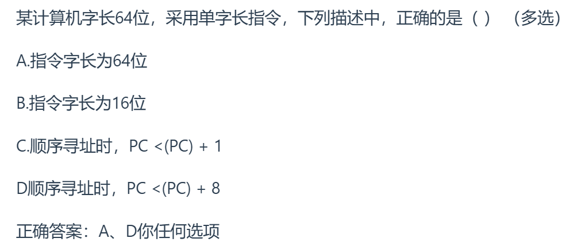

字长是指计算机一次能处理的二进制数据的位数。对于某计算机字长为64位的情况，指令字长通常也是64位。单字长指令意味着**每条指令占用一个字长**，即64位。因此，选项A正确。

在顺序寻址模式下，程序计数器（PC）的值会根据指令的字长进行递增。对于字长为64位的指令，每执行一条指令，PC需要增加的值应为64位，即8字节。因此，顺序寻址时，PC的值应增加8。

# 168.5

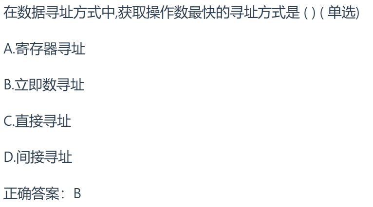

地址码存放的是数据

# 169.直接寻址


地址码存放的是真实地址地址

# 170.间接寻址

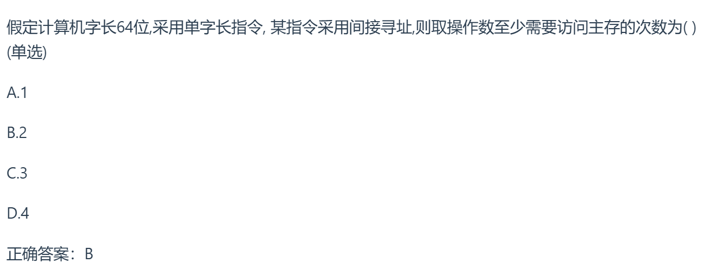

地址码存放的是指针，还要再访问指针

# 171.相对寻址

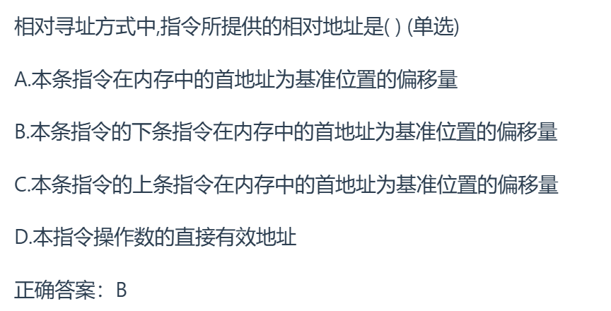

考察概念

# 172.寻址方式

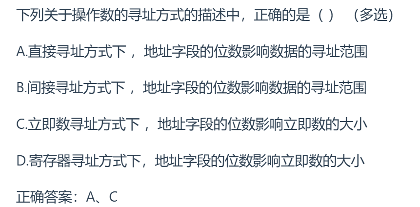

1. 直接寻址方式：在这种方式下，指令中包含的地址字段直接指向内存中的一个单元。地址字段的位数决定了数据的寻址范围，因此选项A是正确的。
2. 间接寻址方式：在这种方式下，指令中包含的地址字段指向一个存储单元，而该存储单元中存放的是实际操作数的地址。因此，地址字段的位数影响的是中间存储单元的地址范围，而不是最终数据的地址范围，因此选项B是错误的。
3. 立即数寻址方式：在这种方式下，操作数直接包含在指令中，作为指令的一部分。因此，地址字段的位数决定了立即数的大小，因此选项C是正确的。
4. 寄存器寻址方式：在这种方式下，指令中包含的是寄存器的地址。由于寄存器数量有限，地址字段的位数通常较少，且与立即数的大小无关，因此选项D是错误的。

# 173.指令数量

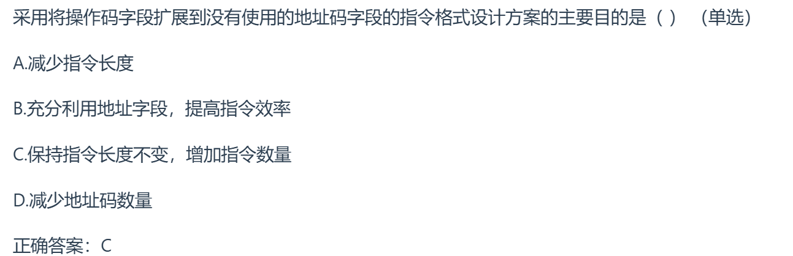

增加操作码，指示的指令数量增加

# 174.指令数量与操作码位数

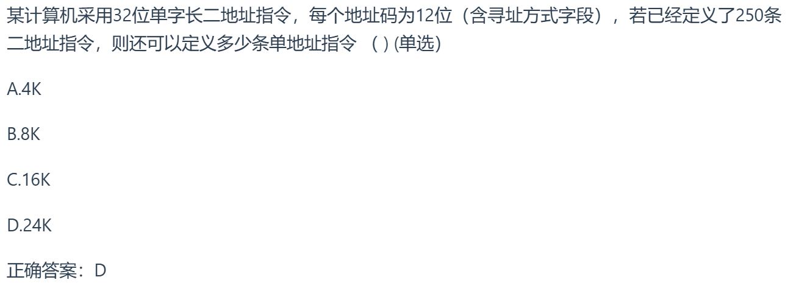

1. 首先计算二地址指令操作码的位数：
- 已知指令字长为32位，每个地址码为12位。
- 对于二地址指令，操作码的位数 = 32-12 - 12=8位。
- 这是因为指令字长由操作码和地址码组成，二地址指令有两个地址码，所以用指令字长减去两个地址码的长度就得到操作码的长度。
2. 然后确定二地址指令的数量上限：
- 操作码有8位，那么二地址指令最多可以有2^8 = 256条。
- 因为n位操作码最多可以表示2^n条不同的指令。
3. 接着计算还能用于单地址指令操作码扩展的位数：
- 已经定义了一些二地址指令，这里我们假设已经定义了x条二地址指令（题目中虽未明确具体已定义数量，但原理相同）。
- 那么操作码未使用的组合数为2^8 - x。
- 在这个题目中，如果假设所有256条二地址指令的操作码都被定义完（即x = 256），则没有剩余的操作码组合可用于单地址指令扩展（这是一种极端情况，实际上题目没有明确已定义数量，只是为了演示计算过程）。
- 但如果假设已经定义了y条二地址指令（y<256），例如这里已经定义了y = 250条二地址指令（参考相似题假设情况以便计算）。
- 那么剩余用于单地址指令操作码扩展的组合数为2^8 - 250=6。

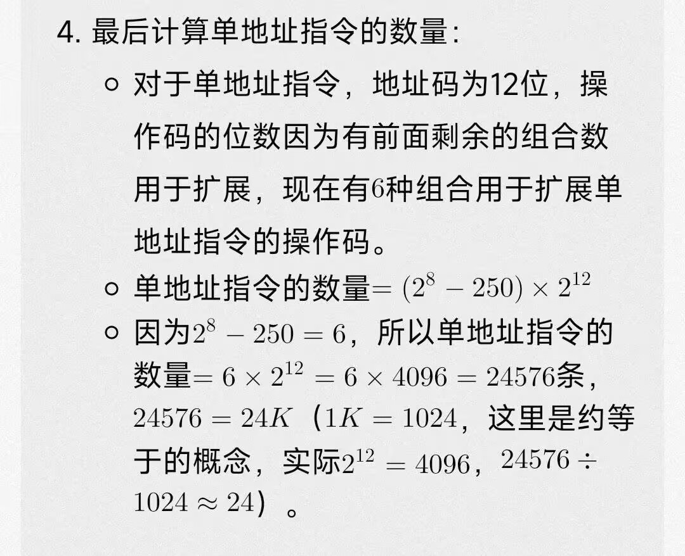

**关键:用单地址相当于操作码位数多了12位**

# 175.寻址方式选择

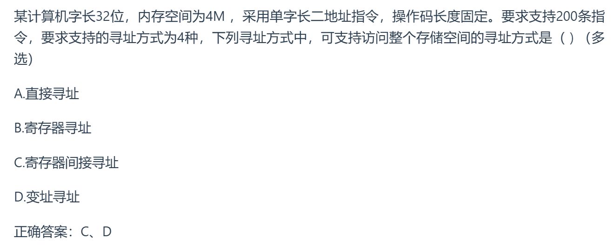

直接寻址：直接寻址中，指令中包含操作数的地址。由于指令长度固定为32位，且操作码和操作数地址共占用了部分位数，直接寻址的地址部分最多为16位，因此可以直接寻址的范围为 
2 ^16

，即64K字节，无法覆盖整个4M的内存空间。
寄存器寻址：寄存器寻址使用寄存器中的值作为操作数，寄存器的数量通常远小于内存地址，因此寄存器寻址无法访问整个存储空间。
寄存器间接寻址：寄存器间接寻址通过寄存器中的值作为地址，可以访问整个存储空间，因为寄存器中的值可以指向内存中的任意位置。
变址寻址：变址寻址通过基地址寄存器和变址寄存器的值相加来访问内存，可以访问整个存储空间，因为基地址寄存器和变址寄存器的组合可以覆盖整个内存空间。

# 176.指令长度

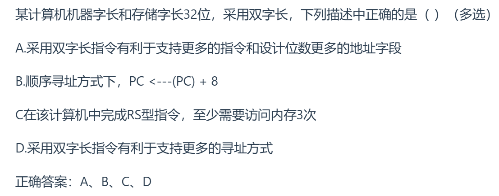选项C：在该计算机中完成RS型指令，至少需要访问内存3次。

- RS型指令涉及寄存器-存储器操作，通常需要从内存中读取操作数，并将结果写回内存。
- 至少需要3次内存访问：一次读取操作数，一次写入结果，还有一次读取指令。
  因此，选项C正确。

# 177.MIPS

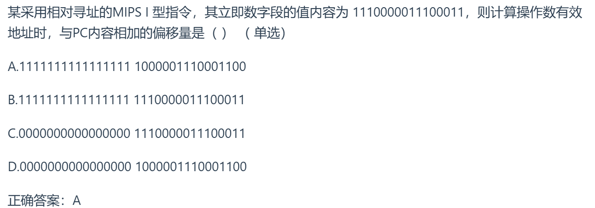

# MIPS:

在MIPS架构中，相对寻址是一种常见的寻址方式，用于计算分支指令和跳转指令的目标地址。在MIPS的相对寻址中，立即数字段表示的是字偏移量

在 MIPS 的相对寻址中，立即数字段表示 **字偏移量**，需要乘以 4（即左移 2 位），因为 MIPS 的地址是按字（4 字节）对齐的。

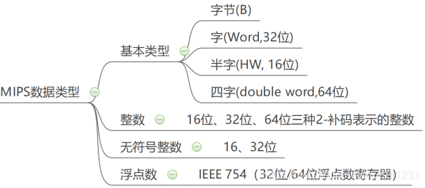

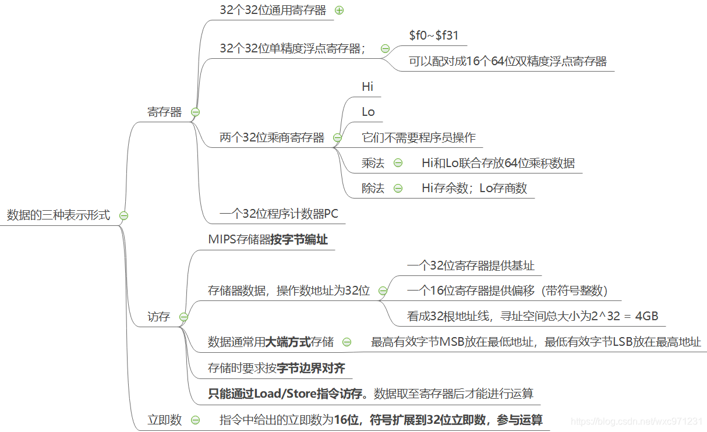

MIPS（Microprocessor without Interlocked Pipeline Stages）是一种RISC（精简指令集）体系结构，它的指令集设计简洁高效，所有指令长度固定为**32位**。MIPS指令类型主要分为三类：**R型、I型和J型**。以下是详细解释：

------

## **1. R型指令（Register Type）**

### **特点：**

- 用于寄存器间的操作（例如算术运算、逻辑运算、移位等）。
- 操作数和结果都存储在寄存器中。
- 指令格式包含6个字段，总计32位。

### **格式：**

[op (6)] [rs (5)] [rt (5)] [rd (5)] [shamt (5)] [funct (6)]\text{[op (6)]} \, \text{[rs (5)]} \, \text{[rt (5)]} \, \text{[rd (5)]} \, \text{[shamt (5)]} \, \text{[funct (6)]}

| 字段    | 长度 | 描述                                                       |
| ------- | ---- | ---------------------------------------------------------- |
| `op`    | 6    | 操作码字段，指定指令类型，R型指令中通常为 `000000`。       |
| `rs`    | 5    | 源寄存器 1 的地址。                                        |
| `rt`    | 5    | 源寄存器 2 的地址。                                        |
| `rd`    | 5    | 目标寄存器的地址，存储运算结果。                           |
| `shamt` | 5    | 移位量字段，仅在移位指令中有效，用于指定左移或右移的位数。 |
| `funct` | 6    | 功能字段，结合 `op` 字段进一步指定指令的具体功能。         |

### **示例：加法指令**

指令：`add $t0, $t1, $t2`
 功能：将 `$t1` 和 `$t2` 的值相加，结果存储到 `$t0` 中。

二进制表示：

000000 01001 01010 01000 00000 100000000000 \, 01001 \, 01010 \, 01000 \, 00000 \, 100000

| 字段    | 值     | 解释                         |
| ------- | ------ | ---------------------------- |
| `op`    | 000000 | R型指令                      |
| `rs`    | 01001  | `$t1`（源寄存器 1）          |
| `rt`    | 01010  | `$t2`（源寄存器 2）          |
| `rd`    | 01000  | `$t0`（目标寄存器）          |
| `shamt` | 00000  | 移位量为 0（非移位指令）     |
| `funct` | 100000 | 指定为加法运算（`add` 功能） |

------

## **2. I型指令（Immediate Type）**

### **特点：**

- 用于需要立即数（常数）或内存访问的操作。
- 包括数据传输（`lw`/`sw`）、条件分支（`beq`/`bne`）和算术运算（带立即数的运算）。
- 指令格式包含6个字段，总计32位。

### **格式：**

[op (6)] [rs (5)] [rt (5)] [immediate (16)]\text{[op (6)]} \, \text{[rs (5)]} \, \text{[rt (5)]} \, \text{[immediate (16)]}

| 字段        | 长度 | 描述                                                       |
| ----------- | ---- | ---------------------------------------------------------- |
| `op`        | 6    | 操作码字段，指定指令类型。                                 |
| `rs`        | 5    | 源寄存器地址。                                             |
| `rt`        | 5    | 目标寄存器地址，存储运算结果或加载数据。                   |
| `immediate` | 16   | 立即数（常数）或偏移量，用于计算有效地址或提供直接运算值。 |

### **示例1：加载字（`lw`）指令**

指令：`lw $t0, 4($t1)`
 功能：从 `$t1` 地址偏移量为 `4` 的内存单元加载数据到 `$t0`。

二进制表示：

100011 01001 01000 0000000000000100100011 \, 01001 \, 01000 \, 0000 0000 0000 0100

| 字段        | 值                  | 解释                  |
| ----------- | ------------------- | --------------------- |
| `op`        | 100011              | 加载字指令（`lw`）。  |
| `rs`        | 01001               | `$t1`（基址寄存器）。 |
| `rt`        | 01000               | `$t0`（目标寄存器）。 |
| `immediate` | 0000 0000 0000 0100 | 偏移量为 `4`。        |

------

### **示例2：条件分支（`beq`）指令**

指令：`beq $t1, $t2, label`
 功能：如果 `$t1 == $t2`，跳转到 `label`。

二进制表示：

000100 01001 01010 偏移量000100 \, 01001 \, 01010 \, \text{偏移量}

------

## **3. J型指令（Jump Type）**

### **特点：**

- 用于跳转指令，直接改变程序执行的控制流。
- 指令格式包含3个字段，总计32位。

### **格式：**

[op (6)] [address (26)]\text{[op (6)]} \, \text{[address (26)]}

| 字段      | 长度 | 描述                                                |
| --------- | ---- | --------------------------------------------------- |
| `op`      | 6    | 操作码字段，指定跳转指令类型（例如 `j` 或 `jal`）。 |
| `address` | 26   | 目标地址，拼接PC高4位和`00`后计算绝对跳转地址。     |

### **示例：跳转（`j`）指令**

指令：`j 10000`
 功能：跳转到地址 `10000`。

二进制表示：

000010 目标地址（26位）000010 \, \text{目标地址（26位）}

------

## **MIPS指令类型总结：**

| **指令类型** | **用途**                     | **字段数量** | **操作码（`op`） | **目标操作数**                |
| ------------ | ---------------------------- | ------------ | ---------------- | ----------------------------- |
| **R型**      | 寄存器间操作（算术、逻辑等） | 6            | `000000`         | 3个寄存器（`rs`、`rt`、`rd`） |
| **I型**      | 立即数、条件分支、内存访问   | 4            | 指令特定值       | 1寄存器+立即数或偏移量        |
| **J型**      | 跳转操作                     | 2            | 指令特定值       | 目标地址                      |

MIPS 的简洁性使得指令类型少，但功能覆盖广泛，非常适合硬件实现和流水线设计。

# 178.MIPS

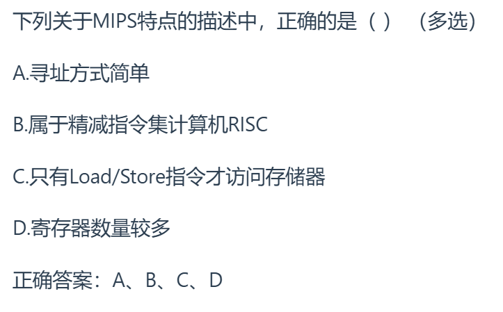

# 179.MIPS

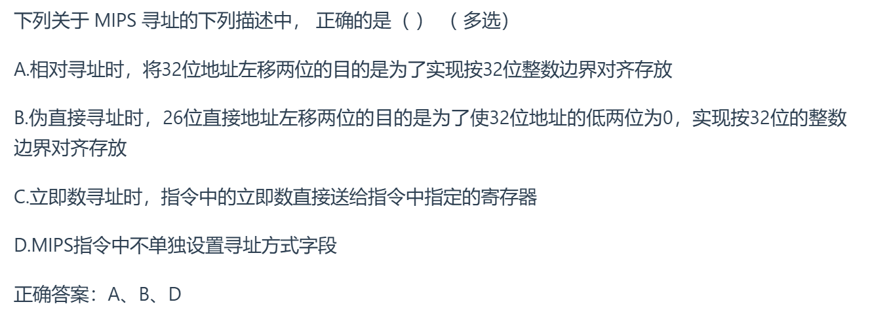

# 180.指令类型

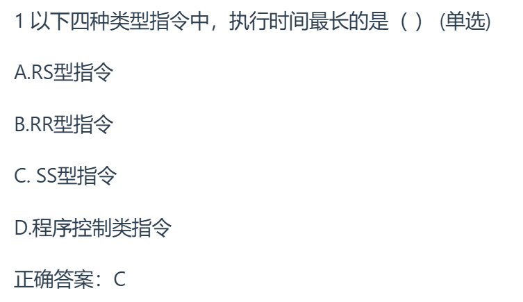

- RS型指令（Register-Storage）：此类指令需要访问寄存器和存储器，通常执行时间较长。
- RR型指令（Register-Register）：此类指令仅在寄存器之间操作，执行速度最快。
- SS型指令（Storage-Storage）：此类指令涉及存储器与存储器之间的数据传输，通常需要多次访存，执行时间最长。
- 程序控制类指令：这类指令主要用于控制程序的执行流程，如跳转指令，虽然可能会改变程序执行顺序，但相对而言，执行时间通常不会是最长。

因此，通过对比，SS型指令由于涉及存储器与存储器之间的数据传输，需要多次访存，导致其执行时间最长。

# 181.指令类型

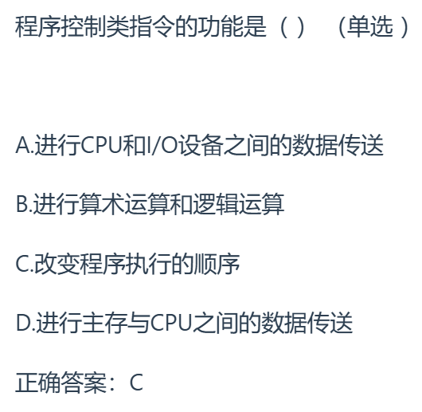

1. **数据传送类指令**：用于在寄存器之间、寄存器与存储器之间传送数据，实现数据的移动和存储。
2. **算术逻辑类指令**：用于执行各种算术运算（如加法、减法、乘法、除法）和逻辑运算（如与、或、非、异或等）。
3. **程序控制类指令**：用于改变程序执行的顺序，包括条件跳转、无条件跳转、子程序调用和返回等。

根据上述定义，程序控制类指令的主要功能是改变程序执行的顺序，而不是进行算术运算和逻辑运算，也不是进行数据传送。

选项A：进行算术运算和逻辑运算，这是算术逻辑类指令的功能，故A错误。
选项B：进行主存与CPU之间的数据传送，这是数据传送类指令的功能，故B错误。
选项C：进行CPU和I/O设备之间的数据传送，这也是数据传送类指令的功能，故C错误。
选项D：改变程序执行的顺序，这是程序控制类指令的功能，故D正确。

# 182.寻址方式


**在许多指令集中，累加器通常被用作隐含的第二操作数地址**。这意味着在执行单地址指令的算术运算时，一个操作数明确由指令的地址码指出，而另一个操作数则默认使用累加器，无需在指令中显式给出。这种设计有助于缩短指令字长，因为不需要为每个指令都明确指定两个操作数的地址。

例如，在执行加法操作时，一个操作数可以从内存或寄存器中读取，而另一个操作数则隐含在累加器中，计算结果也会存储回累加器。这种机制提高了计算机执行算术运算的效率，因为累加器的访问速度通常比内存快得多

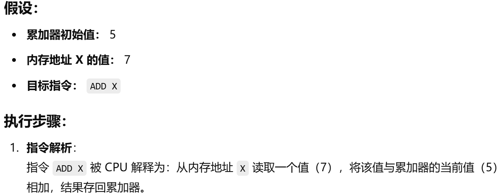

# 183.操作数存放地址


是操作数不是操作码

# 184.跳跃寻址

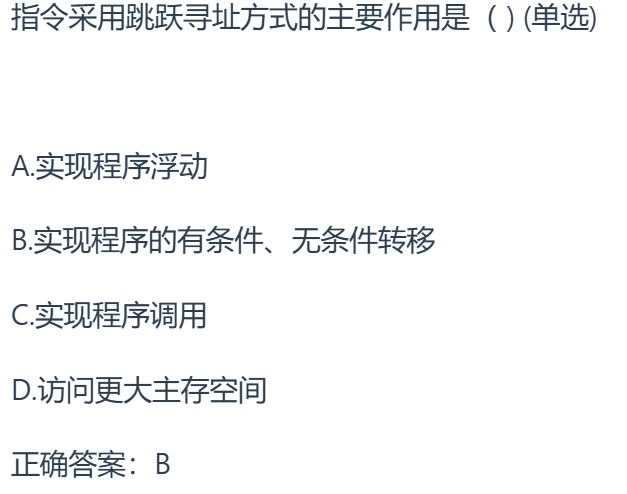

**跳跃寻址允许程序在执行过程中根据某些条件跳转到内存中的不同位置**，从而实现程序的**有条件或无条件转移**。这种方式在汇编和高级编程语言中都有应用，常见的控制转移指令包括JMP、CALL、RET等。

选项A：实现程序浮动

- 程序浮动是指程序在内存中的位置可以动态变化，这不是跳跃寻址的主要作用，故A错误。

选项B：访问更大主存空间

- 访问更大主存空间主要通过增加地址总线宽度或使用分页、分段技术，与跳跃寻址无直接关系，故B错误。

选项C：实现程序的有条件、无条件转移

- 跳跃寻址的主要作用就是通过转移类指令实现程序的有条件或无条件跳转，故C正确。

选项D：实现程序调用

- 虽然程序调用（如CALL指令）也涉及到跳转，但跳跃寻址更广泛地用于各种条件转移，不仅限于程序调用，故D不够准确。

# 185.寻址方式


# 186.（疑难）操作数有效地址判定

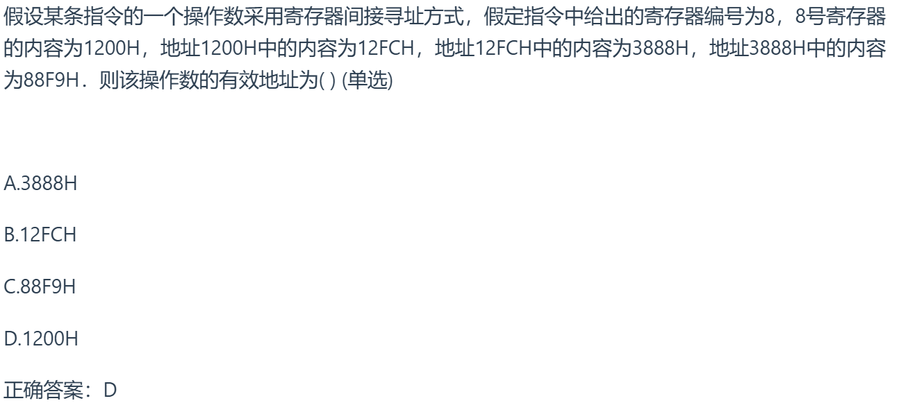

**寄存器间接寻址为两步，第二次寻到的即为操作数的有效地址**

**操作数对应的地址就是有效地址**

# 187.（疑难）操作数判定

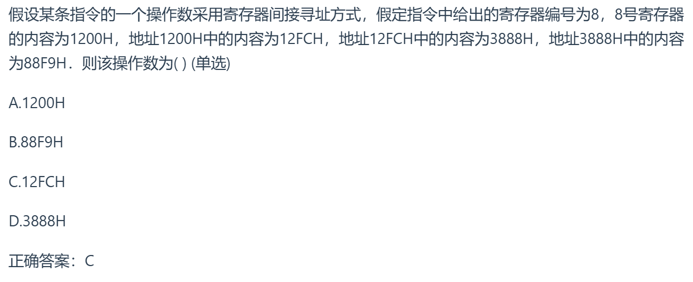

同上

# 188.（疑难）基址寻址计算

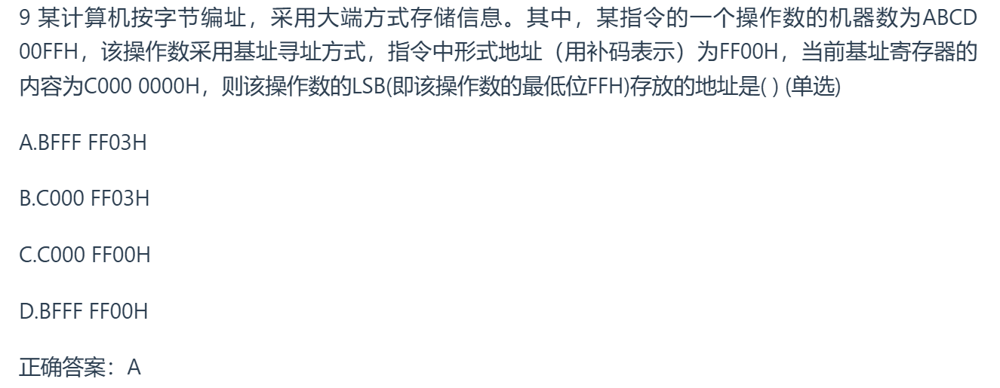

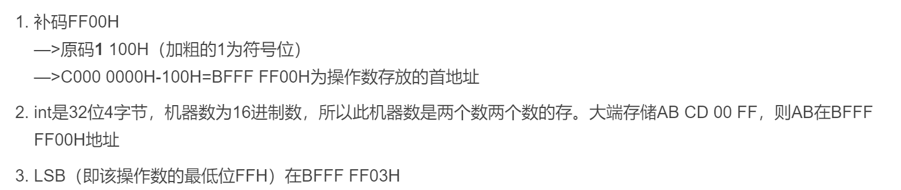

按字节编址，每多一个字节，16进制地址加1

# 189.寻址方式判断


# 190.地址码字段

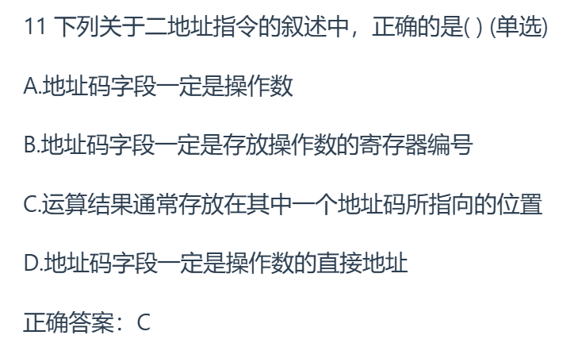

详见地址码概述

# 191.指令长度

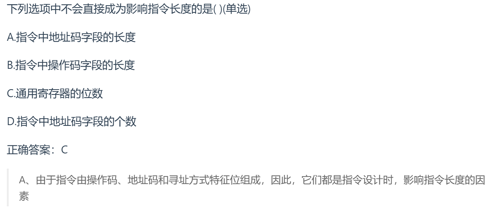

# 192.寻址方式

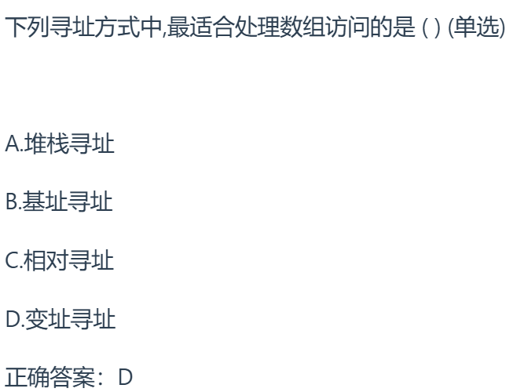

- **堆栈寻址**：主要用于管理函数调用和本地变量的存储，适用于需要快速进栈和出栈的操作，不适合处理数组访问。
- **变址寻址**：通过变址寄存器加上基地址来生成有效地址，这种方式非常适合数组访问。因为数组的元素可以通过数组首地址和偏移量（变址）来计算出具体元素的地址。
- **相对寻址**：主要用于指令执行中的跳转操作，基于当前指令地址进行相对偏移，不适合处理数组访问。
- **基址寻址**：类似于变址寻址，通过基址寄存器加上某个偏移量来生成有效地址。但基址寻址通常用于动态内存分配和管理，不如变址寻址直接适用于数组访问。

# 变址寻址和基址寻址

### **对比：**

| **特性**     | **变址寻址**                 | **基址寻址**                   |
| ------------ | ---------------------------- | ------------------------------ |
| **基地址**   | 固定，由指令的地址字段指定   | 变化，由基址寄存器指定         |
| **偏移量**   | 存储在变址寄存器中，动态变化 | 存储在指令中，通常固定         |
| **使用场景** | 数组、循环等动态访问         | 程序段、数据段等分段访问       |
| **动态性**   | 变址寄存器的值可以动态修改   | 偏移量通常固定，基址寄存器变化 |
| **复杂度**   | 偏高，适合处理复杂动态场景   | 较低，适合段内访问             |

### **对比：**

| **特性**       | **基地址固定**                 | **基地址变化**                   |
| -------------- | ------------------------------ | -------------------------------- |
| **动态性**     | 基地址在程序运行期间固定不变   | 基地址在程序运行期间可动态调整   |
| **实现复杂度** | 较低，实现简单                 | 较高，需要额外逻辑动态调整       |
| **访问灵活性** | 灵活性低，仅能访问固定内存区域 | 灵活性高，可访问不同内存区域     |
| **适用场景**   | 单任务、简单内存管理系统       | 多任务、分段内存管理、多用户系统 |
| **性能**       | 高性能（无动态调整开销）       | 性能稍低（有动态调整开销）       |

# 193.地址指令

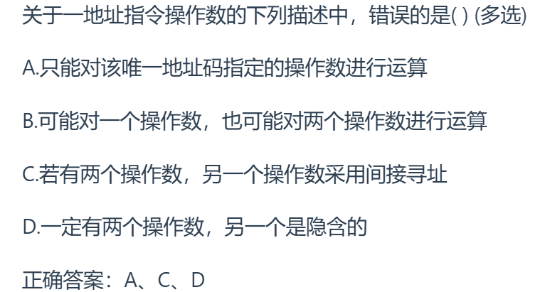


1. 对于选项C：
- 一地址指令操作数中，如果有两个操作数，另一个操作数采用间接寻址这种说法是错误的。一地址指令格式中只有一个地址码字段，这个地址码指定一个操作数，当有两个操作数时，另一个操作数往往是**隐含指定**的（例如累加器），而不是通过间接寻址来表示另一个操作数。
2. 对于选项A：
- 一地址指令不是只能对唯一地址码指定的操作数进行运算，存在隐含操作数的情况，所以A错误。
3. 对于选项D：
- 一地址指令不一定有两个操作数，可能只有一个操作数参与运算，说一定有两个操作数（另一个隐含）是错误的。
4. 对于选项B：
- 一地址指令操作数可能是一个操作数运算，也可能存在隐含操作数从而是两个操作数的运算，B正确。

所以错误的选项是A、C、D。

考察一地址隐含操作

# 194.指令格式

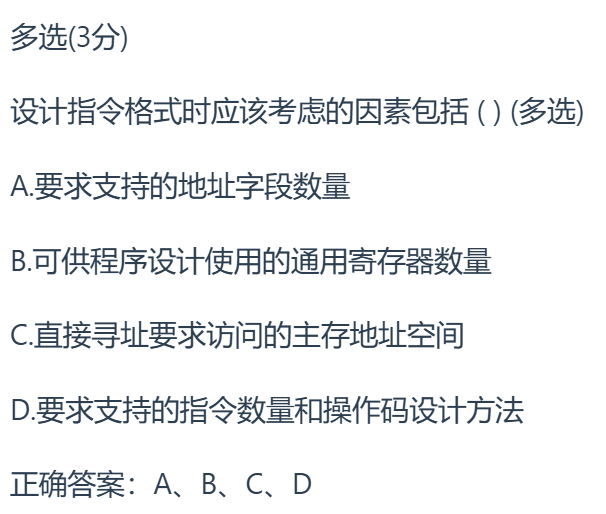

# 195.寻址方式

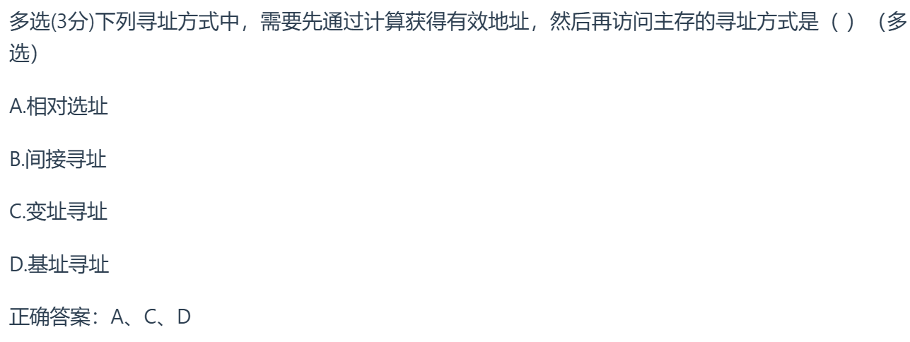

# 196.立即寻址

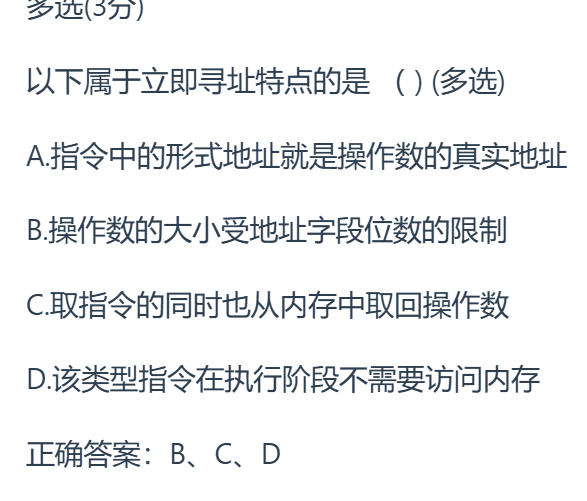

# 197.变址寻址计算

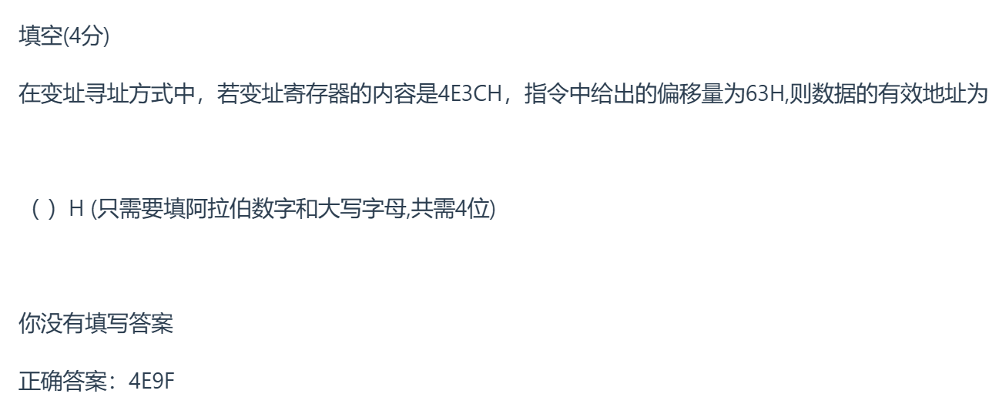

加法计算

# 198.相对寻址计算


相对寻址的地址码字段是偏移量

此处偏移量是-7，用补码补全8位是 1111 0111   对应十六进制F7

# 199.MIPS计算（记住4字节对齐）

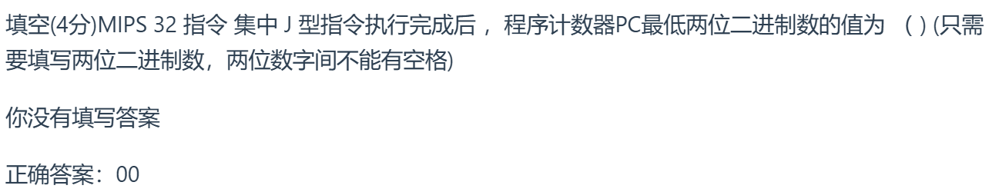

MIPS 32指令集是一种精简指令集计算机（RISC）架构，其中J型指令用于跳转操作。J型指令的格式是用于实现无条件跳转的，它通过将目标地址的高16位与程序计数器（PC）的低16位组合来计算跳转地址。在执行J型指令时，程序计数器（PC）的最低两位总是被设置为00，以确保跳转到正确的地址。这是因为J型指令的跳转地址计算方式是将目标地址的高16位与当前PC的低16位拼接起来，形成一个完整的32位地址。具体来说，J型指令的执行过程如下：

当执行J型指令时，程序计数器（PC）的值被左移两位，然后与目标地址的高16位拼接，形成新的PC值。
由于PC的最低两位被设置为00，这样可以确保跳转到目标地址的地址空间是4字节对齐的，这是MIPS架构的一个特点，以保证指令的正确执行和内存访问的效率。
因此，J型指令执行完成后，程序计数器（PC）的最低两位二进制数的值总是00。

因此答案是：00。

# 200.CPU部件

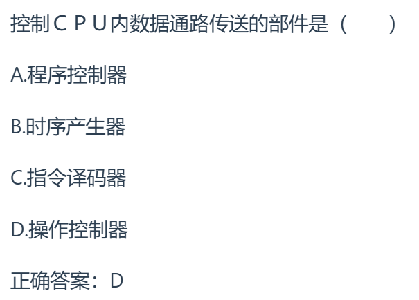

在本题中，我们需要确定是哪个部件控制CPU内的数据通路传送。计算机的中央处理器（CPU）主要由运算器和控制器两大核心部件组成。控制器又包括以下几个部分：

程序计数器（PC）：用于存放即将执行的指令的地址。
指令寄存器（IR）：用于存放当前正在执行的指令。
指令译码器（ID）：用于对指令进行译码，确定指令的操作类型和操作数。
状态/条件寄存器（SR）：用于存放运算结果的状态或条件，如零标志、进位标志等。
时序产生器：用于产生定时信号，控制指令的执行顺序。
**操作控制器（OC）：用于产生各种操作控制信号，指挥各部件协调工作。**
其中，操作控制器（OC）负责产生控制信号，指挥各部件按照指令执行，控制数据在CPU内的数据通路传送。因此，控制CPU内数据通路传送的部件是操作控制器。

通过上述分析，可以确定选项D（操作控制器）是正确答案。

# 201.CPU部件

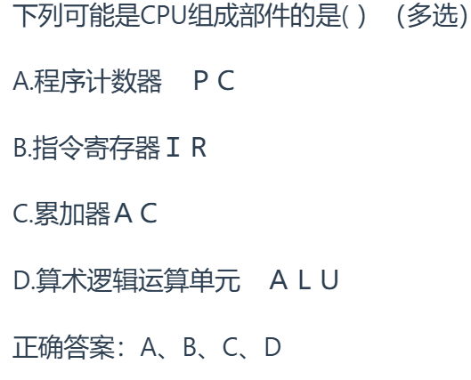

# 202.CPU功能

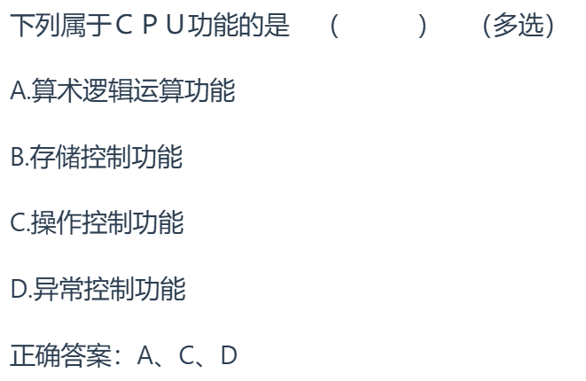

# 203.程序计数器

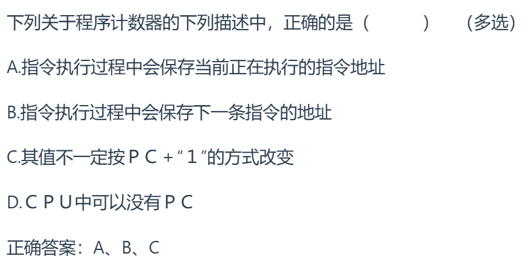

# 程序计数器（PC）

**程序计数器（Program Counter, PC）\**是计算机中央处理器（CPU）中的一个关键寄存器，用于存储\**下一条指令的地址**。它是控制程序执行流程的核心组件，决定了指令的执行顺序。程序计数器通常随着程序的执行自动更新，以保持程序的顺序流控制。

------

## **程序计数器的作用**

1. **指向下一条指令：**
   - 程序计数器保存的是将要执行的下一条指令的内存地址。
   - CPU 通过读取程序计数器中的地址从内存取出指令，并加载到指令寄存器（Instruction Register, IR）中。
2. **顺序执行：**
   - 在顺序执行的情况下，程序计数器的值在每次取指令后会自动递增（例如 +1 或根据指令长度递增）。
3. **跳转控制：**
   - 在遇到跳转指令（如条件跳转或无条件跳转）时，程序计数器会根据跳转目标地址直接更新为目标地址的值。
   - 通过修改程序计数器的值，可以实现程序的分支、循环和函数调用。
4. **中断处理：**
   - 当发生中断时，程序计数器的值会保存到特定的寄存器或堆栈中，以便在中断处理完成后能够恢复执行被中断的程序。

------

## **程序计数器的工作过程**

以下是程序计数器在执行指令时的典型工作过程：

1. **指令取出（Fetch）：**
   - CPU 读取程序计数器中的值，作为下一条指令的地址，从内存中取出该指令。
2. **递增程序计数器：**
   - 程序计数器的值自动递增，指向下一条指令。
   - 递增的步长通常由指令字的长度决定（例如，如果指令字长为 4 字节，则递增 4）。
3. **跳转或分支：**
   - 当执行跳转指令时，程序计数器的值被更新为跳转目标地址，指向新指令。
4. **异常或中断：**
   - 如果发生中断或异常，当前程序计数器的值会被保存，以便中断处理完成后能够恢复执行。

------

## **程序计数器的特性**

1. **自动更新：**
   - 在顺序执行中，程序计数器的值通常是自动递增的。
2. **直接修改：**
   - 遇到跳转、分支、函数调用等指令时，程序计数器的值可以被直接修改。
3. **唯一性：**
   - 程序计数器在某一时刻只指向唯一的下一条指令地址。
4. **速度要求高：**
   - 程序计数器需要快速地更新和提供地址，以匹配 CPU 的高速执行需求。

------

## **程序计数器的用途**

1. **控制程序执行顺序：**
   - 确保指令按照逻辑顺序或跳转顺序执行。
2. **支持分支与循环：**
   - 跳转和条件判断指令通过修改程序计数器的值实现分支逻辑和循环控制。
3. **中断与异常处理：**
   - 程序计数器保存的当前指令地址能够支持中断的保存和恢复。

------

## **程序计数器的实现细节**

1. **寄存器形式：**
   - 在现代计算机中，程序计数器通常是 CPU 中的一个小型高速寄存器。
2. **位宽：**
   - 程序计数器的位宽决定了可寻址的内存范围。例如，32 位程序计数器可以寻址 4GB 内存，而 64 位程序计数器可以寻址更大的内存空间。
3. **与流水线的关系：**
   - 在流水线结构的 CPU 中，程序计数器的值可能在不同流水线阶段被预测和更新，以提高执行效率。

------

## **程序计数器的例子**

### **顺序执行：**

假设指令存储在内存地址 0x1000、0x1004、0x1008：

1. 初始程序计数器值为 0x1000。
2. CPU 从 0x1000 取指令后，程序计数器递增为 0x1004。
3. CPU 继续从 0x1004 取指令，程序计数器递增为 0x1008。

### **跳转指令：**

假设当前程序计数器为 0x1008，遇到跳转指令 `JUMP 0x2000`：

1. CPU 执行跳转，程序计数器的值被更新为 0x2000。
2. 下一条指令从地址 0x2000 开始执行。

------

## **程序计数器的重要性**

1. **程序的执行驱动器：**
   - 程序计数器是程序顺序控制的核心，它指示 CPU 执行哪一条指令。
2. **实现控制流：**
   - 条件分支、循环和跳转等操作通过修改程序计数器实现。
3. **支持多任务：**
   - 在多任务操作系统中，每个任务都有一个独立的程序计数器，保证各任务可以正确切换和恢复。

------

总之，程序计数器是 CPU 中不可或缺的部分，负责指示程序执行的流程，并通过修改自身的值实现跳转和顺序控制。

# 数据通路概述

**数据通路（Datapath）**是计算机体系结构中用于实现指令执行的**硬件组件集合**，包括数据的传输和处理机制。数据通路是 CPU 的核心部分，与控制单元配合完成各种操作，如算术运算、逻辑运算、数据存储和加载、分支跳转等。

以下是数据通路的详细解释，包括其构成、功能及设计重点：

------

## **数据通路的组成**

数据通路由以下主要组件组成：

1. **寄存器文件（Register File）**：
   - 包含一组寄存器，用于存储临时数据和指令执行过程中需要使用的操作数。
   - 例如，在 MIPS 中，有 32 个通用寄存器，每个寄存器 32 位宽。
2. **算术逻辑单元（ALU, Arithmetic Logic Unit）**：
   - 负责执行算术和逻辑运算，例如加法、减法、逻辑与或、移位等。
   - ALU 是数据处理的核心组件。
3. **存储器（Memory）**：
   - 包括指令存储器（Instruction Memory）和数据存储器（Data Memory）。
   - 指令存储器存储程序代码，数据存储器存储运行时需要的数据。
4. **多路选择器（Multiplexer, MUX）**：
   - 控制信号根据操作需要选择数据通路上的输入源。
   - 例如，选择 ALU 的输入操作数，或选择跳转地址。
5. **扩展单元（Sign/Zero Extend Unit）**：
   - 用于将较短的数据（如 16 位立即数）扩展为 32 位，以匹配数据路径的宽度。
6. **程序计数器（PC, Program Counter）**：
   - 存储当前指令的地址，并在指令执行后自动更新为下一条指令的地址。
7. **指令寄存器（Instruction Register, IR）**：
   - 用于存储当前正在执行的指令。
8. **控制信号**：
   - 由控制单元（Control Unit）生成，用于管理数据通路中的操作，例如选择操作数、控制读写、选择下一条指令地址等。

------

## **数据通路的功能**

数据通路负责完成以下功能：

1. **指令取出（Instruction Fetch, IF）：**
   - 从指令存储器中取出当前需要执行的指令。
   - 由程序计数器（PC）指示指令地址。
   - PC 更新为下一条指令的地址。
2. **指令译码（Instruction Decode, ID）：**
   - 解析指令格式，提取操作码（opcode）、源操作数地址、目的操作数地址、立即数等信息。
   - 根据需要读取寄存器文件中的操作数。
3. **执行（Execute, EX）：**
   - 在 ALU 中执行算术或逻辑操作，或计算分支跳转的目标地址。
   - 如果是内存操作，计算访问的内存地址。
4. **访问内存（Memory Access, MEM）：**
   - 如果是加载指令（Load），从内存中读取数据。
   - 如果是存储指令（Store），将数据写入内存。
5. **写回（Write Back, WB）：**
   - 将计算结果写回寄存器文件，供后续指令使用。

------

## **数据通路的设计类型**

根据计算机指令执行的模式，数据通路可以分为以下几种类型：

### 1. **单周期数据通路（Single-Cycle Datapath）**

- 每条指令在一个时钟周期内完成。
- 特点：
  - 简单设计，但周期较长，因为所有指令必须在一个周期内完成。
  - 性能受最慢指令的限制。
- 用途：适用于教学模型或简单 CPU。

### 2. **多周期数据通路（Multi-Cycle Datapath）**

- 每条指令分多个周期执行，不同周期执行不同操作（取指、译码、执行等）。
- 特点：
  - 周期短，每个周期只需完成一部分操作。
  - 更高效，适合复杂指令集。
- 用途：现代 CPU 多采用多周期设计。

### 3. **流水线数据通路（Pipeline Datapath）**

- 将指令执行分为多个阶段，多个指令同时处于不同的执行阶段。
- 特点：
  - 提高指令吞吐量，执行效率更高。
  - 存在流水线冒险问题（数据冒险、控制冒险）。
- 用途：主流高性能 CPU 设计。

------

## **数据通路中的关键问题**

1. **数据冒险（Data Hazard）**：
   - 当指令间存在数据依赖时，后续指令可能需要等待前一条指令的执行结果。
   - 解决方法：
     - 数据前递（Forwarding）。
     - 插入气泡（Stall）。
2. **控制冒险（Control Hazard）**：
   - 跳转指令或分支指令导致程序计数器的目标地址不确定。
   - 解决方法：
     - 分支预测。
     - 延迟分支。
3. **结构冒险（Structural Hazard）**：
   - 当硬件资源被多个指令同时使用时发生冲突。
   - 解决方法：
     - 资源共享或增加硬件资源。

------

## **MIPS 数据通路示例**

MIPS 处理器是一种 RISC（精简指令集计算）体系结构，其数据通路设计非常经典：

- **取指阶段（IF）：**
  - 使用程序计数器（PC）指向当前指令地址。
  - 从指令存储器中读取指令。
- **译码阶段（ID）：**
  - 从寄存器文件中读取源操作数。
  - 通过扩展单元处理立即数。
- **执行阶段（EX）：**
  - 在 ALU 中进行操作数运算。
  - 或者计算分支跳转目标地址。
- **访存阶段（MEM）：**
  - 访问数据存储器（读或写）。
- **写回阶段（WB）：**
  - 将计算结果或从内存中读取的数据写回寄存器文件。

------

## **数据通路的优化策略**

1. **流水线设计：**
   - 将不同指令阶段并行化，提高指令吞吐量。
2. **分支预测：**
   - 减少控制冒险带来的性能损失。
3. **高速缓存（Cache）：**
   - 减少内存访问延迟，加快数据访问。
4. **分布式寄存器：**
   - 提高寄存器的访问效率。
5. **超标量（Superscalar）：**
   - 增加数据通路数量，允许多个指令同时执行。

------

总之，数据通路是实现计算机指令执行的核心组件，它与控制单元共同协作完成各种复杂的指令操作。高效的数据通路设计能够显著提高处理器的性能，是计算机体系结构的重点研究方向。

# 204.数据通路

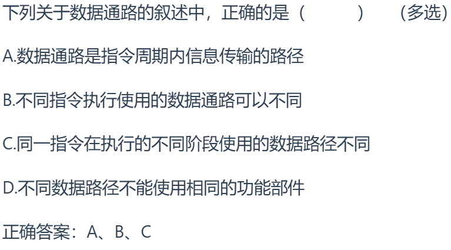

数据通路是指在指令周期内，指令执行过程中所经过的信息传输路径。它包括了寄存器、ALU（算术逻辑单元）、内部总线等功能部件。在指令的执行过程中，不同的指令类型和同一指令的不同执行阶段可能会使用不同的数据通路。

选项A：数据通路是指令周期内信息传输的路径。这是数据通路的基本定义，故A正确。
选项B：不同指令执行使用的数据通路可以不同。由于不同指令需要访问不同的硬件资源（如寄存器、存储器、ALU等），因此使用的数据通路可能不同，故B正确。
选项C：同一指令在执行的不同阶段使用的数据路径不同。例如，一条指令可能在取指阶段、译码阶段和执行阶段分别使用不同的数据通路，故C正确。
选项D：不同数据路径不能使用相同的功能部件。这是错误的，因为在某些情况下，不同的数据路径是可以共享相同的硬件资源的，故D错误。

# 205.数据通路

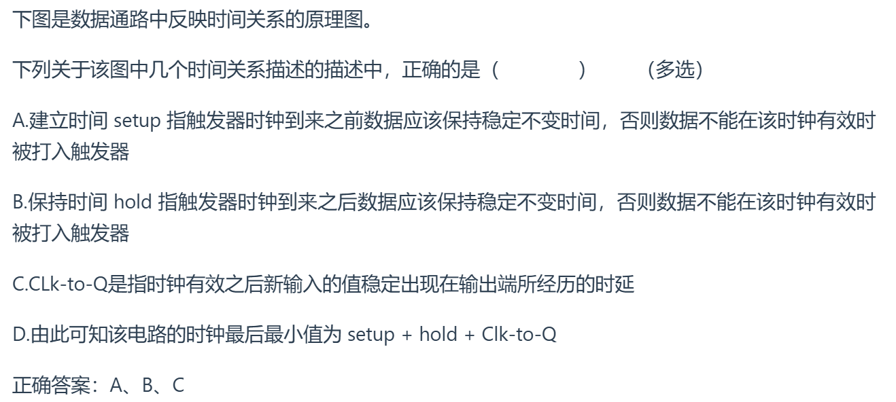

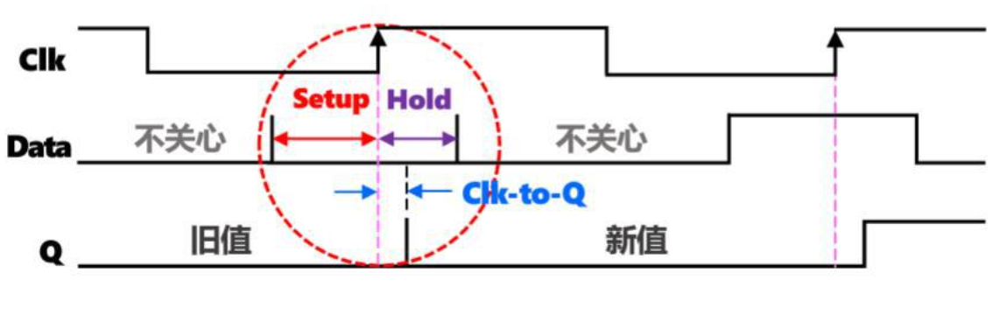

# 206.数据通路

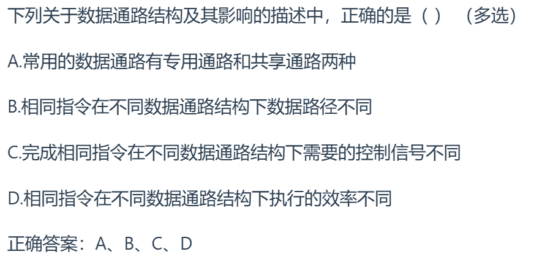

# 207.数据通路实例

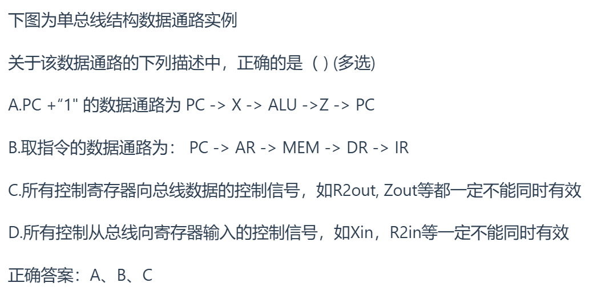

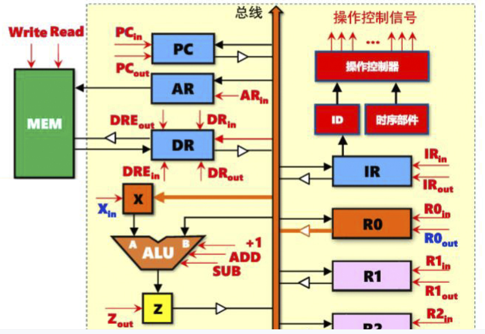

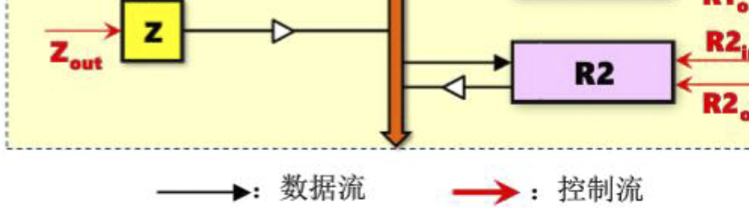

# 208.

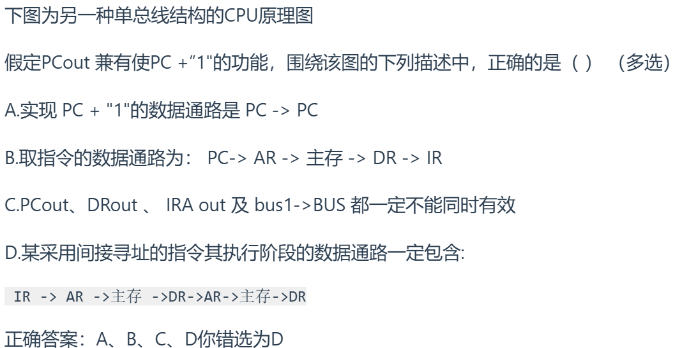

# 209.CPU结构

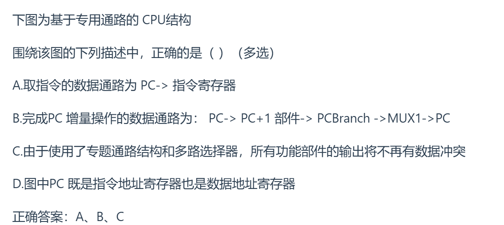

# 210.CPU结构

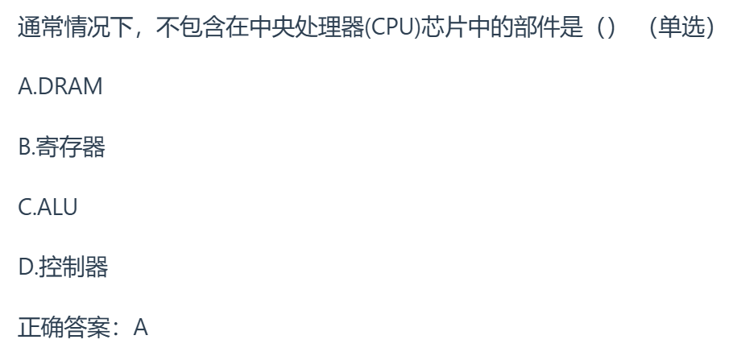

# 211.访问指令和数据

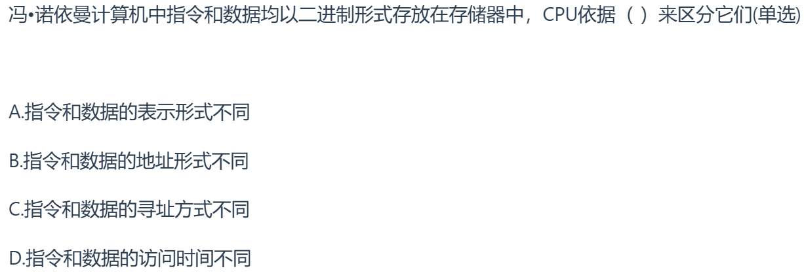

1. **指令和数据的表示形式不同**：这一点在冯·诺依曼体系结构中不成立，因为指令和数据都是二进制数，从表示形式上无法区分。
2. **指令和数据的寻址方式不同**：这一点也不成立，因为指令和数据都可以通过地址进行寻址，寻址方式没有本质区别。
3. **指令和数据的访问时间不同**：这一点是关键。CPU通过控制器在不同时间访问指令和数据：在取指令阶段，CPU从存储器中读取指令；在执行指令阶段，CPU从存储器中读取数据。通过区分访问时间，CPU可以有效地区分指令和数据。
4. **指令和数据的地址形式不同**：这一点也不成立，因为指令和数据都可以通过地址来访问，地址形式没有本质区别。

# 212.指令Z寄存器

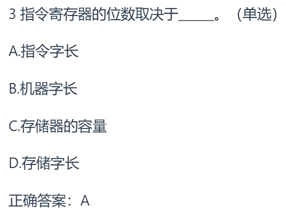

# 212.5.

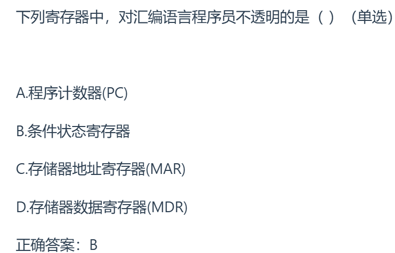

- 存储器地址寄存器（MAR）：用于存放当前正在访问的内存单元的地址。程序员通常可以通过汇编指令来间接操作它。
- 程序计数器（PC）：用于存放即将执行的下一条指令的地址。程序员可以通过跳转指令来改变它的值。
- 存储器数据寄存器（MDR）：用于存放从内存中读取的数据或者将要写入内存的数据。程序员可以通过数据传输指令来影响它的内容。
- 条件状态寄存器（CSR）：用于存放算术运算或逻辑运算后的状态信息，如进位、零、溢出等。程序员通常无法直接读取或写入该寄存器，而是通过指令执行过程中的条件码来间接利用它的状态。

# 透明：可以直接操控调用，函数库

# 不透明：不可以直接调用、

# 213.PC位数

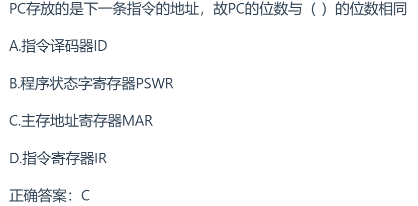

# 214.PC增量

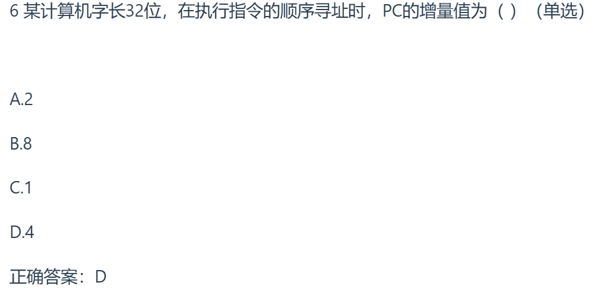

32位，4字节，一次加4

# 215.时钟

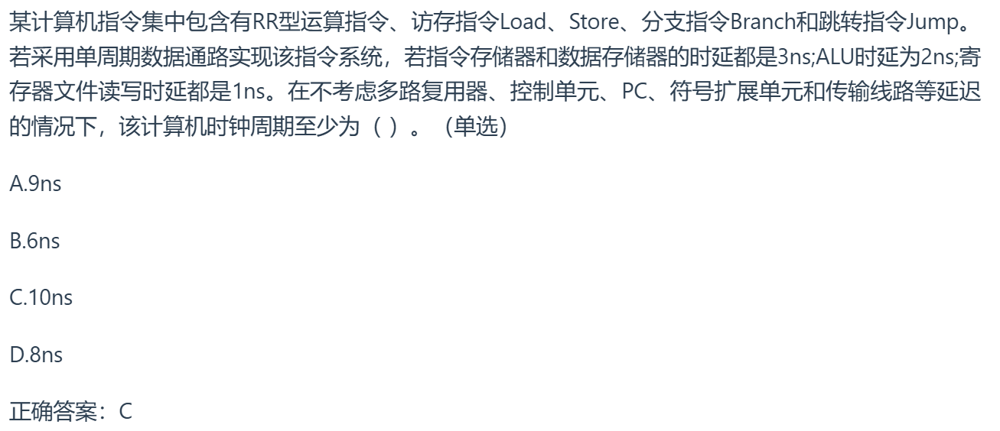

使最耗时的指令能在一个时钟周期内完成即可

访存指令最耗时:访问指令存储器（3）->读操作（1）->ALU（2）->访问数据存储器（3）->寄存器写操作（1）

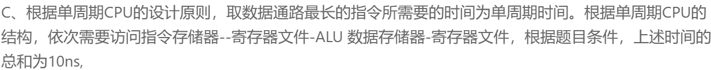

# 216.执行流程

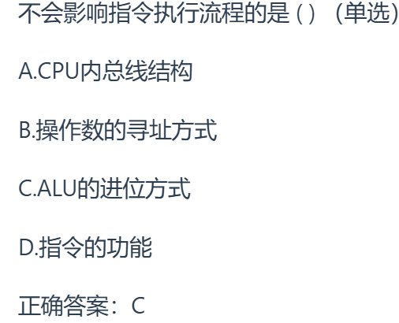

# 217.异常处理


选项A：缺页故障

- 当程序访问一个不在主存中的页面时，会发生缺页故障。此时，程序无法继续执行，需要操作系统通过缺页处理程序将所需页面调入主存，因此需要异常处理。

选项B：访问Cache缺失

- 当访问Cache缺失时，所需数据不在Cache中，但程序仍然可以继续执行，只需从主存中读取所需数据。这种情况下，程序不会中断，不需要异常处理程序进行处理。

选项C：地址越界

- 地址越界是指程序访问的地址超出了其允许的地址空间。这是非法操作，会导致程序异常，需要操作系统进行处理。

选项D：除数为0

- 除数为0是不合法的操作，会导致程序中断，需要异常处理程序进行处理，以防止程序崩溃。

综上所述，只有选项B的情况不需要异常处理程序进行中断处理，因为程序仍然可以继续执行

# 218.Cache缺失

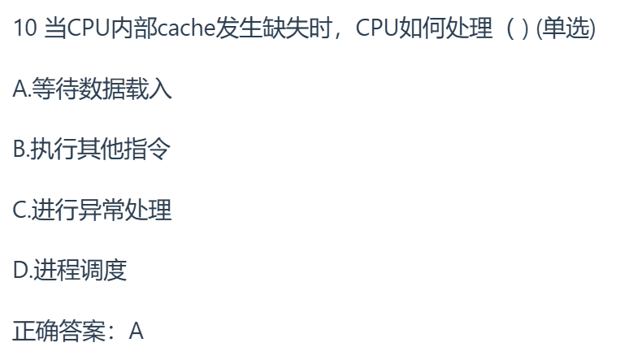

当CPU内部cache发生缺失时，CPU会采取一定的处理措施来应对这种情况。Cache缺失是指CPU在执行指令时，所需的数据不在高速缓存中，需要从内存中读取数据。具体处理步骤如下：

检测缺失：当CPU在访问数据时，如果发现所需数据不在cache中，会触发一个cache缺失事件。
等待数据载入：CPU会暂停当前的指令执行，等待所需数据从内存中载入到cache中。这个过程可能需要较长时间，因为内存的访问速度远慢于cache，因此会导致CPU的性能下降。
数据载入：系统会将缺失的数据从内存中读取到cache中，以供后续使用。
继续执行：一旦数据被载入到cache中，CPU会继续执行被暂停的指令。
这种处理方式是为了提高数据访问速度，减少CPU等待时间，提高整体系统性能。虽然在发生cache缺失时会有一定的延迟，但通过将数据从内存载入到cache中，可以**减少未来访问相同数据时的延迟时间**。

# 219.控制器部件

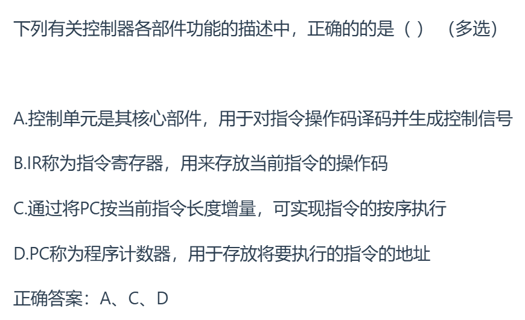

指令寄存器（Instruction Register, IR）用于存放当前正在执行的指令的完整内容，而不仅仅是操作码。IR不仅存放操作码，还存放操作数等其他信息。

# 220.指令操作部件

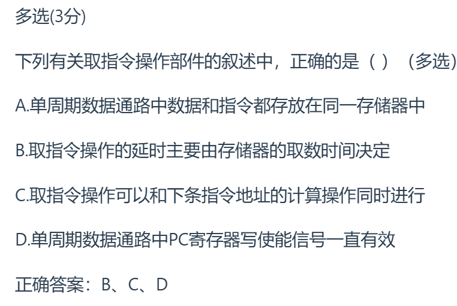


# 221.指令周期

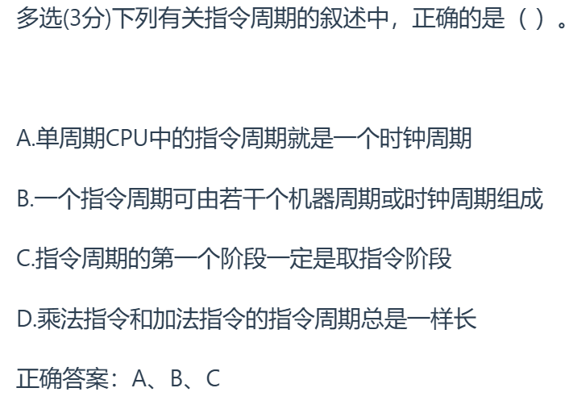

指令周期是CPU执行一条指令所需的时间，它通常包括取指令、分析指令和执行指令等多个阶段。每个指令周期可能会包含多个机器周期或时钟周期。

选项A：指令周期的第一个阶段一定是取指令阶段。

正确。在指令周期中，首先需要从存储器中取出要执行的指令，这是指令周期的第一个阶段。
选项B：乘法指令和加法指令的指令周期总是一样长。

错误。不同指令的执行步骤和复杂度不同，因此它们的指令周期长度可能不同。例如，乘法指令通常比加法指令复杂，需要更多的时间来完成。
选项C：一个指令周期可由若干个机器周期或时钟周期组成。

正确。一个指令周期可能包含多个机器周期或时钟周期，具体取决于指令的复杂度和CPU的设计。
选项D：单周期CPU中的指令周期就是一个时钟周期。

正确。在单周期CPU中，每条指令的执行都在一个时钟周期内完成，因此一个指令周期就是一个时钟周期。
综上所述，选项A、C和D的叙述是正确的。

故答案为: ACD

# 指令周期概述

**指令周期**是计算机执行一条指令所需的全部时间，是计算机操作的重要基础。指令周期由多个阶段组成，每个阶段完成指令的特定子任务。这些阶段包括**取指令、指令译码、执行、访存和写回**。理解指令周期对学习计算机体系结构至关重要。

------

## **指令周期的组成**

一条指令的完整执行过程可以分为以下几个阶段：

### **1. 取指令（Instruction Fetch, IF）**

- **任务**：从主存或指令存储器中取出当前需要执行的指令。

- 关键组件

  ：

  - **程序计数器（PC）**：存储当前指令的地址。
  - **指令存储器**：存放程序指令。

- 流程

  ：

  1. PC 指向当前指令地址。
  2. 取出指令并将其放入指令寄存器（IR）。
  3. PC 增加或更新到下一条指令的地址。

------

### **2. 指令译码（Instruction Decode, ID）**

- **任务**：解析指令，识别操作码、操作数及操作类型。

- 关键组件

  ：

  - **操作码（Opcode）**：指示指令的功能（如加法、乘法、跳转等）。
  - **操作数地址**：指示操作数位置（寄存器、内存或立即数）。

- 流程

  ：

  1. 提取指令的操作码。
  2. 根据地址字段，从寄存器文件读取操作数。
  3. 对立即数进行符号扩展（如果需要）。

------

### **3. 执行（Execute, EX）**

- **任务**：根据操作码执行相应的运算或逻辑操作。

- 关键组件

  ：

  - **算术逻辑单元（ALU）**：执行算术和逻辑运算。
  - **控制信号**：决定 ALU 的操作类型。

- 流程

  ：

  1. 将操作数送入 ALU。
  2. 由 ALU 执行操作（如加减法、逻辑与或、移位等）。
  3. 若是分支指令，计算目标地址。

------

### **4. 访存（Memory Access, MEM）**

- **任务**：根据指令要求，对数据存储器进行读取或写入。

- 关键组件

  ：

  - **数据存储器**：存放程序运行时的数据。
  - **地址生成单元**：生成内存地址。

- 流程

  ：

  1. 如果是加载（Load）指令，从内存中读取数据到寄存器。
  2. 如果是存储（Store）指令，将寄存器中的数据写入内存。
  3. 如果指令不涉及访存，直接跳过。

------

### **5. 写回（Write Back, WB）**

- **任务**：将计算结果或从内存中读取的数据写回寄存器文件，供后续指令使用。

- 关键组件

  ：

  - **寄存器文件**：存放指令执行的中间和最终结果。

- 流程

  ：

  1. 将 ALU 的计算结果或内存读取的数据写入目标寄存器。
  2. 准备执行下一条指令。

------

## **指令周期的执行模式**

### **1. 单周期执行**

- **特点**：每条指令在一个时钟周期内完成。

- 优点

  ：

  - 设计简单。

- 缺点

  ：

  - 处理器的时钟周期受到最慢指令的限制，效率低。

### **2. 多周期执行**

- **特点**：将指令周期分为多个时钟周期完成。

- 优点

  ：

  - 时钟周期短，每个周期只需完成一部分操作。
  - 整体效率更高。

- 缺点

  ：

  - 控制逻辑复杂。

### **3. 流水线执行**

- **特点**：多个指令分阶段并行执行，提高吞吐量。

- 优点

  ：

  - 提高执行效率。

- 缺点

  ：

  - 可能出现流水线冒险（数据冒险、控制冒险）。

------

## **指令周期的优化方法**

1. **流水线设计**：
   - 通过同时执行多条指令的不同阶段，提高指令吞吐量。
2. **高速缓存（Cache）**：
   - 减少访存的延迟，加快指令取出和数据访问速度。
3. **分支预测**：
   - 通过预测程序分支走向，减少跳转指令的控制冒险。
4. **指令集优化**：
   - 简化指令集，减少译码和执行的复杂性。

------

## **指令周期的总结图示**

对于一条加载指令（Load）的单周期执行示例：

| 阶段    | 主要操作                           |
| ------- | ---------------------------------- |
| **IF**  | 从存储器中取出指令并更新 PC。      |
| **ID**  | 解析指令，提取操作码和操作数地址。 |
| **EX**  | 在 ALU 中计算内存地址。            |
| **MEM** | 从内存中读取数据。                 |
| **WB**  | 将读取的数据写回寄存器文件。       |

在流水线中，各阶段会并行运行。例如，第 1 条指令在执行时，第 2 条指令可能处于译码阶段，第 3 条指令则处于取指阶段。

通过这种方式，指令周期成为计算机性能的核心优化目标之一。

# 222.PC

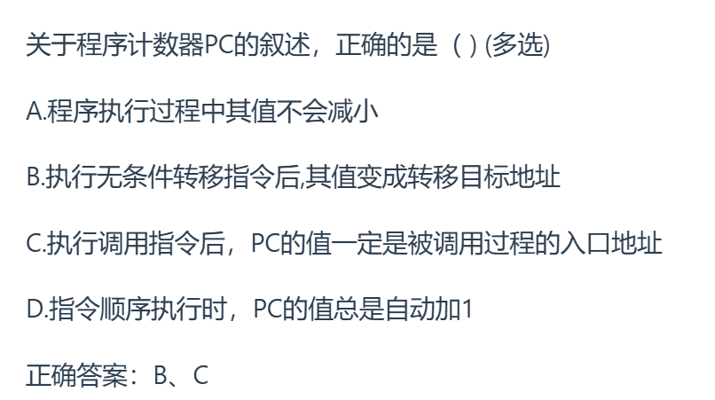

程序计数器（Program Counter，简称PC）是计算机处理器中的一个寄存器，用于存储即将执行的下一条指令的地址。在程序执行过程中，PC的值通常会根据指令的执行情况自动更新，以指向下一条指令的地址。具体来说：

- 当指令顺序执行时，PC的值通常会自动递增，以指向下一条指令的地址，但并不总是加1，因为指令的长度可能不同，可能是1个字节、2个字节或更多。
- 执行无条件转移指令时，PC的值会直接设置为转移目标地址，跳转到指定的指令地址。
- 执行调用指令时，PC的值会设置为被调用过程的入口地址。
- 程序执行过程中，PC的值可以增加或减少，取决于具体的指令和操作。如：返回

# 223.地址转换

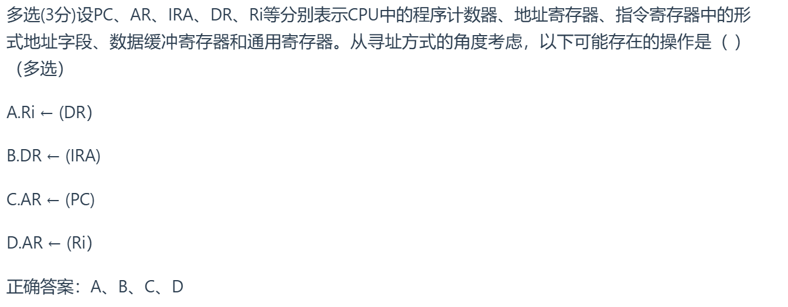

以下是对各个寄存器的简要说明：

- **程序计数器（PC）**：用于存储下一条指令的地址。
- **地址寄存器（AR）**：用于存储当前正在访问的内存单元的地址。
- **指令寄存器（IR）**：用于存储当前正在执行的指令。
- **数据缓冲寄存器（DR）**：用于临时存储从内存中读取或写入的数据。
- **通用寄存器（Ri）**：用于存储数据和地址，是通用的存储单元。

根据寄存器的功能，我们可以分析以下操作的可行性：

- 选项A：`AR ← (PC)`，即将程序计数器的值赋给地址寄存器。这是合理的，因为程序计数器的值是一个地址，可以被存储在地址寄存器中。
- 选项B：`DR ← (IR)`，即将指令寄存器中的形式地址字段赋给数据缓冲寄存器。这是合理的，因为指令寄存器中的形式地址字段可以被解释为一个地址，可以存储在数据缓冲寄存器中。
- 选项C：`Ri ← (DR)`，即将数据缓冲寄存器的值赋给通用寄存器。这是合理的，因为数据缓冲寄存器中的数据可以被存储在通用寄存器中。
- 选项D：`AR ← (Ri)`，即将通用寄存器的值赋给地址寄存器。这是合理的，因为通用寄存器可以存储地址。

因此，从寻址方式的角度考虑，这些操作都是可能的。

# 224.PC

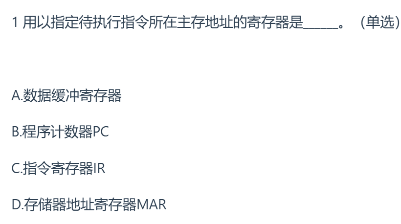

B

# 224.5.

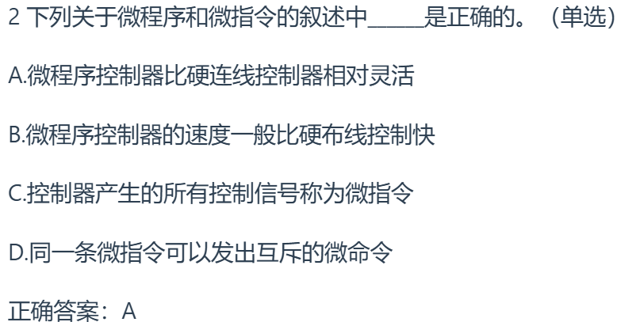

微程序和微指令是计算机控制器设计中的两个重要概念，它们在实现计算机控制功能上有不同的特点和优缺点。


微指令是一组实现特定微操作的控制信号，但并不是控制器产生的所有控制信号都称为微指令。


微程序控制器通过存储在控制存储器中的微指令来产生控制信号，这使得它比硬连线控制器更易于修改和扩展。


由于微程序控制器需要从控制存储器中读取微指令，其速度通常比硬连线控制器慢。


微指令中包含的微命令是同时发出的，如果存在互斥关系，需要通过微指令的顺序执行来实现。


# 微程序和微指令概述

微程序和微指令是计算机体系结构中用于实现控制单元操作的一种方法。它们是微架构级别的概念，特别是在控制复杂指令集时被广泛使用。以下是对它们的详细通俗解释。

------

## **1. 微程序（Microprogram）**

### **定义**

微程序是指控制单元中的一组预定义的指令（称为微指令）的集合，用于实现计算机指令集的操作。它是一种固件，存储在控制存储器中（如ROM或可编程存储器），用来驱动计算机的硬件执行特定的指令。

### **特点**

- 微程序本质上是更底层的程序，用于解释机器指令。
- 每条机器指令被分解成若干微指令，这些微指令按顺序执行，实现该机器指令的功能。
- 微程序存储在控制存储器中，通常不可见。

------

## **2. 微指令（Microinstruction）**

### **定义**

微指令是微程序的基本单元，直接控制计算机硬件的操作。它定义了在一个时钟周期内需要完成的基本操作。

### **作用**

- 控制数据通路的操作。
- 激活必要的控制信号以完成数据传输、运算等。
- 管理寄存器之间的通信。

### **微指令的组成**

微指令通常包含以下字段：

1. **操作字段（Operation Field）：** 指定执行的基本操作（如加法、数据传输等）。
2. **地址字段（Address Field）：** 指示下一条微指令的位置（即微程序控制流的地址）。
3. **控制信号字段（Control Signals）：** 用于激活硬件的具体信号，如控制存储器、ALU、寄存器等。

------

## **微程序与微指令的关系**

- **层级关系：** 微程序由多条微指令组成，微指令是微程序的最小操作单位。
- 运行机制：
  - CPU接收到一条机器指令后，会通过指令译码器生成对应的微程序地址。
  - 控制单元根据这个地址从控制存储器中取出微程序。
  - 按照微指令顺序逐条执行，完成机器指令的操作。

------

## **举例说明**

假设有一条机器指令 `ADD R1, R2, R3`（将寄存器 R2 和 R3 的值相加，结果存入 R1）。

### **机器指令的分解**

1. **译码阶段**：机器指令会映射到一个微程序（例如，地址为1000）。

2. 微程序执行

   ：

   - 微指令1：从寄存器 R2 和 R3 中取数据，并送入ALU输入寄存器。
   - 微指令2：控制ALU执行加法操作。
   - 微指令3：将ALU的结果存入寄存器 R1。

| 微指令序列 | 控制信号         | 说明                 |
| ---------- | ---------------- | -------------------- |
| 1000       | Load R2, Load R3 | 加载 R2 和 R3 到 ALU |
| 1001       | Add              | ALU 执行加法运算     |
| 1010       | Store to R1      | 将结果存入 R1        |

------

## **微程序控制器与硬连线控制器的区别**

| 特性         | 微程序控制器             | 硬连线控制器                 |
| ------------ | ------------------------ | ---------------------------- |
| **实现方式** | 用存储器中的微程序实现   | 用逻辑电路和组合逻辑实现     |
| **灵活性**   | 更灵活，易于修改或扩展   | 不灵活，修改需要改变硬件设计 |
| **速度**     | 较慢（依赖存储器访问）   | 较快（直接由硬件控制）       |
| **复杂性**   | 控制逻辑简单             | 控制逻辑复杂                 |
| **适用范围** | 复杂指令集计算机（CISC） | 精简指令集计算机（RISC）     |

------

## **微程序的优点**

1. **灵活性**：通过修改控制存储器中的微程序，可以轻松更改计算机的指令集或功能。
2. **可维护性**：硬件问题可通过更新微程序修复，而无需更改硬件。
3. **支持复杂指令集**：对复杂指令的分解和实现更加直观。

------

## **总结**

- **微指令**：是硬件操作的最小控制单位，用于激活特定硬件信号。
- **微程序**：是由一组微指令组成的指令，用于解释和执行机器指令。
- **微程序控制器**通过执行微指令驱动硬件完成机器指令的操作。

这种架构主要用于复杂指令集计算机（CISC），如早期的x86处理器，因为它对指令的实现更加灵活。

# 225.微指令寄存器（0不能用）

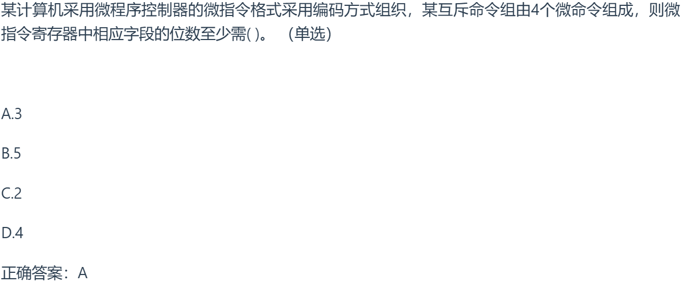

# 226.指令和微指令之间的关系

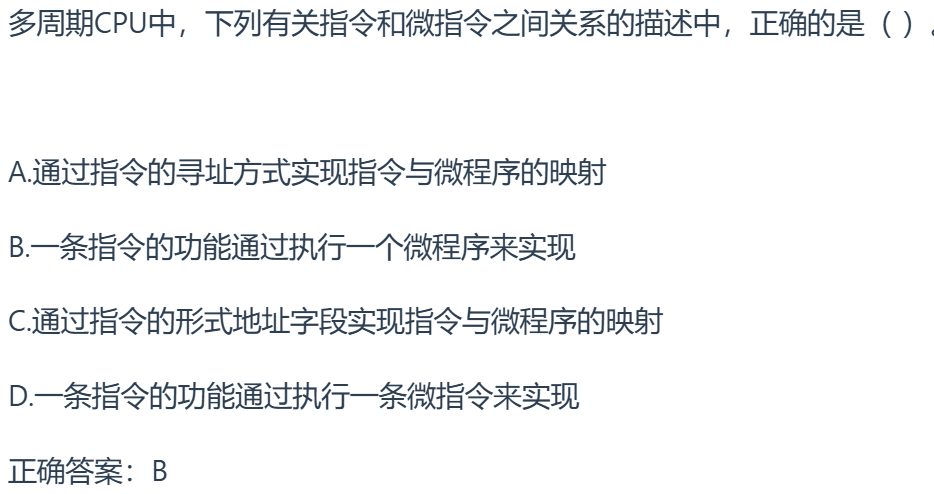

在多周期CPU中，指令和微指令之间的关系可以通过以下几点来理 - 一条指令的功能通常需要通过执行多个微指令来实现，而不是通过单条微指令。微指令是CPU执行指令的最细粒度操作，而一条指令可能包含多个微操作。

- 指令与微程序之间存在映射关系，即每条指令对应一个微程序，这个微程序是由若干条微指令组成的序列，用来完成该指令的功能。
- 指令的寻址方式与微程序的映射关系是通过指令的控制信号实现的，而不是通过指令的形式地址字段。

选项A：一条指令的功能通过执行一条微指令来实现

- 错误。一条指令的功能通常需要通过执行多个微指令来实现，而不是单条微指令。

选项B：一条指令的功能通过执行一个微程序来实现

- 正确。每条指令对应一个微程序，微程序是由若干条微指令组成的序列，用来完成该指令的功能。

选项C：通过指令的寻址方式实现指令与微程序的映射

- 错误。指令与微程序的映射是通过控制信号实现的，而不是通过寻址方式。

选项D：通过指令的形式地址字段实现指令与微程序的映射

- 错误。指令与微程序的映射是**通过控制信号实现**的，而不是通过指令的形式地址字段。

# 227.MIPS32指令架构

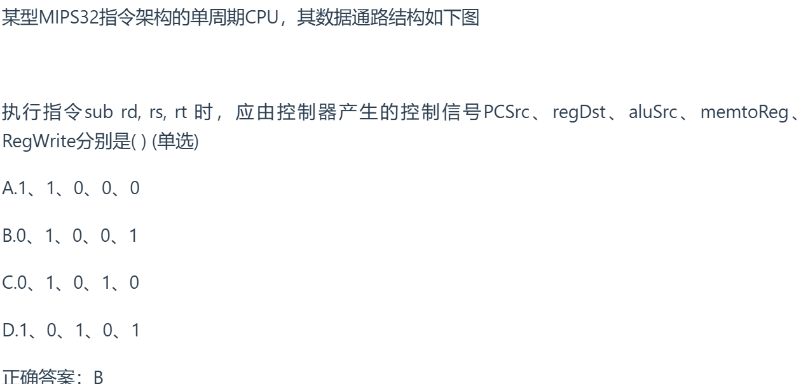

# 228.控制信号的同步方式

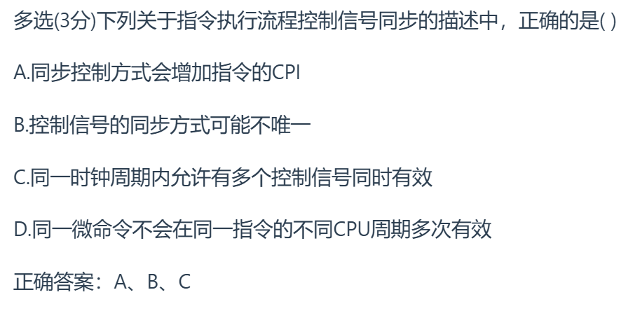

选项A：控制信号的同步方式可能不唯一

- 控制信号的同步方式指的是如何在时钟周期内对控制信号进行同步。由于不同的设计可以选择不同的同步机制，因此控制信号的同步方式可能不唯一。故A正确。

选项B：同步控制方式会增加指令的CPI

- CPI（每指令周期数）是指执行一条指令所需的时钟周期数。同步控制方式可能会引入额外的时钟周期以确保所有控制信号的同步，从而增加CPI。故B正确。

选项C：同一时钟周期内允许有多个控制信号同时有效

- 在一个时钟周期内，多个控制信号可以同时有效，以协调不同操作的执行。因此，C正确。

选项D：同一微命令不会在同一指令的不同CPU周期多次有效

- 微命令在每个CPU周期内可能多次有效，以执行复杂的指令。因此，D错误。

综上所述，选项A、B和C是正确的。

故答案为: ABC

# 229.取指令操作

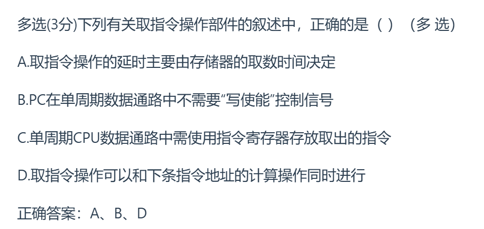

选项A：取指令操作的延时主要由存储器的取数时间决定

取指令操作需要从内存中读取指令，因此其延时主要取决于存储器的访问时间，即取数时间。故A正确。
选项B：取指令操作可以和下条指令地址的计算操作同时进行

在许多现代处理器设计中，取指令操作和下条指令地址的计算操作是并行进行的，以提高指令执行的效率。故B正确。
选项C：单周期CPU数据通路中需使用指令寄存器存放取出的指令

在单周期CPU中，指令寄存器（IR）用于存放当前正在执行的指令。但是，由于单周期CPU在每个周期内只能执行一条指令，所以不需要指令寄存器。故C错误。
选项D：PC在单周期数据通路中不需要“写使能”控制信号

程序计数器（PC）在单周期数据通路中仅需在每个周期开始时递增，以指向下一条指令的地址。因此，不需要“写使能”控制信号。故D正确。

# 230.数据通路

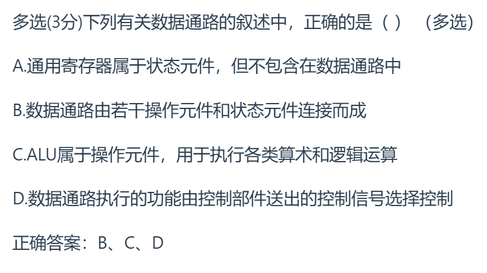

选项A：数据通路由若干操作元件和状态元件连接而成。

- 符合数据通路的定义，故A正确。

选项B：数据通路执行的功能由控制部件送出的控制信号选择控制。

- 控制单元通过控制信号来管理数据通路的操作，故B正确。

选项C：ALU属于操作元件，用于执行各类算术和逻辑运算。

- ALU确实是操作元件，负责执行算术和逻辑运算，故C正确。

选项D：通用寄存器属于状态元件，但不包含在数据通路中。

- 通用寄存器是状态元件，但它确实包含在数据通路中，故D错误。

经过分析，选项A、B、C是正确的描述，而选项D是错误的。

231.

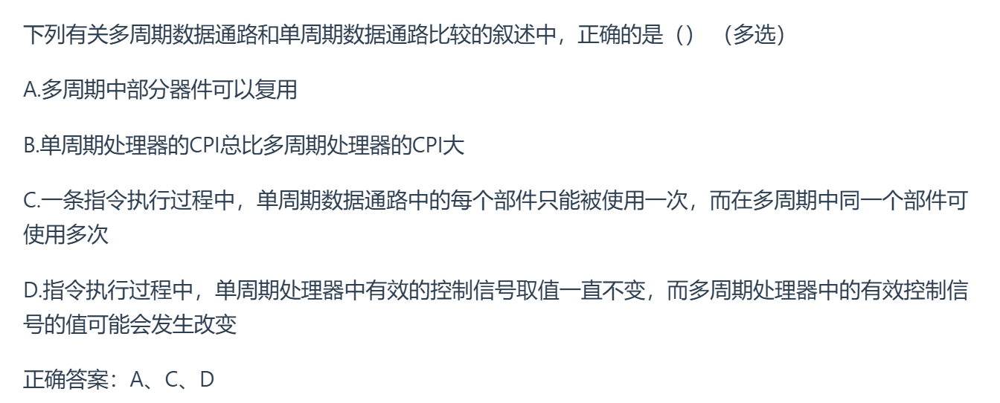

1. **单周期处理器的CPI**：单周期处理器的CPI恒等于1，这意味着每条指令都在一个时钟周期内完成。这种处理器的设计简单，但时钟周期较长，因为必须满足最长时间指令的需求。
2. **多周期处理器的CPI**：多周期处理器的CPI通常大于或等于2，因为指令需要在多个时钟周期内完成。这种设计允许更高效的资源利用和更高的时钟频率，但指令执行时间较长

# 231.MIPS

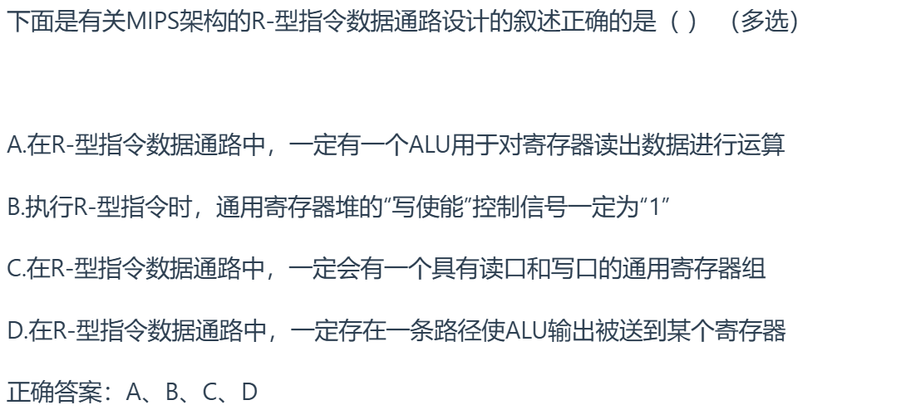